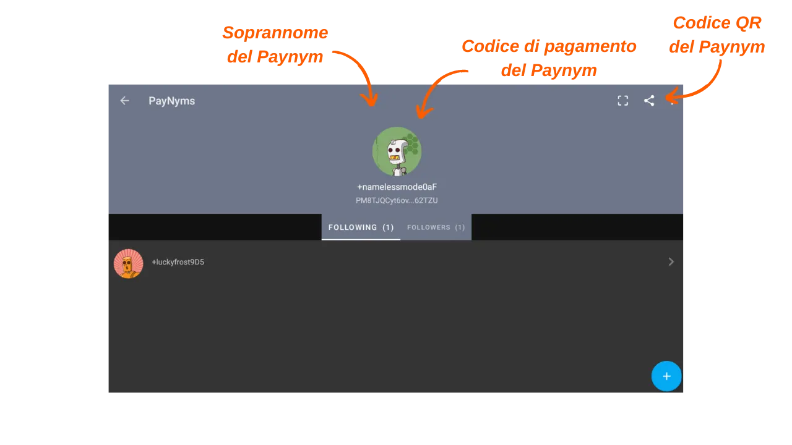

***ATTENZIONE:** A seguito dell'arresto dei fondatori di Samourai Wallet e del sequestro dei loro server il 24 aprile scorso, i Payjoins Stowaway su Samourai Wallet funzionano solo scambiando manualmente i PSBT tra le parti interessate, a condizione che entrambi gli utenti siano collegati al proprio Dojo. Per quanto riguarda Sparrow, i Payjoins tramite BIP78 funzionano ancora. Tuttavia, è possibile che questi strumenti vengano rilanciati nelle prossime settimane. Nel frattempo, puoi sempre consultare questo articolo per comprendere il funzionamento teorico degli Stowaway.*

_Se prevedete di effettuare un Stowaway manualmente, la procedura è molto simile a quella descritta in questo tutorial. La principale differenza risiede nella scelta del tipo di transazione Stowaway: invece di selezionare `Online`, cliccate su `In Person / Manual`. Successivamente, dovrete scambiare manualmente i PSBT per costruire la transazione Stowaway. Se siete fisicamente vicini al vostro collaboratore, potete scansionare i codici QR successivamente. Se siete a distanza, i file JSON possono essere scambiati tramite un canale di comunicazione sicuro. Il resto del tutorial rimane invariato._

_Stiamo seguendo da vicino l'evoluzione di questo caso così come gli sviluppi relativi agli strumenti associati. Siate certi che aggiorneremo questo tutorial non appena saranno disponibili nuove informazioni._

_Questo tutorial è fornito solo a scopo educativo e informativo. Non approviamo né incoraggiamo l'uso di questi strumenti per scopi criminali. È responsabilità di ogni utente rispettare le leggi vigenti nella propria giurisdizione._

---

> *"Costringi gli spie della blockchain a riconsiderare tutto ciò che pensano di sapere."*

Payjoin è una struttura specifica di transazione Bitcoin che migliora la privacy dell'utente durante una spesa collaborando con il destinatario del pagamento. Ci sono diverse implementazioni che facilitano la configurazione e l'automazione di PayJoin. Tra queste implementazioni, la più conosciuta è Stowaway, sviluppata dal team di Samourai Wallet. Questo tutorial spiega come eseguire una transazione Payjoin Stowaway utilizzando l'applicazione Samourai Wallet.

## Come funziona Stowaway?

Come accennato in precedenza, Samourai Wallet offre uno strumento PayJoin chiamato "Stowaway". È accessibile tramite il software Sparrow Wallet su PC o l'applicazione Samourai Wallet su Android. Per eseguire un Payjoin, il destinatario, che agisce anche come collaboratore, deve utilizzare un software compatibile con Stowaway, ovvero Sparrow o Samourai. Questi due software sono interoperabili, consentendo una transazione Stowaway tra un portafoglio Sparrow e un portafoglio Samourai, e viceversa.

Stowaway si basa su una categoria di transazioni che Samourai definisce "Cahoots". Un Cahoot è essenzialmente una transazione collaborativa tra più utenti, che richiede uno scambio di informazioni off-chain. Ad oggi, Samourai offre due strumenti Cahoots: Stowaway (Payjoin) e StonewallX2 (che esploreremo in un futuro articolo).

Le transazioni Cahoots coinvolgono scambi di transazioni parzialmente firmate tra gli utenti. Questo processo può essere lungo e complicato, soprattutto se fatto a distanza. Tuttavia, può ancora essere eseguito manualmente con un altro utente, il che può essere comodo se i collaboratori sono fisicamente vicini. In pratica, ciò comporta lo scambio manuale di cinque codici QR da scansionare successivamente.

Quando viene eseguito a distanza, questo processo diventa troppo complesso. Per affrontare questo problema, Samourai ha sviluppato un protocollo di comunicazione crittografato basato su Tor, chiamato "Soroban". Con Soroban, gli scambi necessari per un Payjoin vengono automatizzati dietro un'interfaccia user-friendly. Questo è il secondo metodo che studieremo in questo articolo.

Questi scambi crittografati richiedono l'instaurazione di una connessione e l'autenticazione tra i partecipanti Cahoots. Le comunicazioni di Soroban si basano quindi sui Paynym degli utenti. Se non sei familiare con i Paynym, ti invito a consultare questo articolo per ulteriori dettagli: [BIP47 - PAYNYM](https://planb.network/tutorials/privacy/paynym-bip47)

Per semplificarlo, un Paynym è un identificatore unico collegato al tuo portafoglio che consente varie funzionalità, tra cui la messaggistica crittografata. Il Paynym è presentato sotto forma di un identificatore e un'illustrazione che rappresenta un robot. Ecco un esempio del mio su Testnet: 

**In sintesi:**
- _Payjoin_ = Struttura specifica di transazioni collaborative;
- _Stowaway_ = Implementazione di Payjoin disponibile su Samourai e Sparrow Wallet;
- _Cahoots_ = Nome dato da Samourai a tutti i loro tipi di transazioni collaborative, inclusa Payjoin Stowaway;
- _Soroban_ = Protocollo di comunicazione crittografato stabilito su Tor, che consente la collaborazione con altri utenti nel contesto di una transazione Cahoots;
- _Paynym_ = Identificatore unico di un portafoglio che consente la comunicazione con un altro utente su Soroban, al fine di effettuare una transazione Cahoots.

[**-> Scopri di più sulle transazioni Payjoin e la loro utilità**](https://planb.network/tutorials/privacy/payjoin)

## Come stabilire una connessione tra Paynym?
Per effettuare una transazione remota Cahoots, nello specifico un PayJoin (Stowaway) tramite Samourai, è necessario "Seguire" l'utente con cui si intende collaborare, utilizzando il loro Paynym. Nel caso di un Stowaway, ciò significa seguire la persona a cui si desidera inviare bitcoin.

**Ecco la procedura per stabilire questa connessione:**

Per iniziare, è necessario ottenere il codice di pagamento del Paynym del destinatario per il Payjoin. Nell'applicazione Samourai Wallet, il destinatario deve toccare l'icona del suo Paynym (il piccolo robot) situata in alto a sinistra dello schermo, e quindi fare clic sul loro nickname Paynym, che inizia con `+...`. Ad esempio, il mio è `+namelessmode0aF`. Se il tuo collaboratore utilizza Sparrow Wallet, ti invito a consultare il nostro tutorial dedicato cliccando qui.

Il tuo collaboratore verrà quindi reindirizzato alla loro pagina Paynym. Da lì, possono condividere le credenziali del loro Paynym con te o condividere il loro codice QR per farti scansionare. Per fare ciò, devono fare clic sull'icona "condividi" situata in alto a destra dello schermo.

Dal tuo lato, avvia l'applicazione Samourai Wallet e accedi al menu "PayNyms" allo stesso modo. Se è la prima volta che utilizzi il tuo Paynym, dovrai ottenere l'identificatore.

Quindi fai clic sul "+" blu in basso a destra dello schermo.

Puoi quindi incollare il codice di pagamento del tuo collaboratore selezionando `INCOLLA IL CODICE DI PAGAMENTO`, o aprire la fotocamera per scansionare il loro codice QR premendo `SCANNERRIZA IL QR CODE`.

Fai clic sul pulsante `AVANTI`.

Conferma facendo clic su `YES`.

Il software ti offrirà quindi un pulsante `CONNETTI`. Non è necessario fare clic su questo pulsante per il nostro tutorial. Questo passaggio è richiesto solo se hai intenzione di effettuare pagamenti all'altro Paynym nell'ambito del BIP47, che non è correlato al nostro tutorial.

Una volta che il Paynym del destinatario è seguito dal tuo Paynym, ripeti questa operazione in direzione opposta in modo che il destinatario ti segua anche. Puoi quindi effettuare un Payjoin.

## Come fare un Payjoin su Samourai Wallet?

Se hai completato questi passaggi preliminari, sei finalmente pronto per effettuare la transazione Payjoin! Per farlo, segui il nostro video tutorial:

**Risorse esterne:**
- https://docs.samourai.io/en/spend-tools#stowaway.
