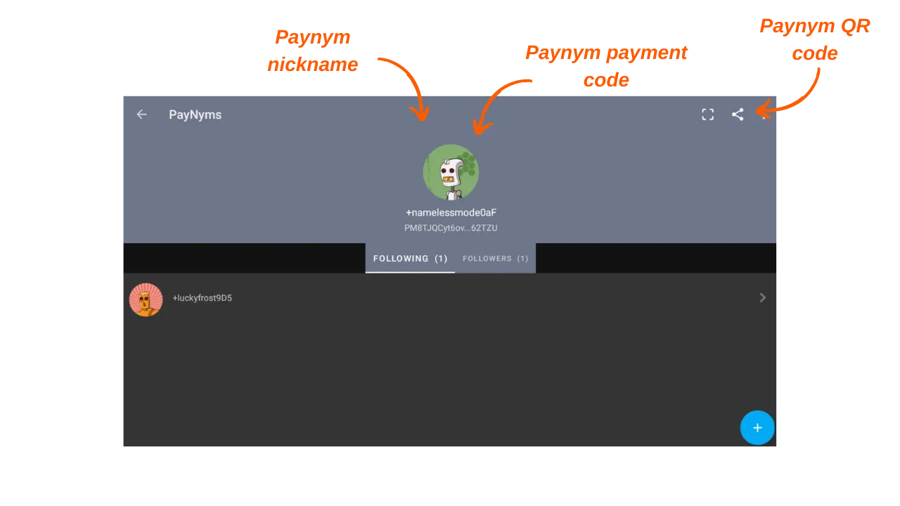

> *"ブロックチェーンのスパイに、彼らが知っていると思っていることを全て再考させる。"*

Payjoinは、支払い受取人と協力して支出時のユーザープライバシーを強化する特定のBitcoin取引構造です。PayJoinの設定と自動化を容易にするいくつかの実装があります。これらの実装の中で最もよく知られているのは、[Samourai Wallet](https://samouraiwallet.com/stowaway)のチームによって開発されたStowawayです。このチュートリアルでは、Samourai Walletアプリケーションを使用してStowaway Payjoin取引を行う方法について説明します。

## Stowawayはどのように機能するのか？

前述のように、Samourai Walletは"Stowaway"と呼ばれるPayJoinツールを提供しています。これはPC上のSparrow WalletソフトウェアまたはAndroid上のSamourai Walletアプリケーションを通じてアクセスできます。Payjoinを実行するには、受取人（協力者としても機能する）がStowawayと互換性のあるソフトウェア、つまりSparrowまたはSamouraiを使用する必要があります。これら2つのソフトウェアは相互運用可能であり、SparrowウォレットとSamouraiウォレット間、またはその逆でStowaway取引を行うことができます。

Stowawayは、Samouraiが"Cahoots"と呼ぶ取引のカテゴリーに依存しています。Cahootは、複数のユーザー間の協力的な取引であり、オフチェーン情報交換を必要とします。現在、Samouraiは2つのCahootsツールを提供しています：Stowaway（Payjoins）とStonewallX2（これについては将来の記事で探求します）。

Cahoots取引は、ユーザー間で部分的に署名された取引の交換を伴います。このプロセスは、特に遠隔で行う場合には長くて煩雑になることがあります。しかし、協力者が物理的に近い場合には、手動で別のユーザーと実行することが便利です。実際には、連続してスキャンするための5つのQRコードを手動で交換することを含みます。

遠隔で行う場合、このプロセスは複雑すぎます。この問題に対処するため、SamouraiはTorに基づいた暗号化通信プロトコルである"Soroban"を開発しました。Sorobanを使用すると、Payjoinに必要な交換がユーザーフレンドリーなインターフェースの背後で自動化されます。これが、この記事で検討する第二の方法です。

これらの暗号化された交換には、Cahoots参加者間の接続と認証の確立が必要です。したがって、Soroban通信は、Cahoots取引を行うために別のユーザーと通信する機能を含む、ウォレットのユニークな識別子であるユーザーのPaynymsに基づいています。Paynymsについて詳しくは、この記事をご覧ください：[BIP47 - PAYNYM](https://planb.network/tutorials/privacy/paynym-bip47)。簡単に言うと、Paynymは、さまざまな機能を可能にするウォレットにリンクされたユニークな識別子であり、暗号化されたメッセージングを含みます。これが、Testnet上の私の例です：

**要約：**
- _Payjoin_ = 協力的な取引の特定の構造；
- _Stowaway_ = SamouraiとSparrow Walletで利用可能なPayjoin実装；
- _Cahoots_ = Samouraiがすべての協力的な取引タイプに与えた名前、Payjoin Stowawayを含む；
- _Soroban_ = Cahoots取引の文脈で他のユーザーとの協力を可能にするTorに基づいた暗号化通信プロトコル；
- _Paynym_ = Cahoots取引を行うためにSoroban上で別のユーザーと通信する機能を持つウォレットのユニークな識別子。
[**-> Payjoin取引とその有用性についてもっと学ぶ**](https://planb.network/tutorials/privacy/payjoin)

## Paynyms間の接続を確立する方法は？

Samouraiを介したPayJoin（Stowaway）としてのリモートCahoots取引を実行するには、意図する協力者のPaynymを「フォロー」する必要があります。Stowawayの場合、これはビットコインを送信したい人をフォローすることを意味します。

**この接続を確立する手順は以下の通りです：**

まず、Payjoinのための受信者のPaynymの支払いコードを取得する必要があります。Samourai Walletアプリケーションでは、受信者は画面の左上にある自分のPaynym（小さなロボットのアイコン）をタップし、`+...`で始まる自分のPaynymニックネームをクリックする必要があります。例えば、私のは`+namelessmode0aF`です。もし協力者がSparrow Walletを使用している場合は、こちらをクリックして専用のチュートリアルを参照してください。

協力者はその後、自分のPaynymページにリダイレクトされます。そこから、Paynymの認証情報を共有するか、QRコードをスキャンしてもらうために共有することができます。これを行うには、画面の右上にある小さな「共有」アイコンをクリックする必要があります。

あなたの側では、Samourai Walletアプリケーションを起動し、同じ方法で「PayNyms」メニューにアクセスします。Paynymを初めて使用する場合は、識別子を取得する必要があります。

次に、画面の右下にある青い「+」をクリックします。

その後、`COLLER LE CODE PAIEMENT`を選択して協力者の支払いコードを貼り付けるか、`SCANNEZ LE CODE QR`を押してカメラを開いてQRコードをスキャンできます。

`SUIVRE`ボタンをクリックします。

`YES`をクリックして確認します。

その後、ソフトウェアは`SE CONNECTER`ボタンを提供します。このチュートリアルでは、このボタンをクリックする必要はありません。このステップは、[BIP47](https://planb.network/tutorials/privacy/paynym-bip47)の一環として他のPaynymに支払いを行う予定がある場合にのみ必要ですが、このチュートリアルとは関係ありません。

受信者のPaynymがあなたのPaynymにフォローされたら、受信者もあなたをフォローするようにこの操作を逆方向で繰り返します。その後、Payjoinを実行できます。

## Samourai WalletでPayjoinを行う方法は？

これらの予備的なステップを完了したら、ついにPayjoin取引を実行する準備が整いました！これを行うには、私たちのビデオチュートリアルに従ってください：

**外部リソース：**
- https://docs.samourai.io/en/spend-tools#stowaway;
- https://samouraiwallet.com/stowaway.