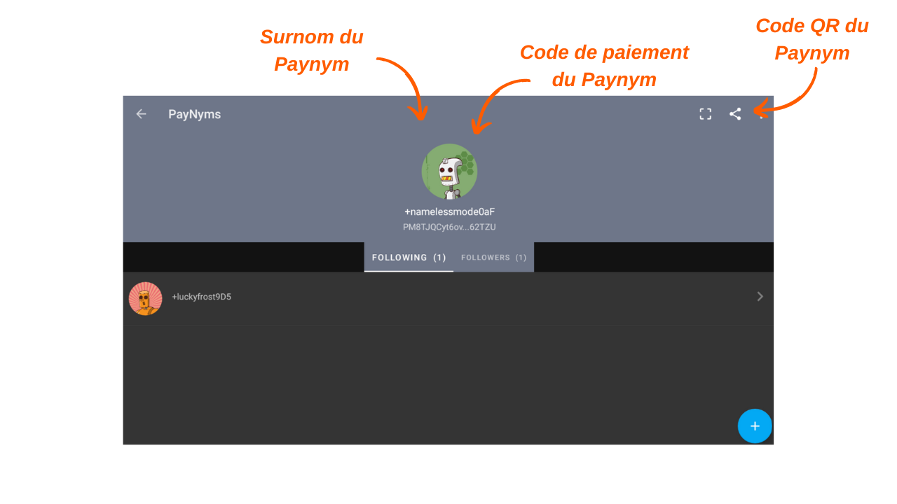

> *"Força os espiões da blockchain a repensarem tudo o que eles pensam que sabem."*

Payjoin é uma estrutura específica de transação Bitcoin que melhora a privacidade do usuário durante um gasto, colaborando com o destinatário do pagamento. Existem várias implementações que facilitam a configuração e automação do PayJoin. Entre essas implementações, a mais conhecida é o Stowaway, desenvolvido pelas equipes do [Samourai Wallet](https://samouraiwallet.com/stowaway). Este tutorial explica como realizar uma transação Payjoin do Stowaway usando o aplicativo Samourai Wallet.

## Como funciona o Stowaway?

Como mencionado anteriormente, o Samourai Wallet oferece uma ferramenta PayJoin chamada "Stowaway". Ela é acessível através do software Sparrow Wallet no PC ou do aplicativo Samourai Wallet no Android. Para realizar um Payjoin, o destinatário, que também atua como colaborador, deve usar um software compatível com o Stowaway, ou seja, Sparrow ou Samourai. Esses dois softwares são interoperáveis, permitindo uma transação Stowaway entre uma carteira Sparrow e uma carteira Samourai, e vice-versa.

O Stowaway se baseia em uma categoria de transações que o Samourai se refere como "Cahoots". Um Cahoot é essencialmente uma transação colaborativa entre vários usuários, exigindo troca de informações off-chain. Até o momento, o Samourai oferece duas ferramentas Cahoots: Stowaway (Payjoins) e StonewallX2 (que exploraremos em um artigo futuro).

As transações Cahoots envolvem trocas de transações parcialmente assinadas entre os usuários. Esse processo pode ser demorado e complicado, especialmente quando feito remotamente. No entanto, ainda pode ser realizado manualmente com outro usuário, o que pode ser conveniente se os colaboradores estiverem fisicamente próximos. Na prática, isso envolve a troca manual de cinco códigos QR para serem escaneados sucessivamente.

Quando feito remotamente, esse processo se torna muito complexo. Para resolver esse problema, o Samourai desenvolveu um protocolo de comunicação criptografada baseado no Tor, chamado "Soroban". Com o Soroban, as trocas necessárias para um Payjoin são automatizadas por trás de uma interface amigável ao usuário. Este é o segundo método que estudaremos neste artigo.

Essas trocas criptografadas exigem o estabelecimento de uma conexão e autenticação entre os participantes do Cahoots. As comunicações do Soroban são baseadas nos Paynyms dos usuários. Se você não está familiarizado com Paynyms, convido você a consultar este artigo para mais detalhes: [BIP47 - PAYNYM](https://planb.network/tutorials/privacy/paynym-bip47).
Simplificando, um Paynym é um identificador único vinculado à sua carteira que permite várias funcionalidades, incluindo mensagens criptografadas. O Paynym é apresentado na forma de um identificador e uma ilustração representando um robô. Aqui está um exemplo do meu no Testnet: 

**Em resumo:**
- _Payjoin_ = Estrutura específica de transações colaborativas;
- _Stowaway_ = Implementação de Payjoin disponível no Samourai e Sparrow Wallet;
- _Cahoots_ = Nome dado pelo Samourai a todos os seus tipos de transações colaborativas, incluindo o Payjoin Stowaway;
- _Soroban_ = Protocolo de comunicação criptografada estabelecido no Tor, permitindo colaboração com outros usuários no contexto de uma transação Cahoots;
- _Paynym_ = Identificador único de uma carteira que permite a comunicação com outro usuário no Soroban, a fim de realizar uma transação Cahoots.
## Como estabelecer uma conexão entre Paynyms?
Para realizar uma transação remota de Cahoots, especificamente um PayJoin (Stowaway) via Samourai, é necessário "Seguir" o usuário com quem você pretende colaborar, usando o Paynym deles. No caso de um Stowaway, isso significa seguir a pessoa para quem você deseja enviar bitcoins.

**Aqui está o procedimento para estabelecer essa conexão:**

Para começar, você precisa obter o código de pagamento do Paynym do destinatário para o Payjoin. No aplicativo Samourai Wallet, o destinatário deve tocar no ícone do seu Paynym (o robozinho) localizado no canto superior esquerdo da tela e, em seguida, clicar no apelido do Paynym, começando com `+...`. Por exemplo, o meu é `+namelessmode0aF`. Se o seu colaborador usar o Sparrow Wallet, convido você a consultar nosso tutorial dedicado clicando aqui.

Seu colaborador será redirecionado para a página do Paynym dele. A partir daí, ele pode compartilhar suas credenciais do Paynym com você ou compartilhar seu código QR para você escanear. Para fazer isso, ele deve clicar no pequeno ícone de "compartilhar" localizado no canto superior direito da tela.

Do seu lado, inicie o aplicativo Samourai Wallet e acesse o menu "PayNyms" da mesma forma. Se esta for a primeira vez que você usa seu Paynym, você precisará obter o identificador.

Em seguida, clique no "+" azul no canto inferior direito da tela.

Você pode colar o código de pagamento do seu colaborador selecionando `COLLER LE CODE PAIEMENT`, ou abrir a câmera para escanear o código QR dele pressionando `SCANNEZ LE CODE QR`.

Clique no botão `SUIVRE`.

Confirme clicando em `YES`.

O software então oferecerá um botão `SE CONNECTER`. Não é necessário clicar neste botão para o nosso tutorial. Esta etapa só é necessária se você planeja fazer pagamentos para o outro Paynym como parte do [BIP47](https://planb.network/tutorials/privacy/paynym-bip47), que não está relacionado ao nosso tutorial.

Uma vez que o Paynym do destinatário seja seguido pelo seu Paynym, repita esta operação na direção oposta para que o destinatário também o siga. Você pode então realizar um Payjoin.

## Como fazer um Payjoin no Samourai Wallet?

Se você concluiu essas etapas preliminares, finalmente está pronto para realizar a transação Payjoin! Para fazer isso, siga nosso tutorial em vídeo:

**Recursos externos:**
- https://docs.samourai.io/en/spend-tools#stowaway;
- https://samouraiwallet.com/stowaway.
