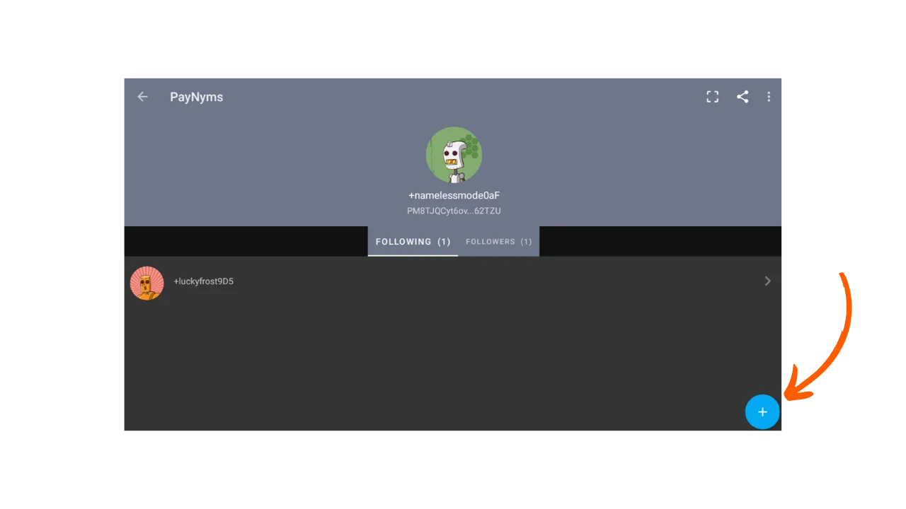
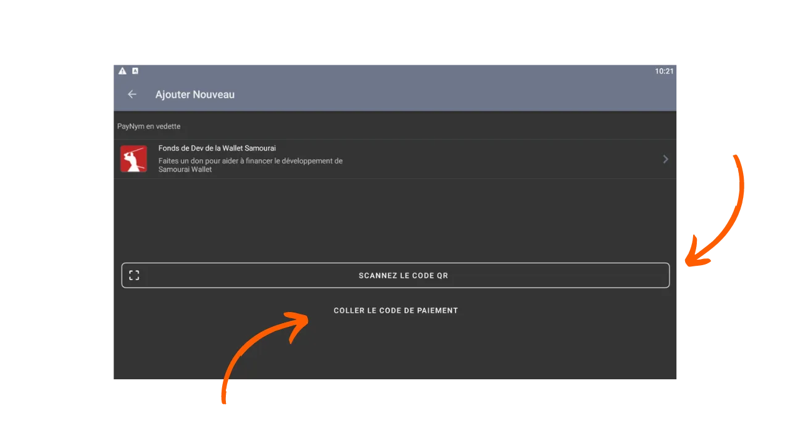
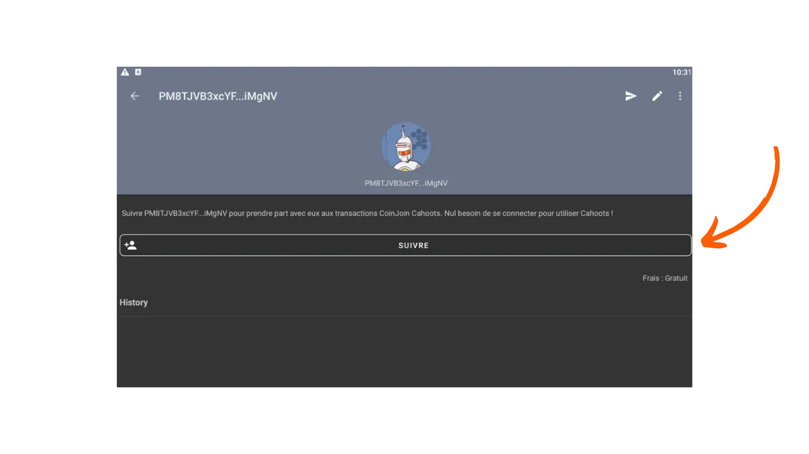
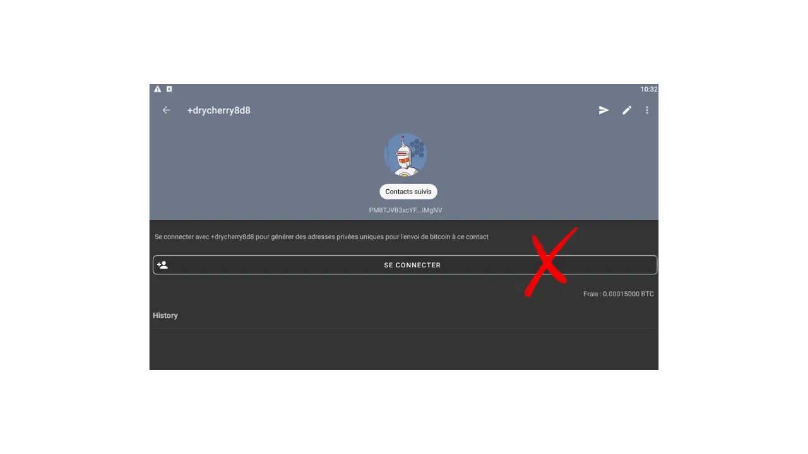

***注意：** 继Samourai Wallet创始人于4月24日被捕，其服务器被查封之后，Samourai Wallet上的Payjoins Stowaway仅能通过手动交换PSBT（Partially Signed Bitcoin Transactions，部分签名的比特币交易）在有关方之间进行，前提是双方用户都连接到自己的Dojo。至于Sparrow，通过BIP78的Payjoins仍然可行。然而，这些工具可能在未来几周内重新启动。与此同时，您仍然可以阅读本文，以理解Stowaway的理论运作方式。*

_如果您计划手动执行Stowaway，程序与本教程描述的非常相似。主要区别在于Stowaway交易类型的选择：不是选择`Online`，而是点击`In Person / Manual`。然后，您需要手动交换PSBT来构建Stowaway交易。如果您与合作者身处近距离，可以依次扫描QR码。如果您相距遥远，可以通过安全的通信渠道交换JSON文件。教程的其余部分保持不变。_

_我们正在密切关注此案件的发展以及与之相关工具的发展情况。请放心，一旦有新信息，我们将更新本教程。_

_本教程仅供教育和信息目的使用。我们不支持或鼓励使用这些工具进行犯罪活动。每个用户都有责任遵守其管辖区内的法律。_

---

> *"迫使区块链间谍重新思考他们认为自己了解的一切。"*

Payjoin是一种特定的比特币交易结构，通过与支付接收者合作，增强用户在支出过程中的隐私。有几种实现促进了PayJoin的设置和自动化。在这些实现中，最著名的是由Samourai Wallet团队开发的Stowaway。本教程解释了如何使用Samourai Wallet应用执行Stowaway Payjoin交易。

## Stowaway是如何工作的？

如前所述，Samourai Wallet提供了一个名为"Stowaway"的PayJoin工具。它可以通过PC上的Sparrow Wallet软件或Android上的Samourai Wallet应用访问。要执行Payjoin，接收者（同时也是合作者）必须使用与Stowaway兼容的软件，即Sparrow或Samourai。这两个软件是互操作的，允许在Sparrow钱包和Samourai钱包之间进行Stowaway交易，反之亦然。

Stowaway依赖于Samourai称之为"Cahoots"的一类交易。Cahoot本质上是多个用户之间的协作交易，需要离线信息交换。到目前为止，Samourai提供了两个Cahoots工具：Stowaway（Payjoins）和StonewallX2（我们将在未来的文章中探讨）。

Cahoots交易涉及用户之间交换部分签名的交易。这个过程可能既长又繁琐，特别是在远程完成时。然而，如果合作者身处近距离，仍然可以手动与另一用户执行，这可能很方便。实际操作中，这涉及手动交换五个QR码，以便依次扫描。
在远程进行时，这个过程变得过于复杂。为了解决这个问题，Samourai开发了一个基于Tor的加密通信协议，称为“Soroban”。通过Soroban，为Payjoin所需的交换过程在用户友好界面后自动化。这是我们将在本文中研究的第二种方法。
这些加密交换需要在Cahoots参与者之间建立连接和认证。因此，Soroban通信基于用户的Paynyms。如果你不熟悉Paynyms，我邀请你查阅这篇文章以获取更多详情：[BIP47 - PAYNYM](https://planb.network/tutorials/privacy/paynym-bip47)。
简单来说，Paynym是一个与你的钱包链接的独特标识符，允许进行各种功能，包括加密消息。Paynym以标识符和代表机器人的插图形式呈现。这是我在Testnet上的一个例子：

**总结：**
- _Payjoin_ = 合作交易的特定结构；
- _Stowaway_ = 在Samourai和Sparrow Wallet上可用的Payjoin实现；
- _Cahoots_ = Samourai给予他们所有类型合作交易的名称，包括Payjoin Stowaway；
- _Soroban_ = 建立在Tor上的加密通信协议，允许在Cahoots交易的背景下与其他用户合作；
- _Paynym_ = 钱包的独特标识符，允许与Soroban上的另一个用户通信，以进行Cahoots交易。

[**-> 了解更多关于Payjoin交易及其用途**](https://planb.network/tutorials/privacy/payjoin)

## 如何建立Paynyms之间的连接？

为了远程进行Cahoots交易，特别是通过Samourai进行PayJoin（Stowaway），需要使用他们的Paynym“关注”你打算合作的用户。在Stowaway的情况下，这意味着关注你想要发送比特币的人。

**以下是建立此连接的程序：**

首先，你需要获取Payjoin的接收者Paynym的支付代码。在Samourai Wallet应用中，接收者必须点击屏幕左上角的他们的Paynym（小机器人）图标，然后点击以`+...`开头的他们的Paynym昵称。例如，我的是`+namelessmode0aF`。如果你的合作者使用Sparrow Wallet，我邀请你通过点击这里查看我们的专用教程。

你的合作者将被重定向到他们的Paynym页面。从那里，他们可以与你分享他们的Paynym凭据或分享他们的QR码供你扫描。为此，他们必须点击屏幕右上角的小“分享”图标。

在你这边，启动你的Samourai Wallet应用并以同样的方式访问“PayNyms”菜单。如果这是你第一次使用你的Paynym，你将需要获取标识符。

然后点击屏幕右下角的蓝色“+”。

然后，您可以通过选择`COLLER LE CODE PAIEMENT`粘贴您合作者的支付代码，或者通过按下`SCANNEZ LE CODE QR`打开相机扫描他们的二维码。
点击`SUIVRE`按钮。

点击`YES`确认。

接下来，软件将提供一个`SE CONNECTER`按钮。对于我们的教程来说，点击这个按钮不是必需的。这一步骤只有在您计划作为[BIP47](https://planb.network/tutorials/privacy/paynym-bip47)的一部分向另一个Paynym进行支付时才需要。

一旦接收者的Paynym被您的Paynym关注，就重复这个操作，反方向进行，以便接收者也关注您。然后，您可以执行Payjoin交易。

## 如何在Samourai Wallet上进行Payjoin交易？

如果您已完成这些初步步骤，您终于可以进行Payjoin交易了！要做到这一点，请按照我们的视频教程操作：

**外部资源：**
- https://docs.samourai.io/en/spend-tools#stowaway.