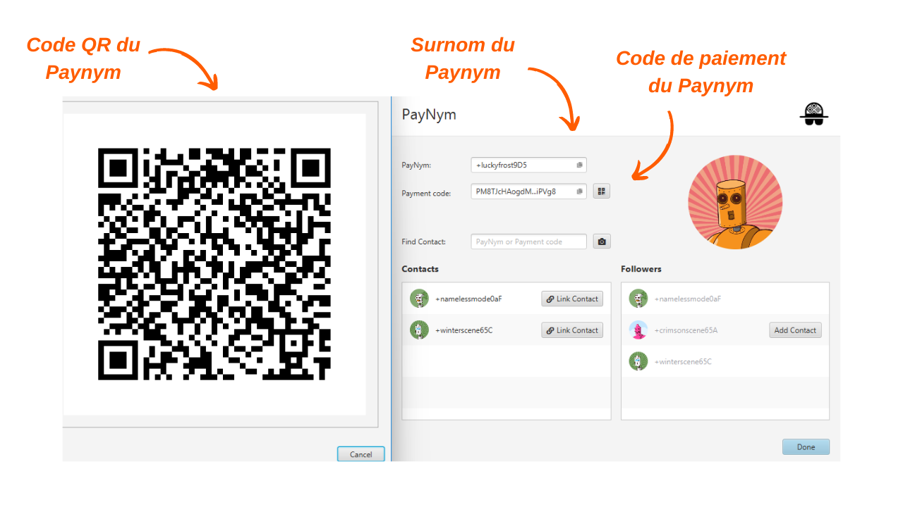
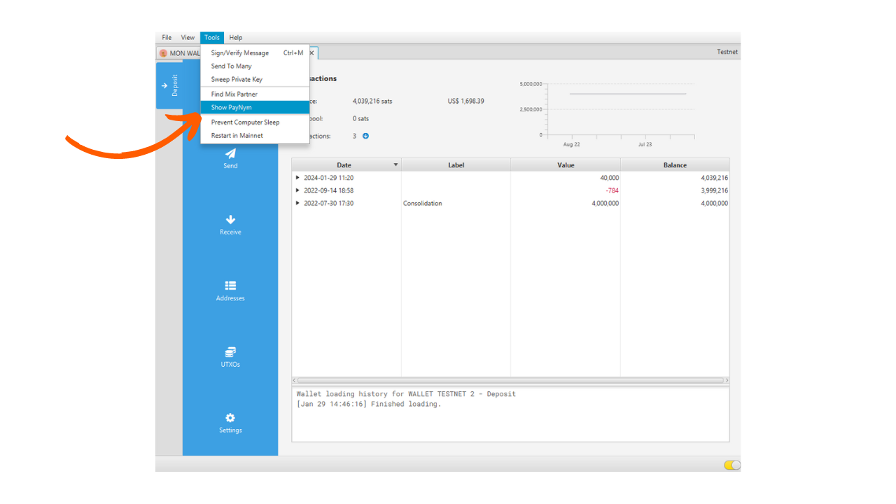
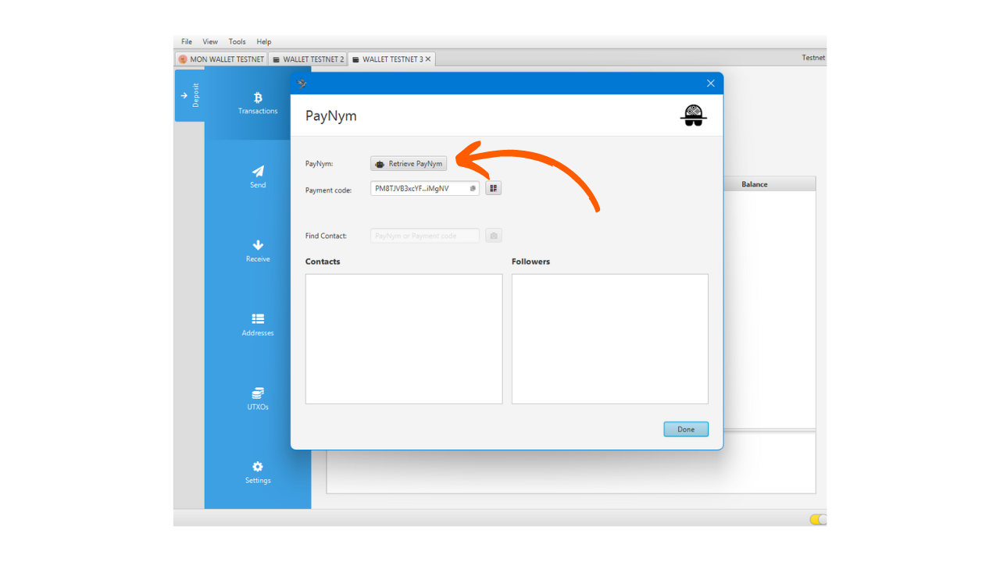
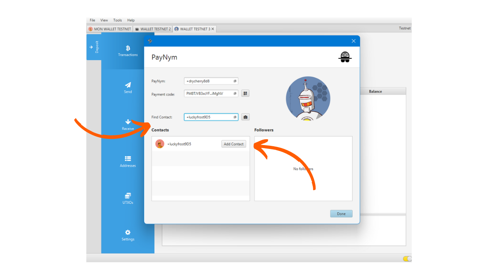

> *"Force blockchain spies to rethink everything they think they know."*

Le Payjoin est une structure spécifique de transaction Bitcoin qui permet d'améliorer la confidentialité des utilisateurs lors d'une dépense en collaborant avec le destinataire du paiement. Il existe plusieurs implémentations qui permettent de faciliter la mise en place d'un PayJoin et d'automatiser son opération. Parmi ces implémentation, la plus connue est Stowaway développée par les équipes de [Samourai Wallet](https://samouraiwallet.com/stowaway). Ce tutoriel est destiné à vous guider dans la réalisation d'une transaction Payjoin Stowaway via le logiciel Sparrow Wallet.

## Comment fonctionne Stowaway ?

Comme évoqué précédemment, Samourai Wallet offre un outil de PayJoin dénommé « _Stowaway_ ». Il est accessible via le logiciel Sparrow Wallet sur PC, ou via l'application Samourai Wallet sur Android. Pour effectuer un Payjoin, le destinataire, qui joue aussi le rôle de collaborateur, doit utiliser un logiciel compatible avec Stowaway, à savoir Sparrow ou Samourai. Ces deux logiciels sont interopérables, ce qui permet de réaliser une transaction Stowaway d'un portefeuille Sparrow vers un portefeuille Samourai, et vice-versa.

Stowaway s'appuie sur une catégorie de transactions que Samourai nomme les « _Cahoots_ ». Un Cahoot est en fait une transaction collaborative entre plusieurs utilisateurs, nécessitant un échange d'informations hors de la blockchain Bitcoin. À ce jour, Samourai propose deux outils de Cahoots : Stowaway (les Payjoins) et StonewallX2 (que nous découvrirons dans un prochain article).

Les transactions Cahoots requièrent des échanges de transactions partiellement signées entre utilisateurs. Ce processus peut s'avérer long et contraignant, particulièrement à distance. Néanmoins, il reste réalisable manuellement avec un autre utilisateur, ce qui est pratique si les collaborateurs sont physiquement proches. En pratique, cela implique l'échange manuel de cinq codes QR à scanner successivement.

À distance, ce procédé devient trop complexe. Pour résoudre ce problème, Samourai a mis au point un protocole de communication chiffré basé sur Tor, baptisé « _Soroban_ ». Avec Soroban, les échanges nécessaires à un Payjoin se font automatiquement, derrière une interface utilisateur conviviale. Ces cette seconde méthode que nous allons étudier dans cet article.

Ces échanges chiffrés exigent d'établir une connexion et une authentification entre les participants des Cahoots. Les communications Soroban s'appuient donc sur les Paynyms des utilisateurs. Si vous n'êtes pas familier avec les Paynyms, je vous invite à consulter cet article pour plus de détails : [BIP47 - PAYNYM](https://planb.network/tutorials/privacy/paynym-bip47).

Pour faire simple, un Paynym est un identifiant unique lié à votre portefeuille, qui permettent diverses fonctionnalités, dont des échanges de messages chiffrés. Le Paynym se présente sous la forme d'un identifiant et d'une illustration représentant un robot. Voici, à titre d'exemple, le mien sur le Testnet :

**Pour résumer :**
- *Payjoin* = Structure spécifique de transaction collaborative ;
- *Stowaway* = Implémentation de Payjoin disponible sur Samourai et Sparrow Wallet ;
- *Cahoots* = Nom donné par Samourai à tous leurs types de transactions collaboratives, notamment les Payjoin Stowaway ;
- *Soroban* = Protocole de communication chiffré établi sur Tor permettant de collaborer avec d'autres utilisateurs dans le cadre d'une transaction Cahoots.
- *Paynym* = Identifiant unique d'un portefeuille permettant d'établir une communication avec un autre utilisateur sur Soroban, en vue d'effectuer une transaction Cahoots. 

## Comment établir une connexion entre Paynyms ?

Pour réaliser une transaction Cahoots à distance, notamment un PayJoin (Stowaway) via Samourai ou Sparrow, il est nécessaire de « _Suivre_ » l'utilisateur avec qui vous envisagez de collaborer, en utilisant son Paynym. Dans le cas d'un Stowaway, il s'agit de suivre la personne à laquelle vous désirez envoyer des bitcoins.

**Voici la procédure pour établir cette connexion :**

Tout d'abord, il vous faut obtenir l'identifiant du Paynym du destinataire. Cela peut être fait en utilisant son surnom ou son code de paiement. Pour ce faire, depuis le portefeuille Sparrow du destinataire, sélectionnez l'onglet `Tools`, puis cliquez sur `Show PayNym`.

De votre côté, ouvrez votre portefeuille Sparrow Wallet et accédez au même menu `Show PayNym`. Si vous utilisez votre Paynym pour la première fois, il vous faudra obtenir un identifiant en cliquant sur `Retrieve PayNym`.

Saisissez ensuite l'identifiant du Paynym de votre collaborateur (soit son surnom `+...`, soit son code de paiement `PM...`) dans la case `Find Contact`, puis cliquez sur le bouton `Add Contact`.

Le logiciel vous proposera alors un bouton `Link Contact`. Il n'est pas nécessaire de cliquer sur ce bouton pour notre tutoriel. Cette étape est nécessaire uniquement si vous envisagez d'effectuer des paiements vers le Paynym indiqué dans le cadre du [BIP47](https://planb.network/tutorials/privacy/paynym-bip47), ce qui n'a rien à voir avec notre tutoriel.

Une fois le Paynym du destinataire connecté à votre Paynym, vous pouvez effectuer un Payjoin.

## Comment faire un Payjoin sur Sparrow Wallet ?

