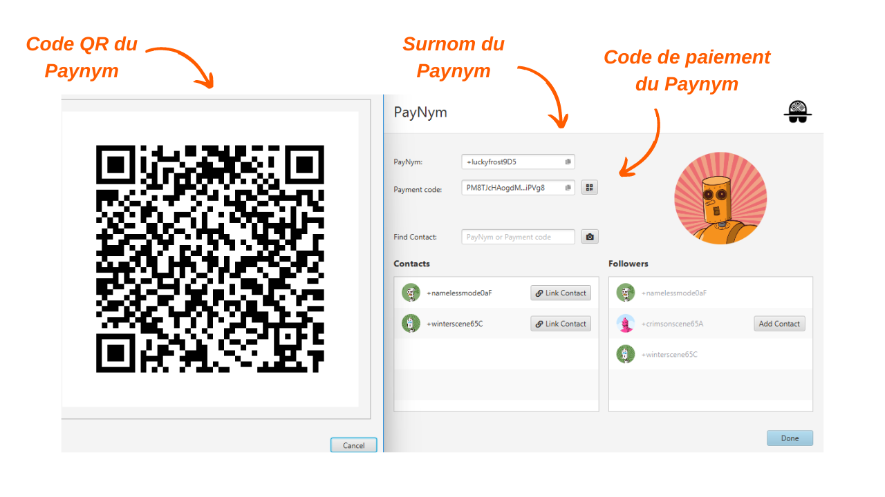

> *"Zwingen Sie Blockchain-Spione dazu, alles, was sie zu wissen glauben, neu zu überdenken."*

Payjoin ist eine spezifische Bitcoin-Transaktionsstruktur, die die Privatsphäre des Benutzers beim Ausgeben verbessert, indem sie mit dem Zahlungsempfänger zusammenarbeitet. Es gibt mehrere Implementierungen, die die Einrichtung und Automatisierung von PayJoin ermöglichen. Unter diesen Implementierungen ist die bekannteste Stowaway, entwickelt vom [Samourai Wallet](https://samouraiwallet.com/stowaway)-Team. Dieses Tutorial soll Sie durch den Prozess einer Stowaway Payjoin-Transaktion mit der Sparrow Wallet-Software führen.

## Wie funktioniert Stowaway?

Wie bereits erwähnt, bietet Samourai Wallet ein PayJoin-Tool namens "Stowaway" an. Es ist über die Sparrow Wallet-Software auf dem PC oder die Samourai Wallet-Anwendung auf Android zugänglich. Um eine Payjoin-Transaktion durchzuführen, muss der Zahlungsempfänger, der auch als Kollaborateur fungiert, eine Software verwenden, die mit Stowaway kompatibel ist, nämlich Sparrow oder Samourai Wallet. Diese beiden Software sind interoperabel und ermöglichen Stowaway-Transaktionen zwischen einer Sparrow Wallet und einer Samourai Wallet, und umgekehrt.

Stowaway basiert auf einer Kategorie von Transaktionen, die Samourai als "Cahoots" bezeichnet. Ein Cahoot ist im Wesentlichen eine kollaborative Transaktion zwischen mehreren Benutzern, die einen Informationsaustausch außerhalb der Blockchain erfordert. Derzeit bietet Samourai zwei Cahoots-Tools an: Stowaway (Payjoins) und StonewallX2 (die wir in einem zukünftigen Artikel erkunden werden).

Cahoots-Transaktionen beinhalten den Austausch teilweise signierter Transaktionen zwischen Benutzern. Dieser Prozess kann langwierig und umständlich sein, insbesondere wenn er remote durchgeführt wird. Es kann jedoch immer noch manuell mit einem anderen Benutzer durchgeführt werden, was praktisch sein kann, wenn die Kollaborateure physisch nahe beieinander sind. In der Praxis beinhaltet dies den manuellen Austausch von fünf QR-Codes, die nacheinander gescannt werden müssen.

Bei der Remote-Durchführung wird dieser Prozess zu komplex. Um dieses Problem zu lösen, hat Samourai ein verschlüsseltes Kommunikationsprotokoll namens "Soroban" entwickelt, das auf Tor basiert. Mit Soroban werden die für eine Payjoin erforderlichen Austausche automatisiert und durch eine benutzerfreundliche Oberfläche unterstützt. Dies ist die zweite Methode, die wir in diesem Artikel erkunden werden.

Diese verschlüsselten Austausche erfordern den Aufbau einer Verbindung und Authentifizierung zwischen den Cahoots-Teilnehmern. Die Soroban-Kommunikation basiert auf den Paynyms der Benutzer. Wenn Sie mit Paynyms nicht vertraut sind, lade ich Sie ein, diesen Artikel für weitere Details zu lesen: [BIP47 - PAYNYM](https://planb.network/tutorials/privacy/paynym-bip47).
Einfach ausgedrückt ist ein Paynym eine eindeutige Kennung, die mit Ihrer Wallet verknüpft ist und verschiedene Funktionen ermöglicht, einschließlich verschlüsselter Kommunikation. Der Paynym wird in Form einer Kennung und einer Illustration, die einen Roboter darstellt, präsentiert. Hier ist ein Beispiel für meinen auf dem Testnetzwerk: 

**Zusammenfassend:**
- *Payjoin* = Spezifische Struktur einer kollaborativen Transaktion;
- *Stowaway* = Payjoin-Implementierung, verfügbar auf Samourai und Sparrow Wallet;
- *Cahoots* = Name, den Samourai allen ihren Arten von kollaborativen Transaktionen gibt, einschließlich Payjoin Stowaway;
- *Soroban* = Verschlüsseltes Kommunikationsprotokoll, das auf Tor basiert und die Zusammenarbeit mit anderen Benutzern im Rahmen einer Cahoots-Transaktion ermöglicht.
- *Paynym* = Eindeutige Kennung einer Wallet, die die Kommunikation mit einem anderen Benutzer über Soroban ermöglicht, um eine Cahoots-Transaktion durchzuführen.

## Wie stellt man eine Verbindung zwischen Paynyms her?
Um eine Remote-Cahoots-Transaktion durchzuführen, insbesondere eine PayJoin (Stowaway) über Samourai oder Sparrow, ist es erforderlich, den Benutzer, mit dem Sie zusammenarbeiten möchten, über ihren Paynym zu "folgen". Im Falle eines Stowaway bedeutet dies, der Person, an die Sie Bitcoins senden möchten, zu folgen.
**Hier ist das Verfahren zur Herstellung dieser Verbindung:**

Zunächst müssen Sie die Paynym-Kennung des Empfängers erhalten. Dies kann mit ihrem Spitznamen oder Zahlungscode erfolgen. Gehen Sie dazu von der Sparrow-Brieftasche des Empfängers aus zum Tab "Tools" und klicken Sie dann auf "Show PayNym".

Auf Ihrer Seite öffnen Sie Ihre Sparrow-Brieftasche und greifen auf das gleiche Menü "Show PayNym" zu. Wenn Sie Ihren Paynym zum ersten Mal verwenden, müssen Sie eine Kennung erhalten, indem Sie auf "Retrieve PayNym" klicken.

Geben Sie anschließend die Paynym-Kennung Ihres Mitarbeiters (entweder ihren Spitznamen `+...` oder ihren Zahlungscode `PM...`) in das Feld "Find Contact" ein und klicken Sie dann auf die Schaltfläche "Add Contact".

Die Software bietet Ihnen dann eine Schaltfläche "Link Contact" an. Für unser Tutorial ist es nicht erforderlich, auf diese Schaltfläche zu klicken. Dieser Schritt ist nur erforderlich, wenn Sie Zahlungen an den im Zusammenhang mit [BIP47](https://planb.network/tutorials/privacy/paynym-bip47) angegebenen Paynym vornehmen möchten, was nichts mit unserem Tutorial zu tun hat.

Sobald der Paynym des Empfängers von Ihrem Paynym aus gefolgt wird, wiederholen Sie diesen Vorgang in umgekehrter Richtung, damit Ihr Empfänger Ihnen ebenfalls folgt. Sie können dann einen Payjoin durchführen.

## Wie führt man einen Payjoin in der Sparrow-Brieftasche durch?
Wenn Sie diese wenigen vorbereitenden Schritte abgeschlossen haben, sind Sie endlich bereit, die Payjoin-Transaktion durchzuführen! Befolgen Sie dazu unser Video-Tutorial:

**Externe Ressourcen:**
- https://docs.samourai.io/en/spend-tools#stowaway ;
- https://sparrowwallet.com/docs/spending-privately.html.