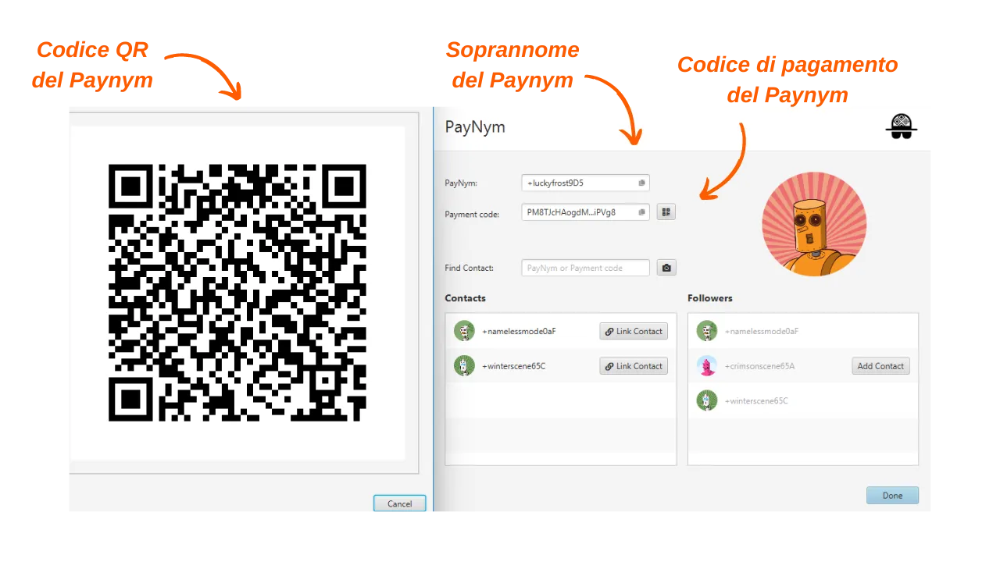

_**ATTENZIONE:** A seguito dell'arresto dei fondatori di Samourai Wallet e del sequestro dei loro server il 24 aprile, i Payjoins Stowaway su Samourai Wallet ora funzionano solo scambiando manualmente i PSBT tra le parti coinvolte, a condizione che entrambi gli utenti siano collegati al proprio Dojo. Per quanto riguarda Sparrow, i Payjoins tramite BIP78 funzionano ancora. Tuttavia, è possibile che questi strumenti vengano riattivati nelle prossime settimane. Nel frattempo, puoi sempre leggere questo articolo per comprendere il funzionamento teorico dei payjoins._

_Stiamo seguendo da vicino l'evoluzione di questo caso così come gli sviluppi relativi agli strumenti associati. Siate certi che aggiorneremo questo tutorial non appena saranno disponibili nuove informazioni._

_Questo tutorial è fornito solo a scopo educativo e informativo. Non approviamo né incoraggiamo l'uso di questi strumenti per scopi criminali. È responsabilità di ogni utente rispettare le leggi vigenti nella propria giurisdizione._

---

> *"Costringi gli spioni della blockchain a riconsiderare tutto ciò che pensano di sapere."*

Payjoin è una struttura specifica di transazione Bitcoin che migliora la privacy dell'utente durante la spesa collaborando con il destinatario del pagamento. Ci sono diverse implementazioni che facilitano la configurazione e l'automazione di PayJoin. Tra queste implementazioni, la più conosciuta è Stowaway sviluppata dal team di Samourai Wallet. Questo tutorial ha lo scopo di guidarti nel processo di effettuazione di una transazione Payjoin Stowaway utilizzando il software Sparrow Wallet.

## Come funziona Stowaway?

Come accennato in precedenza, Samourai Wallet offre uno strumento PayJoin chiamato "Stowaway". È accessibile tramite il software Sparrow Wallet su PC o l'applicazione Samourai Wallet su Android. Per effettuare un Payjoin, il destinatario, che agisce anche come collaboratore, deve utilizzare un software compatibile con Stowaway, ovvero Sparrow o Samourai Wallet. Questi due software sono interoperabili, consentendo transazioni Stowaway tra un portafoglio Sparrow e un portafoglio Samourai, e viceversa.

Stowaway si basa su una categoria di transazioni che Samourai definisce "Cahoots". Un Cahoot è essenzialmente una transazione collaborativa tra più utenti che richiede uno scambio di informazioni off-chain. Attualmente, Samourai offre due strumenti Cahoots: Stowaway (Payjoin) e StonewallX2 (che esploreremo in un articolo futuro).

Le transazioni Cahoots prevedono lo scambio di transazioni parzialmente firmate tra gli utenti. Questo processo può essere lungo e complicato, soprattutto se fatto a distanza. Tuttavia, può ancora essere fatto manualmente con un altro utente, il che può essere comodo se i collaboratori sono fisicamente vicini. In pratica, ciò comporta lo scambio manuale di cinque codici QR da scansionare successivamente.

Quando fatto a distanza, questo processo diventa troppo complesso. Per affrontare questo problema, Samourai ha sviluppato un protocollo di comunicazione crittografato basato su Tor, chiamato "Soroban". Con Soroban, gli scambi necessari per un Payjoin vengono automatizzati dietro un'interfaccia user-friendly. Questo è il secondo metodo che esploreremo in questo articolo.

Questi scambi crittografati richiedono l'instaurazione di una connessione e l'autenticazione tra i partecipanti Cahoots. Le comunicazioni di Soroban si basano sui Paynym degli utenti. Se non sei familiare con i Paynym, ti invito a fare riferimento a questo articolo per ulteriori dettagli: [BIP47 - PAYNYM](https://planb.network/tutorials/privacy/paynym-bip47).
Per semplificarlo, un Paynym è un identificatore unico collegato al tuo portafoglio che consente varie funzionalità, inclusa la messaggistica crittografata. Il Paynym è presentato sotto forma di un identificatore e un'illustrazione che rappresenta un robot. Ecco un esempio del mio su Testnet: 

**In sintesi:**
- *Payjoin* = Struttura specifica di transazione collaborativa;
- *Stowaway* = Implementazione di Payjoin disponibile su Samourai e Sparrow Wallet;
- *Cahoots* = Nome dato da Samourai a tutti i loro tipi di transazioni collaborative, inclusa Payjoin Stowaway;
- *Soroban* = Protocollo di comunicazione crittografato stabilito su Tor, che consente la collaborazione con altri utenti nel contesto di una transazione Cahoots.
- *Paynym* = Identificatore unico di un portafoglio che consente la comunicazione con un altro utente su Soroban, al fine di effettuare una transazione Cahoots.

[**-> Scopri di più sulle transazioni Payjoin e la loro utilità**](https://planb.network/tutorials/privacy/payjoin)

## Come stabilire una connessione tra Paynyms?
Per effettuare una transazione remota Cahoots, nello specifico un PayJoin (Stowaway) tramite Samourai o Sparrow, è necessario "Seguire" l'utente con cui si intende collaborare, utilizzando il loro Paynym. Nel caso di uno Stowaway, ciò significa seguire la persona a cui si desidera inviare bitcoin.
**Ecco la procedura per stabilire questa connessione:**

Innanzitutto, è necessario ottenere l'identificatore Paynym del destinatario. Ciò può essere fatto utilizzando il loro nickname o il codice di pagamento. Per farlo, dal portafoglio Sparrow del destinatario, selezionare la scheda `Strumenti`, quindi fare clic su `Mostra PayNym`.

Dal tuo lato, apri il tuo portafoglio Sparrow e accedi allo stesso menu `Mostra PayNym`. Se stai utilizzando il tuo Paynym per la prima volta, dovrai ottenere un identificatore facendo clic su `Recupera PayNym`.

Successivamente, inserisci l'identificatore Paynym del tuo collaboratore (sia il loro nickname `+...` che il loro codice di pagamento `PM...`) nella casella `Trova contatto`, quindi fai clic sul pulsante `Aggiungi contatto`.

Il software ti offrirà quindi un pulsante `Collega contatto`. Non è necessario fare clic su questo pulsante per il nostro tutorial. Questo passaggio è necessario solo se hai intenzione di effettuare pagamenti al Paynym indicato nel contesto di [BIP47](https://planb.network/tutorials/privacy/paynym-bip47), che non è correlato al nostro tutorial.

Una volta che il Paynym del destinatario è seguito dal tuo Paynym, ripeti questa operazione in direzione opposta in modo che anche il destinatario ti segua. A questo punto puoi effettuare un Payjoin.

## Come effettuare un Payjoin su Sparrow Wallet?
Se hai completato questi pochi passaggi preliminari, sei finalmente pronto per effettuare la transazione Payjoin! Per farlo, segui il nostro tutorial video:

**Risorse esterne:**
- https://docs.samourai.io/en/spend-tools#stowaway ;
- https://sparrowwallet.com/docs/spending-privately.html.
