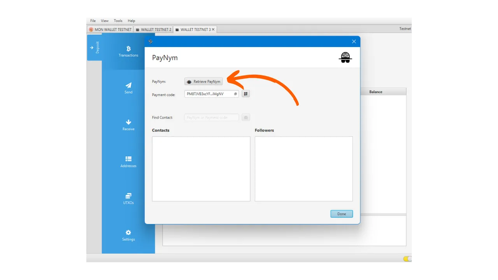
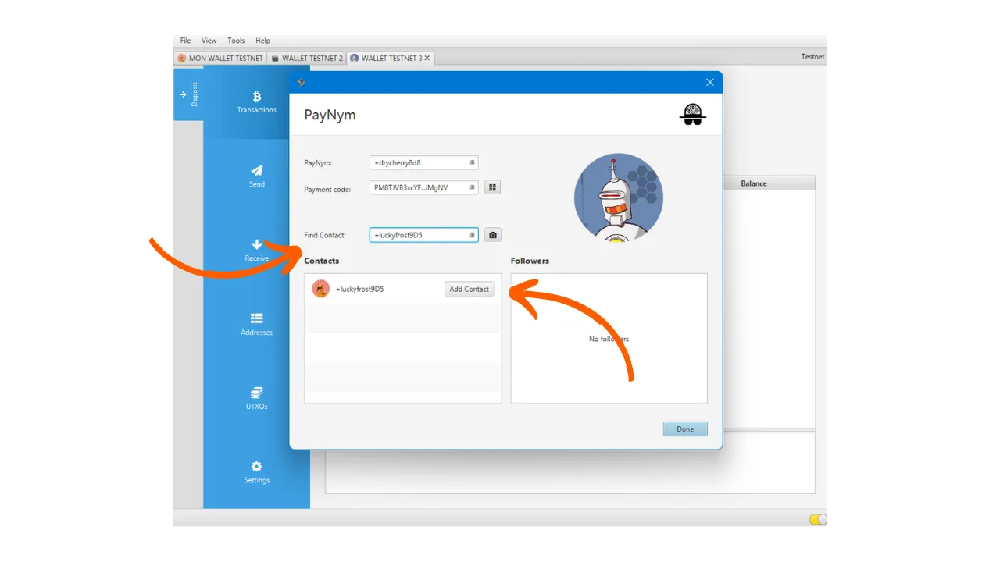

_**警告：** 随着Samourai Wallet创始人在4月24日被逮捕以及他们的服务器被查封，Samourai Wallet上的Payjoins Stowaway现在只能通过手动交换PSBT来工作，前提是两个用户都连接到自己的Dojo。至于Sparrow，通过BIP78的Payjoins仍然有效。然而，这些工具可能会在未来几周重新启动。与此同时，您仍然可以阅读本文以了解payjoins的理论运作方式。_

_我们正在密切关注此案件以及相关工具的发展情况。请放心，一旦有新信息，我们将更新本教程。_

_本教程仅供教育和信息目的提供。我们不支持或鼓励使用这些工具进行犯罪活动。每个用户都有责任遵守他们所在司法管辖区的法律。_

---

> *"迫使区块链间谍重新思考他们认为自己知道的一切。"*

Payjoin是一种特定的比特币交易结构，通过与支付接收者合作，增强了用户在支出时的隐私。有几种实现促进了PayJoin的设置和自动化。在这些实现中，最著名的是Samourai Wallet团队开发的Stowaway。本教程旨在指导您使用Sparrow Wallet软件进行Stowaway Payjoin交易的过程。

## Stowaway是如何工作的？

如前所述，Samourai Wallet提供了一个名为"Stowaway"的PayJoin工具。它可以通过PC上的Sparrow Wallet软件或Android上的Samourai Wallet应用程序访问。要进行Payjoin，接收者（也充当合作者）必须使用与Stowaway兼容的软件，即Sparrow或Samourai Wallet。这两个软件是互操作的，允许在Sparrow钱包和Samourai钱包之间进行Stowaway交易，反之亦然。

Stowaway依赖于Samourai称为"Cahoots"的一类交易。Cahoot本质上是多个用户之间的协作交易，需要离线信息交换。目前，Samourai提供了两个Cahoots工具：Stowaway（Payjoins）和StonewallX2（我们将在未来的文章中探讨）。

Cahoots交易涉及用户之间交换部分签名的交易。这个过程可能既长又繁琐，特别是在远程完成时。然而，如果合作者身处物理接近的位置，仍然可以手动完成，这可能很方便。实际上，这涉及到手动交换五个二维码，以便依次扫描。

当远程完成时，这个过程变得过于复杂。为了解决这个问题，Samourai开发了一个基于Tor的加密通信协议，称为"Soroban"。通过Soroban，Payjoin所需的交换在用户友好的界面后自动化完成。这是我们将在本文中探讨的第二种方法。

这些加密交换需要在Cahoots参与者之间建立连接和认证。Soroban通信依赖于用户的Paynyms。如果您不熟悉Paynyms，我邀请您参考这篇文章了解更多细节：[BIP47 - PAYNYM](https://planb.network/tutorials/privacy/paynym-bip47).
简而言之，Paynym是一个与您的钱包链接的唯一标识符，它允许进行各种功能，包括加密消息传递。Paynym以标识符和代表机器人的插图形式呈现。这是我在Testnet上的一个例子：
**总结如下：**
- *Payjoin* = 合作交易的特定结构；
- *Stowaway* = 在Samourai和Sparrow Wallet上可用的Payjoin实现；
- *Cahoots* = Samourai给其所有类型的合作交易起的名字，包括Payjoin Stowaway；
- *Soroban* = 建立在Tor上的加密通信协议，允许与其他用户在Cahoots交易的背景下合作。
- *Paynym* = 钱包的唯一标识符，允许与另一个用户在Soroban上通信，以进行Cahoots交易。

[**-> 了解更多关于Payjoin交易及其用途**](https://planb.network/tutorials/privacy/payjoin)

## 如何建立Paynyms之间的连接？

要执行远程Cahoots交易，特别是通过Samourai或Sparrow的PayJoin（Stowaway），需要使用他们的Paynym“关注”您打算合作的用户。在Stowaway的情况下，这意味着关注您想要发送比特币给的人。

**以下是建立此连接的程序：**

首先，您需要获取接收者的Paynym标识符。这可以通过他们的昵称或支付代码完成。为此，从接收者的Sparrow钱包中，选择`Tools`标签，然后点击`Show PayNym`。

在您这边，打开您的Sparrow Wallet并访问相同的`Show PayNym`菜单。如果您是第一次使用您的Paynym，您将需要通过点击`Retrieve PayNym`获取一个标识符。

接下来，在`Find Contact`框中输入您的合作者的Paynym标识符（他们的昵称`+...`或他们的支付代码`PM...`），然后点击`Add Contact`按钮。

软件随后会提供一个`Link Contact`按钮。对于我们的教程来说，点击这个按钮不是必需的。此步骤仅在您计划根据[BIP47](https://planb.network/tutorials/privacy/paynym-bip47)的背景向所指示的Paynym进行支付时必要，这与我们的教程无关。

一旦接收者的Paynym被您的Paynym关注，反向重复此操作，以便您的接收者也关注您。然后您可以执行Payjoin。

## 如何在Sparrow Wallet上执行Payjoin？
如果您已完成这些初步步骤，您终于准备好执行Payjoin交易了！为此，请按照我们的视频教程操作：

**外部资源：**
- https://docs.samourai.io/en/spend-tools#stowaway ;
- https://sparrowwallet.com/docs/spending-privately.html.