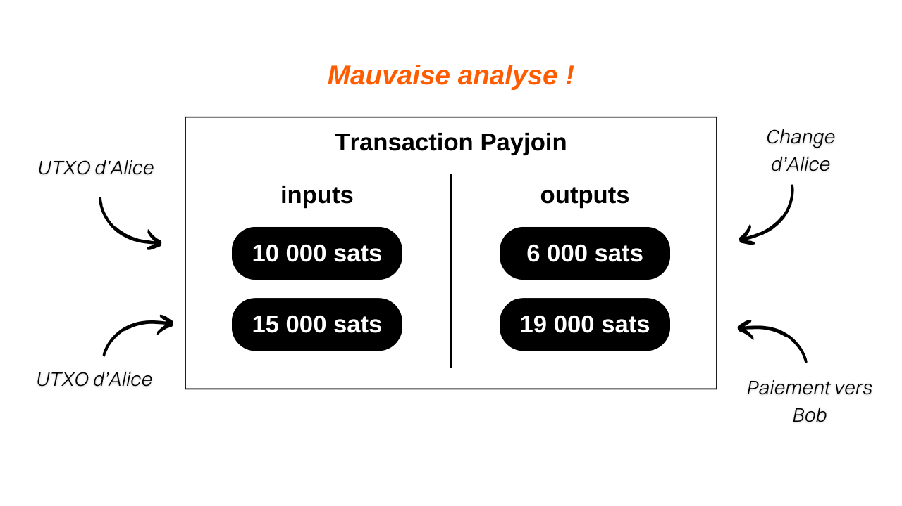

## Understanding Payjoin Transactions on Bitcoin

Payjoin is a specific structure of Bitcoin transaction that enhances user privacy during a payment by collaborating with the payment recipient.

In 2015, [LaurentMT](https://twitter.com/LaurentMT) first mentioned this method as "steganographic transactions" in a document accessible [here](https://gist.githubusercontent.com/LaurentMT/e758767ca4038ac40aaf/raw/c8125f6a3c3d0e90246dc96d3b603690ab6f1dcc/gistfile1.txt). This technique was later adopted by the Samourai Wallet, which became the first client to implement it with the Stowaway tool in 2018. The concept of Payjoin is also found in [BIP79](https://github.com/bitcoin/bips/blob/master/bip-0079.mediawiki) and [BIP78](https://github.com/bitcoin/bips/blob/master/bip-0078.mediawiki). Several terms are used to refer to Payjoin:
- Payjoin
- Stowaway
- P2EP (Pay-to-End-Point)
- Steganographic transaction

The uniqueness of Payjoin lies in its ability to generate a transaction that appears ordinary at first glance but is actually a mini Coinjoin between two parties. To achieve this, the transaction structure involves the payment recipient alongside the actual sender in the inputs. The recipient includes a payment to themselves in the middle of the transaction, which allows them to be paid.

Let's take a concrete example: if you buy a baguette for `4000 sats` using a UTXO of `10,000 sats` and opt for a Payjoin, your baker will add a UTXO of `15,000 sats` that belongs to them as an input, which they will receive in full as an output, in addition to your `4000 sats`:

In this example, the baker introduces `15,000 sats` as an input and comes out with `19,000 sats`, with a difference of exactly `4000 sats`, which is the price of the baguette. On your side, you enter with `10,000 sats` and end up with `6,000 sats` as an output, representing a balance of `-4000 sats`, which is the price of the baguette. To simplify the example, I deliberately omitted mining fees in this transaction.

## What is the purpose of a Payjoin transaction?

A Payjoin transaction serves two objectives that allow users to enhance the privacy of their payment.
First of all, Payjoin aims to mislead an external observer by creating a decoy in chain analysis. This is made possible through the Common Input Ownership Heuristic (CIOH). Usually, when a transaction on the blockchain has multiple inputs, it is assumed that all these inputs likely belong to the same entity or user. Thus, when an analyst examines a Payjoin transaction, they are led to believe that all the inputs come from the same person. However, this perception is incorrect because the payment recipient also contributes inputs alongside the actual payer. Therefore, chain analysis is diverted towards an interpretation that turns out to be false.

Furthermore, Payjoin also allows for deceiving an external observer about the actual amount of the payment that has been made. By examining the transaction structure, the analyst might believe that the payment is equivalent to the amount of one of the outputs. However, in reality, the payment amount does not correspond to any of the outputs. It is actually the difference between the recipient's output UTXO and the recipient's input UTXO. In this sense, the Payjoin transaction falls into the domain of steganography. It allows for hiding the actual amount of a transaction within a fake transaction that acts as a decoy.

> Steganography is a technique of concealing information within other data or objects in such a way that the presence of the hidden information is not perceptible. For example, a secret message can be hidden inside a dot in a text that has nothing to do with it, making it undetectable to the naked eye (this is the technique of micropoint). Unlike encryption, which makes information incomprehensible without the decryption key, steganography does not modify the information. It remains displayed in plain sight. Its objective is rather to hide the existence of the secret message, whereas encryption clearly reveals the presence of hidden information, although inaccessible without the key.

Let's go back to our example of a Payjoin transaction for the payment of a baguette.

By seeing this transaction on the blockchain, an external observer who follows the usual heuristics of chain analysis would interpret it as follows: "*Alice merged 2 UTXOs as inputs of the transaction to pay `19,000 sats` to Bob*."

This interpretation is obviously incorrect because, as you already know, the two input UTXOs do not belong to the same person. Furthermore, the actual value of the payment is not `19,000 sats`, but rather `4,000 sats`. The analysis of the external observer is thus directed towards an erroneous conclusion, ensuring the preservation of the confidentiality of the stakeholders.
If you wish to analyze a real Payjoin transaction, here is one that I performed on the testnet: [8dba6657ab9bb44824b3317c8cc3f333c2f465d3668c678691a091cdd6e5984c](https://mempool.space/fr/testnet/tx/8dba6657ab9bb44824b3317c8cc3f333c2f465d3668c678691a091cdd6e5984c)

**External resources:**
- https://docs.samourai.io/en/spend-tools#stowaway;
- https://samouraiwallet.com/stowaway;
- https://gist.githubusercontent.com/LaurentMT/e758767ca4038ac40aaf/raw/c8125f6a3c3d0e90246dc96d3b603690ab6f1dcc/gistfile1.txt;
- https://github.com/bitcoin/bips/blob/master/bip-0078.mediawiki.