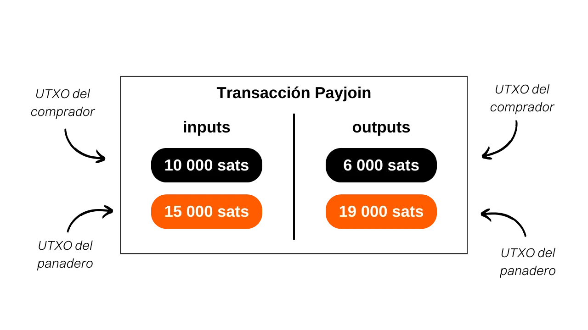
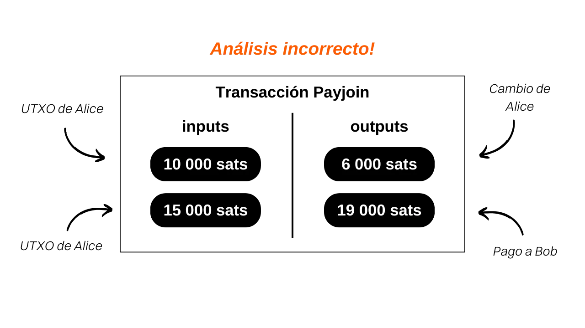

***ATENCIÓN:** Tras el arresto de los fundadores de Samourai Wallet y la incautación de sus servidores el pasado 24 de abril, los Payjoins Stowaway en Samourai Wallet solo funcionan intercambiando manualmente los PSBT entre las partes interesadas, siempre que ambos usuarios estén conectados a su propio Dojo. En cuanto a Sparrow, los Payjoins a través del BIP78 siguen funcionando. Sin embargo, es posible que estas herramientas se relancen en las próximas semanas. Mientras tanto, puede leer este artículo para entender el funcionamiento teórico de los payjoins.*

_Estamos siguiendo de cerca la evolución de este caso así como los desarrollos relacionados con las herramientas asociadas. Ten la seguridad de que actualizaremos este tutorial a medida que estén disponibles nuevas informaciones._

_Este tutorial se proporciona únicamente con fines educativos e informativos. No respaldamos ni alentamos el uso de estas herramientas para fines criminales. Es responsabilidad de cada usuario cumplir con las leyes en su jurisdicción._

---
## Comprendiendo las transacciones Payjoin en Bitcoin

Payjoin es una estructura específica de transacción de Bitcoin que mejora la privacidad del usuario durante un pago al colaborar con el destinatario del pago.

En 2015, [LaurentMT](https://twitter.com/LaurentMT) mencionó por primera vez este método como "transacciones esteganográficas" en un documento accesible [aquí](https://gist.githubusercontent.com/LaurentMT/e758767ca4038ac40aaf/raw/c8125f6a3c3d0e90246dc96d3b603690ab6f1dcc/gistfile1.txt). Esta técnica fue posteriormente adoptada por la billetera Samourai, que se convirtió en el primer cliente en implementarla con la herramienta Stowaway en 2018. El concepto de Payjoin también se encuentra en [BIP79](https://github.com/bitcoin/bips/blob/master/bip-0079.mediawiki) y [BIP78](https://github.com/bitcoin/bips/blob/master/bip-0078.mediawiki). Se utilizan varios términos para referirse a Payjoin:
- Payjoin
- Stowaway
- P2EP (Pay-to-End-Point)
- Transacción esteganográfica

La singularidad de Payjoin radica en su capacidad para generar una transacción que parece ordinaria a primera vista, pero que en realidad es una mini Coinjoin entre dos partes. Para lograr esto, la estructura de la transacción involucra al destinatario del pago junto con el remitente real en las entradas. El destinatario incluye un pago a sí mismo en medio de la transacción, lo que les permite recibir el pago.

Tomemos un ejemplo concreto: si compras una baguette por `4000 sats` utilizando una UTXO de `10,000 sats` y optas por un Payjoin, tu panadero agregará una UTXO de `15,000 sats` que les pertenece como entrada, la cual recibirán en su totalidad como salida, además de tus `4000 sats`:

En este ejemplo, el panadero introduce `15,000 sats` como entrada y obtiene `19,000 sats`, con una diferencia exacta de `4000 sats`, que es el precio de la baguette. Por tu parte, ingresas con `10,000 sats` y terminas con `6,000 sats` como salida, lo que representa un saldo de `-4000 sats`, que es el precio de la baguette. Para simplificar el ejemplo, omití deliberadamente las tarifas de minería en esta transacción.

## ¿Cuál es el propósito de una transacción Payjoin?

Una transacción Payjoin cumple dos objetivos que permiten a los usuarios mejorar la privacidad de sus pagos.
En primer lugar, Payjoin tiene como objetivo engañar a un observador externo creando una distracción en el análisis de la cadena. Esto es posible a través de la Heurística de Propiedad Común de Entradas (CIOH, por sus siglas en inglés). Por lo general, cuando una transacción en la cadena de bloques tiene múltiples entradas, se asume que todas estas entradas probablemente pertenecen a la misma entidad o usuario. Por lo tanto, cuando un analista examina una transacción Payjoin, se le hace creer que todas las entradas provienen de la misma persona. Sin embargo, esta percepción es incorrecta porque el destinatario del pago también contribuye con entradas junto con el pagador real. Por lo tanto, el análisis de la cadena se desvía hacia una interpretación que resulta ser falsa.
Además, Payjoin también permite engañar a un observador externo sobre la cantidad real del pago que se ha realizado. Al examinar la estructura de la transacción, el analista podría creer que el pago es equivalente a la cantidad de una de las salidas. Sin embargo, en realidad, la cantidad del pago no corresponde a ninguna de las salidas. En realidad, es la diferencia entre la UTXO de salida del destinatario y la UTXO de entrada del destinatario. En este sentido, la transacción Payjoin cae en el ámbito de la esteganografía. Permite ocultar la cantidad real de una transacción dentro de una transacción falsa que actúa como señuelo.

> La esteganografía es una técnica de ocultación de información dentro de otros datos u objetos de tal manera que la presencia de la información oculta no sea perceptible. Por ejemplo, un mensaje secreto puede ocultarse dentro de un punto en un texto que no tiene nada que ver con él, haciéndolo indetectable a simple vista (esta es la técnica del micropunto). A diferencia del cifrado, que hace que la información sea incomprensible sin la clave de descifrado, la esteganografía no modifica la información. Permanece visible a simple vista. Su objetivo es más bien ocultar la existencia del mensaje secreto, mientras que el cifrado revela claramente la presencia de información oculta, aunque inaccesible sin la clave.

Volviendo a nuestro ejemplo de una transacción Payjoin para el pago de una baguette.

Al ver esta transacción en la cadena de bloques, un observador externo que sigue las heurísticas habituales del análisis de la cadena la interpretaría de la siguiente manera: "*Alice fusionó 2 UTXOs como entradas de la transacción para pagar `19,000 sats` a Bob*."

Esta interpretación es obviamente incorrecta porque, como ya sabes, las dos UTXOs de entrada no pertenecen a la misma persona. Además, el valor real del pago no es `19,000 sats`, sino `4,000 sats`. El análisis del observador externo se dirige así hacia una conclusión errónea, asegurando la preservación de la confidencialidad de las partes interesadas.
Si deseas analizar una transacción Payjoin real, aquí tienes una que realicé en la testnet: [8dba6657ab9bb44824b3317c8cc3f333c2f465d3668c678691a091cdd6e5984c](https://mempool.space/fr/testnet/tx/8dba6657ab9bb44824b3317c8cc3f333c2f465d3668c678691a091cdd6e5984c)

[**-> Descubre nuestro tutorial sobre cómo hacer un Payjoin con Samourai Wallet**](https://planb.network/tutorials/privacy/payjoin-samourai-wallet)  

[**-> Descubre nuestro tutorial sobre cómo hacer un Payjoin con Sparrow Wallet**](https://planb.network/tutorials/privacy/payjoin-sparrow-wallet)

**Recursos externos:**
- https://docs.samourai.io/en/spend-tools#stowaway;
- https://gist.githubusercontent.com/LaurentMT/e758767ca4038ac40aaf/raw/c8125f6a3c3d0e90246dc96d3b603690ab6f1dcc/gistfile1.txt;
- https://github.com/bitcoin/bips/blob/master/bip-0078.mediawiki.
