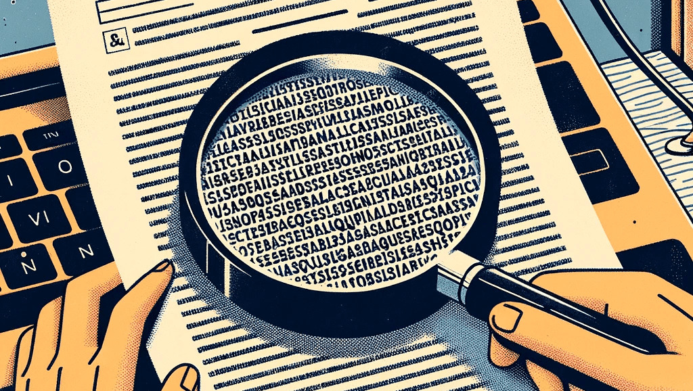
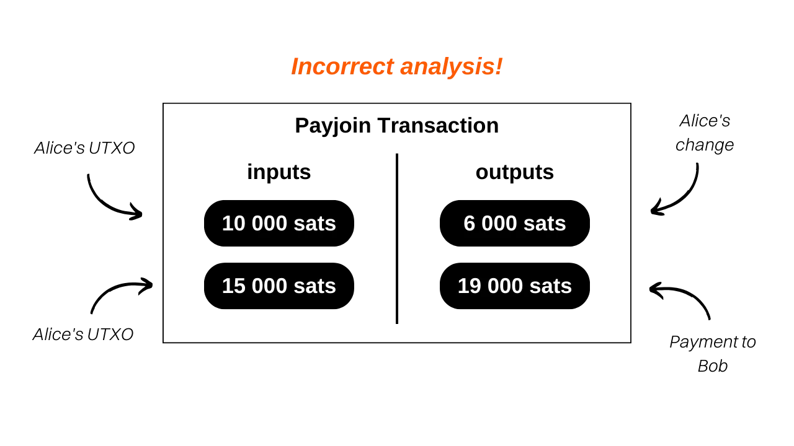

## Bitcoin上のPayjoin取引を理解する

Payjoinは、支払い受取人と協力することで支払い時のユーザーのプライバシーを強化するBitcoin取引の特定の構造です。

2015年に[LaurentMT](https://twitter.com/LaurentMT)が初めてこの方法を「ステガノグラフィックトランザクション」として文書[こちら](https://gist.githubusercontent.com/LaurentMT/e758767ca4038ac40aaf/raw/c8125f6a3c3d0e90246dc96d3b603690ab6f1dcc/gistfile1.txt)で言及しました。この技術は後にSamourai Walletによって採用され、2018年にStowawayツールを実装した最初のクライアントとなりました。Payjoinの概念は[BIP79](https://github.com/bitcoin/bips/blob/master/bip-0079.mediawiki)および[BIP78](https://github.com/bitcoin/bips/blob/master/bip-0078.mediawiki)にも見られます。Payjoinを指すためにいくつかの用語が使用されています：
- Payjoin
- Stowaway
- P2EP (Pay-to-End-Point)
- ステガノグラフィックトランザクション

Payjoinのユニークさは、一見普通の取引のように見えるが、実際には二者間のミニCoinjoinである取引を生成する能力にあります。これを実現するために、取引構造は実際の送信者とともに支払い受取人を入力に含みます。受取人は取引の中間に自分自身への支払いを含めることで、支払いを受けることができます。

具体的な例を挙げましょう：`10,000 sats`のUTXOを使用して`4000 sats`でバゲットを購入し、Payjoinを選択した場合、あなたのパン屋は彼らに属する`15,000 sats`のUTXOを入力として追加し、それを出力として全額受け取ります。これに加えて、あなたの`4000 sats`も受け取ります：

この例では、パン屋は`15,000 sats`を入力として導入し、`19,000 sats`で出てきます。これは正確に`4000 sats`の差であり、バゲットの価格です。あなたの側では、`10,000 sats`で入り、出力として`6,000 sats`で終わります。これは`-4000 sats`のバランスを表し、バゲットの価格です。この取引でのマイニング手数料は例を簡単にするために意図的に省略しました。

## Payjoin取引の目的は何ですか？

Payjoin取引は、ユーザーが支払いのプライバシーを強化するために二つの目的を果たします。
まず第一に、Payjoinはチェーン分析において囮を作り出すことで外部の観察者を誤解させることを目指しています。これはCommon Input Ownership Heuristic (CIOH)を通じて可能になります。通常、ブロックチェーン上の取引に複数の入力がある場合、これらの入力はすべて同じエンティティまたはユーザーに属していると見なされます。したがって、分析者がPayjoin取引を調査するとき、すべての入力が同じ人から来ていると信じるように導かれます。しかし、この認識は間違っています。なぜなら、支払い受取人も実際の支払い者とともに入力を提供するからです。したがって、チェーン分析は実際には誤った解釈に向けられます。
さらに、Payjoinは外部の観察者に対して実際に支払われた金額を偽装することも可能にします。トランザクションの構造を調べることで、分析者は支払いが出力の一つに相当する金額だと考えるかもしれません。しかし、実際には、支払い額はどの出力にも対応していません。実際には、受取人の出力UTXOと受取人の入力UTXOの差額が支払い額です。この意味で、Payjoinトランザクションはステガノグラフィーの領域に属します。これは、偽のトランザクション内に実際の取引額を隠すことを可能にし、その偽のトランザクションが囮として機能します。

> ステガノグラフィーは、隠された情報の存在が知覚されないように、他のデータやオブジェクト内に情報を隠す技術です。例えば、秘密のメッセージを、それとは無関係のテキストの中の点の中に隠すことができ、肉眼では検出できないようにすることができます（これはマイクロポイントの技術です）。暗号化が復号化キーなしでは情報を理解不可能にするのに対し、ステガノグラフィーは情報を変更しません。それは明らかに表示されたままです。その目的はむしろ秘密のメッセージの存在を隠すことにあり、暗号化は隠された情報の存在を明らかにしますが、キーなしではアクセスできません。

バゲットの支払いのためのPayjoinトランザクションの例に戻りましょう。

このトランザクションをブロックチェーン上で見たとき、通常のチェーン分析のヒューリスティックを追う外部の観察者は次のように解釈するでしょう：「*Aliceはトランザクションの入力として2つのUTXOsを統合して、`19,000 sats`をBobに支払った*。」

この解釈は明らかに誤っています。なぜなら、すでに知っての通り、2つの入力UTXOsは同じ人に属していません。さらに、実際の支払い額は`19,000 sats`ではなく、`4,000 sats`です。したがって、外部の観察者の分析は誤った結論に向けられ、関係者の機密性が保持されます。
実際のPayjoinトランザクションを分析したい場合、こちらがテストネットで行ったものです：[8dba6657ab9bb44824b3317c8cc3f333c2f465d3668c678691a091cdd6e5984c](https://mempool.space/fr/testnet/tx/8dba6657ab9bb44824b3317c8cc3f333c2f465d3668c678691a091cdd6e5984c)

[**-> Samourai WalletでPayjoinを行う方法に関するチュートリアルを見る**](https://planb.network/tutorials/privacy/payjoin-samourai-wallet)  

[**-> Sparrow WalletでPayjoinを行う方法に関するチュートリアルを見る**](https://planb.network/tutorials/privacy/payjoin-sparrow-wallet)

**外部リソース:**
- https://docs.samourai.io/en/spend-tools#stowaway;
- https://samouraiwallet.com/stowaway;
- https://gist.githubusercontent.com/LaurentMT/e758767ca4038ac40aaf/raw/c8125f6a3c3d0e90246dc96d3b603690ab6f1dcc/gistfile1.txt;
- https://github.com/bitcoin/bips/blob/master/bip-0078.mediawiki.