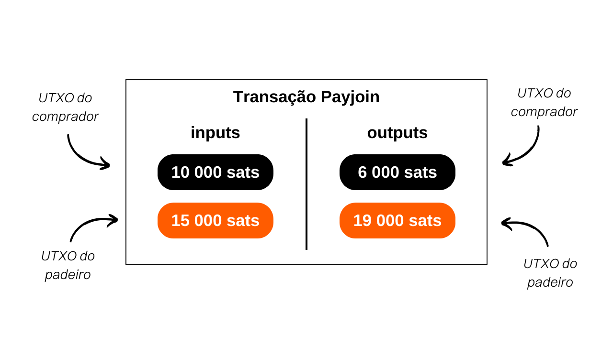
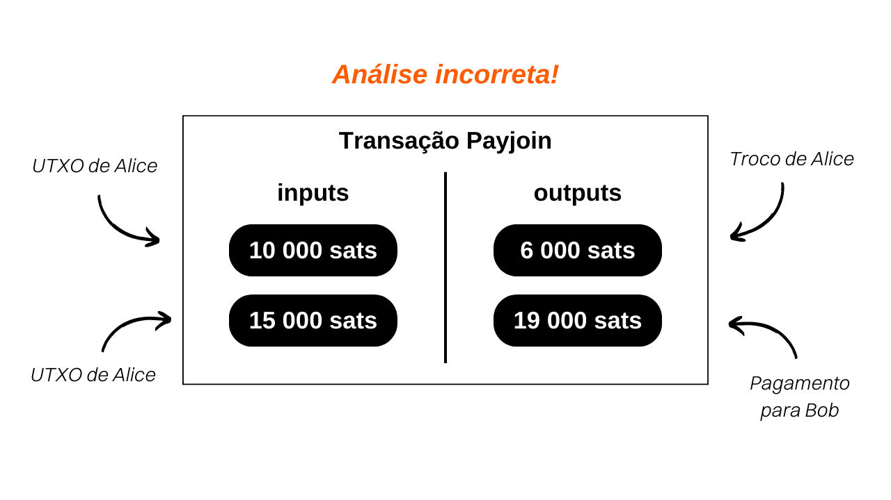

## Compreendendo Transações Payjoin no Bitcoin

Payjoin é uma estrutura específica de transação Bitcoin que melhora a privacidade do usuário durante um pagamento, colaborando com o destinatário do pagamento.

Em 2015, [LaurentMT](https://twitter.com/LaurentMT) mencionou pela primeira vez esse método como "transações esteganográficas" em um documento acessível [aqui](https://gist.githubusercontent.com/LaurentMT/e758767ca4038ac40aaf/raw/c8125f6a3c3d0e90246dc96d3b603690ab6f1dcc/gistfile1.txt). Essa técnica foi posteriormente adotada pela Samourai Wallet, que se tornou o primeiro cliente a implementá-la com a ferramenta Stowaway em 2018. O conceito de Payjoin também é encontrado em [BIP79](https://github.com/bitcoin/bips/blob/master/bip-0079.mediawiki) e [BIP78](https://github.com/bitcoin/bips/blob/master/bip-0078.mediawiki). Vários termos são usados para se referir ao Payjoin:
- Payjoin
- Stowaway
- P2EP (Pay-to-End-Point)
- Transação esteganográfica

A singularidade do Payjoin reside em sua capacidade de gerar uma transação que parece comum à primeira vista, mas na verdade é um mini Coinjoin entre duas partes. Para alcançar isso, a estrutura da transação envolve o destinatário do pagamento junto com o remetente real nas entradas. O destinatário inclui um pagamento para si mesmo no meio da transação, o que lhes permite serem pagos.

Vamos pegar um exemplo concreto: se você comprar uma baguete por `4000 sats` usando uma UTXO de `10.000 sats` e optar por um Payjoin, seu padeiro adicionará uma UTXO de `15.000 sats` que pertence a eles como uma entrada, que eles receberão na íntegra como uma saída, além dos seus `4000 sats`:

Neste exemplo, o padeiro introduz `15.000 sats` como uma entrada e sai com `19.000 sats`, com uma diferença exata de `4000 sats`, que é o preço da baguete. Do seu lado, você entra com `10.000 sats` e acaba com `6.000 sats` como saída, representando um saldo de `-4000 sats`, que é o preço da baguete. Para simplificar o exemplo, omiti deliberadamente as taxas de mineração nesta transação.

## Qual é o propósito de uma transação Payjoin?

Uma transação Payjoin serve a dois objetivos que permitem aos usuários melhorar a privacidade de seus pagamentos.
Em primeiro lugar, o Payjoin tem como objetivo enganar um observador externo criando uma distração na análise da cadeia. Isso é possível por meio da Heurística de Propriedade Comum de Entrada (CIOH). Geralmente, quando uma transação na blockchain possui várias entradas, assume-se que todas essas entradas provavelmente pertencem à mesma entidade ou usuário. Assim, quando um analista examina uma transação Payjoin, ele é levado a acreditar que todas as entradas vêm da mesma pessoa. No entanto, essa percepção está incorreta porque o destinatário do pagamento também contribui com entradas junto com o pagador real. Portanto, a análise da cadeia é desviada para uma interpretação que acaba sendo falsa.
Além disso, o Payjoin também permite enganar um observador externo sobre o valor real do pagamento que foi feito. Ao examinar a estrutura da transação, o analista pode acreditar que o pagamento é equivalente ao valor de uma das saídas. No entanto, na realidade, o valor do pagamento não corresponde a nenhuma das saídas. Na verdade, é a diferença entre a UTXO de saída do destinatário e a UTXO de entrada do destinatário. Nesse sentido, a transação Payjoin se enquadra no domínio da esteganografia. Ela permite esconder o valor real de uma transação dentro de uma transação falsa que age como uma distração.

> Esteganografia é uma técnica de ocultar informações dentro de outros dados ou objetos de tal maneira que a presença das informações ocultas não seja perceptível. Por exemplo, uma mensagem secreta pode ser escondida dentro de um ponto em um texto que não tem nada a ver com ela, tornando-a indetectável a olho nu (essa é a técnica do microponto). Ao contrário da criptografia, que torna as informações incompreensíveis sem a chave de descriptografia, a esteganografia não modifica as informações. Elas permanecem visíveis a olho nu. Seu objetivo é esconder a existência da mensagem secreta, enquanto a criptografia revela claramente a presença de informações ocultas, embora inacessíveis sem a chave.

Vamos voltar ao nosso exemplo de uma transação Payjoin para o pagamento de uma baguete.

Ao ver essa transação no blockchain, um observador externo que segue as heurísticas usuais de análise de cadeia interpretaria da seguinte forma: "*Alice mesclou 2 UTXOs como entradas da transação para pagar `19.000 sats` para Bob*."

Essa interpretação é obviamente incorreta porque, como você já sabe, os dois UTXOs de entrada não pertencem à mesma pessoa. Além disso, o valor real do pagamento não é `19.000 sats`, mas sim `4.000 sats`. A análise do observador externo é, portanto, direcionada a uma conclusão errônea, garantindo a preservação da confidencialidade das partes interessadas.
Se você deseja analisar uma transação Payjoin real, aqui está uma que eu executei na testnet: [8dba6657ab9bb44824b3317c8cc3f333c2f465d3668c678691a091cdd6e5984c](https://mempool.space/fr/testnet/tx/8dba6657ab9bb44824b3317c8cc3f333c2f465d3668c678691a091cdd6e5984c)

[**-> Descubra nosso tutorial sobre como fazer um Payjoin com Samourai Wallet**](https://planb.network/tutorials/privacy/payjoin-samourai-wallet)  

[**-> Descubra nosso tutorial sobre como fazer um Payjoin com Sparrow Wallet**](https://planb.network/tutorials/privacy/payjoin-sparrow-wallet)

**Recursos externos:**
- https://docs.samourai.io/en/spend-tools#stowaway;
- https://samouraiwallet.com/stowaway;
- https://gist.githubusercontent.com/LaurentMT/e758767ca4038ac40aaf/raw/c8125f6a3c3d0e90246dc96d3b603690ab6f1dcc/gistfile1.txt;
- https://github.com/bitcoin/bips/blob/master/bip-0078.mediawiki.
