# BIP47 - PayNym

الوصف: كيف يعمل PayNym

# BIP47، البطة الصغيرة الشريرة.

> "إنه كبير جدًا"، قالوا جميعًا، والديك الهندي الذي وُلد بمخالب ويعتقد أنه الإمبراطور، انتفخ مثل سفينة مشدودة بالشراع وسار مباشرة نحوه بغضب شديد ووجهه أحمر حتى العينين. البطة الصغيرة الفقيرة لم تكن تعرف ما إذا كانت يجب أن تتوقف أم تستمر في المشي: كانت حزينة جدًا لأنها تعرضت للسخرية من جميع البط في الحقل.

واحدة من أكبر المشاكل في بروتوكول بيتكوين هي إعادة استخدام العناوين. الشفافية وتوزيع الشبكة تجعل هذه الممارسة خطيرة على خصوصية المستخدم. لتجنب المشاكل المتعلقة بهذا الأمر، من المستحسن استخدام عنوان استلام جديد لكل عملية دفع جديدة إلى محفظة، وهو أمر قد يكون معقدًا في بعض الحالات.

هذا التوازن قديم كورقة بيضاء. لقد حذرنا ساتوشي بالفعل من هذا الخطر في ورقته البيضاء التي نشرت في نهاية عام 2008:

> "يمكن استخدام زوج جديد من المفاتيح كجدار ناري إضافي للحفاظ على عمليات الدفع غير مرتبطة بمالك مشترك."

هناك العديد من الحلول المتاحة لاستقبال عدة مدفوعات دون إعادة استخدام العنوان. لكل حل له توازناته وعيوبه. ومن بين جميع هذه الحلول، هناك [BIP47](https://github.com/bitcoin/bips/blob/master/bip-0047.mediawiki)، وهو اقتراح تم تطويره بواسطة جوستوس رانفير ونُشر في عام 2015 لتوليد رموز دفع قابلة لإعادة الاستخدام. الهدف هو تمكين إجراء عدة عمليات تجاه نفس الشخص دون إعادة استخدام العنوان.

في البداية، تلقت هذه الاقتراحات استقبالًا مزدوجًا من جزء من المجتمع، ولم يتم إضافتها إلى Bitcoin Core أبدًا. ومع ذلك، قررت بعض البرامج تنفيذها بمفردها. وهكذا، قامت [Samourai Wallet](https://samouraiwallet.com/) بتطوير تنفيذها الخاص لـ BIP47: PayNym. اليوم، يتوفر هذا التنفيذ بالطبع على محفظة Samourai للهواتف الذكية، ولكنه متاح أيضًا على [Sparrow Wallet](https://sparrowwallet.com/) للكمبيوتر.

مع مرور الوقت، قامت Samourai ببرمجة ميزات جديدة مرتبطة مباشرة بـ PayNym. الآن، هناك بيئة كاملة من الأدوات التي تساعد في تحسين خصوصية المستخدم بناءً على PayNym و BIP47.
في هذه المقالة، ستتعرف على مبدأ BIP47 و PayNym، وآليات هذه البروتوكولات والتطبيقات العملية التي تنتج عنها. سأتطرق فقط إلى الإصدار الأول من BIP47، الذي يستخدم حاليًا لـ PayNym، ولكن الإصدارات 2 و 3 و 4 تعمل بشكل مماثل تقريبًا.
> الاختلاف الرئيسي الوحيد يكمن في عملية الإشعار بالمعاملة. الإصدار 1 يستخدم عنوانًا بسيطًا مع OP_RETURN للإشعار، الإصدار 2 يستخدم نص متعدد التوقيع (bloom-multisig) مع OP_RETURN، والإصدارات 3 و 4 تستخدم نص متعدد التوقيع ببساطة (cfilter-multisig). لذا، يمكن تطبيق الآليات المذكورة في هذه المقالة، وخاصة الأساليب المعمول بها في التشفير، على الإصدارات الأربعة. حتى الآن، تستخدم تنفيذ PayNym على محفظة Samourai و Sparrow الإصدار الأول من BIP47.

## المحتوى:

1- مشكلة إعادة استخدام العنوان.

2- مبادئ BIP47 و PayNym.

3- دروس تعليمية: استخدام PayNym.

* بناء معاملة BIP47 باستخدام محفظة Samourai.

* بناء معاملة BIP47 باستخدام محفظة Sparrow.

4- تفاصيل BIP47.

* رمز الدفع القابل لإعادة الاستخدام.
* الأسلوب التشفيري: تبادل مفاتيح Diffie-Hellman على المنحنيات البيضاوية (ECDH).

* معاملة الإشعار.
* بناء معاملة الإشعار.
* استلام معاملة الإشعار.
* معاملة الدفع BIP47.
* استلام الدفعة BIP47 واستنتاج المفتاح الخاص.
* استرداد الدفعة BIP47.

5- استخدامات مشتقة من PayNym.

6- رأيي الشخصي حول BIP47.

## مشكلة إعادة استخدام العنوان.

يتم استخدام عنوان الاستلام لاستقبال البيتكوين. يتم إنشاؤه من المفتاح العام عن طريق تجزئته وتطبيق تنسيق محدد عليه. بالتالي، يتيح إنشاء شرط جديد لإنفاق العملة المعدنية لتغيير المالك.

> لمعرفة المزيد حول إنشاء عنوان استلام، أنصحك بقراءة الجزء الأخير من هذه المقالة: محفظة البيتكوين - مقتطف [كتاب البيتكوين المتاح للجميع 2](https://www.pandul.fr/post/le-portefeuille-bitcoin-extrait-ebook-bitcoin-d%C3%A9mocratis%C3%A9-2#viewer-epio7).

علاوة على ذلك، ربما سمعت بالفعل من شخص ملم بالبيتكوين أن عناوين الاستلام يجب أن تكون للاستخدام المرة الواحدة فقط، وأنه يجب إنشاء عنوان جديد لكل دفعة جديدة تصل إلى محفظتك. حسنًا، لكن لماذا؟
في الأساس ، إعادة استخدام العنوان لا تعرض أموالك للخطر مباشرةً. يسمح استخدام التشفير على المنحنيات البيضاوية بإثبات للشبكة أنك تمتلك مفتاحًا خاصًا دون الكشف عن هذا المفتاح. بالتالي ، يمكنك قفل عدة UTXO مختلفة على نفس العنوان وإنفاقها في أوقات مختلفة. إذا لم تكشف عن المفتاح الخاص المرتبط بهذا العنوان ، فلن يتمكن أحد من الوصول إلى أموالك. إن مشكلة إعادة استخدام العنوان تتعلق بالخصوصية بشكل أساسي.

كما تم ذكره في المقدمة ، فإن الشفافية وتوزيع شبكة بيتكوين تعني أن أي مستخدم ، طالما لديه وصول إلى عقدة ، قادر على مراقبة المعاملات في نظام الدفع. وبالتالي ، يمكنه رؤية الأرصدة المختلفة للعناوين. ذكر ساتوشي ناكاموتو إمكانية إنشاء أزواج مفاتيح جديدة ، وبالتالي عناوين جديدة ، لأي دفعة جديدة تدخل إلى محفظة. الهدف هو الحصول على جدار نار إضافي في حالة ربط هوية المستخدم بأحد أزواج المفاتيح الخاصة به.

اليوم ، مع وجود شركات تحليل سلسلة الكتل وتطوير KYC ، لم يعد استخدام عناوين جديدة جدار نار إضافي ، بل إلزام لأي شخص يهتم بخصوصيته الشخصية.

البحث عن الخصوصية ليس رفاهية أو خيال لمحبي البيتكوين القصوى. إنه عامل محدد يؤثر مباشرةً على أمانك الشخصي وتأمين أموالك. لفهم ذلك ، هنا مثال واقعي جدًا:

- بوب يشتري بيتكوين بطريقة DCA (Dollars Cost Average) ، وهي طريقة يقوم فيها بشراء مبلغ صغير من البيتكوين بانتظام لتخفيف سعر الدخول. يرسل بوب بنظام الأموال التي اشتراها إلى نفس العنوان المستلم. يشتري 0.01 بيتكوين كل أسبوع ويُرسلها إلى نفس العنوان. بعد عامين ، جمع بوب بيتكوين كامل على هذا العنوان.

- يقبل الخباز في زاوية الشارع الدفع بالبيتكوين. سعيدًا جدًا بأنه يمكنه إنفاق البيتكوين ، يذهب بوب لشراء رغيف الخبز بالساتوشي. للدفع ، يستخدم الأموال المقفلة بعنوانه. يعرف الخباز الآن أن لديه بيتكوين. يمكن أن تثير هذه الكمية الكبيرة الغيرة ، ويمكن أن يتعرض بوب بشكل محتمل لهجوم جسدي فيما بعد.

بالتالي ، يسمح إعادة استخدام العنوان للمراقب بإنشاء رابط لا يمكن إنكاره بين UTXO المختلفة الخاصة بك ، وبالتالي في بعض الأحيان بين هويتك ومحفظتك بأكملها.
لهذا السبب، يقوم معظم برامج محافظ البيتكوين بتوليد عنوان استلام جديد تلقائيًا عند النقر على زر "استلام". بالنسبة للمستخدم العادي، فإن استخدام عناوين جديدة ليس أمرًا مزعجًا كبيرًا. ومع ذلك، بالنسبة للتجارة عبر الإنترنت أو التبادل أو حملة التبرعات، يمكن أن تصبح هذه القيود غير قابلة للإدارة بسرعة.

هناك العديد من الحلول لهذه المنظمات. لكل منها مزاياها وعيوبها، ولكن حتى الآن، وكما سنرى لاحقًا، يتميز BIP47 حقًا عن البدائل الأخرى.

هذه المشكلة في إعادة استخدام العناوين ليست تافهة في بيتكوين. كما يمكنك أن ترى في الرسم البياني أدناه المستمد من موقع [oxt.me](http://oxt.me/)، فإن معدل إعادة استخدام العناوين العامة لمستخدمي بيتكوين حاليًا هو 52٪:

صورة

الائتمان: https://oxt.me/charts

يأتي معظم هذه الإعادات من التبادلات التي، لأسباب كفاءة وسهولة، تعيد استخدام نفس العنوان عدة مرات. حتى الآن، يعتبر BIP47 أفضل حل للحد من هذه الظاهرة في التبادلات. سيسمح ذلك بتقليل معدل إعادة استخدام العناوين العامة دون أن يتسبب في الكثير من الاحتكاك لهذه الكيانات.

هذا التدبير الشامل على مستوى الشبكة هو بيانات متسقة بشكل خاص في هذه الحالة. في الواقع، إعادة استخدام العنوان ليست مشكلة فقط للشخص الذي يمارس هذا النوع من الممارسات، ولكنها أيضًا مشكلة لأي شخص يقوم بإجراء معاملات معه. فقدان الخصوصية في بيتكوين يعمل مثل الفيروس وينتشر من مستخدم إلى آخر. دراسة التدبير الشامل على جميع المعاملات في الشبكة يسمح لنا بفهم مدى هذه الظاهرة.

## مبادئ BIP47 و PayNym.

يهدف BIP47 إلى توفير طريقة بسيطة لاستقبال العديد من المدفوعات دون إعادة استخدام العناوين. يعتمد عمله على استخدام رمز دفع قابل لإعادة الاستخدام.

بالتالي، يمكن لعدة مرسلين إرسال عدة مدفوعات إلى رمز دفع واحد قابل لإعادة الاستخدام لمستخدم آخر، دون أن يحتاج المستلم إلى إرسال عنوان جديد لكل معاملة جديدة.

يمكن للمستخدم بعد ذلك أن يشارك رمز الدفع الخاص به بحرية (على وسائل التواصل الاجتماعي، على موقعه الإلكتروني...) دون خطر فقدان الخصوصية، على عكس العنوان الاستلام العادي أو المفتاح العام.
لتنفيذ تبادل، يجب أن يكون لدى كل من المستخدمين محفظة بيتكوين تحتوي على تنفيذ لـ BIP47، مثل PayNym على محفظة Samourai أو Sparrow Wallet. ستسمح ربط أكواد الدفع للمستخدمين بإنشاء قناة سرية بينهما. لإنشاء هذه القناة بشكل صحيح، يجب على المرسل إجراء عملية تحويل على سلسلة بيتكوين: عملية الإشعار (سأتحدث عنها قليلاً في وقت لاحق).

يولد ربط أكواد الدفع للمستخدمين الأسرار المشتركة التي تمكنهم بدورهم من إنشاء عدد كبير من عناوين استلام بيتكوين فريدة (2^32 بالضبط). بالتالي، في الواقع، لا يتم إرسال الدفعة باستخدام BIP47 إلى عنوان الدفع، ولكن بالفعل إلى عناوين عادية تمامًا، والتي تم تشتيتها بدورها من أكواد الدفع للأطراف المعنية.

يعمل رمز الدفع بمثابة معرف افتراضي، مشتق من بذرة المحفظة. في هيكل تشتيت المحفظة HD، يتم العثور على رمز الدفع في العمق 3، على مستوى حسابات المحفظة.

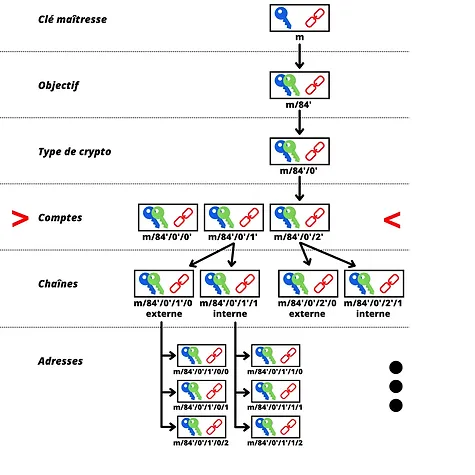

يتم تمييز هدف تشتيته بـ 47' (0x8000002F) في إشارة إلى BIP47. على سبيل المثال، يكون مسار تشتيت رمز الدفع القابل لإعادة الاستخدام كالتالي:

> m/47'/0'/0'/

لكي تتمكن من تخيل كيف يبدو رمز الدفع، هذا هو الخاص بي:

>PM8TJSBiQmNQDwTogMAbyqJe2PE2kQXjtgh88MRTxsrnHC8zpEtJ8j7Aj628oUFk8X6P5rJ7P5qDudE4Hwq9JXSRzGcZJbdJAjM9oVQ1UKU5j2nr7VR5 

يمكن أيضًا تشفيره في رمز الاستجابة السريعة (QR code) لتسهيل التواصل:

أما بالنسبة لـ PayNym Bots، وهذه الروبوتات التي نراها على تويتر، فهي ببساطة تمثيلات بصرية لرمز الدفع الخاص بك، التي تم إنشاؤها بواسطة محفظة Samourai. يتم إنشاؤها باستخدام وظيفة التجزئة، مما يجعلها تقريبًا فريدة. هذا هو الخاص بي مع هويته:

>+throbbingpond8B1

لا يوجد لدى هذه الروبوتات أي فائدة تقنية حقيقية. بدلاً من ذلك، فإنها تسهل التفاعل بين المستخدمين من خلال إنشاء هوية بصرية افتراضية.

بالنسبة للمستخدم، فإن عملية الدفع BIP47 باستخدام تنفيذ PayNym بسيطة للغاية. لنفترض أن أليس ترغب في إرسال دفعات إلى بوب:

1. ينشر بوب رمز الاستجابة السريعة الخاص به، أو رمز الدفع القابل لإعادة الاستخدام مباشرة. يمكنه وضعه على موقعه الإلكتروني، أو على مختلف وسائل التواصل الاجتماعي العامة، أو إرساله إلى أليس باستخدام وسيلة اتصال أخرى.
2. أليس تفتح برنامجها Samourai أو Sparrow وتمسح أو تلصق رمز الدفع من بوب.
3. أليس تربط PayNym الخاص بها بتلك التابعة لبوب ("تتبع" بالإنجليزية). يتم هذا الإجراء خارج سلسلة الكتل ويكون مجانيًا تمامًا.

4. أليس تربط PayNym الخاص بها بتلك التابعة لبوب ("توصيل" بالإنجليزية). يتم هذا الإجراء "على السلسلة". يجب على أليس أن تدفع رسوم التعدين للمعاملة بالإضافة إلى رسوم ثابتة قدرها 15,000 ساتوشي للخدمة على Samourai. تكون الخدمة مجانية على Sparrow. هذه الخطوة هي ما يسمى بمعاملة الإشعار.

5. بمجرد تأكيد معاملة الإشعار، يمكن لأليس إنشاء معاملة دفع BIP47 إلى بوب. ستقوم محفظتها تلقائيًا بإنشاء عنوان استلام جديد فارغ يمتلك بوب فقط المفتاح الخاص له.

إن إجراء معاملة الإشعار، أي توصيل PayNym الخاص بها، هو خطوة أولية واجبة لإجراء مدفوعات BIP47. ومع ذلك، بمجرد القيام بهذه الخطوة، يمكن للمرسل إجراء مدفوعات متعددة إلى المستلم (2^32 بالضبط) دون الحاجة إلى إجراء معاملة إشعار جديدة.

لقد رأيتم أن هناك عمليتين مختلفتين لربط PayNym معًا: الربط والتوصيل. عملية الاتصال ("توصيل") تتوافق مع معاملة الإشعار في BIP47 وهي ببساطة معاملة بيتكوين مع بعض المعلومات المرسلة عبر إخراج OP_RETURN. بالتالي، فإنها تساعد في إنشاء اتصال مشفر بين المستخدمين الاثنين لإنتاج الأسرار المشتركة اللازمة لإنشاء عناوين استلام جديدة فارغة.

من ناحية أخرى، فإن عملية الربط ("تتبع" أو "ربط") تسمح بإنشاء رابط على Soroban، وهو بروتوكول اتصال مشفر يعتمد على Tor، والذي تم تطويره خصيصًا من قبل فرق Samourai.

لتلخيص:

* ربط اثنين من PayNym ("تتبع") مجاني تمامًا. يساعد هذا في إنشاء اتصالات مشفرة "خارج سلسلة الكتل"، بما في ذلك استخدام أدوات المعاملات التعاونية في Samourai (Stowaway أو StonewallX2). هذه العملية محددة لـ PayNym وليست موجودة في BIP47.

* ربط اثنين من PayNym مدفوع. يتطلب ذلك إجراء معاملة إشعار لبدء الاتصال. يتكون تكلفتها من أي رسوم خدمة محتملة ورسوم التعدين للمعاملة و 546 ساتوشي يتم إرسالها إلى عنوان إشعار المستلم لإعلامه بفتح النفق. هذه العملية مرتبطة بـ BIP47. بمجرد القيام بها، يمكن للمرسل إجراء عدة مدفوعات BIP47 إلى المستلم.

لكي تتمكن من ربط اثنين من PayNym، يجب أن يكونا متصلين بالفعل.
الآن بعد أن رأينا النظرية، دعونا ندرس معًا التطبيق العملي. فكرة البرامج التعليمية أدناه هي ربط PayNym الخاص بي في محفظتي Sparrow مع PayNym الخاص بي في محفظتي Samourai. توضح البرامج التعليمية الأولى كيفية إجراء عملية تحويل باستخدام رمز الدفع القابل لإعادة الاستخدام من Samourai إلى Sparrow، وتوضح البرامج التعليمية الثانية نفس الآلية من Sparrow إلى Samourai.
> لقد قمت بإجراء هذه البرامج التعليمية على Testnet. هذه ليست بيتكوين حقيقية.

### بناء عملية تحويل BIP47 باستخدام محفظة Samourai.

للبدء، ستحتاج بالطبع إلى تطبيق Samourai Wallet. يمكنك تنزيله مباشرة من Google Play Store، أو باستخدام ملف APK المتاح على الموقع الرسمي لـ Samourai.

بمجرد تهيئة المحفظة، إذا لم تقم بذلك بالفعل، اطلب PayNym الخاص بك عن طريق النقر على زر الزائد (+) في الجزء السفلي الأيمن، ثم على "PayNym".

الخطوة الأولى لإجراء عملية دفع BIP47 هي الحصول على رمز الدفع القابل لإعادة الاستخدام للمستلم الخاص بنا. بعد ذلك، يمكننا الربط معه، ومن ثم الاتصال:

بمجرد تأكيد عملية الإشعار، يمكنني إرسال عدة مدفوعات إلى المستلم. ستتم كل عملية تلقائيًا باستخدام عنوان جديد غير مستخدم يمتلك المستلم المفاتيح الخاصة به. ليس لدى المستلم أي إجراء يجب اتخاذه، كل شيء محسوب من جانبي.

هنا كيفية إجراء عملية تحويل BIP47 على محفظة Samourai:

### بناء عملية تحويل BIP47 باستخدام محفظة Sparrow.

بنفس الطريقة التي تم استخدامها في Samourai، يجب أن تكون لديك بالطبع برنامج Sparrow. هذا البرنامج متاح على الكمبيوتر. يمكنك تنزيله من [الموقع الرسمي](https://sparrowwallet.com/).

تأكد من التحقق من توقيع المطور وسلامة البرنامج المحمل قبل تثبيته على جهازك.

أنشئ محفظة واطلب PayNym الخاص بك عن طريق النقر على "Show PayNym" من القائمة "Tool" في الشريط العلوي:

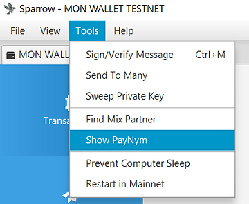

بعد ذلك، ستحتاج إلى ربط واتصال PayNym الخاص بك بالمستلم الخاص بك. للقيام بذلك، أدخل رمز الدفع القابل لإعادة الاستخدام في نافذة "Find Contact"، واتبعه، ثم قم بإجراء عملية الإشعار عن طريق النقر على "Link Contact":

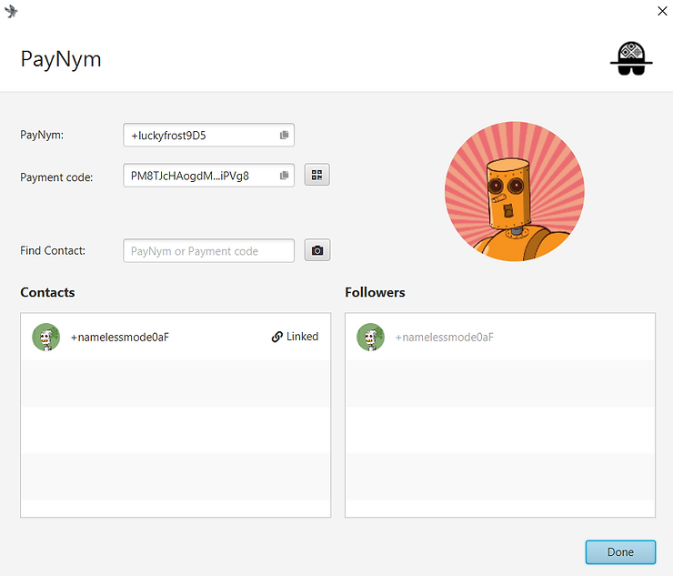

بمجرد تأكيد عملية الإشعار، يمكننا إرسال المدفوعات إلى رمز الدفع القابل لإعادة الاستخدام. هنا هو الإجراء الذي يجب اتباعه:

الآن بعد أن تمكنا من دراسة الجانب العملي لتنفيذ PayNym من BIP47، دعونا نرى معًا كيف يعمل كل هذه الآليات، وما هي الطرق المشفرة المستخدمة.

## آلية BIP47.
لدراسة آليات BIP47، من الضروري فهم هيكل المحفظة التسلسلية التصاعدية (HD) وآليات استنتاج أزواج المفاتيح الفرعية، بالإضافة إلى مبادئ التشفير على المنحنيات البيضاوية. لحسن الحظ، يمكنك العثور على جميع هذه المعلومات اللازمة لفهم هذا الجزء في مدونتي:
* [فهم مسارات استنتاج محفظة بيتكوين](https://www.pandul.fr/post/comprendre-les-chemins-de-d%C3%A9rivation-d-un-portefeuille-bitcoin)

* [محفظة بيتكوين - مقتطف من كتاب Bitcoin Démocratisé 2](https://www.pandul.fr/post/le-portefeuille-bitcoin-extrait-ebook-bitcoin-d%C3%A9mocratis%C3%A9-2)

### رمز الدفع القابل لإعادة الاستخدام.

كما شرح في الجزء الثاني من هذا الورق، يتم وضع رمز الدفع القابل لإعادة الاستخدام في العمق الثالث للمحفظة التسلسلية التصاعدية. وفي النهاية، يمكن اعتباره إلى حد ما مشابهًا لـ xpub، سواء في موضعه وهيكله ودوره.

فيما يلي الأجزاء المختلفة التي تتكون منها رمز الدفع المكون من 80 بايتًا:

* البايت 0: الإصدار. إذا كنا نستخدم الإصدار الأول من BIP47، فسيكون هذا البايت مساويًا لـ 0x01.

* البايت 1: حقل البتات. يتم احتجاز هذا المجال لتقديم توجيهات إضافية في حالة الاستخدام الخاص. إذا كنا نستخدم فقط PayNym، فسيكون هذا البايت مساويًا لـ 0x00.

* البايت 2: زوجية y. يشير هذا البايت إلى 0x02 أو 0x03 اعتمادًا على زوجية (عدد زوجي أو عدد فردي) قيمة الإحداثيات الصادرة عن مفتاحنا العمومي. للحصول على مزيد من المعلومات حول هذه الممارسة، يرجى قراءة الخطوة 1 في الجزء "استنتاج عنوان" من هذه المقالة.

* من البايت 3 إلى البايت 34: قيمة x. تشير هذه البايتات إلى الإحداثيات الأفقية لمفتاحنا العمومي. يعطينا توصيل x وزوجية y مفتاحنا العمومي المضغوط.

* من البايت 35 إلى البايت 66: رمز السلسلة. يتم احتجاز هذا المجال لرمز السلسلة المرتبط بالمفتاح العمومي المذكور أعلاه.

* من البايت 67 إلى البايت 79: التعبئة. يتم احتجاز هذا المجال لتطورات مستقبلية محتملة. في الإصدار 1، نضع ببساطة أصفارًا لملء حتى 80 بايتًا، وهو حجم بيانات إخراج OP_RETURN.

فيما يلي التمثيل السداسي عشري لرمز الدفع القابل لإعادة الاستخدام الخاص بي، الذي تم تقديمه في الجزء السابق، مع الألوان المطابقة للبايتات المعروضة أعلاه:
ثم، يجب أيضًا إضافة البايت البادئة "P" للتعرف بسهولة على أنها رمز للدفع. هذا البايت هو 0x47.

>0x47010002a0716529bae6b36c5c9aa518a52f9c828b46ad8d907747f0d09dcd4d9a39e97c3c5f37c470c390d842f364086362f6122f412e2b0c7e7fc6e32287e364a7a36a00000000000000000000000000

أخيرًا، نحسب الجمع التحققي لهذا الرمز الدفع باستخدام HASH256، أي بتطبيق دالة SHA256 مرتين. نسترد الأربعة بايت الأولى من هذا الهاش ونضيفها في النهاية (باللون الوردي).

>0x47010002a0716529bae6b36c5c9aa518a52f9c828b46ad8d907747f0d09dcd4d9a39e97c3c5f37c470c390d842f364086362f6122f412e2b0c7e7fc6e32287e364a7a36a00000000000000000000000000567080c4

الرمز الدفع جاهز، فقط تحتاج إلى تحويله إلى Base 58:

>PM8TJSBiQmNQDwTogMAbyqJe2PE2kQXjtgh88MRTxsrnHC8zpEtJ8j7Aj628oUFk8X6P5rJ7P5qDudE4Hwq9JXSRzGcZJbdJAjM9oVQ1UKU5j2nr7VR5 

كما يمكن ملاحظة، يشبه هذا البناء بشكل كبير هيكل المفتاح العام الموسع من النوع "xpub".

خلال هذه العملية التي تؤدي إلى الحصول على رمز الدفع الخاص بنا، استخدمنا مفتاح عام مضغوط ورمز سلسلة. هاتان العنصران هما نتيجة للاشتقاق التحديدي والتسلسلي، من بذرة المحفظة، باتباع المسار التالي للاشتقاق: m/47'/0'/0'/
بشكل عملي، للحصول على المفتاح العام ورمز سلسلة رمز الدفع القابل لإعادة الاستخدام، سنقوم بحساب المفتاح الخاص الرئيسي من البذرة، ثم نشتق زوجًا فرعيًا بالفهرس 47 + 2^31 (تفريع معزز). بعد ذلك، نشتق مرتين زوجين فرعيين بالفهرس 2^31 (تفريع معزز).
> إذا كنت ترغب في معرفة المزيد حول تفريع أزواج المفاتيح الفرعية في محفظة بيتكوين التسلسلية المحددة، أنصحك بالاطلاع على CRYPTO301.

### الطريقة التشفيرية: تبادل مفاتيح Diffie-Hellman على المنحنيات البيضاوية (ECDH).

الطريقة التشفيرية المستخدمة في أساس BIP47 هي ECDH (Elliptic-Curve Diffie-Hellman = تبادل مفاتيح Diffie-Hellman على المنحنيات البيضاوية). هذا البروتوكول هو نوع مختلف من تبادل مفاتيح Diffie-Hellman التقليدي.

تبادل مفاتيح Diffie-Hellman هو بروتوكول اتفاق على المفاتيح تم تقديمه في عام 1976 والذي يتيح لشخصين، باستخدام زوجين من المفاتيح العامة والخاصة، تحديد سر مشترك عن طريق التبادل عبر قناة اتصال غير آمنة.

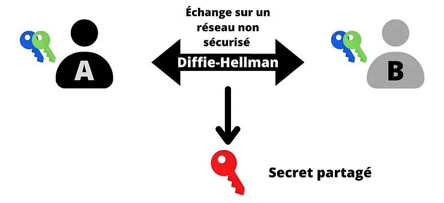

يمكن استخدام هذا السر المشترك (المفتاح الأحمر) لأداء مهام أخرى. عادةً ما يمكن استخدام هذا السر المشترك لتشفير وفك تشفير اتصال عبر شبكة غير آمنة:

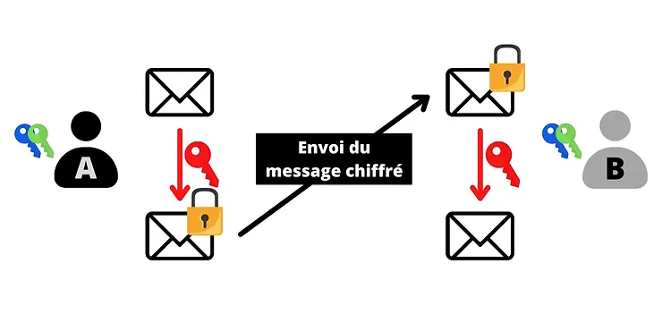

لتحقيق هذا التبادل، يستخدم Diffie-Hellman الحساب المتبقي لحساب السر المشترك. هنا هو كيف يعمل بشكل مبسط:

* يحدد أليس وبوب لونًا مشتركًا، هنا الأصفر. هذا اللون معروف للجميع. إنه بيان عام.

* يختار أليس لونًا سريًا، هنا الأحمر. تمزج اللونين معًا لتحصل على اللون البرتقالي.

* يختار بوب لونًا سريًا، هنا الأزرق البطة. تمزج اللونين معًا لتحصل على اللون الأزرق السماوي.

* يمكن لأليس وبوب تبادل الألوان التي حصلا عليها: البرتقالي والأزرق السماوي. يمكن أن يحدث هذا التبادل عبر شبكة غير آمنة ويمكن للمهاجمين مشاهدته.

* يمزج أليس اللون الأزرق السماوي الذي تلقته من بوب مع اللون السري لديها (الأحمر). تحصل على اللون البني.

* يمزج بوب اللون البرتقالي الذي تلقاه من أليس مع اللون السري لديه (الأزرق البطة). يحصل على نفس اللون البني.

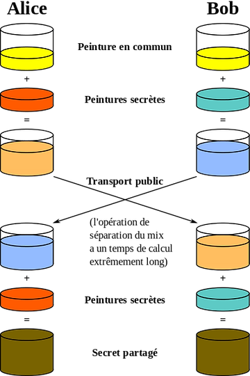

>المصدر: الفكرة الأصلية: A.J. Han Vinck النسخة البيانية: Flugaal الترجمة: Dereckson، الملكية العامة، عبر ويكيميديا كومنز. https://commons.wikimedia.org/wiki/File:Diffie-Hellman_Key_Exchange_(fr).svg
في هذا التبسيط، يُمثل اللون البني السر المشترك بين أليس وبوب. يجب أن نتخيل أنه في الواقع، من المستحيل على المهاجم أن يفصل الألوان البرتقالية والسماوية الفاتحة لاستعادة الألوان السرية لأليس أو بوب.
الآن، دعونا ندرس كيفية عمله الفعلي. على النظرة الأولى، يبدو Diffie-Hellman معقدًا للغاية لفهمه. في الواقع، مبدأ عمله تقريبًا سهل جدًا. قبل أن نشرح لكم آلياته بالتفصيل، أود أن أذكر لكم بسرعة مفهومين رياضيين سنحتاج إليهما (والتي، بالمناسبة، تستخدم أيضًا في العديد من الأساليب التشفيرية الأخرى).

1. العدد الأول هو عدد طبيعي يحتوي فقط على عاملين: 1 ونفسه. على سبيل المثال، الرقم 7 هو عدد أول، لأنه لا يمكن قسمته إلا على 1 و 7 (نفسه). ومع ذلك، الرقم 8 ليس عددًا أول، لأنه يمكن قسمته على 1 و 2 و 4 و 8. لذلك، فإنه لا يحتوي على عاملين فقط، ولكنه يحتوي على أربعة عوامل صحيحة وإيجابية.

2. الـ "modulo" (المعروف أيضًا بـ "mod" أو "%") هو عملية رياضية تسمح بإعادة الباقي من القسمة الأوروبية بين عددين صحيحين. على سبيل المثال، 16 mod 5 يساوي 1.

تعمل عملية تبادل المفاتيح Diffie-Hellman بين أليس وبوب على النحو التالي:

* يحدد أليس وبوب عددين مشتركين: p و g. p هو عدد أول. كلما كان هذا العدد p أكبر، كلما كان Diffie-Hellman أكثر أمانًا. g هو جذر أولي لـ p. يمكن تبادل هاتين القيمتين بوضوح عبر شبكة غير آمنة، وهما ما يعادل اللون الأصفر في التبسيط أعلاه. المهم هو أن يكون لدى أليس وبوب نفس القيم p و g تمامًا.

* بعد تحديد البارامترات، يحدد كل من أليس وبوب عددًا عشوائيًا سريًا. يُطلق على العدد العشوائي الذي يحصل عليه أليس اسم a (ما يعادل اللون الأحمر) والعدد العشوائي الذي يحصل عليه بوب اسم b (ما يعادل اللون الأزرق الداكن). يجب أن تبقى هاتين القيمتين سريتين.

* بدلاً من تبادل هاتين القيمتين a و b، ستقوم كل طرف بحساب A (بالأحرف الكبيرة) و B (بالأحرف الكبيرة) على النحو التالي:

> A تساوي g مرفوعة إلى قوة a وتقسم على p:
A = g^a % p

> B تساوي g مرفوعة إلى قوة b وتقسم على p:
B = g^b % p

* ستتم مشاركة هاتين القيمتين A (ما يعادل اللون البرتقالي) و B (ما يعادل اللون السماوي الفاتح) بين الطرفين. يمكن تبادل هاتين القيمتين على شبكة غير آمنة بوضوح.

* أليس، التي تعرف الآن قيمة B، ستحسب قيمة z على النحو التالي:

> z تساوي B مرفوعة إلى قوة a وتقسم على p:
z = B^a % p
* للتذكير، B = g^b % p. لذلك لدينا:
> z = B^a % p
> z = (g^b)^a % p
>
> وفقًا لقواعد الحسابات على الأسس:
>
> (x^n)^m = x^nm
>
> لذلك لدينا:
>
> z = g^ba % p

* بوب، الذي يعرف الآن قيمة A، سيقوم أيضًا بحساب قيمة z كالتالي:

> z يساوي A مرفوعة للقوة b ومأخوذ الباقي عند القسمة على p:
>
> z = A^b % p
>
> لذلك لدينا:
>
> z = (g^a)^b % p
> z = g^ab % p
> z = g^ba % p

بفضل توزيعية عامل الباقي، يجد أليس وبوب نفس القيمة z بالضبط. هذا العدد يمثل سرهما المشترك، أي ما يعادل اللون البني في التبسيط السابق. يمكنهم استخدام هذا السر المشترك لتشفير الاتصال بينهما على شبكة غير آمنة.

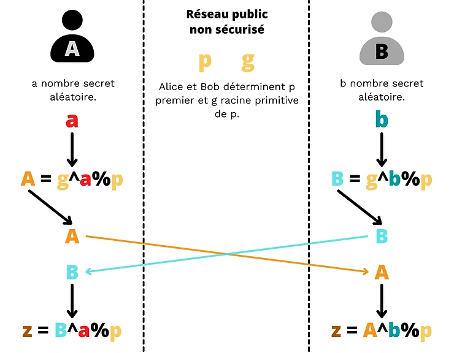

سيكون المهاجم الذي يمتلك p و g و A و B غير قادر على حساب a أو b أو z. إجراء هذا الحساب يعادل عكس الأس. من المستحيل تنفيذ هذا الحساب بأي طريقة أخرى سوى محاولة جميع الاحتمالات واحدًا تلو الآخر نظرًا لأننا نعمل على مجموعة محدودة. سيكون هذا ما يعادل حساب اللوغاريتم الناقص، أي العكس التام للأس في مجموعة دورية.

بالتالي، طالما نختار a و b و p بأحجام كبيرة بما فيه الكفاية، فإن Diffie-Hellman آمن. عادةً، باستخدام معلمات تتألف من 2,048 بت (عدد مكون من 600 أرقام عشرية)، سيكون من المستحيل اختبار جميع الاحتمالات لـ a و b. حتى الآن، يُعتبر الخوارزمية آمنة باستخدام أعداد بهذا الحجم.

وهنا تكمن العيب الرئيسي لبروتوكول Diffie-Hellman. لكي يكون آمنًا، يجب أن يستخدم الخوارزمية أعدادًا كبيرة الحجم. وبالتالي، يُفضل اليوم استخدام خوارزمية ECDH، وهي نسخة من Diffie-Hellman تستخدم منحنى جبري، وبالتحديد منحنى بيضاوي. سيتيح لنا ذلك العمل على أعداد أصغر بكثير مع الحفاظ على نفس مستوى الأمان، وبالتالي تقليل الموارد المطلوبة للحساب والتخزين.

يبقى المبدأ العام للخوارزمية هو نفسه. ولكن بدلاً من استخدام عدد عشوائي a وعدد A المحسوب من a باستخدام الأس الموديولي، سنستخدم زوجًا من المفاتيح المنشأة على منحنى بيضاوي. بدلاً من الاعتماد على توزيعية عامل الباقي، سنستخدم هنا قانون المجموعة على المنحنيات البيضاوية، وتحديدًا تجانسية هذا القانون.
إذا كنت لا تمتلك أي فكرة عن كيفية عمل المفاتيح الخاصة والعامة على منحنى بيضاوي، سأشرح لك الأساسيات في الأجزاء الستة الأولى من هذه المقالة.

لتلخيصها بشكل عام، المفتاح الخاص هو عدد عشوائي بين 1 و n-1 (حيث n هو ترتيب المنحنى)، والمفتاح العام هو نقطة فريدة على المنحنى تم تحديدها باستخدام المفتاح الخاص من خلال إضافة وضعف النقاط من النقطة المولدة كالتالي:

>K = k·G

حيث K هو المفتاح العام، k هو المفتاح الخاص، و G هو النقطة المولدة.

إحدى خصائص هذا الزوج من المفاتيح هو أنه من السهل جدًا تحديد K عند معرفة k و G، ولكن من المستحيل حاليًا تحديد k عند معرفة K و G. إنها وظيفة ذات اتجاه واحد.

بمعنى آخر، يمكننا بسهولة حساب المفتاح العام عند معرفة المفتاح الخاص، ولكن من المستحيل حساب المفتاح الخاص عند معرفة المفتاح العام. تعتمد هذه الأمان مرة أخرى على عدم إمكانية حساب اللوغاريتم العشري المتفرق.

لذا سنستخدم هذه الخاصية لتكييف خوارزمية Diffie-Hellman الخاصة بنا. بالتالي، مبدأ عمل ECDH هو كما يلي:

* يتفق أليس وبوب معًا على منحنى بيضاوي آمن من الناحية التشفير ومعلماته. هذه المعلومات عامة.

* تقوم أليس بإنشاء عدد عشوائي ka الذي سيكون مفتاحها الخاص. يجب أن يبقى هذا المفتاح الخاص سريًا. تحدد المفتاح العام الخاص بها Ka عن طريق إضافة وضعف النقاط على المنحنى البيضاوي المختار.

> Ka = ka·G

* يقوم بوب أيضًا بإنشاء عدد عشوائي سيكون مفتاحه الخاص kb. ثم يحسب المفتاح العام المرتبط به Kb.

> Kb = kb·G

* يتبادل أليس وبوب مفاتيحهما العامة Ka و Kb عبر شبكة عامة غير آمنة.

* تحسب أليس نقطة (x، y) على المنحنى عن طريق تطبيق مفتاحها الخاص ka من مفتاح بوب العام Kb.

> (x، y) = ka·Kb

* يحسب بوب نقطة (x، y) على المنحنى عن طريق تطبيق مفتاحه الخاص kb من مفتاح أليس العام Ka.

> (x، y) = kb·Ka

* يحصل أليس وبوب على نفس النقطة على المنحنى البيضاوي. سيكون السر المشترك هو الإحداثي x لهذه النقطة.

إنهما يحصلان على نفس السر المشترك لأن:

> (x، y) = ka·Kb = ka·kb·G = kb·ka·G = kb·Ka

المهاجم المحتمل الذي يراقب الشبكة العامة غير الآمنة سيكون قادرًا فقط على الحصول على المفاتيح العامة لكل منهما ومعلمات المنحنى المختار. كما شرحنا سابقًا، هذين المعلومتين وحدهما لا تسمحان بتحديد المفاتيح الخاصة، وبالتالي لا يمكن للمهاجم الوصول إلى السر.
ECDH هو خوارزمية تسمح بتبادل المفاتيح. سيتم استخدامها في كثير من الأحيان جنبًا إلى جنب مع طرق تشفير أخرى لتحديد بروتوكول. على سبيل المثال ، يتم استخدام ECDH في قلب بروتوكول TLS (أمان طبقة النقل) ، وهو بروتوكول تشفير ومصادقة يستخدم لطبقة النقل عبر الإنترنت. يستخدم TLS ECDHE لتبادل المفاتيح ، وهو اختلاف عن ECDH حيث تكون المفاتيح مؤقتة لتوفير السرية المستمرة. بالإضافة إلى ذلك ، يستخدم TLS أيضًا خوارزمية مصادقة مثل ECDSA ، وخوارزمية تشفير مثل AES ، ووظيفة تجزئة مثل SHA256.

يحدد TLS على وجه الخصوص الحرف "s" في "https" ، بالإضافة إلى القفل الصغير الذي تراه في المتصفح الخاص بك في الزاوية العلوية اليسرى ، والذي يضمن لك تشفير الاتصال. لذا فأنت تستخدم ECDH عند قراءة هذه المقالة ، وربما تستخدمه يوميًا دون أن تدرك ذلك.

### عملية الإشعار

كما اكتشفنا في الجزء السابق ، ECDH هو اختلاف عن تبادل Diffie-Hellman ينطوي على أزواج من المفاتيح المنشأة على منحنى بيضاوي. ومن الجيد أن لدينا العديد من الأزواج المفتاحية التي تلتزم بهذا المعيار في محافظنا Bitcoin!

لذا ، سيكون الفكرة هنا استخدام أزواج المفاتيح في محافظ Bitcoin التسلسلية الهرمية للطرفين لإنشاء أسرار مشتركة ومؤقتة بينهما. في إطار BIP47 ، يتم استخدام ECDHE (Elliptic Curve Diffie-Hellman Ephemeral) بدلاً من ذلك.

يتم استخدام ECDHE للمرة الأولى في BIP47 لنقل رمز الدفع من المرسل إلى المستلم. هذه هي عملية الإشعار المشهورة. في الواقع ، لكي يمكن استخدام BIP47 ، يجب أن يكون كل من الطرفين (المرسل الذي يرسل المدفوعات والمستلم الذي يستلم المدفوعات) على علم برمز الدفع للطرف الآخر. سيكون ذلك ضروريًا لاستنتاج المفاتيح العمومية المؤقتة ، وبالتالي عناوين الاستلام المخصصة.

قبل هذا التبادل ، يكون المرسل بشكل منطقي بالفعل على علم برمز الدفع للمستلم لأنه يمكنه الحصول عليه خارج السلسلة ، على سبيل المثال ، من موقع الويب الخاص به أو من وسائل التواصل الاجتماعي. ومع ذلك ، قد لا يكون المستلم بالضرورة على علم برمز الدفع للمرسل. سيتعين علينا إرساله له ، وإلا فلن يتمكن من استنتاج مفاتيحه المؤقتة ، وبالتالي سيكون غير قادر على معرفة أين توجد بيتكويناته وفتح أمواله. يمكننا بالتالي إرساله له خارج السلسلة ، باستخدام نظام اتصال آخر ، ولكن هذا سيشكل مشكلة في حالة استعادة المحفظة من البذرة.
في الواقع، كما ذكرت سابقًا، فإن عناوين BIP47 لا تتم تشتيتها من بذرة المستلم (إذا كان الأمر كذلك، فمن الأفضل استخدام أحد عناوين xpub مباشرة)، بل هي نتيجة لحساب يشمل كودي الدفع: واحد للمستلم وواحد للمرسل. لذلك، إذا فقد المستلم محفظته وحاول استعادتها من بذرته، فسيحتاج بالضرورة إلى كل أكواد الدفع للأشخاص الذين أرسلوا له بيتكوين عبر BIP47.
بالتالي، يمكننا استخدام BIP47 بسهولة بدون هذه المعاملة التنبيهية، ولكن سيتعين على كل مستخدم أن يقوم بنسخ احتياطي لأكواد الدفع لأقرانه. وسيظل هذا الوضع غير قابل للإدارة حتى نجد وسيلة بسيطة ومتينة لإنشاء وتخزين وتحديث هذه النسخ الاحتياطية. لذلك، فإن المعاملة التنبيهية ضرورية تقريبًا في الوضع الحالي للأمور.

بالإضافة إلى دورها في نسخ أكواد الدفع، كما يوحي اسمها، تلعب هذه المعاملة أيضًا دورًا في إعلام المستلم. فهي تسمح لعميله بمعرفة أن نفقًا قد تم فتحه للتو.

قبل أن أشرح لكم بالتفصيل كيفية عمل المعاملة التنبيهية من الناحية التقنية، أود أن أتحدث قليلاً عن نموذج الخصوصية. فبالفعل، سيبرر نموذج BIP47 بعض الاحتياطات التي تم اتخاذها أثناء بناء هذه المعاملة الأولية.

في حد ذاته، فإن كود الدفع لا يشكل مخاطر مباشرة على الخصوصية. على عكس النموذج التقليدي لبيتكوين الذي يسمح بكسر تدفق المعلومات بين هوية المستخدم والمعاملات، بما في ذلك الاحتفاظ بالمفاتيح العامة مجهولة، يمكن ربط كود الدفع مباشرة بهوية. بالطبع، ليس هذا أمرًا إلزاميًا، ولكن هذا الارتباط ليس خطيرًا.

في الواقع، لا يشتق كود الدفع مباشرة عناوين استقبال مدفوعات BIP47. بدلاً من ذلك، يتم الحصول على العناوين عن طريق تطبيق ECDHE بين مفاتيح الأطفال لأكواد الدفع للطرفين.

لذلك، فإن كود الدفع بمفرده لا يشكل مخاطر مباشرة على الخصوصية لأننا نشتق فقط عنوان الإشعار منه. يمكننا الحصول على بعض المعلومات منه، ولكننا عادة ما لن نعرف مع من تقوم بإجراء المعاملات.

لذا، من الضروري الحفاظ على هذا الفصل الصارم بين أكواد الدفع للمستخدمين. ومن أجل تحقيق هذا الهدف، فإن مرحلة التواصل الأولية للكود هي لحظة حرجة لخصوصية الدفعة، ومع ذلك فهي ضرورية لسلامة عمل البروتوكول. إذا كان أحد أكواد الدفع يمكن استرداده علنيًا (على سبيل المثال، على موقع ويب)، فلا يجب ربط الكود الثاني، أي كود المرسل، به.

على سبيل المثال، لنفترض أنني أرغب في التبرع باستخدام BIP47 لحركة احتجاج سلمية في كندا:
* قامت هذه المنظمة بنشر رمز الدفع الخاص بها مباشرة على موقعها الإلكتروني أو على شبكات التواصل الاجتماعي الخاصة بها.
* يرتبط هذا الرمز بالحركة.

* أحصل على رمز الدفع هذا.

* قبل أن أتمكن من إرسال عملية دفع لهم ، يجب أن أتأكد من أنهم على علم برمز الدفع الشخصي الخاص بي والذي يرتبط أيضًا بهويتي لأنني استخدمه لاستقبال العمليات من شبكات التواصل الاجتماعي الخاصة بي.

كيف يمكنني إرساله لهم؟ إذا قمت بإرساله بوسائل اتصال تقليدية ، فقد يتسرب المعلومات ، وقد يتم تسجيلي كشخص يدعم الحركات السلمية.

بالتأكيد ، ليست عملية الإبلاغ هي الحل الوحيد لنقل رمز الدفع للمرسل بسرية ، ولكنها تؤدي بشكل مثالي هذا الدور حاليًا من خلال تطبيق عدة طبقات من الأمان.

في الرسم التوضيحي أدناه ، تمثل الخطوط الحمراء اللحظة التي يجب فيها قطع تدفق المعلومات ، وتمثل السهام السوداء الروابط الواضحة التي يمكن أن يجدها مراقب خارجي:

! [مخطط نموذج سرية رمز الدفع القابل لإعادة الاستخدام] (assets/15.png)

في الواقع ، بالنسبة لنموذج السرية التقليدي لبيتكوين ، من الصعب في كثير من الأحيان قطع تمامًا تدفق المعلومات بين زوج المفاتيح والمستخدم ، خاصة عند إجراء المعاملات عن بُعد. على سبيل المثال ، في حالة حملة التبرع ، سيكون على المستلم أن يكشف عن عنوان أو مفتاح عام على موقعه الإلكتروني أو شبكات التواصل الاجتماعي الخاصة به. يسمح استخدام BIP47 الصحيح ، أي مع عملية الإبلاغ ، بحل هذه المشكلة من خلال ECDHE وطبقة التشفير التي سندرسها.

بالطبع ، يلاحظ نموذج السرية التقليدي لبيتكوين دائمًا على مستوى المفاتيح العامة المؤقتة المشتقة من ارتباط الرموز المستخدمة للدفع. النموذجان مترابطان. أرغب فقط في إلقاء الضوء هنا على أنه على عكس استخدام معتاد للمفتاح العام لاستقبال بيتكوين ، يمكن ربط رمز الدفع بهوية ، لأن المعلومات "بوب يقوم بعملية تحويل مع أليس" تكون مقطوعة في وقت آخر. يتم استخدام رمز الدفع لتوليد عناوين الدفع ، ولكن من خلال مراقبة سلسلة الكتل فقط ، فمن المستحيل ربط عملية الدفع BIP47 برموز الدفع المستخدمة لتنفيذها.

### بناء عملية الإبلاغ.

الآن ، دعونا نرى كيف يعمل عملية الإبلاغ هذه. لنفترض أن أليس ترغب في إرسال الأموال إلى بوب باستخدام BIP47. في مثالي ، تعمل أليس كالمرسل وبوب كالمستلم. قد نشر الأخير رمز الدفع الخاص به على موقعه الإلكتروني. لذا فإن أليس بالفعل على علم برمز الدفع الخاص ببوب.

1. يحسب أليس سرًا مشتركًا باستخدام ECDH:
* تقوم أليس بتحديد زوج من المفاتيح من محفظتها على فروع مختلفة عن رمز الدفع الخاص بها. تنبيه، يجب ألا يكون بإمكان أي شخص ربط هذا الزوج بسهولة بعنوان إشعار أليس أو هويتها (انظر الجزء السابق).
* تحدد أليس المفتاح الخاص لهذا الزوج. نسميه "أ" (حرف صغير).

> أ

* تسترد أليس المفتاح العام المرتبط بعنوان إشعار بوب. هذا المفتاح هو الابن الأول المشتق من رمز الدفع لبوب (الفهرس 0). نسمي هذا المفتاح العام "ب" (حرف كبير). المفتاح الخاص المرتبط بهذا المفتاح العام يسمى "ب" (حرف صغير). يتم تحديد "ب" عن طريق إضافة وضعف النقاط على المنحنى البيضاوي من "ج" (نقطة المولد) مع "ب" (المفتاح الخاص).

> ب = ب·ج

* تحسب أليس نقطة سرية "س" (حرف كبير) على المنحنى البيضاوي عن طريق إضافة وضعف النقاط باستخدام المفتاح الخاص "أ" من المفتاح العام لبوب "ب".

> س = أ·ب

* تحسب أليس العامل المعمي "ف" الذي سيتيح تشفير رمز الدفع الخاص بها. للقيام بذلك، ستحدد عددًا شبه عشوائيًا باستخدام وظيفة HMAC-SHA512. في الإدخال الثاني لهذه الوظيفة، تستخدم قيمة يمكن لبوب فقط استردادها: (x) وهي الإحداثي للنقطة السرية المحسوبة سابقًا. الإدخال الأول هو (o) وهو UTXO المستهلك كإدخال لهذه المعاملة (outpoint).

> ف = HMAC-SHA512(o, x)

2. تحول أليس رمز الدفع الشخصي الخاص بها إلى القاعدة 2 (ثنائي).

3. تستخدم هذا العامل المعمي كمفتاح لتنفيذ تشفير تقارني على حمولة رمز الدفع الخاص بها. الخوارزمية المستخدمة للتشفير هي ببساطة XOR. العملية المنفذة مشابهة لتشفير فيرنام، المعروف أيضًا باسم "القناع القابل للتصرف" (بالإنجليزية: "One-Time Pad"):

* يقسم أليس في البداية العامل المعمي إلى قسمين: البايتات الأولى 32 تسمى "f1" والبايتات الأخيرة 32 تسمى "f2". لذا لدينا:

> ف = f1 || f2

* تحسب أليس التشفير (x') للإحداثي للمفتاح العام (x) لرمز الدفع الخاص بها، والتشفير (c') لسلسلة رمزها (c) بشكل منفصل. "f1" و "f2" تعملان على التوالي كمفاتيح التشفير. العملية المستخدمة هي XOR (حصري).

> x' = x XOR f1
>
c>' = c XOR f2
* تقوم أليس بتحويل القيم الحقيقية للمحور الأفقي للمفتاح العام (x) ورمز السلسلة (c) في رمز الدفع الخاص بها إلى القيم المشفرة (x') و (c').

قبل أن نستمر في الوصف التقني لهذه المعاملة التنبيهية، دعونا نتوقف لحظة عند عملية XOR. XOR هو عامل منطقي على مستوى البتات يستند إلى جبر بول. من خلال اثنين من العمليات المشغلة في البتات، يعيد 1 إذا كانت البتات في نفس الموضع مختلفة، ويعيد 0 إذا كانت البتات في نفس الموضع متساوية. هنا جدول الحقيقة لعملية XOR بناءً على قيم العمليات D و E:

| D | E | D XOR E |
|---|---|---------|
| 0 | 0 |   0     |
| 0 | 1 |   1     |
| 1 | 0 |   1     |
| 1 | 1 |   0     |

على سبيل المثال:

> 0110 XOR 1110 = 1000

أو بمعنى آخر:

> 010011 XOR 110110 = 100101

مع ECDH، استخدام XOR كطبقة تشفير متسقة بشكل خاص. أولاً، بفضل هذا المشغل، يكون التشفير تماثليًا. سيتمكن المستلم من فك تشفير رمز الدفع باستخدام نفس المفتاح الذي تم به التشفير. يتم حساب مفتاح التشفير وفك التشفير من السر المشترك باستخدام ECDH.

يتيح هذا التماثل الخصائص التالية لعملية XOR:

- خصائص أخرى:
 -> D ⊕ D = 0
 -> D ⊕ 0 = D
 
- تبديل:
 D ⊕ E = E ⊕ D
 
- تجميع:
 D ⊕ (E ⊕ Z) = (D ⊕ E) ⊕ Z = D ⊕ E ⊕ Z
 
- تماثل:
 إذا : D ⊕ E = L
 ثم :  D ⊕ L = D ⊕ (D ⊕ E) = D ⊕ D ⊕ E = 0 ⊕ E = E
 ->  D ⊕ L = E
ثم، تشبه هذه طريقة التشفير إلى حد كبير تشفير فيرنام (One-Time Pad)، وهو الخوارزمية الوحيدة المعروفة حتى الآن التي تتمتع بأمان غير مشروط (أو مطلق). لكي يتمتع تشفير فيرنام بهذه الخاصية، يجب أن تكون مفتاح التشفير عشوائيًا تمامًا، وأن يكون بنفس حجم الرسالة وأن يتم استخدامه مرة واحدة فقط. في طريقة التشفير المستخدمة هنا لـ BIP47، يكون المفتاح بنفس حجم الرسالة، ويكون عامل التعمية بنفس حجم تجميع الإحداثيات للمفتاح العام مع رمز سلسلة رمز الدفع. يتم استخدام هذا المفتاح للتشفير مرة واحدة فقط. ومع ذلك، فإن هذا المفتاح ليس عشوائيًا تمامًا لأنه HMAC. بدلاً من ذلك، فهو شبه عشوائي. لذلك، فهو ليس تشفير فيرنام، ولكن الطريقة تقترب منه.

لنعود إلى بناء عملية الإخطار:

4. لديها أليس حاليًا رمز الدفع الخاص بها مع حمولة مشفرة. ستقوم ببناء وبث عملية إشعار تشتمل على مفتاحها العام "أ" كإدخال، وإخراج موجه إلى عنوان إشعار بوب، وإخراج OP_RETURN مكون من رمز الدفع الخاص بها مع الحمولة المشفرة. هذه العملية هي عملية الإشعار.

OP_RETURN هو Opcode، أي سكريبت، يسمح بوضع علامة على إخراج عملية تحويل بيتكوين كغير صالحة. يُستخدم اليوم لنشر أو تثبيت المعلومات على سلسلة كتل بيتكوين. يمكن تخزين ما يصل إلى 80 بايتًا من البيانات في السلسلة، وبالتالي يمكن رؤيتها من قبل جميع المستخدمين الآخرين.

كما رأينا في الجزء السابق، يُستخدم Diffie-Hellman لتوليد سر مشترك بين مستخدمين اثنين يتواصلان عبر شبكة غير آمنة، ويمكن أن يراقبها المهاجمون. في BIP47، يُستخدم ECDH للتواصل عبر شبكة بيتكوين، والتي بطبيعتها شبكة اتصال شفافة وتراقبها العديد من الهجمات. يتم استخدام السر المشترك الذي يتم حسابه من خلال تبادل مفاتيح Diffie-Hellman على المنحنى البيضاوي لتشفير المعلومات السرية المراد نقلها: رمز الدفع للمرسل (أليس).

فيما يلي رسم توضيحي مستمد من BIP47 يوضح ما تم وصفه للتو:

الائتمان: رموز الدفع القابلة لإعادة الاستخدام للمحافظ المحددة تحديدًا، جوستوس رانفير. https://github.com/bitcoin/bips/blob/master/bip-0047.mediawiki

إذا قمنا بمطابقة هذا الرسم التوضيحي مع ما وصفته لكم سابقًا:

* "مفتاح المحفظة الخاص" من جانب أليس يتوافق مع: a.

* "مفتاح الطفل العام 0" من جانب بوب يتوافق مع: B.
* "Notification Shared Secret" تعني: f.
* "Masked Payment Code" تعني الرمز المشفر للدفع، أي الحمولة المشفرة: x' و c'.

* "Notification Transaction" هي المعاملة التي تحتوي على OP_RETURN.

ألخص الخطوات التي انتقلنا من خلالها لإجراء معاملة إشعار:

* يقوم أليس بالحصول على رمز الدفع وعنوان الإشعار من بوب.

* يختار أليس UTXO الخاص بها في محفظتها HD مع الزوج المطابق للمفتاح.

* تحسب نقطة سرية على المنحنى البيضاوي باستخدام ECDH.

* تستخدم هذه النقطة السرية لحساب HMAC وهو العامل المعمي.

* تستخدم هذا العامل المعمي لتشفير الحمولة المشفرة لرمز الدفع الخاص بها.

* تستخدم مخرج المعاملة OP_RETURN لنقل الرمز المشفر للدفع إلى بوب.

لفهم كيفية عمله بشكل أفضل، وخاصة استخدام OP_RETURN، دعنا ندرس معًا معاملة إشعار حقيقية. قمت بإجراء معاملة من هذا النوع على Testnet يمكنك العثور عليها عن طريق النقر هنا:

https://mempool.space/fr/testnet/tx/0e2e4695a3c49272ef631426a9fd2dae6ec3a469e3a39a3db51aa476cd09de2e

TXID:

> 0e2e4695a3c49272ef631426a9fd2dae6ec3a469e3a39a3db51aa476cd09de2e

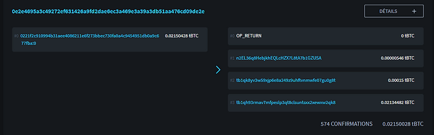

الائتمان: https://blockstream.info/

من خلال مراقبة هذه المعاملة، يمكننا أن نرى أنها تحتوي على مدخل واحد و 4 مخرجات:

* المخرج الأول هو OP_RETURN الذي يحتوي على رمز الدفع المشفر.

* المخرج الثاني بقيمة 546 ساتوشي يشير إلى عنوان الإشعار للمستلم.

* المخرج الثالث بقيمة 15,000 ساتوشي يمثل رسوم الخدمة، لأنني استخدمت محفظة Samourai لبناء هذه المعاملة.

* المخرج الرابع بقيمة مليوني ساتوشي يمثل الباقي، أي الفرق المتبقي من المدخل الذي يعود إلى عنوان آخر يملكه.

الأكثر إثارة للاهتمام لدراسة هو بالطبع المخرج 0 باستخدام OP_RETURN. دعنا نلقي نظرة أكثر تفصيلاً على ما يحتويه:

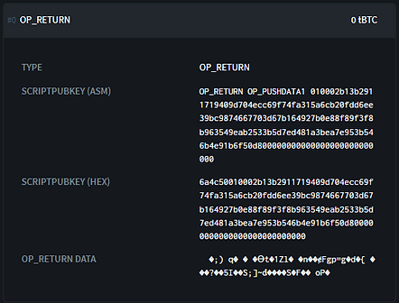

الائتمان: https://blockstream.info/

نجد في هذا النص النصي للمخرج بالنظام الست عشر:

>6a4c50010002b13b2911719409d704ecc69f74fa315a6cb20fdd6ee39bc9874667703d67b164927b0e88f89f3f8b963549eab2533b5d7ed481a3bea7e953b546b4e91b6f50d800000000000000000000000000

في هذا النص النصي، يمكننا تحليل عدة أجزاء:
>6a4c50010002b13b2911719409d704ecc69f74fa315a6cb20fdd6ee39bc9874667703d67b164927b0e88f89f3f8b963549eab2533b5d7ed481a3bea7e953b546b4e91b6f50d800000000000000000000000000>
> أكواد التشغيل:
>
>6a4c
>
> بايت يشير إلى حجم الحمولة (80 بايت):
>
>50
>
> بيانات التعريف لرمز الدفع الخاصة بي بشكل واضح:
>
> 010002
>
> الإحداثيات المشفرة للمفتاح العام لرمز الدفع الخاص بي:
>
> b13b2911719409d704ecc69f74fa315a6cb20fdd6ee39bc9874667703d67b164
>
> رمز السلسلة المشفرة لرمز الدفع الخاص بي:
> 927b0e88f89f3f8b963549eab2533b5d7ed481a3bea7e953b546b4e91b6f50d8
>
> حشو للوصول إلى 80 بايت:
> 00000000000000000000000000
>

من بين أكواد التشغيل، يمكن التعرف على 0x6a الذي يشير إلى OP_RETURN و 0x4c الذي يشير إلى OP_PUSHDATA1. البايت التالي لهذا الأخير يشير إلى حجم الحمولة التي تأتي بعده. يشير إلى 0x50، أي 80 بايت.

ثم يأتي رمز الدفع مع الحمولة المشفرة.

هذا هو رمز الدفع الخاص بي المستخدم في هذه المعاملة:

> بالقاعدة 58:
>
> PM8TJQCyt6ovbozreUCBrfKqmSVmTzJ5vjqse58LnBzKFFZTwny3KfCDdwTqAEYVasn11tTMPc2FJsFygFd3YzsHvwNXLEQNADgxeGnMK8Ugmin62TZU
>
> بالقاعدة 16 (HEX):
> 4701000277507c9c17a89cfca2d3af554745d6c2db0e7f6b2721a3941a504933103cc42add94881210d6e752a9abc8a9fa0070e85184993c4f643f1121dd807dd556d1dc000000000000000000000000008604e4db

إذا قارنا رمز الدفع الخاص بي المستخدم مع OP_RETURN، يمكننا أن نرى أن HRP (باللون البني) والتحقق من الصحة (باللون الوردي) لم يتم نقلهما. هذا طبيعي، حيث تكون هذه المعلومات مخصصة للبشر.
ثم يمكن التعرف على الإصدار (0x01)، وحقل البت (0x00)، والمفتاح العام الزوجي (0x02) (مشار إليها باللون الأخضر). وفي نهاية رمز الدفع، هناك بايتات فارغة (0x00) (مشار إليها باللون الأسود) التي تستخدم لملء الفراغ والوصول إلى إجمالي 80 بايتًا. يتم نقل جميع هذه البيانات الوصفية بوضوح (غير مشفرة).
أخيرًا، يمكننا ملاحظة أن الإحداثيات العمودية للمفتاح العام (مشار إليها باللون الأزرق) ورمز السلسلة (مشار إليها باللون الأحمر) تم تشفيرها. وهذا ما يشكل الحمولة المفيدة لرمز الدفع.

### استلام إشعار المعاملة.

الآن بعد أن أرسلت أليس معاملة الإشعار إلى بوب، دعونا نرى كيف يفسر بوب هذه المعاملة.

للتذكير، يجب على بوب أن يكون قادرًا بشكل إلزامي على الوصول إلى رمز الدفع الخاص بأليس. بدون هذه المعلومات، كما سنرى في الجزء التالي، لن يتمكن من استنتاج أزواج المفاتيح التي أنشأتها أليس، وبالتالي، لن يتمكن من الوصول إلى بيتكوينها التي تلقتها باستخدام BIP47. في الوقت الحالي، تم تشفير الحمولة المفيدة لرمز الدفع الخاص بأليس. دعونا نرى معًا كيف يقوم بوب بفك تشفيرها.

1. يراقب بوب المعاملات التي تنشئ مخرجات باستخدام عنوان الإشعار الخاص به.

2. عندما تحتوي المعاملة على مخرج يتوافق مع معيار BIP47، يحلل بوب المعاملة لمعرفة ما إذا كانت تحتوي على مخرج OP_RETURN مطابق.

3. إذا كان البايت الأول في الحمولة المفيدة لـ OP_RETURN هو 0x01، يبدأ بوب بالبحث عن سر مشترك محتمل باستخدام ECDH:

* يحدد بوب المفتاح العام المدخل للمعاملة. وهو مفتاح عام لأليس يسمى "A" ويتم تحديده بالمعادلة التالية:

> A = a·G

* يحدد بوب المفتاح الخاص "b" المرتبط بعنوان الإشعار الشخصي الخاص به:

> b

* يحسب بوب النقطة السرية "S" (سر مشترك ECDH) على المنحنى البيضاوي عن طريق إضافة وضعف النقاط باستخدام المفتاح الخاص "b" على المفتاح العام لأليس "A":

> S = b·A

* يحدد بوب العامل المعمي "f" الذي سيتيح فك تشفير الحمولة المفيدة لرمز الدفع الخاص بأليس. بنفس الطريقة التي حسبت بها أليس سابقًا، سيجد بوب "f" عن طريق تطبيق HMAC-SHA512 على (x) قيمة الإحداثي الأفقي للنقطة السرية "S"، وعلى (o) UTXO المستهلك في المدخل لهذه المعاملة الإشعارية:

> f = HMAC-SHA512(o, x)

4. يفسر بوب بيانات OP_RETURN في معاملة الإشعار كرمز دفع. سيقوم ببساطة بفك تشفير الحمولة المفيدة لرمز الدفع المحتمل هذا باستخدام العامل المعمي "f".
* بوب يقسم العامل المعمي "f" إلى جزئين: أول 32 بايت من "f" ستكون "f1" وآخر 32 بايت ستكون "f2".
* بوب يفك تشفير القيمة المشفرة للمحور (x') للمفتاح العام لرمز الدفع من أليس:

> x = x' XOR f1

* بوب يفك تشفير القيمة المشفرة لسلسلة الرمز (c') لرمز الدفع من أليس:

> c = c' XOR f2

5. بوب يتحقق مما إذا كانت قيمة المفتاح العام لرمز الدفع من أليس جزءًا من مجموعة secp256k1. إذا كان الأمر كذلك، فإنه يفسر ذلك على أنه رمز دفع صالح. وإلا، فإنه يتجاهل هذه العملية.

الآن بعد أن أصبح بوب على دراية برمز الدفع من أليس، يمكن لأليس أن ترسل له حتى 2^32 دفعة، دون الحاجة إلى إعادة إجراء عملية إعلام من هذا النوع مرة أخرى.

لماذا يعمل هذا؟ كيف يمكن لبوب أن يحدد نفس العامل المعمي الذي لديه أليس، وبالتالي فك تشفير رمز دفعها؟ دعنا ندرس بشكل أكثر تفصيلًا عملية ECDH في ما تم وصفه للتو.

أولاً وقبل كل شيء، نحن نتعامل مع تشفير متماثل. وهذا يعني أن مفتاح التشفير ومفتاح فك التشفير هما نفس القيمة. هذا المفتاح في عملية الإعلام هو العامل المعمي (f = f1 || f2). لذا، يجب على أليس وبوب الحصول على نفس القيمة لـ f، دون أن ينقلوها مباشرة حيث يمكن للمهاجم سرقتها وفك تشفير المعلومات السرية.

يتم الحصول على هذا العامل المعمي عن طريق تطبيق HMAC-SHA512 على قيمتين: القطعة الأفقية لنقطة سرية و UTXO المستهلكة كإدخال للعملية. لذا، يجب أن يكون لدى بوب هاتين المعلومتين لفك تشفير حمولة رمز الدفع من أليس.

بالنسبة لـ UTXO كإدخال، يمكن لبوب ببساطة استردادها من خلال مراقبة عملية الإعلام. أما بالنسبة للنقطة السرية، فيجب على بوب استخدام ECDH.

كما تم شرحه في الجزء المتعلق بـ Diffie-Hellman، ببساطة عن طريق تبادل المفاتيح العامة المتبادلة وتطبيق المفاتيح الخاصة بالأمان على المفتاح العام للطرف الآخر، يمكن لأليس وبوب العثور على نقطة محددة وسرية على المنحنى البيضاوي. يعتمد عملية الإعلام على هذا الآلية:

> زوج مفاتيح بوب:
>
> B = b·G
>
> زوج مفاتيح أليس:
>
> A = a·G
>
> لنقطة سرية S (x، y):
>
> S = a·B = a·b·G = b·a·G = b·A

الآن بعد أن يعرف بوب رمز الدفع الخاص بأليس، سيكون قادرًا على اكتشاف دفعات BIP47 الخاصة بها، وسيتمكن من استخراج المفاتيح الخاصة التي تحجب البيتكوين المستلمة.
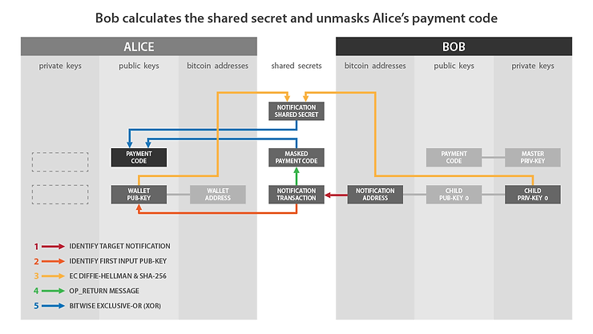

المصدر: رموز الدفع القابلة لإعادة الاستخدام لمحافظ التحديد التسلسلي الهرمي، جوستس رانفير. https://github.com/bitcoin/bips/blob/master/bip-0047.mediawiki

إذا قمنا بمطابقة هذا الرسم مع ما وصفته لكم سابقًا:

* "مفتاح المحفظة العام" على جانب أليس يتوافق مع: A.

* "مفتاح الخاص الفرعي 0" على جانب بوب يتوافق مع: b.

* "سر المشاركة في الإشعار" يتوافق مع: f.

* "رمز الدفع المحجوب" يتوافق مع رمز الدفع الخاص بأليس المحجوب، أي مع الحمولة المشفرة: x' و c'.

* "عملية الإشعار" هي العملية التي تحتوي على OP_RETURN.

ألخص الخطوات التي قمنا بمراجعتها معًا لاستقبال وتفسير عملية الإشعار:

* يراقب بوب مخرجات العمليات المتجهة إلى عنوان الإشعار الخاص به.

* عندما يكتشف وجود عملية، يسترد المعلومات الموجودة في OP_RETURN.

* يختار بوب المفتاح العام الذي يعمل كإدخال ويحسب نقطة سرية باستخدام ECDH.

* يستخدم هذه النقطة السرية لحساب HMAC وهو العامل المعمي.

* يستخدم هذا العامل المعمي لفك تشفير الحمولة الموجودة في رمز الدفع الخاص بأليس الموجود في OP_RETURN.

### عملية الدفع BIP47.

لندرس الآن عملية الدفع باستخدام BIP47. لتذكيركم بالوضع الحالي للموقف:

* أليس تعرف رمز الدفع الخاص ببوب الذي حصلت عليه ببساطة من موقعه على الويب.

* بوب يعرف رمز الدفع الخاص بأليس من خلال عملية الإشعار.

* ستقوم أليس بإجراء دفعة أولى إلى بوب. ويمكنها إجراء العديد من الدفعات الأخرى بنفس الطريقة.

قبل أن أشرح لكم هذه العملية، أعتقد أنه من المهم تذكيركم بالفهرس الذي نعمل عليه حاليًا:

نصفح مسار تشتيت رمز الدفع بهذا الشكل: m/47'/0'/0'/.

العمق التالي يوزع الفهارس على النحو التالي:

* أول زوج فرعي عادي (غير معزز) يستخدم لتوليد عنوان الإشعار الذي تحدثنا عنه في الجزء السابق: m/47'/0'/0'/0/.

* أزواج المفاتيح الفرعية العادية تستخدم داخل ECDH لتوليد عناوين استقبال الدفع BIP47 كما سنرى في هذا الجزء: m/47'/0'/0'/ من 0 إلى 2،147،483،647/.

* أزواج المفاتيح الفرعية المعززة هي رموز الدفع المؤقتة: m/47'/0'/0'/ من 0' إلى 2،147،483،647'/.
في كل مرة ترغب أليس في إرسال دفعة إلى بوب، تقوم بتوليد عنوان فريد جديد، باستخدام بروتوكول ECDH:
- تختار أليس المفتاح الخاص الأول المشتق من رمز الدفع القابل لإعادة الاستخدام الخاص بها:
> a
- تختار أليس المفتاح العام الأول غير المستخدم المشتق من رمز الدفع الخاص ببوب. سنسمي هذا المفتاح العام "بي". وهو مرتبط بالمفتاح الخاص "ب" الذي يعرفه بوب فقط.
> بي = ب * جي
- تحسب أليس نقطة سرية "أس" على المنحنى البيضاوي عن طريق جمع وضعف النقاط باستخدام المفتاح الخاص "أ" من المفتاح العام لبوب "بي":
> أس = أ * بي
- من هذه النقطة السرية، ستحسب أليس السر المشترك "س" (بالحروف الصغيرة). للقيام بذلك، تختار القيمة الأفقية للنقطة السرية "أس" وتمرر هذه القيمة إلى وظيفة التجزئة SHA256.
> س = SHA256(أس)
لا تثق. تحقق! إذا كنت ترغب في فهم مبادئ وظيفة التجزئة، ستجد ما تبحث عنه في هذه المقالة. وإذا لم تثق في NIST (وهذا صحيح) وترغب في فهم تفصيلي لكيفية عمل SHA256، فسأشرح كل شيء في هذه المقالة باللغة الفرنسية.
- تستخدم أليس هذا السر المشترك "س" لحساب عنوان استلام دفعة بيتكوين. في البداية، تتحقق من أن "س" موجود ضمن ترتيب المنحنى secp256k1. إذا لم يكن الأمر كذلك، فإنها تزيد من فهرس المفتاح العام لبوب لتوليد سر مشترك آخر.
- في الخطوة الثانية، تحسب أليس المفتاح العام "كاصفر" عن طريق جمع النقاط "بي" و "س * جي" على المنحنى البيضاوي. بعبارة أخرى، تقوم أليس بجمع المفتاح العام المشتق من رمز الدفع لبوب "بي" مع نقطة أخرى محسوبة على المنحنى البيضاوي بجمع وضعف النقاط باستخدام السر المشترك "س" من نقطة المولد للمنحنى secp256k1 "جي". هذه النقطة الجديدة تمثل مفتاحًا عامًا، ونسميه "كاصفر":
> كاصفر = بي + س * جي
- باستخدام هذا المفتاح العام "كاصفر"، يمكن لأليس توليد عنوان استلام فارغ بطريقة قياسية (مثل SegWit V0 في Bech32).
بمجرد أن تحصل أليس على هذا العنوان "كاصفر" لبوب، يمكنها بناء عملية تحويل بيتكوين عادية، عن طريق تحديد UTXO تنتمي إليها في فرع آخر من محفظتها الهرمية المحددة، وإنفاقها على عنوان "كاصفر" لبوب.
إذا قمنا بمطابقة هذا الرسم مع ما وصفته لكم سابقًا:
* "Child Priv-Key" على جانب أليس يتوافق مع: a.
* "Child Pub-Key 0" على جانب بوب يتوافق مع: B.
* "Payment Secret 0" يتوافق مع: s.
* "Payment Pub-Key 0" يتوافق مع: K0.

أليس تلخص الخطوات التي قمنا بمراجعتها معًا لإرسال دفعة BIP47:
* تحدد أليس المفتاح الخاص الفرعي الأول المشتق من رمز الدفع الشخصي لها.
* تحسب نقطة سرية على المنحنى البيضاوي باستخدام ECDH من المفتاح العمومي الفرعي الأول غير المستخدم المشتق من رمز دفع بوب.
* تستخدم هذه النقطة السرية لحساب سر مشترك باستخدام SHA256.
* تستخدم هذا السر المشترك لحساب نقطة سرية جديدة على المنحنى البيضاوي.
* تضيف هذه النقطة السرية الجديدة إلى المفتاح العمومي لبوب.
* تحصل على عنوان استقبال جديد مؤقت يمتلك بوب فقط المفتاح الخاص المرتبط به.
* يمكن لأليس إرسال معاملة عادية إلى بوب بعنوان الاستقبال المؤقت المشتق.

إذا كانت ترغب في إجراء دفعة ثانية، ستقوم بتكرار الخطوات المذكورة سابقًا باستثناء أنها ستحدد المفتاح العمومي الثاني المشتق من رمز الدفع لبوب. أي المفتاح التالي غير المستخدم. ستكون لديها بالتالي عنوان استقبال ثانٍ ينتمي لبوب "K1".

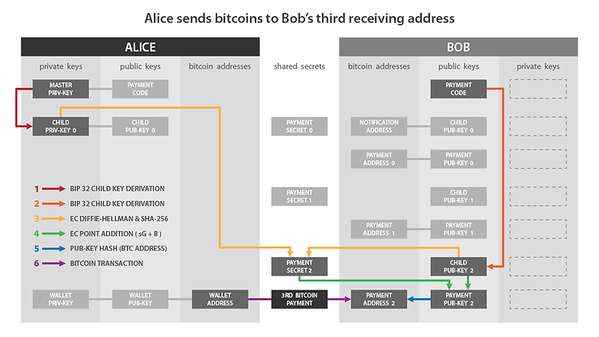

المصدر: رموز الدفع القابلة لإعادة الاستخدام لمحافظ التحديد التسلسلي الهرمي، جستس رانفير. https://github.com/bitcoin/bips/blob/master/bip-0047.mediawiki

يمكنها الاستمرار بهذه الطريقة واشتقاق ما يصل إلى 2^32 عنوانًا فارغًا ينتمي لبوب.

من وجهة نظر خارجية، عند مراقبة سلسلة الكتل لبيتكوين، فمن المستحيل نظريًا تمييز دفعة BIP47 عن دفعة عادية. هنا مثال على معاملة دفع BIP47 على Testnet:

https://blockstream.info/testnet/tx/94b2e59510f2e1fa78411634c98a77bbb638e28fb2da00c9f359cd5fc8f87254

TXID:
>94b2e59510f2e1fa78411634c98a77bbb638e28fb2da00c9f359cd5fc8f87254

يبدو وكأنه معاملة عادية بمدخل مستهلك، وإخراج دفع بقيمة 210،000 ساتوشي وباقي:

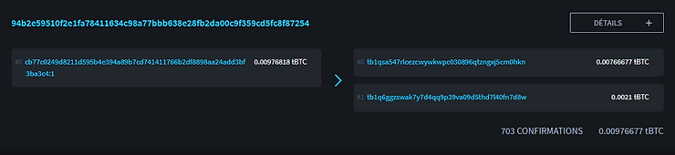

المصدر: https://blockstream.info/

### استلام دفعة BIP47 واشتقاق المفتاح الخاص.
أليس للتو قامت بإجراء أول عملية دفع لعنوان BIP47 فارغ ينتمي إلى بوب. دعونا نرى معًا كيف يستلم بوب هذه الدفعة. سنرى أيضًا لماذا لا يمكن لأليس الوصول إلى المفتاح الخاص للعنوان الذي قامت بتوليده للتو، وكيف يستعيد بوب هذا المفتاح الذي يمكنه من إنفاق البيتكوين التي تلقاها للتو.

بمجرد أن يتلقى بوب إشعارًا بالمعاملة من أليس، يقوم بتشتيت المفتاح العام BIP47 "K0" قبل أن يتم إرسال أي دفعة إليه. لذلك، يراقب أي دفعة إلى العنوان المرتبط به. في الواقع، سيقوم حتى بتشتيت عدة عناوين فورًا (K0، K1، K2، K3...). هكذا يقوم بتشتيت المفتاح العام "K0":

- يختار بوب أول مفتاح خاص فرعي مشتق من رمز الدفع الخاص به. يُطلق على هذا المفتاح الخاص اسم "b". وهو مرتبط بالمفتاح العام "B" الذي قامت أليس بحساباته في الخطوة السابقة:

> b

- يختار بوب أول مفتاح عام مشتق من رمز الدفع الخاص بأليس. يُطلق على هذا المفتاح العام اسم "A". وهو مرتبط بالمفتاح الخاص "a" الذي قامت أليس بحساباته، والذي يعرفه فقط أليس. يمكن لبوب تنفيذ هذه العملية لأنه يعرف رمز الدفع الخاص بأليس الذي تم تحويله إليه مع إشعار المعاملة.

> A = a·G

- يحسب بوب النقطة السرية "S" عن طريق إضافة وضعف النقاط على المنحنى البيضاوي، باستخدام المفتاح الخاص "b" على المفتاح العام لأليس "A". هنا نستخدم ECDH لضمان أن هذه النقطة "S" ستكون نفسها لبوب وأليس.

> S = b·A

- بنفس الطريقة التي قامت بها أليس، يعزل بوب الإحداثيات الأفقية لهذه النقطة "S". أطلقنا على هذا القيمة "Sx". يمرر هذه القيمة إلى وظيفة SHA256 للعثور على السر المشترك "s" (بحروف صغيرة).

> s = SHA256(Sx)

- بنفس الطريقة التي قامت بها أليس، يحسب بوب النقطة "s·G" على المنحنى البيضاوي. ثم، يضيف هذه النقطة السرية إلى المفتاح العام "B". بالتالي، يحصل على نقطة جديدة على المنحنى البيضاوي يفسرها كمفتاح عام "K0":

> K0 = B + s·G

بمجرد أن يحصل بوب على هذا المفتاح العام "K0"، يمكنه استخراج المفتاح الخاص المرتبط به ليتمكن من إنفاق بيتكوينه. إنه الشخص الوحيد القادر على إنشاء هذا الرقم.

- يضيف بوب مفتاحه الخاص الفرعي "b" المشتق من رمز الدفع الشخصي الخاص به. إنه الشخص الوحيد القادر على الحصول على قيمة "b". ثم، يضيف "b" إلى السر المشترك "s" للحصول على k0، المفتاح الخاص لـ K0:

> k0 = b + s
بفضل قانون مجموعة المنحنى البيضاوي، يحصل بوب على المفتاح الخاص الذي يتوافق مع المفتاح العام المستخدم من قبل أليس. لدينا بالتالي:
> K0 = k0·G

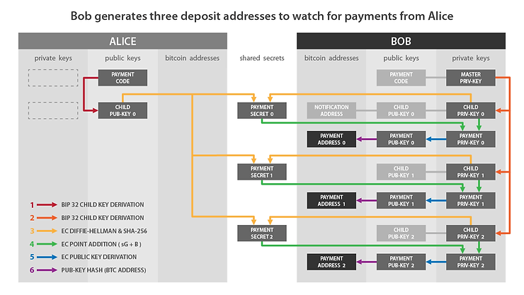

الائتمان: أكواد الدفع القابلة لإعادة الاستخدام للمحافظ المحددة تحديدًا، جوستس رانفير. https://github.com/bitcoin/bips/blob/master/bip-0047.mediawiki

إذا قمنا بمطابقة هذا الرسم مع ما وصفته لكم سابقًا:

* "مفتاح الخصوصية الفرعي 0" من جانب بوب يتوافق مع: b.

* "مفتاح العام الفرعي 0" من جانب أليس يتوافق مع: A.

* "سر الدفع 0" يتوافق مع: s.

* "مفتاح العام للدفع 0" يتوافق مع: K0.

* "مفتاح الخصوصية للدفع 0" يتوافق مع: k0.

ألخص لكم الخطوات التي قمنا بمراجعتها معًا لاستلام دفعة BIP47 وحساب المفتاح الخاص المتوافق:

* يختار بوب أول مفتاح خاص فرعي مشتق من رمز الدفع الشخصي الخاص به.

* يحسب نقطة سرية على المنحنى البيضاوي باستخدام ECDH من أول مفتاح عام فرعي مشتق من رمز سلسلة أليس.

* يستخدم هذه النقطة السرية لحساب سر مشترك باستخدام SHA256.

* يستخدم هذا السر المشترك لحساب نقطة سرية جديدة على المنحنى البيضاوي.

* يضيف هذه النقطة السرية الجديدة إلى مفتاحه العام الشخصي.

* يحصل على مفتاح عام مؤقت جديد، وهو العنوان الذي سترسل إليه أليس دفعتها الأولى.

* يحسب المفتاح الخاص المتوافق مع هذا المفتاح العام المؤقت عن طريق إضافة مفتاحه الخاص الفرعي المشتق من رمز الدفع والسر المشترك.

نظرًا لأن أليس لا يمكنها الحصول على "b"، المفتاح الخاص لبوب، فإنها غير قادرة على تحديد k0، المفتاح الخاص المرتبط بعنوان استلام BIP47 لبوب.

يمكننا تمثيل حساب السر المشترك "S" بالشكل التالي تمامًا:

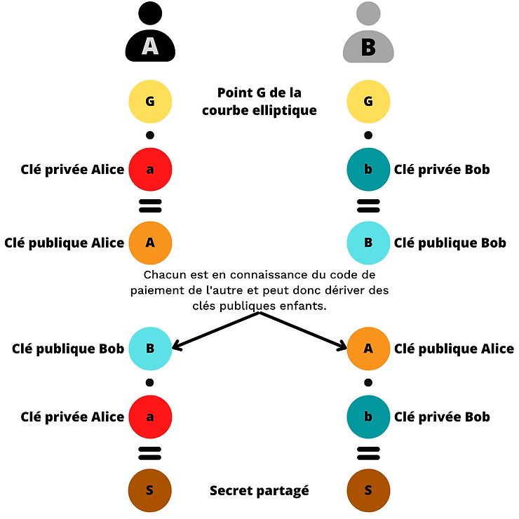

بمجرد العثور على السر المشترك باستخدام ECDH، يقوم أليس وبوب بحساب المفتاح العام لدفعة BIP47 "K0"، ويقوم بوب أيضًا بحساب المفتاح الخاص المرتبط "k0":

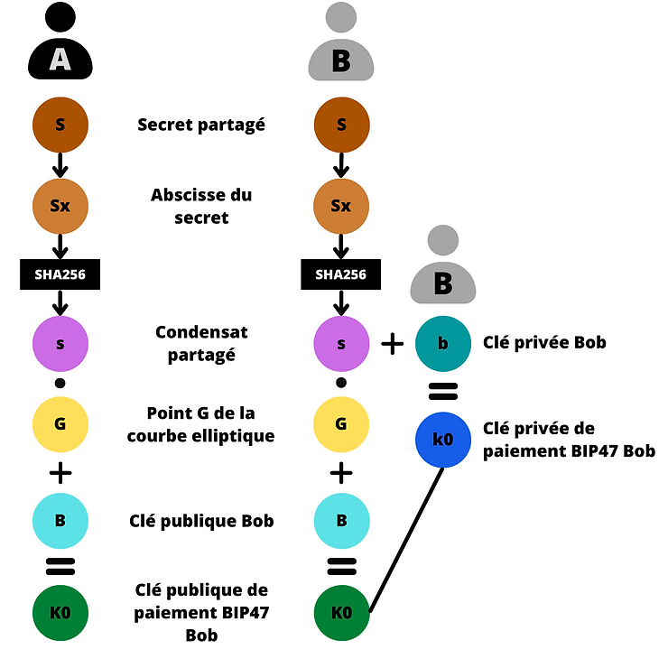

### استرداد دفعة BIP47.

نظرًا لأن بوب يعرف رمز الدفع القابل لإعادة الاستخدام لأليس، فإنه بالفعل يمتلك جميع المعلومات اللازمة لإرسال استرداد لها. لن يحتاج إلى الاتصال بأليس لطلب أي معلومات. سيكون عليه فقط إعلامها بواسطة عملية إشعار، خاصة لكي تتمكن من استعادة عناوين BIP47 الخاصة بها مع بذورها، ثم يمكنه أيضًا إرسال حتى 2^32 دفعة لها.
بعد ذلك، يمكن لـ بوب أن يرد لأليس بنفس الطريقة التي أرسلت له بها المدفوعات. تتبدل الأدوار:

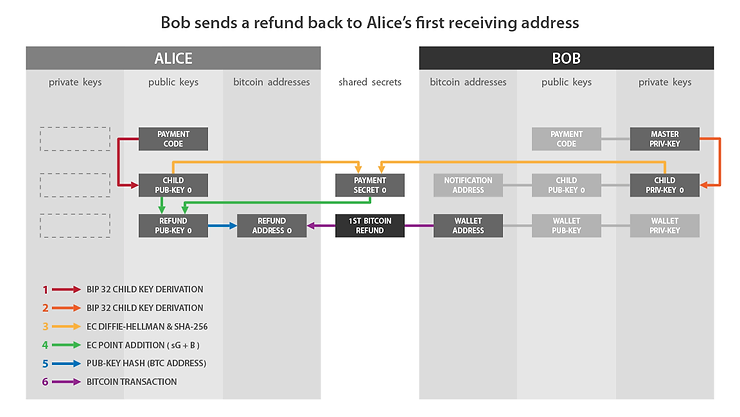

الائتمان: أكواد الدفع القابلة لإعادة الاستخدام للمحافظ المحددة تحديدًا بالنسبة للمحافظ التحديدية التسلسلية، جوستوس رانفير. https://github.com/bitcoin/bips/blob/master/bip-0047.mediawiki

الآن تعرفون جميعًا عن هذا الحل الرائع الذي يمثله BIP47.

## استخدامات PayNym المشتقة.

تنفيذ BIP47 على محفظة Samourai أدى إلى إنشاء PayNym ، وهي هويات محسوبة من أكواد الدفع للمستخدمين. اليوم ، تتجاوز فائدتهم استخدام BIP47.

تقوم فرق Samourai تدريجياً بتطوير بيئة كاملة من الأدوات والخدمات المستندة إلى PayNym للمستخدم. من بين هذه الأدوات ، هناك بالطبع جميع أدوات الإنفاق التي تسمح بتحسين خصوصية المستخدم عن طريق إضافة الانحراف إلى عملية التحويل ، وبالتالي إضافة الإنكار المعقول.

استخدام Soroban ، شبكة الاتصال المشفرة المعتمدة على Tor ، بالاشتراك مع PayNym ، ساهم بشكل كبير في تحسين تجربة المستخدم عند بناء عمليات تحويل تعاونية ، مع الحفاظ على مستوى جيد من الأمان. بالتالي ، يمكن بسهولة إجراء عمليات تحويل Stowaway (PayJoin) و StonewallX2 دون الحاجة إلى إجراء العديد من تبادلات العملات غير الموقعة يدويًا اللازمة لإعداد عملية تحويل تعاونية من هذا النوع.

على عكس استخدام BIP47 ، حيث لا تتطلب هذه العمليات التعاونية إجراء عملية إعلام ، يكفي ربط PayNym لاستخدام هذه الأدوات. لا حاجة للاتصال بهم.

إذا كنت ترغب في معرفة المزيد عن العمليات التعاونية ، وبشكل أوسع عن جميع أدوات الإنفاق في محفظة Samourai ، يمكنك قراءة الجزء "أدوات الإنفاق" في هذه المقالة. ستجد شرحًا تقنيًا ودليلًا تفصيليًا لكل أداة هناك.

بالإضافة إلى هذه العمليات التعاونية ، لاحظنا مؤخرًا أن فرق Samourai تعمل على بروتوكول مصادقة مرتبط بـ PayNym: Auth47. تم تنفيذ هذه الأداة بالفعل وتسمح ، على سبيل المثال ، بالمصادقة باستخدام PayNym على موقع ويب يقبل هذا الأسلوب. في المستقبل ، أعتقد أن Auth47 سيكون جزءًا من مشروع أكبر حول بيئة BIP47 / PayNym / Samourai. قد يتم استخدام هذا البروتوكول لتحسين تجربة مستخدم محفظة Samourai بشكل أكبر ، بخاصة في استخدام أدوات الإنفاق. لنرى...

## رأيي الشخصي حول BIP47.
بالطبع، العيب الرئيسي لـ BIP47 هو عملية إشعار التحويل. يجب على المستخدم أن يدفع رسومًا لتعدين هذه العملية، مما قد يكون مزعجًا لبعض الأشخاص. ومع ذلك، فإن حجة "البريد المزعج" في سلسلة كتل بيتكوين غير مقبولة تمامًا. يجب أن يكون أي شخص يدفع رسومًا لعملية التحويل قادرًا على تسجيلها في السجل، بغض النظر عن هدفه. التأكيد على العكس يعني أنك تدعم الرقابة.

من الممكن أن يتم العثور في المستقبل على حلول أقل تكلفة لتمكين المرسل من إرسال رمز الدفع إلى المستلم وتخزينه بشكل آمن. ولكن، في الوقت الحالي، فإن عملية إشعار التحويل لا تزال الحل الأقل تنازلي.

هذا العيب يظل ضئيلًا عندما ننظر إلى جميع فوائد BIP47. من بين جميع الاقتراحات الموجودة لحل مشكلة إعادة استخدام العنوان، يبدو لي أنه هو الحل الأفضل.

كما تم شرحه سابقًا، يأتي معظم إعادات استخدام العناوين من التبادلات. BIP47 هو الحل الوحيد العقلاني الذي يحل هذه المشكلة من الجذور. يجب أن تركز أي اقتراح يهدف إلى تقليل عدد إعادات استخدام العناوين على هذا الجانب وتكييف الحل للمصدر الرئيسي للمشكلة.

من حيث الاستخدام، على الرغم من أن آلية الدفع BIP47 معقدة إلى حد ما، إلا أنها سهلة التطبيق. يمكن بسهولة اعتماد رموز الدفع القابلة لإعادة الاستخدام، حتى من قبل المستخدمين الجدد.

من حيث الخصوصية، فإن BIP47 مثير للاهتمام للغاية. كما شرحت في الجزء المتعلق بعملية إشعار التحويل، فإن رمز الدفع لا يكشف أي معلومات عن العناوين المشتقة المؤقتة. يسمح بذلك بكسر تدفق المعلومات بين عملية بيتكوين ومعرف المستلم، على عكس الاستخدام التقليدي لعنوان الاستلام.

والأهم من ذلك، فإن تنفيذ PayNym لـ BIP47 يعمل! إنه متاح على محفظة Samourai منذ عام 2016، وعلى محفظة Sparrow منذ بداية هذا العام. إنه ليس مشروعًا علميًا، بل هو حل تم اختباره في الأمس ويعمل تمامًا اليوم.

نأمل أن يتم اعتماد رموز الدفع القابلة لإعادة الاستخدام في المستقبل من قبل أطراف النظام البيئي، وتنفيذها في برامج المحفظة، واستخدامها من قبل مستخدمي البيتكوين.

يجب مناقشة أي حل إيجابي حقًا لخصوصية المستخدم، ودفعه والدفاع عنه، حتى لا يصبح بيتكوين ملعبًا للمؤسسات المالية وأداة للمراقبة الحكومية.
كان يفكر في الطريقة التي تعرض فيها للاضطهاد والإهانة في كل مكان، وها هو يسمع الجميع يقولون أنه أجمل من جميع تلك الطيور الجميلة! وحتى البتول يميل فروعه نحوه، والشمس تنيره بضوء دافئ ومفيد! فانتفخت ريشه، وارتفعت رقبته النحيلة، وصاح بكل قوته: "كيف يمكن أن أحلم بكل هذا السعادة وأنا لست سوى بطة صغيرة قبيحة؟"

## للمزيد من المعلومات:

* فهم واستخدام CoinJoin في بيتكوين.

* فهم مسارات تشتيت محفظة بيتكوين.

* تثبيت واستخدام عقدة بيتكوين RoninDojo.

### مصادر خارجية والشكر:

    شكرًا لـ LaurentMT و Théo Pantamis على العديد من المفاهيم التي شرحوها لي واستخدمتها في هذه المقالة. آمل أن أكون قد نقلتها بدقة.

    شكرًا لـ Fanis Michalakis على مراجعة هذا النص ونصائحه الخبيرة.

    https://bitcoiner.guide/paynym/

    https://github.com/bitcoin/bips/blob/master/bip-0047.mediawiki

    https://fr.wikipedia.org/wiki/%C3%89change_de_cl%C3%A9s_Diffie-Hellman

    https://fr.wikipedia.org/wiki/%C3%89change_de_cl%C3%A9s_Diffie-Hellman_bas%C3%A9_sur_les_courbes_elliptiques

    https://security.stackexchange.com/questions/46802/what-is-the-difference-between-dhe-and-ecdh#:~:text=The%20difference%20between%20DHE%20and%20ECDH%20in%20two%20bullet%20points,a%20type%20of%20algebraic%20curve).

    https://commandlinefanatic.com/cgi-bin/showarticle.cgi?article=art060

    https://ee.stanford.edu/~hellman/publications/24.pdf

    https://www.researchgate.net/publication/317339928_A_study_on_diffie-hellman_key_exchange_protocols