> "Es demasiado grande", decían todos, y el gallo de Indias que había nacido con espolones y se creía emperador, se infló como un barco con todas las velas desplegadas y se dirigió hacia él con gran furia y rojo hasta los ojos. El pobre patito no sabía si debía detenerse o seguir adelante: se entristeció mucho al ser ridiculizado por todos los patos de la corte.

Uno de los mayores problemas en el protocolo Bitcoin es la reutilización de direcciones. La transparencia y la distribución de la red hacen que esta práctica sea peligrosa para la privacidad del usuario. Para evitar los problemas asociados con esto, se recomienda utilizar una nueva dirección de recepción en blanco para cada nuevo pago entrante a una billetera, lo cual puede ser complicado de lograr en algunos casos.

Este compromiso es tan antiguo como el Libro Blanco. Satoshi ya nos advertía sobre este riesgo en su obra publicada a finales de 2008:

> "Como cortafuegos adicional, se podrían utilizar nuevas parejas de claves para cada transacción, de modo que no estén vinculadas a un propietario común".

Existen muchas soluciones para recibir múltiples pagos sin reutilizar direcciones. Cada una de ellas tiene sus propios compromisos y desventajas. Entre todas estas soluciones, está el [BIP47](https://github.com/bitcoin/bips/blob/master/bip-0047.mediawiki), una propuesta desarrollada por Justus Ranvier y publicada en 2015 que permite generar códigos de pago reutilizables. Su objetivo es poder realizar múltiples transacciones hacia la misma persona sin reutilizar direcciones.

Inicialmente, esta propuesta fue recibida con desprecio por parte de una parte de la comunidad y nunca se agregó a Bitcoin Core. Sin embargo, algunos software decidieron implementarla por su cuenta. Así, [Samourai Wallet](https://samouraiwallet.com/) desarrolló su propia implementación de BIP47: PayNym. Hoy en día, esta implementación está disponible en Samourai Wallet para teléfonos inteligentes, pero también en [Sparrow Wallet](https://sparrowwallet.com/) para PC.

Con el tiempo, Samourai ha programado nuevas características relacionadas directamente con PayNym. Ahora existe todo un ecosistema de herramientas para optimizar la privacidad del usuario basadas en PayNym y BIP47.
En este artículo, descubrirás el principio de BIP47 y PayNym, los mecanismos de estos protocolos y las aplicaciones prácticas que se derivan de ellos. Solo abordaré la primera versión de BIP47, la que se utiliza actualmente para PayNym, pero las versiones 2, 3 y 4 funcionan prácticamente de la misma manera.

> La única diferencia importante se encuentra en la transacción de notificación. La versión 1 utiliza una dirección simple con OP_RETURN para la notificación, la versión 2 utiliza un script multisig (bloom-multisig) con OP_RETURN y las versiones 3 y 4 simplemente utilizan un script multisig (cfilter-multisig). Los mecanismos mencionados en este artículo, especialmente los métodos criptográficos estudiados, son aplicables a las cuatro versiones. Hasta la fecha, la implementación de PayNym en Samourai Wallet y Sparrow utiliza la primera versión de BIP47.

## Resumen:

1- El problema de la reutilización de direcciones.

2- Principios de BIP47 y PayNym.

3- Tutoriales: uso de PayNym.

- Construir una transacción BIP47 con Samourai Wallet.

- Construir una transacción BIP47 con Sparrow Wallet.

4- Los engranajes de BIP47.

- El código de pago reutilizable.
- El método criptográfico: intercambio de claves Diffie-Hellman establecido en curvas elípticas (ECDH).

- La transacción de notificación.
- Construcción de la transacción de notificación.
- Recepción de la transacción de notificación.
- La transacción de pago BIP47.
- Recepción del pago BIP47 y derivación de la clave privada.
- Reembolso del pago BIP47.

5- Usos derivados de PayNym.

6- Mi opinión personal sobre BIP47.

## El problema de la reutilización de direcciones.

Una dirección de recepción se utiliza para recibir bitcoins. Se genera a partir de una clave pública al aplicarle un hash y un formato específico. De esta manera, permite crear una nueva condición de gasto en una moneda para cambiar su propietario.

> Para obtener más información sobre la generación de una dirección de recepción, te recomiendo leer la última parte de este artículo: El monedero Bitcoin - extracto [ebook Bitcoin Démocratisé 2](https://www.pandul.fr/post/le-portefeuille-bitcoin-extrait-ebook-bitcoin-d%C3%A9mocratis%C3%A9-2#viewer-epio7).

Además, seguramente has escuchado de un bitcoiner experimentado que las direcciones de recepción son de un solo uso y que debes generar una nueva para cada nuevo pago entrante a tu monedero. ¿De acuerdo, pero por qué?
Básicamente, la reutilización de direcciones no pone en peligro directamente tus fondos. El uso de criptografía en curvas elípticas permite demostrar a la red que tienes en posesión una clave privada sin revelarla. Por lo tanto, puedes bloquear varias UTXO diferentes en una misma dirección y gastarlas en momentos diferentes. Si no revelas la clave privada asociada a esa dirección, nadie podrá acceder a tus fondos. El problema de la reutilización de direcciones está más relacionado con la privacidad.

Como se mencionó anteriormente, la transparencia y la distribución de la red Bitcoin hacen que cualquier usuario, siempre y cuando tenga acceso a un nodo, pueda observar las transacciones del sistema de pago. Por lo tanto, puede ver los diferentes saldos de las direcciones. Satoshi Nakamoto mencionó la posibilidad de generar nuevos pares de claves, y por lo tanto nuevas direcciones, para cada nuevo pago entrante a una billetera. El objetivo sería tener una capa adicional de protección en caso de asociación entre la identidad del usuario y uno de sus pares de claves.

Hoy en día, con la presencia de empresas de análisis de cadenas y el desarrollo del KYC, el uso de direcciones nuevas ya no es una capa adicional de protección, sino una obligación para cualquiera que se preocupe mínimamente por su privacidad.

La búsqueda de privacidad no es un lujo ni una fantasía de los maximalistas de Bitcoin. Es un parámetro específico que afecta directamente a tu seguridad personal y a la protección de tus fondos. Para que lo entiendas, aquí tienes un ejemplo muy concreto:

- Bob compra Bitcoin en DCA (Dollar Cost Averaging), es decir, adquiere una pequeña cantidad de Bitcoin a intervalos regulares para suavizar su precio de entrada. Bob siempre envía los fondos comprados a la misma dirección de recepción. Compra 0.01 Bitcoin todas las semanas y los envía a esta misma dirección. Después de dos años, Bob ha acumulado un Bitcoin completo en esta dirección.

- El panadero de la esquina acepta pagos en Bitcoin. Muy contento de poder gastar Bitcoin, Bob va a comprar su baguette en sats. Para pagar, utiliza los fondos bloqueados en su dirección. Ahora el panadero sabe que Bob tiene un Bitcoin. Esta cantidad importante podría despertar envidias y Bob podría potencialmente sufrir un ataque físico en el futuro.

La reutilización de direcciones permite a un observador establecer un vínculo inequívoco entre tus diferentes UTXO y, a veces, entre tu identidad y toda tu billetera.
Es por esta razón que la mayoría de las carteras de Bitcoin generan automáticamente una nueva dirección de recepción cuando se hace clic en el botón "Recibir". Para el usuario regular, acostumbrarse a usar direcciones nuevas no es un gran inconveniente. Sin embargo, para un comercio en línea, un intercambio o una campaña de donación, esta restricción puede volverse rápidamente inmanejable.
Existen muchas soluciones para estas organizaciones. Cada una de ellas tiene sus ventajas y desventajas, pero hasta la fecha, y como veremos más adelante, el BIP47 se diferencia realmente de las demás.

Este problema de la reutilización de direcciones no es insignificante en Bitcoin. Como se puede ver en el gráfico a continuación, extraído del sitio [oxt.me](http://oxt.me/), la tasa global de reutilización de direcciones por parte de los usuarios de Bitcoin es actualmente del 52%:
Gráfico de OXT.me que muestra la evolución de la tasa global de reutilización de direcciones en la red de Bitcoin.

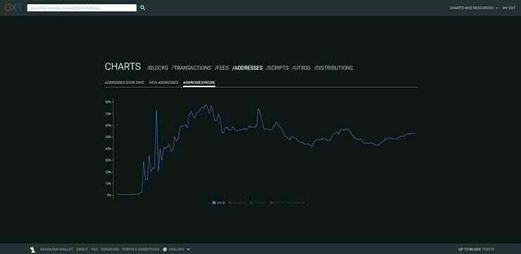

Crédito: https://oxt.me/charts

La mayoría de estas reutilizaciones provienen de los intercambios que, por razones de eficiencia y facilidad, reutilizan la misma dirección muchas veces. Hasta la fecha, el BIP47 sería la mejor solución para frenar este fenómeno en los intercambios. Esto permitiría reducir la tasa global de reutilización de direcciones, sin causar demasiadas fricciones para estas entidades.

Esta medida global en toda la red es un dato particularmente coherente en este caso. De hecho, la reutilización de direcciones no es solo un problema para la persona que realiza esta práctica, sino también para cualquier persona que realice transacciones con ella. La pérdida de privacidad en Bitcoin actúa como un virus y se propaga de usuario a usuario. Estudiar una medida global en todas las transacciones de la red nos permite tomar conciencia de la magnitud de este fenómeno.

## Principios de BIP47 y PayNym.

BIP47 tiene como objetivo ofrecer una forma sencilla de recibir múltiples pagos sin reutilizar direcciones. Su funcionamiento se basa en el uso de un código de pago reutilizable.

De esta manera, varios emisores pueden enviar varios pagos a un único código de pago reutilizable de otro usuario, sin que el destinatario tenga que proporcionar una nueva dirección en blanco para cada nueva transacción.

Un usuario puede comunicar libremente su código de pago (en redes sociales, en su sitio web, etc.) sin riesgo de pérdida de privacidad, a diferencia de una dirección de recepción convencional o una clave pública.
Para realizar un intercambio, ambos usuarios deben tener una billetera de Bitcoin con una implementación del BIP47, como PayNym en Samourai Wallet o Sparrow Wallet. La asociación de los códigos de pago de ambos usuarios permitirá establecer un canal secreto entre ellos. Para establecer correctamente este canal, el remitente debe realizar una transacción en la cadena de bloques de Bitcoin: la transacción de notificación (hablaré más sobre esto más adelante).
La asociación de los códigos de pago de ambos usuarios genera secretos compartidos que a su vez generan un gran número de direcciones de recepción de Bitcoin únicas (exactamente 2^32). Por lo tanto, en realidad, el pago con BIP47 no se envía al código de pago, sino a direcciones completamente normales, derivadas de los códigos de pago de los participantes.

El código de pago actúa como un identificador virtual, derivado de la semilla de la billetera. En la estructura de derivación de la billetera HD, el código de pago se encuentra en la profundidad 3, en el nivel de las cuentas de la billetera.

Su objetivo de derivación se indica como 47' (0x8000002F) en referencia al BIP47. Un ejemplo de ruta de derivación de un código de pago reutilizable sería:

> m/47'/0'/0'/

Para que puedas imaginar cómo es un código de pago, aquí está el mío:

> PM8TJSBiQmNQDwTogMAbyqJe2PE2kQXjtgh88MRTxsrnHC8zpEtJ8j7Aj628oUFk8X6P5rJ7P5qDudE4Hwq9JXSRzGcZJbdJAjM9oVQ1UKU5j2nr7VR5

Este también se puede codificar en un código QR para facilitar la comunicación:

En cuanto a los PayNym Bots, esos robots que se ven en Twitter, son simplemente representaciones visuales de tu código de pago, creadas por Samourai Wallet. Se crean mediante una función hash, lo que los hace casi únicos. Aquí está el mío con su identificador:

> +throbbingpond8B1

Estos Bots no tienen ninguna utilidad técnica real. En cambio, facilitan las interacciones entre los usuarios al crear una identidad visual virtual.

Para el usuario, el proceso de un pago BIP47 con la implementación PayNym es extremadamente sencillo. Supongamos que Alice quiere enviar pagos a Bob:

1. Bob comparte su código QR, o directamente su código de pago reutilizable. Puede colocarlo en su sitio web, en sus diferentes redes sociales públicas o enviarlo a Alice a través de otro medio de comunicación.
2. Alice abre su software Samourai o Sparrow y escanea o pega el código de pago de Bob.
3. Alice vincula su PayNym con el de Bob ("Follow" en inglés). Esta operación se realiza fuera de la cadena de bloques y es completamente gratuita.

4. Alice conecta su PayNym con el de Bob ("Connect" en inglés). Esta operación se realiza "on chain". Alice debe pagar las tarifas de minería de la transacción, así como una tarifa fija de 15,000 sats por el servicio en Samourai. Las tarifas de servicio son gratuitas en Sparrow. Este paso se conoce como la transacción de notificación.

5. Una vez confirmada la transacción de notificación, Alice puede crear una transacción de pago BIP47 hacia Bob. Su billetera generará automáticamente una nueva dirección de recepción en blanco, de la cual solo Bob tiene la clave privada.

Realizar la transacción de notificación, es decir, conectar su PayNym, es un paso previo obligatorio para realizar pagos BIP47. Sin embargo, una vez que se realiza esta transacción, el remitente puede realizar múltiples pagos al destinatario (exactamente 2^32), sin necesidad de realizar nuevamente una transacción de notificación.

Pudiste ver que existen dos operaciones diferentes que permiten vincular PayNyms entre sí: seguir y conectar. La operación de conexión ("connecter") corresponde a la transacción de notificación del BIP47, que es simplemente una transacción de Bitcoin con cierta información transmitida a través de una salida OP_RETURN. De esta manera, ayuda a establecer una comunicación cifrada entre los dos usuarios para generar los secretos compartidos necesarios para generar nuevas direcciones de recepción en blanco.

Por otro lado, la operación de vinculación ("follow" o "relier") permite establecer un enlace en Soroban, un protocolo de comunicación cifrada basado en Tor, especialmente desarrollado por los equipos de Samourai.

En resumen:

- Vincular dos PayNyms ("follow") es completamente gratuito. Esto ayuda a establecer comunicaciones cifradas "off chain", especialmente para utilizar las herramientas de transacciones colaborativas de Samourai (Stowaway o StonewallX2). Esta operación es específica de PayNym y no está descrita en el BIP47.

- Conectar dos PayNyms tiene un costo. Implica realizar la transacción de notificación para iniciar la conexión. Su costo incluye posibles tarifas de servicio, tarifas de minería de la transacción y 546 sats enviados a la dirección de notificación del destinatario para informarle sobre la apertura del túnel. Esta operación está relacionada con el BIP47. Una vez realizada, el remitente puede realizar varios pagos BIP47 al destinatario.

Para poder conectar dos PayNyms, estos deben estar previamente vinculados.

## Tutoriales: uso de PayNym.

Ahora que hemos visto la teoría, estudiemos juntos la práctica. La idea de los siguientes tutoriales es vincular mi PayNym en mi billetera Sparrow con mi PayNym en mi billetera Samourai. El primer tutorial muestra cómo hacer una transacción utilizando el código de pago reutilizable desde Samourai hacia Sparrow, y el segundo tutorial describe el mismo mecanismo desde Sparrow hacia Samourai.

> Realicé estos tutoriales en Testnet. No son bitcoins reales.

### Construir una transacción BIP47 con Samourai Wallet.

Para empezar, obviamente necesitarás la aplicación Samourai Wallet. Puedes descargarla directamente desde Google Play Store, o con el archivo APK disponible en el sitio web oficial de Samourai.

Una vez que hayas inicializado la billetera, si aún no lo has hecho, solicita tu PayNym haciendo clic en el signo más (+) en la esquina inferior derecha, luego en "PayNym".

El primer paso para hacer un pago BIP47 será obtener el código de pago reutilizable de nuestro destinatario. Luego, podremos vincularnos con él y luego conectarnos:

Una vez confirmada la transacción de notificación, puedo enviar varios pagos a mi destinatario. Cada transacción se realizará automáticamente con una nueva dirección en blanco para la cual el destinatario tiene las claves. Este último no tiene que hacer nada, todo se calcula desde mi lado.

Aquí te explico cómo realizar una transacción BIP47 en Samourai Wallet:

### Construir una transacción BIP47 con Sparrow Wallet.

De la misma manera que con Samourai, obviamente necesitarás el software Sparrow. Este está disponible en computadoras. Puedes descargarlo desde su [sitio web oficial](https://sparrowwallet.com/).

Asegúrate de verificar la firma del desarrollador y la integridad del software descargado antes de instalarlo en tu dispositivo.

Crea una billetera y solicita tu PayNym haciendo clic en "Show PayNym" desde el menú "Tool" en la barra superior:

Luego, deberás vincular y conectar tu PayNym con el de tu destinatario. Para hacerlo, ingresa su código de pago reutilizable en la ventana "Find Contact", síguelo y luego realiza la transacción de notificación haciendo clic en "Link Contact":

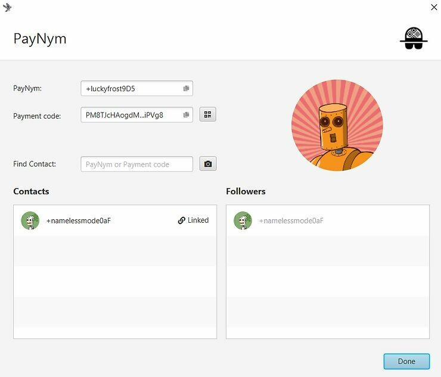

Una vez confirmada la transacción de notificación, podemos enviar pagos al código de pago reutilizable. Aquí tienes los pasos a seguir:

Ahora que hemos podido estudiar el aspecto práctico de la implementación PayNym del BIP47, veamos cómo funcionan todos estos mecanismos y qué métodos criptográficos se utilizan.

## Los engranajes del BIP47.

Para estudiar los mecanismos de BIP47, es esencial comprender la estructura de la billetera determinista jerárquica (HD), los mecanismos de derivación de pares de claves hijas y los principios de la criptografía de curvas elípticas. Afortunadamente, puedes encontrar en mi blog toda la información necesaria para comprender esta parte:

- [Comprender las rutas de derivación de una billetera Bitcoin](https://www.pandul.fr/post/comprendre-les-chemins-de-d%C3%A9rivation-d-un-portefeuille-bitcoin)

- [La billetera Bitcoin - extracto del libro electrónico Bitcoin Démocratisé 2](https://www.pandul.fr/post/le-portefeuille-bitcoin-extrait-ebook-bitcoin-d%C3%A9mocratis%C3%A9-2)

### El código de pago reutilizable.

Como se explica en la segunda parte de este documento, el código de pago reutilizable se encuentra en la profundidad tres de la billetera HD. En última instancia, es algo similar a un xpub, tanto en su ubicación y estructura como en su función.

Estas son las diferentes partes que componen un código de pago de 80 bytes:

- Byte 0: La versión. Si se utiliza la primera versión de BIP47, este byte será igual a 0x01.

- Byte 1: El campo de bits. Este espacio está reservado para proporcionar indicaciones adicionales en caso de uso específico. Si solo se utiliza PayNym, este byte será igual a 0x00.

- Byte 2: La paridad de y. Este byte indica 0x02 o 0x03 según la paridad (número par o número impar) del valor de la ordenada de nuestra clave pública. Para obtener más información sobre esta práctica, lea el paso 1 de la parte "derivación de una dirección" de este artículo.

- Desde el byte 3 hasta el byte 34: El valor de x. Estos bytes indican la abscisa de nuestra clave pública. La concatenación de x y la paridad de y nos da nuestra clave pública comprimida.

- Desde el byte 35 hasta el byte 66: El código de cadena. Este espacio está reservado para el código de cadena asociado a la clave pública mencionada anteriormente.

- Desde el byte 67 hasta el byte 79: El relleno. Este espacio está reservado para posibles futuras evoluciones. Para la versión 1, simplemente se colocan ceros para llenar hasta 80 bytes, que es el tamaño de los datos de una salida OP_RETURN.

Aquí está la representación hexadecimal de mi código de pago reutilizable, presentado en la parte anterior, con los colores correspondientes a los bytes presentados anteriormente:

> 0x47010002a0716529bae6b36c5c9aa518a52f9c828b46ad8d907747f0d09dcd4d9a39e97c3c5f37c470c390d842f364086362f6122f412e2b0c7e7fc6e32287e364a7a36a00000000000000000000000000

A continuación, también debemos agregar el byte de prefijo "P" que permite identificar de un vistazo que se trata de un código de pago. Este byte es 0x47.

> 0x47010002a0716529bae6b36c5c9aa518a52f9c828b46ad8d907747f0d09dcd4d9a39e97c3c5f37c470c390d842f364086362f6122f412e2b0c7e7fc6e32287e364a7a36a00000000000000000000000000

Finalmente, calculamos el checksum de este código de pago con HASH256, es decir, un doble hash con la función SHA256. Recuperamos los primeros cuatro bytes de este resumen y los concatenamos al final (en rosa).

> 0x47010002a0716529bae6b36c5c9aa518a52f9c828b46ad8d907747f0d09dcd4d9a39e97c3c5f37c470c390d842f364086362f6122f412e2b0c7e7fc6e32287e364a7a36a00000000000000000000000000567080c4

El código de pago está listo, solo queda convertirlo a Base 58:

> PM8TJSBiQmNQDwTogMAbyqJe2PE2kQXjtgh88MRTxsrnHC8zpEtJ8j7Aj628oUFk8X6P5rJ7P5qDudE4Hwq9JXSRzGcZJbdJAjM9oVQ1UKU5j2nr7VR5

Como se puede observar, esta construcción se asemeja mucho a la estructura de una clave pública extendida de tipo "xpub".

Durante este proceso que nos lleva a nuestro código de pago, hemos utilizado una clave pública comprimida y un código de cadena. Estos dos elementos son el resultado de una derivación determinista y jerárquica, desde la semilla de la billetera, siguiendo la siguiente ruta de derivación: m/47'/0'/0'/
Concretamente, para obtener la clave pública y el código de cadena del código de pago reutilizable, se calculará la clave privada maestra a partir de la semilla, luego se derivará un par hijo con el índice 47 + 2^31 (derivación reforzada). Luego, se derivarán dos veces pares hijos con el índice 2^31 (derivación reforzada).

> Si desea obtener más información sobre la derivación de pares de claves hijas dentro de una billetera determinista jerárquica de Bitcoin, le recomiendo que haga CRYPTO301.

### El método criptográfico: el intercambio de claves Diffie-Hellman establecido en curvas elípticas (ECDH).

El método criptográfico utilizado en la base de BIP47 es ECDH (Elliptic-Curve Diffie-Hellman = Intercambio de claves Diffie-Hellman establecido en curvas elípticas). Este protocolo es una variante del intercambio de claves Diffie-Hellman clásico.

Diffie-Hellman, en su primera versión, es un protocolo de acuerdo de claves presentado en 1976 que permite a dos personas, a partir de dos pares (claves públicas y claves privadas), determinar un secreto compartido intercambiando información en un canal de comunicación no seguro.

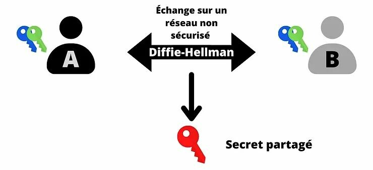

Este secreto compartido (la clave roja) luego se puede utilizar para realizar otras tareas. Típicamente, se puede utilizar este secreto compartido para cifrar y descifrar una comunicación en una red no segura:

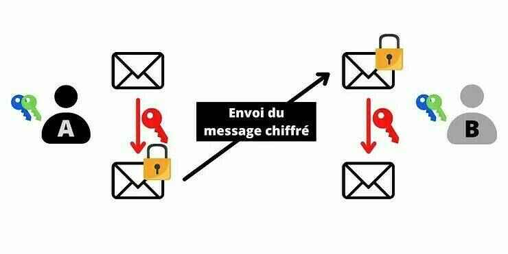

Para lograr este intercambio, Diffie-Hellman utiliza la aritmética modular para calcular el secreto común. Aquí se explica de manera simplificada cómo funciona:

- Alice y Bob eligen un color común, en este caso el amarillo. Este color es conocido por todos. Es un dato público.

- Alice elige un color secreto, en este caso el rojo. Mezcla los dos colores, lo que le da naranja.

- Bob elige un color secreto, en este caso el azul pato. Mezcla los dos colores, lo que le da azul cielo.

- Alice y Bob pueden intercambiar los colores obtenidos: naranja y azul cielo. Este intercambio puede realizarse en una red no segura y ser observado por atacantes.

- Alice mezcla el color azul cielo recibido de Bob con su color secreto (rojo). Obtiene marrón.

- Bob mezcla el color naranja recibido de Alice con su color secreto (azul pato). También obtiene este mismo color marrón.

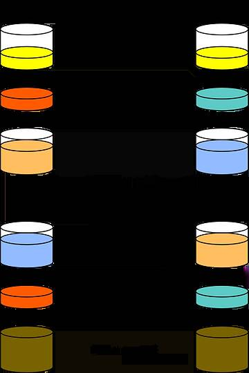

> Crédito: Idea original: A.J. Han VinckVersión vectorial: FlugaalTraducción: Dereckson, Dominio público, a través de Wikimedia Commons. https://commons.wikimedia.org/wiki/File:Diffie-Hellman_Key_Exchange_(fr).svg

En esta explicación, el color marrón representa el secreto compartido entre Alice y Bob. Hay que imaginar que en realidad, es imposible para el atacante separar los colores naranja y celeste para descubrir los secretos de Alice o Bob.

Ahora, vamos a estudiar su funcionamiento real. A primera vista, Diffie-Hellman parece complejo de entender. En realidad, el principio de funcionamiento es casi infantil. Antes de detallar sus mecanismos, les recordaré rápidamente dos conceptos matemáticos que necesitaremos (y que, por cierto, también se utilizan en muchos otros métodos criptográficos).

1. Un número primo es un número natural que solo tiene dos divisores: 1 y él mismo. Por ejemplo, el número 7 es primo, ya que solo se puede dividir por 1 y 7 (él mismo). En cambio, el número 8 no es primo, ya que se puede dividir por 1, 2, 4 y 8. Por lo tanto, no tiene solo dos divisores, sino cuatro divisores enteros y positivos.

2. El "módulo" (indicado como "mod" o "%") es una operación matemática que permite obtener el resto de la división euclidiana del primer número por el segundo número. Por ejemplo, 16 mod 5 es igual a 1.

El intercambio de claves Diffie-Hellman entre Alice y Bob funciona de la siguiente manera:

- Alice y Bob eligen dos números comunes: p y g. p es un número primo. Cuanto más grande sea este número p, más seguro será Diffie-Hellman. g es una raíz primitiva de p. Estos dos números se pueden comunicar en claro a través de una red no segura, son equivalentes al color amarillo en la explicación anterior. Solo es necesario que Alice y Bob tengan exactamente los mismos valores de p y g.

- Una vez elegidos los parámetros, Alice y Bob eligen cada uno un número aleatorio secreto. El número aleatorio obtenido por Alice se llama a (equivalente al color rojo) y el número aleatorio obtenido por Bob se llama b (equivalente al color azul verdoso). Estos dos números deben mantenerse en secreto.

- En lugar de intercambiar estos números a y b, cada parte calculará A (mayúscula) y B (mayúscula) de la siguiente manera:

> A es igual a g elevado a la potencia a módulo p:
> A = g^a % p

> B es igual a g elevado a la potencia b módulo p:
> B = g^b % p

- Estos números A (equivalente al color naranja) y B (equivalente al color celeste) se intercambiarán entre las dos partes. El intercambio puede hacerse en claro a través de una red no segura.

- Alice, que ahora conoce B, calculará el valor de z de la siguiente manera:

> z es igual a B elevado a la potencia a módulo p:
> z = B^a % p

- Como recordatorio, B = g^b % p. Por lo tanto, tenemos:

  > z = B^a % p
  > z = (g^b)^a % p
  >
  > De acuerdo con las reglas de cálculo de potencias:
  >
  > (x^n)^m = x^nm
  >
  > Por lo tanto, tenemos:
  >
  > z = g^ba % p

- Bob, que ahora conoce A, también calculará el valor de z de la siguiente manera:

> z es igual a A elevado a la potencia b módulo p:
>
> z = A^b % p
>
> Por lo tanto, tenemos:
>
> z = (g^a)^b % p
> z = g^ab % p
> z = g^ba % p

Gracias a la distributividad del operador módulo, Alice y Bob encuentran exactamente el mismo valor de z. Este número representa su secreto compartido, es decir, el equivalente del color marrón en la explicación anterior. Pueden usar este secreto compartido para cifrar una comunicación entre ellos en una red no segura.

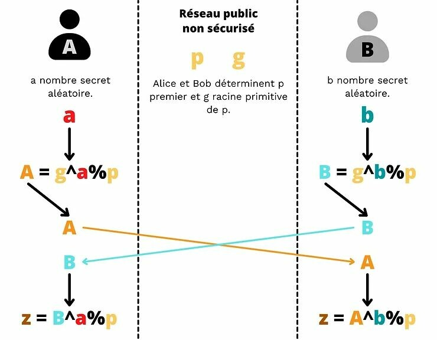

Un atacante que tenga p, g, A y B será incapaz de calcular a, b o z. Realizar esta operación sería equivalente a invertir la exponenciación. Este cálculo es imposible de realizar de otra manera que no sea probando todas las posibilidades una por una, ya que estamos trabajando en un cuerpo finito. Esto sería calcular el logaritmo discreto, es decir, la inversa de la exponencial en un grupo cíclico finito.

Por lo tanto, siempre y cuando elijamos a, b y p lo suficientemente grandes, Diffie-Hellman es seguro. Típicamente, con parámetros de 2,048 bits (un número de 600 dígitos en decimal), probar todas las posibilidades para a y b sería quimérico. Hasta la fecha, con números de este tamaño, el algoritmo se considera seguro.

Precisamente, aquí radica la principal desventaja del protocolo Diffie-Hellman. Para ser seguro, el algoritmo debe utilizar números de gran tamaño. Como resultado, hoy en día se prefiere utilizar el algoritmo ECDH, una variante de Diffie-Hellman que utiliza una curva algebraica, específicamente una curva elíptica. Esto nos permite trabajar con números mucho más pequeños mientras se mantiene una seguridad equivalente, y por lo tanto reducir los recursos necesarios para el cálculo y el almacenamiento.

El principio general del algoritmo sigue siendo el mismo. Pero en lugar de utilizar un número aleatorio a y un número A calculado a partir de a con la exponenciación modular, utilizaremos un par de claves establecidas en una curva elíptica. En lugar de basarnos en la distributividad del operador módulo, aquí utilizaremos la ley de grupo en las curvas elípticas, y más específicamente la asociatividad de esta ley.
Si no tienes ningún conocimiento sobre cómo funcionan las claves privadas y públicas en una curva elíptica, te explicaré los conceptos básicos de este método en las seis primeras partes de este artículo.

En resumen, una clave privada es un número aleatorio comprendido entre 1 y n-1 (siendo n el orden de la curva), y una clave pública es un punto único en la curva determinado a partir de la clave privada mediante la adición y duplicación de puntos desde el punto generador, de la siguiente manera:

> K = k·G

Donde K es la clave pública, k es la clave privada y G es el punto generador.

Una de las propiedades de este par de claves es que es muy fácil determinar K si se conoce k y G, pero hoy en día es imposible determinar k si se conoce K y G. Es una función de sentido único.

En otras palabras, se puede calcular fácilmente la clave pública si se conoce la clave privada, pero es imposible calcular la clave privada si se conoce la clave pública. Esta seguridad se basa nuevamente en la imposibilidad de calcular el logaritmo discreto.

Por lo tanto, vamos a utilizar esta propiedad para adaptar nuestro algoritmo Diffie-Hellman. Así, el principio de funcionamiento de ECDH es el siguiente:

- Alice y Bob acuerdan una curva elíptica criptográficamente segura y sus parámetros. Esta información es pública.

- Alice genera un número aleatorio ka que será su clave privada. Esta clave privada debe mantenerse en secreto. Determina su clave pública Ka mediante la adición y duplicación de puntos en la curva elíptica elegida.

> Ka = ka·G

- Bob también genera un número aleatorio que será su clave privada kb. Y calcula la clave pública asociada Kb.

> Kb = kb·G

- Alice y Bob intercambian sus claves públicas Ka y Kb en una red pública no segura.

- Alice calcula un punto (x,y) en la curva aplicando su clave privada ka a la clave pública de Bob Kb.

> (x,y) = ka·Kb

- Bob calcula un punto (x,y) en la curva aplicando su clave privada kb a la clave pública de Alice Ka.

> (x,y) = kb·Ka

- Alice y Bob obtienen el mismo punto en la curva elíptica. El secreto compartido será la abscisa x de este punto.

Obtienen el mismo secreto compartido porque:

> (x,y) = ka·Kb = ka·kb·G = kb·ka·G = kb·Ka

Un posible atacante que observe la red pública no segura solo podrá obtener las claves públicas de cada uno y los parámetros de la curva elegida. Como se explicó anteriormente, solo esta información no permite determinar las claves privadas, por lo que el atacante no puede acceder al secreto.
ECDH es un algoritmo que permite el intercambio de claves. A menudo se utiliza junto con otros métodos criptográficos para definir un protocolo. Por ejemplo, ECDH se utiliza en el corazón de TLS (Transport Layer Security), un protocolo de cifrado y autenticación utilizado para la capa de transporte de Internet. TLS utiliza ECDHE para el intercambio de claves, una variante de ECDH donde las claves son efímeras para proporcionar confidencialidad persistente. Además de esto, TLS también utiliza un algoritmo de autenticación como ECDSA, un algoritmo de cifrado como AES y una función hash como SHA256.
TLS define el "s" en "https", así como el pequeño candado que ves en tu navegador web en la parte superior izquierda, que garantiza la comunicación cifrada. Por lo tanto, estás utilizando ECDH al leer este artículo y es probable que lo uses a diario sin darte cuenta.

### La transacción de notificación.

Como descubrimos en la parte anterior, ECDH es una variante del intercambio de Diffie-Hellman que implica pares de claves establecidas en una curva elíptica. ¡Esto es genial, porque tenemos muchos pares de claves que cumplen con este estándar en nuestras carteras de Bitcoin!

La idea es utilizar los pares de claves de las carteras deterministas jerárquicas de Bitcoin de ambas partes para establecer secretos compartidos y efímeros entre ellos. Dentro de BIP47, se utiliza ECDHE (Elliptic Curve Diffie-Hellman Ephemeral).

ECDHE se utiliza por primera vez en BIP47 para transmitir el código de pago del remitente al destinatario. Esta es la famosa transacción de notificación. De hecho, para que BIP47 pueda ser utilizado, ambas partes (el remitente que envía pagos y el destinatario que recibe pagos) deben conocer el código de pago de la otra parte. Esto será necesario para derivar las claves públicas efímeras y, por lo tanto, las direcciones de recepción dedicadas.

Antes de este intercambio, el remitente lógicamente ya conoce el código de pago del destinatario, ya que pudo obtenerlo fuera de la cadena, por ejemplo, en su sitio web o en sus redes sociales. Sin embargo, el destinatario no necesariamente conoce el código de pago del remitente. Debe ser transmitido, de lo contrario no podrá derivar sus claves efímeras y, por lo tanto, no podrá saber dónde están sus bitcoins ni desbloquear sus fondos. Se podría transmitir fuera de la cadena, con otro sistema de comunicación, pero esto sería un problema si se recupera la cartera desde la semilla.
De hecho, como ya mencioné, las direcciones BIP47 no se derivan de la semilla del destinatario (de lo contrario, se podría usar directamente una de sus xpub), sino que son el resultado de un cálculo que implica los dos códigos de pago: el del destinatario y el del remitente. Por lo tanto, si el destinatario pierde su billetera e intenta recuperarla desde su semilla, necesariamente deberá tener todos los códigos de pago de las personas que le enviaron bitcoins a través de BIP47.

Por lo tanto, sería posible utilizar BIP47 sin esta transacción de notificación, pero cada usuario tendría que hacer una copia de seguridad de los códigos de pago de sus pares. Esta situación será difícil de manejar hasta que se encuentre una forma sencilla y resistente de realizar, almacenar y mantener actualizadas estas copias de seguridad. Por lo tanto, en el estado actual de las cosas, la transacción de notificación es prácticamente obligatoria.

Además de su papel como copia de seguridad de los códigos de pago, como su nombre indica, esta transacción también cumple una función de notificación al destinatario. Permite informar a su cliente que se ha abierto un túnel.

Antes de explicarles más detalladamente el funcionamiento técnico de la transacción de notificación, me gustaría hablarles un poco sobre el modelo de privacidad. De hecho, el modelo de BIP47 justifica ciertas precauciones tomadas durante la construcción de esta transacción inicial.

El código de pago en sí mismo no representa directamente un riesgo para la privacidad. A diferencia del modelo clásico de Bitcoin, que permite romper el flujo de información entre la identidad del usuario y las transacciones, especialmente al mantener las claves públicas anónimas, el código de pago puede estar directamente asociado a una identidad. Esto obviamente no es obligatorio, pero esta conexión no es peligrosa.

De hecho, el código de pago no deriva directamente las direcciones utilizadas para recibir pagos BIP47. En cambio, las direcciones se obtienen aplicando ECDHE entre claves hijas de los códigos de pago de ambas partes.

Por lo tanto, un código de pago en sí mismo no representa un riesgo directo para la privacidad, ya que solo se deriva la dirección de notificación a partir de él. Se pueden obtener cierta información, pero normalmente no se podrá saber con quién realizas transacciones.

Por lo tanto, es esencial mantener una separación estricta entre los códigos de pago de los usuarios. Con este objetivo, el paso de comunicación inicial del código es un momento crítico para la privacidad del pago, y sin embargo, es obligatorio para el correcto funcionamiento del protocolo. Si uno de los dos códigos de pago puede ser recuperado públicamente (por ejemplo, en un sitio web), el segundo código, es decir, el del remitente, no debe estar asociado con el primero.

Por ejemplo, imaginemos que quiero hacer una donación con BIP47 a un movimiento de protesta pacífica en Canadá:

- Esta organización ha publicado su código de pago directamente en su sitio web o en sus redes sociales.
- Este código está asociado al movimiento.
- Recupero este código de pago.
- Antes de poder enviarles una transacción, debo asegurarme de que estén al tanto de mi código de pago personal, que también está asociado a mi identidad, ya que lo uso para recibir transacciones desde mis redes sociales.
  ¿Cómo se lo puedo transmitir? Si se lo envío a través de un medio de comunicación convencional, la información podría filtrarse y podría ser catalogado como una persona que apoya movimientos pacíficos.
  Si bien la transacción de notificación no es la única solución para transmitir el código de pago del remitente de manera secreta, por el momento cumple perfectamente con este papel al aplicar varias capas de seguridad.
  En el siguiente esquema, las líneas rojas representan el momento en el que el flujo de información debe ser interrumpido, y las flechas negras representan los vínculos inequívocos que pueden ser establecidos por un observador externo:
  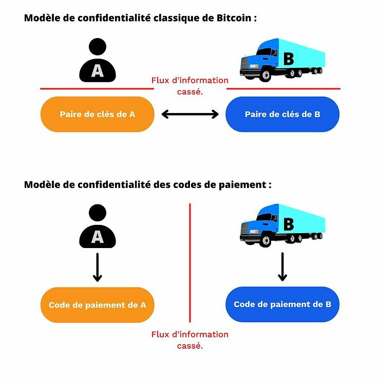
  En realidad, para el modelo de confidencialidad clásico de Bitcoin, a menudo es difícil interrumpir por completo el flujo de información entre el par de claves y el usuario, especialmente cuando se realizan transacciones a distancia. Por ejemplo, en el caso de una campaña de donación, el destinatario estará obligado a revelar una dirección o una clave pública en su sitio web o en sus redes sociales. El uso adecuado de BIP47, es decir, con la transacción de notificación, resuelve esto gracias a ECDHE y a la capa de cifrado que vamos a estudiar.
  Obviamente, el modelo de confidencialidad clásico de Bitcoin siempre se observa a nivel de las claves públicas efímeras derivadas de la asociación de los dos códigos de pago. Ambos modelos son interdependientes. Simplemente quiero resaltar aquí que, a diferencia del uso clásico de una clave pública para recibir bitcoins, el código de pago puede estar asociado a una identidad, ya que la información "Bob realiza una transacción con Alice" se interrumpe en otro momento. El código de pago se utiliza para generar las direcciones de pago, pero al observar únicamente la cadena de bloques, es imposible asociar una transacción de pago BIP47 con los códigos de pago utilizados para realizarla.

### Construcción de la transacción de notificación.

Ahora veamos cómo funciona esta transacción de notificación. Supongamos que Alice desea enviar fondos a Bob con BIP47. En mi ejemplo, Alice actúa como remitente y Bob como destinatario. Este último ha publicado su código de pago en su sitio web. Por lo tanto, Alice ya conoce el código de pago de Bob.

1. Alice calcula un secreto compartido con ECDH:

- Ella selecciona un par de claves de su billetera HD que se encuentran en una rama diferente a su código de pago. Ten en cuenta que este par no debe estar fácilmente asociado a la dirección de notificación de Alice ni a su identidad (ver parte anterior).
- Alice selecciona la clave privada de este par. La llamamos "a" (minúscula).

> a

- Alice obtiene la clave pública asociada a la dirección de notificación de Bob. Esta clave es la primera derivada del código de pago de Bob (índice 0). Llamamos a esta clave pública "B" (mayúscula). La clave privada asociada a esta clave pública se llama "b" (minúscula). "B" se determina mediante la adición y duplicación de puntos en la curva elíptica desde "G" (el punto generador) con "b" (la clave privada).

> B = b·G

- Alice calcula un punto secreto "S" (mayúscula) en la curva elíptica mediante la adición y duplicación de puntos aplicando su clave privada "a" a partir de la clave pública de Bob "B".

> S = a·B

- Alice calcula el factor de cegado "f" que se utilizará para cifrar su código de pago. Para ello, determina un número pseudoaleatorio con la función HMAC-SHA512. Como segundo argumento de esta función, utiliza un valor que solo Bob podrá recuperar: (x), que es la abscisa del punto secreto calculado anteriormente. El primer argumento es (o), que es el UTXO consumido como entrada de esta transacción (outpoint).

> f = HMAC-SHA512(o, x)

2. Alice convierte su código de pago personal a base 2 (binario).

3. Utiliza este factor de cegado como clave para realizar un cifrado simétrico en la carga útil de su código de pago. El algoritmo de cifrado utilizado es simplemente un XOR. La operación realizada es similar al cifrado de Vernam, también conocido como "máscara desechable" (en inglés: "One-Time Pad"):

- Alice divide inicialmente su factor de cegado en dos partes: los primeros 32 bytes se llaman "f1" y los últimos 32 bytes se llaman "f2". Por lo tanto, tenemos:

> f = f1 || f2

- Alice calcula el cifrado (x') de la abscisa de la clave pública (x) de su código de pago y el cifrado (c') de su código de cadena (c) por separado. "f1" y "f2" actúan como claves de cifrado respectivamente. La operación utilizada es el XOR (exclusivo).

> x' = x XOR f1
>
> c>' = c XOR f2

- Alice reemplaza los valores reales del eje x de la clave pública (x) y del código de cadena (c) en su código de pago con los valores cifrados (x') y (c').

Antes de continuar con la descripción técnica de esta transacción de notificación, detengámonos un momento en esta operación XOR. XOR es un operador lógico a nivel de bits basado en el álgebra de Boole. A partir de dos operandos en bits, devuelve 1 si los bits en la misma posición son diferentes, y devuelve 0 si los bits en la misma posición son iguales. Aquí está la tabla de verdad de XOR en función de los valores de los operandos D y E:

| D   | E   | D XOR E |
| --- | --- | ------- |
| 0   | 0   | 0       |
| 0   | 1   | 1       |
| 1   | 0   | 1       |
| 1   | 1   | 0       |

Por ejemplo:

> 0110 XOR 1110 = 1000

O también:

> 010011 XOR 110110 = 100101

Con ECDH, el uso de XOR como capa de cifrado es particularmente coherente. En primer lugar, gracias a este operador, el cifrado es simétrico. Esto permitirá al destinatario descifrar el código de pago con la misma clave que se utilizó para el cifrado. La clave de cifrado y descifrado se calcula a partir del secreto compartido mediante ECDH.

Esta simetría es posible gracias a las propiedades de conmutatividad y asociatividad del operador XOR:

- Otras propiedades:
  -> D ⊕ D = 0
  -> D ⊕ 0 = D

- Conmutatividad:
  D ⊕ E = E ⊕ D

- Asociatividad:
  D ⊕ (E ⊕ Z) = (D ⊕ E) ⊕ Z = D ⊕ E ⊕ Z

- Simetría:
  Si: D ⊕ E = L
  Entonces: D ⊕ L = D ⊕ (D ⊕ E) = D ⊕ D ⊕ E = 0 ⊕ E = E
  -> D ⊕ L = E
  A continuación, este método de cifrado se asemeja mucho al cifrado de Vernam (One-Time Pad), el único algoritmo de cifrado conocido hasta la fecha que tiene seguridad incondicional (o absoluta). Para que el cifrado de Vernam tenga esta característica, la clave de cifrado debe ser perfectamente aleatoria, tener el mismo tamaño que el mensaje y solo ser utilizada una vez. En el método de cifrado utilizado aquí para BIP47, la clave tiene el mismo tamaño que el mensaje, el factor de enmascaramiento tiene exactamente el mismo tamaño que la concatenación de la abscisa de la clave pública con el código de cadena del código de pago. Esta clave de cifrado se utiliza solo una vez. Sin embargo, esta clave no es completamente aleatoria ya que es un HMAC. Es más bien pseudoaleatoria. Por lo tanto, no es un cifrado de Vernam, pero el método se acerca a él.
  Volviendo a nuestra construcción de la transacción de notificación:

4. Alice actualmente tiene su código de pago con una carga útil cifrada. Construirá y difundirá una transacción que involucre su clave pública "A" como entrada, una salida hacia la dirección de notificación de Bob y una salida OP_RETURN que consista en su código de pago con la carga útil cifrada. Esta transacción es la transacción de notificación.

OP_RETURN es un Opcode, es decir, un script, que permite marcar una salida de transacción de Bitcoin como inválida. Hoy en día, se utiliza para difundir o anclar información en la cadena de bloques de Bitcoin. Se pueden almacenar hasta 80 bytes de datos que se registran en la cadena y, por lo tanto, son visibles para todos los demás usuarios.

Como vimos en la parte anterior, Diffie-Hellman se utiliza para generar un secreto compartido entre dos usuarios que se comunican en una red no segura y potencialmente observada por atacantes. En BIP47, se utiliza ECDH para poder comunicarse en la red de Bitcoin, que por naturaleza es una red de comunicación transparente y observada por muchos atacantes. El secreto compartido calculado mediante el intercambio de claves Diffie-Hellman en la curva elíptica se utiliza luego para cifrar la información secreta a transmitir: el código de pago del remitente (Alice).

Aquí hay un diagrama extraído de BIP47 que ilustra lo que acabamos de describir:

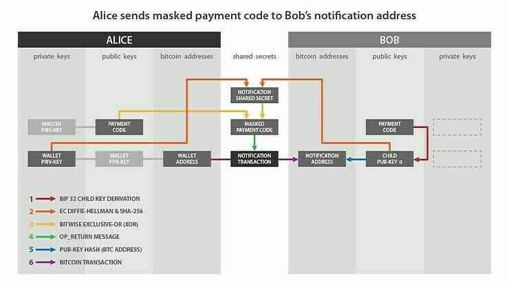

Crédito: Reusable Payment Codes for Hierarchical Deterministic Wallets, Justus Ranvier. https://github.com/bitcoin/bips/blob/master/bip-0047.mediawiki

Si relacionamos este diagrama con lo que les describí anteriormente:

- "Wallet Priv-Key" en el lado de Alice corresponde a: a.

- "Child Pub-Key 0" en el lado de Bob corresponde a: B.
- "Notification Shared Secret" corresponde a: f.
- "Masked Payment Code" corresponde al código de pago enmascarado, es decir, con la carga útil cifrada: x' y c'.

- "Notification Transaction" es la transacción que contiene el OP_RETURN.

Resumo los pasos que acabamos de ver juntos para realizar una transacción de notificación:

- Alice obtiene el código de pago y la dirección de notificación de Bob.

- Alice selecciona una UTXO que le pertenece en su billetera HD con el par de claves correspondiente.

- Calcula un punto secreto en la curva elíptica mediante ECDH.

- Utiliza este punto secreto para calcular un HMAC que es el factor de enmascaramiento.

- Utiliza este factor de enmascaramiento para cifrar la carga útil de su código de pago personal.

- Utiliza una salida de transacción OP_RETURN para transferir el código de pago enmascarado a Bob.

Para comprender más en detalle su funcionamiento, y especialmente el uso de OP_RETURN, estudiemos juntos una transacción de notificación real. Realicé una transacción de este tipo en Testnet que puedes encontrar haciendo clic aquí:

https://mempool.space/fr/testnet/tx/0e2e4695a3c49272ef631426a9fd2dae6ec3a469e3a39a3db51aa476cd09de2e

TXID:

> 0e2e4695a3c49272ef631426a9fd2dae6ec3a469e3a39a3db51aa476cd09de2e

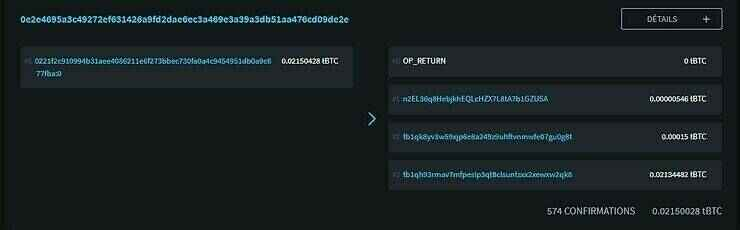

Crédito: https://blockstream.info/

Al observar esta transacción, ya podemos ver que tiene una sola entrada y 4 salidas:

- La primera salida es OP_RETURN que contiene mi código de pago enmascarado.

- La segunda salida de 546 sats apunta a la dirección de notificación de mi destinatario.

- La tercera salida de 15,000 sats representa la tarifa de servicio, ya que utilicé Samourai Wallet para construir esta transacción.

- La cuarta salida de dos millones de sats representa el cambio, es decir, la diferencia restante de mi entrada que vuelve a otra dirección que me pertenece.

Lo más interesante de estudiar es obviamente la salida 0 que utiliza OP_RETURN. Veamos más en detalle lo que contiene:

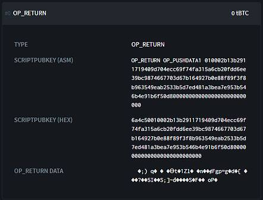

Crédito: https://blockstream.info/

Aquí descubrimos el script de la salida en hexadecimal:

> 6a4c50010002b13b2911719409d704ecc69f74fa315a6cb20fdd6ee39bc9874667703d67b164927b0e88f89f3f8b963549eab2533b5d7ed481a3bea7e953b546b4e91b6f50d800000000000000000000000000

En este script, podemos analizar varias partes:

> 6a4c50010002b13b2911719409d704ecc69f74fa315a6cb20fdd6ee39bc9874667703d67b164927b0e88f89f3f8b963549eab2533b5d7ed481a3bea7e953b546b4e91b6f50d800000000000000000000000000>
> Los opcodes:
>
> 6a4c
>
> Un byte que indica el tamaño de la carga útil (80 bytes):
>
> 50
>
> Los metadatos de mi código de pago en claro:
>
> 010002
>
> La abscisa cifrada de la clave pública de mi código de pago:
>
> b13b2911719409d704ecc69f74fa315a6cb20fdd6ee39bc9874667703d67b164
>
> El código de cadena cifrado de mi código de pago:
> 927b0e88f89f3f8b963549eab2533b5d7ed481a3bea7e953b546b4e91b6f50d8
>
> Relleno para llegar a 80 bytes:
> 00000000000000000000000000

Entre los opcodes, se puede reconocer 0x6a que indica OP_RETURN y 0x4c que indica OP_PUSHDATA1. El byte siguiente a este último opcode indica el tamaño de la carga útil que sigue. Indica 0x50, es decir, 80 bytes.

Luego viene el código de pago con la carga útil cifrada.

Aquí está mi código de pago en claro utilizado en esta transacción:

> En base 58:
>
> PM8TJQCyt6ovbozreUCBrfKqmSVmTzJ5vjqse58LnBzKFFZTwny3KfCDdwTqAEYVasn11tTMPc2FJsFygFd3YzsHvwNXLEQNADgxeGnMK8Ugmin62TZU
>
> En base 16 (HEX):
> 4701000277507c9c17a89cfca2d3af554745d6c2db0e7f6b2721a3941a504933103cc42add94881210d6e752a9abc8a9fa0070e85184993c4f643f1121dd807dd556d1dc000000000000000000000000008604e4db

Si comparamos mi código de pago en claro con el OP_RETURN, podemos ver que el HRP (en marrón) y el checksum (en rosa) no se transmiten. Esto es normal, esta información está destinada a los humanos.
A continuación, se puede reconocer (en verde) la versión (0x01), el campo de bits (0x00) y la paridad de la clave pública (0x02). Y, al final del código de pago, los bytes vacíos en negro (0x00) que permiten rellenar para llegar a un total de 80 bytes. Todos estos metadatos se transmiten en claro (no cifrados).
Finalmente, se puede observar que la abscisa de la clave pública (en azul) y el código de cadena (en rojo) han sido cifrados. Esto es lo que constituye la carga útil del código de pago.

### Recepción de la transacción de notificación.

Ahora que Alice ha enviado la transacción de notificación a Bob, veamos cómo él la interpreta.

Como recordatorio, Bob debe poder acceder obligatoriamente al código de pago de Alice. Sin esta información, como veremos en la siguiente parte, no podrá derivar los pares de claves creados por Alice y, por lo tanto, no podrá acceder a sus bitcoins recibidos con BIP47. Por el momento, la carga útil del código de pago de Alice está cifrada. Veamos juntos cómo Bob la descifra.

1. Bob monitorea las transacciones que crean salidas con su dirección de notificación.

2. Cuando una transacción tiene una salida en su dirección de notificación, Bob la analiza para ver si contiene una salida OP_RETURN que cumple con el estándar BIP47.

3. Si el primer byte de la carga útil de OP_RETURN es 0x01, Bob comienza su búsqueda de un posible secreto compartido con ECDH:

- Bob selecciona la clave pública en la entrada de la transacción. Es decir, la clave pública de Alice llamada "A" con:

> A = a·G

- Bob selecciona la clave privada "b" asociada a su dirección de notificación personal:

> b

- Bob calcula el punto secreto "S" (secreto compartido ECDH) en la curva elíptica mediante la adición y duplicación de puntos aplicando su clave privada "b" a la clave pública de Alice "A":

> S = b·A

- Bob determina el factor cegador "f" que permitirá descifrar la carga útil del código de pago de Alice. De la misma manera que Alice lo había calculado anteriormente, Bob encontrará "f" aplicando HMAC-SHA512 a (x) el valor en abscisa del punto secreto "S" y a (o) el UTXO consumido en la entrada de esta transacción de notificación:

> f = HMAC-SHA512(o, x)

4. Bob interpreta los datos de OP_RETURN en la transacción de notificación como un código de pago. Simplemente descifrará la carga útil de este potencial código de pago utilizando el factor cegador "f".

- Bob divide el factor cegador "f" en dos partes: los primeros 32 bytes de "f" serán "f1" y los últimos 32 bytes serán "f2".
- Bob descifra el valor de la abscisa cifrada (x') de la clave pública del código de pago de Alice:

> x = x' XOR f1

- Bob descifra el valor del código de cadena cifrado (c') del código de pago de Alice:

> c = c' XOR f2

5. Bob verifica si el valor de la clave pública del código de pago de Alice pertenece al grupo secp256k1. Si es así, lo interpreta como un código de pago válido. De lo contrario, ignora esta transacción.

Ahora que Bob conoce el código de pago de Alice, ella puede enviarle hasta 2^32 pagos sin necesidad de realizar otra transacción de notificación de este tipo.

¿Por qué funciona esto? ¿Cómo puede Bob determinar el mismo factor cegador que Alice y, por lo tanto, descifrar su código de pago? Examinemos más detalladamente la acción de ECDH en lo que acabamos de describir.

En primer lugar, estamos tratando con un cifrado simétrico. Esto significa que la clave de cifrado y la clave de descifrado son el mismo valor. Esta clave en la transacción de notificación es el factor cegador (f = f1 || f2). Por lo tanto, Alice y Bob deben obtener el mismo valor para f sin transmitirlo directamente, ya que un atacante podría robarlo y descifrar la información secreta.

Este factor cegador se obtiene aplicando HMAC-SHA512 a dos valores: la abscisa de un punto secreto y el UTXO consumido como entrada de la transacción. Por lo tanto, Bob debe tener esta información para descifrar la carga útil del código de pago de Alice.

Para el UTXO de entrada, Bob simplemente puede obtenerlo observando la transacción de notificación. Para el punto secreto, Bob tendrá que utilizar ECDH.

Como se vio en la sección sobre Diffie-Hellman, simplemente intercambiando sus claves públicas respectivas y aplicando secretamente sus claves privadas a la clave pública del otro, Alice y Bob pueden encontrar un punto preciso y secreto en la curva elíptica. La transacción de notificación se basa en este mecanismo:

> Par de claves de Bob:
>
> B = b·G
>
> Par de claves de Alice:
>
> A = a·G
>
> Para un punto secreto S (x,y):
>
> S = a·B = a·b·G = b·a·G = b·A

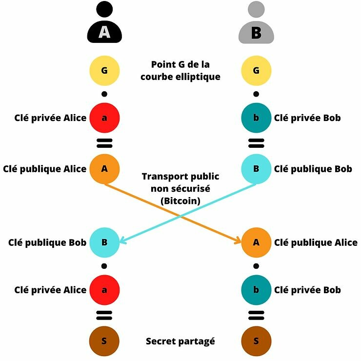
Ahora que Bob conoce el código de pago de Alice, podrá detectar los pagos BIP47 de ella y podrá derivar las claves privadas que bloquean los bitcoins recibidos.
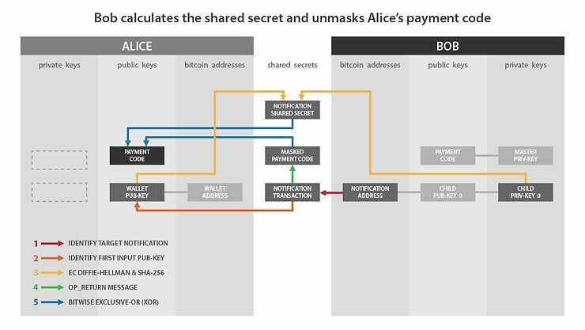

Crédito: Códigos de Pago Reutilizables para Monederos Determinísticos Jerárquicos, Justus Ranvier. https://github.com/bitcoin/bips/blob/master/bip-0047.mediawiki

Si relacionamos este esquema con lo que les describí anteriormente:

- "Wallet Pub-Key" en el lado de Alice corresponde a: A.

- "Child Priv-Key 0" en el lado de Bob corresponde a: b.

- "Notification Shared Secret" corresponde a: f.

- "Masked Payment Code" corresponde al código de pago de Alice enmascarado, es decir, con la carga útil cifrada: x' y c'.

- "Notification Transaction" es la transacción que contiene el OP_RETURN.

Resumo los pasos que acabamos de ver juntos para recibir e interpretar una transacción de notificación:

- Bob monitorea las salidas de transacción hacia su dirección de notificación.

- Cuando detecta una, recupera la información contenida en el OP_RETURN.

- Bob selecciona la clave pública de entrada y calcula un punto secreto mediante ECDH.

- Utiliza este punto secreto para calcular un HMAC que es el factor de cegamiento.

- Utiliza este factor de cegamiento para descifrar la carga útil del código de pago de Alice contenido en el OP_RETURN.

### La transacción de pago BIP47.

Ahora estudiemos juntos el proceso de pago con BIP47. Para recordar el estado actual de la situación:

- Alice conoce el código de pago de Bob que simplemente recuperó de su sitio web.

- Bob conoce el código de pago de Alice gracias a la transacción de notificación.

- Alice realizará un primer pago a Bob. Podrá realizar muchos otros de la misma manera.

Antes de explicarles este proceso, creo que es importante recordar en qué índices estamos trabajando actualmente:

Describimos la ruta de derivación de un código de pago de la siguiente manera: m/47'/0'/0'/.

La siguiente profundidad distribuye los índices de la siguiente manera:

- El primer par de hijos normales (no reforzados) se utiliza para generar la dirección de notificación de la que hablamos en la parte anterior: m/47'/0'/0'/0/.

- Los pares de claves hijos normales se utilizan en ECDH para generar direcciones de recepción de pagos BIP47 como veremos en esta parte: m/47'/0'/0'/ de 0 a 2 147 483 647/.

- Los pares de claves hijos reforzados son códigos de pago efímeros: m/47'/0'/0'/ de 0' a 2 147 483 647'/.
  Cada vez que Alice desea enviar un pago a Bob, ella deriva una nueva dirección única en blanco, una vez más utilizando el protocolo ECDH:
- Alice selecciona la primera clave privada derivada de su código de pago reutilizable personal:

> a

- Alice selecciona la primera clave pública no utilizada derivada del código de pago de Bob. A esta clave pública la llamaremos "B". Está asociada con la clave privada "b" de la cual solo Bob tiene conocimiento.

> B = b·G

- Alice calcula un punto secreto "S" en la curva elíptica mediante la adición y duplicación de puntos aplicando su clave privada "a" a partir de la clave pública de Bob "B":

> S = a·B

- A partir de este punto secreto, Alice calculará el secreto compartido "s" (en minúscula). Para hacer esto, selecciona la abscisa del punto secreto "S" llamada "Sx" y pasa este valor a través de la función de hash SHA256.

> s = SHA256(Sx)

¡No confíes. Verifica! Si deseas entender los principios básicos de una función de hash, encontrarás información en este artículo. Y si no confías en el NIST (tienes razón) y quieres ser capaz de entender en detalle cómo funciona SHA256, te lo explico todo en este artículo en francés.

- Alice utiliza este secreto compartido "s" para calcular una dirección de recepción de pagos de Bitcoin. En primer lugar, verifica que "s" esté contenido en el orden de la curva secp256k1. Si no es así, incrementa el índice de la clave pública de Bob para derivar otro secreto compartido.

- En segundo lugar, calcula una clave pública "K0" sumando en la curva elíptica los puntos "B" y "s·G". En otras palabras, Alice suma la clave pública derivada del código de pago de Bob "B" con otro punto calculado en la curva elíptica mediante la adición y duplicación de puntos con el secreto compartido "s" desde el punto generador de la curva secp256k1 "G". Este nuevo punto representa una clave pública y lo llamamos "K0":

> K0 = B + s·G

- Con esta clave pública "K0", Alice puede derivar una dirección de recepción en blanco de forma estándar (por ejemplo, SegWit V0 en Bech32).

Una vez que Alice tiene esta dirección de recepción "K0" perteneciente a Bob, puede construir una transacción de Bitcoin normal, seleccionando una UTXO que le pertenezca en otra rama de su billetera HD y gastando hacia la dirección "K0" de Bob.

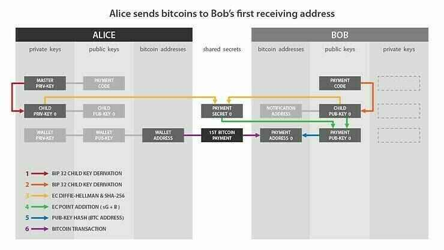

Crédito: Códigos de Pago Reutilizables para Billeteras Determinísticas Jerárquicas, Justus Ranvier. https://github.com/bitcoin/bips/blob/master/bip-0047.mediawiki
Si se corresponde este esquema con lo que les describí anteriormente:

- "Child Priv-Key" en el lado de Alice corresponde a: a.
- "Child Pub-Key 0" en el lado de Bob corresponde a: B.
- "Payment Secret 0" corresponde a: s.
- "Payment Pub-Key 0" corresponde a: K0.

Resumo los pasos que acabamos de ver juntos para enviar un pago BIP47:

- Alice selecciona la primera clave privada derivada de su código de pago personal.
- Calcula un punto secreto en la curva elíptica mediante ECDH a partir de la primera clave pública derivada no utilizada del código de pago de Bob.
- Utiliza este punto secreto para calcular un secreto compartido con SHA256.
- Utiliza este secreto compartido para calcular un nuevo punto secreto en la curva elíptica.
- Suma este nuevo punto secreto con la clave pública de Bob.
- Obtiene una nueva clave pública efímera de la cual solo Bob tiene la clave privada asociada.
- Alice puede enviar una transacción estándar a Bob con la dirección de recepción derivada efímera.

Si desea realizar un segundo pago, repetirá los pasos anteriores, excepto que seleccionará la segunda clave pública derivada del código de pago de Bob, es decir, la siguiente clave no utilizada. Luego tendrá una segunda dirección de recepción perteneciente a Bob "K1".

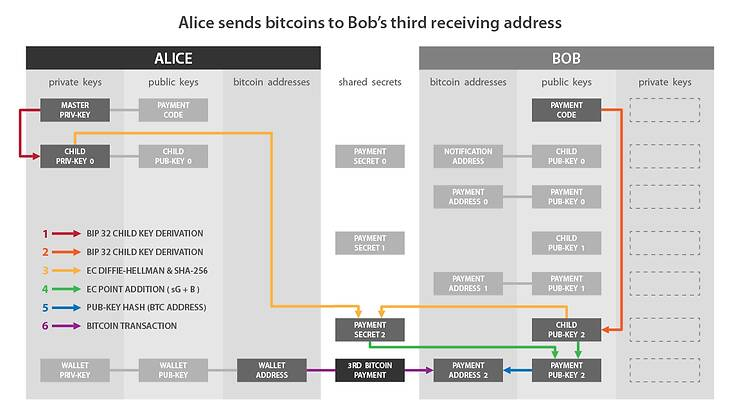

Crédito: Códigos de pago reutilizables para billeteras determinísticas jerárquicas, Justus Ranvier. https://github.com/bitcoin/bips/blob/master/bip-0047.mediawiki

Puede continuar de esta manera y derivar hasta 2^32 direcciones en blanco pertenecientes a Bob.

Desde una perspectiva externa, al observar la cadena de bloques de Bitcoin, en teoría es imposible diferenciar un pago BIP47 de un pago estándar. Aquí hay un ejemplo de una transacción de pago BIP47 en Testnet:

https://blockstream.info/testnet/tx/94b2e59510f2e1fa78411634c98a77bbb638e28fb2da00c9f359cd5fc8f87254

TXID:

> 94b2e59510f2e1fa78411634c98a77bbb638e28fb2da00c9f359cd5fc8f87254

Esto se parece a una transacción estándar con una entrada consumida, una salida de pago de 210,000 sats y un cambio.

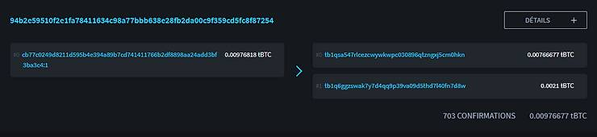

Crédito: https://blockstream.info/

### Recepción del pago BIP47 y derivación de la clave privada.

Alice acaba de realizar su primera transacción a una dirección BIP47 vacía perteneciente a Bob. Ahora veamos juntos cómo Bob recibe esta transacción. También veremos por qué Alice no tiene acceso a la clave privada de la dirección que acaba de generar, y cómo Bob recupera esta clave para poder gastar los bitcoins que acaba de recibir.
Tan pronto como Bob recibe la transacción de notificación de parte de Alice, deriva la clave pública BIP47 "K0" incluso antes de que su contraparte haya enviado algún pago. Por lo tanto, él observa cualquier pago hacia la dirección asociada. De hecho, incluso deriva inmediatamente varias direcciones que va a observar (K0, K1, K2, K3...). Así es como deriva esta clave pública "K0":

- Bob selecciona la primera clave privada derivada desde su código de pago. Esta clave privada se llama "b". Está asociada con la clave pública "B" con la cual Alice hizo sus cálculos en el paso anterior:

> b

- Bob selecciona la primera clave pública de Alice derivada desde su código de pago. Esta clave se llama "A". Está asociada con la clave privada "a" con la cual Alice hizo sus cálculos, y de la cual solo Alice tiene conocimiento. Bob puede realizar este proceso ya que conoce el código de pago de Alice que le fue transmitido con la transacción de notificación.

> A = a·G

- Bob calcula el punto secreto "S", mediante la suma y el doble de puntos en la curva elíptica, aplicando su clave privada "b" a la clave pública de Alice "A". Aquí es donde se utiliza ECDH, que nos garantiza que este punto "S" será el mismo para Bob y para Alice.

> S = b·A

- De la misma manera que lo hizo Alice, Bob aísla la abscisa de este punto "S". Hemos llamado a este valor "Sx". Luego pasa este valor a través de la función SHA256 para encontrar el secreto compartido "s" (en minúscula).

> s = SHA256(Sx)

- De la misma manera que Alice, Bob calcula el punto "s·G" en la curva elíptica. Luego, suma este punto secreto con su clave pública "B". Obtiene así un nuevo punto en la curva elíptica que interpreta como una clave pública "K0":

> K0 = B + s·G

Una vez que Bob tiene esta clave pública "K0", puede derivar la clave privada asociada para poder gastar sus bitcoins. Él es el único que puede generar este número.

- Bob suma su clave privada derivada desde su código de pago personal. Él es el único que puede obtener el valor de "b". Luego, suma "b" con el secreto compartido "s" para obtener k0, la clave privada de K0:

> k0 = b + s
> Gracias a la ley de grupo de la curva elíptica, Bob obtiene exactamente la clave privada correspondiente a la clave pública utilizada por Alice. Por lo tanto, tenemos:
> K0 = k0·G

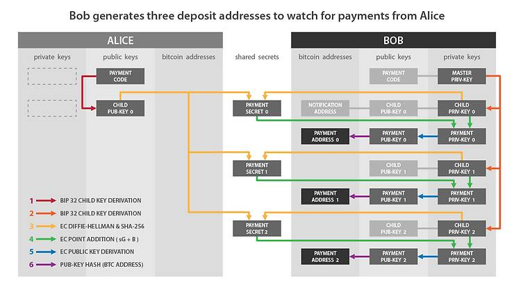

Crédito: Códigos de Pago Reutilizables para Monederos Deterministas Jerárquicos, Justus Ranvier. https://github.com/bitcoin/bips/blob/master/bip-0047.mediawiki

Si relacionamos este esquema con lo que les describí anteriormente:

- "Child Priv-Key 0" en el lado de Bob corresponde a: b.

- "Child Pub-Key 0" en el lado de Alice corresponde a: A.

- "Payment Secret 0" corresponde a: s.

- "Payment Pub-Key 0" corresponde a: K0.

- "Payment Priv-Key 0" corresponde a: k0.

Resumo los pasos que acabamos de ver juntos para recibir un pago BIP47 y calcular la clave privada correspondiente:

- Bob selecciona la primera clave privada derivada de su código de pago personal.

- Calcula un punto secreto en la curva elíptica mediante ECDH a partir de la primera clave pública derivada del código de cadena de Alice.

- Utiliza este punto secreto para calcular un secreto compartido con SHA256.

- Utiliza este secreto compartido para calcular un nuevo punto secreto en la curva elíptica.

- Suma este nuevo punto secreto con su clave pública personal.

- Obtiene una nueva clave pública efímera, a la cual Alice enviará su primer pago.

- Bob calcula la clave privada asociada a esta clave pública efímera sumando su clave privada derivada de su código de pago y el secreto compartido.

Dado que Alice no puede obtener "b", la clave privada de Bob, no puede determinar k0, la clave privada asociada a la dirección de recepción BIP47 de Bob.

Esquemáticamente, podemos representar el cálculo del secreto compartido "S" de la siguiente manera:

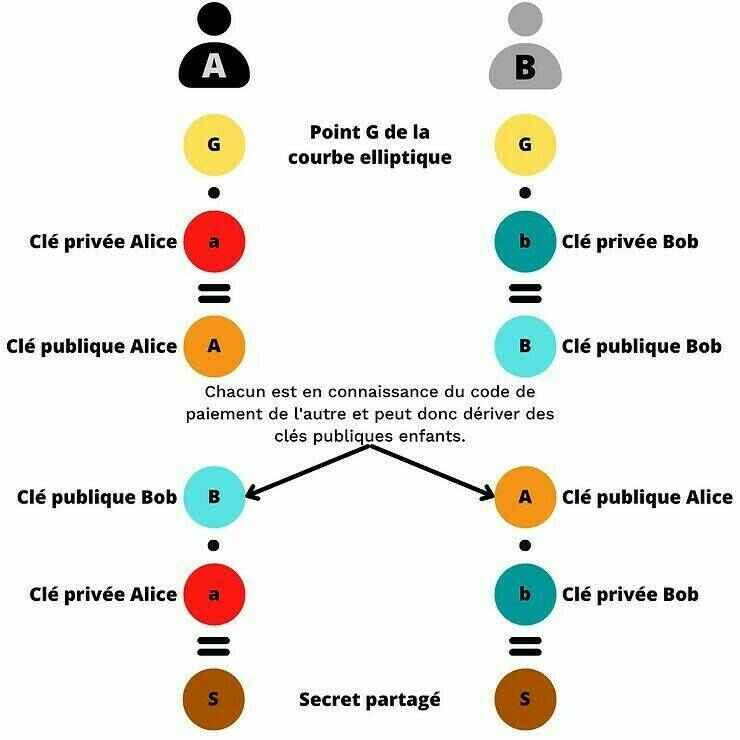

Una vez que se encuentra el secreto compartido con ECDH, Alice y Bob calculan la clave pública de pago BIP47 "K0", y Bob también calcula la clave privada asociada "k0":

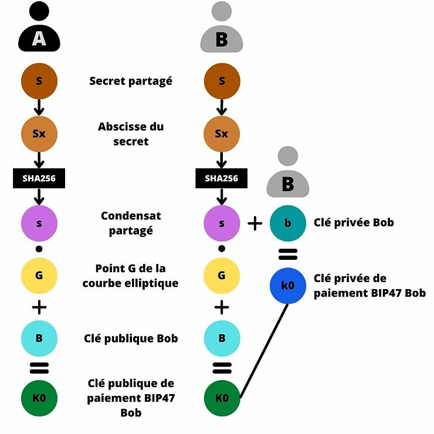

### Reembolso del pago BIP47.

Dado que Bob conoce el código de pago reutilizable de Alice, ya tiene toda la información necesaria para enviarle un reembolso. No necesitará contactar a Alice para solicitar ninguna información. Simplemente la notificará con una transacción de notificación, especialmente para que ella pueda recuperar sus direcciones BIP47 con su semilla, y también podrá enviarle hasta 2^32 pagos.
Bob puede entonces reembolsar a Alice de la misma manera en que ella le envió los pagos. Los roles se invierten:

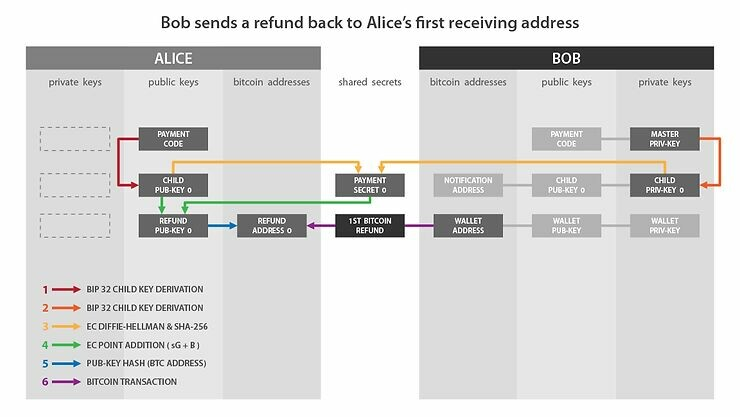

Crédito: Códigos de Pago Reutilizables para Monederos Deterministas Jerárquicos, Justus Ranvier. https://github.com/bitcoin/bips/blob/master/bip-0047.mediawiki

Ahora conoces todos los detalles de esta magnífica solución que representa el BIP47.

## Usos derivados de PayNym.

La implementación de este BIP47 en Samourai Wallet ha dado lugar a PayNym, identificadores calculados a partir de los códigos de pago de los usuarios. Hoy en día, su utilidad va mucho más allá del uso de BIP47.

El equipo de Samourai está desarrollando gradualmente todo un ecosistema de herramientas y servicios basados en el PayNym del usuario. Entre ellos, por supuesto, se encuentran todas las herramientas de gasto que permiten optimizar la privacidad del usuario al agregar entropía a una transacción, y por lo tanto, agregar negación plausible.

El uso conjunto de Soroban, la red de comunicación cifrada basada en Tor, y PayNym ha permitido optimizar en gran medida la experiencia del usuario al construir transacciones colaborativas, manteniendo al mismo tiempo un buen nivel de seguridad. De esta manera, es posible realizar fácilmente transacciones Stowaway (PayJoin) y StonewallX2 sin tener que realizar manualmente numerosos intercambios de transacciones no firmadas necesarios para establecer una transacción colaborativa de este tipo.

A diferencia del uso de BIP47, ya que estas transacciones colaborativas no requieren realizar una transacción de notificación, solo es necesario vincular los PayNym para utilizar estas herramientas. No es necesario conectarlos.

Si desea obtener más información sobre las transacciones colaborativas y, en general, sobre todas las herramientas de gasto de Samourai Wallet, puede leer la sección "Herramientas de gasto" en este artículo. Encontrará una explicación técnica y un tutorial detallado para cada herramienta.

Además de estas transacciones colaborativas, recientemente se ha observado que el equipo de Samourai está trabajando en un protocolo de autenticación relacionado con PayNym: Auth47. Esta herramienta ya está implementada y permite, por ejemplo, autenticarse en un sitio web que acepta este método utilizando un PayNym. En el futuro, creo que más allá de esta posibilidad de autenticación en la web, Auth47 se integrará en un proyecto más amplio en torno al ecosistema BIP47/PayNym/Samourai. Tal vez este protocolo se utilizará para optimizar aún más la experiencia del usuario en la billetera Samourai Wallet, especialmente en el uso de las herramientas de gasto. ¡Esto está por verse...

## Mi opinión personal sobre BIP47.

Por supuesto, la principal desventaja de BIP47 es la transacción de notificación. Esto obliga al usuario a pagar una tarifa por la minería de la transacción, lo cual puede resultar molesto para algunos. Sin embargo, el argumento de "spam" en la cadena de bloques de Bitcoin es absolutamente inaceptable. Cualquier persona que pague la tarifa por su transacción debe poder registrarla en el registro, sin importar su objetivo. Afirmar lo contrario es posicionarse a favor de la censura.
Es posible que en el futuro se encuentren otras soluciones menos costosas para comunicar el código de pago del remitente al destinatario y para que este último pueda almacenarlo de manera segura. Pero, por ahora, la transacción de notificación sigue siendo la solución con menos compromisos.
Esta desventaja sigue siendo insignificante cuando se observan todos los beneficios de BIP47. Entre todas las propuestas existentes para resolver este problema de reutilización de direcciones, me parece que es la mejor solución.
Como se explicó anteriormente, la mayoría de las reutilizaciones de direcciones provienen de los exchanges. BIP47 es la única solución razonable que realmente puede resolver este problema desde la fuente. Cualquier propuesta para reducir la cantidad de reutilizaciones de direcciones debe abordar este aspecto y adaptar la solución a la fuente principal del problema.
En cuanto a su uso, aunque sus mecanismos son bastante complejos, el procedimiento de pago de BIP47 es muy sencillo. Los códigos de pago reutilizables pueden ser adoptados fácilmente, incluso por usuarios novatos.
En términos de privacidad, BIP47 es muy interesante. Como se explicó en la sección sobre la transacción de notificación, el código de pago no revela ninguna información sobre las direcciones efímeras derivadas. Por lo tanto, permite romper el flujo de información entre la transacción de Bitcoin y la identificación del receptor, a diferencia del uso tradicional de una dirección de recepción.
Y sobre todo, la implementación PayNym de BIP47 ¡funciona! Está disponible en Samourai Wallet desde 2016 y en Sparrow Wallet desde principios de este año. No es un proyecto científico, sino una solución probada ayer y completamente funcional hoy.
Esperemos que en el futuro, estos códigos de pago reutilizables sean adoptados por los actores del ecosistema, implementados en los software de billetera y utilizados por los usuarios de Bitcoin.
Cualquier solución verdaderamente positiva para la privacidad del usuario debe ser discutida, promovida y defendida, para que Bitcoin no se convierta en el patio de recreo de las agencias de inteligencia y en una herramienta de vigilancia gubernamental.
Estaba pensando en cómo había sido perseguido e insultado en todas partes, ¡y ahora escuchaba a todos decir que era el más hermoso de todos esos hermosos pájaros! ¡Incluso el saúco inclinaba sus ramas hacia él, y el sol derramaba una luz tan cálida y beneficiosa! Entonces sus plumas se hincharon, su cuello esbelto se erguió, y exclamó con todo su corazón: "¿Cómo pude soñar con tanta felicidad cuando era solo un patito feo?"

## Para ir más allá:

- Comprender y utilizar CoinJoin en Bitcoin.

- Comprender las rutas de derivación de una billetera Bitcoin.

- Instalar y utilizar su nodo Bitcoin RoninDojo.

### Recursos externos y agradecimientos:

Gracias a LaurentMT y Théo Pantamis por los numerosos conceptos que me explicaron y que utilicé en este artículo. Espero haberlos transmitido con precisión.

Gracias a Fanis Michalakis por revisar este texto y sus consejos de experto.

- https://bitcoiner.guide/paynym/
- https://github.com/bitcoin/bips/blob/master/bip-0047.mediawiki
- https://fr.wikipedia.org/wiki/%C3%89change_de_cl%C3%A9s_Diffie-Hellman
- https://fr.wikipedia.org/wiki/%C3%89change_de_cl%C3%A9s_Diffie-Hellman_bas%C3%A9_sur_les_courbes_elliptiques
- https://security.stackexchange.com/questions/46802/what-is-the-difference-between-dhe-and-ecdh#:~:text=The%20difference%20between%20DHE%20and%20ECDH%20in%20two%20bullet%20points,a%20type%20of%20algebraic%20curve).
- https://commandlinefanatic.com/cgi-bin/showarticle.cgi?article=art060
- https://ee.stanford.edu/~hellman/publications/24.pdf
- https://www.researchgate.net/publication/317339928_A_study_on_diffie-hellman_key_exchange_protocols
