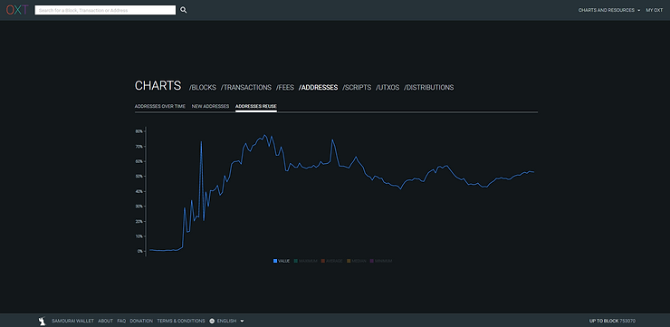
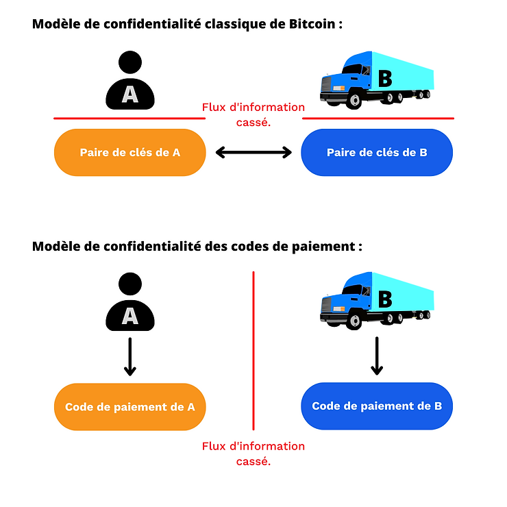
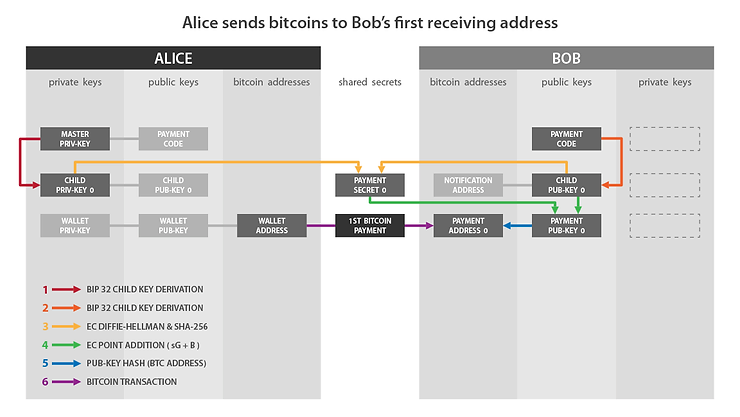

> « Il est trop grand, » disaient-ils tous, et le coq d’Inde qui était venu au monde avec des éperons et qui se croyait empereur, se gonfla comme un bâtiment toutes voiles dehors, et marcha droit sur lui en grande fureur et rouge jusqu’aux yeux. Le pauvre canet ne savait s’il devait s’arrêter ou marcher : il eut bien du chagrin d’être bafoué par tous les canards de la cour.

Un des fléaux les plus importants sur le protocole Bitcoin est la réutilisation d'adresse. La transparence et la distribution du réseau rend cette pratique dangereuse pour la confidentialité de l'utilisateur. Pour éviter les problèmes liés à cela, il est conseillé d'utiliser une nouvelle adresse de réception vierge pour tout nouveau paiement entrant vers un portefeuille, ce qui peut être compliqué à réaliser dans certains cas.

Ce compromis est vieux comme le White Paper. Satoshi nous mettait déjà en garde contre ce risque dans son ouvrage publié fin 2008 :

> "En guise de pare-feu additionnel, une nouvelle paire de clés pourrait être utilisée pour chaque transaction afin de les garder non liées à un propriétaire commun."

De nombreuses solutions existent pour recevoir de multiples paiements, sans pour autant produire de réutilisation d'adresse. Chacune d'elles dispose de ses compromis et de ses inconvénients. Parmi toutes ces solutions, il y a le [BIP47](https://github.com/bitcoin/bips/blob/master/bip-0047.mediawiki), une proposition développée par Justus Ranvier et publiée en 2015 permettant de générer des codes de paiements réutilisables. Leur objectif est de pouvoir réaliser plusieurs transactions vers une même personne, sans pour autant réutiliser d'adresse.

Au départ, cette proposition a reçu un accueil méprisant de la part d'une partie de la communauté, et elle n'a jamais été ajoutée à Bitcoin Core. Certains logiciels ont tout de même choisi de l'implémenter de leur côté. Ainsi, [Samourai Wallet](https://samouraiwallet.com/) a développé sa propre implémentation du BIP47 : PayNym. Aujourd'hui, cette implémentation est évidemment disponible sur Samourai Wallet pour les smartphones, mais également sur [Sparrow Wallet](https://sparrowwallet.com/) pour les PC.

Avec le temps, Samourai a programmé de nouvelles fonctionnalités directement liées à PayNym. À présent, il existe tout un écosystème d'outils permettant d'optimiser la confidentialité de l'utilisateur fondés sur PayNym et sur BIP47.

Dans cet article, vous découvrirez le principe du BIP47 et de PayNym, les mécanismes de ces protocoles et les applications pratiques qui en découlent. Je vais uniquement aborder la première version du BIP47, celle actuellement utilisée pour PayNym, mais les versions 2, 3 et 4 fonctionnent pratiquement de la même façon.

> La seule différence majeure se trouve au niveau de la transaction de notification. La version 1 utilise une adresse simple avec l'OP_RETURN pour la notification, la version 2 utilise un script multisig (bloom-multisig) avec l'OP_RETURN et la version 3 et 4 utilisent simplement un script multisig (cfilter-multisig). Les mécanismes évoqués dans cet article, et notamment les méthodes cryptographiques étudiées, sont donc applicables aux quatre versions. À date, l'implémentation PayNym sur Samourai Wallet et Sparrow utilise la première version du BIP47.

## Sommaire :

1- Le problème de la réutilisation d'adresse.

2- Principes du BIP47 et de PayNym.

3- Tutoriels : utilisation de PayNym.

- Construire une transaction BIP47 avec Samourai Wallet.

- Construire une transaction BIP47 avec Sparrow Wallet.

4- Les rouages du BIP47.

- Le code de paiement réutilisable.
- La méthode cryptographique : l'échange de clés Diffie-Hellman établi sur les courbes elliptiques (ECDH).

- La transaction de notification.
- Construction de la transaction de notification.
- Réception de la transaction de notification.
- La transaction de paiement BIP47.
- Réception du paiement BIP47 et dérivation de la clé privée.
- Remboursement du paiement BIP47.

5- Utilisations dérivées de PayNym.

6- Mon avis personnel sur le BIP47.

## Le problème de la réutilisation d'adresse.

Une adresse de réception est utilisée pour recevoir des bitcoins. Elle est générée à partir d'une clé publique en la hachant et en lui appliquant un format spécifique. Ainsi, elle permet de créer une nouvelle condition de dépense sur une pièce afin d'en modifier le propriétaire.

> Pour en savoir plus sur la génération d'une adresse de réception, je vous conseille de lire la dernière partie de cet article : Le portefeuille Bitcoin - extrait [ebook Bitcoin Démocratisé 2](https://www.pandul.fr/post/le-portefeuille-bitcoin-extrait-ebook-bitcoin-d%C3%A9mocratis%C3%A9-2#viewer-epio7).

Par ailleurs, vous avez sûrement déjà entendu de la part d'un bitcoiner avisé que les adresses de réception sont à usage unique, et qu'il faut de ce fait en générer une nouvelle pour tout nouveau paiement entrant vers votre portefeuille. D'accord, mais pourquoi ?

Fondamentalement, la réutilisation d'adresse ne met pas en danger directement vos fonds. L'utilisation de la cryptographie sur les courbes elliptiques permet de prouver au réseau que vous êtes bien en possession d'une clé privée sans pour autant révéler cette clé. Vous pouvez donc bloquer plusieurs UTXO différents sur une même adresse et les dépenser à différents moments. Si vous ne révélez pas la clé privée associée à cette adresse, personne ne pourra accéder à vos fonds. Le problème de la réutilisation d'adresse est plutôt de l'ordre de la vie privée.

Comme évoqué en introduction, la transparence et la distribution du réseau Bitcoin font que n'importe quel utilisateur, pourvu qu'il ait accès à un nœud, est en capacité d'observer les transactions du système de paiement. De ce fait, il peut voir les différents soldes des adresses. Satoshi Nakamoto a alors évoqué la possibilité de générer de nouvelles paires de clés, et ainsi de nouvelles adresses, pour tout nouveau paiement entrant vers un portefeuille. L'objectif serait d'avoir un pare-feu supplémentaire en cas d'association entre l'identité de l'utilisateur et une de ses paires de clés.

Aujourd'hui, avec la présence de sociétés d'analyse de chaine et le développement du KYC, l'utilisation d'adresses vierges n'est plus un pare-feu supplémentaire, mais une obligation pour quiconque se soucie un minimum de sa vie privée.

La recherche de confidentialité n'est pas un confort ni un fantasme de bitcoiner maximaliste. C'est un paramètre spécifique qui touche directement à votre sécurité personnelle et à la sécurisation de vos fonds. Pour vous le faire comprendre, voici un exemple très concret :

- Bob achète du bitcoin en DCA (Dollars Cost Average), c'est-à-dire qu'il acquière une petite somme de bitcoins à intervalle régulier afin de lisser son prix d'entrée. Bob envoie systématiquement les fonds achetés sur la même adresse de réception. Il achète 0,01 bitcoin toutes les semaines et les envoie vers cette même adresse. Au bout de deux ans, Bob a accumulé un bitcoin entier sur cette adresse.

- Le boulanger au coin de sa rue accepte les paiements en bitcoins. Tout heureux de pouvoir dépenser des bitcoins, Bob s'en va acheter sa baguette en sats. Pour payer, il utilise les fonds bloqués avec son adresse. Son boulanger sait dorénavant qu'il possède un bitcoin. Cette somme importante pourrait faire des envieux, et Bob risque potentiellement de subir une attaque physique par la suite.

La réutilisation d'adresse permet donc à un observateur de faire un lien indéniable entre vos différents UTXO, et donc parfois, entre votre identité et tout votre portefeuille.

C'est pour cette raison que la majorité des logiciels de portefeuille Bitcoin vous génèrent automatiquement une nouvelle adresse de réception lorsque vous cliquez sur le bouton « Recevoir ». Pour l'utilisateur régulier, prendre l'habitude d'utiliser des adresses vierges n'est de ce fait pas d'un grand inconvénient. En revanche, pour un commerce en ligne, un exchange ou une campagne de donation, cette contrainte peut rapidement devenir ingérable.

Il existe de nombreuses solutions pour ces organisations. Chacune d'entre elles dispose de ses avantages et de ses inconvénients, mais à ce jour, et comme nous le verrons plus loin, le BIP47 se différencie réellement des autres.

Ce problème de la réutilisation d'adresse est loin d'être négligeable sur Bitcoin. Comme vous pouvez le voir sur le graphique ci-dessous extrait du site [oxt.me](http://oxt.me/), le taux global de réutilisation d'adresse par les utilisateurs de Bitcoin est actuellement de 52% :
Graphique OXT.me évolution du taux global de réutilisation d'adresses sur le réseau Bitcoin.

Crédit : https://oxt.me/charts

La majorité de ces réutilisations provient des exchanges qui, pour des raisons d'efficacité et de facilité, réutilisent une même adresse de nombreuses fois. À ce jour, le BIP47 serait la meilleure solution pour endiguer ce phénomène chez les exchanges. Cela permettrait d'engager à la baisse ce taux global de réutilisation d'adresse, sans pour autant occasionner trop de frictions pour ces entités.

Cette mesure globale sur l'ensemble du réseau est une donnée particulièrement cohérente dans ce cas-là. En effet, la réutilisation d'adresse n'est pas uniquement un problème pour la personne qui réalise ce type de pratique, mais également pour toute personne qui réalise des transactions avec celle-ci. La perte de confidentialité sur Bitcoin agit comme virus, et se propage d'utilisateurs en utilisateurs. Étudier une mesure globale sur toutes les transactions du réseau nous permet de prendre conscience de l'ampleur de ce phénomène.

## Principes du BIP47 et de PayNym.

BIP47 vise à proposer une façon simple de recevoir de nombreux paiements tout en ne faisant pas de réutilisation d'adresse. Son fonctionnement est fondé sur l'utilisation d'un code de paiement réutilisable.

Ainsi, plusieurs émetteurs pourront envoyer plusieurs paiements vers un unique code de paiement réutilisable d'un autre utilisateur, sans que le destinataire ait besoin de transmettre une nouvelle adresse vierge pour chaque nouvelle transaction.

Un utilisateur peut alors communiquer librement son code de paiement (sur les réseaux sociaux, sur son site web...) sans risque de perte de confidentialité, contrairement à une adresse de réception classique ou à une clé publique.

Pour réaliser un échange, les deux utilisateurs devront disposer d'un portefeuille Bitcoin avec une implémentation du BIP47, comme PayNym sur Samourai Wallet ou Sparrow Wallet. L'association des codes de paiements des deux utilisateurs va permettre d'établir un canal secret entre eux. Pour instaurer proprement ce canal, l'émetteur va devoir réaliser une transaction sur la chaîne Bitcoin : la transaction de notification (je vous en parle un peu plus loin).

L'association des codes de paiements des deux utilisateurs génère des secrets partagés permettant eux-mêmes de générer un grand nombre d'adresses de réception Bitcoin uniques (2^32 exactement). Ainsi, en réalité, le paiement avec BIP47 n'est pas envoyé à destination du code de paiement, mais bien à destination d'adresses tout à fait classiques, elle-mêmes dérivées depuis les codes de paiements des protagonistes.

Le code de paiement agit donc comme un identifiant virtuel, dérivé depuis la graine du portefeuille. Dans la structure de dérivation du portefeuille HD, le code de paiement se trouve en profondeur 3, au niveau des comptes de portefeuille.

Son objectif de dérivation se note 47' (0x8000002F) en référence au BIP47. Un chemin de dérivation d'un code de paiement réutilisable sera par exemple :

> m/47'/0'/0'/

Afin que vous puissiez imaginer à quoi ressemble un code de paiement, voici le mien :

> PM8TJSBiQmNQDwTogMAbyqJe2PE2kQXjtgh88MRTxsrnHC8zpEtJ8j7Aj628oUFk8X6P5rJ7P5qDudE4Hwq9JXSRzGcZJbdJAjM9oVQ1UKU5j2nr7VR5

Celui-ci peut également être encodé en QRcode pour en faciliter la communication :

Quant aux PayNym Bots, ces robots que l'on aperçoit sur Twitter, ce sont simplement des représentations visuelles de votre code de paiement, réalisées par Samouraï Wallet. Ils sont créés grâce à une fonction de hachage, ce qui les rend presque uniques. Voici le mien avec son identifiant :

> +throbbingpond8B1

Ces Bots n'ont aucune réelle utilité technique. Au lieu de cela, ils permettent de faciliter les interactions entre les utilisateurs en créant une identité visuelle virtuelle.

Pour l'utilisateur, le processus d'un paiement BIP47 avec l'implémentation PayNym est extrêmement simple. Imaginons qu'Alice souhaite envoyer des paiements à Bob :

1. Bob diffuse son QR code, ou directement son code de paiement réutilisable. Il peut le placer sur son site web, sur ses différents réseaux sociaux publics ou encore l'envoyer à Alice grâce à un autre moyen de communication.

2. Alice ouvre son logiciel Samourai ou Sparrow, et scanne, ou colle, le code de paiement de Bob.

3. Alice relie son PayNym avec celui de Bob ("Follow" en anglais). Cette opération se fait en dehors de la blockchain et demeure complètement gratuite.

4. Alice connecte son PayNym avec celui de Bob ("Connect" en anglais). Cette opération se fait "on chain". Alice doit payer les frais de minage de la transaction ainsi qu'un frais fixe de 15 000 sats pour le service sur Samourai. Les frais de service sont offerts sur Sparrow. Cette étape, c'est ce que l'on appelle la transaction de notification.

5. Une fois la transaction de notification confirmée, Alice peut créer une transaction de paiement BIP47 à destination de Bob. Son portefeuille va automatiquement générer une nouvelle adresse de réception vierge pour laquelle seul Bob dispose de la clé privée.

Réaliser la transaction de notification, c'est-à-dire connecter son PayNym, est une étape préalable obligatoire pour réaliser des paiements BIP47. En revanche, une fois que celle-ci est effectuée, l'envoyeur pourra réaliser de multiples paiements vers le destinataire (2^32 exactement), sans pour autant avoir besoin de réaliser de nouveau une transaction de notification.

Vous avez pu voir qu'il existe deux opérations différentes qui permettent de lier des PayNym entre eux : relier et connecter. L'opération de connexion ("connecter") correspond à la transaction de notification du BIP47 qui est simplement une transaction Bitcoin avec certaines informations transmises grâce à une sortie OP_RETURN. Ainsi, elle aide à établir une communication chiffrée entre les deux utilisateurs afin de produire les secrets partagés nécessaires pour générer de nouvelles adresses de réception vierges.

En revanche, l'opération de liaison ("follow" ou "relier") permet d'établir un lien sur Soroban, un protocole de communication chiffré fondé sur Tor, spécialement développé par les équipes de Samourai.

Pour résumer :

- Le fait de relier deux PayNym ("follow") est totalement gratuit. Cela aide à établir des communications "off chain" chiffrées, notamment afin d'utiliser les outils de transactions collaboratives de Samourai (Stowaway ou StonewallX2). Cette opération est spécifique à PayNym. Elle n'est pas décrite dans le BIP47.

- Le fait de connecter deux PayNym est payant. Cela implique de réaliser la transaction de notification dans le but de lancer la connexion. Son coût est constitué d'éventuels frais de service, des frais de minage de la transaction et de 546 sats envoyés sur l'adresse de notification du destinataire pour le prévenir de l'ouverture du tunnel. Cette opération est liée au BIP47. Une fois effectuée, l'envoyeur peut réaliser plusieurs paiements BIP47 vers le destinataire.

Afin de pouvoir connecter deux PayNym, ceux-ci doivent déjà être déjà reliés.

## Tutoriels : utilisation de PayNym.

Maintenant que nous avons vu la théorie, étudions ensemble la pratique. L'idée des tutoriels ci-dessous est de relier mon PayNym sur mon portefeuille Sparrow avec mon PayNym sur mon portefeuille Samourai. Le premier tutoriel vous montre comment faire une transaction grâce au code de paiement réutilisable depuis Samourai vers Sparrow, et le second tutoriel décrit le même mécanisme depuis Sparrow vers Samourai.

> J'ai effectué ces tutoriels sur le Testnet. Ce ne sont pas de vrais bitcoins.

### Construire une transaction BIP47 avec Samourai Wallet.

Pour commencer, vous allez évidemment avoir besoin de l'application Samourai Wallet. Vous pouvez directement la télécharger depuis le Google Play Store, ou bien avec le fichier APK disponible sur le site officiel de Samourai.

Une fois le portefeuille initialisé, si vous ne l'avez pas déjà fait, demandez votre PayNym en cliquant sur le plus (+) en bas à droite, puis sur "PayNym".

La première étape pour faire un paiement BIP47 va être de récupérer le code de paiement réutilisable de notre destinataire. Ensuite, on va pouvoir se relier avec celui-ci, et par la suite se connecter :

Une fois la transaction de notification confirmée, je peux envoyer plusieurs paiements à mon destinataire. Chaque transaction se fera automatiquement avec une nouvelle adresse vierge pour laquelle le destinataire possède les clés. Ce dernier n'a aucune action à effectuer, tout est calculé de mon côté.

Voici comment réaliser une transaction BIP47 sur Samourai Wallet :

### Construire une transaction BIP47 avec Sparrow Wallet.

De la même manière que pour Samourai, vous devez évidemment disposer du logiciel Sparrow. Celui-ci est disponible sur ordinateur. Vous pouvez le télécharger depuis leur [site web officiel](https://sparrowwallet.com/).

Pensez à bien vérifier la signature du développeur et l'intégrité du logiciel téléchargé avant de l'installer sur votre machine.

Créez-vous un portefeuille et demandez votre PayNym en cliquant sur "Show PayNym" depuis le menu "Tool" dans la barre supérieure :

Ensuite, vous devrez lier et connecter votre PayNym avec celui de votre destinataire. Pour ce faire, entrez son code de paiement réutilisable dans la fenêtre "Find Contact", suivez-le, puis réalisez la transaction de notification en cliquant sur "Link Contact" :

Une fois la transaction de notification confirmée, on peut envoyer des paiements vers le code de paiement réutilisable. Voici la marche à suivre :

Maintenant que nous avons pu étudier l'aspect pratique de l'implémentation PayNym du BIP47, voyons ensemble comment tous ces mécanismes fonctionnent, et quelles sont les méthodes cryptographiques utilisées.

## Les rouages du BIP47.

Pour étudier les mécanismes du BIP47, il est essentiel de comprendre la structure du portefeuille déterministe hiérarchique (HD), les mécanismes de dérivation de paires de clés filles, ainsi que les principes de la cryptographie sur les courbes elliptiques. Fort heureusement, vous pouvez retrouver sur mon blog toutes ces informations nécessaires à la compréhension de cette partie :

- [Comprendre les chemins de dérivation d'un portefeuille Bitcoin](https://www.pandul.fr/post/comprendre-les-chemins-de-d%C3%A9rivation-d-un-portefeuille-bitcoin)

- [Le portefeuille Bitcoin - extrait ebook Bitcoin Démocratisé 2](https://www.pandul.fr/post/le-portefeuille-bitcoin-extrait-ebook-bitcoin-d%C3%A9mocratis%C3%A9-2)

### Le code de paiement réutilisable.

Comme expliqué dans la deuxième partie de ce papier, le code de paiement réutilisable se trouve en profondeur trois du portefeuille HD. Il est finalement quelque peu assimilable à une xpub, autant dans son placement et dans sa structure que dans son rôle.

Voici les différentes parties qui composent un code de paiement de 80 octets :

- L'octet 0 : La version. Si l'on utilise la première version du BIP47 alors cet octet sera égal à 0x01.

- L'octet 1 : Le champ de bits. Cet espace est réservé pour donner des indications supplémentaires en cas d'utilisation spécifique. Si l'on utilise simplement PayNym, cet octet sera égal à 0x00.

- L'octet 2 : La parité de y. Cet octet indique 0x02 ou 0x03 en fonction de la parité (nombre pair ou nombre impair) de la valeur de l'ordonnée de notre clé publique. Pour avoir plus d'informations sur cette pratique, veuillez lire l'étape 1 de la partie "dérivation d'une adresse" de cet article.

- De l'octet 3 à l'octet 34 : La valeur de x. Ces octets indiquent l'abscisse de notre clé publique. La concaténation de x et de la parité de y nous donne notre clé publique compressée.

- De l'octet 35 à l'octet 66 : Le code de chaine. Cet espace est réservé pour le code de chaine associé à la clé publique susmentionnée.

- De l'octet 67 à l'octet 79 : Le rembourrage. Cet espace est réservé pour de possibles futures évolutions. Pour la version 1 on y met simplement des zéros afin de remplir jusqu'à 80 octets, soit la taille des données d'une sortie OP_RETURN.

Voici la représentation hexadécimale de mon code de paiement réutilisable, présenté dans la partie précédente, avec les couleurs correspondant aux octets présentés ci-dessus :

> 0x010002a0716529bae6b36c5c9aa518a52f9c828b46ad8d907747f0d09dcd4d9a39e97c3c5f37c470c390d842f364086362f6122f412e2b0c7e7fc6e32287e364a7a36a00000000000000000000000000

Ensuite, il faut également ajouter l'octet du préfixe "P" permettant d'identifier d'un coup d'œil que l'on a affaire à un code de paiement. Cet octet est 0x47.

> 0x47010002a0716529bae6b36c5c9aa518a52f9c828b46ad8d907747f0d09dcd4d9a39e97c3c5f37c470c390d842f364086362f6122f412e2b0c7e7fc6e32287e364a7a36a00000000000000000000000000

Enfin, on calcule la somme de contrôle de ce code de paiement avec HASH256, c'est-à-dire un double hachage avec la fonction SHA256. On récupère les quatre premiers octets de ce condensat et on les concatène à la fin (en rose).

> 0x47010002a0716529bae6b36c5c9aa518a52f9c828b46ad8d907747f0d09dcd4d9a39e97c3c5f37c470c390d842f364086362f6122f412e2b0c7e7fc6e32287e364a7a36a00000000000000000000000000567080c4

Le code de paiement est prêt, il ne reste plus qu'à le convertir en Base 58 :

> PM8TJSBiQmNQDwTogMAbyqJe2PE2kQXjtgh88MRTxsrnHC8zpEtJ8j7Aj628oUFk8X6P5rJ7P5qDudE4Hwq9JXSRzGcZJbdJAjM9oVQ1UKU5j2nr7VR5

Comme vous pouvez le remarquer, cette construction ressemble fortement à la structure d'une clé publique étendue de type "xpub".

Durant ce processus permettant de déboucher sur notre code de paiement, nous avons utilisé une clé publique compressée et un code de chaîne. Ces deux éléments sont le fruit d'une dérivation déterministe et hiérarchique, depuis la graine du portefeuille, en suivant le chemin de dérivation suivant : m/47'/0'/0'/.

Concrètement, pour obtenir la clé publique et le code de chaîne du code de paiement réutilisable, on va calculer la clé privée maîtresse depuis la graine, puis dériver une paire fille avec l'index 47 + 2^31 (dérivation renforcée). Ensuite, on dérive deux fois des paires filles avec l'index 2^31 (dérivation renforcée).

> Si vous souhaitez en savoir plus sur la dérivation de paires de clés filles au sein d'un portefeuille déterministe hiérarchique Bitcoin, je vous conseille de faire CRYPTO301

### La méthode cryptographique : l'échange de clés Diffie-Hellman établi sur les courbes elliptiques (ECDH).

La méthode cryptographique utilisée à la base du BIP47 est ECDH (Elliptic-Curve Diffie-Hellman = Échange de clés Diffie-Hellman établi sur les courbes elliptiques). Ce protocole est une variante de l'échange de clés Diffie-Hellman classique.

Diffie-Hellman, dans sa première version, est un protocole d'accord de clés présenté en 1976 qui permet à deux personnes, à partir de deux paires (clés publiques et clés privées), de déterminer un secret partagé en échangeant sur un canal de communication non sécurisé.

Ce secret partagé (la clé rouge) peut ensuite être utilisé pour réaliser d'autres tâches. Typiquement, on peut utiliser ce secret partagé pour chiffrer et déchiffrer une communication sur un réseau non sécurisé :

Pour réussir cet échange, Diffie-Hellman utilise l'arithmétique modulaire afin de calculer le secret commun. Voici son fonctionnement vulgarisé :

- Alice et Bob déterminent une couleur commune, ici le jaune. Cette couleur est connue de tous. C'est une donnée publique.

- Alice choisi une couleur secrète, ici le rouge. Elle mélange les deux couleurs ce qui lui donne de l'orange.

- Bob choisi une couleur secrète, ici le bleu canard. Il mélange les deux couleurs ce qui lui donne du bleu ciel.

- Alice et Bob peuvent s'échanger les couleurs obtenues : l'orange et le bleu ciel. Cet échange peut se faire sur un réseau non sécurisé et observé par des attaquants.

- Alice mélange la couleur bleu ciel reçue de Bob avec sa couleur secrète (rouge). Elle obtient du marron.

- Bob mélange la couleur orange reçue d'Alice avec sa couleur secrète (bleu canard). Il obtient cette même couleur marron.

> Crédit : Idée originale : A.J. Han VinckVersion vectorielle : FlugaalTraduction : Dereckson, Public domain, via Wikimedia Commons. https://commons.wikimedia.org/wiki/File:Diffie-Hellman_Key_Exchange_(fr).svg

Dans cette vulgarisation, la couleur marron représente le secret partagé entre Alice et Bob. Il faut imaginer qu'en réalité, il est impossible pour l'attaquant de séparer les couleurs orange et bleu ciel, afin de retrouver les couleurs secrètes d'Alice ou de Bob.

Maintenant, étudions son fonctionnement réel. À première vue, Diffie-Hellman parait complexe à appréhender. En réalité, le principe de fonctionnement est presque enfantin. Avant de vous détailler ses mécanismes, je vous rappelle rapidement deux notions mathématiques dont nous allons avoir besoin (et qui accessoirement, sont également utilisées dans de nombreuses autres méthodes cryptographiques).

1. Un nombre premier est un entier naturel qui n'admet que deux diviseurs : 1 et lui-même. Par exemple, le chiffre 7 est premier, car on ne peut le diviser que par 1 et 7 (lui-même). En revanche, le chiffre 8 n'est pas premier, car on peut le diviser par 1, 2, 4 et 8. Il n'admet donc pas uniquement deux diviseurs, mais bien quatre diviseurs entiers et positifs.

2. Le "modulo" (noté "mod" ou "%") est une opération mathématique qui permet entre deux nombres entiers de renvoyer le reste de la division euclidienne du premier par le second nombre. Par exemple, 16 mod 5 est égal à 1.

L'échange de clés Diffie-Hellman entre Alice et Bob fonctionne de telle façon :

- Alice et Bob déterminent deux nombres communs : p et g. p est un nombre premier. Au plus ce nombre p est grand, au plus Diffie-Hellman sera sécurisé. g est une racine primitive de p. Ces deux nombres peuvent être communiqués en clairs sur un réseau non sécurisé, ce sont les équivalents de la couleur jaune dans la vulgarisation ci-dessus. Il faut simplement qu'Alice et Bob aient exactement les mêmes valeurs p et g.

- Une fois les paramètres choisis, Alice et Bob déterminent chacun de leur côté un nombre aléatoire secret. Le nombre aléatoire obtenu par Alice est nommé a (équivalent de la couleur rouge) et le nombre aléatoire obtenu par Bob est nommé b (équivalent de la couleur bleu canard). Ces deux nombres doivent rester secrets.

- Au lieu d'échanger ces nombres a et b, chaque partie va calculer A (majuscule) et B (majuscule) tels que :

> A est égal à g puissance a modulo p :
> A = g^a % p

> B est égal g puissance b modulo p :
> B = g^b % p

- Ces nombres A (équivalent de la couleur orange) et B (équivalent de la couleur bleu ciel) vont être échangés entre les deux parties. L'échange peut se faire en clair sur un réseau non sécurisé.

- Alice, qui est maintenant en connaissance de B, va calculer la valeur de z tel que :

> z est égal à B puissance a modulo p :
> z = B^a % p

- Pour rappel, B = g^b % p. On a donc :

> z = B^a % p
> z = (g^b)^a % p
>
> Conformément aux règles de calculs sur les puissances :
>
> (x^n)^m = x^nm
>
> On a donc :
>
> z = g^ba % p

- Bob, qui est maintenant en connaissance de A, va également calculer la valeur de z tel que :

> z est égal à A puissance b modulo p :
>
> z = A^b % p
>
> On a donc :
>
> z = (g^a)^b % p
> z = g^ab % p
> z = g^ba % p

Grâce notamment à la distributivité de l'opérateur modulo, Alice et Bob trouvent exactement la même valeur z. Ce nombre représente leur secret commun, c'est-à-dire l'équivalent de la couleur marron dans la vulgarisation précédente. Ils peuvent utiliser ce secret commun pour chiffrer une communication entre eux-deux sur un réseau non sécurisé.

Un attaquant en possession de p, g, A et B sera dans l'impossibilité de calculer a, b ou z. Faire cette opération reviendrait à inverser l'exponentiation. Ce calcul est impossible à réaliser autrement qu'en essayant toutes les possibilités une par une puisque l'on travaille sur un corps fini. Cela reviendrait à calculer le logarithme discret, c'est-à-dire la réciproque de l'exponentielle dans un groupe cyclique fini.

Ainsi, du moment que l'on choisit un a, un b et un p assez grands, Diffie-Hellman est sécurisé. Typiquement, avec des paramètres de 2 048 bits (nombre de 600 chiffres en décimal), tester toutes les possibilités pour a et b serait chimérique. À ce jour, avec des nombres de cette taille, l'algorithme est considéré comme sûr.

C'est justement à ce niveau que réside le principal inconvénient du protocole Diffie-Hellman. Pour être sécurisé, l'algorithme doit utiliser des nombres de grande taille. En conséquence, on préfère aujourd'hui utiliser l'algorithme ECDH, une variante de Diffie-Hellman utilisant une courbe algébrique, et en l'occurrence, une courbe elliptique. Cela va nous permettre de travailler sur des nombres beaucoup plus petits tout en conservant une sécurité équivalente, et donc de réduire les ressources nécessaires pour le calcul et le stockage.

Le principe général de l'algorithme reste le même. Mais, au lieu d'utiliser un nombre aléatoire a et un nombre A calculé depuis a avec l'exponentiation modulaire, on va utiliser une paire de clés établies sur une courbe elliptique. Au lieu de s'appuyer sur la distributivité de l'opérateur modulo, nous allons utiliser ici la loi de groupe sur les courbes elliptiques, et plus précisément l'associativité de cette loi.

> Si vous ne disposez d'aucune notion sur le fonctionnement des clés privées et des clés publiques sur une courbe elliptique, je vous explique les bases de cette méthode dans les six premières parties de cet article.

Pour résumer grossièrement, une clé privée est un nombre aléatoire compris entre 1 et n-1 (n étant l'ordre de la courbe), et une clé publique est un point unique sur la courbe déterminé grâce à la clé privée par addition et doublement de points depuis le point générateur tel que :

> K = k·G

Où K est la clé publique, k est la clé privée et G est le point générateur.

Une des propriétés de cette paire de clés est qu'il est très facile de déterminer K en ayant connaissance de k et de G, mais il est aujourd'hui impossible de déterminer k en ayant connaissance de K et de G. C'est une fonction à sens unique.

Autrement dit, on peut facilement calculer la clé publique en ayant connaissance de la clé privée, mais il est impossible de calculer la clé privée en ayant connaissance de la clé publique. Cette sécurité est encore une fois fondée sur l'impossibilité de calcul du logarithme discret.

On va donc se servir de cette propriété pour adapter notre algorithme Diffie-Hellman. Ainsi, le principe de fonctionnement d'ECDH est le suivant :

- Alice et Bob conviennent ensemble d'une courbe elliptique cryptographiquement sûre et de ses paramètres. Ces informations sont publiques.

- Alice génère un nombre aléatoire ka qui sera sa clé privée. Cette clé privée doit rester secrète. Elle détermine sa clé publique Ka par addition et doublement de points sur la courbe elliptique choisie.

> Ka = ka·G

- Bob génère également un nombre aléatoire qui sera sa clé privée kb. Et, il calcule la clé publique associée Kb.

> Kb = kb·G

- Alice et Bob s'échangent leurs clés publiques Ka et Kb sur un réseau public non sécurisé.

\*Alice calcule un point (x,y) sur la courbe en appliquant sa clé privée ka depuis la clé publique de Bob Kb.

> (x,y) = ka·Kb

- Bob calcule un point (x,y) sur la courbe en appliquant sa clé privée kb depuis la clé publique d'Alice Ka.

> (x,y) = kb·Ka

- Alice et Bob obtiennent le même point sur la courbe elliptique. Le secret partagé sera l'abscisse x de ce point.

Ils obtiennent bien le même secret partagé car :

> (x,y) = ka·Kb = ka·kb·G = kb·ka·G = kb·Ka

Un éventuel attaquant qui observe le réseau public non sécurisé pourra uniquement obtenir les clés publiques de chacun et les paramètres de la courbe choisie. Comme expliqué précédemment, ces deux informations seules ne permettent pas de déterminer les clés privées, et donc l'attaquant ne peut pas accéder au secret.

ECDH est de ce fait un algorithme permettant un échange de clés. On va souvent l'utiliser aux côtés d'autres méthodes cryptographiques afin de définir un protocole. Par exemple, ECDH est utilisé au cœur de TLS (Transport Layer Security), un protocole de chiffrement et d'authentification utilisé pour la couche de transport d'internet. TLS utilise ECDHE pour l'échange de clés, une variante d'ECDH où les clés sont éphémères afin d'apporter de la confidentialité persistante. En plus de ce dernier, TLS utilise également un algorithme d'authentification comme ECDSA, un algorithme de chiffrement tel qu'AES et une fonction de hachage telle que SHA256.

TLS défini notamment le "s" dans "https", ainsi que le petit cadenas que vous voyez sur votre navigateur internet en haut à gauche, qui vous garantissent un chiffrement de la communication. Vous êtes donc en train d'utiliser ECDH en lisant cet article, et vous l'utilisez sans doute quotidiennement sans vous en rendre compte.

### La transaction de notification.

Comme nous l'avons découvert dans la partie précédente, ECDH est une variante de l'échange Diffie-Hellman impliquant des paires de clés établies sur une courbe elliptique. Cela tombe bien, des paires de clés respectant ce standard, nous en avons plein nos portefeuilles Bitcoin !

L'idée va donc être d'utiliser les paires de clés des portefeuilles déterministes hiérarchiques Bitcoin des deux parties prenantes pour établir des secrets partagés et éphémères entre eux. Au sein du BIP47, on utilise donc plutôt ECDHE (Elliptic Curve Diffie-Hellman Ephemeral).

ECDHE est utilisé une première fois dans le BIP47 pour transmettre le code de paiement de l'expéditeur vers le destinataire. C'est la fameuse transaction de notification. En effet, pour que BIP47 puisse être utilisé, il faut que chacune des deux parties (l'expéditeur qui envoie des paiements, et le destinataire qui reçoit des paiements) soient au courant du code de paiement de l'autre partie. Cela sera nécessaire pour dériver les clés publiques éphémères, et donc les adresses de réception dédiées.

Avant cet échange, l'expéditeur est logiquement déjà en connaissance du code de paiement du destinataire puisqu'il a pu le récupérer off-chain, par exemple, sur son site web ou sur ses réseaux sociaux. En revanche, le destinataire n'est pas nécessairement en connaissance du code de paiement de l'expéditeur. Il va falloir le lui transmettre, sans quoi il ne pourra pas dériver ses clés éphémères, et donc il sera en incapacité de savoir où sont ses bitcoins et de débloquer ses fonds. On pourrait ainsi le lui transmettre off-chain, avec un autre système de communication, mais cela poserait un problème en cas de récupération du portefeuille depuis la graine.

En effet, comme je l'ai déjà évoqué, les adresses BIP47 ne sont pas dérivées depuis la graine du destinataire (sinon autant utiliser une de ses xpub directement), mais sont le fruit d'un calcul impliquant les deux codes de paiement : celui du destinataire et celui de l'expéditeur. C’est pourquoi, si le destinataire perd son portefeuille et essaie de le récupérer depuis sa graine, il devra nécessairement disposer de tous les codes de paiement des personnes qui lui ont envoyé des bitcoins via BIP47.

On pourrait donc facilement utiliser le BIP47 sans cette transaction de notification, mais il faudrait que chaque utilisateur fasse une sauvegarde des codes de paiement de ses pairs. Cette situation restera ingérable tant que l'on n'aura pas trouvé un moyen simple et résilient de réaliser, de stocker et de tenir à jour ces sauvegardes. La transaction de notification est donc quasiment obligatoire dans l'état actuel des choses.

En plus de ce rôle de sauvegarde des codes de paiement, comme son nom l'indique, cette transaction joue également un rôle de notification du destinataire. Elle permet de signaler à son client qu'un tunnel vient d'être ouvert.

Avant de vous expliquer plus en détail le fonctionnement technique de la transaction de notification, je souhaite vous parler un peu de modèle de confidentialité. En effet, celui du BIP47 va justifier certaines précautions prises lors de la construction de cette transaction initiale.

Le code de paiement en lui-même ne constitue pas directement un risque de perte de confidentialité. Contrairement au modèle classique de Bitcoin qui permet de casser le flux d'information entre l'identité de l'utilisateur et les transactions, notamment en gardant les clés publiques anonymes, le code de paiement peut être associé directement à une identité. Ce n'est évidemment pas une obligation, mais ce lien n'est pas dangereux.

En effet, le code de paiement ne dérive pas directement les adresses utilisées pour recevoir des paiements BIP47. Au lieu de cela, les adresses sont obtenues en appliquant ECDHE entre des clés filles des codes de paiements des deux parties.

Un code de paiement seul ne constitue donc pas un risque direct de perte de confidentialité puisque l'on ne dérive que l'adresse de notification depuis celui-ci. On peut en tirer certaines informations, mais on ne pourra normalement pas savoir avec qui vous faites des transactions.

Il est donc essentiel de maintenir cette séparation stricte entre les codes de paiements des utilisateurs. Dans cet objectif, l'étape de communication initiale du code est un moment critique pour la confidentialité du paiement, et pourtant obligatoire pour le bon fonctionnement du protocole. Si un des deux codes de paiements peut être récupéré publiquement (par exemple, sur un site web), le second code, c'est-à-dire celui de l'envoyeur, ne doit pas être associé au premier.

Par exemple, imaginons que je souhaite faire un don avec BIP47 à un mouvement de protestation pacifique au Canada :

- Cette organisation a publié son code de paiement directement sur son site web ou sur ses réseaux sociaux.

- Ce code est donc associé au mouvement.

- Je récupère ce code de paiement.

- Avant de pouvoir leur envoyer une transaction, je dois m'assurer qu'ils sont en connaissance de mon code de paiement personnel qui est également associé à mon identité puisque je l'utilise pour recevoir des transactions depuis mes réseaux sociaux.

Comment puis-je le leur transmettre ? Si je leur envoie avec un moyen de communication classique, l'information risque de fuiter, et je risque d'être fiché comme une personne qui soutient des mouvements pacifiques.

La transaction de notification n'est certes pas la seule solution pour transmettre le code de paiement de l'expéditeur secrètement, mais elle remplit pour l'instant parfaitement ce rôle en appliquant plusieurs couches de sécurité.

Dans le schéma ci-dessous, les traits rouges représentent le moment où le flux d'information doit être cassé, et les flèches noires représentent les liens indéniables qui peuvent être faits par un observateur extérieur :

En réalité, pour le modèle de confidentialité classique de Bitcoin, il est souvent difficile de casser complètement le flux d'information entre la paire de clés et l'utilisateur, notamment lorsque l'on réalise des transactions à distance. Par exemple, dans le cas d'une campagne de donation, le destinataire sera obligé de révéler une adresse ou une clé publique sur son site web ou ses réseaux sociaux. L'utilisation propre du BIP47, c'est-à-dire avec la transaction de notification, permet de résoudre cela grâce à ECDHE et à la couche de chiffrement que nous allons étudier.

Évidemment, le modèle de confidentialité classique de Bitcoin s'observe toujours au niveau des clés publiques éphémères dérivées à partir de l'association des deux codes de paiements. Les deux modèles sont interdépendants. Je souhaite simplement mettre en lumière ici que, contrairement à l'utilisation classique d'une clé publique pour recevoir des bitcoins, le code de paiement peut être associé à une identité, car l'information « Bob fait une transaction avec Alice » est cassée à un autre moment. Le code paiement est utilisé pour générer les adresses de paiements, mais en observant uniquement la blockchain, il est impossible d'associer une transaction de paiement BIP47 aux codes de paiement utilisés pour réaliser celle-ci.

### Construction de la transaction de notification.

Maintenant, voyons comment fonctionne cette transaction de notification. Imaginons qu'Alice souhaite envoyer des fonds à Bob avec BIP47. Dans mon exemple, Alice agit ainsi comme l'expéditrice et Bob comme le destinataire. Ce dernier a publié son code de paiement sur son site web. Alice est donc déjà en connaissance du code de paiement de Bob.

1. Alice calcule un secret partagé avec ECDH :

- Elle sélectionne une paire de clés au sein de son portefeuille HD se trouvant sur une branche différente de son code de paiement. Attention, cette paire ne doit pas être associée facilement à l'adresse de notification d'Alice, ni à l'identité d'Alice (voir partie précédente).

- Alice sélectionne la clé privée de cette paire. Nous la nommons "a" (minuscule).

> a

- Alice récupère la clé publique associée à l'adresse de notification de Bob. Cette clé est la première fille dérivée depuis le code de paiement de Bob (index 0). Nous nommons cette clé publique "B" (majuscule). La clé privée associée à cette clé publique est nommée "b" (minuscule). "B" est déterminé par addition et doublement de points sur la courbe elliptique depuis "G" (le point générateur) avec "b" (la clé privée).

> B = b·G

- Alice calcule un point secret "S" (majuscule) sur la courbe elliptique par addition et doublement de points en appliquant sa clé privée "a" à partir de la clé publique de Bob "B".

> S = a·B

- Alice calcule le facteur aveuglant "f" qui va permettre de chiffrer son code de paiement. Pour cela, elle va déterminer un nombre pseudo aléatoire avec la fonction HMAC-SHA512. En seconde entrée de cette fonction, elle utilise une valeur que seul Bob sera en capacité de retrouver : (x) qui est l'abscisse du point secret calculé précédemment. La première entrée est (o) qui est l'UTXO consommé en input de cette transaction (outpoint).

> f = HMAC-SHA512(o, x)

2. Alice convertit son code de paiement personnel en base 2 (binaire).

3. Elle utilise ce facteur aveuglant comme clé pour réaliser un chiffrement symétrique sur la charge utile de son code de paiement. L'algorithme de chiffrement utilisé est simplement un XOR. L'opération effectuée est comparable au chiffre de Vernam, également nommé le « masque jetable » (en anglais : "One-Time Pad") :

- Alice sépare dans un premier temps son facteur aveuglant en deux : les 32 premiers octets sont nommés "f1" et les 32 derniers octets sont nommés "f2". On a donc :

> f = f1 || f2

- Alice calcule le chiffré (x') de l'abscisse de la clé publique (x) de son code de paiement, et le chiffré (c') de son code de chaine (c) séparément. "f1" et "f2" agissent respectivement comme clés de chiffrement. L'opération utilisée est le XOR (ou exclusif).

> x' = x XOR f1
>
> c>' = c XOR f2

- Alice remplace les valeurs réelles de l'abscisse de la clé publique (x) et du code de chaine (c) dans son code de paiement par les valeurs chiffrées (x') et (c').

Avant de continuer la description technique de cette transaction de notification, attardons-nous quelques instants sur cette opération XOR. Le XOR est un opérateur logique au niveau des bits fondé sur l'algèbre de Boole. À partir de deux opérandes en bits, il renvoie 1 si les bits de même rang sont différents, et il renvoie 0 si les bits de même rang sont égaux. Voici la table de vérité du XOR en fonction des valeurs des opérandes D et E :

| D   | E   | D XOR E |
| --- | --- | ------- |
| 0   | 0   | 0       |
| 0   | 1   | 1       |
| 1   | 0   | 1       |
| 1   | 1   | 0       |

Par exemple :

> 0110 XOR 1110 = 1000

Ou encore :

> 010011 XOR 110110 = 100101

Avec ECDH, l'utilisation du XOR comme couche de chiffrement est particulièrement cohérente. D'abord, grâce à cet opérateur, le chiffrement est symétrique. Cela va permettre au destinataire de déchiffrer le code de paiement avec la même clé qui a permis le chiffrement. La clé de chiffrement et de déchiffrement est calculée à partir du secret partagé grâce à ECDH.

Cette symétrie est permise par les propriétés de commutativité et d'associativité de l'opérateur XOR :

- Autres propriétés :
  -> D ⊕ D = 0
  -> D ⊕ 0 = D

- Commutativité :
  D ⊕ E = E ⊕ D

- Associativité :
  D ⊕ (E ⊕ Z) = (D ⊕ E) ⊕ Z = D ⊕ E ⊕ Z

- Symétrie :
  Si : D ⊕ E = L
  Alors : D ⊕ L = D ⊕ (D ⊕ E) = D ⊕ D ⊕ E = 0 ⊕ E = E
  -> D ⊕ L = E
  ''''

Ensuite, cette méthode de chiffrement ressemble beaucoup au chiffre de Vernam (One-Time Pad), le seul algorithme de chiffrement connu à ce jour qui dispose d'une sécurité inconditionnelle (ou absolue). Pour que le chiffre de Vernam dispose de cette caractéristique, il faut que la clé de chiffrement soit parfaitement aléatoire, qu'elle soit de même taille que le message et qu'elle ne soit utilisée qu'une seule fois. Dans la méthode de chiffrement utilisée ici pour le BIP47, la clé est bien de la même taille que le message, le facteur aveuglant fait exactement la même taille que la concaténation de l'abscisse de la clé publique avec le code de chaine du code de paiement. Cette clé de chiffrement est bien utilisée une seule fois. En revanche, cette clé n'est pas issue d'un parfait aléa puisqu'elle est un HMAC. Elle est plutôt pseudo-aléatoire. Ce n'est donc pas un chiffre de Vernam, mais la méthode s'en rapproche.

Revenons à notre construction de la transaction de notification :

4. Alice dispose donc actuellement de son code de paiement avec une charge utile chiffrée. Elle va construire et diffuser une transaction impliquant sa clé publique "A" en input, un output à destination de l'adresse de notification de Bob, et une sortie OP_RETURN constituée de son code de paiement avec la charge utile chiffrée. Cette transaction est la transaction de notification.

l'OP_RETURN est un Opcode, c'est-à-dire un script, qui permet de marquer une sortie de transaction Bitcoin comme invalide. Aujourd'hui, il est utilisé pour diffuser ou pour ancrer de l'information sur la blockchain Bitcoin. On peut y stocker jusqu'à 80 octets de datas qui sont inscrites sur la chaine, et donc visibles par tous les autres utilisateurs.

Comme nous l'avons vu dans la partie précédente, Diffie-Hellman est utilisé pour générer un secret partagé entre deux utilisateurs qui communiquent sur un réseau non sécurisé, et potentiellement observé par des attaquants. Dans le BIP47, ECDH est utilisé pour pouvoir communiquer sur le réseau Bitcoin, qui par nature est un réseau de communication transparent et observé par de nombreux attaquants. Le secret partagé calculé grâce à l'échange de clés Diffie-Hellman sur la courbe elliptique est ensuite utilisé pour chiffrer l'information secrète à transmettre : le code de paiement de l'expéditeur (Alice).

Voici un schéma extrait du BIP47 qui illustre ce que l'on vient de décrire :

Crédit : Reusable Payment Codes for Hierarchical Deterministic Wallets, Justus Ranvier. https://github.com/bitcoin/bips/blob/master/bip-0047.mediawiki

Si l'on fait correspondre ce schéma avec ce que je vous ai décris précédemment :

- "Wallet Priv-Key" du côté d'Alice correspond à : a.

- "Child Pub-Key 0" du côté de Bob correspond à : B.

- "Notification Shared Secret" correspond à : f.

- "Masked Payment Code" correspond au code de paiement masqué, c'est-à-dire avec la charge utile chiffrée : x' et c'.

- "Notification Transaction" est la transaction qui contient l'OP_RETURN.

Je récapitule les étapes que l'on vient de voir ensemble pour réaliser une transaction de notification :

- Alice récupère le code de paiement et l'adresse de notification de Bob.

- Alice sélectionne un UTXO qui lui appartient sur son portefeuille HD avec la paire de clés correspondante.

- Elle calcule un point secret sur la courbe elliptique grâce à ECDH.

- Elle utilise ce point secret pour calculer un HMAC qui est le facteur aveuglant.

- Elle utilise ce facteur aveuglant pour chiffrer la charge utile de son code de paiement personnel.

- Elle utilise une sortie de transaction OP_RETURN pour transférer le code de paiement masqué à Bob.

Afin de comprendre plus en détail son fonctionnement, et notamment l'utilisation de l'OP_RETURN, étudions ensemble une vraie transaction de notification. J'ai effectué une transaction de ce type sur le Testnet que vous pouvez retrouver en cliquant ici :

https://mempool.space/fr/testnet/tx/0e2e4695a3c49272ef631426a9fd2dae6ec3a469e3a39a3db51aa476cd09de2e

TXID :

> 0e2e4695a3c49272ef631426a9fd2dae6ec3a469e3a39a3db51aa476cd09de2e

Crédit : https://blockstream.info/

En observant cette transaction, on peut déjà voir qu'elle dispose d'un seul input et de 4 outputs :

- Le premier output est l'OP_RETURN qui contient mon code de paiement masqué.

- Le deuxième output de 546 sats pointe vers l'adresse de notification de mon destinataire.

- Le troisième output de 15 000 sats représente les frais de service, car j'ai utilisé Samourai Wallet pour construire cette transaction.

- Le quatrième output de deux millions de sats représente le change, c'est-à-dire la différence restante de mon input qui revient vers une autre adresse m'appartenant.

Le plus intéressant à étudier est évidemment l'output 0 utilisant l'OP_RETURN. Regardons plus en détail ce qu'il renferme :

Crédit : https://blockstream.info/

On y découvre le script de l'output en hexadécimal :

> 6a4c50010002b13b2911719409d704ecc69f74fa315a6cb20fdd6ee39bc9874667703d67b164927b0e88f89f3f8b963549eab2533b5d7ed481a3bea7e953b546b4e91b6f50d800000000000000000000000000

Dans ce script, nous pouvons décortiquer plusieurs parties :

> 6a4c50010002b13b2911719409d704ecc69f74fa315a6cb20fdd6ee39bc9874667703d67b164927b0e88f89f3f8b963549eab2533b5d7ed481a3bea7e953b546b4e91b6f50d800000000000000000000000000
>
> Des opcodes :
>
> 6a4c
>
> Un octet qui indique la taille de la charge utile (80 octets) :
>
> 50
>
> Les métadonnées de mon code de paiement en clair :
>
> 010002
>
> L'abscisse chiffrée de la clé publique de mon code de paiement :
>
> b13b2911719409d704ecc69f74fa315a6cb20fdd6ee39bc9874667703d67b164
>
> Le code de chaine chiffré de mon code de paiement :
> 927b0e88f89f3f8b963549eab2533b5d7ed481a3bea7e953b546b4e91b6f50d8
>
> Du rembourrage pour arriver à 80 octets :
> 00000000000000000000000000

Parmi les opcodes, on peut reconnaitre 0x6a qui désigne l'OP_RETURN et 0x4c qui désigne l'OP_PUSHDATA1. L'octet suivant ce dernier opcode indique la taille de la charge utile venant par la suite. Il indique 0x50, soit 80 octets.

Ensuite vient le code de paiement avec la charge utile chiffrée.

Voici mon code de paiement en clair utilisé dans cette transaction :

> En base 58 :
>
> PM8TJQCyt6ovbozreUCBrfKqmSVmTzJ5vjqse58LnBzKFFZTwny3KfCDdwTqAEYVasn11tTMPc2FJsFygFd3YzsHvwNXLEQNADgxeGnMK8Ugmin62TZU
>
> En base 16 (HEX) :
> 4701000277507c9c17a89cfca2d3af554745d6c2db0e7f6b2721a3941a504933103cc42add94881210d6e752a9abc8a9fa0070e85184993c4f643f1121dd807dd556d1dc000000000000000000000000008604e4db

Si l'on compare mon code de paiement en clair avec l'OP_RETURN, on peut voir que le HRP (en marron) et la somme de contrôle (en rose) ne sont pas transmis. C'est normal, ces informations sont destinées aux humains.

Ensuite, on peut reconnaitre (en vert) la version (0x01), le champ de bits (0x00) et la parité de la clé publique (0x02). Et, à la fin du code de paiement, les octets vides en noir (0x00) qui permettent de rembourrer pour arriver à 80 octets au total. Toutes ces métadonnées sont transmises en clair (non chiffrées).

Enfin, on peut observer que l'abscisse de la clé publique (en bleu) et le code de chaîne (en rouge) ont été chiffrés. C'est ce qui constitue la charge utile du code de paiement.

### Réception de la transaction de notification.

Maintenant qu'Alice a envoyé la transaction de notification à Bob, voyons comment celui-ci l'interprète.

Pour rappel, Bob doit obligatoirement pouvoir accéder au code de paiement d'Alice. Sans cette information, comme nous allons le voir dans la partie suivante, il ne pourra pas dériver les paires de clés créées par Alice, et donc, il ne pourra pas accéder à ses bitcoins reçus avec BIP47. Pour le moment, la charge utile du code de paiement d'Alice est chiffrée. Voyons ensemble comment Bob la déchiffre.

1. Bob surveille les transactions qui créent des sorties avec son adresse de notification.

2. Lorsqu'une transaction dispose d'un output sur son adresse de notification, Bob l'analyse pour voir si elle contient une sortie OP_RETURN respectant le standard BIP47.

3. Si le premier octet de la charge utile de l'OP_RETURN est 0x01, Bob commence sa recherche d'un éventuel secret partagé avec ECDH :

- Bob sélectionne la clé publique en input de la transaction. C'est-à-dire la clé publique d'Alice nommée "A" avec :

> A = a·G

- Bob sélectionne la clé privée "b" associée à son adresse de notification personnelle :

> b

- Bob calcule le point secret "S" (secret partagé ECDH) sur la courbe elliptique par addition et doublement de points en appliquant sa clé privée "b" sur la clé publique d'Alice "A" :

> S = b·A

- Bob détermine le facteur aveuglant "f" qui va permettre de déchiffrer la charge utile du code de paiement d'Alice. De la même manière qu'Alice l'avait calculé précédemment, Bob va trouver "f" en appliquant HMAC-SHA512 sur (x) la valeur en abscisse du point secret "S", et sur (o) l'UTXO consommé en input de cette transaction de notification :

> f = HMAC-SHA512(o, x)

4. Bob interprète les données de l'OP_RETURN dans la transaction de notification comme un code de paiement. Il va simplement déchiffrer la charge utile de ce potentiel code de paiement grâce au facteur aveuglant "f" :

- Bob sépare le facteur aveuglant "f" en deux parties : les 32 premiers octets de "f" seront "f1" et les 32 derniers octets seront "f2".

- Bob déchiffre la valeur de l'abscisse chiffrée (x') de la clé publique du code de paiement d'Alice :

> x = x' XOR f1

- Bob déchiffre la valeur du code de chaîne chiffré (c') du code de paiement d'Alice :

> c = c' XOR f2

5. Bob vérifie si la valeur de la clé publique du code de paiement d'Alice fait bien partie du groupe secp256k1. Si c'est bien le cas, il interprète cela comme un code de paiement valide. Sinon, il ignore cette transaction.

Maintenant que Bob est en connaissance du code de paiement d'Alice, celle-ci peut lui envoyer jusqu'à 2^32 paiements, sans avoir plus jamais besoin de refaire une transaction de notification de ce type.

Pourquoi cela fonctionne-t-il ? Comment Bob peut-il parvenir à déterminer le même facteur aveuglant qu'Alice, et donc à déchiffrer son code de paiement ? Étudions plus en détail l'action d'ECDH dans ce que l'on vient de décrire.

Tout d'abord, nous avons affaire à un chiffrement symétrique. Cela veut dire que la clé de chiffrement et la clé de déchiffrement sont la même valeur. Cette clé dans la transaction de notification, c'est le facteur aveuglant (f = f1 || f2). Il faut donc qu'Alice et Bob obtiennent la même valeur pour f, sans pour autant le transmettre directement puisqu'un attaquant pourrait le subtiliser et déchiffrer l'information secrète.

Ce facteur aveuglant est obtenu en appliquant HMAC-SHA512 sur deux valeurs : l'abscisse d'un point secret et l'UTXO consommé en entrée de la transaction. Bob doit donc disposer de ces deux informations pour déchiffrer la charge utile du code de paiement d'Alice.

Pour l'UTXO en input, Bob peut simplement le récupérer en observant la transaction de notification. Pour le point secret, Bob va devoir utiliser ECDH.

Comme vu dans la partie sur Diffie-Hellman, simplement en s'échangeant leurs clés publiques respectives, et en appliquant secrètement leurs clés privées sur la clé publique de l'autre, Alice et Bob peuvent trouver un point précis et secret sur la courbe elliptique. La transaction de notification s'appuie sur ce mécanisme :

> La paire de clés de Bob :
>
> B = b·G
>
> La paire de clés d'Alice :
>
> A = a·G
>
> Pour un point secret S (x,y) :
>
> S = a·B = a·b·G = b·a·G = b·A

Maintenant que Bob connait le code de paiement d'Alice, il va être en capacité de détecter les paiements BIP47 de celle-ci, et il pourra dériver les clés privées bloquant les bitcoins reçus.

Crédit : Reusable Payment Codes for Hierarchical Deterministic Wallets, Justus Ranvier. https://github.com/bitcoin/bips/blob/master/bip-0047.mediawiki

Si l'on fait correspondre ce schéma avec ce que je vous ai décris précédemment :

- "Wallet Pub-Key" côté Alice correspond à : A.

- "Child Priv-Key 0" côté Bob correspond à : b.

- "Notification Shared Secret" correspond à : f.

- "Masked Payment Code" correspond au code de paiement d'Alice masqué, c'est-à-dire avec la charge utile chiffrée : x' et c'.

- "Notification Transaction" est la transaction qui contient l'OP_RETURN.

Je récapitule les étapes que l'on vient de voir ensemble pour réceptionner et interpréter une transaction de notification :

- Bob surveille les sorties de transaction vers son adresse de notification.

- Lorsqu'il en détecte une, il récupère les informations contenues dans l'OP_RETURN.

- Bob sélectionne la clé publique en input et calcule un point secret grâce à ECDH.

- Il utilise ce point secret pour calculer un HMAC qui est le facteur aveuglant.

- Il utilise ce facteur aveuglant pour déchiffrer la charge utile du code de paiement d'Alice contenu dans l'OP_RETURN.

### La transaction de paiement BIP47.

Étudions maintenant ensemble le processus de paiement avec BIP47. Pour vous rappeler l'état actuel de la situation :

- Alice est en connaissance du code de paiement de Bob qu'elle a simplement récupéré sur son site web.

- Bob est en connaissance du code de paiement d'Alice grâce à la transaction de notification.

- Alice va réaliser un premier paiement vers Bob. Elle pourra en réaliser de nombreux autres de la même façon.

Avant de vous expliquer ce processus, je pense qu'il est important de rappeler sur quels index nous travaillons actuellement :

On décrit le chemin de dérivation d'un code de paiement comme ceci : m/47'/0'/0'/.

La profondeur suivante répartit les index de cette manière :

- La première paire fille normale (non renforcée) est celle utilisée pour générer l'adresse de notification dont nous avons parlé dans la partie précédente : m/47'/0'/0'/0/.

- Les paires de clés filles normales sont utilisées au sein d'ECDH pour générer des adresses de réception de paiement BIP47 comme nous allons le voir dans cette partie : m/47'/0'/0'/ de 0 à 2 147 483 647/.

- Les paires de clés filles renforcées sont des codes de paiements éphémères : m/47'/0'/0'/ de 0' à 2 147 483 647'/.

Chaque fois qu'Alice souhaite envoyer un paiement à Bob, elle dérive une nouvelle adresse vierge unique, grâce une nouvelle fois au protocole ECDH :

- Alice sélectionne la première clé privée dérivée depuis son code de paiement réutilisable personnel :

> a

- Alice sélectionne la première clé publique inutilisée dérivée depuis le code de paiement de Bob. Cette clé publique, nous l'appellerons "B". Elle est associée à la clé privée "b" dont seul Bob a connaissance.

> B = b·G

- Alice calcule un point secret "S" sur la courbe elliptique par addition et doublement de points en appliquant sa clé privée "a" à partir de la clé publique de Bob "B" :

> S = a·B

- À partir de ce point secret, Alice va calculer le secret partagé "s" (minuscule). Pour ce faire, elle sélectionne l'abscisse du point secret "S" nommée "Sx", et elle passe cette valeur dans la fonction de hachage SHA256.

> s = SHA256(Sx)

Don't trust. Verify ! Si vous souhaitez comprendre les principes de base d'une fonction de hachage, vous trouverez votre bonheur dans cet article. Et si vous ne faites pas confiance au NIST (vous avez raison), et que vous voulez être capable de comprendre en détail le fonctionnement de SHA256, je vous explique tout dans cet article en français.

- Alice utilise ce secret partagé "s" pour calculer une adresse de réception de paiement Bitcoin. Dans un premier temps, elle vérifie que "s" est bien contenu dans l'ordre de la courbe secp256k1. Si ce n'est pas le cas, elle incrémente l'index de la clé publique de Bob afin de dériver un autre secret partagé.

- Dans un second temps, elle calcule une clé publique "K0" en additionnant sur la courbe elliptique les points "B" et "s·G". En d'autres termes, Alice additionne la clé publique dérivée depuis le code de paiement de Bob "B" avec un autre point calculé sur la courbe elliptique par addition et doublement de points avec le secret partagé "s" depuis le point générateur de la courbe secp256k1 "G". Ce nouveau point représente une clé publique, et nous le nommons "K0" :

> K0 = B + s·G

- Avec cette clé publique "K0", Alice peut dériver une adresse de réception vierge de façon standard (par exemple SegWit V0 en Bech32).

Une fois qu'Alice dispose de cette adresse de réception "K0" appartenant à Bob, elle peut construire une transaction Bitcoin classique, en sélectionnant un UTXO qui lui appartient sur une autre branche de son portefeuille HD, et en dépensant vers l'adresse "K0" de Bob.

Crédit : Reusable Payment Codes for Hierarchical Deterministic Wallets, Justus Ranvier. https://github.com/bitcoin/bips/blob/master/bip-0047.mediawiki

Si l'on fait correspondre ce schéma avec ce que je vous ai décris précédemment :

- "Child Priv-Key" côté Alice correspond à : a.

- "Child Pub-Key 0" côté Bob correspond à : B.

- "Payment Secret 0" correspond à : s.

- "Payment Pub-Key 0" correspond à : K0.

Je récapitule les étapes que l'on vient de voir ensemble pour envoyer un paiement BIP47 :

- Alice sélectionne la première clé privée fille dérivée depuis son code de paiement personnel.

- Elle calcule un point secret sur la courbe elliptique grâce à ECDH à partir de la première clé publique fille inutilisée dérivée depuis le code de paiement de Bob.

- Elle utilise ce point secret pour calculer un secret partagé avec SHA256.

- Elle utilise ce secret partagé pour calculer un nouveau point secret sur la courbe elliptique.

- Elle additionne ce nouveau point secret avec la clé publique de Bob.

- Elle obtient une nouvelle clé publique éphémère pour laquelle seul Bob dispose de la clé privée associée.

- Alice peut envoyer une transaction classique vers Bob avec l'adresse de réception éphémère dérivée.

Si elle souhaite effectuer un second paiement, elle va reproduire les étapes susmentionnées mis à part qu'elle va sélectionner la seconde clé publique dérivée depuis le code de paiement de Bob. C'est-à-dire la prochaine clé inutilisée. Elle disposera alors d'une seconde adresse de réception appartenant à Bob "K1".

Crédit : Reusable Payment Codes for Hierarchical Deterministic Wallets, Justus Ranvier. https://github.com/bitcoin/bips/blob/master/bip-0047.mediawiki

Elle peut continuer ainsi de suite et dériver jusqu'à 2^32 adresses vierges appartenant à Bob.

D'un point de vue extérieur, en observant la blockchain Bitcoin, il est en théorie impossible de différencier un paiement BIP47 d'un paiement classique. Voici un exemple d'une transaction de paiement BIP47 sur le Testnet :

https://blockstream.info/testnet/tx/94b2e59510f2e1fa78411634c98a77bbb638e28fb2da00c9f359cd5fc8f87254

TXID :

> 94b2e59510f2e1fa78411634c98a77bbb638e28fb2da00c9f359cd5fc8f87254

Cela ressemble à une transaction classique avec un input consommé, un output de paiement de 210 000 sats et un change :

Crédit : https://blockstream.info/

### Réception du paiement BIP47 et dérivation de la clé privée.

Alice vient d'effectuer son premier paiement vers une adresse vierge BIP47 appartenant à Bob. Maintenant voyons ensemble comment Bob réceptionne ce paiement. Nous allons également voir pourquoi Alice n'a pas accès à la clé privée de l'adresse qu'elle vient pourtant de générer, et comment Bob retrouve cette clé permettant de dépenser les bitcoins qu'il vient de recevoir.

Dès que Bob reçoit la transaction de notification de la part d'Alice, il dérive la clé publique BIP47 "K0" avant même que sa correspondante n'y ait envoyé de paiement. Il observe donc tout paiement vers l'adresse associée. En réalité, il va même dériver immédiatement plusieurs adresses qu'il va observer (K0, K1, K2, K3...). Voici comment il dérive cette clé publique "K0" :

- Bob sélectionne la première clé privée fille dérivée depuis son code de paiement. Cette clé privée est nommée "b". Elle est associée à la clé publique "B" avec laquelle Alice avait fait ses calculs dans l'étape précédente :

> b

- Bob sélectionne la première clé publique d'Alice dérivée depuis son code de paiement. Cette clé est nommée "A". Elle est associée à la clé privée "a" avec laquelle Alice avait fait ses calculs, et dont seule Alice a connaissance. Bob peut réaliser ce processus puisqu'il est en connaissance du code de paiement d'Alice qui lui a été transmis avec la transaction de notification.

> A = a·G

- Bob calcule le point secret "S", par addition et doublement de points sur la courbe elliptique, en appliquant sa clé privée "b" sur la clé publique d'Alice "A". On retrouve ici l'utilisation d'ECDH qui nous garantit que ce point "S" sera le même pour Bob et pour Alice.

> S = b·A

\*De la même manière que l'a fait Alice, Bob isole l'abscisse de ce point "S". Nous avons nommé cette valeur "Sx". Il passe cette valeur dans la fonction SHA256 pour trouver le secret partagé "s" (minuscule).

> s = SHA256(Sx)

- Toujours de la même manière qu'Alice, Bob calcule le point "s·G" sur la courbe elliptique. Puis, il additionne ce point secret avec sa clé publique "B". Il obtient alors un nouveau point sur la courbe elliptique qu'il interprète comme une clé publique "K0" :

> K0 = B + s·G

Une fois que Bob dispose de cette clé publique "K0", il peut dériver la clé privée associée afin de pouvoir dépenser ses bitcoins. C'est le seul à pouvoir générer ce nombre.

- Bob additionne sa clé privée fille "b" dérivée depuis son code de paiement personnel. C'est le seul à pouvoir obtenir la valeur de "b". Puis, il additionne "b" avec le secret partagé "s" afin d'obtenir k0, la clé privée de K0 :

> k0 = b + s

Grâce à la loi de groupe de la courbe elliptique, Bob obtient exactement la clé privée correspondant à la clé publique utilisée par Alice. Nous avons donc bien :

> K0 = k0·G

Crédit : Reusable Payment Codes for Hierarchical Deterministic Wallets, Justus Ranvier. https://github.com/bitcoin/bips/blob/master/bip-0047.mediawiki

Si l'on fait correspondre ce schéma avec ce que je vous ai décris précédemment :

- "Child Priv-Key 0" côté Bob correspond à : b.

- "Child Pub-Key 0" côté Alice correspond à : A.

- "Payment Secret 0" correspond à : s.

- "Payment Pub-Key 0" correspond à : K0.

- "Payment Priv-Key 0" correspond à : k0.

Je récapitule les étapes que l'on vient de voir ensemble pour réceptionner un paiement BIP47 et calculer la clé privée correspondante :

- Bob sélectionne la première clé privée fille dérivée depuis son code de paiement personnel.

- Il calcule un point secret sur la courbe elliptique grâce à ECDH à partir de la première clé publique fille dérivée depuis le code de chaîne d'Alice.

- Il utilise ce point secret pour calculer un secret partagé avec SHA256.

- Il utilise ce secret partagé pour calculer un nouveau point secret sur la courbe elliptique.

- Il additionne ce nouveau point secret avec sa clé publique personnelle.

- Il obtient une nouvelle clé publique éphémère, celle vers laquelle Alice va envoyer son premier paiement.

- Bob calcule la clé privée associée à cette clé publique éphémère en additionnant sa clé privée fille dérivée depuis son code de paiement et le secret partagé.

Puisque Alice ne peut pas obtenir "b", la clé privée de Bob, elle est incapable de déterminer k0, la clé privée associée à l'adresse de réception BIP47 de Bob.

Schématiquement, nous pouvons représenter le calcul du secret partagé "S" comme cela :

Une fois le secret partagé trouvé avec ECDH, Alice et Bob calculent la clé publique de paiement BIP47 "K0", et Bob calcule également la clé privée associée "k0" :

### Remboursement du paiement BIP47.

Puisque Bob est en connaissance du code de paiement réutilisable d'Alice, il dispose déjà de toutes les informations nécessaires pour lui envoyer un remboursement. Il n'aura pas besoin de recontacter Alice pour lui demander une quelconque information. Il devra simplement la notifier avec une transaction de notification, notamment pour que celle-ci puisse récupérer ses adresses BIP47 avec sa graine, puis il pourra également lui envoyer jusqu'à 2^32 paiements.

Bob peut alors rembourser Alice de la même manière qu'elle lui a envoyé des paiements. Les rôles s'inversent :

Crédit : Reusable Payment Codes for Hierarchical Deterministic Wallets, Justus Ranvier. https://github.com/bitcoin/bips/blob/master/bip-0047.mediawiki

Vous connaissez dorénavant tous les rouages de cette magnifique solution que représente le BIP47.

## Utilisations dérivées de PayNym.

L'implémentation de ce BIP47 sur Samourai Wallet a donné les PayNym, des identifiants calculés depuis les codes de paiements des utilisateurs. Aujourd'hui, leur utilité va bien au-delà de l'usage du BIP47.

Les équipes de Samourai développent progressivement tout un écosystème d'outils et de services fondés sur le PayNym de l'utilisateur. Parmi ceux-ci, il y a évidemment tous les outils de dépense permettant d'optimiser la confidentialité de l'utilisateur en ajoutant de l'entropie à une transaction, et donc en ajoutant du déni plausible.

L'utilisation conjointe de Soroban, le réseau de communication chiffré fondé sur Tor, et des PayNym a grandement permis d'optimiser l'expérience utilisateur lors de la construction de transactions collaboratives, tout en conservant un bon niveau de sécurité. Ainsi, on peut facilement faire des transactions Stowaway (PayJoin) et StonewallX2 sans pour autant réaliser manuellement les nombreux échanges de transactions non signées nécessaires à la mise en place d'une transaction collaborative de ce type.

Contrairement à l'utilisation du BIP47, puisque ces transactions collaboratives ne nécessitent pas de réaliser une transaction de notification, il suffit de relier les PayNym pour utiliser ces outils. Il n'y a pas besoin de les connecter.

Si vous souhaitez en savoir plus sur les transactions collaboratives, et plus largement sur tous les outils de dépense de Samourai Wallet, vous pouvez lire la partie "Les outils de dépense" dans cet article. Vous y trouverez une explication technique et un tutoriel détaillé pour chaque outil.

En plus de ces transactions collaboratives, on a pu observer récemment que les équipes de Samourai travaillent sur un protocole d'authentification lié à PayNym : Auth47. Cet outil est déjà implémenté et il permet, par exemple, de s'authentifier grâce à un PayNym sur un site web qui accepte cette méthode. À l'avenir, je pense qu'au-delà de cette possibilité d'authentification sur le web, Auth47 s'inscrira dans un projet plus global autour de l'écosystème BIP47/PayNym/Samourai. Peut-être que ce protocole sera utilisé pour optimiser encore plus l'expérience utilisateur du portefeuille Samourai Wallet, notamment dans l'utilisation des outils de dépense. C'est à suivre…

## Mon avis personnel sur le BIP47.

Évidemment, le principal inconvénient du BIP47 est la transaction de notification. Elle mène l'utilisateur à devoir dépenser des frais pour le minage de celle-ci, ce qui peut être embêtant pour certains. En revanche, l'argument du "spam" de la blockchain Bitcoin est absolument irrecevable. Quiconque paie les frais pour sa transaction doit être en capacité d'inscrire celle-ci sur le registre, peu importe son objectif. Affirmer le contraire, c'est se positionner en faveur de la censure.

Il est possible qu'à l'avenir, d'autres solutions moins coûteuses soient trouvées afin de pouvoir communiquer le code de paiement de l'envoyeur au destinataire, et afin que ce dernier puisse le stocker de façon sécurisée. Mais, pour le moment, la transaction de notification demeure la solution avec le moins de compromis.

Cet inconvénient reste négligeable lorsque l'on observe tous les bénéfices du BIP47. Parmi toutes les propositions existantes pour résoudre ce problème de réutilisation d'adresse, il apparaît selon moi comme la meilleure solution.

Comme expliqué précédemment, la majorité des réutilisations d'adresses provient des exchanges. BIP47 est la seule solution raisonnable qui permet réellement de résoudre ce problème à la source. Toute proposition visant à réduire le nombre de réutilisations d'adresses devrait se pencher sur cet aspect, et adapter la solution à la source principale du problème.

En termes d'utilisation, bien que ses rouages soient assez complexes, la procédure de paiement BIP47 est enfantine. Les codes de paiements réutilisables peuvent donc être adoptés facilement, même par des utilisateurs novices.

En termes de confidentialité, le BIP47 est très intéressant. Comme je l'ai expliqué dans la partie sur la transaction de notification, le code de paiement ne révèle aucune information sur les adresses éphémères dérivées. Il permet donc de casser le flux d'information entre la transaction Bitcoin, et l'identifiant du receveur, contrairement à l'utilisation classique d'une adresse de réception.

Et puis surtout, l'implémentation PayNym du BIP47 fonctionne ! Elle est disponible sur Samourai Wallet depuis 2016, et sur Sparrow Wallet depuis ce début d'année. Ce n'est pas un projet scientifique, mais une solution mise à l'épreuve hier, et complètement fonctionnelle aujourd'hui.

Espérons qu'à l'avenir, ces codes de paiements réutilisables seront adoptés par les acteurs de l'écosystème, implémentés dans les logiciels de portefeuille, et utilisés par les bitcoiners.

Toute solution réellement positive pour la confidentialité de l'utilisateur doit être débattue, poussée et défendue, afin que Bitcoin ne devienne pas le terrain de jeu de CA, et l'outil de surveillance des gouvernements.

> Il songeait à la manière dont il avait été persécuté et insulté partout, et voilà qu’il les entendait tous dire qu’il était le plus beau de tous ces beaux oiseaux ! Et le sureau même inclinait ses branches vers lui, et le soleil répandait une lumière si chaude et si bienfaisante ! Alors ses plumes se gonflèrent, son cou élancé se dressa, et il s’écria de tout son cœur : « Comment aurais-je pu rêver tant de bonheur, pendant que je n’étais qu’un vilain petit canard. »

## Pour aller plus loin :

- Comprendre et utiliser le CoinJoin sur Bitcoin.

- Comprendre les chemins de dérivation d'un portefeuille Bitcoin.

- Installer et utiliser son nœud Bitcoin RoninDojo.

### Ressources externes et remerciements :

Merci à LaurentMT et Théo Pantamis pour les nombreux concepts qu'ils m'ont expliqués, et dont je me suis servi dans cet article. J'espère avoir su les retranscrire avec précision.

Merci à Fanis Michalakis pour la relecture de ce texte et ses conseils d'expert.

- https://bitcoiner.guide/paynym/
- https://github.com/bitcoin/bips/blob/master/bip-0047.mediawiki
- https://fr.wikipedia.org/wiki/%C3%89change_de_cl%C3%A9s_Diffie-Hellman
- https://fr.wikipedia.org/wiki/%C3%89change_de_cl%C3%A9s_Diffie-Hellman_bas%C3%A9_sur_les_courbes_elliptiques
- https://security.stackexchange.com/questions/46802/what-is-the-difference-between-dhe-and-ecdh#:~:text=The%20difference%20between%20DHE%20and%20ECDH%20in%20two%20bullet%20points,a%20type%20of%20algebraic%20curve).
- https://commandlinefanatic.com/cgi-bin/showarticle.cgi?article=art060
- https://ee.stanford.edu/~hellman/publications/24.pdf
- https://www.researchgate.net/publication/317339928_A_study_on_diffie-hellman_key_exchange_protocols
