> 「彼は大きすぎる」とみんなが言い、トサカに生まれながらスパーを持っていたことから自分を皇帝だと思い込んでいた七面鳥は、全帆を張った船のように膨らみ、怒りに満ちた目を真っ赤にして彼に向かってまっすぐ進んだ。可哀想な小さなアヒルの子は、立ち向かうべきか逃げるべきか分からず、庭の全てのアヒルに軽蔑されていることで非常に不幸でした。

Bitcoinプロトコルにおける最も重要な問題の一つは、アドレスの再利用です。ネットワークの透明性と分散性は、この慣行をユーザーのプライバシーにとって危険なものにします。これに関連する問題を避けるためには、新しい着信支払いごとに新しい空の受信アドレスを使用することが推奨されますが、これは場合によっては実現が複雑になることがあります。

この妥協案はホワイトペーパーと同じくらい古いです。サトシはすでに2008年後半に公開された彼の作品でこのリスクについて警告していました：

> 「追加のファイアウォールとして、各トランザクションに新しいキーペアを使用して、それらが共通の所有者にリンクされるのを防ぐべきです。」

アドレスの再利用なしで複数の支払いを受け取るための多くの解決策があります。それぞれには妥協点と欠点があります。これらの解決策の中で、[BIP47](https://github.com/bitcoin/bips/blob/master/bip-0047.mediawiki)は、Justus Ranvierによって開発され、2015年に公開された提案であり、再利用可能な支払いコードの生成を可能にします。その目的は、アドレスを再利用することなく、同一人物に複数のトランザクションを行うことを可能にすることです。

当初、この提案はコミュニティの一部から軽蔑され、Bitcoin Coreには追加されませんでした。しかし、一部のソフトウェアは独自にそれを実装することを選択しました。例えば、[Samourai Wallet](https://samouraiwallet.com/)は、BIP47の独自の実装であるPayNymを開発しました。今日、この実装はスマートフォン用のSamourai Walletと、PC用の[Sparrow Wallet](https://sparrowwallet.com/)で利用可能です。

時間が経つにつれて、SamouraiはPayNymに直接関連する新機能をプログラムしました。現在、PayNymとBIP47に基づいてユーザープライバシーを最適化するためのツールの全体的なエコシステムがあります。
この記事では、BIP47とPayNymの原理、これらのプロトコルのメカニズム、そしてそれらから生じる実用的な応用について紹介します。ここでは、現在PayNymに使用されているBIP47の最初のバージョンのみを取り上げますが、バージョン2、3、4も実質的に同じ方法で機能します。

> 唯一の大きな違いは通知トランザクションに見られます。バージョン1では通知のためにOP_RETURNを使用したシンプルなアドレスを使用し、バージョン2ではOP_RETURNを使用したマルチシグスクリプト（bloom-multisig）を使用し、バージョン3と4は単にマルチシグスクリプト（cfilter-multisig）を使用します。したがって、この記事で議論されるメカニズム、および研究された暗号化方法は、すべての4つのバージョンに適用可能です。現在、Samourai WalletとSparrowでのPayNym実装はBIP47の最初のバージョンを使用しています。

## 概要:

1- アドレスの再利用の問題。

2- BIP47とPayNymの原理。

3- チュートリアル：PayNymの使用。

- Samourai WalletでBIP47トランザクションを構築する。
- Sparrow WalletでBIP47トランザクションを構築する。

4- BIP47の仕組み。

- 再利用可能な支払いコード。
- 暗号化方法：楕円曲線上に構築されたDiffie-Hellman鍵交換（ECDH）。
- 通知トランザクション。
- 通知トランザクションの構築。
- 通知トランザクションの受信。
- BIP47支払いトランザクション。
- BIP47支払いの受領と秘密鍵の導出。
- BIP47支払いの払い戻し。

5- PayNymの派生的な使用。

6- BIP47に対する私の個人的な意見。

## アドレス再利用の問題。

受信アドレスはビットコインを受け取るために使用されます。これは、公開鍵をハッシュ化し、特定のフォーマットを適用することによって生成されます。したがって、コインの所有者を変更するための新しい支出条件を作成することができます。

> 受信アドレスの生成についてもっと学びたい場合は、この記事の最後の部分を読むことをお勧めします：The Bitcoin Wallet - [ebook Bitcoin Démocratisé 2](https://www.pandul.fr/post/le-portefeuille-bitcoin-extrait-ebook-bitcoin-d%C3%A9mocratis%C3%A9-2#viewer-epio7)からの抜粋。

さらに、あなたはおそらくすでに、受信アドレスは一回限りの使用であり、新しい入金ごとに新しいアドレスを生成するべきだということを知っているビットコイナーから聞いたことがあるでしょう。しかし、なぜでしょうか？
根本的に、アドレスの再利用は直接あなたの資金を危険にさらすわけではありません。楕円曲線上の暗号学の使用により、秘密鍵を明らかにすることなく、その秘密鍵を所有していることをネットワークに証明することができます。したがって、同じアドレスに複数の異なるUTXOs（未使用トランザクション出力）をロックし、異なる時期にそれらを使用することができます。そのアドレスに関連付けられた秘密鍵を明らかにしなければ、誰もあなたの資金にアクセスすることはできません。アドレスの再利用に関する問題は、よりプライバシーに関連しています。

導入部で述べたように、ビットコインネットワークの透明性と分散性は、ノードにアクセスできる任意のユーザーが支払いシステムのトランザクションを観察できることを意味します。その結果、彼らはアドレスの異なる残高を見ることができます。その後、サトシ・ナカモトは新しい入金ごとに新しい鍵ペア、そして新しいアドレスを生成する可能性に言及しました。目標は、ユーザーの身元とその鍵ペアの1つとの間に関連付けがある場合の追加のファイアウォールを持つことでした。

今日、チェーン分析会社の存在とKYC（Know Your Customer）の発展により、空白のアドレスの使用は、プライバシーを少しでも気にする人にとっては追加のファイアウォールではなく、義務となっています。

プライバシーの追求は、快適さやビットコインマキシマリストの幻想ではありません。これは、あなたの個人的なセキュリティと資金のセキュリティに直接影響を与える特定のパラメータです。これを理解するために、非常に具体的な例をここに示します：

- ボブはドルコスト平均法（DCA）を通じてビットコインを購入しています。つまり、彼は定期的な間隔で少量のビットコインを購入し、彼の入場価格を平均化しています。ボブは毎週0.01ビットコインを購入し、この同じアドレスに送金します。2年後、ボブはこのアドレスに1ビットコインを蓄積しています。

- 角のパン屋がビットコイン支払いを受け付けています。ビットコインで支払いができることに興奮したボブは、彼のバゲットをサトシで購入しに行きます。支払いには、彼のアドレスでロックされた資金を使用します。彼のパン屋は今、彼がビットコインを所有していることを知っています。この大きな金額は羨望を引き起こす可能性があり、将来的にボブは物理的な攻撃のリスクにさらされる可能性があります。

アドレスの再利用は、異なるUTXOs間、時にはあなたの身元とあなたの全財布との間に否定できないリンクを作ることを可能にします。
これが、ほとんどのビットコインウォレットソフトウェアが「受け取る」ボタンをクリックすると新しい受信アドレスを自動的に生成する理由です。一般ユーザーにとって、新しいアドレスを使用する習慣になることは大きな不便ではありません。しかし、オンラインビジネス、取引所、寄付キャンペーンなどにとっては、この制約はすぐに取り扱いが難しくなる可能性があります。これらの組織には多くの解決策があります。それぞれに利点と欠点がありますが、これまでのところ、そして後ほど見るように、BIP47は他のものから真に際立っています。

ビットコインにおけるアドレスの再利用の問題は決して軽視できません。下記の[oxt.me](http://oxt.me/)ウェブサイトから取られたグラフで見ることができるように、現在、ビットコインユーザーによる全体のアドレス再利用率は52%です：
OXT.meからのグラフは、ビットコインネットワーク上の全体的なアドレス再利用率の進化を示しています。

クレジット：https://oxt.me/charts

これらの再利用の大部分は、効率と便利さのために同じアドレスを何度も再利用する取引所から来ています。現在、BIP47はこの現象を取引所の間で抑制する最良の解決策であると言えます。これにより、これらのエンティティにあまり摩擦を引き起こすことなく、全体のアドレス再利用率を減少させるのに役立ちます。

この全ネットワークにわたるグローバルな対策は、この場合に特に関連があります。実際、アドレスの再利用は、この慣行に従事する人だけでなく、彼らと取引する人にとっても問題です。ビットコイン上のプライバシーの損失はウイルスのように振る舞い、ユーザーからユーザーへと広がります。ネットワークトランザクション全体に対するグローバルな対策を研究することで、この現象の範囲を理解することができます。

## BIP47とPayNymの原則。

BIP47の目的は、アドレスの再利用なしに複数の支払いを受け取る簡単な方法を提供することです。その運用は、再利用可能な支払いコードの使用に基づいています。

このように、複数の送信者が単一の再利用可能な支払いコードに複数の支払いを送ることができ、受信者は新しいトランザクションごとに新しい空白のアドレスを提供する必要がありません。

ユーザーは、自分の支払いコードを（ソーシャルネットワーク、自分のウェブサイトなどで）自由に共有できますが、通常の受信アドレスや公開鍵とは異なり、プライバシーの損失のリスクがありません。
交換を行うには、両方のユーザーがBIP47の実装を備えたビットコインウォレットを持っている必要があります。例えば、Samourai WalletやSparrow WalletのPayNymなどです。二人のユーザーの支払いコードの関連付けは、彼らの間に秘密のチャネルを確立します。このチャネルを適切に確立するために、送信者はビットコインブロックチェーン上でトランザクションを行う必要があります：通知トランザクション（これについては後で詳しく説明します）。

二人のユーザーの支払いコードの関連付けは、共有された秘密を生成し、それ自体が大量のユニークなビットコイン受信アドレス（正確には2^32）を生成します。したがって、実際には、BIP47での支払いは支払いコードに送られるのではなく、関与する当事者の支払いコードから派生した完全に通常のアドレスに送られます。

支払いコードは、ウォレットシードから派生した仮想識別子として機能します。HDウォレットの派生構造では、支払いコードは深さ3、ウォレットアカウントレベルに位置します。

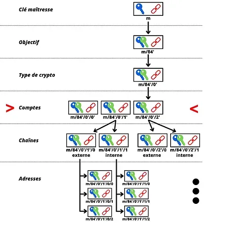

その派生目的は、BIP47を参照して47'（0x8000002F）と記されています。例えば、再利用可能な支払いコードの派生パスは以下のようになります：

> m/47'/0'/0'/

支払いコードがどのように見えるかの例を示すと、こちらが私のものです：
PM8TJSBiQmNQDwTogMAbyqJe2PE2kQXjtgh88MRTxsrnHC8zpEtJ8j7Aj628oUFk8X6P5rJ7P5qDudE4Hwq9JXSRzGcZJbdJAjM9oVQ1UKU5j2nr7VR5
これはQRコードとしてもエンコードでき、コミュニケーションを容易にします：

PayNym Botsについては、Twitterで見かけるあのロボットたちは、Samourai Walletによって作成された支払いコードの視覚的表現に過ぎません。これらはハッシュ関数を使用して生成され、ほぼユニークなものになります。こちらが私のものとその識別子です：

> +throbbingpond8B1

これらのBotsには実際の技術的な利用価値はありません。代わりに、仮想的な視覚的アイデンティティを作成することで、ユーザー間のインタラクションを容易にします。

ユーザーにとって、PayNym実装を使用してBIP47支払いを行うプロセスは非常にシンプルです。AliceがBobに支払いを送りたいと想像してみましょう：

1. Bobは彼のQRコード、または直接彼の再利用可能な支払いコードを共有します。彼はそれを自分のウェブサイト、様々な公開されたソーシャルネットワーク上に配置するか、別の通信手段を通じてAliceに送ることができます。
2. Aliceは彼女のSamouraiまたはSparrowソフトウェアを開き、Bobの支払いコードをスキャンまたは貼り付けます。
3. Aliceは彼女のPayNymをBobのものとリンクします（英語では"Follow"）。この操作はオフチェーンで行われ、完全に無料です。

4. Aliceは彼女のPayNymをBobのものと接続します（英語では"Connect"）。この操作は"オンチェーン"で行われます。Aliceはトランザクションのマイニング手数料と、Samourai上でのサービスに対して15,000 satsの固定料金を支払う必要があります。このサービス料はSparrowでは免除されます。このステップは、通知トランザクションと呼ばれます。

5. 通知トランザクションが確認されると、AliceはBobへのBIP47支払いトランザクションを作成できます。彼女のウォレットは自動的に新しい空白の受取アドレスを生成し、そのプライベートキーはBobのみが持っています。

通知トランザクションを実行すること、つまり彼女のPayNymを接続することは、BIP47支払いを行うための必須の前提条件です。しかし、これが完了すると、送信者は新しい通知トランザクションを実行する必要なく、受信者に対して複数の支払い（正確には2^32回）を行うことができます。

PayNymsをリンクする2つの異なる操作があることに気づいたかもしれません："follow"と"connect"です。接続操作（"connecter"）はBIP47通知トランザクションに対応しており、これは単にOP_RETURN出力を通じて特定の情報が伝達されるビットコイントランザクションです。したがって、新しい空白の受取アドレスを生成するために必要な共有秘密を生成するための2ユーザー間の暗号化された通信を確立するのに役立ちます。

一方、リンク操作（"follow"または"relier"）は、特にSamouraiの協力トランザクションツール（StowawayやStonewallX2）を使用するために、オフチェーンで暗号化された通信を確立するのに役立ちます。この操作はPayNymに特有であり、BIP47には記述されていません。
- PayNymsを接続するにはコストがかかります。これには、接続を開始するための通知トランザクションを実行することが含まれます。コストは、任意のサービス料、トランザクションのマイニング料、およびトンネル開設の通知として受信者の通知アドレスに送られる546 satsから構成されます。この操作はBIP47に関連しています。完了すると、送信者は受信者に対して複数のBIP47支払いを行うことができます。
PayNymsを接続するには、それらがすでにリンクされている必要があります。

## チュートリアル: PayNymの使用。

理論を見た今、実践を一緒に学びましょう。以下のチュートリアルのアイデアは、私のSparrowウォレット上のPayNymを私のSamouraiウォレット上のPayNymとリンクすることです。最初のチュートリアルでは、SamouraiからSparrowへの再利用可能な支払いコードを使用してトランザクションを行う方法を示し、2番目のチュートリアルでは、SparrowからSamouraiへの同じメカニズムを説明します。

> これらのチュートリアルはTestnet上で実行しました。これらは実際のビットコインではありません。

### Samourai WalletでBIP47トランザクションを構築する。

始めるには、明らかにSamourai Walletアプリケーションが必要です。Google Play Storeから直接ダウンロードするか、公式Samouraiウェブサイトで利用可能なAPKファイルを使用してダウンロードできます。

ウォレットが初期化されたら、まだ行っていない場合は、右下のプラス(+)をクリックし、次に「PayNym」をクリックしてPayNymをリクエストします。

BIP47支払いを行う最初のステップは、受信者から再利用可能な支払いコードを取得することです。その後、彼らと接続し、次にリンクすることができます：

通知トランザクションが確認されると、受信者に複数の支払いを送ることができます。各トランザクションは、受信者が鍵を持っている新しい空白のアドレスで自動的に行われます。受信者は何もする必要はありません、すべては私の側で計算されます。

Samourai WalletでBIP47トランザクションを行う方法は次のとおりです：

### Sparrow WalletでBIP47トランザクションを構築する。

Samouraiと同様に、明らかにSparrowソフトウェアを持っている必要があります。これはコンピューターで利用可能です。[公式ウェブサイト](https://sparrowwallet.com/)からダウンロードできます。

マシンにインストールする前に、ダウンロードしたソフトウェアの開発者の署名と整合性を確認してください。

ウォレットを作成し、「ツール」メニューの上部バーから「Show PayNym」をクリックしてPayNymをリクエストします：

次に、受信者のPayNymとあなたのPayNymをリンクして接続する必要があります。これを行うには、「Find Contact」ウィンドウに受信者の再利用可能な支払いコードを入力し、フォローした後、「Link Contact」をクリックして通知トランザクションを実行します：

通知トランザクションが確認されると、再利用可能な支払いコードに支払いを送ることができます。やり方はこちらです：

PayNymのBIP47実装の実践的な側面を学ぶことができたので、これらのメカニズムがどのように機能し、どのような暗号学的方法が使用されているかを見てみましょう。

## BIP47の内部構造。

BIP47のメカニズムを研究するには、階層的決定論的(HD)ウォレットの構造、子キーペアの導出メカニズム、および楕円曲線暗号学の原則を理解することが不可欠です。幸いなことに、この部分を理解するために必要なすべての情報は私のブログで見つけることができます：
### 再利用可能な支払いコード

この論文の第二部で説明されているように、再利用可能な支払いコードはHDウォレットの深さ3に位置しています。その配置と構造、そして役割において、xpubとある程度比較できます。

以下は、80バイトの支払いコードを構成する異なる部分です：

- バイト0：バージョン。BIP47の最初のバージョンを使用している場合、このバイトは0x01と等しくなります。

- バイト1：ビットフィールド。このスペースは、特定の使用の場合に追加の指示を提供するために予約されています。単にPayNymを使用している場合、このバイトは0x00と等しくなります。

- バイト2：yのパリティ。このバイトは、公開キーのy座標の値のパリティ（偶数または奇数）に応じて0x02または0x03を示します。この慣習についての詳細は、この記事の「アドレス導出」セクションのステップ1をご覧ください。

- バイト3からバイト34まで：xの値。これらのバイトは、公開キーのx座標を示します。xとyのパリティの連結により、私たちの圧縮公開キーが得られます。

- バイト35からバイト66まで：チェーンコード。このスペースは、前述の公開キーに関連するチェーンコード用に予約されています。

- バイト67からバイト79まで：パディング。このスペースは、将来の開発の可能性に備えて予約されています。バージョン1では、OP_RETURN出力のデータサイズである80バイトに達するために、単にゼロで埋めます。

ここに、前のセクションで紹介した私の再利用可能な支払いコードの16進数表現があります。上記のバイトに対応する色で示されています：
次に、私たちは支払いコードであることをすぐに識別できるように、プレフィックスバイト「P」を追加する必要があります。このバイトは0x47です。

> 0x47010002a0716529bae6b36c5c9aa518a52f9c828b46ad8d907747f0d09dcd4d9a39e97c3c5f37c470c390d842f364086362f6122f412e2b0c7e7fc6e32287e364a7a36a00000000000000000000000000

最後に、この支払いコードのチェックサムをHASH256を使用して計算します。これはSHA256関数での二重ハッシュを意味します。このダイジェストの最初の4バイトを取得し、最後に（ピンクで）連結します。

> 0x47010002a0716529bae6b36c5c9aa518a52f9c828b46ad8d907747f0d09dcd4d9a39e97c3c5f37c470c390d842f364086362f6122f412e2b0c7e7fc6e32287e364a7a36a00000000000000000000000000567080c4

支払いコードが準備できました。これをBase 58に変換するだけです。
この構造は、「xpub」というタイプの拡張公開鍵の構造に非常に似ています。

この支払いコードを取得するプロセス中に、圧縮公開鍵とチェーンコードを使用しました。これら二つの要素は、ウォレットシードから決定論的かつ階層的に導出された結果です。導出パスは次の通りです：m/47'/0'/0'/
具体的には、再利用可能な支払いコードの公開鍵とチェーンコードを取得するために、シードからマスタープライベートキーを計算し、その後インデックス47 + 2^31（ハード化導出）で子ペアを導出します。次に、インデックス2^31（ハード化導出）でさらに二つの子ペアを導出します。

> 階層的決定論的ビットコインウォレット内で子キーペアを導出する方法についてもっと学びたい場合は、CRYPTO301を受講することをお勧めします。

### 暗号化方法：楕円曲線ディフィー・ヘルマン鍵交換（ECDH）

BIP47の核心で使用されている暗号化方法はECDH（Elliptic-Curve Diffie-Hellman、楕円曲線ディフィー・ヘルマン）です。このプロトコルは、クラシックなディフィー・ヘルマン鍵交換のバリアントです。

ディフィー・ヘルマンの最初のバージョンは、1976年に発表された鍵合意プロトコルで、公開鍵と秘密鍵のペアを持つ二つの当事者が、安全でない通信チャネルを介して情報を交換することで、共有秘密を決定できるようにします。

この共有秘密（赤い鍵）は、その後の他のタスクに使用できます。通常、この共有秘密は、安全でないネットワーク上での通信の暗号化および復号化に使用されます：

この交換を達成するために、ディフィー・ヘルマンは共有秘密を計算するためにモジュラー算術を使用します。ここでは、その仕組みの簡略化した説明をします：

- アリスとボブは共通の色、この場合は黄色に同意します。この色は誰にでも知られています。それは公開情報です。

- アリスは秘密の色、この場合は赤を選びます。彼女は二つの色を混ぜ合わせ、結果としてオレンジが得られます。

- ボブは秘密の色、この場合はティールブルーを選びます。彼は二つの色を混ぜ合わせ、結果としてスカイブルーが得られます。

- アリスとボブは、それぞれが得た色、オレンジとスカイブルーを交換できます。この交換は安全でないネットワーク上で行われ、攻撃者によって観察される可能性があります。

- アリスはボブから受け取ったスカイブルーの色を自分の秘密の色（赤）と混ぜ合わせます。彼女は茶色を得ます。

- ボブはアリスから受け取ったオレンジの色を自分の秘密の色（ティールブルー）と混ぜ合わせます。彼もまた茶色を得ます。

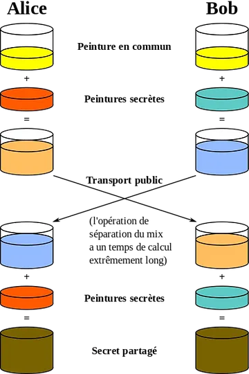

> クレジット：オリジナルアイデア：A.J. Han Vinckベクターバージョン：Flugaal翻訳：Dereckson、パブリックドメイン、ウィキメディア・コモンズ経由。https://commons.wikimedia.org/wiki/File:Diffie-Hellman_Key_Exchange_(fr).svg

この簡略化では、茶色はアリスとボブの間の秘密共有を表します。実際には、攻撃者がオレンジとスカイブルーの色を分離してアリスまたはボブの秘密の色を取り出すことは不可能であると想像する必要があります。
さて、その実際の機能について学んでみましょう。一見すると、Diffie-Hellmanは理解するのが複雑に思えるかもしれません。実際には、その運用原理はほとんど子供じみています。そのメカニズムを詳しく説明する前に、私たちが必要とする（そして偶然にも、多くの他の暗号化方法でも使用されている）2つの数学的概念を簡単に思い出させてください。

1. 素数は、1とその数自身のみが約数である自然数です。例えば、数の7は素数です。なぜなら、1と7（自身）によってのみ割ることができるからです。一方、数の8は素数ではありません。なぜなら、1、2、4、8によって割ることができるからです。したがって、2つではなく、4つの全ての正の約数を持っています。

2. 「モジュロ」（"mod"または"%"と表記）は、2つの整数で、最初の数を2番目の数でユークリッド除算した余りを返す数学的操作です。例えば、16 mod 5は1に等しいです。

AliceとBobの間のDiffie-Hellman鍵交換は、以下のように機能します：

- AliceとBobは、2つの共通の数値：pとgを決定します。pは素数です。この数pが大きければ大きいほど、Diffie-Hellmanはより安全になります。gはpの原始根です。これら2つの数値は、安全でないネットワーク上で平文で通信することができます。これらは上記の簡略化での黄色に相当します。AliceとBobは、pとgの値が正確に同じである必要があります。

- パラメータが選択されると、AliceとBobはそれぞれ自分自身で秘密のランダム数を決定します。Aliceによって得られたランダム数はa（赤色に相当）と名付けられ、Bobによって得られたランダム数はb（ティール色に相当）と名付けられます。これら2つの数値は秘密のままでなければなりません。

- これらの数値aとbを交換する代わりに、各当事者は次のようにしてA（大文字）とB（大文字）を計算します：

> Aはgをa乗したものをpでモジュロしたものに等しい：
> A = g^a % p

> Bはgをb乗したものをpでモジュロしたものに等しい：
> B = g^b % p

- これらの数値A（オレンジ色に相当）とB（スカイブルー色に相当）は、2つの当事者間で交換されます。交換は、安全でないネットワーク上で平文で行うことができます。

- Aliceは、今Bを知っているので、次のようにしてzの値を計算します：

> zはBをa乗したものをpでモジュロしたものに等しい：
> z = B^a % p

- リマインダーとして、B = g^b % p。したがって：

  > z = B^a % p
  > z = (g^b)^a % p
  >
  > べき乗の規則によると：
  >
  > (x^n)^m = x^nm
  >
  > したがって：
  >
  > z = g^ba % p

- 今、Aを知っているBobも、次のようにしてzの値を計算します：

> zはAをb乗したものをpでモジュロしたものに等しい：
>
> z = A^b % p
>
> したがって：
>
> z = (g^a)^b % p
> z = g^ab % p
> z = g^ba % p
モジュロ演算子の分配性のおかげで、アリスとボブはzの値を正確に同じものとして見つけ出します。この数値は、前述の説明で茶色に相当する、彼らの共有された秘密を表します。彼らはこの共有された秘密を使って、安全でないネットワーク上での彼らの間の通信を暗号化することができます。

攻撃者がp、g、A、Bを持っていても、a、b、またはzを計算することはできません。この操作を行うには、指数関数の逆転を行う必要がありますが、有限体を扱っているため、一つ一つの可能性を試す以外に不可能です。これは、巡回有限群における指数関数の逆数である離散対数を計算することに相当します。

したがって、a、b、pに十分に大きな値を選ぶ限り、Diffie-Hellmanは安全です。通常、2,048ビット（10進数で600桁の数値）のパラメーターでは、aとbのすべての可能性をテストすることは非現実的です。現在、このサイズの数値では、アルゴリズムは安全と考えられています。

これがまさにDiffie-Hellmanプロトコルの主な欠点があるところです。安全であるためには、アルゴリズムは大きな数値を使用する必要があります。その結果、現在ではECDHアルゴリズムが好まれています。これは、代数曲線、特に楕円曲線を使用するDiffie-Hellmanの変種です。これにより、同等の安全性を維持しながらはるかに小さな数値で作業でき、計算およびストレージリソースの要件を削減できます。

アルゴリズムの一般原則は同じままです。しかし、モジュロ演算子の分配性に依存する代わりに、楕円曲線上の群法則、特にこの法則の結合性を使用します。楕円曲線上の秘密鍵と公開鍵の仕組みについて知識がない場合、この記事の最初の6部分でこの方法の基本を説明します。

大まかに要約すると、秘密鍵は1からn-1（nは曲線の位数）の間のランダムな数値であり、公開鍵はジェネレーター点からの点の加算と倍加によって秘密鍵によって決定される曲線上の一意の点です。以下のようになります：

> K = k·G

ここで、Kは公開鍵、kは秘密鍵、Gはジェネレーター点です。

この鍵ペアの特性の一つは、kとGを知っていればKを簡単に決定できるが、KとGを知っていてもkを決定することは現在不可能であることです。これは一方向関数です。

言い換えれば、秘密鍵を知っていれば公開鍵を簡単に計算できますが、公開鍵を知っていても秘密鍵を計算することは不可能です。このセキュリティは再び、離散対数を計算することの不可能性に基づいています。

この特性を利用して、Diffie-Hellmanアルゴリズムを適応します。したがって、ECDHの操作原理は以下の通りです：

- アリスとボブは、暗号学的に安全な楕円曲線とそのパラメーターについて合意します。この情報は公開されています。

- アリスはランダムな数値kaを生成し、これが彼女の秘密鍵になります。この秘密鍵は秘密のままでなければなりません。彼女は選択した楕円曲線上で点を加算して倍加することにより、彼女の公開鍵Kaを決定します。

> Ka = ka·G

- ボブもランダムな数値kbを生成し、これが彼の秘密鍵になります。彼は関連する公開鍵Kbを計算します。

> Kb = kb·G
- アリスとボブは、安全でない公開ネットワーク上で、それぞれの公開鍵KaとKbを交換します。
- アリスは、自分の秘密鍵kaをボブの公開鍵Kbに適用することで、曲線上の点(x, y)を計算します。

> (x, y) = ka・Kb

- ボブは、自分の秘密鍵kbをアリスの公開鍵Kaに適用することで、曲線上の点(x, y)を計算します。

> (x, y) = kb・Ka

- アリスとボブは楕円曲線上で同じ点を得ます。共有される秘密は、この点のx座標になります。

彼らが同じ共有秘密を得る理由は以下の通りです：

> (x, y) = ka・Kb = ka・kb・G = kb・ka・G = kb・Ka

安全でない公開ネットワークを観察する潜在的な攻撃者は、各当事者の公開鍵と選択された曲線のパラメーターのみを得ることができます。先に説明したように、これら2つの情報だけでは秘密鍵を特定することはできないため、攻撃者は秘密にアクセスすることができません。
ECDHは鍵交換を可能にするアルゴリズムです。これは、プロトコルを定義するために他の暗号化方法と一緒によく使用されます。例えば、ECDHはTLS（Transport Layer Security、インターネットトランスポート層のための暗号化および認証プロトコル）の核心で使用されます。TLSは鍵交換にECDHEを使用します。これはECDHの変種で、鍵が一時的であるために持続的な機密性を提供します。ECDHEに加えて、TLSはECDSAのような認証アルゴリズム、AESのような暗号化アルゴリズム、SHA256のようなハッシュ関数も使用します。

TLSは、"https"の"s"と、インターネットブラウザの左上隅に見える小さな鍵のアイコンを定義し、これにより暗号化された通信が保証されます。したがって、この記事を読んでいる時点でECDHを使用しており、おそらくそれに気づかずに毎日使用しています。

### 通知トランザクション

前のセクションで発見したように、ECDHは楕円曲線上に確立された鍵ペアを含むDiffie-Hellman交換の変種です。幸いなことに、私たちのBitcoinウォレットには、この基準を満たす鍵ペアがたくさんあります！

このアイデアは、両当事者（支払いを送る送信者と支払いを受け取る受取人）の階層的決定論的Bitcoinウォレットからの鍵ペアを使用して、彼らの間で共有され、一時的な秘密を確立することです。BIP47では、代わりにECDHE（Elliptic Curve Diffie-Hellman Ephemeral）が使用されます。

ECDHEは最初にBIP47で、送信者の支払いコードを受取人に伝達するために使用されます。これが有名な通知トランザクションです。BIP47を使用するためには、両当事者が互いの支払いコードを知っている必要があります。これは、一時的な公開鍵を導出し、したがって専用の受取アドレスを得るために必要です。

この交換の前に、送信者は論理的にすでに受取人の支払いコードを知っている可能性があります。例えば、彼らのウェブサイトやソーシャルメディアからオフチェーンで入手できたかもしれません。しかし、受取人は必ずしも送信者の支払いコードを知っているわけではありません。それを彼らに伝達する必要があります。さもなければ、彼らは自分の一時的な鍵を導出することができず、したがって自分のビットコインがどこにあるのか、そして資金を解除する方法を知ることができません。それはオフチェーンで、別の通信システムを使用して彼らに伝達されるかもしれませんが、シードからウォレットが回復された場合に問題が発生する可能性があります。
確かに、私が既に述べたように、BIP47アドレスは受取人のシードから派生するものではありません（そうであれば、直接その人のxpubを使用した方が良いでしょう）。しかし、これらは受取人の支払いコードと送信者の支払いコードの両方を含む計算の結果です。したがって、受取人が自分のウォレットを失い、そのシードから回復しようとした場合、BIP47を介してビットコインを送った人々のすべての支払いコードを必ず持っている必要があります。

この通知トランザクションなしでBIP47を使用することは可能ですが、各ユーザーは仲間の支払いコードのバックアップを取る必要があります。この状況は、これらのバックアップを作成、保存、更新する簡単で強固な方法が見つかるまで、管理不可能なままです。したがって、現状では通知トランザクションがほぼ必須です。

支払いコードのバックアップという役割に加えて、その名前が示すように、このトランザクションは受取人に通知する役割も果たします。トンネルが開かれたことを受取人のクライアントに知らせます。

通知トランザクションの技術的な機能について詳しく説明する前に、プライバシーモデルについて少し話したいと思います。実際、BIP47のプライバシーモデルは、この初期トランザクションを構築する際に取られる特定の予防措置を正当化します。

支払いコード自体はプライバシーに直接リスクをもたらすものではありません。古典的なビットコインモデルとは異なり、公開鍵を匿名に保つことによってユーザーの身元とトランザクション間の情報の流れを断つことができますが、支払いコードは直接身元と関連付けられる可能性があります。これは義務ではありませんが、このリンクは危険ではありません。

実際、支払いコードはBIP47支払いを受け取るために使用されるアドレスを直接導出するものではありません。代わりに、両方の当事者の支払いコードの子キー間でECDHEを適用することによってアドレスが得られます。

したがって、支払いコード単独では、それから導出されるのは通知アドレスのみであるため、直接的なプライバシーリスクをもたらすものではありません。それからいくつかの情報を推測することはできますが、通常、あなたが誰と取引しているかを知ることはできません。

したがって、ユーザーの支払いコード間の厳格な分離を維持することが不可欠です。この点で、コードの初期通信ステップは支払いプライバシーにとって重要な瞬間であり、プロトコルの適切な機能のためには必須です。もし一方の支払いコードが公開で取得できる場合（例えば、ウェブサイトから）、もう一方のコード、つまり送信者のコードは最初のコードと関連付けられるべきではありません。

例えば、カナダの平和的な抗議運動にBIP47で寄付をしたいとしましょう：

- この組織はその支払いコードをウェブサイトやソーシャルメディアプラットフォームに直接公開しています。
- このコードはしたがって運動と関連付けられています。

- 私はこの支払いコードを取得します。

- トランザクションを送る前に、彼らが私の個人的な支払いコードを知っていることを確認する必要があります。これは私がソーシャルネットワークからトランザクションを受け取るために使用するため、私の身元とも関連付けられています。

どのようにしてそれを彼らに伝えることができるでしょうか？もし私がそれを彼らに従来の通信手段を使って送るならば、情報が漏れ、私が平和的な運動を支持する人物として特定されるかもしれません。

通知トランザクションは、送信者の支払いコードを秘密裏に伝達する唯一の解決策ではありませんが、現在、複数のセキュリティ層を適用することによってこの役割を完璧に果たしています。

下の図では、赤い線は情報の流れを断つべき瞬間を表し、黒い矢印は外部の観察者によって作られうる否定できないリンクを表しています：

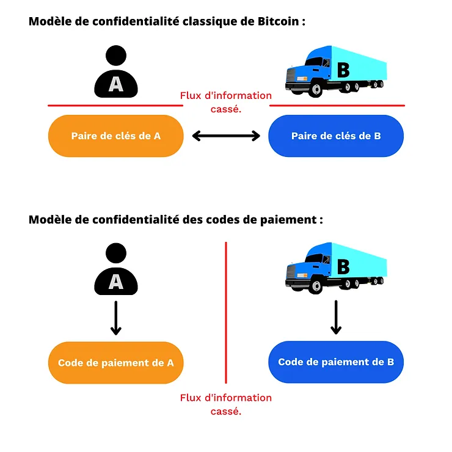
実際には、Bitcoinの古典的なプライバシーモデルでは、特に遠隔取引を行う場合、キーペアとユーザー間の情報の流れを完全に断つことが難しいことがよくあります。例えば、寄付キャンペーンの場合、受取人は自分のウェブサイトやソーシャルメディアプラットフォーム上でアドレスや公開鍵を公開する必要があります。BIP47の適切な使用、つまり通知トランザクションを用いることで、この問題はECDHEと、私たちが学ぶことになる暗号化レイヤーを通じて解決されます。
明らかに、Bitcoinの古典的なプライバシーモデルは、二つの支払いコードの結合から派生した一時的な公開鍵のレベルで依然として観察されます。二つのモデルは相互依存しています。ここで強調したいのは、公開鍵を使用してビットコインを受け取る古典的な使用とは異なり、支払いコードは「ボブがアリスと取引をしている」という情報が別の瞬間に断たれるため、身元に関連付けることができるという点です。支払いコードは支払いアドレスを生成するために使用されますが、ブロックチェーンを観察しても、BIP47支払いトランザクションをそれを作成するために使用された支払いコードと関連付けることは不可能です。

### 通知トランザクションの構築。

さて、この通知トランザクションがどのように機能するか見てみましょう。アリスがBIP47を使用してボブに資金を送りたいと想像してみてください。私の例では、アリスが送信者として、ボブが受取人として行動します。ボブはすでに彼の支払いコードを彼のウェブサイトに公開しているので、アリスはすでにボブの支払いコードを知っています。

1. アリスはECDHで共有秘密を計算します：

- 彼女は、支払いコードとは異なる枝に位置する彼女のHDウォレットからキーペアを選択します。このペアは、アリスの通知アドレスやアリスの身元と簡単に関連付けられるべきではありません（前のセクションを参照）。
- アリスはこのペアから秘密鍵を選択します。これを「a」と呼びます（小文字）。

> a

- アリスはボブの通知アドレスに関連付けられた公開鍵を取得します。この鍵はボブの支払いコードから派生した最初の子（インデックス0）です。この公開鍵を「B」と呼びます（大文字）。この公開鍵に関連付けられた秘密鍵は「b」と呼ばれます（小文字）。"B"は、楕円曲線上での点の加算と倍加を「G」（生成点）と「b」（秘密鍵）から決定されます。

> B = b·G

- アリスは楕円曲線上の秘密点「S」（大文字）を、彼女の秘密鍵「a」をボブの公開鍵「B」に適用することにより、点の加算と倍加を行い計算します。

> S = a·B

- アリスは彼女の支払いコードを暗号化するために使用されるブラインディングファクター「f」を計算します。これを行うために、彼女はHMAC-SHA512関数を使用して擬似乱数を生成します。この関数への第二の入力として、彼女はボブだけが取得できる値を使用します：(x)、これは以前に計算された秘密点のx座標です。最初の入力は(o)で、これはこのトランザクションの入力として消費されるUTXO（アウトポイント）です。

> f = HMAC-SHA512(o, x)

2. アリスは彼女の個人的な支払いコードを2進数（バイナリ）に変換します。

3. 彼女はこのブラインディングファクターをキーとして使用し、彼女の支払いコードのペイロードに対して対称暗号化を実行します。使用される暗号化アルゴリズムは単純にXORです。実行される操作は、ヴァーナム暗号、別名「ワンタイムパッド」と同様です：

- アリスはまず、彼女のブラインディングファクターを二つの部分に分割します：最初の32バイトを「f1」と呼び、残りの32バイトを「f2」と呼びます。したがって、私たちは持っています：

> f = f1 || f2
アリスは、彼女の支払いコードの公開鍵（x）のx座標の暗号文（x'）を計算し、別途、彼女のチェーンコード（c）の暗号文（c'）を計算します。"f1"と"f2"は暗号化キーとして機能し、XOR演算が使用されます。
> x' = x XOR f1
>
> c' = c XOR f2

アリスは、彼女の支払いコード内の公開鍵の横座標（x）とチェーンコード（c）の実際の値を、暗号化された値（x'）と（c'）に置き換えます。

この通知トランザクションの技術的な説明を続ける前に、XOR演算について少し話しましょう。XORは、ブール代数に基づくビット単位の論理演算子です。2つのビットオペランドが与えられた場合、対応するビットが異なると1を返し、対応するビットが等しい場合は0を返します。ここに、オペランドDとEの値に基づいたXORの真理値表があります：

| D   | E   | D XOR E |
| --- | --- | ------- |
| 0   | 0   | 0       |
| 0   | 1   | 1       |
| 1   | 0   | 1       |
| 1   | 1   | 0       |

例えば：

> 0110 XOR 1110 = 1000

または：

> 010011 XOR 110110 = 100101

ECDHでは、XORを暗号化レイヤーとして使用することは特に一貫性があります。この演算子のおかげで、暗号化は対称的です。これにより、受信者は暗号化に使用されたのと同じキーで支払いコードを復号化できます。暗号化および復号化キーは、ECDHを使用して共有秘密から計算されます。

この対称性は、XOR演算子の交換法則と結合法則の特性によって可能になります：

- その他の特性：
  -> D ⊕ D = 0
  -> D ⊕ 0 = D

- 交換法則：
  D ⊕ E = E ⊕ D

- 結合法則：
  D ⊕ (E ⊕ Z) = (D ⊕ E) ⊕ Z = D ⊕ E ⊕ Z

- 対称性：
  もし：D ⊕ E = L
  ならば：D ⊕ L = D ⊕ (D ⊕ E) = D ⊕ D ⊕ E = 0 ⊕ E = E
  -> D ⊕ L = E
  次に、この暗号化方法はヴァーナム暗号（ワンタイムパッド）に非常に似ています。これは、現在までに無条件（または絶対的な）セキュリティを持つと知られている唯一の暗号化アルゴリズムです。ヴァーナム暗号がこの特性を持つためには、暗号化キーは完全にランダムでなければならず、メッセージと同じサイズであり、一度だけ使用されなければなりません。ここで使用される暗号化方法では、キーは確かにメッセージと同じサイズであり、公開鍵のx座標と支払いコードチェーンコードの連結と同じサイズのブラインディングファクターです。この暗号化キーは確かに一度だけ使用されます。しかし、このキーはHMACから派生しているため、完全なランダムソースからではありません。それはむしろ擬似ランダムです。したがって、これはヴァーナム暗号ではありませんが、方法は類似しています。

通知トランザクションの構築に戻りましょう：

4. アリスは現在、暗号化されたペイロードを含む彼女の支払いコードを持っています。彼女は、入力として彼女の公開鍵「A」、ボブの通知アドレスへの出力、および暗号化されたペイロードを含む彼女の支払いコードで構成されるOP_RETURN出力を含むトランザクションを構築してブロードキャストします。このトランザクションは通知トランザクションです。
OP_RETURNは、ビットコインのトランザクション出力を無効とマークするスクリプトであるオペコードです。現在では、ビットコインブロックチェーン上に情報を放送またはアンカーするために使用されています。チェーン上に記録され、したがって他のすべてのユーザーに見える80バイトのデータを格納できます。

前のセクションで見たように、Diffie-Hellmanは、攻撃者によって観察される可能性のある安全でないネットワーク上で通信する2人のユーザー間で共有秘密を生成するために使用されます。BIP47では、本質的に多くの攻撃者によって観察される透明な通信ネットワークであるビットコインネットワーク上で通信するためにECDHが使用されます。楕円曲線上でのDiffie-Hellman鍵交換を通じて計算された共有秘密は、次に送信される秘密情報を暗号化するために使用されます：送信者（アリス）の支払いコードです。

以下は、私たちが説明したことを示すBIP47から抜粋した図です：

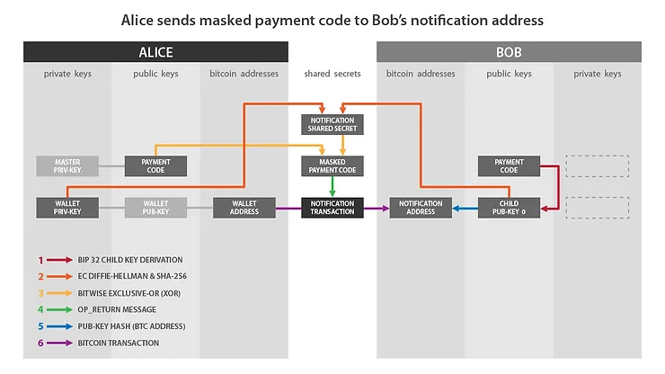

クレジット：階層的決定論的ウォレットのための再利用可能な支払いコード、Justus Ranvier。https://github.com/bitcoin/bips/blob/master/bip-0047.mediawiki

もし私が先ほど説明したこととこの図を照らし合わせると：

- アリス側の「Wallet Priv-Key」は：aに対応します。

- ボブ側の「Child Pub-Key 0」は：Bに対応します。
- 「Notification Shared Secret」は：fに対応します。
- 「Masked Payment Code」は、暗号化されたペイロードを持つ、つまり暗号化された支払いコードに対応します：x' と c'。

- 「Notification Transaction」は、OP_RETURNを含むトランザクションです。

通知トランザクションを実行するために私たちが通過したステップを振り返りましょう：

- アリスはボブの支払いコードと通知アドレスを取得します。

- アリスは、対応するキーペアを持つ彼女のHDウォレットに属するUTXOを選択します。

- 彼女はECDHを使用して楕円曲線上の秘密点を計算します。

- 彼女はこの秘密点を使用してHMACを計算します、これはブラインディングファクターです。

- 彼女はこのブラインディングファクターを使用して、彼女の個人的な支払いコードのペイロードを暗号化します。

- 彼女はOP_RETURNトランザクション出力を使用して、マスクされた支払いコードをボブに転送します。

特にOP_RETURNの使用方法をよりよく理解するために、実際の通知トランザクションを一緒に見てみましょう。私はこのタイプのトランザクションをTestnetで実行しました、ここをクリックすると見つけることができます：

https://mempool.space/fr/testnet/tx/0e2e4695a3c49272ef631426a9fd2dae6ec3a469e3a39a3db51aa476cd09de2e

TXID:

> 0e2e4695a3c49272ef631426a9fd2dae6ec3a469e3a39a3db51aa476cd09de2e

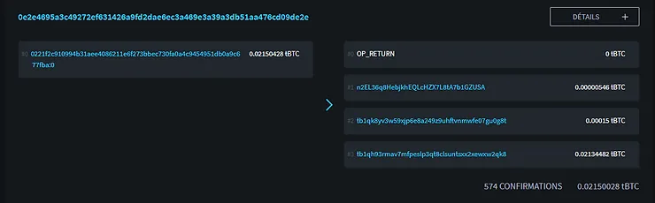

クレジット：https://blockstream.info/

このトランザクションを観察すると、単一の入力と4つの出力があることがすでにわかります：

- 最初の出力は、私のマスクされた支払いコードを含むOP_RETURNです。

- 546 satsの第二の出力は、受取人の通知アドレスを指します。

- 15,000 satsの第三の出力は、このトランザクションを構築するためにSamourai Walletを使用したサービス料として表されます。

- 二百万satsの第四の出力は、私の入力からの残りの差額が私に属する別のアドレスに戻る変更、つまり変更を表します。

明らかに最も興味深いのは、OP_RETURNを使用する出力0です。それが含むものをもう少し詳しく見てみましょう：
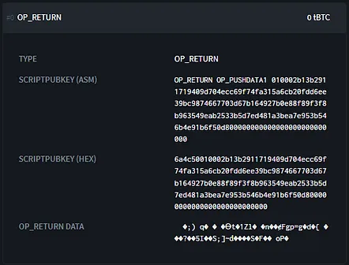
クレジット: https://blockstream.info/

出力の16進数スクリプトを発見しました：

> 6a4c50010002b13b2911719409d704ecc69f74fa315a6cb20fdd6ee39bc9874667703d67b164927b0e88f89f3f8b963549eab2533b5d7ed481a3bea7e953b546b4e91b6f50d800000000000000000000000000

このスクリプトでは、いくつかの部分に分けることができます：
オペコードの中で、0x6aはOP_RETURNを、0x4cはOP_PUSHDATA1を指すことが認識できます。このオペコードに続くバイトは、その後に続くペイロードのサイズを示しています。それは0x50、つまり80バイトを示しています。

次に、暗号化されたペイロードを含む支払いコードが続きます。

こちらがこのトランザクションで使用した私の支払いコードです：

> ベース58で：
>
> PM8TJQCyt6ovbozreUCBrfKqmSVmTzJ5vjqse58LnBzKFFZTwny3KfCDdwTqAEYVasn11tTMPc2FJsFygFd3YzsHvwNXLEQNADgxeGnMK8Ugmin62TZU
>
> ベース16（HEX）で：
> 4701000277507c9c17a89cfca2d3af554745d6c2db0e7f6b2721a3941a504933103cc42add94881210d6e752a9abc8a9fa0070e85184993c4f643f1121dd807dd556d1dc000000000000000000000000008604e4db

OP_RETURNと私の支払いコードを比較すると、HRP（茶色で）とチェックサム（ピンクで）が伝達されていないことがわかります。これは、この情報が人間向けであるため、通常のことです。
次に、バージョン（0x01）、ビットフィールド（0x00）、公開鍵のパリティ（0x02）を（緑で）認識できます。そして、支払いコードのペイロードの最後に、合計80バイトに達するためのパディングを可能にする黒い空バイト（0x00）があります。このメタデータはすべて平文（暗号化されていない）で伝達されます。
最後に、公開鍵のx座標（青で）とチェーンコード（赤で）が暗号化されていることが観察できます。これが支払いコードのペイロードを構成します。

### 通知トランザクションの受信

アリスがボブに通知トランザクションを送信した今、ボブがそれをどのように解釈するか見てみましょう。

思い出しておくべきこととして、ボブはアリスの支払いコードにアクセスできる必要があります。この情報がなければ、次のセクションで見るように、アリスが作成したキーペアを導出することができず、したがってBIP47で受け取ったビットコインにアクセスすることができません。現時点では、アリスの支払いコードペイロードは暗号化されています。ボブがそれをどのように復号するか見てみましょう。

1. ボブは、彼の通知アドレスを持つ出力を作成するトランザクションを監視します。

2. トランザクションが彼の通知アドレスに出力を持つ場合、ボブはそれがBIP47標準に準拠したOP_RETURN出力を含んでいるかどうかを分析します。
3. OP_RETURNペイロードの最初のバイトが0x01である場合、BobはECDHを使用して共有シークレットを探し始めます：
- トランザクション入力にある公開鍵をBobが選択します。つまり、Aliceの公開鍵「A」です：

> A = a·G

- Bobは、自分の個人通知アドレスに関連付けられた秘密鍵「b」を選択します：

> b

- Bobは、楕円曲線上で点を加算および倍加することにより、Aliceの公開鍵「A」に自分の秘密鍵「b」を適用することで、秘密点「S」（ECDH共有シークレット）を計算します：

> S = b·A

- Bobは、Aliceの支払いコードペイロードを復号化するために使用するブラインディングファクター「f」を決定します。Aliceが以前に計算したのと同じ方法で、Bobは秘密点「S」のx座標の値と、この通知トランザクションで入力として消費されたUTXOに対してHMAC-SHA512を適用することにより「f」を見つけます：

> f = HMAC-SHA512(o, x)

4. Bobは、通知トランザクションのOP_RETURNにあるデータを支払いコードとして解釈します。彼は単にブラインディングファクター「f」を使用して、この潜在的な支払いコードのペイロードを復号化します。

- Bobはブラインディングファクター「f」を2つの部分に分けます：「f」の最初の32バイトが「f1」であり、最後の32バイトが「f2」になります。
- BobはAliceの支払いコード公開鍵の暗号化されたx座標値（x'）を復号化します：

> x = x' XOR f1

- BobはAliceの支払いコードの暗号化されたチェーンコード値（c'）を復号化します：

> c = c' XOR f2

5. BobはAliceの支払いコード公開鍵の値がsecp256k1グループの一部であるかどうかを確認します。もしそうなら、彼はそれを有効な支払いコードとして解釈します。そうでなければ、彼はトランザクションを無視します。

これでBobはAliceの支払いコードを知っており、彼女はこのような通知トランザクションを再び実行することなく、最大2^32回の支払いを彼に送ることができます。

これはなぜ機能するのでしょうか？ BobがAliceと同じブラインディングファクターをどのようにして決定し、彼女の支払いコードを復号化できるのでしょうか？ ECDHプロセスについて、今説明した内容に基づいてもう少し詳しく見てみましょう。

まず、私たちは対称暗号化に取り組んでいます。これは、暗号化キーと復号化キーが同じ値であることを意味します。この場合、通知トランザクションのキーはブラインディングファクター（f = f1 || f2）です。AliceとBobは、攻撃者がそれを傍受して秘密情報を復号化できるように、直接伝達せずにfの同じ値を取得する必要があります。

このブラインディングファクターは、秘密点のx座標とトランザクション入力で消費されたUTXOの2つの値にHMAC-SHA512を適用することによって得られます。したがって、BobはAliceの支払いコードペイロードを復号化するために、これら2つの情報を持っている必要があります。

入力UTXOについては、Bobは単に通知トランザクションを観察することによってそれを取得できます。秘密点については、BobはECDHを使用する必要があります。

Diffie-Hellmanのセクションで見たように、それぞれの公開鍵を交換し、秘密の秘密鍵を相手の公開鍵に密かに適用することによって、AliceとBobは楕円曲線上の特定の秘密点を見つけることができます。通知トランザクションはこのメカニズムに依存しています：

> Bobのキーペア：
>
> B = b·G
>
> Aliceのキーペア：
>
> A = a·G
>
> 秘密点S (x,y)について：
>
> S = a·B = a·b·G = b·a·G = b·A

ボブがアリスの支払いコードを知ることになったので、彼は彼女のBIP47支払いを検出し、受け取ったビットコインをブロックするプライベートキーを導出することができます。

クレジット：階層的決定論的ウォレットのための再利用可能な支払いコード、Justus Ranvier。https://github.com/bitcoin/bips/blob/master/bip-0047.mediawiki

先ほど説明した内容とこの図を照らし合わせると：

- アリス側の「Wallet Pub-Key」は：Aに対応します。

- ボブ側の「Child Priv-Key 0」は：bに対応します。

- 「Notification Shared Secret」は：fに対応します。

- 「Masked Payment Code」は、暗号化されたペイロードを含むアリスのマスクされた支払いコード、つまりx'とc'に対応します。

- 「Notification Transaction」は、OP_RETURNを含むトランザクションです。

通知トランザクションを受け取り、解釈する手順をまとめましょう：

- ボブは彼の通知アドレスへのトランザクション出力を監視します。

- 一つを検出すると、OP_RETURNに含まれる情報を取得します。

- ボブは入力公開キーを選択し、ECDHを使用して秘密点を計算します。

- この秘密点を使用してHMACを計算し、これがブラインディングファクターになります。

- 彼はこのブラインディングファクターを使用して、OP_RETURNに含まれるアリスの支払いコードペイロードを復号化します。

### BIP47支払いトランザクション。

BIP47での支払いプロセスを今度は見ていきましょう。現在の状況を思い出しておくことが重要です：

- アリスはボブの支払いコードを彼のウェブサイトから単純に取得し、知っています。

- ボブは通知トランザクションのおかげでアリスの支払いコードを知っています。

- アリスはボブに初回の支払いを行います。同じ方法で多くの支払いを行うことができます。

このプロセスを説明する前に、現在作業しているインデックスについて思い出させておくことが重要です：

支払いコードの導出パスは次のように記述されます：m/47'/0'/0'/。

次の深さでは、インデックスが次のように分配されます：

- 最初の通常の（非ハード化された）子ペアは、前のセクションで議論した通知アドレスを生成するために使用されます：m/47'/0'/0'/0/。

- 通常の子キーペアはECDH内でBIP47支払い受信アドレスを生成するために使用されます、このセクションで見るように：m/47'/0'/0'/ から 0 まで 2,147,483,647/。

- ハード化された子キーペアは一時的な支払いコードです：m/47'/0'/0'/ から 0' まで 2,147,483,647'/。
  アリスがボブに支払いを送りたいたびに、彼女は再びECDHプロトコルのおかげで新しいユニークな空のアドレスを導出します：
- アリスは彼女の個人的な再利用可能な支払いコードから導出された最初のプライベートキーを選択します：

> a

- アリスはボブの支払いコードから導出された最初の未使用の公開キーを選択します。この公開キーを「B」と呼びます。これはボブだけが知っているプライベートキー「b」と関連付けられています。

> B = b·G

- アリスは楕円曲線上で点を加算して倍加することにより、秘密点「S」を計算します。これを行うために、彼女は自分のプライベートキー「a」をボブの公開キー「B」に適用します：

> S = a·B

- この秘密点から、アリスは共有秘密「s」（小文字）を計算します。これを行うために、彼女は秘密点「S」のx座標、つまり「Sx」と呼ばれる値を選択し、この値をSHA256ハッシュ関数に渡します。
s = SHA256(Sx)
信用せず、確認せよ！ハッシュ関数の基本原理を理解したい場合、この記事で必要な情報を見つけることができます。そして、NISTを信用しない場合（それは正しい判断です）、SHA256がどのように機能するかを詳細に理解したい場合、私はこの記事でフランス語で全てを説明します。

- アリスはこの共有秘密"s"を使用して、ビットコインの支払い受け取りアドレスを計算します。まず、彼女は"s"がsecp256k1曲線の順序内にあるかを確認します。そうでない場合、彼女は別の共有秘密を導出するためにボブの公開鍵のインデックスを増やします。

- 次に、彼女は楕円曲線上で点"B"と"s·G"を加算することによって公開鍵"K0"を計算します。言い換えると、アリスはボブの支払いコードから導出された公開鍵"B"に、共有秘密"s"からsecp256k1曲線の生成点"G"を使用して楕円曲線上で加算および倍加された別の点を加えます。この新しい点は公開鍵を表し、私たちはそれを"K0"と呼びます：

> K0 = B + s·G

- この公開鍵"K0"を使って、アリスは標準的な方法で（例えば、Bech32のSegWit V0で）空白の受け取りアドレスを導出できます。

アリスがこの受け取りアドレス"K0"を持っていれば、彼女は自分のHDウォレットの別のブランチに属するUTXOを選択し、それをボブの"K0"アドレスに送金する標準的なビットコイントランザクションを構築できます。

クレジット：階層的決定論的ウォレットのための再利用可能な支払いコード、ジャスティス・ランビエ。https://github.com/bitcoin/bips/blob/master/bip-0047.mediawiki
先ほど説明した図と照らし合わせると：

- アリス側の"Child Priv-Key"は：aに対応します。
- ボブ側の"Child Pub-Key 0"は：Bに対応します。
- "Payment Secret 0"は：sに対応します。
- "Payment Pub-Key 0"は：K0に対応します。

BIP47支払いを送るために私たちが一緒に通過した手順を要約しましょう：

- アリスは個人の支払いコードから最初に導出された子プライベートキーを選択します。
- 彼女はECDHを使用して、ボブの支払いコードから最初に未使用の導出された子公開鍵を使って楕円曲線上の秘密点を計算します。
- 彼女はこの秘密点を使用してSHA256で共有秘密を計算します。
- 彼女はこの共有秘密を使用して楕円曲線上の新しい秘密点を計算します。
- 彼女はこの新しい秘密点をボブの公開鍵に加えます。
- 彼女は新しい一時的な公開鍵を得ますが、その秘密鍵はボブだけが持っています。
- アリスは導出された一時的な受け取りアドレスに通常のトランザクションをボブに送ることができます。

彼女が2回目の支払いを行いたい場合、上記の手順を繰り返しますが、ボブの支払いコードから2番目に導出された公開鍵を選択します。つまり、次に未使用の鍵です。そうすると、ボブに属する2番目の受け取りアドレス"K1"を持つことになります。

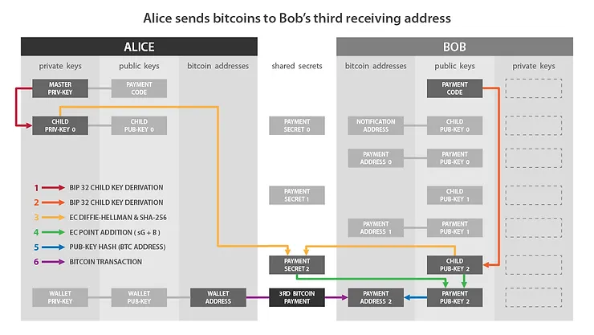

クレジット：階層的決定論的ウォレットのための再利用可能な支払いコード、ジャスティス・ランビエ。https://github.com/bitcoin/bips/blob/master/bip-0047.mediawiki

彼女はこのように続けて、ボブに属する最大2^32の空白アドレスを導出することができます。
外部から見ると、Bitcoinブロックチェーンを観察しても、理論上、BIP47支払いと通常の支払いを区別することは不可能です。こちらはTestnet上のBIP47支払いトランザクションの例です：
https://blockstream.info/testnet/tx/94b2e59510f2e1fa78411634c98a77bbb638e28fb2da00c9f359cd5fc8f87254

TXID:

> 94b2e59510f2e1fa78411634c98a77bbb638e28fb2da00c9f359cd5fc8f87254

これは、使用された入力、210,000 satsの支払い出力、およびおつりを含む通常のトランザクションのように見えます。

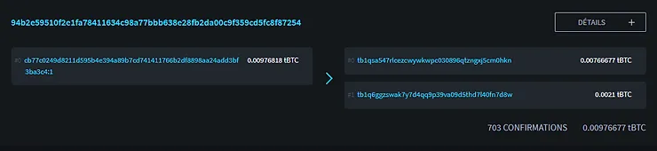

クレジット: https://blockstream.info/

### BIP47支払いを受け取り、秘密鍵を導出する。

アリスはちょうどボブが所有する空のBIP47アドレスに初めての支払いを行いました。さて、ボブがこの支払いをどのように受け取るか見てみましょう。また、アリスが生成したばかりのアドレスの秘密鍵にアクセスできない理由と、ボブが受け取ったビットコインを使うためにこの鍵をどのように取得するかも見ていきます。

ボブがアリスからの通知トランザクションを受け取るとすぐに、彼はBIP47公開鍵「K0」を導出します。これは、彼がそれに対して任意の支払いを送る前でさえです。実際、彼はすぐに複数のアドレスを導出し、それらを観察します（K0、K1、K2、K3...）。ここでは、彼がこの公開鍵「K0」をどのように導出するかを見てみましょう：

- ボブは、彼の支払いコードから導出された最初の子秘密鍵を選択します。この秘密鍵は「b」と名付けられており、アリスが前のステップで使用した公開鍵「B」と関連付けられています：

> b

- ボブは、アリスの支払いコードから導出された最初の公開鍵を選択します。この鍵は「A」と名付けられており、アリスが計算に使用した秘密鍵「a」と関連付けられており、その秘密鍵「a」はアリスだけが知っています。ボブは、通知トランザクションで彼に伝えられたアリスの支払いコードを知っているため、このプロセスを実行できます。

> A = a·G

- ボブは、楕円曲線上で点を加算して倍加することにより、アリスの公開鍵「A」に自分の秘密鍵「b」を適用することで、秘密点「S」を計算します。ここではECDHを使用し、この点「S」がボブとアリスの両方にとって同じになることを保証します。

> S = b·A

- アリスが行ったように、ボブはこの点「S」のx座標を分離します。この値を「Sx」と名付けました。彼はこの値をSHA256関数を通して共有秘密「s」（小文字）を見つけます。

> s = SHA256(Sx)

- アリスと同じ方法で、ボブは楕円曲線上で点「s·G」を計算します。次に、この秘密点を彼の公開鍵「B」に加えます。すると、楕円曲線上の新しい点を得て、それを公開鍵「K0」として解釈します：

> K0 = B + s·G

ボブがこの公開鍵「K0」を持っていると、彼はビットコインを使うために関連する秘密鍵を導出することができます。この数値を生成できるのは彼だけです。

- ボブは、彼の個人的な支払いコードから導出された子秘密鍵「b」を加えます。この「b」の値を得ることができるのは彼だけです。次に、彼は「b」を共有秘密「s」に加えて、K0の秘密鍵であるk0を得ます：

> k0 = b + s
楕円曲線の群法則のおかげで、BobはAliceが使用した公開鍵に対応する秘密鍵を正確に取得します。したがって、次のようになります：> K0 = k0·G

クレジット：階層的決定性ウォレットのための再利用可能な支払いコード、Justus Ranvier。https://github.com/bitcoin/bips/blob/master/bip-0047.mediawiki

先ほど説明した図と照らし合わせると：

- Bobの側の「Child Priv-Key 0」は：bに対応します。

- Aliceの側の「Child Pub-Key 0」は：Aに対応します。

- 「Payment Secret 0」は：sに対応します。

- 「Payment Pub-Key 0」は：K0に対応します。

- 「Payment Priv-Key 0」は：k0に対応します。

BIP47支払いを受け取り、対応する秘密鍵を計算するために私たちが見てきた手順を要約しましょう：

- Bobは、個人の支払いコードから最初に派生した子秘密鍵を選択します。

- 彼は、Aliceのチェーンコードから派生した最初の子公開鍵を使用してECDHで楕円曲線上の秘密点を計算します。

- 彼はこの秘密点を使用してSHA256で共有秘密を計算します。

- 彼はこの共有秘密を使用して楕円曲線上の新しい秘密点を計算します。

- 彼はこの新しい秘密点を自分の個人公開鍵に加えます。

- 彼は新しい一時的な公開鍵を取得し、Aliceは彼女の最初の支払いをこの公開鍵に送ります。

- Bobは、彼の支払いコードから派生した子秘密鍵と共有秘密を加えることで、この一時的な公開鍵に関連付けられた秘密鍵を計算します。

AliceはBobの秘密鍵「b」を取得できないため、BobのBIP47受信アドレスに関連付けられた秘密鍵k0を決定することはできません。

概念的に、共有秘密「S」の計算を次のように表現できます：

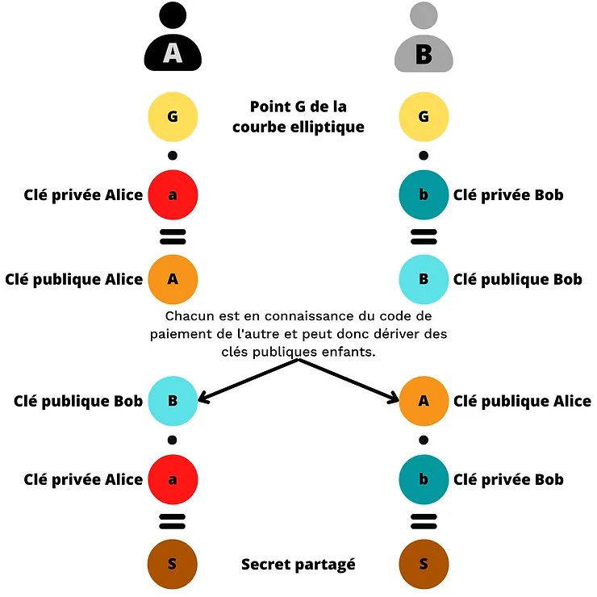

共有秘密がECDHで見つかったら、AliceとBobはBIP47支払い公開鍵「K0」を計算し、Bobは関連する秘密鍵「k0」も計算します：

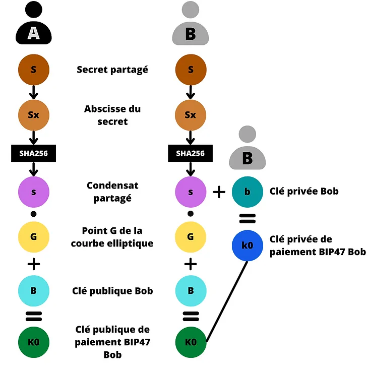

### BIP47支払いの払い戻し。

BobはAliceの再利用可能な支払いコードを知っているため、彼女に払い戻しを送るために必要な情報をすべて持っています。彼はAliceに連絡して情報を求める必要はありません。彼は単に通知トランザクションで彼女に通知し、特に彼女が彼女のシードでBIP47アドレスを回復できるようにし、その後彼も彼女に2^32までの支払いを送ることができます。
BobはAliceが彼に支払いを送ったのと同じ方法でAliceに払い戻しを送ることができます。役割は逆転します：

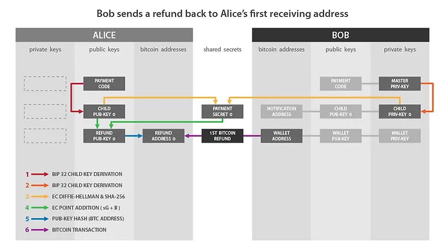

クレジット：階層的決定性ウォレットのための再利用可能な支払いコード、Justus Ranvier。https://github.com/bitcoin/bips/blob/master/bip-0047.mediawiki

これで、BIP47が表すこの素晴らしい解決策のすべての詳細を知ることができました。

## PayNymの派生した使用法。

このBIP47のSamourai Walletへの実装により、ユーザーの支払いコードから計算された識別子であるPayNymsが生まれました。今日、その有用性はBIP47の使用をはるかに超えています。
Samouraiチームは、ユーザーのPayNymに基づいたツールやサービスのエコシステムを徐々に開発しています。これらの中には、トランザクションにエントロピーを追加し、合理的な否認可能性を提供することで、ユーザーのプライバシーを最適化する支出ツールが明らかに含まれています。

Torに基づいた暗号化通信ネットワークであるSorobanとPayNymsの組み合わせ使用は、良好なセキュリティレベルを維持しながら、協力的トランザクションの構築時のユーザーエクスペリエンスを大幅に最適化しました。したがって、Stowaway（PayJoin）やStonewallX2トランザクションを、そのような協力的トランザクションを設定するために必要な多数の未署名トランザクションの交換を手動で行うことなく、簡単に実行できます。

BIP47の使用とは異なり、これらの協力的トランザクションは通知トランザクションを必要としないため、これらのツールを使用するにはPayNymsをリンクするだけで十分です。接続する必要はありません。

協力的トランザクションについて、またSamourai Walletのすべての支出ツールについてもっと知りたい場合は、この記事の「Spending Tools」セクションを読むことができます。各ツールの技術的説明と詳細なチュートリアルが見つかります。

これらの協力的トランザクションに加えて、最近SamouraiチームがPayNymにリンクされた認証プロトコルAuth47に取り組んでいることが観察されました。このツールはすでに実装されており、例えば、この方法を受け入れるウェブサイトでPayNymを使用した認証を可能にします。将来的には、ウェブ上での認証の可能性を超えて、Auth47がBIP47/PayNym/Samouraiエコシステムを取り巻くより大きなプロジェクトの一部になると思います。おそらく、このプロトコルはSamourai Walletのユーザーエクスペリエンス、特に支出ツールの使用をさらに最適化するために使用されるでしょう。これからの展開が楽しみです...

## BIP47に関する私の個人的な意見

明らかに、BIP47の主な欠点は通知トランザクションです。これにより、ユーザーはマイニングのための手数料を支払う必要があり、一部の人にとっては面倒になる可能性があります。しかし、Bitcoinブロックチェーン上の「スパム」という議論は全く受け入れられません。トランザクションの手数料を支払う人は、その目的に関係なく、それを台帳に記録する権利があります。それ以外を主張することは、検閲を支持することに他なりません。

将来的には、送信者の支払いコードを受信者に伝え、受信者がそれを安全に保管するための、より安価な解決策が見つかるかもしれません。しかし現時点では、通知トランザクションが最小の妥協点を持つ解決策のままです。

この欠点は、BIP47のすべての利点を考慮すると、無視できるものです。このアドレス再利用問題を解決するための既存の提案の中で、それは私にとって最良の解決策として現れます。

先に説明したように、アドレスの再利用の大部分は取引所から来ています。BIP47は、この問題をその源で実際に解決する唯一の合理的な解決策です。アドレスの再利用数を減らすことを目指す提案は、この側面に焦点を当て、解決策を問題の主要な源に適応させるべきです。

使いやすさの面では、その内部の仕組みはかなり複雑ですが、BIP47の支払い手続きは直感的です。したがって、再利用可能な支払いコードは、初心者ユーザーでも簡単に採用できます。

プライバシーの面では、BIP47は非常に興味深いです。通知トランザクションのセクションで説明したように、支払いコードは派生した一時的アドレスに関する情報を一切明らかにしません。したがって、従来の受取アドレスの使用とは異なり、Bitcoinトランザクションと受信者の識別子の間の情報の流れを断ち切ります。
何よりもまず、BIP47のPayNym実装は機能しています！これは2016年からSamourai Walletで、そして今年の初めからSparrow Walletで利用可能になっています。これは科学的なプロジェクトではなく、昨日テストされ、今日完全に機能している解決策です。
将来的には、これらの再利用可能な支払いコードがエコシステムのアクターによって採用され、ウォレットソフトウェアに実装され、Bitcoinユーザーによって使用されることを願っています。

ユーザープライバシーに対する真にポジティブな解決策は、BitcoinがCAや政府の監視ツールの遊び場にならないように、議論され、推進され、守られなければなりません。
彼はどこでも迫害され、侮辱されてきたことを考えましたが、今では誰もが彼がこれらの美しい鳥の中で最も美しいと言っているのを聞きました！そしてさえもエルダーベリーが枝を彼に向けて曲げ、太陽がとても温かく慈悲深い光を広げました！それから彼の羽は膨らみ、細い首がまっすぐになり、心から叫びました、「私がただの醜い小さなアヒルの子だったときに、こんなにも幸せを夢見ることができたでしょうか。」

## さらに深く:

- Bitcoin上でCoinJoinを理解し、使用する。

- Bitcoinウォレットの導出パスを理解する。

- RoninDojo Bitcoinノードをインストールして使用する。

### 外部リソースと謝辞:

この記事で使用した多くの概念を説明してくれたLaurentMTとThéo Pantamisに感謝します。私がそれらを正確に伝えたことを願っています。

このテキストの校正と専門的なアドバイスをしてくれたFanis Michalakisに感謝します。

- https://bitcoiner.guide/paynym/
- https://github.com/bitcoin/bips/blob/master/bip-0047.mediawiki
- https://fr.wikipedia.org/wiki/%C3%89change_de_cl%C3%A9s_Diffie-Hellman
- https://fr.wikipedia.org/wiki/%C3%89change_de_cl%C3%A9s_Diffie-Hellman_bas%C3%A9_sur_les_courbes_elliptiques
- https://security.stackexchange.com/questions/46802/what-is-the-difference-between-dhe-and-ecdh#:~:text=The%20difference%20between%20DHE%20and%20ECDH%20in%20two%20bullet%20points,a%20type%20of%20algebraic%20curve).
- https://commandlinefanatic.com/cgi-bin/showarticle.cgi?article=art060
- https://ee.stanford.edu/~hellman/publications/24.pdf
- https://www.researchgate.net/publication/317339928_A_study_on_diffie-hellman_key_exchange_protocols