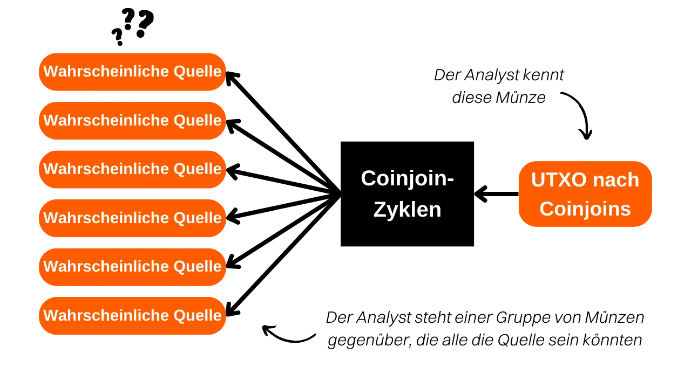

***ACHTUNG:** Nach der Verhaftung der Gründer von Samourai Wallet und der Beschlagnahme ihrer Server am 24. April ist das Whirlpool Stats Tool nicht mehr zum Download verfügbar, da es auf dem Gitlab von Samourai gehostet wurde. Auch wenn Sie dieses Tool zuvor lokal auf Ihrem Computer heruntergeladen hatten oder es auf Ihrem RoninDojo-Knoten installiert war, wird WST derzeit nicht funktionieren. Es war abhängig von den Daten, die von OXT.me bereitgestellt wurden, und diese Website ist nicht mehr zugänglich. Derzeit ist WST nicht besonders nützlich, da das Whirlpool-Protokoll inaktiv ist. Es bleibt jedoch möglich, dass diese Software in den kommenden Wochen wieder in Betrieb genommen wird. Darüber hinaus bleibt der theoretische Teil dieses Artikels relevant, um die Prinzipien und Ziele von Coinjoins im Allgemeinen (nicht nur Whirlpool) zu verstehen sowie die Effektivität des Whirlpool-Modells zu verstehen. Sie können auch lernen, wie die durch Coinjoin-Zyklen bereitgestellte Anonymität quantifiziert wird.*

_Wir verfolgen die Entwicklungen in diesem Fall sowie die Entwicklungen bezüglich der zugehörigen Tools genau. Seien Sie versichert, dass wir dieses Tutorial aktualisieren werden, sobald neue Informationen verfügbar sind._

_Dieses Tutorial wird nur zu Bildungs- und Informationszwecken bereitgestellt. Wir befürworten oder ermutigen die Verwendung dieser Tools zu kriminellen Zwecken nicht. Es liegt in der Verantwortung jedes Benutzers, die Gesetze in seiner Gerichtsbarkeit zu beachten._

---

> *"Break the link your coins leave behind"*

Dies ist eine Frage, die mir oft gestellt wird. **Bei der Durchführung von Coinjoins mit Whirlpool, wie viele Remixes sollten durchgeführt werden, um zufriedenstellende Ergebnisse zu erzielen?**

Der Zweck von Coinjoin besteht darin, durch das Mischen Ihrer Münze mit einer Gruppe von nicht unterscheidbaren Münzen eine plausible Abstreitbarkeit zu bieten. Das Ziel dieser Aktion ist es, die Rückverfolgbarkeitsverbindungen sowohl von der Vergangenheit zur Gegenwart als auch von der Gegenwart zur Vergangenheit zu unterbrechen. Mit anderen Worten, ein Analyst, der Ihre anfängliche Transaktion am Eingang der Coinjoin-Zyklen kennt, sollte Ihre UTXO am Ausgang der Remix-Zyklen nicht eindeutig identifizieren können (Analyse von Eingangszyklen zu Ausgangszyklen).

Umgekehrt sollte ein Analyst, der Ihre UTXO am Ausgang der Coinjoin-Zyklen kennt, nicht in der Lage sein, die ursprüngliche Transaktion am Eingang der Zyklen zu bestimmen (Analyse von Ausgangszyklen zu Eingangszyklen).

Die Anzahl der Remixes ist jedoch kein zuverlässiges Kriterium, um die Schwierigkeit zu bewerten, mit der ein Analyst Verbindungen zwischen Vergangenheit und Gegenwart oder umgekehrt herstellen würde. Ein relevanterer Indikator wäre die Größe der Gruppen, in denen sich Ihre Münze versteckt. Diese Indikatoren werden als "Anonsets" bezeichnet. Bei Whirlpool gibt es zwei Arten von Anonsets.

Erstens können wir die Größe der Gruppe bestimmen, in der sich Ihre UTXO am Ausgang der Coinjoin-Zyklen befindet, d.h. die Anzahl der nicht unterscheidbaren Münzen, die sich in dieser Gruppe befinden.

Dieser Indikator, in Französisch "prospective anonset", in Englisch "forward anonset" oder "forward-looking metrics" genannt, ermöglicht es uns, den Widerstand Ihrer Münze gegen Analysen zu bewerten, die ihren Weg von Eingang zu Ausgang der Coinjoin-Zyklen verfolgen. Diese Metrik schätzt das Ausmaß, in dem Ihre UTXO vor Versuchen geschützt ist, ihre Geschichte vom Eingangspunkt zum Ausgangspunkt im Coinjoin-Prozess zu rekonstruieren. Wenn Ihre Transaktion beispielsweise an ihrem ersten Coinjoin-Zyklus teilgenommen hat und zwei weitere nachgelagerte Zyklen durchgeführt wurden, wäre das prospective anonset Ihrer Münze `13`:

Zweitens kann ein weiterer Indikator berechnet werden, um den Widerstand Ihrer Münze gegen eine Analyse von der Gegenwart in die Vergangenheit zu bewerten. Indem Sie Ihre UTXO am Ende der Zyklen kennen, bestimmt dieser Indikator die Anzahl der potenziellen Tx0-Transaktionen, die Ihre Eingabe in den Coinjoin-Zyklen gebildet haben könnten (Analyse vom Ende zu Beginn der Zyklen). Dieser Indikator misst, wie schwierig es für einen Analysten ist, den Ursprung Ihrer Münze nach dem Durchlaufen von Coinjoins zurückzuverfolgen.
Der Name dieses Indikators lautet "backward anonset" oder "backward-looking metrics". Auf Französisch nenne ich es gerne "anonset rétrospectif". In der folgenden Abbildung entspricht dies allen orangefarbenen Tx0-Blasen:

Um mehr über die Berechnungsmethode dieser Indikatoren zu erfahren, empfehle ich Ihnen, [meinen Twitter-Thread](https://twitter.com/Loic_Pandul/status/1550850558147395585?s=20) zu diesem Thema zu lesen. Wir bereiten auch einen umfassenderen Artikel im PlanB Network vor.
Mir ist bewusst, dass die gegebene Antwort möglicherweise unbefriedigend erscheint, da Sie auf eine bestimmte Anzahl von Remixes gehofft haben und ich Sie auf die Dokumentation verweise. Der Grund dafür ist, dass die Anzahl der Remixes kein zuverlässiger Indikator ist, um die Anonymität, die in Coinjoin-Zyklen erreicht wird, zu bewerten. Daher ist es nicht möglich, eine feste Anzahl von Remixes als absoluten und universellen Sicherheitsschwellenwert festzulegen.

Es ist wahr, dass jede zusätzliche Remixierung Ihres Stücks die Anonymität erhöht. Es ist jedoch wichtig zu verstehen, dass es hauptsächlich die Remixes sind, die von Ihren Kollegen durchgeführt werden, die zum Wachstum Ihres potenziellen Anonsets beitragen. Mit dem Whirlpool-Modell kann Ihre Transaktion bereits mit nur zwei oder drei Coinjoin-Zyklen erhebliche Stufen des potenziellen Anonsets erreichen, ausschließlich durch die Aktivität der an vorherigen Coinjoins beteiligten Kollegen.

Das retrospektive Anonset hingegen ist in unserem Fall kein Problem. Tatsächlich profitieren Sie von Ihrem ersten Coinjoin von einer Vererbung vorheriger Pool-Transaktionen, was Ihrem Stück sofort ein hohes rückwirkendes Anonset gibt, mit einer marginalen Erhöhung in jedem nachfolgenden Zyklus.

Es ist auch wichtig zu verstehen, dass die Schaffung von plausibler Leugnung nie vollständig ist. Sie beruht auf der Wahrscheinlichkeit, Ihre Münze zurückzuverfolgen. Diese Wahrscheinlichkeit nimmt ab, je größer die Gruppen sind, die sie verbergen. Daher sollten Sie Ihre Ziele in Bezug auf Anonsets entsprechend Ihren persönlichen Erwartungen anpassen. Fragen Sie sich, aus welchen Gründen Sie Coinjoins verwenden und welche Anonymitätsstufen erforderlich sind, um diese Ziele zu erreichen. Wenn beispielsweise die Verwendung von Coinjoins lediglich darauf abzielt, die Privatsphäre Ihrer Brieftasche beim Senden einiger Sats an Ihr Patenkind zum Geburtstag zu wahren, sind sehr hohe Anonymitätsstufen nicht erforderlich. Ihr Patenkind ist wahrscheinlich nicht in der Lage, eine gründliche Kettenanalyse durchzuführen, und selbst wenn es dazu in der Lage wäre, wären die Auswirkungen auf Ihr Leben nicht katastrophal. Wenn Sie jedoch das Ziel eines autoritären Regimes sind, in dem bereits das geringste Stück Information zu Inhaftierung führen kann, müssen Ihre Handlungen von viel strengeren Kriterien geleitet werden.

Um diese berühmten Anonset-Indikatoren zu bestimmen, können Sie ein Python-Tool namens **WST** (Whirlpool Stats Tool) verwenden.

Es ist jedoch nicht immer notwendig, die Anonsets jeder Ihrer coinjoinierten Münzen zu berechnen. Das Design von Whirlpool selbst bietet Ihnen bereits Garantien. Wie bereits erwähnt, ist das retrospektive Anonset selten ein Problem. Von Ihrem ersten Mix an erhalten Sie bereits eine besonders hohe retrospektive Punktzahl. Was das potenzielle Anonset betrifft, müssen Sie Ihre Münze nur für einen ausreichend langen Zeitraum im Post-Mix-Konto belassen. Hier sind zum Beispiel die Anonset-Punktzahlen einer meiner `100.000 Sats`-Münzen nach zwei Monaten im Coinjoin-Pool:

Es zeigt eine retrospektive Punktzahl von `34.593` und eine potenzielle Punktzahl von `45.202`. Das bedeutet konkret zwei Dinge:
- Wenn ein Analyst meine Münze am Ende der Zyklen kennt und versucht, ihre Herkunft zurückzuverfolgen, wird er auf `34.593` potenzielle Quellen stoßen, von denen jede mit gleicher Wahrscheinlichkeit meine sein könnte.
- Wenn ein Analyst meine Münze am Anfang der Zyklen kennt und versucht, ihre Entsprechung am Ende zu bestimmen, wird er mit `45.202` möglichen UTXOs konfrontiert, von denen jeder mit gleicher Wahrscheinlichkeit meine sein könnte.
Deshalb halte ich den Einsatz von Whirlpool in einer `Hodl -> Mix -> Spend -> Replace`-Strategie für besonders relevant. Meiner Meinung nach ist der logischste Ansatz, den Großteil der Ersparnisse in Bitcoins in einer Cold Wallet aufzubewahren, während man ständig eine bestimmte Anzahl von Münzen in Coinjoin auf Samourai hält, um tägliche Ausgaben zu decken. Sobald die Bitcoins aus den Coinjoins ausgegeben wurden, werden sie durch neue ersetzt, um wieder den definierten Schwellenwert an gemischten Münzen zu erreichen. Diese Methode ermöglicht es uns, uns von der Sorge um die Anonymität unserer UTXOs zu befreien, während die benötigte Zeit für effektive Coinjoins weniger einschränkend ist.

Ich hoffe, diese Antwort hat etwas Licht auf das Whirlpool-Modell geworfen. Wenn Sie mehr darüber erfahren möchten, wie Coinjoins bei Bitcoin funktionieren, empfehle ich Ihnen, [meinen umfassenden Artikel zu diesem Thema](https://planb.network/tutorials/privacy/coinjoin-dojo) zu lesen.

**Externe Ressourcen:**
- Samourai Wallet Whirlpool
- https://medium.com/oxt-research/understanding-bitcoin-privacy-with-oxt-part-1-4-8177a40a5923
- https://estudiobitcoin.com/como-instalar-y-utilizar-whirlpool-stats-tools-wst-para-los-calculos-de-los-sets-de-anonimato-de-las-transacciones-coinjoins/
- https://medium.com/samourai-wallet/diving-head-first-into-whirlpool-anonymity-sets-4156a54b0bc7.
