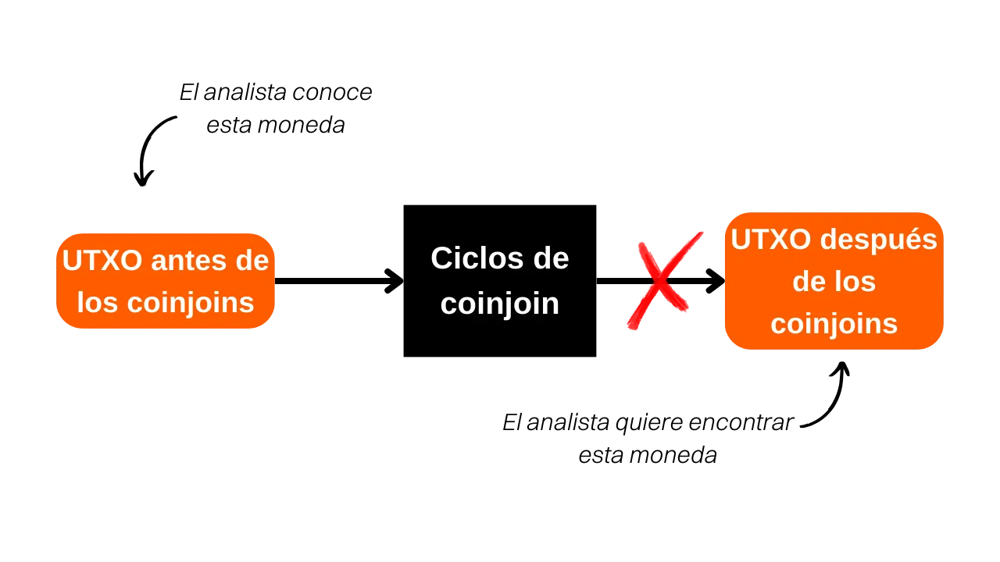

***ADVERTENCIA:** Tras la detención de los fundadores de Samourai Wallet y la incautación de sus servidores el 24 de abril, la herramienta Whirlpool Stats Tool ya no está disponible para descargar, ya que estaba alojada en el Gitlab de Samourai. Incluso si había descargado previamente esta herramienta localmente en su máquina, o estaba instalada en su nodo RoninDojo, WST no funcionará por el momento. Dependía de los datos proporcionados por OXT.me para su funcionamiento, y este sitio ya no está accesible. Actualmente, WST no es particularmente útil ya que el protocolo Whirlpool está inactivo. Sin embargo, es posible que estos softwares se reactiven en las próximas semanas. Además, la parte teórica de este artículo sigue siendo relevante para entender los principios y objetivos de los coinjoins en general (no solo Whirlpool), así como la eficacia del modelo Whirlpool. También puede aprender a cuantificar la privacidad proporcionada por los ciclos de coinjoin.*

_Estamos siguiendo de cerca la evolución de este caso así como los desarrollos relacionados con las herramientas asociadas. Ten la seguridad de que actualizaremos este tutorial a medida que estén disponibles nuevas informaciones._

_Este tutorial se proporciona únicamente con fines educativos e informativos. No respaldamos ni alentamos el uso de estas herramientas para fines criminales. Es responsabilidad de cada usuario cumplir con las leyes en su jurisdicción._

---

> *"Rompe el vínculo que tus monedas dejan atrás"*

Esta es una pregunta que me hacen con frecuencia. **Cuando se hacen coinjoins con Whirlpool, ¿cuántas remezclas deben hacerse para obtener resultados satisfactorios?**

El propósito de un coinjoin es ofrecer negación plausible al mezclar tu moneda con un grupo de monedas indistinguibles. El objetivo de esta acción es romper los vínculos de rastreo, tanto del pasado al presente como del presente al pasado. En otras palabras, un analista que conoce tu transacción inicial al ingresar a los ciclos de coinjoin no debería poder identificar definitivamente tu UTXO al salir de los ciclos de remezcla (análisis desde los ciclos de entrada hasta los ciclos de salida).

Por otro lado, un analista que conoce tu UTXO al salir de los ciclos de coinjoin no debería poder determinar la transacción original al ingresar a los ciclos (análisis desde los ciclos de salida hasta los ciclos de entrada).

Sin embargo, el número de remezclas no es un criterio confiable para evaluar la dificultad que un analista encontraría al establecer vínculos entre el pasado y el presente, o viceversa. Un indicador más relevante sería el tamaño de los grupos en los que tu moneda se está ocultando. Estos indicadores se conocen como "anonsets". En el caso de Whirlpool, existen dos tipos de anonsets.

En primer lugar, podemos determinar el tamaño del grupo en el que se encuentra tu UTXO al salir de los ciclos de coinjoin, es decir, el número de monedas indistinguibles presentes dentro de este grupo.

Este indicador, llamado "anonset prospectivo" en francés, "forward anonset" en inglés o "métricas prospectivas", nos permite evaluar la resistencia de tu moneda a análisis que rastrean su recorrido desde la entrada hasta la salida de los ciclos de coinjoin. Esta métrica estima en qué medida tu UTXO está protegido contra intentos de reconstruir su historial desde su punto de entrada hasta su punto de salida en el proceso de coinjoin. Por ejemplo, si tu transacción participó en su primer ciclo de coinjoin y se realizaron dos ciclos adicionales aguas abajo, el anonset prospectivo de tu moneda sería `13`:

En segundo lugar, se puede calcular otro indicador para evaluar la resistencia de tu moneda a un análisis desde el presente hacia el pasado. Al conocer tu UTXO al final de los ciclos, este indicador determina el número de transacciones Tx0 potenciales que podrían haber constituido tu entrada en los ciclos de coinjoin (análisis desde el final hasta el comienzo de los ciclos). Esta métrica mide qué tan difícil es para un analista rastrear el origen de tu moneda después de haber pasado por coinjoins.
El nombre de este indicador es "anonset retrospectivo" o "métricas retrospectivas". En francés, me gusta llamarlo "anonset rétrospectif". En el siguiente diagrama, esto corresponde a todas las burbujas Tx0 naranjas:

Para obtener más información sobre el método de cálculo de estos indicadores, te recomiendo leer [mi hilo de Twitter](https://twitter.com/Loic_Pandul/status/1550850558147395585?s=20) sobre este tema. También estamos preparando un artículo más completo en la Red PlanB.
Soy consciente de que la respuesta proporcionada puede parecer insatisfactoria, ya que esperabas un número específico de remezclas, y te estoy dirigiendo a la documentación. La razón de esto es que el número de remezclas no es un indicador confiable para evaluar el anonimato obtenido en los ciclos de coinjoin. Por lo tanto, no es posible definir un número fijo de remezclas como un umbral de seguridad absoluto y universal.

Es cierto que cada remezcla adicional de tu pieza aumenta sus conjuntos de anonimato. Sin embargo, es importante entender que son principalmente las remezclas realizadas por tus pares las que contribuyen al crecimiento de tu anonset prospectivo. Con el modelo Whirlpool, tu transacción puede alcanzar niveles considerables de anonset prospectivo con solo dos o tres ciclos de coinjoin, únicamente a través de la actividad de los pares involucrados en coinjoins anteriores.

Por otro lado, el anonset retrospectivo no es una preocupación en nuestro caso. De hecho, desde tu coinjoin inicial, te beneficias de una herencia de transacciones anteriores del grupo, lo que le da a tu pieza un alto anonset retrospectivo, con un aumento marginal en cada ciclo posterior.

También es importante entender que la creación de la negación plausible nunca es completa. Se basa en la probabilidad de rastrear tu moneda. Esta probabilidad disminuye a medida que aumenta el tamaño de los grupos que la ocultan. Por lo tanto, debes ajustar tus objetivos en términos de anonsets de acuerdo con tus expectativas personales. Pregúntate sobre las razones que te llevan a usar coinjoins y los niveles de anonimato necesarios para alcanzar estos objetivos. Por ejemplo, si el uso de coinjoins tiene como objetivo simplemente preservar la privacidad de tu billetera al enviar unos pocos satoshis a tu ahijado por su cumpleaños, no es necesario tener niveles muy altos de anonimato. Es probable que tu ahijado no pueda realizar un análisis exhaustivo de la cadena y, incluso si pudiera, las repercusiones en tu vida no serían catastróficas. Sin embargo, si eres el objetivo de un régimen autoritario donde la más mínima información puede resultar en prisión, tus acciones deberán guiarse por criterios mucho más estrictos.

Para determinar estos famosos indicadores de anonset, puedes utilizar una herramienta de Python llamada **WST** (Whirlpool Stats Tool).

Sin embargo, no siempre es necesario calcular los anonsets de cada una de tus monedas coinjoin. El diseño de Whirlpool en sí mismo ya te proporciona garantías. Como se mencionó anteriormente, el anonset retrospectivo rara vez es una preocupación. Desde tu mezcla inicial, ya obtienes una puntuación retrospectiva particularmente alta. En cuanto al anonset prospectivo, solo necesitas mantener tu moneda en la cuenta posterior a la mezcla durante un período de tiempo suficientemente largo. Por ejemplo, aquí están las puntuaciones de anonset de una de mis monedas de `100,000 sats` después de pasar dos meses en el grupo de coinjoin:

Muestra una puntuación retrospectiva de `34,593` y una puntuación prospectiva de `45,202`. En términos concretos, esto significa dos cosas:
- Si un analista conoce mi moneda al final de los ciclos e intenta rastrear su origen, se encontrará con `34,593` fuentes potenciales, cada una con la misma probabilidad de ser mía.
- Si un analista conoce mi moneda al principio de los ciclos e intenta determinar su correspondencia al final, se enfrentará a `45,202` posibles UTXOs, cada uno con la misma probabilidad de ser mío.
Es por eso que considero que el uso de Whirlpool es especialmente relevante en una estrategia de "Hodl -> Mix -> Spend -> Replace". En mi opinión, el enfoque más lógico es mantener la mayoría de los ahorros en bitcoins en una billetera fría, mientras se mantiene constantemente una cierta cantidad de monedas en coinjoin en Samourai para cubrir los gastos diarios. Una vez que se gastan los bitcoins de los coinjoins, se reemplazan por nuevos para volver al umbral definido de monedas mezcladas. Este método nos permite liberarnos de la preocupación por la anonimidad de nuestros UTXOs, al tiempo que reduce significativamente el tiempo necesario para que los coinjoins sean efectivos.

Espero que esta respuesta haya aclarado un poco el modelo de Whirlpool. Si quieres aprender más sobre cómo funcionan los coinjoins en Bitcoin, te recomiendo leer [mi artículo completo sobre este tema](https://planb.network/tutorials/privacy/coinjoin-dojo).

**Recursos externos:**
- Samourai Wallet Whirlpool
- https://medium.com/oxt-research/understanding-bitcoin-privacy-with-oxt-part-1-4-8177a40a5923
- https://estudiobitcoin.com/como-instalar-y-utilizar-whirlpool-stats-tools-wst-para-los-calculos-de-los-sets-de-anonimato-de-las-transacciones-coinjoins/
- https://medium.com/samourai-wallet/diving-head-first-into-whirlpool-anonymity-sets-4156a54b0bc7.
