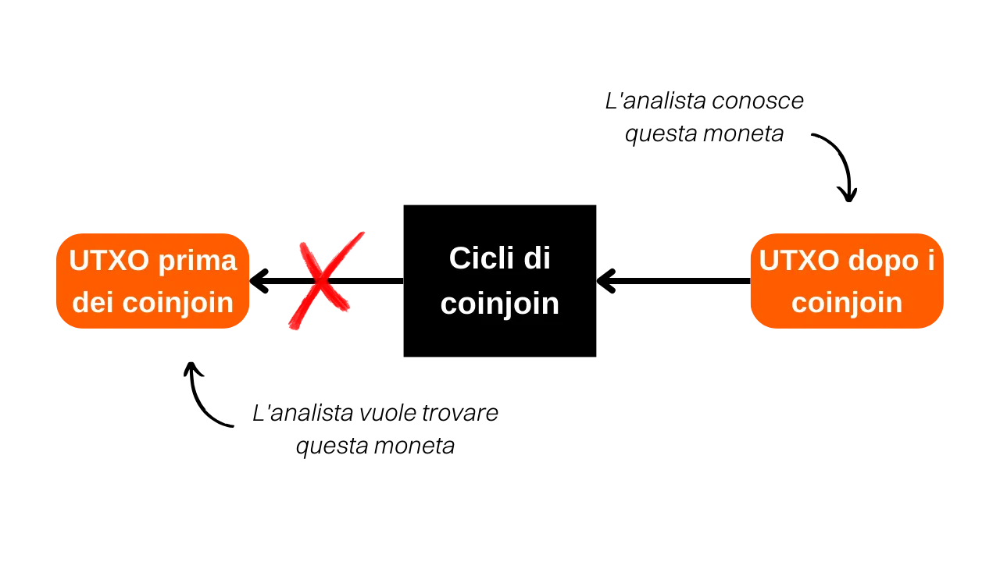

***ATTENZIONE:** In seguito all'arresto dei fondatori di Samourai Wallet e al sequestro dei loro server il 24 aprile, lo strumento Whirlpool Stats Tool non è più disponibile per il download, poiché era ospitato sul Gitlab di Samourai. Anche se avevate precedentemente scaricato questo strumento localmente sul vostro computer, o era installato sul vostro nodo RoninDojo, WST non funzionerà al momento. Dipendeva dai dati forniti da OXT.me per il suo funzionamento, e questo sito non è più accessibile. Attualmente, WST non è particolarmente utile poiché il protocollo Whirlpool è inattivo. Tuttavia, rimane possibile che questi software possano essere rimessi in servizio nelle prossime settimane. Inoltre, la parte teorica di questo articolo rimane pertinente per comprendere i principi e gli obiettivi dei coinjoins in generale (non solo Whirlpool), oltre a comprendere l'efficacia del modello Whirlpool. Potrete anche imparare a quantificare il livello privacy ottenuta dai cicli di coinjoin.*

_Stiamo seguendo da vicino l'evoluzione di questo caso così come gli sviluppi relativi agli strumenti associati. Siate certi che aggiorneremo questo tutorial non appena saranno disponibili nuove informazioni._

_Questo tutorial è fornito solo a scopo educativo e informativo. Non approviamo né incoraggiamo l'uso di questi strumenti per scopi criminali. È responsabilità di ogni utente rispettare le leggi vigenti nella propria giurisdizione._

---

> *"Rompi il collegamento che le tue monete lasciano dietro di sé"*

Questa è una domanda che mi viene spesso posta. **Quanti remix dovrebbero essere fatti con Whirlpool per ottenere risultati soddisfacenti?**

Lo scopo del coinjoin è offrire una negabilità plausibile mescolando la tua moneta con un gruppo di monete indistinguibili. L'obiettivo di questa azione è rompere i collegamenti di tracciabilità, sia dal passato al presente che dal presente al passato. In altre parole, un analista che conosce la tua transazione iniziale d'ingresso nei cicli di coinjoin non dovrebbe essere in grado di identificare univocamente il tuo UTXO in uscita dai cicli di remix (analisi dai cicli di ingresso ai cicli di uscita).

Analogamente, un analista che conosce il tuo UTXO d'uscita dai cicli di coinjoin non dovrebbe essere in grado di determinare la transazione originale d'ingresso nei cicli (analisi dai cicli di uscita ai cicli di ingresso).

Tuttavia, il numero di remix non è un criterio affidabile per valutare la difficoltà che un analista incontrerebbe, cercando di stabilire collegamenti tra passato e presente, o viceversa. Un indicatore più rilevante sarebbe la dimensione dei gruppi in cui la tua moneta si nasconde. Questi indicatori sono chiamati "anonsets". Nel caso di Whirlpool, ci sono due tipi di anonsets.

In primo luogo, possiamo determinare la dimensione del gruppo in cui il tuo UTXO è nascosto in uscita dai cicli di coinjoin, ovvero il numero di monete indistinguibili presenti all'interno di questo gruppo.

Questo indicatore, chiamato "forward anonset" in inglese o "forward-looking metrics", ci permette di valutare la resistenza della tua moneta ad analisi che tracciano il suo percorso dall'ingresso all'uscita dai cicli di coinjoin. Questa metrica stima fino a che punto il tuo UTXO è protetto contro i tentativi di ricostruire la sua storia dal punto di ingresso al punto di uscita nel processo di coinjoin. Ad esempio, se la tua transazione ha partecipato al suo primo ciclo di coinjoin e sono stati eseguiti altri due cicli successivi, il prospective anonset della tua moneta sarebbe `13`:

In secondo luogo, un altro indicatore può essere calcolato per valutare la resistenza del tuo UTXO ad un'analisi dal presente al passato. Conoscendo il tuo UTXO alla fine dei cicli, questo indicatore determina il numero di transazioni potenziali Tx0 che potrebbero aver costituito il tuo input nei cicli di coinjoin (analisi dalla fine all'inizio dei cicli). Questo indicatore misura quanto sia difficile per un analista risalire all'origine del tuo UTXO dopo che è passato attraverso i coinjoin.
Il nome di questo indicatore è "backward anonset" o "backward-looking metrics". Nel diagramma sottostante, corrisponde a tutte le bolle arancioni Tx0:

Per saperne di più sul metodo di calcolo di questi indicatori, consiglio di leggere [il mio thread su Twitter](https://twitter.com/Loic_Pandul/status/1550850558147395585?s=20) su questo argomento. Stiamo anche preparando un articolo più completo su PlanB Network.
Sono consapevole che la risposta fornita potrebbe sembrare insoddisfacente poiché speravi in un numero specifico di remix, e ti sto indirizzando alla documentazione. La ragione di ciò è che il numero di remix è un indicatore poco affidabile per valutare l'anonimato ottenuto nei cicli di coinjoin. Pertanto, non è possibile definire un numero fisso di remix come una soglia di sicurezza assoluta e universale.

È vero che ogni remix aggiuntivo del tuo UTXO ne aumenta l'anonimato. Tuttavia, è importante capire che sono principalmente i remix eseguiti dai tuoi pari che contribuiscono alla crescita del tuo anonset prospettico. Con il modello Whirlpool, la tua transazione può raggiungere livelli considerevoli di anonset prospettico con soli due o tre cicli di coinjoin, esclusivamente attraverso l'attività dei partecipanti ai coinjoin precedenti.

D'altra parte, l'anonset retrospettivo non è una preoccupazione nel nostro caso. Infatti, a partire dal tuo coinjoin iniziale, beneficerai di un'eredità di transazioni precedenti nel pool, conferendo immediatamente al tuo UTXO un alto anonset retrospettivo, con un aumento marginale in ogni ciclo successivo.

È anche importante capire che la creazione di una negabilità plausibile non è mai completa. Si basa sulla probabilità di tracciare la tua moneta. Questa probabilità diminuisce all'aumentare delle dimensioni dei gruppi che la nascondono. Pertanto, dovresti adattare i tuoi obiettivi in termini di anonset in base alle tue aspettative personali. Chiediti quali sono le ragioni che ti spingono a utilizzare i coinjoin e i livelli di anonimato necessari per raggiungere questi obiettivi. Ad esempio, se l'uso dei coinjoin è semplicemente finalizzato a preservare la privacy del tuo portafoglio quando invii qualche sats al tuo nipote per il suo compleanno, non è necessario un livello molto elevato di anonimato. Tuo nipote probabilmente non è in grado di eseguire un'analisi approfondita della blockchain e, anche se lo fosse, le ripercussioni sulla tua vita non sarebbero catastrofiche. Tuttavia, se sei il bersaglio di un regime autoritario in cui anche il più piccolo pezzo di informazione può condurti in prigione, le tue azioni dovranno essere guidate da criteri molto più rigorosi.

Per determinare questi famosi indicatori di anonset, puoi utilizzare uno strumento Python chiamato **WST** (Whirlpool Stats Tool).

Tuttavia, non è sempre necessario calcolare gli anonset di ciascuna delle tue monete coinjoin. Il design di Whirlpool stesso ti fornisce già delle garanzie. Come accennato in precedenza, l'anonset retrospettivo è raramente una preoccupazione. A partire dal tuo mix iniziale, ottieni già un punteggio retrospettivo particolarmente alto. Per quanto riguarda l'anonset prospettico, è sufficiente mantenere la tua moneta nell'account post-mix per un periodo di tempo sufficientemente lungo. Ad esempio, ecco i punteggi di anonset di una delle mie monete da `100.000 sats` dopo aver trascorso due mesi nel pool di coinjoin:

Mostra un punteggio retrospettivo di `34.593` e un punteggio prospettico di `45.202`. In termini concreti, ciò significa due cose:
- Se un analista conosce il mio UTXO in uscita dai cicli e cerca di risalire alla sua origine, si troverà di fronte a `34.593` possibili fonti, ognuna con la stessa probabilità di essere la mia.
- Se un analista conosce il mio UTXO d'ingresso nei cicli e cerca di determinarne la corrispondenza alla fine, si troverà di fronte a `45.202` possibili UTXO, ognuno con la stessa probabilità di essere il mio.
Ecco perché considero l'uso di Whirlpool particolarmente rilevante in una strategia "Hodl -> Mix -> Spend -> Replace". Secondo me, l'approccio più logico è mantenere la maggior parte dei risparmi in bitcoin in un portafoglio offline, mentre si mantiene costantemente un certo numero di monete coinjoin su Samourai per coprire le spese quotidiane. Una volta che i bitcoin dai coinjoin vengono spesi, vengono sostituiti con nuovi per tornare alla soglia definita di monete mixate. Questo metodo ci permette di liberarci dalla preoccupazione degli anonsets delle nostre UTXO, riducendo al contempo il tempo necessario affinché i coinjoin siano efficaci.

Spero che questa risposta abbia chiarito il modello Whirlpool. Se desideri saperne di più su come funzionano i coinjoin su Bitcoin, ti consiglio di leggere il mio articolo completo su questo argomento:
https://planb.network/tutorials/privacy/coinjoin-dojo

**Risorse esterne:**
- Samourai Wallet Whirlpool
- https://medium.com/oxt-research/understanding-bitcoin-privacy-with-oxt-part-1-4-8177a40a5923
- https://estudiobitcoin.com/como-instalar-y-utilizar-whirlpool-stats-tools-wst-para-los-calculos-de-los-sets-de-anonimato-de-las-transacciones-coinjoins/
- https://medium.com/samourai-wallet/diving-head-first-into-whirlpool-anonymity-sets-4156a54b0bc7.
