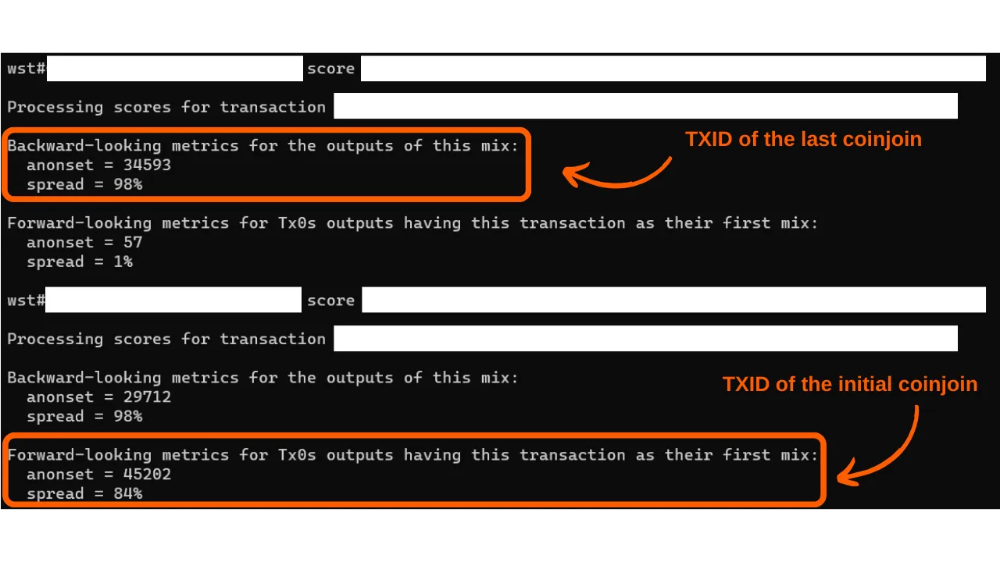

> *"あなたのコインが残す痕跡を断ち切る"*

この質問はよく聞かれます。**Whirlpoolでコインジョインを行う際、満足のいく結果を得るためにはどれくらいのリミックスを行うべきでしょうか？**

コインジョインの目的は、あなたのコインを区別できない一群のコインと混合することにより、合理的な否認可能性を提供することです。この行動の目標は、過去から現在へ、そして現在から過去へのトレーサビリティリンクを断ち切ることです。言い換えれば、コインジョインサイクルの入口であなたの初期トランザクションを知っている分析者は、リミックスサイクルの出口であなたのUTXOを確実に特定することができないはずです（入口サイクルから出口サイクルへの分析）。

逆に、コインジョインサイクルの出口であなたのUTXOを知っている分析者は、サイクルの入口での元のトランザクションを特定することができないはずです（出口サイクルから入口サイクルへの分析）。

しかし、リミックスの回数は、分析者が過去と現在の間、またはその逆の間のリンクを確立する難しさを評価するための信頼できる基準ではありません。より関連性のある指標は、あなたのコインが隠れているグループのサイズです。これらの指標は「anonsets」と呼ばれます。Whirlpoolの場合、2種類のanonsetsがあります。

まず、コインジョインサイクルの出口であなたのUTXOが隠れているグループのサイズ、つまりこのグループ内に存在する区別できないコインの数を特定できます。

この指標はフランス語で「prospective anonset」、英語で「forward anonset」または「forward-looking metrics」と呼ばれ、あなたのコインがコインジョインサイクルの入口から出口までの分析に対する抵抗力を評価することを可能にします。このメトリックは、コインジョインプロセスの入口から出口までのあなたのUTXOの履歴を再構築しようとする試みに対して、あなたのUTXOがどの程度保護されているかを推定します。例えば、あなたのトランザクションが最初のコインジョインサイクルに参加し、その後2つの下流サイクルが実行された場合、あなたのコインのprospective anonsetは`13`になります：

次に、現在から過去への分析に対するあなたのピースの抵抗力を評価するために計算できる別の指標があります。サイクルの終わりであなたのUTXOを知っていることにより、この指標はコインジョインサイクルであなたの入力を構成した可能性のあるTx0トランザクションの数を特定します（サイクルの終わりから始まりへの分析）。この指標は、あなたのピースがコインジョインを経てきた後、その起源を追跡する分析者にとってどれほど困難であるかを測定します。
この指標の名前は「backward anonset」または「backward-looking metrics」です。フランス語では、「anonset rétrospectif」と呼んでいます。下の図では、これはすべてのオレンジ色のTx0バブルに相当します：

これらの指標の計算方法についてもっと知りたい場合は、このトピックに関する[私のTwitterスレッド](https://twitter.com/Loic_Pandul/status/1550850558147395585?s=20)を読むことをお勧めします。また、PlanB Networkに関するより包括的な記事を準備中です。
提供された回答が、特定のリミックス回数を期待していたあなたにとって不満足なものに思えることを承知しており、ドキュメンテーションへの誘導を行っています。これは、リミックスの回数がコインジョインサイクルで得られる匿名性を評価するための信頼できない指標であるためです。したがって、リミックスの固定回数を絶対的かつ普遍的なセキュリティの閾値として定義することは不可能です。

確かに、あなたのピースの追加リミックスは、その匿名性セットを増加させることが真実です。しかし、主にあなたの仲間によって行われるリミックスが、あなたの見込み匿名性セットの成長に貢献することを理解することが重要です。Whirlpoolモデルでは、あなたのトランザクションは、前のコインジョインに関与した仲間の活動だけで、わずか2、3回のコインジョインサイクルで、かなりのレベルの見込み匿名性セットを達成することができます。

一方、振り返り匿名性セットは、私たちの場合、懸念事項ではありません。実際、あなたの初回のコインジョインから、あなたは以前のプールトランザクションの継承から利益を得て、あなたのピースに高い後方匿名性セットを即座に与え、各後続サイクルでわずかな増加を達成します。
また、合理的な否認の作成が決して完全ではないことを理解することも重要です。これは、あなたのコインの追跡確率に依存しています。この確率は、それを隠蔽するグループのサイズが増加するにつれて減少します。したがって、あなたの個人的な期待に応じて、匿名性セットに関するあなたの目標を調整する必要があります。コインジョインを使用する理由と、これらの目標を達成するために必要な匿名性のレベルについて自問してください。例えば、コインジョインの使用が単に誕生日にいくつかのサトシをあなたの教子に送る際のウォレットのプライバシーを保持することを目的としている場合、非常に高いレベルの匿名性は必要ありません。あなたの教子はおそらく深いチェーン分析を行うことができず、たとえ彼らができたとしても、あなたの人生に与える影響は壊滅的ではありません。しかし、あなたが最小限の情報でも投獄につながりうる権威主義的な体制の標的である場合、あなたの行動ははるかに厳格な基準によって導かれる必要があります。

これらの有名な匿名性セット指標を決定するために、**WST**（Whirlpool Stats Tool）と呼ばれるPythonツールを使用することができます。また、このツールに関するチュートリアルを準備中です。

しかし、コインジョインされた各コインの匿名性セットを常に計算する必要はありません。Whirlpool自体の設計は既にあなたに保証を提供しています。前述のように、振り返り匿名性セットはめったに懸念されることはありません。初回のミックスから、あなたはすでに特に高い振り返りスコアを得ています。見込み匿名性セットに関しては、十分な長さの時間、あなたのコインをポストミックスアカウントに保持するだけでよいのです。例えば、コインジョインプールで2ヶ月を過ごした私の`100,000サトシ`コインの匿名性セットスコアは以下の通りです：

これは、振り返りスコアが`34,593`で、見込みスコアが`45,202`であることを意味します。具体的には、これは2つのことを意味します：
- 分析者がサイクルの終わりに私のコインを知り、その起源を追跡しようとする場合、彼らは`34,593`の潜在的なソースに遭遇し、それぞれが私のものである同じ確率を持ちます。
- 分析者がサイクルの始めに私のコインを知り、その終わりでの対応を決定しようとする場合、彼らは`45,202`の可能なUTXOに直面し、それぞれが私のものである同じ確率を持ちます。
そのため、私は`Hodl -> Mix -> Spend -> Replace`戦略において、Whirlpoolの使用が特に関連性が高いと考えています。私の意見では、最も論理的なアプローチは、ビットコインの大部分をコールドウォレットに保持しつつ、日常の支出をカバーするために、常にSamourai上でコインジョインに一定数のコインを維持することです。コインジョインからのビットコインが使われたら、混合されたコインの定義された閾値に戻るために新しいものと交換されます。この方法により、私たちはUTXOの匿名セットに関する懸念から自由になり、コインジョインが効果的であるために必要な時間を大幅に短縮することができます。
この回答がWhirlpoolモデルについて少しでも光を当てることができたことを願っています。Bitcoin上でのコインジョインの仕組みについてもっと学びたい場合は、[このトピックに関する私の包括的な記事](https://planb.network/tutorials/privacy/coinjoin-dojo)を読むことをお勧めします。

**外部リソース:**
- https://samouraiwallet.com/whirlpool
- https://medium.com/oxt-research/understanding-bitcoin-privacy-with-oxt-part-1-4-8177a40a5923
- https://estudiobitcoin.com/como-instalar-y-utilizar-whirlpool-stats-tools-wst-para-los-calculos-de-los-sets-de-anonimato-de-las-transacciones-coinjoins/
- https://medium.com/samourai-wallet/diving-head-first-into-whirlpool-anonymity-sets-4156a54b0bc7