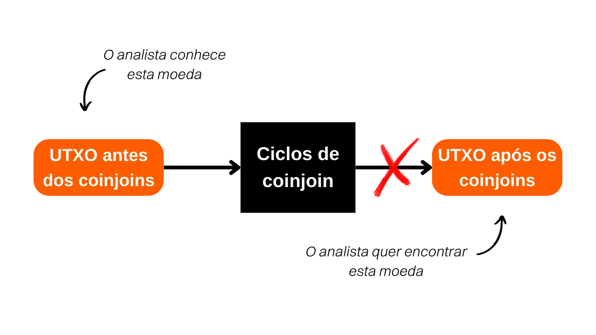
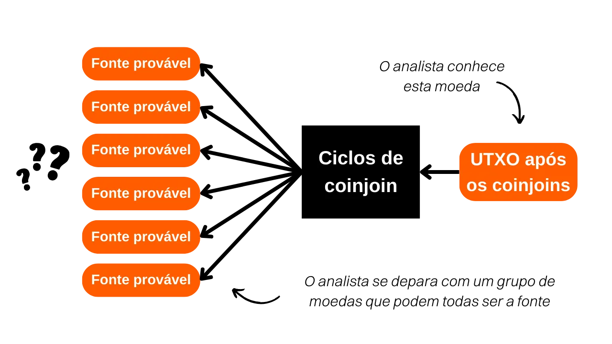
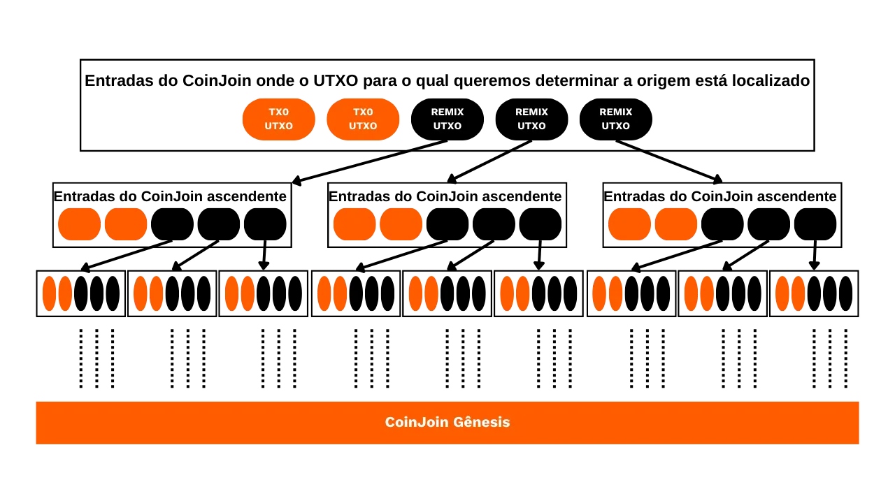
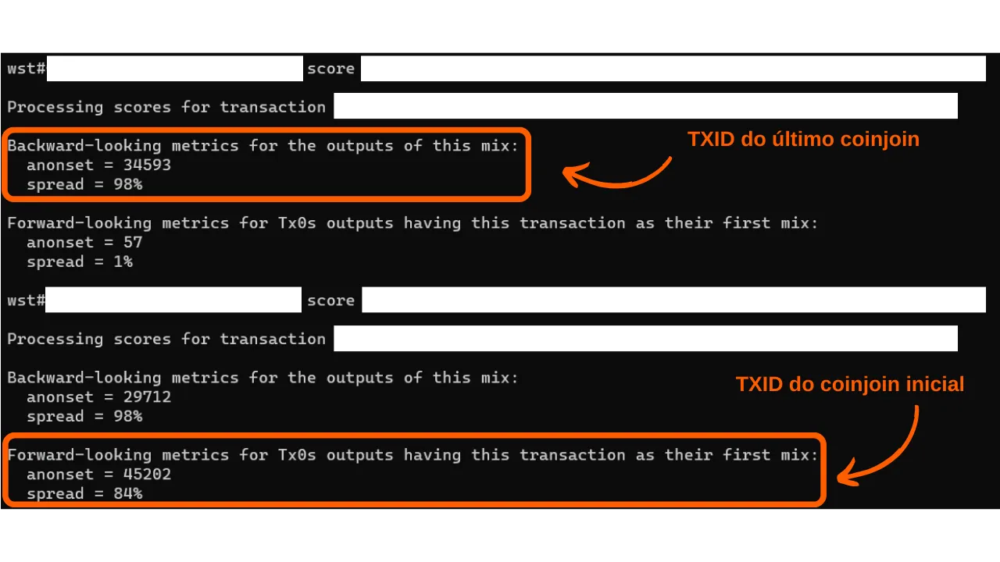

***ATENÇÃO:** Após a prisão dos fundadores da Samourai Wallet e a apreensão dos seus servidores em 24 de abril, a ferramenta Whirlpool Stats Tool não está mais disponível para download, pois estava hospedada no Gitlab da Samourai. Mesmo que você tenha baixado esta ferramenta localmente em sua máquina ou estivesse instalada em seu nó RoninDojo, o WST não funcionará no momento. Ele dependia dos dados fornecidos pelo OXT.me para operar, e esse site não está mais acessível. Atualmente, o WST não é particularmente útil, pois o protocolo Whirlpool está inativo. No entanto, é possível que esses softwares sejam reativados nas próximas semanas. Além disso, a parte teórica deste artigo permanece relevante para entender os princípios e objetivos dos coinjoins em geral (não apenas Whirlpool), bem como para compreender a eficácia do modelo Whirlpool. Você também pode aprender a quantificar a privacidade proporcionada pelos ciclos de coinjoin.*

_Estamos acompanhando de perto a evolução deste caso, bem como os desenvolvimentos relacionados às ferramentas associadas. Fique assegurado de que atualizaremos este tutorial à medida que novas informações estiverem disponíveis._

_Este tutorial é fornecido apenas para fins educativos e informativos. Não endossamos nem encorajamos o uso dessas ferramentas para fins criminosos. É responsabilidade de cada usuário cumprir as leis em sua jurisdição._

---

> *"Quebre o elo que suas moedas deixam para trás"*

Essa é uma pergunta que frequentemente me fazem. **Ao fazer coinjoins com o Whirlpool, quantos remixes devem ser feitos para obter resultados satisfatórios?**

O objetivo do coinjoin é oferecer negação plausível ao misturar sua moeda com um grupo de moedas indistinguíveis. A finalidade dessa ação é quebrar os elos de rastreabilidade, tanto do passado para o presente quanto do presente para o passado. Em outras palavras, um analista que conhece sua transação inicial na entrada dos ciclos de coinjoin não deve ser capaz de identificar definitivamente sua UTXO na saída dos ciclos de remix (análise dos ciclos de entrada para os ciclos de saída).

Da mesma forma, um analista que conhece sua UTXO na saída dos ciclos de coinjoin não deve ser capaz de determinar a transação original na entrada dos ciclos (análise dos ciclos de saída para os ciclos de entrada).

No entanto, o número de remixes não é um critério confiável para avaliar a dificuldade que um analista encontraria ao estabelecer elos entre o passado e o presente, ou vice-versa. Um indicador mais relevante seria o tamanho dos grupos nos quais sua moeda está escondida. Esses indicadores são chamados de "anonsets". No caso do Whirlpool, existem dois tipos de anonsets.

Em primeiro lugar, podemos determinar o tamanho do grupo em que sua UTXO está escondida na saída dos ciclos de coinjoin, ou seja, o número de moedas indistinguíveis presentes dentro desse grupo.

Esse indicador, chamado de "anonset prospectivo" em francês, "forward anonset" em inglês ou "métricas prospectivas", nos permite avaliar a resistência de sua moeda a análises que traçam seu caminho da entrada para a saída dos ciclos de coinjoin. Essa métrica estima até que ponto sua UTXO está protegida contra tentativas de reconstruir sua história desde o ponto de entrada até o ponto de saída no processo de coinjoin. Por exemplo, se sua transação participou de seu primeiro ciclo de coinjoin e foram realizados mais dois ciclos subsequentes, o anonset prospectivo de sua moeda seria `13`:

Em segundo lugar, outro indicador pode ser calculado para avaliar a resistência de sua moeda a uma análise do presente para o passado. Ao conhecer sua UTXO no final dos ciclos, esse indicador determina o número de transações Tx0 potenciais que poderiam ter constituído sua entrada nos ciclos de coinjoin (análise do final para o início dos ciclos). Esse indicador mede o quão difícil é para um analista rastrear a origem de sua moeda depois que ela passou por coinjoins.
O nome desse indicador é "anonset retrospectivo" ou "métricas retrospectivas". Em francês, gosto de chamá-lo de "anonset rétrospectif". No diagrama abaixo, isso corresponde a todas as bolhas laranjas Tx0:

Para saber mais sobre o método de cálculo desses indicadores, recomendo ler [meu tópico no Twitter](https://twitter.com/Loic_Pandul/status/1550850558147395585?s=20) sobre esse assunto. Também estamos preparando um artigo mais abrangente na PlanB Network.
Estou ciente de que a resposta fornecida pode parecer insatisfatória, pois você esperava um número específico de remixes, e estou direcionando você para a documentação. A razão para isso é que o número de remixes não é um indicador confiável para avaliar o anonimato obtido em ciclos de coinjoin. Portanto, não é possível definir um número fixo de remixes como um limite de segurança absoluto e universal.

É verdade que cada remix adicional da sua transação aumenta seus conjuntos de anonimato. No entanto, é importante entender que são principalmente os remixes realizados por seus pares que contribuem para o crescimento do seu anonset prospectivo. Com o modelo Whirlpool, sua transação pode alcançar níveis consideráveis de anonset prospectivo com apenas dois ou três ciclos de coinjoin, exclusivamente por meio da atividade de pares envolvidos em coinjoins anteriores.

Por outro lado, o anonset retrospectivo não é uma preocupação em nosso caso. Na verdade, a partir do seu coinjoin inicial, você se beneficia de uma herança de transações anteriores do pool, dando imediatamente ao seu pedaço um alto anonset retrospectivo, com um aumento marginal em cada ciclo subsequente.

Também é importante entender que a criação de negação plausível nunca é completa. Ela se baseia na probabilidade de rastrear sua moeda. Essa probabilidade diminui à medida que o tamanho dos grupos que a ocultam aumenta. Portanto, você deve ajustar seus objetivos em termos de anonsets de acordo com suas expectativas pessoais. Pergunte a si mesmo sobre as razões que o levam a usar coinjoins e os níveis de anonimato necessários para alcançar esses objetivos. Por exemplo, se o uso de coinjoins tem como objetivo apenas preservar a privacidade da sua carteira ao enviar alguns sats para o seu afilhado no aniversário dele, níveis muito altos de anonimato não são necessários. Seu afilhado provavelmente não é capaz de realizar uma análise detalhada da cadeia e, mesmo que fosse, as repercussões em sua vida não seriam catastróficas. No entanto, se você é alvo de um regime autoritário onde a menor informação pode resultar em prisão, suas ações precisarão ser guiadas por critérios muito mais rigorosos.

Para determinar esses famosos indicadores de anonset, você pode usar uma ferramenta em Python chamada **WST** (Whirlpool Stats Tool).

No entanto, nem sempre é necessário calcular os anonsets de cada uma de suas moedas coinjoined. O próprio design do Whirlpool já fornece garantias. Como mencionado anteriormente, o anonset retrospectivo raramente é uma preocupação. A partir da sua mistura inicial, você já obtém uma pontuação retrospectiva particularmente alta. Quanto ao anonset prospectivo, basta manter sua moeda na conta pós-mix por um período de tempo suficientemente longo. Por exemplo, aqui estão as pontuações de anonset de uma das minhas moedas de `100.000 sats` após passar dois meses no pool de coinjoin:

Ele exibe uma pontuação retrospectiva de `34.593` e uma pontuação prospectiva de `45.202`. Em termos concretos, isso significa duas coisas:
- Se um analista conhece minha moeda no final dos ciclos e tenta rastrear sua origem, ele encontrará `34.593` fontes potenciais, cada uma com a mesma probabilidade de ser minha.
- Se um analista conhece minha moeda no início dos ciclos e tenta determinar sua correspondência no final, ele se deparará com `45.202` possíveis UTXOs, cada um com a mesma probabilidade de ser meu.
É por isso que considero o uso do Whirlpool especialmente relevante em uma estratégia de `Hodl -> Mix -> Spend -> Replace`. Na minha opinião, a abordagem mais lógica é manter a maioria das economias em bitcoins em uma carteira fria, enquanto mantém constantemente uma certa quantidade de moedas em coinjoin no Samourai para cobrir despesas diárias. Uma vez que os bitcoins dos coinjoins são gastos, eles são substituídos por novos para retornar ao limite definido de moedas misturadas. Este método nos permite nos libertar da preocupação com os anonsets de nossos UTXOs, ao mesmo tempo em que torna o tempo necessário para que os coinjoins sejam eficazes muito menos restritivo.

Espero que esta resposta tenha esclarecido um pouco o modelo Whirlpool. Se você quiser saber mais sobre como os coinjoins funcionam no Bitcoin, recomendo a leitura do meu artigo abrangente sobre esse tópico: 

https://planb.network/tutorials/privacy/coinjoin-dojo

**Recursos externos:**
- Samourai Wallet Whirlpool
- https://medium.com/oxt-research/understanding-bitcoin-privacy-with-oxt-part-1-4-8177a40a5923
- https://estudiobitcoin.com/como-instalar-y-utilizar-whirlpool-stats-tools-wst-para-los-calculos-de-los-sets-de-anonimato-de-las-transacciones-coinjoins/
- https://medium.com/samourai-wallet/diving-head-first-into-whirlpool-anonymity-sets-4156a54b0bc7.
