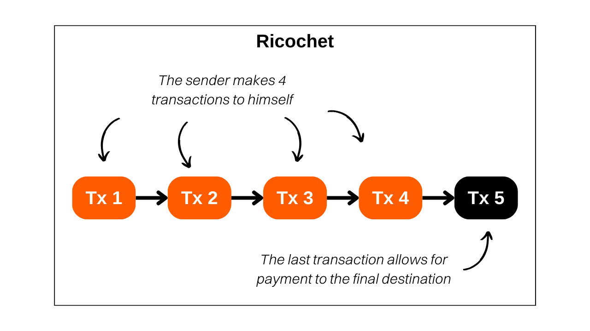

> *"A premium tool that adds extra hops of history to your transaction. Stump the blacklists and help guard against unjust 3rd party account closures."*

## What is Ricochet?
Ricochet is a technique that involves conducting multiple fictitious transactions to oneself in order to simulate a transfer of bitcoin ownership. This tool is different from other Samourai transactions as it does not provide prospective anonymity, but rather a form of retrospective anonymity. Ricochet helps blur the specificities that could compromise the fungibility of a Bitcoin coin.

For example, if you perform a coinjoin, your coin output from the mix will be identified as such. Chain analysis tools are able to detect patterns of coinjoin transactions and label the coins that come out of them. Indeed, coinjoin aims to break the historical links of a coin, but its passage through coinjoins remains detectable. To make an analogy, this phenomenon is similar to encrypting a text: even though we cannot access the original plaintext, it is easily identifiable that encryption has been applied.

Precisely, this label of "coinjoin output coin" can affect the fungibility of a UTXO. Regulated entities, such as exchange platforms, may refuse to accept a UTXO that has undergone a coinjoin, or even require explanations from its owner, with the risk of having their account blocked or funds frozen. In some cases, the platform may even report your behavior to state authorities.

This is where the Ricochet method comes into play. To blur the footprint left by a coinjoin, Ricochet executes four successive transactions where the user transfers their funds to themselves on different addresses. After this sequence of transactions, the Ricochet tool finally routes the bitcoins to their final destination, such as an exchange platform. The objective is to create distance between the original coinjoin transaction and the final spending act. In this way, chain analysis tools will think that there has likely been a transfer of ownership after the coinjoin, and therefore it is unnecessary to take action against the sender.

In the face of the Ricochet method, one could imagine that chain analysis software would deepen their examination beyond four bounces. However, these platforms face a dilemma in optimizing the detection threshold. They must establish a limit on the number of hops after which they admit that a property change has likely occurred and that the link with a previous coinjoin should be ignored. However, determining this threshold is risky: each extension of the observed number of hops exponentially increases the volume of false positives, i.e., individuals erroneously marked as participants in a coinjoin, when the operation was actually performed by someone else. This scenario poses a major risk for these companies, as false positives lead to dissatisfaction, which can drive affected customers towards the competition. In the long term, a threshold that is too ambitious leads a platform to lose more customers than its competitors, which could threaten its viability. It is therefore complicated for these platforms to increase the number of observed bounces, and 4 is often a sufficient number to counter their analyses.

Thus, **the most common use case for Ricochet arises when it is necessary to conceal a previous participation in a coinjoin on a UTXO that belongs to you**. Ideally, it is best to avoid transferring bitcoins that have undergone a coinjoin to regulated entities. However, in the event that there is no other option, especially in the urgency to liquidate bitcoins into fiat currency, Ricochet offers an effective solution.

## How does Ricochet work on Samourai Wallet?
Ricochet is simply a method where one sends bitcoins to oneself. It is therefore entirely possible to manually simulate a Ricochet without using a specialized tool. However, for those who wish to automate the process while benefiting from a more polished result, the Ricochet tool available through the Samourai Wallet application is a good solution.

Since the service is paid on Samourai, a Ricochet incurs a cost of `100,000 sats` as a service fee, in addition to mining fees. Thus, its use is more recommended for transfers of significant amounts.

The Samourai application offers two variants of Ricochet:
- The Reinforced Ricochet, or "staggered delivery," offers the advantage of spreading the Samourai service fees over five consecutive transactions. This option also ensures that each transaction is broadcasted at a distinct time and recorded in a different block, which closely mimics the behavior of a change of ownership. Although slower, this method is preferable for those who are not in a hurry, as it maximizes the efficiency of Ricochet by enhancing its resistance to chain analysis.
- The Classic Ricochet, which is designed to execute the operation quickly by broadcasting all transactions within a reduced time interval. This method, therefore, offers less privacy and lower resistance to analysis compared to the reinforced method. It should only be preferred for urgent transfers.

## How to Perform a Ricochet on Samourai Wallet?
To perform a Ricochet transaction from the Samourai Wallet application, follow our video tutorial:

If you wish to study the Ricochet transactions performed in this tutorial, here they are:
- The first Ricochet transaction: [8deec9054dab10a35897b5efe0b3418e5012983888f8674835a9989a494921dc](https://mempool.space/fr/testnet/tx/8deec9054dab10a35897b5efe0b3418e5012983888f8674835a9989a494921dc)
- The last Ricochet transaction: [27980ce507630882f2a1ef94b941a0a3e086b80b10faf7bd168f3ebb4c3e4777](https://mempool.space/fr/testnet/tx/27980ce507630882f2a1ef94b941a0a3e086b80b10faf7bd168f3ebb4c3e4777)

**External Resources:**
- https://docs.samourai.io/en/wallet/features/ricochet
- https://samouraiwallet.com/ricochet
