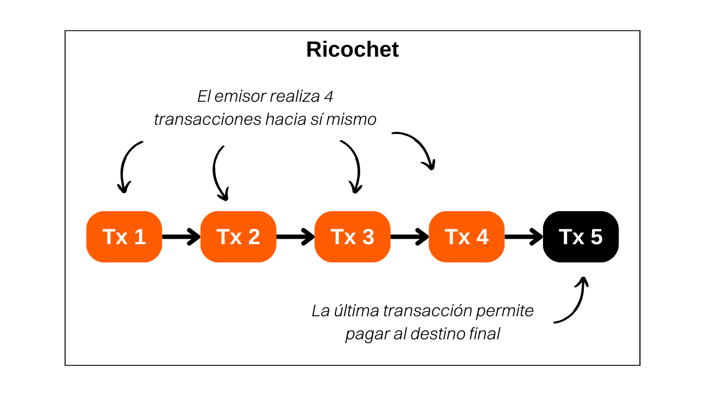

> *"Una herramienta premium que agrega saltos adicionales de historial a tu transacción. Desafía las listas negras y ayuda a protegerte contra el cierre injusto de cuentas de terceros."*

## ¿Qué es Ricochet?
Ricochet es una técnica que implica realizar múltiples transacciones ficticias a uno mismo para simular una transferencia de propiedad de bitcoin. Esta herramienta es diferente de otras transacciones de Samourai ya que no proporciona anonimato prospectivo, sino una forma de anonimato retrospectivo. De hecho, Ricochet ayuda a difuminar las especificidades que podrían comprometer la fungibilidad de una moneda Bitcoin.

Por ejemplo, si realizas una coinjoin, la salida de tu moneda de la mezcla será identificada como tal. Las herramientas de análisis de cadena pueden detectar patrones de transacciones coinjoin y etiquetar las monedas que salen de ellas. Coinjoin tiene como objetivo romper los vínculos históricos de una moneda, pero su paso a través de coinjoins sigue siendo detectable. Para hacer una analogía, este fenómeno es similar a encriptar un texto: aunque no podemos acceder al texto plano original, es fácilmente identificable que se ha aplicado una encriptación.

Precisamente, esta etiqueta de "moneda de salida de coinjoin" puede afectar la fungibilidad de un UTXO. Entidades reguladas, como plataformas de intercambio, pueden negarse a aceptar un UTXO que haya pasado por una coinjoin, o incluso exigir explicaciones a su propietario, con el riesgo de bloquear su cuenta o congelar sus fondos. En algunos casos, la plataforma incluso puede informar tu comportamiento a las autoridades estatales.

Aquí es donde entra en juego el método Ricochet. Para difuminar la huella dejada por una coinjoin, Ricochet ejecuta cuatro transacciones sucesivas donde el usuario transfiere sus fondos a sí mismo en diferentes direcciones. Después de esta secuencia de transacciones, la herramienta Ricochet finalmente dirige los bitcoins a su destino final, como una plataforma de intercambio. El objetivo es crear distancia entre la transacción original de coinjoin y el acto final de gasto. De esta manera, las herramientas de análisis de cadena pensarán que probablemente ha habido una transferencia de propiedad después de la coinjoin, y por lo tanto no es necesario tomar medidas contra el remitente.

Frente al método Ricochet, se podría imaginar que el software de análisis de cadena profundizaría su examen más allá de cuatro saltos. Sin embargo, estas plataformas enfrentan un dilema al optimizar el umbral de detección. Deben establecer un límite en el número de saltos después del cual admiten que probablemente ha ocurrido un cambio de propiedad y que el vínculo con una coinjoin anterior debe ser ignorado. Sin embargo, determinar este umbral es arriesgado: cada extensión del número observado de saltos aumenta exponencialmente el volumen de falsos positivos, es decir, personas marcadas erróneamente como participantes en una coinjoin, cuando la operación fue realizada en realidad por otra persona. Este escenario plantea un riesgo importante para estas empresas, ya que los falsos positivos generan insatisfacción, lo que puede llevar a los clientes afectados hacia la competencia. A largo plazo, un umbral de detección demasiado ambicioso hace que una plataforma pierda más clientes que sus competidores, lo que podría poner en peligro su viabilidad. Por lo tanto, es un desafío para estas plataformas aumentar el número de saltos observados, y 4 suele ser un número suficiente para contrarrestar sus análisis.

Así, **el caso de uso más común para Ricochet ocurre cuando es necesario ocultar una participación previa en una coinjoin en un UTXO que te pertenece**. Idealmente, es mejor evitar transferir bitcoins que hayan pasado por una coinjoin a entidades reguladas. Sin embargo, en caso de que no haya otra opción, especialmente en la urgencia de liquidar bitcoins en moneda fiduciaria, Ricochet ofrece una solución efectiva.

## ¿Cómo funciona Ricochet en Samourai Wallet?
Ricochet es simplemente un método en el que uno envía bitcoins a sí mismo. Por lo tanto, es completamente posible simular manualmente un Ricochet sin usar una herramienta especializada. Sin embargo, para aquellos que deseen automatizar el proceso y obtener un resultado más pulido, la herramienta Ricochet disponible a través de la aplicación Samourai Wallet es una buena solución.
Dado que el servicio es de pago en Samourai, un Ricochet conlleva un costo de `100,000 sats` como tarifa de servicio, además de las tarifas de minería. Por lo tanto, su uso se recomienda más para transferencias de cantidades significativas.

La aplicación Samourai ofrece dos variantes de Ricochet:
- El Ricochet reforzado, o "entrega escalonada", ofrece la ventaja de distribuir las tarifas de servicio de Samourai en cinco transacciones consecutivas. Esta opción también garantiza que cada transacción se transmita en un momento distinto y se registre en un bloque diferente, lo que imita de cerca el comportamiento de un cambio de propiedad. Aunque más lento, este método es preferible para aquellos que no tienen prisa, ya que maximiza la eficiencia de Ricochet al fortalecer su resistencia al análisis de la cadena.
- El Ricochet clásico, que está diseñado para ejecutar la operación rápidamente al transmitir todas las transacciones dentro de un intervalo de tiempo reducido. Este método, por lo tanto, ofrece menos privacidad y menor resistencia al análisis en comparación con el método reforzado. Solo debe ser preferido para transferencias urgentes.

## ¿Cómo realizar un Ricochet en Samourai Wallet?
Para realizar una transacción Ricochet desde la aplicación Samourai Wallet, sigue nuestro tutorial en video:

Si deseas estudiar las transacciones Ricochet realizadas en este tutorial, aquí están:
- La primera transacción Ricochet: [8deec9054dab10a35897b5efe0b3418e5012983888f8674835a9989a494921dc](https://mempool.space/fr/testnet/tx/8deec9054dab10a35897b5efe0b3418e5012983888f8674835a9989a494921dc)
- La última transacción Ricochet: [27980ce507630882f2a1ef94b941a0a3e086b80b10faf7bd168f3ebb4c3e4777](https://mempool.space/fr/testnet/tx/27980ce507630882f2a1ef94b941a0a3e086b80b10faf7bd168f3ebb4c3e4777)

**Recursos externos:**
- https://docs.samourai.io/en/wallet/features/ricochet
- https://samouraiwallet.com/ricochet
