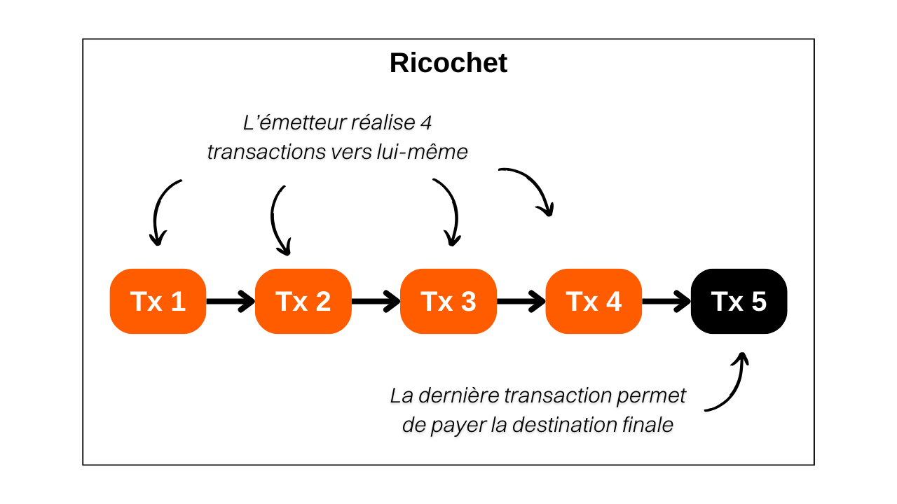

> *"A premium tool that adds extra hops of history to your transaction. Stump the blacklists and help guard against unjust 3rd party account closures."*

## C'est quoi un Ricochet ?
Le Ricochet est une technique consistant à réaliser plusieurs transactions fictives vers soi-même pour simuler un transfert de propriété des bitcoins. Cet outil est différent des autres transactions de Samourai, car il ne permet pas de gagner de l'anonymat prospectif, mais plutôt une forme d'anonymat rétrospectif. En effet, Ricochet permet d'estomper les spécificités pouvant compromettre la fongibilité d'une pièce Bitcoin.

Par exemple, si vous réalisez un coinjoin, votre pièce en sortie de mix sera identifiée comme telle. Les outils d'analyse de chaîne parviennent à détecter les paternes de transactions coinjoin et attribuent une étiquette aux pièces qui en sortent. En effet, le coinjoin vise à briser les liens historiques d'une pièce, toutefois, son passage par des coinjoins reste détectable. Pour faire une analogie, ce phénomène s'apparente au chiffrement d'un texte : bien qu'on ne puisse pas accéder au texte original en clair, on identifie facilement qu'un chiffrement y a été appliqué.

Justement, cette étiquette de « *pièce issue d'un coinjoin* » peut affecter la fongibilité d'un UTXO. Des entités réglementées, telles que les plateformes d'échange, peuvent refuser d'accepter un UTXO ayant subi un coinjoin, voire exiger des explications de la part de son propriétaire, avec le risque de voir son compte bloqué ou ses fonds gelés. Dans certains cas, la plateforme peut même signaler votre comportement aux autorités étatiques. 

C'est là que la méthode du Ricochet entre en jeu. Pour estomper l'empreinte laissée par un coinjoin, Ricochet exécute quatre transactions successives où l'utilisateur transfère ses fonds à lui-même sur des adresses différentes. Après cet enchaînement de transactions, l'outil Ricochet achemine finalement les bitcoins vers leur destination finale, comme par exemple une plateforme d'échange. L'objectif est de créer de la distance entre la transaction coinjoin originale et l'acte de dépense final. De cette manière, les outils d'analyse de chaîne vont penser qu'il y a vraisemblablement eu un transfert de propriété après le coinjoin, et qu'il est donc inutile d'entamer des actions à l'encontre de l'émetteur.

Face à la méthode du Ricochet, on pourrait imaginer que les logiciels d'analyse de chaîne approfondissent leur examen au-delà de quatre rebonds. Toutefois, ces plateformes se heurtent à un dilemme dans l'optimisation du seuil de détection. Elles doivent établir un nombre limite de sauts après lequel elles admettent qu'un changement de propriété a vraisemblablement eu lieu et que le lien avec un coinjoin antérieur doit être ignoré. Cependant, la détermination de ce seuil s'avère risquée : chaque extension du nombre de sauts observés accroît de façon exponentielle le volume de faux positifs, c'est-à-dire des individus erronément marqués comme participants à un coinjoin, alors que l'opération a été réalisée par autrui. Ce scénario pose un risque majeur pour ces entreprises, car les faux positifs entraînent de l'insatisfaction, ce qui peut pousser les clients affectés vers la concurrence. À long terme, un seuil de détection trop ambitieux conduit une plateforme à perdre davantage de clients que ses concurrents, ce qui pourrait menacer sa viabilité. Il est donc compliqué pour ces plateformes d'augmenter le nombre de rebonds observés, et 4 est souvent un nombre suffisant pour contrer leurs analyses.

Ainsi, **le cas d'utilisation le plus courant de Ricochet se présente quand il est nécessaire de dissimuler une participation antérieure à un coinjoin sur un UTXO qui vous appartient.** Idéalement, il vaut mieux éviter de transférer des bitcoins ayant subi un coinjoin vers des entités régulées. Néanmoins, dans l'éventualité où l'on se trouve sans autre possibilité, notamment dans l'urgence de liquider des bitcoins en devise étatique, Ricochet offre une solution efficace.

## Comment fonctionne Ricochet sur Samourai Wallet ?
Le Ricochet est simplement une méthode où l'on s'envoie des bitcoins à soi-même. Il est donc tout à fait possible de simuler un Ricochet manuellement sans faire appel à un outil spécialisé. Cependant, pour ceux qui souhaitent automatiser le processus tout en bénéficiant d'un résultat plus soigné, l'outil Ricochet disponible via l'application Samourai Wallet représente une bonne solution.

Puisque le service est payant sur Samourai, un Ricochet implique un coût de `100 000 sats` en tant que frais de service, auxquels s'ajoutent les frais de minage. Ainsi, son utilisation est plutôt recommandée pour des transferts de montants significatifs.

L'application Samourai propose deux variantes de Ricochet :
- Le Ricochet renforcé, ou « livraison échelonnée », qui offre l'avantage de répartir les frais de service Samourai sur les cinq transactions successives. Cette option assure également que chaque transaction soit diffusée à un moment distinct et inscrite dans un bloc différent, ce qui permet d'imiter le plus fidèlement possible le comportement d'un changement de propriétaire. Bien que plus lente, cette méthode est préférable pour ceux qui ne sont pas pressés, car elle maximise l'efficacité du Ricochet en renforçant sa résistance face à l'analyse de chaîne ;
- Le Ricochet classique, qui est conçu pour exécuter l'opération avec rapidité en diffusant toutes les transactions dans un intervalle de temps réduit. Cette méthode, offre donc moins de confidentialité et une résistance aux analyses inférieures à celle de la méthode renforcée. Elle est à privilégier seulement pour des envois urgents.

## Comment faire un Ricochet sur Samourai Wallet ?
Pour réaliser une transaction Ricochet depuis l'application Samourai Wallet, suivez notre tutoriel vidéo :

Si vous souhaitez étudier les transactions Ricochet effectuée dans ce tutoriel, les voici :
- La première transaction du Ricochet : [8deec9054dab10a35897b5efe0b3418e5012983888f8674835a9989a494921dc](https://mempool.space/fr/testnet/tx/8deec9054dab10a35897b5efe0b3418e5012983888f8674835a9989a494921dc)
- La dernière transaction du Ricochet : [27980ce507630882f2a1ef94b941a0a3e086b80b10faf7bd168f3ebb4c3e4777](https://mempool.space/fr/testnet/tx/27980ce507630882f2a1ef94b941a0a3e086b80b10faf7bd168f3ebb4c3e4777)

**Ressources externes :**
- https://docs.samourai.io/en/wallet/features/ricochet ;
- https://samouraiwallet.com/ricochet.
