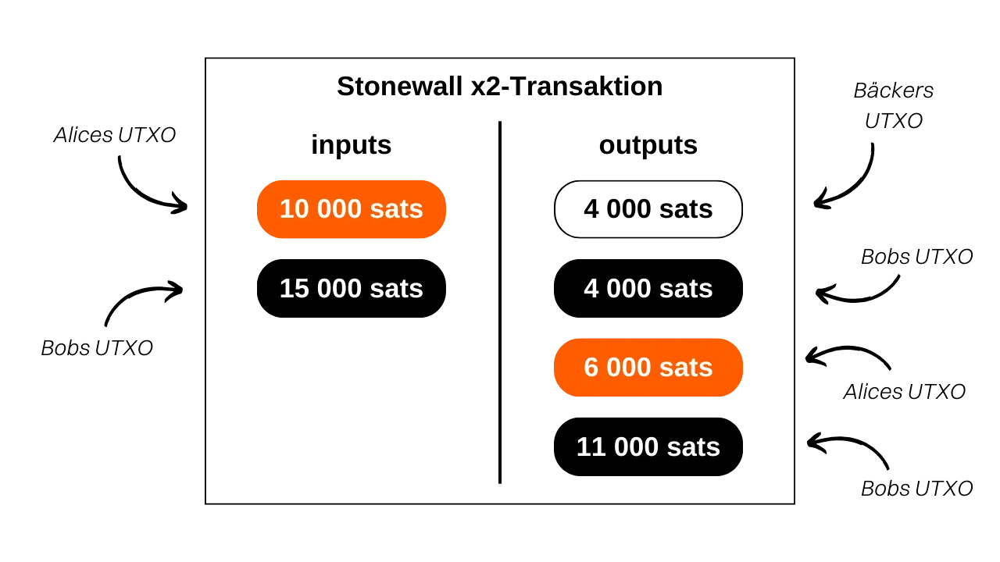
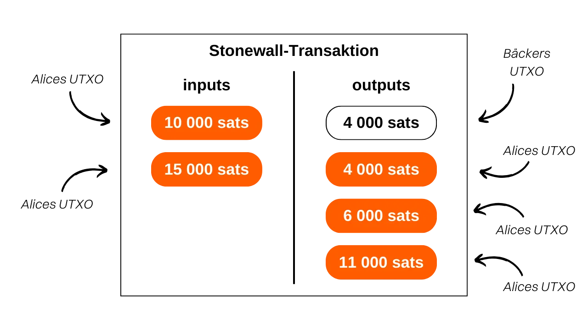

***ACHTUNG:** Nach der Verhaftung der Gründer von Samourai Wallet und der Beschlagnahme ihrer Server am 24. April funktionieren Stonewallx2-Transaktionen nur noch durch manuellen Austausch der PSBT zwischen den beteiligten Parteien, vorausgesetzt beide Benutzer sind mit ihrem eigenen Dojo verbunden. Es besteht jedoch die Möglichkeit, dass diese Werkzeuge in den kommenden Wochen wieder eingeführt werden. In der Zwischenzeit können Sie diesen Artikel konsultieren, um das theoretische Funktionieren der Stonewallx2 zu verstehen und zu lernen, wie man sie manuell durchführt.*

_Wenn Sie planen, ein Stonewallx2 manuell durchzuführen, ist das Verfahren sehr ähnlich dem in diesem Tutorial beschriebenen. Der Hauptunterschied besteht in der Auswahl des Typs der Stonewallx2-Transaktion: Statt `Online` wählen Sie `In Person / Manual`. Anschließend müssen Sie die PSBT manuell austauschen, um die Stonewallx2-Transaktion zu erstellen. Wenn Sie physisch nahe bei Ihrem Partner sind, können Sie die QR-Codes nacheinander scannen. Wenn Sie sich auf Distanz befinden, können die JSON-Dateien über einen sicheren Kommunikationskanal ausgetauscht werden. Der Rest des Tutorials bleibt unverändert._

_Wir verfolgen die Entwicklungen in diesem Fall sowie die Entwicklungen bezüglich der zugehörigen Tools genau. Seien Sie versichert, dass wir dieses Tutorial aktualisieren werden, sobald neue Informationen verfügbar sind._

_Dieses Tutorial wird nur zu Bildungs- und Informationszwecken bereitgestellt. Wir befürworten oder ermutigen die Verwendung dieser Tools zu kriminellen Zwecken nicht. Es liegt in der Verantwortung jedes Benutzers, die Gesetze in seiner Gerichtsbarkeit zu beachten._

---

> *Machen Sie aus jeder Ausgabe eine Coinjoin.*

## Was ist eine Stonewall x2 Transaktion?

Stonewall x2 ist eine spezielle Form einer Bitcoin-Transaktion, die darauf abzielt, die Privatsphäre des Benutzers während einer Ausgabe zu erhöhen, indem sie mit einer dritten Partei zusammenarbeitet, die nicht an der Ausgabe beteiligt ist. Diese Methode simuliert einen Mini-Coinjoin zwischen zwei Teilnehmern, während eine Zahlung an eine dritte Partei erfolgt. Stonewall x2 Transaktionen sind sowohl in der Samourai Wallet Anwendung als auch in der Sparrow Wallet Software verfügbar. Beide sind interoperabel.

Die Funktionsweise ist relativ einfach: Wir verwenden eine UTXO in unserem Besitz, um die Zahlung vorzunehmen, und suchen die Hilfe einer dritten Partei, die ebenfalls mit einer eigenen UTXO beiträgt. Die Transaktion führt zu vier Outputs: Zwei davon haben den gleichen Betrag, einer ist für die Adresse des Zahlungsempfängers bestimmt, der andere für eine Adresse des Mitarbeiters. Eine dritte UTXO wird an eine andere Adresse des Mitarbeiters zurückgegeben, damit er den ursprünglichen Betrag abrufen kann (eine neutrale Aktion für ihn, abzüglich der Mining-Gebühren), und eine letzte UTXO kehrt an eine Adresse zurück, die uns gehört und den Wechselbetrag der Zahlung darstellt.

Daher werden in Stonewall x2 Transaktionen drei verschiedene Rollen definiert:
- Der Absender, der die eigentliche Zahlung vornimmt;
- Der Mitarbeiter, der Bitcoins bereitstellt, um die Anonymität der Transaktion insgesamt zu verbessern und seine Mittel am Ende vollständig wiederherzustellen (eine neutrale Aktion für ihn, abzüglich der Mining-Gebühren);
- Der Empfänger, der möglicherweise nichts von der spezifischen Art der Transaktion weiß und einfach eine Zahlung vom Absender erwartet.

Lassen Sie uns ein Beispiel nehmen, um es besser zu verstehen. Alice ist in der Bäckerei, um ihr Baguette zu kaufen, das `4.000 Sats` kostet. Sie möchte mit Bitcoins bezahlen und dabei ein gewisses Maß an Privatsphäre für ihre Zahlung wahren. Sie ruft daher ihren Freund Bob an, der ihr bei diesem Prozess helfen wird.

Bei der Analyse dieser Transaktion können wir sehen, dass der Bäcker tatsächlich `4.000 Sats` als Zahlung für das Baguette erhalten hat. Alice hat `10.000 Sats` als Eingabe verwendet und `6.000 Sats` als Ausgabe erhalten, was zu einem Netto-Saldo von `-4.000 Sats` führt, was dem Preis des Baguettes entspricht. Bob hat `15.000 Sats` als Eingabe bereitgestellt und zwei Ausgaben erhalten: eine von `4.000 Sats` und eine andere von `11.000 Sats`, was zu einem Saldo von `0` führt.
In diesem Beispiel habe ich absichtlich die Mining-Gebühren vernachlässigt, um das Verständnis zu erleichtern. In der Realität werden die Transaktionsgebühren gleichmäßig zwischen dem Zahlungssender und dem Mitarbeiter geteilt.

## Was ist der Unterschied zwischen Stonewall und Stonewall x2?

Eine StonewallX2 Transaktion funktioniert genauso wie eine Stonewall Transaktion, mit dem Unterschied, dass die erstere kollaborativ ist, während die letztere es nicht ist. Wie wir gesehen haben, beinhaltet eine Stonewall x2 Transaktion die Beteiligung einer dritten Partei, die extern zur Zahlung ist und ihre Bitcoins zur Verbesserung der Transaktionsprivatsphäre bereitstellt. Bei einer typischen Stonewall Transaktion übernimmt der Absender die Rolle des Mitarbeiters.

Lassen Sie uns unser Beispiel von Alice in der Bäckerei noch einmal betrachten. Wenn sie niemanden wie Bob gefunden hätte, der sie bei ihrer Ausgabe begleitet, hätte sie alleine eine Stonewall Transaktion durchführen können. In diesem Fall wären die beiden Eingabe-UTXOs ihre eigenen gewesen und sie hätte 3 Ausgaben erhalten.

Aus externer Sicht würde sich das Transaktionsmuster nicht ändern.

Daher sollte die Logik wie folgt sein, wenn Sie ein Samourai-Ausgabewerkzeug verwenden:
- Wenn der Händler Payjoin Stowaway nicht unterstützt, kann eine kollaborative Transaktion mit einer anderen Person außerhalb der Zahlung mit Stonewall x2 durchgeführt werden.
- Wenn niemand gefunden wird, um eine Stonewall x2-Transaktion durchzuführen, kann eine Stonewall-Transaktion alleine durchgeführt werden, indem das Verhalten einer Stonewall x2-Transaktion nachgeahmt wird.
- Schließlich wäre die letzte Option, eine Transaktion mit JoinBot durchzuführen, einem von Samourai betriebenen Server, der auf Anfrage als Kollaborator in einer Stonewall x2-Transaktion fungieren kann.

Wenn Sie einen Kollaborator finden möchten, der Ihnen bei einer Stonewall X2-Transaktion behilflich ist, können Sie auch diese inoffizielle Telegramm-Gruppe besuchen, die von Samourai-Benutzern betrieben wird, um Absender und Kollaboratoren zu verbinden: [Make Every Spend a Coinjoin](https://t.me/EverySpendACoinjoin).

[**-> Erfahren Sie mehr über Stonewall-Transaktionen**](https://planb.network/tutorials/privacy/stonewall)

## Was ist der Zweck einer Stonewall x2-Transaktion?

Die Struktur einer Stonewall x2-Transaktion fügt der Transaktion eine erhebliche Menge an Entropie hinzu und verwirrt die Kettenanalyse. Aus externer Sicht kann eine solche Transaktion als kleiner Coinjoin zwischen zwei Personen interpretiert werden. In Wirklichkeit handelt es sich jedoch um eine Zahlung. Diese Methode erzeugt Unsicherheiten in der Kettenanalyse und kann sogar zu falschen Spuren führen.

Kehren wir zum Beispiel von Alice, Bob und dem Bäcker zurück. Die Transaktion in der Blockchain würde wie folgt aussehen:

Ein externer Beobachter, der sich auf gängige Kettenanalyse-Heuristiken verlässt, könnte fälschlicherweise zu dem Schluss kommen, dass "Alice und Bob einen kleinen Coinjoin durchgeführt haben, wobei jeweils eine UTXO als Eingabe und zwei UTXOs als Ausgabe vorhanden sind."
Diese Interpretation ist falsch, da, wie Sie wissen, eine UTXO an den Bäcker gesendet wurde, Alice nur eine Änderungsausgabe hat und Bob zwei.

Selbst wenn der externe Beobachter das Muster der Stonewall x2-Transaktion identifizieren kann, wird er nicht alle Informationen haben. Er wird nicht in der Lage sein zu bestimmen, welche der beiden UTXOs mit den gleichen Beträgen der Zahlung entspricht. Darüber hinaus wird er nicht wissen können, ob es Alice oder Bob ist, der die Zahlung getätigt hat. Schließlich wird er nicht feststellen können, ob die beiden Eingabe-UTXOs von zwei verschiedenen Personen stammen oder ob sie einer einzigen Person gehören, die sie zusammengeführt hat. Dieser letzte Punkt ist darauf zurückzuführen, dass klassische Stonewall-Transaktionen, über die wir oben gesprochen haben, genau dem gleichen Muster wie Stonewall x2-Transaktionen folgen. Von außen und ohne zusätzliche Informationen über den Kontext ist es unmöglich, eine Stonewall-Transaktion von einer Stonewall x2-Transaktion zu unterscheiden. Die erstgenannten sind jedoch keine kollaborativen Transaktionen, während die letzteren dies sind. Dies wirft noch mehr Zweifel an dieser Ausgabe auf.

## Wie kann eine Verbindung zwischen Paynyms hergestellt werden, um über Soroban zusammenzuarbeiten?
Wie bei anderen gemeinsamen Transaktionen auf Samourai (*Cahoots*) beinhaltet die Durchführung eines Stonewall x2 den Austausch von teilweise signierten Transaktionen zwischen dem Absender und dem Mitwirkenden. Dieser Austausch kann manuell erfolgen, wenn Sie physisch bei Ihrem Mitwirkenden sind, oder automatisch über das Soroban-Kommunikationsprotokoll.
Wenn Sie die zweite Option wählen, müssen Sie eine Verbindung zwischen den Paynyms herstellen, bevor Sie einen Stonewall x2 durchführen können. Dazu muss Ihr Paynym dem Paynym Ihres Mitwirkenden "folgen" und umgekehrt.

**Zugriff auf den Paynym des Mitwirkenden:**

Zunächst ist es erforderlich, den Zahlungscode des Paynyms Ihres Mitwirkenden zu erhalten. In der Samourai Wallet-Anwendung muss Ihr Mitwirkender auf das Symbol seines Paynyms (den kleinen Roboter) oben links auf dem Bildschirm tippen und dann auf seinen Paynym-Nickname klicken, der mit `+...` beginnt. Zum Beispiel ist meiner `+namelessmode0aF`.

Wenn Ihr Mitwirkender die Sparrow Wallet verwendet, muss er auf den Tab "Tools" klicken und dann auf "Show PayNym" klicken.
**Dem PayNym Ihres Mitwirkenden in der Samourai Wallet folgen:**

Wenn Sie die Samourai Wallet verwenden, starten Sie Ihre Anwendung und greifen Sie auf das Menü "PayNyms" auf die gleiche Weise zu. Wenn Sie Ihren PayNym zum ersten Mal verwenden, müssen Sie dessen Kennung erhalten.

Klicken Sie dann auf das blaue `+` unten rechts auf dem Bildschirm.

Sie können dann den Zahlungscode Ihres Mitwirkenden einfügen, indem Sie "PASTE PAYMENT CODE" auswählen oder die Kamera öffnen, um ihren QR-Code zu scannen, indem Sie auf "SCAN QR CODE" drücken.

Klicken Sie auf die Schaltfläche "FOLLOW".

Bestätigen Sie durch Klicken auf "YES".

Die Software bietet Ihnen dann eine Schaltfläche "CONNECT" an. Für unser Tutorial ist es nicht erforderlich, auf diese Schaltfläche zu klicken. Dieser Schritt ist nur erforderlich, wenn Sie Zahlungen an den anderen PayNym im Rahmen des [BIP47](https://planb.network/tutorials/privacy/paynym-bip47) vornehmen möchten, was nichts mit unserem Tutorial zu tun hat.

Sobald Ihr PayNym dem PayNym Ihres Mitwirkenden folgt, wiederholen Sie diesen Vorgang in umgekehrter Richtung, damit Ihr Mitwirkender Ihnen ebenfalls folgen kann. Sie können dann eine Stonewall x2-Transaktion durchführen.

**Dem PayNym Ihres Mitwirkenden in der Sparrow Wallet folgen:**

Wenn Sie die Sparrow Wallet verwenden, öffnen Sie Ihre Wallet und greifen Sie auf das Menü "Show PayNym" zu. Wenn Sie Ihren PayNym zum ersten Mal verwenden, müssen Sie durch Klicken auf "Retrieve PayNym" eine Kennung erhalten.

Geben Sie dann die PayNym-Kennung Ihres Mitwirkenden (entweder ihren Nickname '+...' oder ihren Zahlungscode 'PM...') in das Feld "Find Contact" ein und klicken Sie auf die Schaltfläche "Add Contact".

Die Software bietet Ihnen dann eine Schaltfläche "Link-Kontakt" an. Es ist nicht erforderlich, auf diese Schaltfläche zu klicken, um unser Tutorial durchzuführen. Dieser Schritt ist nur erforderlich, wenn Sie Zahlungen an den angegebenen PayNym im Rahmen des [BIP47](https://planb.network/tutorials/privacy/paynym-bip47) vornehmen möchten, was nichts mit unserem Tutorial zu tun hat.
Sobald Ihr PayNym dem PayNym Ihres Mitarbeiters folgt, wiederholen Sie diesen Vorgang in umgekehrter Richtung, damit Ihr Mitarbeiter Ihnen ebenfalls folgen kann. Sie können dann eine Stonewall x2-Transaktion durchführen.
## Wie führt man eine Stonewall x2-Transaktion auf der Samourai Wallet durch?
Wenn Sie die vorherigen Schritte zum Verbinden von Paynyms abgeschlossen haben, sind Sie endlich bereit, die Stonewall x2-Transaktion durchzuführen! Folgen Sie dazu unserem Video-Tutorial zur Samourai Wallet:

## Wie führt man eine Stonewall x2-Transaktion auf der Sparrow Wallet durch?
Wenn Sie die vorherigen Schritte zum Verbinden von Paynyms abgeschlossen haben, sind Sie endlich bereit, die Stonewall x2-Transaktion durchzuführen! Folgen Sie dazu unserem Video-Tutorial zur Sparrow Wallet:

**Externe Ressourcen:**
- https://sparrowwallet.com/docs/spending-privately.html;
- https://docs.samourai.io/en/spend-tools#stonewallx2.
