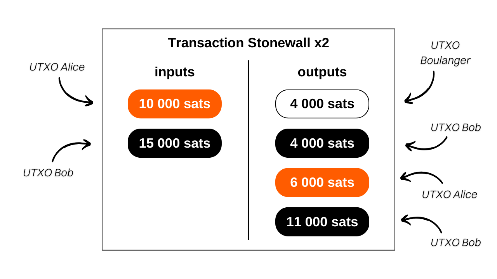
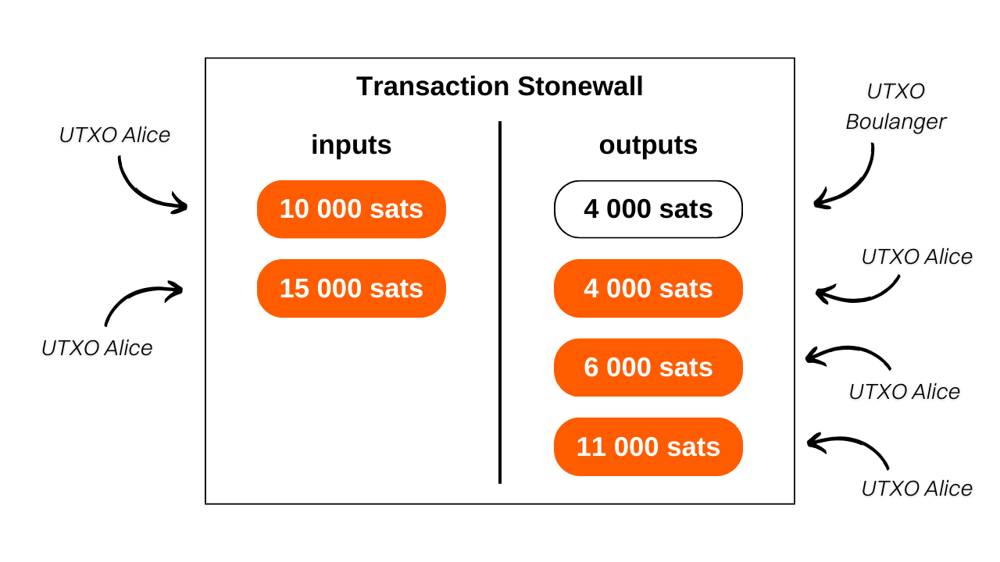
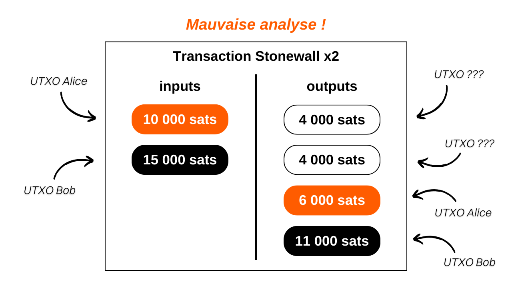
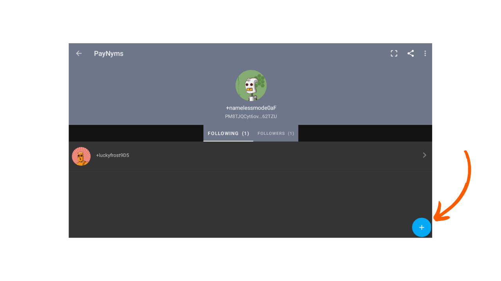

> *Make every spend a coinjoin.*

## What is a Stonewall x2 transaction?

Stonewall x2 is a specific form of Bitcoin transaction aimed at increasing user privacy during a spend, by collaborating with a third party not involved in that spend. This method simulates a mini-coinjoin between two participants, while making a payment to a third party. Stonewall x2 transactions are available on both the Samourai Wallet application and the Sparrow Wallet software. Both are interoperable.

Its operation is relatively simple: we use a UTXO in our possession to make the payment and seek the assistance of a third party who also contributes with a UTXO of their own. The transaction results in four outputs: two of them of equal amounts, one destined for the payment recipient's address, the other to an address belonging to the collaborator. A third UTXO is returned to another address of the collaborator, allowing them to retrieve the initial amount (a neutral action for them, modulo mining fees), and a final UTXO returns to an address belonging to us, which constitutes the change from the payment.

Thus, three different roles are defined in Stonewall x2 transactions:
- The sender, who makes the actual payment;
- The collaborator, who provides bitcoins to improve the overall anonymity of the transaction, while fully recovering their funds at the end (a neutral action for them, modulo mining fees);
- The recipient, who may be unaware of the specific nature of the transaction and simply expects a payment from the sender.

Let's take an example to better understand. Alice is at the bakery to buy her baguette, which costs `4,000 sats`. She wants to pay in bitcoins while maintaining a certain level of privacy for her payment. She therefore calls upon her friend Bob, who will assist her in this process.

By analyzing this transaction, we can see that the baker did indeed receive `4,000 sats` as payment for the baguette. Alice used `10,000 sats` as input and received `6,000 sats` as output, resulting in a net balance of `-4,000 sats`, which corresponds to the price of the baguette. As for Bob, he provided `15,000 sats` as input and received two outputs: one of `4,000 sats` and the other of `11,000 sats`, resulting in a balance of `0`.
In this example, I intentionally neglected mining fees to facilitate understanding. In reality, transaction fees are shared equally between the payment sender and the collaborator.

## What is the difference between Stonewall and Stonewall x2?

A StonewallX2 transaction works exactly like a Stonewall transaction, except that the former is collaborative while the latter is not. As we have seen, a Stonewall x2 transaction involves the participation of a third party, who is external to the payment, and who will provide their bitcoins to enhance transaction privacy. In a typical Stonewall transaction, the role of the collaborator is taken by the sender.

Let's revisit our example of Alice at the bakery. If she couldn't find someone like Bob to accompany her in her expense, she could have done a Stonewall transaction alone. Thus, the two input UTXOs would have been hers, and she would have received 3 at the output.

From an external point of view, the transaction pattern would have remained the same.

Therefore, the logic should be as follows when using a Samourai spending tool:
- If the merchant does not support Payjoin Stowaway, a collaborative transaction can be done with another person external to the payment using Stonewall x2.
- If no one is found to do a Stonewall x2 transaction, a Stonewall transaction can be done alone, mimicking the behavior of a Stonewall x2 transaction.
- Finally, the last option would be to make a transaction with JoinBot, a server maintained by Samourai, which can, upon request, act as the collaborator in a Stonewall x2 transaction.

If you want to find a collaborator who is willing to assist you in a Stonewall X2 transaction, you can also visit this Telegram group (unofficial) maintained by Samourai users to connect senders and collaborators: [Make Every Spend a Coinjoin](https://t.me/EverySpendACoinjoin).

## What is the purpose of a Stonewall x2 transaction?

The Stonewall x2 structure adds a significant amount of entropy to the transaction and confuses chain analysis. From the outside, such a transaction can be interpreted as a small Coinjoin between two individuals. But in reality, it is a payment. This method generates uncertainties in chain analysis, and even leads to false leads.

Let's go back to the example of Alice, Bob, and the Baker. The transaction on the blockchain would look like this:

An external observer relying on common chain analysis heuristics might mistakenly conclude that "Alice and Bob performed a small coinjoin, with one UTXO each as input and two UTXOs each as output."
This interpretation is incorrect because, as you know, a UTXO was sent to the Baker, Alice only has one change output, and Bob has two.

Even if the external observer manages to identify the pattern of the Stonewall x2 transaction, they will not have all the information. They will not be able to determine which of the two UTXOs of the same amounts corresponds to the payment. Furthermore, they will not be able to know if it is Alice or Bob who made the payment. Finally, they will not be able to determine if the two input UTXOs come from two different people or if they belong to a single person who merged them. This last point is due to the fact that classic Stonewall transactions, which we discussed above, follow exactly the same pattern as Stonewall x2 transactions. From the outside and without additional information about the context, it is impossible to differentiate a Stonewall transaction from a Stonewall x2 transaction. However, the former are not collaborative transactions, while the latter are. This adds even more doubts about this expense.

## How to establish a connection between Paynyms to be able to collaborate via Soroban?

As with other collaborative transactions on Samourai (*Cahoots*), performing a Stonewall x2 involves the exchange of partially signed transactions between the sender and the collaborator. This exchange can be done manually, in case you are physically with your collaborator, or automatically through the Soroban communication protocol.

If you choose the second option, you will need to establish a connection between Paynyms before being able to perform a Stonewall x2. To do this, your Paynym must "follow" your collaborator's Paynym, and vice versa.

**Accessing the collaborator's Paynym:**

To start, it is necessary to obtain the payment code of your collaborator's Paynym. In the Samourai Wallet application, your collaborator must press the icon of their Paynym (the little robot) located at the top left of the screen, then click on their Paynym nickname, starting with `+...`. For example, mine is `+namelessmode0aF`.

If your collaborator is using Sparrow Wallet, they should click on the 'Tools' tab, then on 'Show PayNym'.
**Following your collaborator's PayNym from Samourai Wallet:**

If you are using Samourai Wallet, launch the application and access the 'PayNyms' menu in the same way. If this is your first time using your PayNym, you will need to obtain its identifier.

Then click on the blue '+' at the bottom right of the screen.

You can then paste your collaborator's payment code by selecting 'PASTE PAYMENT CODE', or open the camera to scan their QR code by pressing 'SCAN QR CODE'.

Click on the 'FOLLOW' button.

Confirm by clicking 'YES'.

The software will then offer you a 'CONNECT' button. It is not necessary to click on this button for our tutorial. This step is only required if you plan to make payments to the other PayNym as part of the [BIP47](https://planb.network/tutorials/privacy/paynym-bip47), which is unrelated to our tutorial.

Once your PayNym is following your collaborator's PayNym, repeat this process in the opposite direction so that your collaborator can also follow you. You can then perform a Stonewall x2 transaction.

**Following your collaborator's PayNym from Sparrow Wallet:**

If you are using Sparrow Wallet, open your wallet and access the 'Show PayNym' menu. If you are using your PayNym for the first time, you will need to obtain an identifier by clicking on 'Retrieve PayNym'.

Then enter your collaborator's PayNym identifier (either their nickname '+...' or their payment code 'PM...') in the 'Find Contact' box, and click on the 'Add Contact' button.

The software will then offer you a 'Link Contact' button. It is not necessary to click on this button for our tutorial. This step is only required if you plan to make payments to the indicated PayNym as part of the [BIP47](https://planb.network/tutorials/privacy/paynym-bip47), which is unrelated to our tutorial.

Once your PayNym is following your collaborator's PayNym, repeat this process in the opposite direction so that your collaborator can also follow you. You can then perform a Stonewall x2 transaction.
## How to make a Stonewall x2 transaction on Samourai Wallet?

If you have completed the previous steps of connecting Paynyms, you are finally ready to make the Stonewall x2 transaction! To do this, follow our video tutorial on Samourai Wallet:

## How to make a Stonewall x2 transaction on Sparrow Wallet?

If you have completed the previous steps of connecting Paynyms, you are finally ready to make the Stonewall x2 transaction! To do this, follow our video tutorial on Sparrow Wallet:

**External resources:**
- https://sparrowwallet.com/docs/spending-privately.html;
- https://docs.samourai.io/en/spend-tools#stonewallx2.
