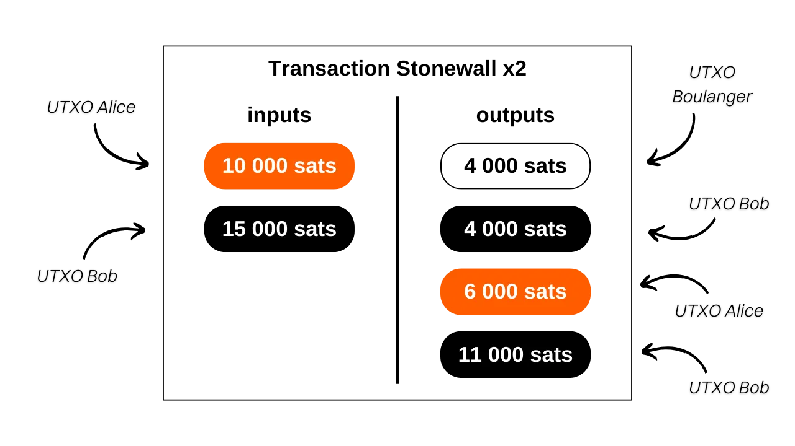

> *Make every spend a coinjoin.*

## C'est quoi une transaction Stonewall x2 ?

Stonewall x2 est une forme spécifique de transaction Bitcoin visant à accroître la confidentialité des utilisateurs lors d'une dépense, par la collaboration avec une tierce personne non impliquée dans cette dépense. Cette méthode simule un mini-coinjoin entre deux participants, tout en effectuant un paiement à une troisième partie. Les transactions Stonewall x2 sont disponibles à la fois sur l'application Samourai Wallet et sur le logiciel Sparrow Wallet. Les deux sont interopérables.

Son fonctionnement est relativement simple : on utilise un UTXO en notre possession pour effectuer le paiement et on sollicite l'aide d'une tierce personne qui contribue également avec un UTXO lui appartenant. La transaction se solde avec quatre outputs : deux d'entre eux de montants égaux, l'un destiné à l'adresse du bénéficiaire du paiement, l'autre à une adresse appartenant au collaborateur. Un troisième UTXO est renvoyé à une autre adresse du collaborateur, lui permettant de récupérer le montant initial (une action neutre pour lui, modulo les frais de minage), et un dernier UTXO revient à une adresse nous appartenant, qui constitue le change du paiement.

On définit ainsi trois rôles différents dans les transactions Stonewall x2 :
- L'émetteur, qui réalise le paiement effectif ;
- Le collaborateur, qui met des bitcoins à disposition afin d'améliorer l'ensemble d'anonymat de la transaction, tout en récupérant intégralement ses fonds à la fin (une action neutre pour lui, modulo les frais de minage) ;
- Le destinataire, qui peut ignorer la nature spécifique de la transaction et attend simplement un paiement de la part de l'émetteur.

Prenons un exemple pour bien comprendre. Alice est chez le boulanger pour acheter sa baguette de pain qui coûte `4 000 sats`. Elle souhaite payer en bitcoins tout en conservant une certaine forme de confidentialité sur son paiement. Elle fait donc appel à son ami Bob, qui va l'aider dans cette démarche.

En analysant cette transaction, on peut voir que le boulanger a effectivement reçu `4 000 sats` en paiement pour la baguette. Alice a utilisé `10 000 sats` en input et a récupéré `6 000 sats` en output, soit un solde net de `-4 000 sats`, ce qui correspond au prix de la baguette. Quant à Bob, il a fourni `15 000 sats` en input et a reçu deux outputs : l'un de `4 000 sats` et l'autre de `11 000 sats`, ce qui fait bien un solde de `0`. 

Dans cet exemple, j'ai intentionnellement négligé les frais de minage afin de faciliter la compréhension. En réalité, les frais de transaction sont partagés à parts égales entre l'émetteur du paiement et le collaborateur.

## Quelle est la différence entre Stonewall et Stonewall x2 ?

Une transaction StonewallX2 fonctionne exactement comme une transaction Stonewall, à la différence près que la première est collaborative, alors que la seconde non. Comme nous l'avons vu, une transaction Stonewall x2 implique la participation d'une tierce personne, qui est extérieure au paiement, et qui va mettre à disposition ses bitcoins pour améliorer la confidentialité de la transaction. Dans une transaction Stonewall classique, le rôle du collaborateur est pris par l'émetteur. 

Reprenons notre exemple d'Alice à la boulangerie. Si elle n'avait pas pu trouver une personne comme Bob pour l'accompagner dans sa dépense, elle aurait pu faire un Stonewall toute seule. Ainsi, les deux UTXO en entrée auraient été les siens, et elle en aurait récupéré 3 à la sortie. 

D'un point de vue extérieur, le paterne de la transaction serait resté le même.

La logique devrait donc être la suivante lorsque l'on souhaite utiliser un outil de dépense Samourai :
- Si le commerçant ne prend pas en charge les Payjoin Stowaway, on peut faire une transaction collaborative avec une autre personne extérieure au paiement grâce aux Stonewall x2 ;
- Si l'on ne trouve personne pour faire une transaction Stonewall x2, on peut faire une transaction Stonewall seul, qui va mimer le comportement d'une transaction Stonewall x2 ;
- Enfin, la dernière possibilité serait de faire une transaction avec JoinBot, un serveur tenu par Samourai, qui peut, à la demande, jouer le rôle du collaborateur dans une transaction Stonewall x2.

Si vous souhaitez trouver un collaborateur qui voudra bien vous assister dans une transaction Stonewall X2, vous pouvez également aller faire un tour sur ce groupe Telegram (non officiel) maintenu par des utilisateurs de Samourai pour faire rencontrer émetteurs et collaborateurs : [Make Every Spend a Coinjoin](https://t.me/EverySpendACoinjoin).

[**-> En savoir plus sur les transactions Stonewall**](https://planb.network/tutorials/privacy/stonewall)

## Quelle est l'utilité d'une transaction Stonewall x2 ?

La structure Stonewall x2 ajoute énormément d'entropie à la transaction et vient brouiller les pistes de l'analyse de chaîne. Vue de l'extérieur, une telle transaction peut être interprétée comme un petit Coinjoin entre deux personnes. Mais en réalité, il s'agit d'un paiement. Cette méthode génère donc des incertitudes dans l'analyse de chaîne, voire oriente vers de fausses pistes.

Reprenons l'exemple d'Alice, Bob et le Boulanger. La transaction sur la blockchain se présenterait ainsi :

Un observateur extérieur qui s'appuie sur les heuristiques courantes d'analyse de chaîne pourrait conclure à tort que « _Alice et Bob ont réalisé un petit coinjoin, avec un UTXO chacun en entrée et deux UTXO chacun en sortie_ ».

Cette interprétation est inexacte, car, comme vous le savez, un UTXO a été envoyé au Boulanger, Alice n'a qu'un output de change, et Bob en a deux.

Même si l'observateur extérieur parvient à identifier le paterne de la transaction Stonewall x2, il ne disposera pas de toutes les informations. Il ne pourra pas déterminer lequel des deux UTXO de mêmes montants correspond au paiement. De plus, il ne sera pas en mesure de savoir si c'est Alice ou Bob qui a effectué le paiement. Enfin, il ne pourra pas déterminer si les deux UTXO en entrée proviennent de deux personnes différentes ou s'ils appartiennent à une seule personne qui les a fusionnés. Ce dernier point est dû au fait que les transactions Stonewall classiques, dont nous avons parlé au-dessus, suivent exactement le même paterne que les transactions Stonewall x2. Vu de l'extérieur et sans informations supplémentaires sur le contexte, il est impossible de différencier une transaction Stonewall d'une transaction Stonewall x2. Or, les premières ne sont pas des transactions collaboratives, alors que les secondes le sont. Cela permet d'ajouter encore plus de doutes sur cette dépense.

## Comment établir une connexion entre Paynyms pour pouvoir faire des Cahoots via Soroban ?

Comme pour les autres transactions collaboratives sur Samourai (*Cahoots*), la réalisation d'un Stonewall x2 implique l'échange de transactions partiellement signées entre l'émetteur et le collaborateur. Cet échange peut s'effectuer manuellement, dans le cas où vous vous trouvez physiquement avec votre collaborateur, ou automatiquement grâce au protocole de communication Soroban. 

Si vous choisissez la seconde option, vous allez devoir établir une connexion entre Paynyms avant de pouvoir effectuer un Stonewall x2. Pour ce faire, votre Paynym doit « *suivre* » le Paynym de votre collaborateur, et vice-versa.

**Accéder au Paynym du collaborateur :**

Pour commencer, il est nécessaire d'obtenir le code de paiement du Paynym de votre collaborateur. Dans l'application Samourai Wallet, votre collaborateur doit appuyer sur l'icône de son Paynym (le petit robot) située en haut à gauche de l'écran, puis cliquer sur son surnom de Paynym, commençant par `+...`. Par exemple, le mien est `+namelessmode0aF`. 

Si votre collaborateur utilise Sparrow Wallet, il doit cliquer sur l'onglet `Tools`, puis sur `Show PayNym`.

**Suivre le Paynym du collaborateur depuis Samourai Wallet :**

Si de votre côté, vous êtes sur Samourai Wallet, lancez votre application et accédez au menu `PayNyms` de la même manière. Si c'est la première utilisation de votre Paynym, vous devrez en obtenir l'identifiant.

Cliquez ensuite sur le `+` bleu en bas à droite de l'écran.

Vous pouvez alors coller le code de paiement de votre collaborateur en sélectionnant `COLLER LE CODE PAIEMENT`, ou ouvrir la caméra pour scanner son code QR en appuyant sur `SCANNEZ LE CODE QR`.

Cliquez sur le bouton `SUIVRE`.

Validez en cliquant sur `YES`.

Le logiciel vous proposera alors un bouton `SE CONNECTER`. Il n'est pas nécessaire de cliquer sur ce bouton pour notre tutoriel. Cette étape est obligatoire uniquement si vous envisagez d'effectuer des paiements vers l'autre Paynym dans le cadre du [BIP47](https://planb.network/tutorials/privacy/paynym-bip47), ce qui n'a rien à voir avec notre tutoriel.

Une fois le Paynym du collaborateur suivi par votre Paynym, refaites cette opération dans l'autre sens afin que votre collaborateur vous suive également. Vous pourrez ensuite effectuer une transaction Stonewall x2.

**Suivre le Paynym du collaborateur depuis Sparrow Wallet :**

Si de votre côté, vous êtes sur Sparrow Wallet, ouvrez votre portefeuille et accédez au menu `Show PayNym`. Si vous utilisez votre Paynym pour la première fois, il vous faudra obtenir un identifiant en cliquant sur `Retrieve PayNym`.

Saisissez ensuite l'identifiant du Paynym de votre collaborateur (soit son surnom `+...`, soit son code de paiement `PM...`) dans la case `Find Contact`, puis cliquez sur le bouton `Add Contact`.

Le logiciel vous proposera alors un bouton `Link Contact`. Il n'est pas nécessaire de cliquer sur ce bouton pour notre tutoriel. Cette étape est obligatoire uniquement si vous envisagez d'effectuer des paiements vers le Paynym indiqué dans le cadre du [BIP47](https://planb.network/tutorials/privacy/paynym-bip47), ce qui n'a rien à voir avec notre tutoriel.

Une fois le Paynym du collaborateur suivi par votre Paynym, refaites cette opération dans l'autre sens afin que votre collaborateur vous suive également. Vous pourrez ensuite effectuer une transaction Stonewall x2.

## Comment faire une transaction Stonewall x2 sur Samourai Wallet ?

Si vous avez réalisé les étapes préalables de connexion des Paynyms, vous êtes enfin prêt pour réaliser la transaction Stonewall x2 ! Pour ce faire, suivez notre tutoriel vidéo sur Samourai Wallet :

## Comment faire une transaction Stonewall x2 sur Sparrow Wallet ?

Si vous avez réalisé les étapes préalables de connexion des Paynyms, vous êtes enfin prêt pour réaliser la transaction Stonewall x2 ! Pour ce faire, suivez notre tutoriel vidéo sur Sparrow Wallet :

**Ressources externes :** 
- https://sparrowwallet.com/docs/spending-privately.html ;
- https://docs.samourai.io/en/spend-tools#stonewallx2.
