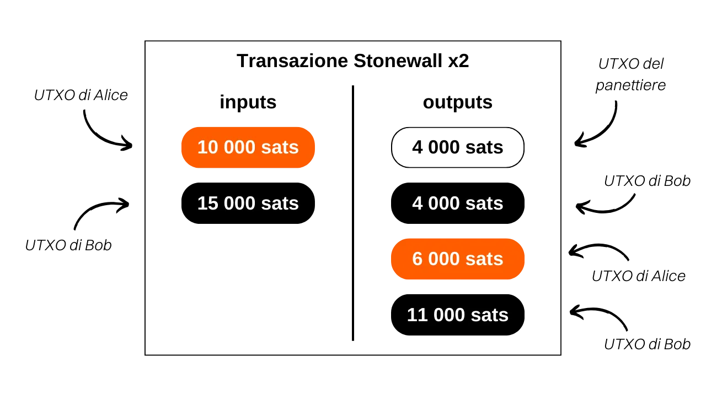
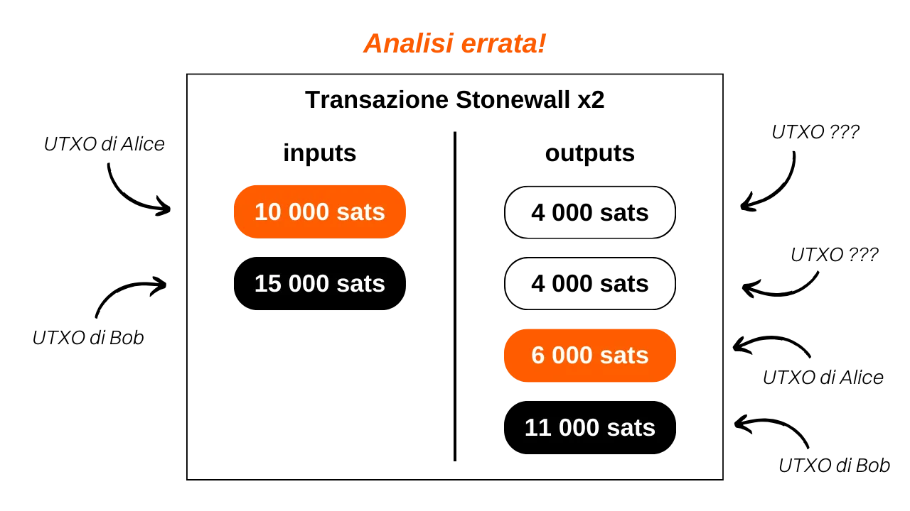

***ATTENZIONE:** In seguito all'arresto dei fondatori di Samourai Wallet e al sequestro dei loro server il 24 aprile, le transazioni Stonewallx2 funzionano solo scambiando manualmente i PSBT tra le parti coinvolte, a condizione che entrambi gli utenti siano connessi al proprio Dojo. Tuttavia, è possibile che questi strumenti vengano rilanciati nelle prossime settimane. Nel frattempo, potete consultare questo articolo per comprendere il funzionamento teorico delle Stonewallx2 e imparare a eseguirle manualmente.*

_Se prevedete di effettuare una Stonewallx2 manualmente, la procedura è molto simile a quella descritta in questo tutorial. La principale differenza risiede nella scelta del tipo di transazione Stonewallx2: invece di selezionare `Online`, cliccate su `In Person / Manual`. Successivamente, dovrete scambiare manualmente i PSBT per costruire la transazione Stonewallx2. Se siete fisicamente vicini al vostro collaboratore, potete scansionare i codici QR successivamente. Se siete a distanza, i file JSON possono essere scambiati tramite un canale di comunicazione sicuro. Il resto del tutorial rimane invariato._

_Stiamo seguendo da vicino l'evoluzione di questo caso così come gli sviluppi relativi agli strumenti associati. Siate certi che aggiorneremo questo tutorial non appena saranno disponibili nuove informazioni._

_Questo tutorial è fornito solo a scopo educativo e informativo. Non approviamo né incoraggiamo l'uso di questi strumenti per scopi criminali. È responsabilità di ogni utente rispettare le leggi vigenti nella propria giurisdizione._

---

> *Rendi ogni spesa un coinjoin.*

## Cosa è una transazione Stonewall x2?

Stonewall x2 è una forma specifica di transazione Bitcoin che mira ad aumentare la privacy dell'utente durante una spesa, collaborando con una terza parte non coinvolta nella spesa stessa. Questo metodo simula un mini-coinjoin tra due partecipanti, effettuando contemporaneamente un pagamento a una terza parte. Le transazioni Stonewall x2 sono disponibili sia sull'applicazione Samourai Wallet che sul software Sparrow Wallet. Entrambi sono interoperabili.

Il suo funzionamento è relativamente semplice: utilizziamo un UTXO in nostro possesso per effettuare il pagamento e chiediamo l'assistenza di una terza parte che contribuisce con un proprio UTXO. La transazione produce quattro output: due di essi di importi uguali, uno destinato all'indirizzo del destinatario del pagamento, l'altro a un indirizzo appartenente al collaboratore. Un terzo UTXO viene restituito a un altro indirizzo del collaboratore, consentendogli di recuperare l'importo iniziale (un'azione neutrale per loro, al netto delle commissioni di mining), e un ultimo UTXO ritorna a un indirizzo appartenente a noi, che costituisce il resto del pagamento.

Così, tre ruoli diversi sono definiti nelle transazioni Stonewall x2:
- Il mittente, che effettua il pagamento effettivo;
- Il collaboratore, che fornisce bitcoin per migliorare l'anonimato complessivo della transazione, recuperando completamente i propri fondi alla fine (un'azione neutrale per loro, al netto delle commissioni di mining);
- Il destinatario, che potrebbe non essere a conoscenza della natura specifica della transazione e si aspetta semplicemente un pagamento dal mittente.

Prendiamo un esempio per comprendere meglio. Alice è in panetteria per comprare la sua baguette, che costa `4.000 sats`. Vuole pagare in bitcoin mantenendo un certo livello di privacy per il suo pagamento. Chiama quindi il suo amico Bob, che la assisterà in questo processo.

Analizzando questa transazione, possiamo vedere che il panettiere ha effettivamente ricevuto `4.000 sats` come pagamento per la baguette. Alice ha utilizzato `10.000 sats` come input e ha ricevuto `6.000 sats` come output, risultando in un saldo netto di `-4.000 sats`, che corrisponde al prezzo della baguette. Per quanto riguarda Bob, ha fornito `15.000 sats` come input e ha ricevuto due output: uno di `4.000 sats` e l'altro di `11.000 sats`, risultando in un saldo di `0`.
In questo esempio, ho intenzionalmente trascurato le commissioni di mining per facilitare la comprensione. In realtà, le commissioni di transazione sono divise equamente tra il mittente del pagamento e il collaboratore.

## Qual è la differenza tra Stonewall e Stonewall x2?

Una transazione Stonewall x2 funziona esattamente come una transazione Stonewall, tranne che la prima è collaborativa mentre la seconda non lo è. Come abbiamo visto, una transazione Stonewall x2 prevede la partecipazione di una terza parte, esterna al pagamento, che fornirà i suoi bitcoin per migliorare la privacy della transazione. In una tipica transazione Stonewall, il ruolo del collaboratore è assunto dal mittente.

Riprendiamo il nostro esempio di Alice in panetteria. Se non avesse trovato qualcuno come Bob per accompagnarla nella sua spesa, avrebbe potuto fare una transazione Stonewall da sola. Così, i due UTXO di input sarebbero stati suoi e ne avrebbe ricevuti 3 in output.

Da una prospettiva esterna, il modello di transazione sarebbe rimasto lo stesso.

Pertanto, la logica dovrebbe essere la seguente quando si utilizza uno strumento di spesa Samourai:
- Se il commerciante non supporta Payjoin Stowaway, è possibile effettuare una transazione collaborativa con un'altra persona esterna al pagamento utilizzando Stonewall x2.
- Se non si trova nessuno per effettuare una transazione Stonewall x2, è possibile effettuare una transazione Stonewall da soli, imitando il comportamento di una transazione Stonewall x2.
- Infine, l'ultima opzione sarebbe effettuare una transazione con JoinBot, un server mantenuto da Samourai, che può, su richiesta, agire come collaboratore in una transazione Stonewall x2.

Se si desidera trovare un collaboratore disposto ad assistere in una transazione Stonewall X2, è possibile visitare anche questo gruppo Telegram (non ufficiale) mantenuto dagli utenti di Samourai per connettere mittenti e collaboratori: [Make Every Spend a Coinjoin](https://t.me/EverySpendACoinjoin).

[**-> Scopri di più sulle transazioni Stonewall**](https://planb.network/tutorials/privacy/stonewall)

## Qual è lo scopo di una transazione Stonewall x2?

La struttura Stonewall x2 aggiunge una quantità significativa di entropia alla transazione e confonde l'analisi della blockchain. Da una prospettiva esterna, una simil transazione può essere interpretata come una piccola Coinjoin tra due individui. Ma in realtà, si tratta di un pagamento. Questo metodo genera incertezze nell'analisi della blockchain e può persino portare a piste false.

Torniamo all'esempio di Alice, Bob e il panettiere. La transazione sulla blockchain apparirebbe così:

Un osservatore esterno che si basa su euristiche comuni di analisi della blockchain potrebbe erroneamente concludere che "Alice e Bob hanno effettuato una piccola coinjoin, con un UTXO ciascuno come input e due UTXO ciascuno come output."
Questa interpretazione è errata perché, come sapete, è stato inviato un UTXO al panettiere, Alice ha solo un output di resto e Bob ne ha due.

Anche se l'osservatore esterno riesce a identificare il pattern della transazione Stonewall x2, non avrà tutte le informazioni. Non sarà infatti in grado di determinare quale dei due UTXO delle stesse quantità corrisponde al pagamento. Inoltre, non sarà in grado di sapere se è Alice o Bob a effettuare il pagamento. Infine, non sarà in grado di determinare se i due input UTXO provengono da due persone diverse o se appartengono a una singola persona che li ha uniti. Quest'ultimo punto è dovuto al fatto che le transazioni Stonewall classiche, di cui abbiamo parlato in precedenza, seguono esattamente lo stesso pattern delle transazioni Stonewall x2. Dall'esterno e senza informazioni aggiuntive sul contesto, è impossibile differenziare una transazione Stonewall da una transazione Stonewall x2. Tuttavia, le prime non sono transazioni collaborative, mentre le seconde lo sono. Questo aggiunge ancora più dubbi su questa spesa.

## Come stabilire una connessione tra Paynym per poter collaborare tramite Soroban?
Come con altre transazioni collaborative su Samourai (*Cahoots*), eseguire una Stonewall x2 comporta lo scambio di transazioni parzialmente firmate tra il mittente e il collaboratore. Questo scambio può essere fatto manualmente, nel caso in cui tu sia fisicamente con il tuo collaboratore, o automaticamente tramite il protocollo di comunicazione Soroban.
Se scegli la seconda opzione, dovrai stabilire una connessione tra i Paynym prima di poter eseguire una Stonewall x2. Per fare ciò, il tuo Paynym deve "seguire" il Paynym del tuo collaboratore, e viceversa.

**Accedere al Paynym del collaboratore:**

Per iniziare, è necessario ottenere il codice di pagamento del Paynym del tuo collaboratore. Nell'applicazione Samourai Wallet, il tuo collaboratore deve toccare l'icona del loro Paynym (il piccolo robot) situata in alto a sinistra dello schermo, e quindi fare clic sul loro nickname Paynym, che inizia con `+...`. Ad esempio, il mio è `+namelessmode0aF`.

Se il tuo collaboratore sta usando Sparrow Wallet, deve fare clic sulla scheda 'Strumenti', quindi su 'Mostra PayNym'.
**Seguire il PayNym del collaboratore da Samourai Wallet:**

Se stai usando Samourai Wallet, avvia l'applicazione e accedi al menu 'PayNyms' allo stesso modo. Se è la prima volta che usi il tuo PayNym, dovrai ottenere il suo identificatore.

Quindi fai clic sul pulsante blu `+` in basso a destra dello schermo.

Puoi quindi incollare il codice di pagamento del tuo collaboratore selezionando 'INCOLLA CODICE DI PAGAMENTO', o aprire la fotocamera per scannerizzare il loro codice QR premendo 'SCANSIONA CODICE QR'.

Fai clic sul pulsante 'SEGUI'.

Conferma facendo clic su 'SI'.

Il software ti offrirà quindi un pulsante 'CONNETTI'. Non è necessario fare clic su questo pulsante per il nostro tutorial. Questo passaggio è richiesto solo se hai intenzione di effettuare pagamenti all'altro PayNym nell'ambito di BIP47, che non è correlato al nostro tutorial.

Una volta che il tuo PayNym sta seguendo il PayNym del tuo collaboratore, ripeti questo processo in direzione opposta in modo che anche il tuo collaboratore possa seguirti. A questo punto puoi eseguire una transazione Stonewall x2.

**Seguire il PayNym del collaboratore da Sparrow Wallet:**

Se stai usando Sparrow Wallet, apri il tuo portafoglio e accedi al menu 'Mostra PayNym'. Se stai usando il tuo PayNym per la prima volta, dovrai ottenere un identificatore facendo clic su 'Recupera PayNym'.

Quindi inserisci l'identificatore del PayNym del tuo collaboratore (sia il loro nickname '+...' che il loro codice di pagamento 'PM...') nella casella 'Trova contatto' e fai clic sul pulsante 'Aggiungi contatto'.

Il software ti offrirà quindi un pulsante "Link Contatto". Non è necessario fare clic su questo pulsante per il nostro tutorial. Questo passaggio è richiesto solo se hai intenzione di effettuare pagamenti al PayNym indicato come parte di BIP47, che non è correlato al nostro tutorial.
Una volta che il tuo PayNym sta seguendo il PayNym del tuo collaboratore, ripeti questo processo nella direzione opposta in modo che anche il tuo collaboratore possa seguirti. Puoi quindi effettuare una transazione Stonewall x2.
## Come effettuare una transazione Stonewall x2 su Samourai Wallet?
Se hai completato i passaggi precedenti per collegare i PayNym, sei finalmente pronto per effettuare la transazione Stonewall x2! Per farlo, segui il nostro tutorial video su Samourai Wallet:

## Come effettuare una transazione Stonewall x2 su Sparrow Wallet?
Se hai completato i passaggi precedenti per collegare i PayNym, sei finalmente pronto per effettuare la transazione Stonewall x2! Per farlo, segui il nostro tutorial video su Sparrow Wallet:

**Risorse esterne:**
- https://sparrowwallet.com/docs/spending-privately.html;
- https://docs.samourai.io/en/spend-tools#stonewallx2.
