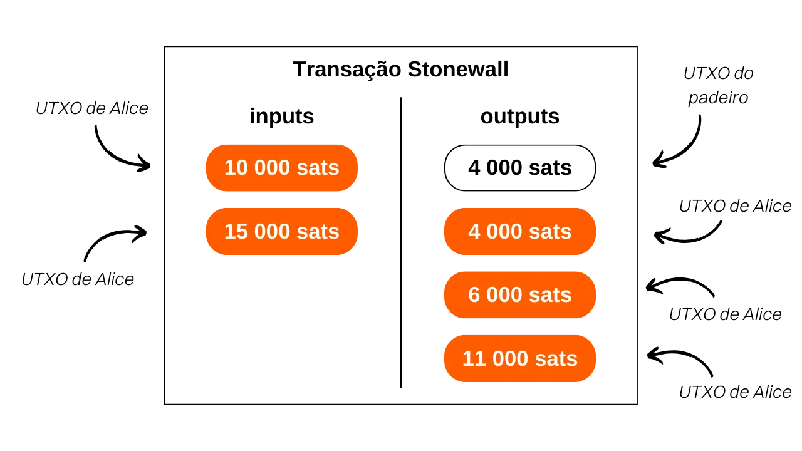
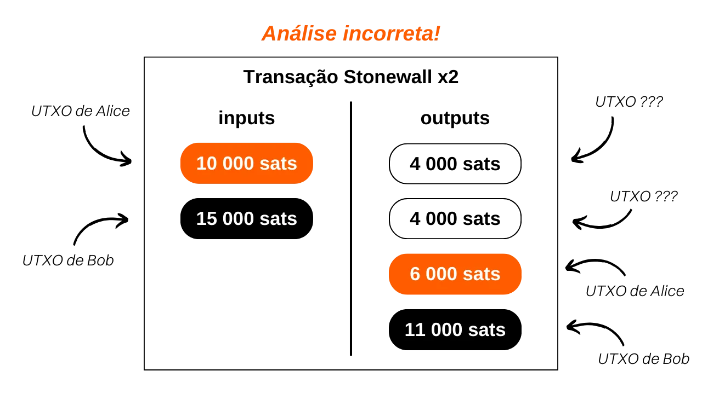

***ATENÇÃO:** Após a prisão dos fundadores da Samourai Wallet e a apreensão dos seus servidores em 24 de abril, as transações Stonewallx2 só funcionam trocando manualmente os PSBT entre as partes envolvidas, desde que ambos os usuários estejam conectados ao seu próprio Dojo. No entanto, é possível que essas ferramentas sejam reativadas nas próximas semanas. Enquanto isso, você pode consultar este artigo para entender o funcionamento teórico das Stonewallx2 e aprender a realizá-las manualmente.*

_Se você planeja realizar um Stonewallx2 manualmente, o procedimento é muito semelhante ao descrito neste tutorial. A principal diferença está na escolha do tipo de transação Stonewallx2: em vez de selecionar `Online`, clique em `In Person / Manual`. Em seguida, você precisará trocar manualmente os PSBT para construir a transação Stonewallx2. Se você está fisicamente próximo ao seu colaborador, você pode escanear os códigos QR successivamente. Se você está à distância, os arquivos JSON podem ser trocados através de um canal de comunicação seguro. O resto do tutorial permanece inalterado._

_Estamos acompanhando de perto a evolução deste caso, bem como os desenvolvimentos relacionados às ferramentas associadas. Fique assegurado de que atualizaremos este tutorial à medida que novas informações estiverem disponíveis._

_Este tutorial é fornecido apenas para fins educativos e informativos. Não endossamos nem encorajamos o uso dessas ferramentas para fins criminosos. É responsabilidade de cada usuário cumprir as leis em sua jurisdição._

---

> *Faça de cada gasto uma coinjoin.*

## O que é uma transação Stonewall x2?

Stonewall x2 é uma forma específica de transação Bitcoin que visa aumentar a privacidade do usuário durante um gasto, colaborando com uma terceira parte não envolvida no gasto. Este método simula uma mini-coinjoin entre dois participantes, enquanto faz um pagamento para uma terceira parte. As transações Stonewall x2 estão disponíveis tanto no aplicativo Samourai Wallet quanto no software Sparrow Wallet. Ambos são interoperáveis.

Sua operação é relativamente simples: usamos uma UTXO em nossa posse para fazer o pagamento e buscamos a assistência de uma terceira parte que também contribui com uma UTXO própria. A transação resulta em quatro saídas: duas delas de valores iguais, uma destinada ao endereço do destinatário do pagamento e a outra a um endereço pertencente ao colaborador. Uma terceira UTXO é devolvida a outro endereço do colaborador, permitindo que ele recupere o valor inicial (uma ação neutra para ele, módulo taxas de mineração), e uma última UTXO retorna a um endereço pertencente a nós, que constitui o troco do pagamento.

Assim, três papéis diferentes são definidos nas transações Stonewall x2:
- O remetente, que faz o pagamento real;
- O colaborador, que fornece bitcoins para melhorar a anonimidade geral da transação, enquanto recupera totalmente seus fundos no final (uma ação neutra para ele, módulo taxas de mineração);
- O destinatário, que pode não estar ciente da natureza específica da transação e simplesmente espera um pagamento do remetente.

Vamos pegar um exemplo para entender melhor. Alice está na padaria para comprar sua baguete, que custa `4.000 sats`. Ela quer pagar em bitcoins mantendo um certo nível de privacidade para seu pagamento. Portanto, ela pede ajuda ao seu amigo Bob, que a auxiliará nesse processo.

Ao analisar essa transação, podemos ver que o padeiro realmente recebeu `4.000 sats` como pagamento pela baguete. Alice usou `10.000 sats` como entrada e recebeu `6.000 sats` como saída, resultando em um saldo líquido de `-4.000 sats`, que corresponde ao preço da baguete. Quanto a Bob, ele forneceu `15.000 sats` como entrada e recebeu duas saídas: uma de `4.000 sats` e outra de `11.000 sats`, resultando em um saldo de `0`.
Nesse exemplo, eu intencionalmente negligenciei as taxas de mineração para facilitar o entendimento. Na realidade, as taxas de transação são divididas igualmente entre o remetente do pagamento e o colaborador.

## Qual é a diferença entre Stonewall e Stonewall x2?

Uma transação Stonewall x2 funciona exatamente como uma transação Stonewall, exceto que a primeira é colaborativa, enquanto a última não é. Como vimos, uma transação Stonewall x2 envolve a participação de uma terceira parte, que é externa ao pagamento, e que fornecerá seus bitcoins para aumentar a privacidade da transação. Em uma transação Stonewall típica, o papel do colaborador é assumido pelo remetente.

Vamos revisitar nosso exemplo de Alice na padaria. Se ela não conseguisse encontrar alguém como Bob para acompanhá-la em sua despesa, ela poderia ter feito uma transação Stonewall sozinha. Assim, as duas UTXOs de entrada teriam sido dela, e ela teria recebido 3 na saída.

De uma perspectiva externa, o padrão da transação teria permanecido o mesmo.

Portanto, a lógica deve ser a seguinte ao usar uma ferramenta de gasto Samourai:
- Se o comerciante não suportar o Payjoin Stowaway, uma transação colaborativa pode ser feita com outra pessoa externa ao pagamento usando o Stonewall x2.
- Se ninguém for encontrado para fazer uma transação Stonewall x2, uma transação Stonewall pode ser feita sozinha, imitando o comportamento de uma transação Stonewall x2.
- Por fim, a última opção seria fazer uma transação com o JoinBot, um servidor mantido pela Samourai, que pode, mediante solicitação, atuar como colaborador em uma transação Stonewall x2.

Se você quiser encontrar um colaborador disposto a ajudá-lo em uma transação Stonewall X2, também pode visitar este grupo do Telegram (não oficial) mantido por usuários da Samourai para conectar remetentes e colaboradores: [Make Every Spend a Coinjoin](https://t.me/EverySpendACoinjoin).

[**-> Saiba mais sobre transações Stonewall**](https://planb.network/tutorials/privacy/stonewall)

## Qual é o objetivo de uma transação Stonewall x2?

A estrutura Stonewall x2 adiciona uma quantidade significativa de entropia à transação e confunde a análise de cadeia. De uma perspectiva externa, tal transação pode ser interpretada como uma pequena Coinjoin entre duas pessoas. Mas na realidade, é um pagamento. Esse método gera incertezas na análise de cadeia e pode até levar a pistas falsas.

Vamos voltar ao exemplo de Alice, Bob e o Padeiro. A transação no blockchain ficaria assim:

Um observador externo que depende de heurísticas comuns de análise de cadeia pode erroneamente concluir que "Alice e Bob realizaram uma pequena coinjoin, com uma UTXO cada um como entrada e duas UTXOs cada um como saída."
Essa interpretação está incorreta porque, como você sabe, uma UTXO foi enviada ao Padeiro, Alice tem apenas uma saída de troco e Bob tem duas.

Mesmo que o observador externo consiga identificar o padrão da transação Stonewall x2, ele não terá todas as informações. Ele não será capaz de determinar qual das duas UTXOs de mesmo valor corresponde ao pagamento. Além disso, ele não será capaz de saber se é Alice ou Bob quem fez o pagamento. Por fim, ele não será capaz de determinar se as duas UTXOs de entrada vêm de duas pessoas diferentes ou se pertencem a uma única pessoa que as mesclou. Esse último ponto se deve ao fato de que as transações Stonewall clássicas, que discutimos anteriormente, seguem exatamente o mesmo padrão das transações Stonewall x2. Do lado de fora e sem informações adicionais sobre o contexto, é impossível diferenciar uma transação Stonewall de uma transação Stonewall x2. No entanto, as primeiras não são transações colaborativas, enquanto as últimas são. Isso adiciona ainda mais dúvidas sobre esse gasto.

## Como estabelecer uma conexão entre Paynyms para poder colaborar via Soroban?
Como em outras transações colaborativas no Samourai (*Cahoots*), realizar um Stonewall x2 envolve a troca de transações parcialmente assinadas entre o remetente e o colaborador. Essa troca pode ser feita manualmente, caso você esteja fisicamente com seu colaborador, ou automaticamente por meio do protocolo de comunicação Soroban.
Se você escolher a segunda opção, será necessário estabelecer uma conexão entre os Paynyms antes de poder realizar um Stonewall x2. Para fazer isso, seu Paynym deve "seguir" o Paynym do seu colaborador, e vice-versa.

**Acessando o Paynym do colaborador:**

Para começar, é necessário obter o código de pagamento do Paynym do seu colaborador. No aplicativo Samourai Wallet, seu colaborador deve tocar no ícone do Paynym deles (o robozinho) localizado no canto superior esquerdo da tela e, em seguida, clicar no apelido do Paynym deles, começando com `+...`. Por exemplo, o meu é `+namelessmode0aF`.

Se seu colaborador estiver usando o Sparrow Wallet, eles devem clicar na guia 'Ferramentas' e, em seguida, em 'Mostrar PayNym'.
**Seguindo o PayNym do seu colaborador no Samourai Wallet:**

Se você estiver usando o Samourai Wallet, abra seu aplicativo e acesse o menu 'PayNyms' da mesma forma. Se esta for a primeira vez que você está usando seu PayNym, será necessário obter seu identificador.

Em seguida, clique no `+` azul no canto inferior direito da tela.

Você pode colar o código de pagamento do seu colaborador selecionando 'COLAR CÓDIGO DE PAGAMENTO' ou abrir a câmera para escanear o código QR deles pressionando 'ESCANEAR CÓDIGO QR'.

Clique no botão 'SEGUIR'.

Confirme clicando em 'SIM'.

O software então oferecerá um botão 'CONECTAR'. Não é necessário clicar neste botão para o nosso tutorial. Esta etapa só é necessária se você planeja fazer pagamentos para o outro PayNym como parte do BIP47, que não está relacionado ao nosso tutorial.

Assim que seu PayNym estiver seguindo o PayNym do seu colaborador, repita esse processo na direção oposta para que seu colaborador também possa segui-lo. Em seguida, você pode realizar uma transação Stonewall x2.

**Seguindo o PayNym do seu colaborador no Sparrow Wallet:**

Se você estiver usando o Sparrow Wallet, abra sua carteira e acesse o menu 'Mostrar PayNym'. Se você estiver usando seu PayNym pela primeira vez, será necessário obter um identificador clicando em 'Recuperar PayNym'.

Em seguida, insira o identificador do PayNym do seu colaborador (seja o apelido '+...' ou o código de pagamento 'PM...') na caixa 'Encontrar Contato' e clique no botão 'Adicionar Contato'.

O software então oferecerá um botão 'Linkar Contato'. Não é necessário clicar neste botão para o nosso tutorial. Esta etapa só é necessária se você planeja fazer pagamentos para o PayNym indicado como parte do BIP47, que não está relacionado ao nosso tutorial.
Uma vez que seu PayNym esteja seguindo o PayNym do seu colaborador, repita este processo na direção oposta para que seu colaborador também possa segui-lo. Você pode então realizar uma transação Stonewall x2.
## Como fazer uma transação Stonewall x2 na carteira Samourai?
Se você concluiu as etapas anteriores de conexão de Paynyms, você está finalmente pronto para fazer a transação Stonewall x2! Para fazer isso, siga nosso tutorial em vídeo na carteira Samourai:

## Como fazer uma transação Stonewall x2 na carteira Sparrow?
Se você concluiu as etapas anteriores de conexão de Paynyms, você está finalmente pronto para fazer a transação Stonewall x2! Para fazer isso, siga nosso tutorial em vídeo na carteira Sparrow:

**Recursos externos:**
- https://sparrowwallet.com/docs/spending-privately.html;
- https://docs.samourai.io/en/spend-tools#stonewallx2.
