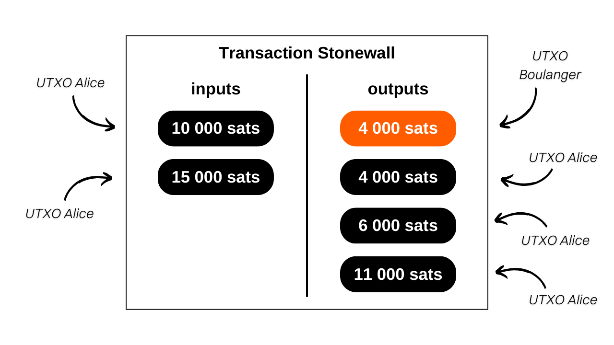

> *"Break the assumptions of blockchain analysis with mathematically provable doubt between sender and recipient of your transactions."*

## C'est quoi une transaction Stonewall ?
Stonewall est une forme spécifique de transaction Bitcoin visant à accroître la confidentialité des utilisateurs lors d'une dépense en imitant un coinjoin entre deux personnes, sans pour autant en être un. En effet, cette transaction n'est pas collaborative. Un utilisateur peut la construire tout seul, en faisant uniquement intervenir les UTXO lui appartenant en input. Vous pouvez donc créer une transaction Stonewall pour n'importe quelle occasion, sans avoir besoin de vous synchroniser avec un autre utilisateur.

Le fonctionnement de la transaction Stonewall est le suivant : en entrée de la transaction, l'émetteur utilise 2 UTXO qui lui appartiennent. En sortie, la transaction produit 4 outputs, dont 2 qui seront exactement de même montant. Les 2 autres constitueront du change. Parmi les 2 outputs de même montant, un seul ira effectivement au destinataire du paiement.

Il y a donc seulement 2 rôles dans une transaction Stonewall :
- L'émetteur, qui réalise le paiement effectif ;
- Le destinataire, qui peut ignorer la nature spécifique de la transaction et attend simplement un paiement de la part de l'émetteur.

Prenons un exemple pour comprendre cette structure de transaction. Alice est chez le boulanger pour acheter sa baguette de pain qui coûte `4 000 sats`. Elle souhaite payer en bitcoins tout en conservant une certaine forme de confidentialité sur son paiement. Elle décide donc de construire une transaction Stonewall pour le paiement.

En analysant cette transaction, on peut voir que le boulanger a effectivement reçu `4 000 sats` en paiement pour la baguette. Alice a utilisé 2 UTXO en inputs : un de `10 000 sats` et un de `15 000 sats`. En sortie, elle a récupéré 3 UTXO : un de `4 000 sats`, un de `6 000 sats` et un de `11 000 sats`. Alice a donc un solde net de `- 4 000 sats` sur cette transaction, ce qui correspond bien au prix de la baguette.

Dans cet exemple, j'ai intentionnellement négligé les frais de minage afin de faciliter la compréhension. En réalité, les frais de transaction sont intégralement pris en charge par l'émetteur.

## Quelle est la différence entre Stonewall et Stonewall x2 ?
La transaction Stonewall fonctionne de manière identique à la transaction StonewallX2, à ceci près que cette dernière nécessite une collaboration, contrairement à la transaction Stonewall classique, d'où l'appellation « x2 ». En effet, la transaction Stonewall s'exécute sans nécessiter de coopération externe : l'expéditeur peut la mener à bien sans l'aide d'une autre personne. En revanche, pour une transaction Stonewall x2, un participant additionnel, nommé le « collaborateur », se joint au processus. Ce dernier contribue avec ses propres bitcoins en entrée, aux côtés de ceux de l'expéditeur, et reprend la totalité de cette somme en sortie (modulo les frais de minage).

Reprenons notre exemple avec Alice à la boulangerie. Si elle avait voulu faire une transaction Stonewall x2, Alice aurait dû collaborer avec Bob (une personne tierce) lors de l'élaboration de la transaction. Ils auraient chacun apporté un UTXO en entrée. Bob aurait alors récupéré la totalité de son apport en sortie. Le boulanger aurait reçu le paiement pour sa baguette de la même façon que dans la transaction Stonewall, tandis qu'Alice aurait récupéré son solde initial, moins le coût de la baguette.

D'un point de vue extérieur, le paterne de la transaction serait resté exactement le même.

Pour résumer, les transactions Stonewall et Stonewall x2 partagent une structure identique. La distinction entre les deux réside dans leur caractère collaboratif ou non. La transaction Stonewall est élaborée individuellement, sans la nécessité d'une collaboration. En revanche, la transaction Stonewall x2 repose sur une coopération entre deux individus pour sa mise en place.

[**-> En savoir plus sur les transactions Stonewall x2**](https://planb.network/tutorials/privacy/stonewall-x2)

## Quelle est l'utilité d'une transaction Stonewall ?
La structure Stonewall ajoute énormément d'entropie à la transaction et vient brouiller les pistes de l'analyse de chaîne. Vue de l'extérieur, une telle transaction peut être interprétée comme un petit coinjoin entre deux personnes. Mais en réalité, tout comme la transaction Stonewall x2, il s'agit d'un paiement. Cette méthode génère donc des incertitudes dans l'analyse de chaîne, voire oriente vers de fausses pistes.

Reprenons l'exemple d'Alice chez le boulanger. La transaction sur la blockchain se présenterait ainsi :

Un observateur extérieur qui s'appuie sur les heuristiques courantes d'analyse de chaîne pourrait conclure à tort que « *deux personnes ont réalisé un petit coinjoin, avec un UTXO chacun en entrée et deux UTXO chacun en sortie* ».

Cette interprétation est inexacte, car, comme vous le savez, un UTXO a été envoyé au boulanger, les 2 UTXO en entrée proviennent d'Alice, et elle a récupéré 3 outputs de change.

Même si l'observateur extérieur parvient à identifier le paterne de la transaction Stonewall, il ne disposera pas de toutes les informations. Il ne pourra pas déterminer lequel des deux UTXO de mêmes montants correspond au paiement. De plus, il ne pourra pas déterminer si les deux UTXO en entrée proviennent de deux personnes différentes ou s'ils appartiennent à une seule personne qui les a fusionnés. Ce dernier point est dû au fait que les transactions Stonewall x2, dont nous avons parlé au-dessus, suivent exactement le même paterne que les transactions Stonewall. Vu de l'extérieur et sans informations supplémentaires sur le contexte, il est impossible de différencier une transaction Stonewall d'une transaction Stonewall x2. Or, les premières ne sont pas des transactions collaboratives, alors que les secondes le sont. Cela permet d'ajouter encore plus de doutes sur cette dépense.

## Comment faire une transaction Stonewall sur Samourai Wallet ?
Contrairement aux transactions Stowaway ou Stonewall x2 (cahoots), la transaction Stonewall ne nécessite pas d'utiliser les Paynyms. Elle peut être réalisée directement, sans étapes de préparation. Pour ce faire, suivez notre tutoriel vidéo sur Samourai Wallet : 

## Comment faire une transaction Stonewall sur Sparrow Wallet ?
Contrairement aux transactions Stowaway ou Stonewall x2 (cahoots), la transaction Stonewall ne nécessite pas d'utiliser les Paynyms. Elle peut être réalisée directement, sans étapes de préparation. Pour ce faire, suivez notre tutoriel vidéo sur Sparrow Wallet : 

**Ressources externes :**
- https://docs.samourai.io/en/spend-tools#stonewall ;
- https://samouraiwallet.com/stonewall.
