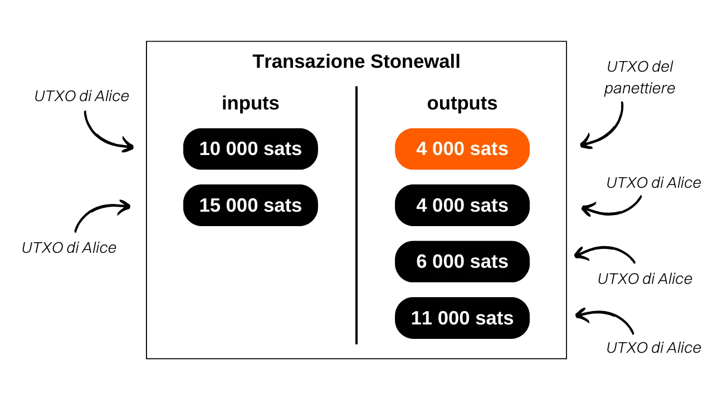

***ATTENZIONE:** In seguito all'arresto dei fondatori di Samourai Wallet e al sequestro dei loro server il 24 aprile, l'uso dell'app Samourai Wallet richiede ora una connessione al proprio Dojo per funzionare correttamente. A parte questo, le transazioni Stonewall non sono affatto influenzate e possono ancora essere eseguite senza problemi. Infatti, questi tipi di transazioni vengono effettuate autonomamente, senza la necessità di collaborazione esterna o connessione tramite Soroban.*

_Stiamo seguendo da vicino l'evoluzione di questo caso così come gli sviluppi relativi agli strumenti associati. Siate certi che aggiorneremo questo tutorial non appena saranno disponibili nuove informazioni._

_Questo tutorial è fornito solo a scopo educativo e informativo. Non approviamo né incoraggiamo l'uso di questi strumenti per scopi criminali. È responsabilità di ogni utente rispettare le leggi vigenti nella propria giurisdizione._

---

> *"Confondere le ipotesi degli analisiti della blockchain con un dubbio matematicamente provabile tra mittente e destinatario delle tue transazioni."*

## Cos'è una transazione Stonewall?
Stonewall è una forma specifica di transazione Bitcoin volta ad aumentare la privacy dell'utente durante una transazione, imitando un coinjoin tra due parti, senza però esserlo realmente. Infatti, questa transazione non è collaborativa. Un utente può costruirla da solo, coinvolgendo solo i propri UTXO come input. Pertanto, puoi creare una transazione Stonewall per qualsiasi occasione senza doverti coordinare con un altro utente.

Il funzionamento di una transazione Stonewall è il seguente: come input, il mittente utilizza 2 UTXO che gli appartengono. Come output, la transazione produce 4 output, inclusi 2 che saranno esattamente dello stesso importo. Gli altri 2 saranno il resto. Tra i 2 output dello stesso importo, solo uno andrà effettivamente al destinatario del pagamento.

Ci sono solo 2 ruoli in una transazione Stonewall:
- Il mittente, che effettua il pagamento effettivo;
- Il destinatario, che potrebbe non essere a conoscenza della natura specifica della transazione e semplicemente aspettarsi un pagamento dal mittente.

Prendiamo un esempio per capire questa struttura di transazione. Alice è in panetteria per comprare la sua baguette, che costa `4.000 sats`. Vuole pagare in bitcoin mantenendo un certo livello di privacy nel suo pagamento. Pertanto, decide di creare una transazione Stonewall per il pagamento.

Analizzando questa transazione, possiamo vedere che il panettiere ha effettivamente ricevuto `4.000 sats` come pagamento per la baguette. Alice ha utilizzato 2 UTXO come input: uno di `10.000 sats` e uno di `15.000 sats`. Come output, ha ricevuto 3 UTXO: uno di `4.000 sats`, uno di `6.000 sats` e uno di `11.000 sats`. Alice ha un saldo netto di `-4.000 sats` in questa transazione, che corrisponde al prezzo della baguette.

In questo esempio, ho intenzionalmente omesso le commissioni di mining per facilitare la comprensione. Nella realtà, le commissioni di transazione sono interamente a carico del mittente.

## Qual è la differenza tra Stonewall e Stonewall x2?
La transazione Stonewall opera nello stesso modo della transazione StonewallX2, con l'unica differenza che quest'ultima richiede collaborazione, a differenza della classica transazione Stonewall, da qui la designazione "x2". Infatti, la transazione Stonewall può essere eseguita senza cooperazione esterna: il mittente può portarla a termine senza l'assistenza di un'altra persona. Tuttavia, per una transazione Stonewall x2, un partecipante aggiuntivo, chiamato "collaboratore", si unisce al processo. Il collaboratore contribuisce con i propri bitcoin come input, insieme a quelli del mittente, e riceve l'intera somma come output (meno le commissioni di mining).

Rivisitiamo il nostro esempio con Alice in panetteria. Se avesse voluto effettuare una transazione Stonewall x2, Alice avrebbe dovuto collaborare con Bob (una terza parte) nella creazione della transazione. Avrebbero fornito ciascuno un UTXO di input. Bob avrebbe poi ricevuto l'intero importo del suo input come output. Il panettiere avrebbe ricevuto il pagamento per la sua baguette nello stesso modo della transazione Stonewall, mentre Alice avrebbe ricevuto indietro il suo saldo iniziale, meno il costo della baguette.

Da una prospettiva esterna, il modello della transazione sarebbe rimasto esattamente lo stesso.

In sintesi, le transazioni Stonewall e Stonewall x2 condividono una struttura identica. La distinzione tra le due risiede nella loro natura collaborativa. La transazione Stonewall è sviluppata individualmente, senza la necessità di collaborazione. Al contrario, la transazione Stonewall x2 si basa sulla cooperazione tra due individui per la sua implementazione.

[**-> Scopri di più sulle transazioni Stonewall x2**](https://planb.network/tutorials/privacy/stonewall-x2)

## Qual è lo scopo di una transazione Stonewall?
La struttura Stonewall aggiunge una quantità significativa di entropia alla transazione ed oscura l'analisi della blockchain. Da una prospettiva esterna, può essere interpretata come un piccolo coinjoin tra due persone. Ma in realtà, proprio come la transazione Stonewall x2, si tratta di un pagamento. Questo metodo crea quindi incertezze nell'analisi della blockchain e può persino portare a false piste.

Rivediamo l'esempio di Alice in panetteria. La transazione sulla blockchain apparirebbe come segue:

Un osservatore esterno che si affida alle euristiche comuni di analisi della blockchain potrebbe erroneamente concludere che "*due persone hanno eseguito un piccolo coinjoin, con un UTXO ciascuno in input e due UTXO ciascuno in output*".

Questa interpretazione è errata perché, come sapete, un UTXO è stato inviato al panettiere, i 2 UTXO in input provengono da Alice, e lei ha ricevuto 3 output di resto.

Anche se un osservatore esterno riesce a identificare il modello della transazione Stonewall, non avrà tutte le informazioni. Non sarà infatti in grado di determinare quale dei due UTXO dello stesso importo corrisponde al pagamento. Inoltre, non sarà in grado di determinare se i due UTXO in input provengono da due persone diverse o se appartengono ad una singola persona che li ha uniti. Quest'ultimo punto è dovuto al fatto che le transazioni Stonewall x2, di cui abbiamo parlato sopra, seguono esattamente lo stesso modello delle transazioni Stonewall. Dall'esterno e senza informazioni aggiuntive sul contesto è impossibile differenziare una transazione Stonewall da una transazione Stonewall x2. Tuttavia, le prime non sono transazioni collaborative, mentre le seconde lo sono. Questo aggiunge ancora più dubbi sul modello di spesa.

## Come effettuare una transazione Stonewall su Samourai Wallet?
A differenza delle transazioni Stowaway o Stonewall x2 (cahoots), la transazione Stonewall non richiede l'uso di Paynyms. Può essere effettuata direttamente, senza alcuna fase preparatoria. Per farlo, segui il nostro video tutorial su Samourai Wallet: 

## Come effettuare una transazione Stonewall su Sparrow Wallet?
A differenza delle transazioni Stowaway o Stonewall x2 (cahoots), la transazione Stonewall non richiede l'uso di Paynyms. Può essere effettuata direttamente, senza alcuna fase preparatoria.

**Risorse Esterne:**
- https://docs.samourai.io/en/spend-tools#stonewall.
