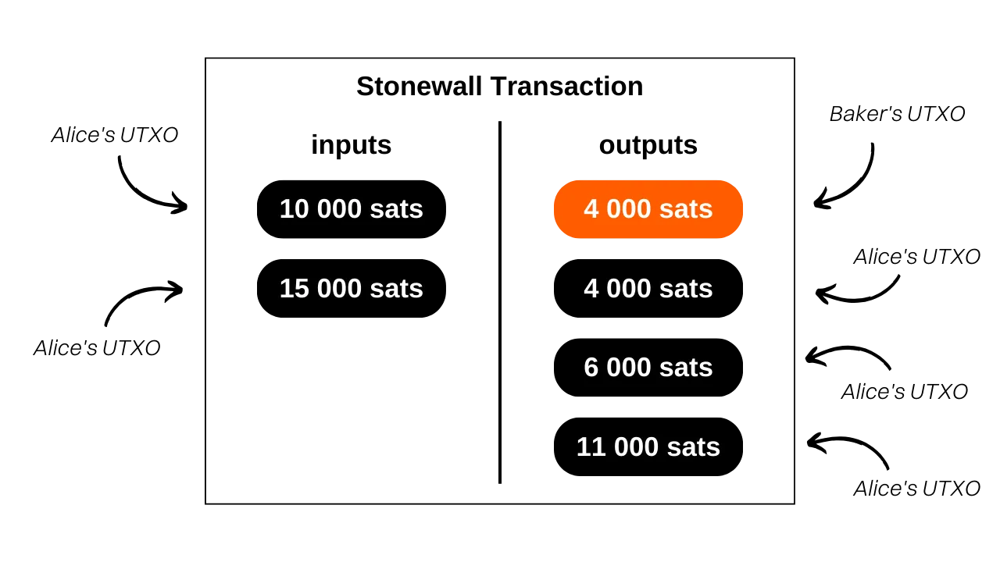
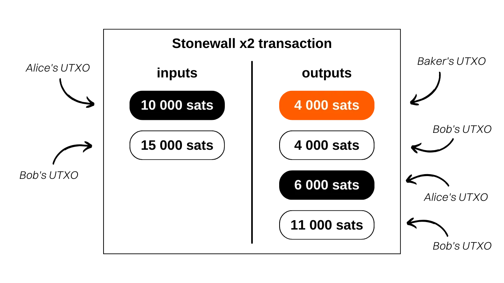
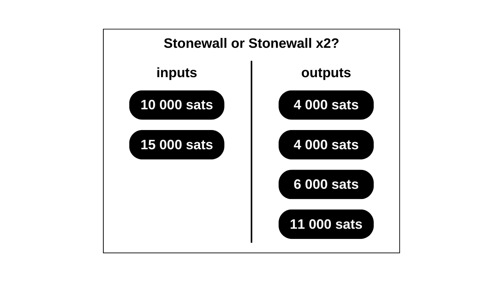

> *"ブロックチェーン分析の仮定を数学的に証明可能な疑問で破り、あなたのトランザクションの送信者と受信者の間に不確実性をもたらします。"*

## Stonewallトランザクションとは何ですか？
Stonewallトランザクションは、実際にはコインジョインではないにもかかわらず、二者間のコインジョインを模倣することでトランザクション中のユーザープライバシーを高めることを目的とした、ビットコイントランザクションの特定の形式です。実際、このトランザクションは協力的ではありません。ユーザーは自分自身のUTXOのみを入力として使用し、単独で構築することができます。したがって、他のユーザーと調整する必要なく、任意の機会にStonewallトランザクションを作成できます。

Stonewallトランザクションの操作は次のとおりです：入力として、送信者は自分に属する2つのUTXOを使用します。出力として、トランザクションは4つの出力を生成し、そのうち2つは同じ金額になります。残りの2つはおつりになります。同じ金額の2つの出力のうち、実際に支払い受取人に行くのは1つだけです。

Stonewallトランザクションには2つの役割しかありません：
- 実際の支払いを行う送信者；
- トランザクションの特定の性質を知らずに単に送信者からの支払いを期待する受信者。

このトランザクション構造を理解するために例を挙げましょう。Aliceはバゲットを買うためにパン屋にいます。その価格は`4,000 sats`です。彼女は支払いにおけるある程度のプライバシーを維持しながらビットコインで支払いたいと考えています。したがって、彼女は支払いのためにStonewallトランザクションを作成することに決めました。

このトランザクションを分析すると、パン屋がバゲットの支払いとして`4,000 sats`を確かに受け取ったことがわかります。Aliceは入力として`10,000 sats`と`15,000 sats`の2つのUTXOを使用しました。出力として、彼女は`4,000 sats`、`6,000 sats`、`11,000 sats`の3つのUTXOを受け取りました。このトランザクションにおけるAliceの純残高は`-4,000 sats`で、これはバゲットの価格に相当します。

この例では、理解を容易にするために意図的にマイニング手数料を省略しました。実際には、トランザクション手数料は送信者が全額負担します。

## StonewallとStonewall x2の違いは何ですか？
StonewallトランザクションはStonewallX2トランザクションと同じ方法で動作しますが、後者は協力が必要であるという点で異なります。これが「x2」という指定の理由です。実際、Stonewallトランザクションは外部の協力を必要とせずに実行できます：送信者は他の人の助けを借りずにそれを実行できます。しかし、Stonewall x2トランザクションの場合、"協力者"と呼ばれる追加の参加者がプロセスに参加します。協力者は送信者のものと一緒に自分のビットコインを入力として提供し、出力として全額（マイニング手数料を除く）を受け取ります。
アリスがパン屋での例を再訪しましょう。もし彼女がStonewall x2トランザクションを行いたかった場合、アリスはトランザクションを作成する際にボブ（第三者）と協力しなければなりませんでした。彼らはそれぞれ入力UTXOを提供していたでしょう。その後、ボブは彼の入力の全額を出力として受け取ったでしょう。パン屋はStonewallトランザクションと同じ方法でバゲットの支払いを受け取り、アリスはバゲットのコストを差し引いた初期残高を受け取ったでしょう。

外部から見た場合、トランザクションのパターンは全く同じままでした。

要約すると、StonewallトランザクションとStonewall x2トランザクションは同一の構造を共有しています。2つの違いは、その協力的な性質にあります。Stonewallトランザクションは個別に開発され、協力を必要としません。対照的に、Stonewall x2トランザクションはその実装のために2人の個人間の協力に依存しています。

[**-> Stonewall x2トランザクションについてもっと学ぶ**](https://planb.network/tutorials/privacy/stonewall-x2)

## Stonewallトランザクションの目的は何ですか？
Stonewall構造はトランザクションに大量のエントロピーを追加し、チェーン分析を曖昧にします。外部から見た場合、そのようなトランザクションは2人の間の小さなコインジョインと解釈されるかもしれません。しかし実際には、Stonewall x2トランザクションと同様に、それは支払いです。この方法はしたがって、チェーン分析に不確実性を生み出し、誤ったリードにさえつながるかもしれません。

パン屋でのアリスの例を再訪しましょう。ブロックチェーン上のトランザクションは以下のように表示されます：

一般的なチェーン分析のヒューリスティックに依存する外部の観察者は、"*2人がそれぞれ入力として1つのUTXOを持ち、出力として2つのUTXOを持つ小さなコインジョインを行った*"と誤って結論付けるかもしれません。

この解釈は間違っています。なぜなら、ご存知の通り、UTXOはパン屋に送られ、入力の2つのUTXOはアリスから来ており、彼女は3つのお釣りの出力を受け取ったからです。

外部の観察者がStonewallトランザクションのパターンを特定できたとしても、全ての情報を持つわけではありません。どちらの同額のUTXOが支払いに対応するか、また、入力の2つのUTXOが異なる人々から来たものか、それとも1人の人がそれらを統合したものかを判断することはできません。この最後の点は、上で話したStonewall x2トランザクションがStonewallトランザクションと全く同じパターンに従うためです。外部から、そして文脈に関する追加情報なしに、StonewallトランザクションとStonewall x2トランザクションを区別することは不可能です。しかし、前者は協力的なトランザクションではないのに対し、後者はそうです。これはこの支出にさらなる疑問を投げかけます。

## Samourai WalletでStonewallトランザクションを行う方法は？
StowawayやStonewall x2（cahoots）トランザクションとは異なり、StonewallトランザクションにはPaynymsの使用が必要ありません。準備ステップなしで直接行うことができます。これを行うには、Samourai Walletのビデオチュートリアルをご覧ください： 

## Sparrow WalletでStonewallトランザクションを行う方法は？
StowawayやStonewall x2（cahoots）トランザクションとは異なり、StonewallトランザクションにはPaynymsの使用が必要ありません。準備ステップなしで直接行うことができます。これを行うには、Sparrow Walletのビデオチュートリアルをご覧ください：

**外部リソース:**
- https://docs.samourai.io/en/spend-tools#stonewall ;
- https://samouraiwallet.com/stonewall.