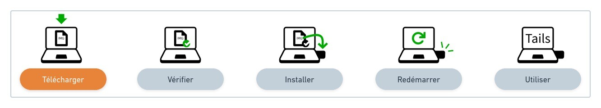
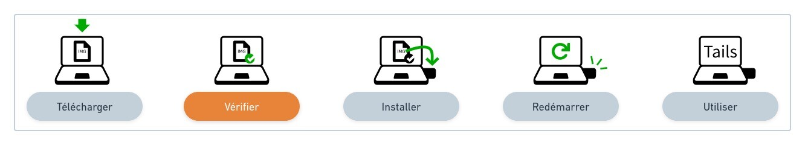
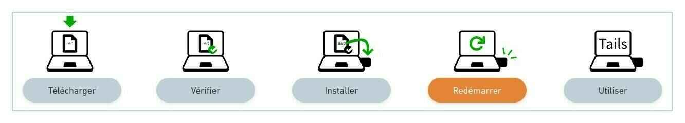
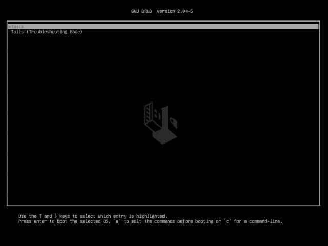
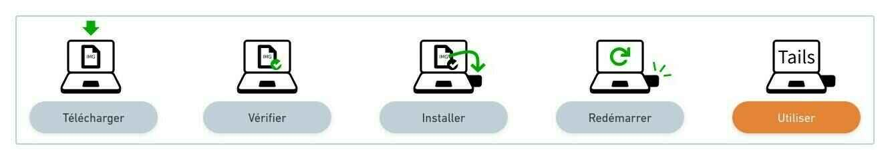
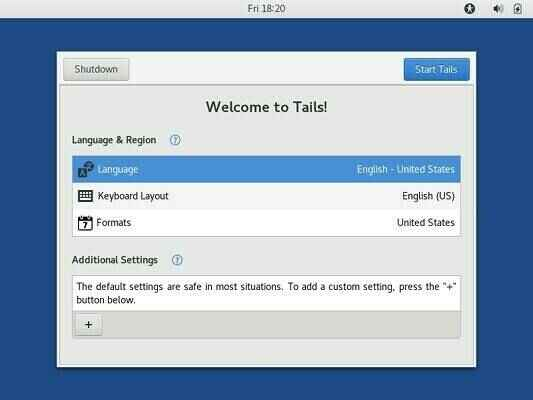
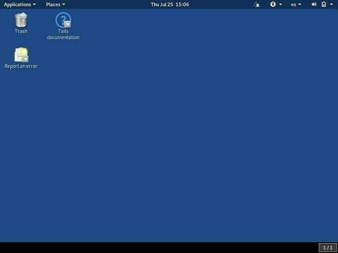
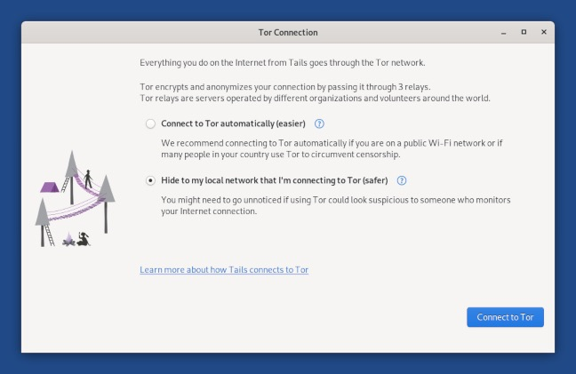

_**Guide proposé par Hari Seldon dans le cadre de Agora256**_

Un système d'exploitation portable et amnésique qui vous protège contre la surveillance et la censure.

## Pourquoi avoir une clé USB avec Tails installé sur soi?

Tails (https://tails.boum.org/) est le moyen le plus facile d'avoir à votre disposition, en tout temps, un ordinateur sécurisé qui ne laissera pas de trace sur l'ordinateur avec lequel vous l'utiliserez.

Pour utiliser Tails, éteignez l'ordinateur à votre disposition (chez vos parents, chez vos amis, dans un café Internet...) et démarrez-le sur votre clé USB Tails à la place de Windows, macOS ou Linux.

Après cela, vous aurez un espace de travail et de communication qui est indépendant du système d'exploitation habituel et n'utilise jamais le disque dur.

Tails n'écrit jamais sur le disque dur et n'utilise que la mémoire vive de l'ordinateur pour fonctionner. Cette mémoire est effacée intégralement lors de l'extinction de Tails, supprimant ainsi toutes les traces possibles.

## Quelques cas concrets d'utilisation

Pour vous donner des idées concrètes de l'intérêt d'avoir toujours avec vous une clé USB avec Tails, voici une petite liste non exhaustive compilée par l'équipe de Agora256:

- Se connecter à Internet et à Tor de façon non censuré et anonyme pour consulter des sites sans laisser de traces;
- Ouvrir un PDF depuis un site douteux;
- Tester votre backup de clé privée Bitcoin avec le portefeuille Electrum;
- Utiliser une suite bureautique (LibreOffice) et travailler sur un ordinateur qui ne vous appartient pas;
- Faire ses premiers pas dans un environnement Linux pour apprendre à quitter le monde de Microsoft et d'Apple.

## Comment avoir confiance en Tails ?

Il y a toujours une part de confiance dans l'utilisation de logiciels, mais celle-ci n'a pas besoin d'être aveugle. Un outil comme Tails se doit d'essayer de fournir à ses utilisateurs des moyens d'être digne de confiance. Pour Tails, cela veut dire:

- un code source public: https://gitlab.tails.boum.org/;
- un projet basé sur des projets réputés: Tor et Debian;
- des téléchargements vérifiables et reproductibles;
- des recommandations par différentes personnes et organisations.

## Guide d'installation et d'utilisation

Ce guide d'installation a pour but de vous guider dans chaque étape de l'installation, nous ne décrirons pas, plus que le guide officiel, les actions à effectuer, mais nous vous pointerons vers la bonne direction tout en vous donnant des trucs et astuces.

Pour des raisons d'expériences pratiques, ces conseils seront centrés sur les plateformes de macOS et de Linux.
🛠️
Avant de commencer cette procédure, veuillez-vous assurez d'avoir en votre possession une clé USB dont la vitesse de lecture est d'au moins 150 Mo/s et d'une taille d'au moins 8 Go, idéalement de type USB 3.0
Prérequis

- 1 clé USB, Seulement pour Tails, d'au moins 8 Go
- Un ordinateur connecté à Internet avec Linux, macOS, (ou Windows)
- Environ une heure devant vous au total, en fonction de la vitesse de votre connexion Internet, dont ½ heure pour installer (fichier à télécharger de 1.3 GB)

## Étape 1: Télécharger Tails depuis votre ordinateur

> 🔗 Section officielle de Tails: https://tails.boum.org/install/linux/index.fr.html#download

Télécharger le fichier d'installation avec l'extension img peut prendre un certain temps en fonction de votre vitesse de téléchargement Internet, prévoyez donc de le faire en avance. Avec une ligne moderne et performante, cela prendra moins de 5 minutes.

Sauver le fichier dans un dossier connu, tels que Téléchargements, cela sera nécessaire pour passer à l'étape suivante.

## Étape 2: Vérifier votre téléchargement

> 🔗 Section officielle de Tails: https://tails.boum.org/install/linux/index.fr.html#verify

Vérifier le téléchargement permet de vous assurer qu'il est émis par les développeurs de Tails et qu'il n'a pas été corrompu ou intercepté au cours du téléchargement.

Il est possible de vérifier manuellement que le fichier que vous venez de télécharger est bien celui attendu grace à PGP, mais sans connaissance avancée, cette vérification offre le même niveau de sécurité que la vérification JavaScript sur la page de téléchargement, tout en étant beaucoup plus compliquée et sujette aux erreurs.

Pour vérifier le fichier, utilisez donc le bouton "Sélectionner votre téléchargement…" offert dans la section officielle!

## Étape 3: Installer Tails sur votre clé USB

> 🔗 Section officielle de Tails:
>
> - Linux: https://tails.boum.org/install/linux/index.fr.html#install
> - macOS: https://tails.boum.org/install/mac/index.fr.html#etcher et https://tails.boum.org/install/mac/index.fr.html#install

Cette étape d'installation de Tails sur votre clé USB est la plus difficile de tout le guide, surtout si vous ne l'avez jamais fait avant. Le point le plus important est de bien choisir la procédure dans la section officielle pour votre système d'exploitation: Linux ou macOS.

Ensuite, une fois les outils installés et préparés comme recommandé, le fichier avec l'extension img va pouvoir être copié sur votre clé (en effaçant toutes les données existantes) de façon à être "démarrable" indépendamment.

Bon courage! et rendez-vous à l'étape 4.

## Étape 4: Redémarrer sur votre clé USB Tails

> 🔗 Section officielle de Tails: https://tails.boum.org/install/linux/index.fr.html#restart

Il est temps de démarrer un de vos ordinateurs en utilisant votre nouvelle clé USB. Insérez celle-ci dans un de ses ports USB et redémarrez!

> 💡 La plupart des ordinateurs ne démarrent pas automatiquement sur la clé USB Tails, mais vous pouvez appuyer sur la touche du menu de démarrage pour afficher une liste de périphériques possibles à partir desquels démarrer.

Déterminer quelle touche vous devrez appuyer pour vous assurer d'avoir le menu de démarrage vous permettant de sélectionner la clé USB au lieu de votre disque dur habituel, voici une liste non exhaustive par fabricant:

| Fabricant | Touche             |
| --------- | ------------------ |
| Acer      | F12, F9, F2, Échap |
| Apple     | Option             |
| Asus      | Échap              |
| Clevo     | F7                 |
| Dell      | F12                |
| Fujitsu   | F12, Échap         |
| HP        | F9                 |
| Huawei    | F12                |
| Intel     | F10                |
| Lenovo    | F12                |
| MSI       | F11                |
| Samsung   | Échap, F12, F2     |
| Sony      | F11, Échap, F10    |
| Toshiba   | F12                |
| autres…   | F12, Échap         |

Une fois la clé USB sélectionnée, vous devriez voir ce nouvel écran de démarrage, c'est très bon signe, laissez donc l'ordinateur continuer son démarrage...

## Étape 5: Bienvenue dans Tails !

> 🔗 Section officielle de Tails: https://tails.boum.org/install/linux/index.fr.html#tails

Une ou deux minutes après le chargeur d'amorçage et l'écran de chargement, l'Écran de bienvenue apparaît.

Dans l'Écran de bienvenue, sélectionnez votre langue et votre disposition de clavier dans la section Language & Region. Cliquez sur Démarrer Tails.

Si votre ordinateur n'est pas connecté par un fil à votre réseau, veuillez consulter les instructions officielles de Tails pour vous aider à connecter votre réseau sans Wi-Fi (section "Testez votre Wi-Fi").

Une fois connecté au réseau local, l'assistant de Connexion à Tor apparaît pour vous aider à vous connecter au réseau Tor.

Vous pouvez commencer à naviguer anonymement, explorer les options et les logiciels inclus dans Tails. Faites-vous plaisir, vous avez toute place aux erreurs, car rien n'est modifié sur la clé USB...Votre prochain redémarrage aura oublié toutes vos expériences!

## Dans un prochain guide...

Une fois que vous aurez expérimenté un peu plus avec votre propre clé USB Tails, nous explorerons d'autres sujets plus avancés dans un autre article, comme:

> Mettre à jour une clé avec la dernière version de Tails; Configurer et utiliser le stockage persistant; Installer des logiciels supplémentaires.

D'ici là, comme toujours, si vous avez des questions, n'hésitez pas à les partager à la communauté Agora256, nous apprenons ensemble, pour être meilleur demain que nous ne le sommes aujourd'hui!

> _**Guide proposé par Hari Seldon dans le cadre de Agora256; post orginal: https://agora256.com/installer-tails-usb/**_
