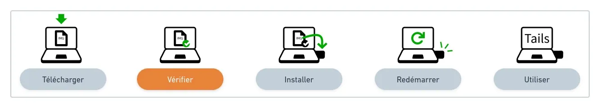
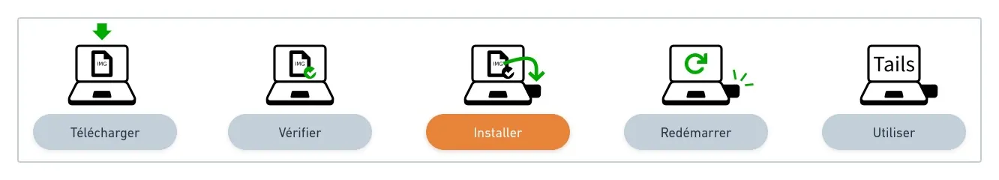
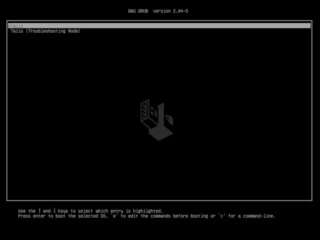

Un sistema operativo portatile e amnesico che ti protegge dalla sorveglianza e dalla censura.

## Perché avere una chiavetta USB con Tails installato?

Tails (https://tails.boum.org/) è il modo più semplice per avere sempre a disposizione un computer sicuro che non lascerà tracce sul computer con cui lo utilizzerai.

Per utilizzare Tails, spegni il computer a tua disposizione (a casa dei tuoi genitori, dai tuoi amici, in un internet café...) e avvialo dalla tua chiavetta USB Tails al posto di Windows, macOS o Linux.

Dopo di che, avrai uno spazio di lavoro e di comunicazione indipendente dal sistema operativo abituale e che non utilizza mai il disco rigido.

Tails non scrive mai sul disco rigido e utilizza solo la memoria RAM del computer per funzionare. Questa memoria viene cancellata completamente quando Tails viene spento, eliminando così tutte le possibili tracce.

## Alcuni casi concreti di utilizzo

Per darti delle idee concrete sull'utilità di avere sempre con te una chiavetta USB con Tails, ecco un piccolo elenco non esaustivo compilato dal team di Agora256:

- Collegarsi a Internet e a Tor in modo non censurato e anonimo per consultare siti senza lasciare tracce;
- Aprire un PDF da un sito sospetto;
- Testare il backup della chiave privata Bitcoin con il portafoglio Electrum;
- Utilizzare una suite per ufficio (LibreOffice) e lavorare su un computer che non ti appartiene;
- Fare i primi passi in un ambiente Linux per imparare a lasciare il mondo di Microsoft e Apple.

## Come avere fiducia in Tails?

C'è sempre una parte di fiducia nell'utilizzo di software, ma questa non deve essere cieca. Uno strumento come Tails deve cercare di fornire ai suoi utenti mezzi per essere affidabile. Per Tails, ciò significa:

- un codice sorgente pubblico: https://gitlab.tails.boum.org/;
- un progetto basato su progetti rinomati: Tor e Debian;
- download verificabili e riproducibili;
- raccomandazioni da parte di diverse persone e organizzazioni.

## Guida all'installazione e all'utilizzo

Questa guida all'installazione ha lo scopo di guidarti in ogni passaggio dell'installazione, non descriveremo, oltre alla guida ufficiale, le azioni da compiere, ma ti indirizzeremo nella giusta direzione fornendoti suggerimenti e trucchi.

Per motivi di esperienza pratica, questi consigli saranno incentrati sulle piattaforme macOS e Linux.
🛠️
Prima di iniziare questa procedura, assicurati di avere a disposizione una chiavetta USB con una velocità di lettura di almeno 150 MB/s e una capacità di almeno 8 GB, preferibilmente di tipo USB 3.0.

## Prerequisiti

- 1 chiavetta USB, solo per Tails, di almeno 8 GB
- Un computer connesso a Internet con Linux, macOS (o Windows)
- Circa un'ora di tempo totale, a seconda della velocità della tua connessione Internet, di cui mezz'ora per l'installazione (file da scaricare di 1,3 GB)

## Passaggio 1: Scaricare Tails dal tuo computer

> 🔗 Sezione ufficiale di Tails: https://tails.boum.org/install/linux/index.fr.html#download

Il download del file di installazione con estensione .img potrebbe richiedere del tempo a seconda della velocità di download della tua connessione Internet, quindi assicurati di farlo in anticipo. Con una linea moderna e performante, ci vorranno meno di 5 minuti.

Salva il file in una cartella conosciuta, come "Download", perché sarà necessario per passare al passaggio successivo.

## Passaggio 2: Verificare il download

> 🔗 Sezione ufficiale di Tails: https://tails.boum.org/install/linux/index.fr.html#verify

La verifica del download ti permette di assicurarti che il file sia stato emesso dagli sviluppatori di Tails e che non sia stato corrotto o intercettato durante il download.

È possibile verificare manualmente che il file che hai appena scaricato sia quello corretto utilizzando PGP, ma senza conoscenze avanzate, questa verifica offre lo stesso livello di sicurezza della verifica JavaScript sulla pagina di download, pur essendo molto più complicata e soggetta a errori.

Per verificare il file, utilizza il pulsante "Seleziona il tuo download..." offerto nella sezione ufficiale!

## Passaggio 3: Installare Tails sulla tua chiavetta USB

> 🔗 Sezione ufficiale di Tails:
>
> - Linux: https://tails.boum.org/install/linux/index.fr.html#install
> - macOS: https://tails.boum.org/install/mac/index.fr.html#etcher e https://tails.boum.org/install/mac/index.fr.html#install

Questo passaggio di installazione di Tails sulla tua chiavetta USB è il più difficile di tutta la guida, soprattutto se non l'hai mai fatto prima. Il punto più importante è scegliere correttamente la procedura nella sezione ufficiale per il tuo sistema operativo: Linux o macOS.

Successivamente, una volta installati e preparati gli strumenti come consigliato, il file con estensione .img potrà essere copiato sulla tua chiavetta (cancellando tutti i dati esistenti) in modo da renderla "avviabile" in modo indipendente.

Buona fortuna! Ci vediamo al passaggio 4.

## Passaggio 4: Riavviare utilizzando la tua chiavetta USB Tails

> 🔗 Sezione ufficiale di Tails: https://tails.boum.org/install/linux/index.fr.html#restart
> È ora di avviare uno dei tuoi computer utilizzando la tua nuova chiavetta USB. Inseriscila in una delle porte USB e riavvia!

> 💡 La maggior parte dei computer non si avvia automaticamente dalla chiavetta USB di Tails, ma puoi premere il tasto del menu di avvio per visualizzare una lista dei dispositivi possibili da cui avviare.

Per determinare quale tasto devi premere per accedere al menu di avvio e selezionare la chiavetta USB anziché il tuo disco rigido abituale, ecco un elenco non esaustivo per produttore:

| Produttore | Tasto            |
| ---------- | ---------------- |
| Acer       | F12, F9, F2, Esc |
| Apple      | Option           |
| Asus       | Esc              |
| Clevo      | F7               |
| Dell       | F12              |
| Fujitsu    | F12, Esc         |
| HP         | F9               |
| Huawei     | F12              |
| Intel      | F10              |
| Lenovo     | F12              |
| MSI        | F11              |
| Samsung    | Esc, F12, F2     |
| Sony       | F11, Esc, F10    |
| Toshiba    | F12              |
| altri...   | F12, Esc         |

Una volta selezionata la chiavetta USB, dovresti vedere questa nuova schermata di avvio, è un buon segno, quindi lascia che il computer continui ad avviarsi...

## Passaggio 5: Benvenuto in Tails!

> 🔗 Sezione ufficiale di Tails: https://tails.boum.org/install/linux/index.fr.html#tails

Uno o due minuti dopo il caricatore di avvio e la schermata di caricamento, appare la schermata di benvenuto.

Nella schermata di benvenuto, seleziona la tua lingua e la disposizione della tastiera nella sezione Lingua e regione. Fai clic su Avvia Tails.

Se il tuo computer non è collegato alla rete tramite cavo, consulta le istruzioni ufficiali di Tails per aiutarti a connetterti alla rete senza Wi-Fi (sezione "Testa la tua connessione Wi-Fi").

Una volta connesso alla rete locale, compare l'Assistente di Connessione a Tor per aiutarti a connetterti alla rete Tor.

Puoi iniziare a navigare in modo anonimo, esplorare le opzioni e i software inclusi in Tails. Divertiti, hai tutto lo spazio per fare errori, perché nulla viene modificato sulla chiavetta USB... Al prossimo riavvio, tutte le tue esperienze saranno dimenticate!

## In una prossima guida...

Una volta che avrai sperimentato un po' di più con la tua chiavetta USB Tails, esploreremo altri argomenti più avanzati in un altro articolo, come:

> Aggiornare una chiave con l'ultima versione di Tails; Configurare e utilizzare lo storage persistente; Installare software aggiuntivi.
> Fino ad allora, come sempre, se avete domande, non esitate a condividerle con la comunità Agora256, impariamo insieme, per essere migliori domani di quanto siamo oggi!
