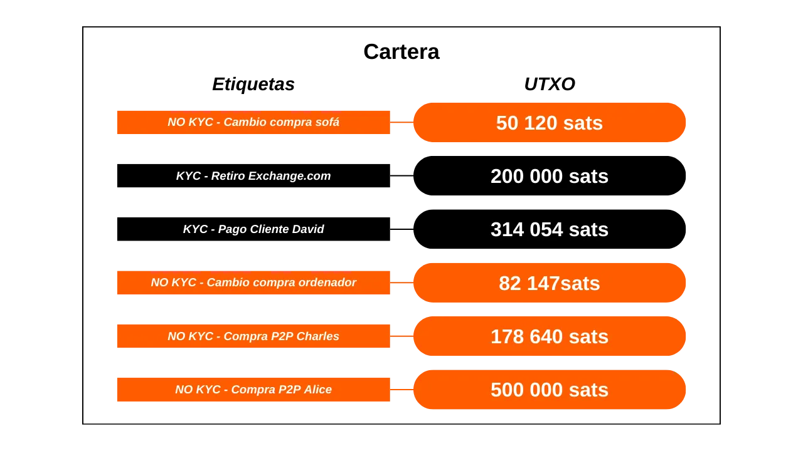
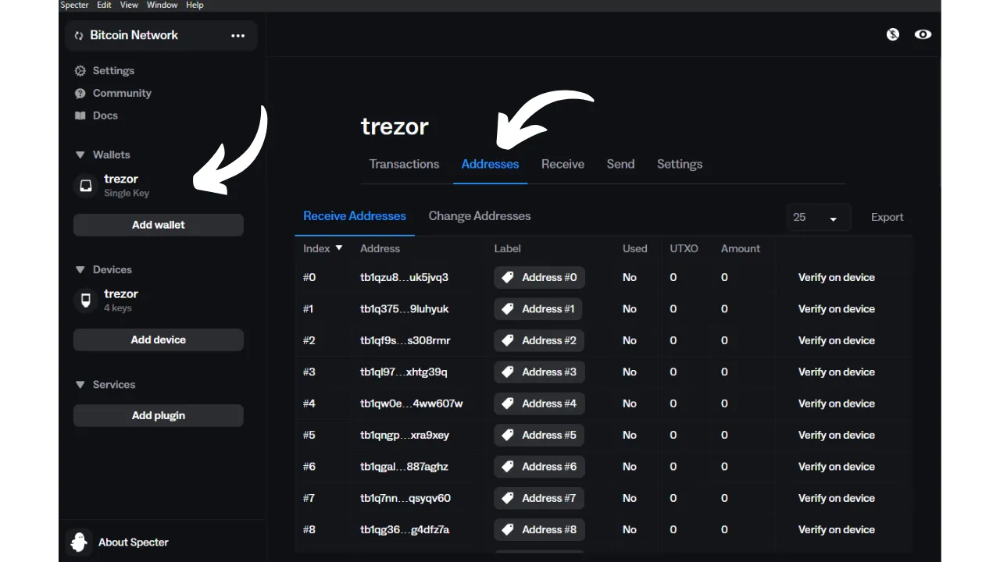
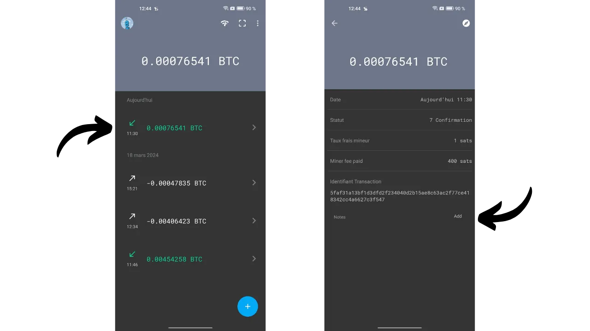

En este tutorial, descubrirás todo lo que necesitas saber sobre el etiquetado de UTXOs en tu billetera de Bitcoin y sobre el control de monedas. Comenzamos con una sección teórica para entender completamente estos conceptos, antes de pasar a una parte práctica donde exploramos cómo usar concretamente las etiquetas en el principal software de billetera de Bitcoin.

## ¿Qué es el etiquetado de UTXO?
"Etiquetar" es una técnica que implica asociar una anotación o etiqueta con un UTXO específico dentro de una billetera de Bitcoin. Estas anotaciones se almacenan localmente por el software de la billetera y nunca se transmiten a través de la red de Bitcoin. Por lo tanto, el etiquetado es una herramienta para la gestión personal.

Por ejemplo, si recibo un UTXO de una transacción P2P a través de Bisq con Charles, podría asignarle la etiqueta `Bisq P2P Compra Charles`.

El etiquetado permite recordar el origen o destino previsto del UTXO, lo que simplifica la gestión de fondos y optimiza la privacidad del usuario. El etiquetado se vuelve aún más relevante cuando se combina con la funcionalidad de "control de monedas". El control de monedas es una opción disponible en buenas billeteras de Bitcoin, que le da al usuario la capacidad de elegir manualmente qué UTXOs específicos se utilizarán como entradas al crear una transacción.

Usar una billetera con control de monedas, junto con el etiquetado de UTXO, permite a los usuarios distinguir y seleccionar precisamente UTXOs para sus transacciones, evitando así combinar UTXOs de diferentes fuentes. Esta práctica reduce los riesgos asociados con la Heurística de Propiedad de Entrada Común (CIOH, por sus siglas en inglés), que sugiere una propiedad común de las entradas de una transacción, lo que puede comprometer la privacidad del usuario.

Volvamos al ejemplo de mi UTXO sin KYC de Bisq; quiero evitar combinarlo con un UTXO proveniente, digamos, de una plataforma de intercambio regulada que conoce mi identidad. Al colocar una etiqueta distinta en mi UTXO sin KYC y en mi UTXO con KYC, podré identificar fácilmente qué UTXO consumir como entrada para satisfacer un gasto, utilizando la funcionalidad de control de monedas.

## ¿Cómo etiquetar correctamente tu UTXO?
No hay un método universal para etiquetar UTXOs que se adapte a todos. Depende de ti definir un sistema de etiquetado para que puedas orientarte fácilmente en tu billetera.
Un criterio crucial en el etiquetado es la fuente del UTXO. Simplemente deberías indicar cómo llegó esta moneda a tu billetera. ¿Es de una plataforma de intercambio? ¿Un pago de un cliente? ¿Un intercambio entre pares? ¿O representa el cambio de una compra? Así, podrías especificar:
- `Retiro Exchange.com`;
- `Pago Cliente David`;
- `Compra P2P Charles`;
- `Cambio de compra de sofá`.

Para refinar tu gestión de UTXO y adherirte a tus estrategias de segregación de fondos dentro de tu billetera, podrías enriquecer tus etiquetas con un indicador adicional que refleje estas separaciones. Si tu billetera contiene dos categorías de UTXOs que no deseas mezclar, podrías integrar un marcador en tus etiquetas para distinguir claramente estos grupos.

Estos marcadores de separación dependerán de tus propios criterios, como la distinción entre UTXO con KYC (conociendo tu identidad) y sin KYC (anónimo), o entre fondos profesionales y personales. Tomando los ejemplos de etiquetas mencionados anteriormente, esto podría traducirse como:
- `KYC - Retiro Exchange.com`;
- `KYC - Pago Cliente David`;
- `SIN KYC - Compra P2P Charles`;
- `SIN KYC - Cambio de compra de sofá`.
En cualquier caso, ten en cuenta que un buen etiquetado es aquel que podrás entender cuando lo necesites. Si tu cartera de Bitcoin está destinada principalmente para ahorros, puede ser que las etiquetas solo te sean útiles en varias décadas. Por lo tanto, asegúrate de que sean claras, precisas y completas.

También es aconsejable perpetuar el etiquetado de una moneda a lo largo de las transacciones. Por ejemplo, durante una consolidación UTXO sin KYC, asegúrate de marcar el UTXO resultante no solo como `consolidation`, sino específicamente como `no-KYC consolidation` para mantener un rastro claro del origen de la moneda.

Finalmente, no es obligatorio poner una fecha en una etiqueta. La mayoría del software de carteras ya muestra la fecha de la transacción, y siempre es posible recuperar esta información en un explorador de bloques usando su TXID.

## Tutorial: Etiquetado en Specter Desktop

Conecta y abre tu cartera en Specter Desktop, luego selecciona la pestaña `Addresses`.

Aquí, verás la lista de todas tus direcciones, así como cualquier bitcoin que esté bloqueado en ellas. Por defecto, las direcciones se identifican por su índice bajo la columna `Label`. Para cambiar una etiqueta, simplemente haz clic en ella, ingresa la etiqueta deseada y luego confirma haciendo clic en el icono azul.

Tu etiqueta aparecerá entonces en la lista de tus direcciones.

También puedes asignar una etiqueta por adelantado, cuando compartes tu dirección de recepción con el remitente. Para hacer esto, al acceder a la pestaña `Receive`, anota tu etiqueta en el campo dedicado.

## Tutorial: Etiquetado en Electrum

En Electrum Wallet, después de iniciar sesión en tu cartera, haz clic en la transacción a la que quieres asignar una etiqueta desde la pestaña `History`.

Se abrirá una nueva ventana. Haz clic en el cuadro `Description` y escribe tu etiqueta.

Una vez ingresada la etiqueta, puedes cerrar esta ventana.

Tu etiqueta ha sido guardada con éxito. Puedes encontrarla bajo la pestaña `Description`.

En la pestaña `Coins`, desde la cual puedes realizar el control de monedas, tu etiqueta se encuentra en la columna `Label`.

## Tutorial: Etiquetado en Green Wallet

En la aplicación Green Wallet, accede a tu cartera y selecciona la transacción que quieres etiquetar. Luego, haz clic en el pequeño icono de lápiz para anotar tu etiqueta.

Escribe tu etiqueta, luego haz clic en el botón verde `Save`.

Podrás encontrar tu etiqueta tanto en los detalles de tu transacción como en el tablero de tu cartera.

## Tutorial: Etiquetado en Samourai Wallet

En Samourai Wallet, hay diferentes métodos que te permiten asignar una etiqueta a una transacción. Para el primero, comienza por abrir tu cartera y selecciona la transacción a la que quieres agregar una etiqueta. Luego presiona el botón `Add`, ubicado junto al cuadro `Notes`.

Escribe tu etiqueta y confirma haciendo clic en el botón azul `Add`.

Encontrarás tu etiqueta en los detalles de tu transacción, pero también en el tablero de control de tu billetera.

Para el segundo método, haz clic en los tres pequeños puntos en la parte superior derecha de la pantalla, luego en el menú `Mostrar Salidas de Transacción No Gastadas`.

Aquí, encontrarás una lista completa de todos los UTXOs presentes en tu billetera. La lista mostrada pertenece a mi cuenta de depósito, sin embargo, esta operación se puede replicar para cuentas Whirlpool navegando desde el menú dedicado.

Luego haz clic en el UTXO que deseas etiquetar, seguido por el botón `Añadir`.

Escribe tu etiqueta y confirma haciendo clic en el botón azul `Añadir`. Luego encontrarás tu etiqueta tanto en los detalles de tu transacción como en el tablero de control de tu billetera.

## Tutorial: Etiquetado en Sparrow Wallet

Con el software Sparrow Wallet, es posible asignar etiquetas de múltiples maneras. El método más simple es añadir una etiqueta de antemano, al comunicar una dirección de recepción al remitente. Para hacer esto, en el menú `Recibir`, haz clic en el campo `Etiqueta` e ingresa la etiqueta de tu elección. Esto se preservará y será accesible a lo largo del software tan pronto como se reciban bitcoins en la dirección.

Si olvidaste etiquetar tu dirección al recibirla, aún es posible añadir una más tarde a través del menú `Transacciones`. Simplemente haz clic en tu transacción dentro de la columna `Etiqueta`, luego ingresa la etiqueta deseada.

También tienes la opción de añadir o modificar tus etiquetas desde el menú `Direcciones`.

Finalmente, puedes ver tus etiquetas en el menú `UTXOs`. Sparrow Wallet añade automáticamente entre paréntesis detrás de tu etiqueta la naturaleza de la salida, lo que ayuda a distinguir los UTXOs resultantes de cambio de aquellos recibidos directamente.

