Selles õpetuses saate teada kõike, mida on vaja teada UTXOde märgistamise kohta oma Bitcoin'i rahakotis ja mündikontrolli kohta. Alustame teoreetilisest osast, et täielikult mõista neid kontseptsioone, enne kui liigume edasi praktilise osa juurde, kus uurime, kuidas konkreetsemalt kasutada silte peamises Bitcoin'i rahakotta tarkvaras.

## Mis on UTXO märgistamine?
"Märgistamine" on tehnika, mis hõlmab annotatsiooni või sildi seostamist kindla UTXOga Bitcoin'i rahakotis. Need annotatsioonid salvestatakse kohalikult rahakotta tarkvara poolt ja neid ei edastata kunagi üle Bitcoin'i võrgu. Märgistamine on seega isikliku halduse vahend.

Näiteks, kui ma saan UTXO P2P tehingu kaudu Bisq'ist Charlesilt, võiksin sellele määrata sildi `Bisq P2P Ost Charles`.

Märgistamine võimaldab meenutada UTXO päritolu või kavandatud sihtkohta, mis lihtsustab fondide haldamist ja optimeerib kasutaja privaatsust. Märgistamine muutub veelgi olulisemaks, kui seda kombineerida "mündikontrolli" funktsionaalsusega. Mündikontroll on võimalus, mis on saadaval heades Bitcoin'i rahakottides, mis annab kasutajale võimaluse käsitsi valida, milliseid konkreetseid UTXOsid kasutatakse sisenditena tehingu loomisel.

Rahakoti kasutamine mündikontrolliga, koos UTXO märgistamisega, võimaldab kasutajatel täpselt eristada ja valida UTXOsid oma tehingute jaoks, vältides seeläbi UTXOde ühendamist erinevatest allikatest. See praktika vähendab riske, mis on seotud Common Input Ownership Heuristic (CIOH)ga, mis viitab tehingu sisendite ühisele omandile, mis võib ohustada kasutaja privaatsust.

Tagasi minu KYC-vaba UTXO näite juurde Bisq'ist; ma tahan vältida selle ühendamist UTXOga, mis on pärit näiteks reguleeritud vahetusplatvormilt, mis teab minu identiteeti. Erinevate siltide paigutamisega minu KYC-vaba UTXOle ja minu KYC UTXOle, suudan ma kergesti tuvastada, millist UTXOd kasutada sisendina kulutuse rahuldamiseks, kasutades mündikontrolli funktsionaalsust.

## Kuidas korrektselt märgistada oma UTXO?
Universaalset UTXOde märgistamise meetodit, mis sobiks kõigile, ei ole olemas. Teie ülesanne on defineerida märgistamissüsteem, et saaksite oma rahakotis kergesti orienteeruda.
Üks oluline kriteerium märgistamisel on UTXO allikas. Peaksite lihtsalt näitama, kuidas see münt teie rahakotti jõudis. Kas see on vahetusplatvormilt? Kliendi poolt tasutud arve? Peer-to-peer vahetus? Või kas see esindab ostust saadud vahetusraha? Seega, võiksite täpsustada:
- `Väljavõte Exchange.com`;
- `Makse Klient David`;
- `P2P Ost Charles`;
- `Vahetusraha diivani ostust`.

Oma UTXOde halduse täiustamiseks ja oma rahakoti fondide eraldamise strateegiate järgimiseks, võiksite oma siltidele lisada täiendava indikaatori, mis peegeldab neid eraldusi. Kui teie rahakott sisaldab kahte UTXOde kategooriat, mida te ei soovi segada, võiksite oma siltidesse integreerida markeri, et selgelt eristada neid gruppe.

Need eraldusmarkerid sõltuvad teie enda kriteeriumidest, nagu eristamine KYC UTXO (teades teie identiteeti) ja KYC-vaba (anonüümne) vahel, või professionaalsete ja isiklike fondide vahel. Võttes eespool mainitud sildi näiteid, võiks see tõlkida kui:
- `KYC - Väljavõte Exchange.com`;
- `KYC - Makse Klient David`;
- `KYC-VABA - P2P Ost Charles`;
- `KYC-VABA - Vahetusraha diivani ostust`.
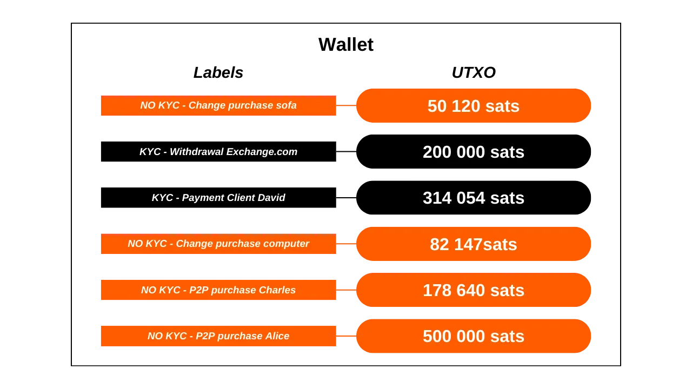Igal juhul pidage meeles, et hea märgistamine on selline, mida saate mõista siis, kui seda vajate. Kui teie Bitcoin'i rahakott on peamiselt mõeldud säästudeks, võib juhtuda, et märgised on teile kasulikud alles mitme aastakümne pärast. Seetõttu veenduge, et need oleksid selged, täpsed ja kõikehõlmavad.

Samuti on soovitatav säilitada mündi märgistus läbi tehingute. Näiteks tehes KYC-vaba UTXO konsolideerimist, veenduge, et märgistate tulemuseks oleva UTXO mitte ainult kui `konsolideerimine`, vaid spetsiifiliselt kui `KYC-vaba konsolideerimine`, et säilitada selge jälje mündi päritolust.

Lõpuks ei ole märgisele kuupäeva panemine kohustuslik. Enamik rahakottide tarkvara kuvab juba tehingu kuupäeva ja selle teabe on alati võimalik leida blokiahela uurijast, kasutades selle TXID-d.

## Õpetus: Märgistamine Specter Desktop'is

Ühendage ja avage oma rahakott Specter Desktop'is, seejärel valige `Addresses` vaheleht.

Siin näete kõigi oma aadresside loendit, samuti kõiki neil lukustatud bitcoine. Vaikimisi on aadressid identifitseeritud nende indeksi järgi `Label` veerus. Märgise muutmiseks klõpsake lihtsalt sellel, sisestage soovitud märgis ja kinnitage seejärel klõpsates sinisel ikoonil.

Teie märgis ilmub seejärel teie aadresside loendisse.

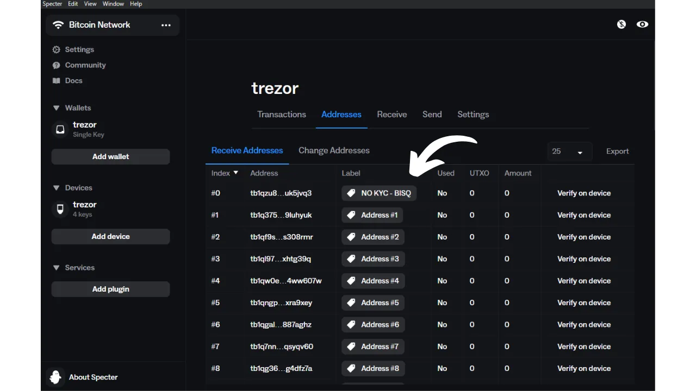

Samuti võite märgise ette määrata, kui jagate oma vastuvõtva aadressi saatjaga. Seda tehes, pääsedes ligi `Receive` vahelehele, märkige oma märgis pühendatud väljale.

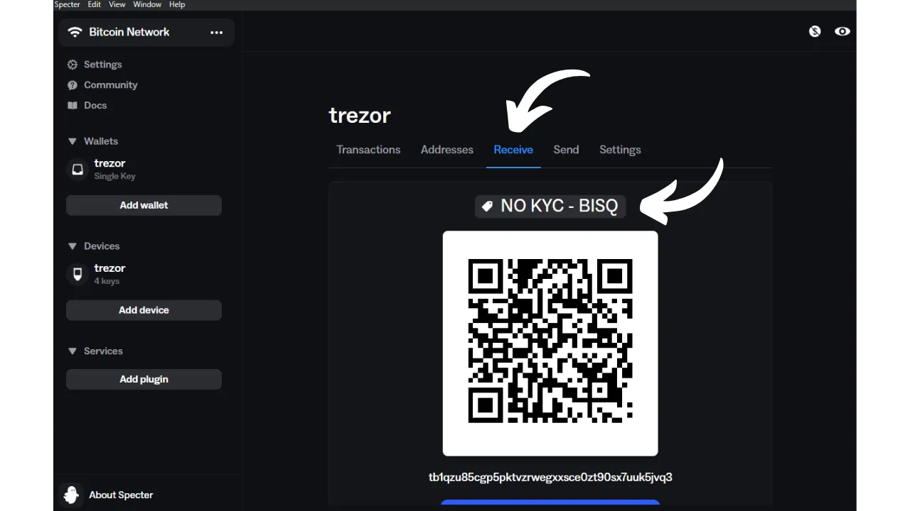

## Õpetus: Märgistamine Electrum'is

Electrum Wallet'is, pärast oma rahakotti sisse logimist, klõpsake tehingul, millele soovite märgise määrata, `History` vahelehelt.

Avaneb uus aken. Klõpsake `Description` kastil ja tippige oma märgis.

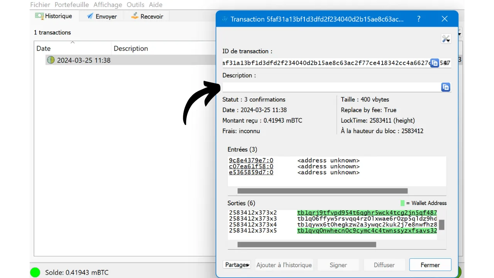

Kui märgis on sisestatud, võite selle akna sulgeda.

Teie märgis on edukalt salvestatud. Leiate selle `Description` vahelehelt.

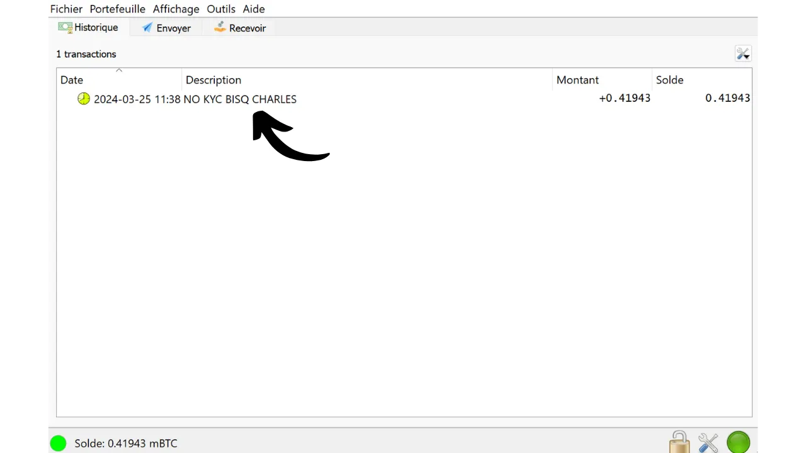

`Coins` vahelehel, kust saate teostada mündikontrolli, leiate oma märgise `Label` veerust.

## Õpetus: Märgistamine Green Wallet'is

Green Wallet rakenduses pääsege oma rahakotile ligi ja valige tehing, millele soovite märgise lisada. Seejärel klõpsake väikesel pliiatsi ikoonil, et märkida oma märgis.

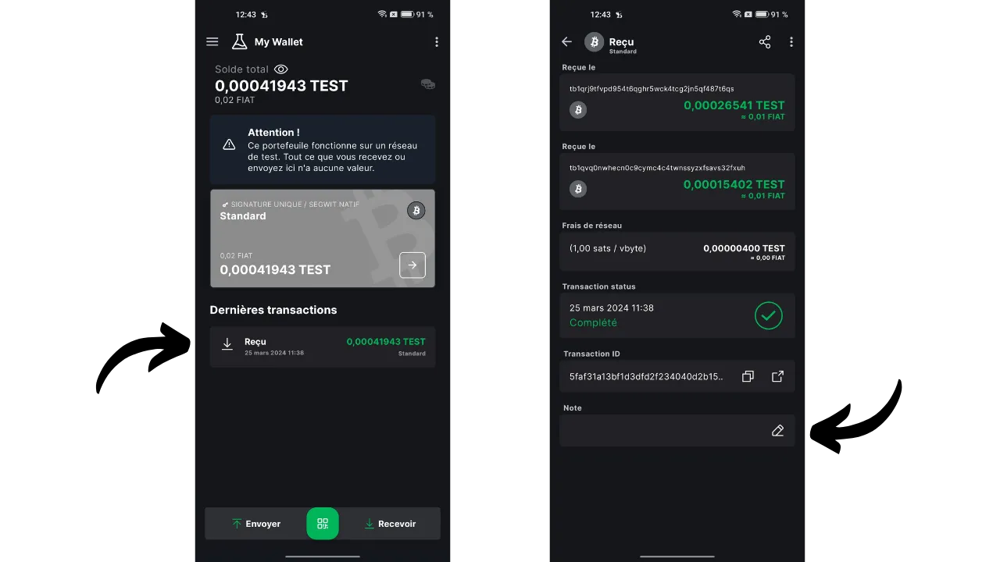

Tippige oma märgis, seejärel klõpsake rohelisel `Save` nupul.

Leiate oma märgise nii oma tehingu üksikasjadest kui ka oma rahakoti armatuurlauast.

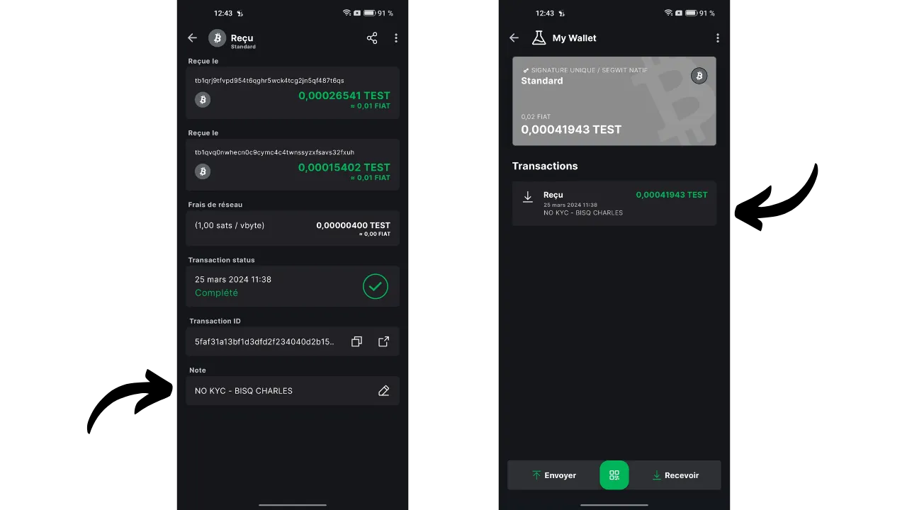

## Õpetus: Märgistamine Samourai Wallet'is

Samourai Wallet'is on erinevaid meetodeid, mis võimaldavad teil tehingule märgise määrata. Esimese meetodi jaoks alustage oma rahakoti avamisest ja valige tehing, millele soovite märgise lisada. Seejärel vajutage `Add` nupule, mis asub `Notes` kasti kõrval.

Sisestage oma silt ja kinnitage, klõpsates sinisel `Lisa` nupul.

Leiate oma sildi oma tehingu detailidest, aga ka oma rahakoti armatuurlauast.

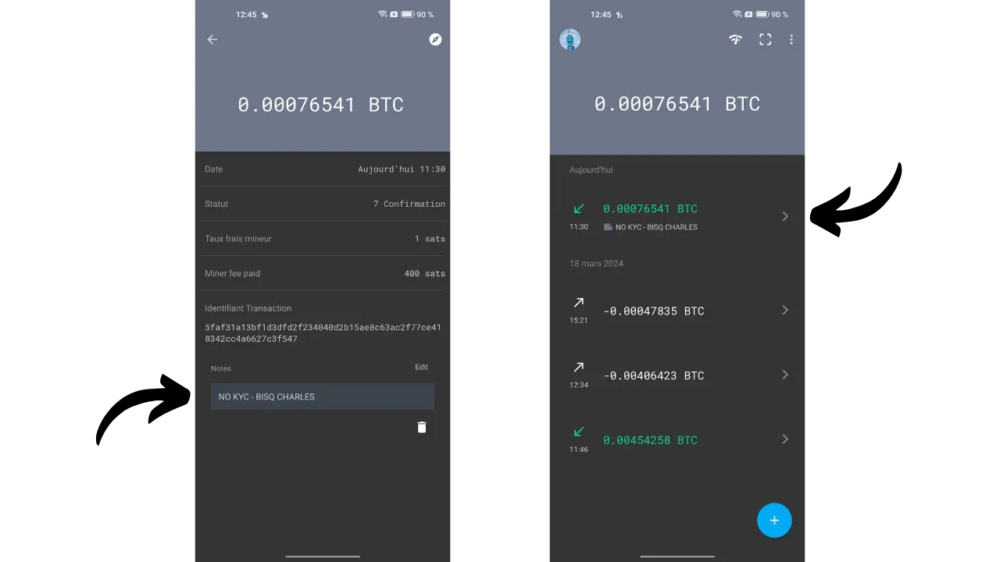
Teise meetodi jaoks klõpsake ekraani paremas ülanurgas asuvatel kolmel väikesel punktil, seejärel menüül `Näita kasutamata tehingu väljundeid`.

Siin leiate oma rahakotis olevate kõikide UTXO-de põhjaliku loetelu. Kuvatud nimekiri puudutab minu deposiidikontot, kuid seda toimingut saab korrata Whirlpooli kontode jaoks, navigeerides spetsiaalsest menüüst.

Seejärel klõpsake UTXO-l, mida soovite märgistada, järgnevalt `Lisa` nupul.

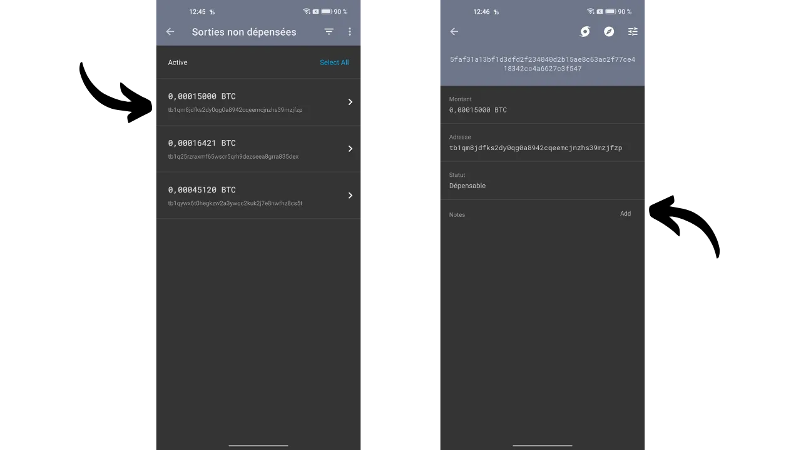

Sisestage oma silt ja kinnitage, klõpsates sinisel `Lisa` nupul. Seejärel leiate oma sildi nii oma tehingu detailidest kui ka oma rahakoti armatuurlauast.

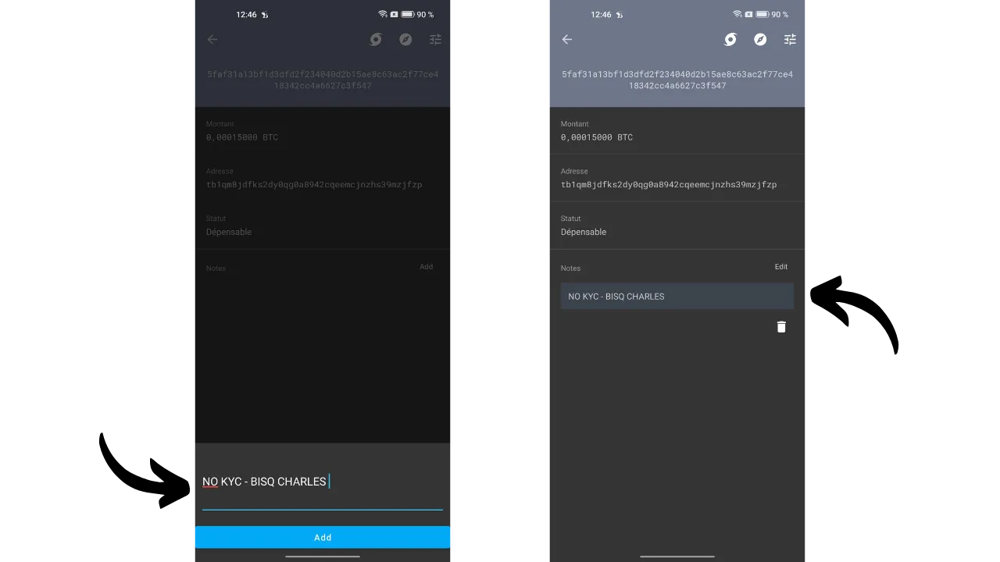

## Õpetus: Märgistamine Sparrow Wallet'is

Sparrow Wallet tarkvaraga on võimalik märgistada mitmel viisil. Lihtsaim meetod on lisada silt kohe, kui edastate saatjale vastuvõtu aadressi. Selleks klõpsake menüüs `Vasta` väljal `Silt` ja sisestage soovitud silt. See säilitatakse ja on tarkvaras kättesaadav kohe, kui aadressile on bitcoine vastu võetud.

Kui unustasite oma aadressi vastuvõtmisel märgistada, on siiski võimalik lisada silt hiljem menüüs `Tehingud`. Lihtsalt klõpsake oma tehingul veerus `Silt`, seejärel sisestage soovitud silt.

Samuti on teil võimalus lisada või muuta oma silte menüüs `Aadressid`.

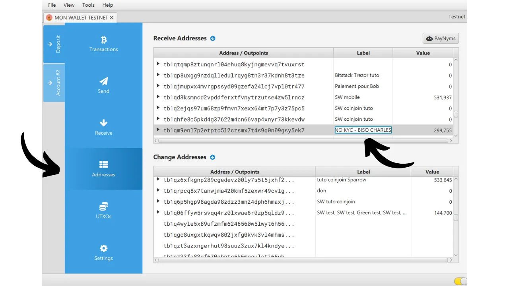

Lõpuks saate oma silte vaadata menüüs `UTXO-d`. Sparrow Wallet lisab automaatselt teie sildi taha sulgudes väljundi olemuse, mis aitab eristada vahetusena saadud UTXO-sid otse saadud UTXO-dest.

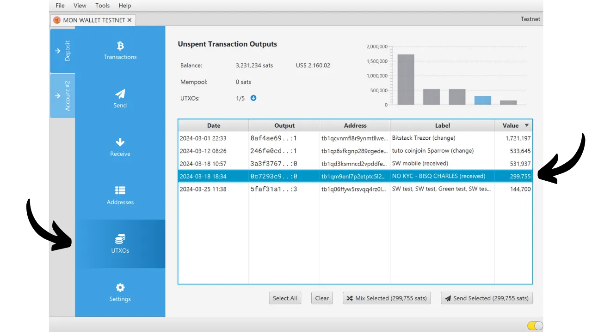