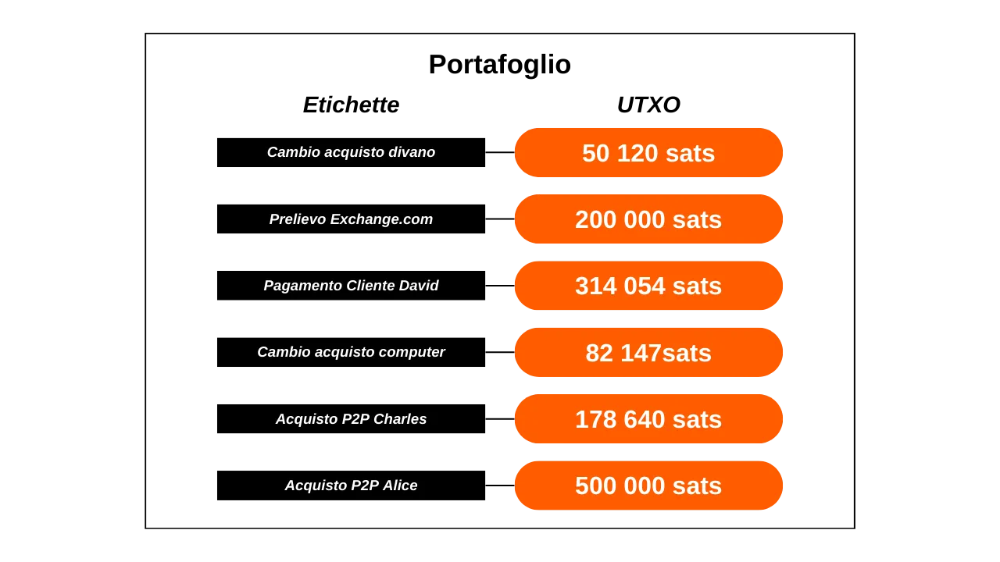
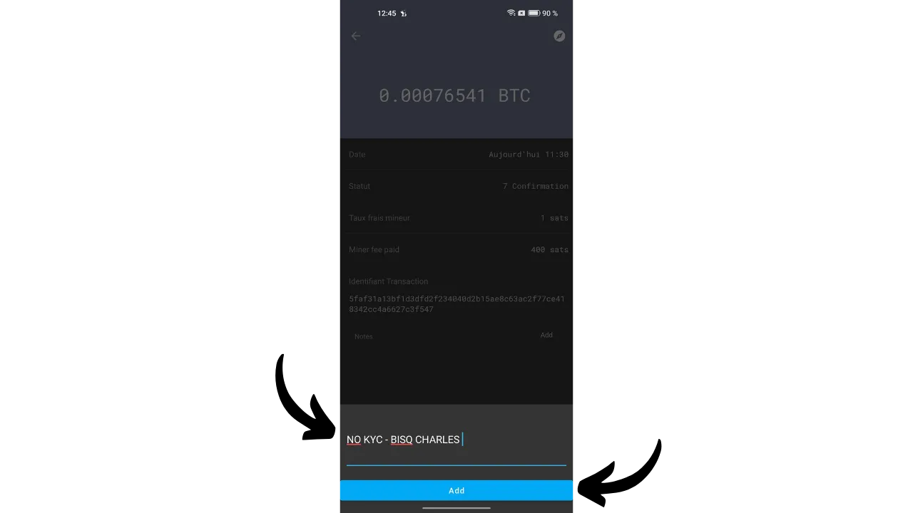
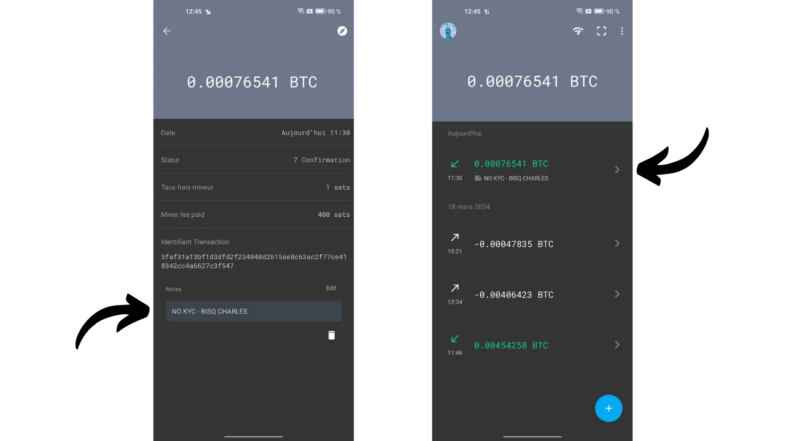
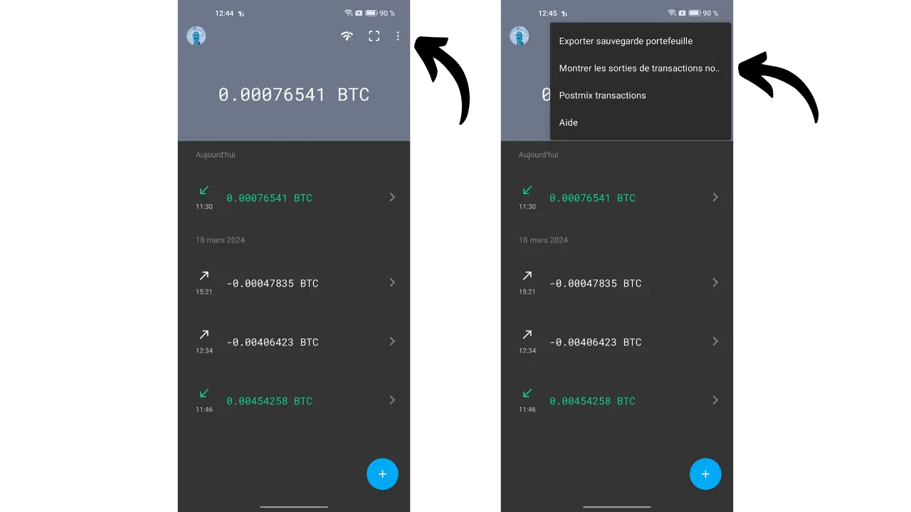
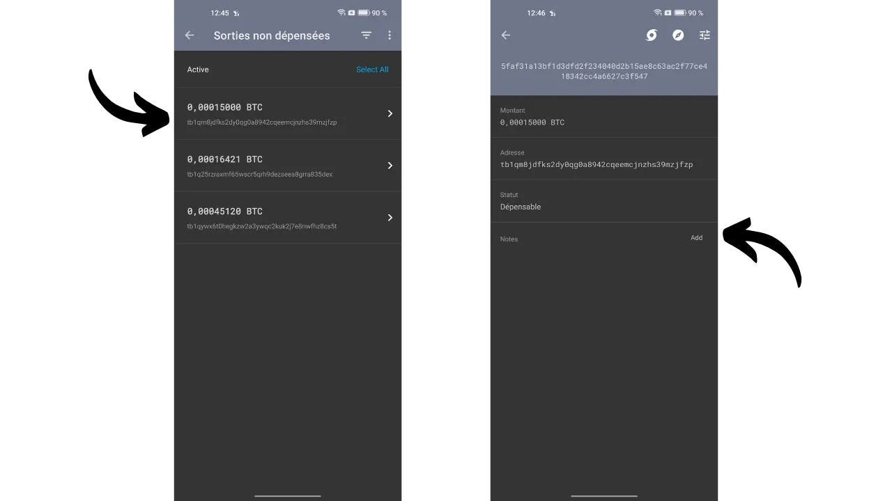
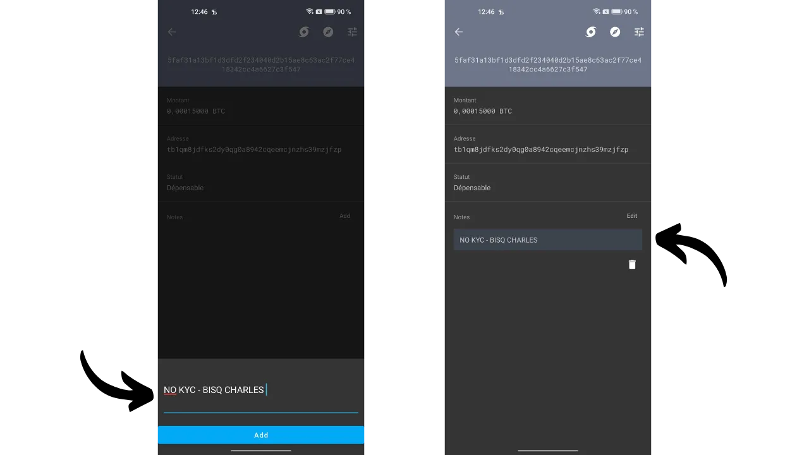
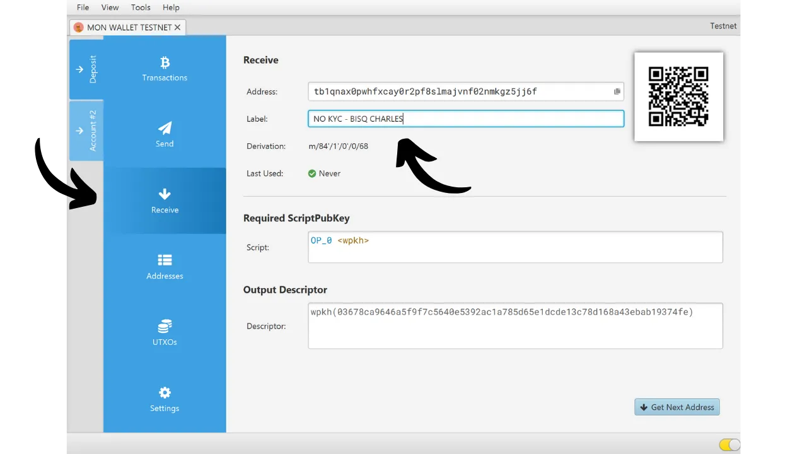
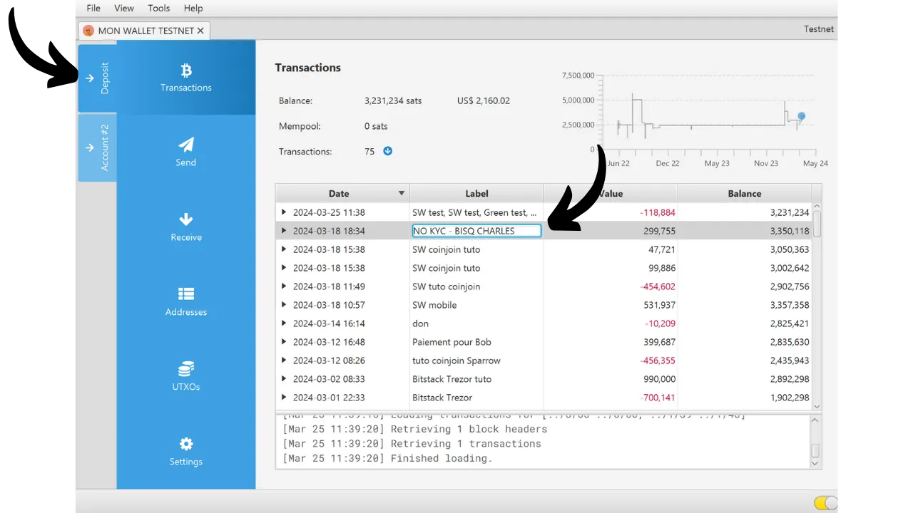
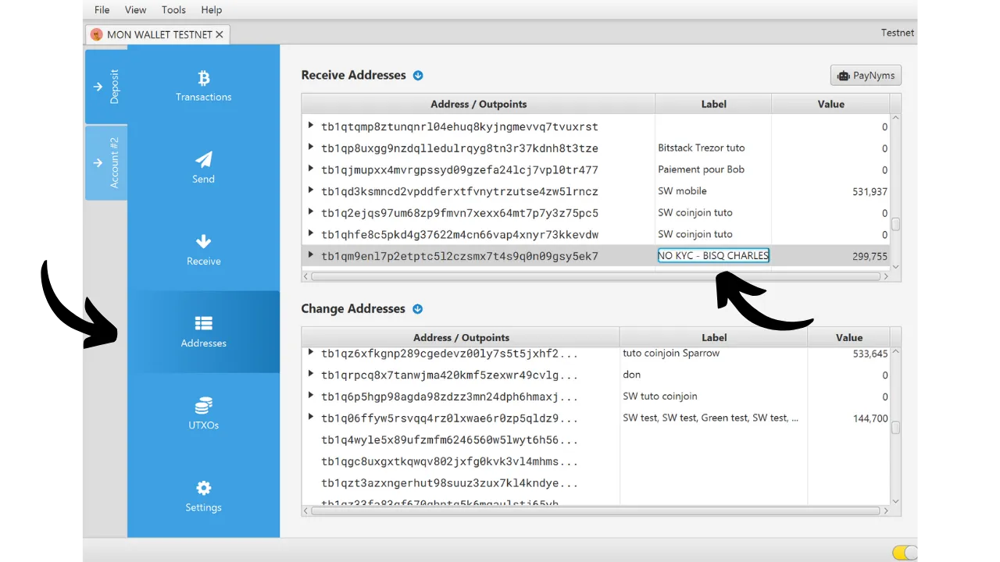
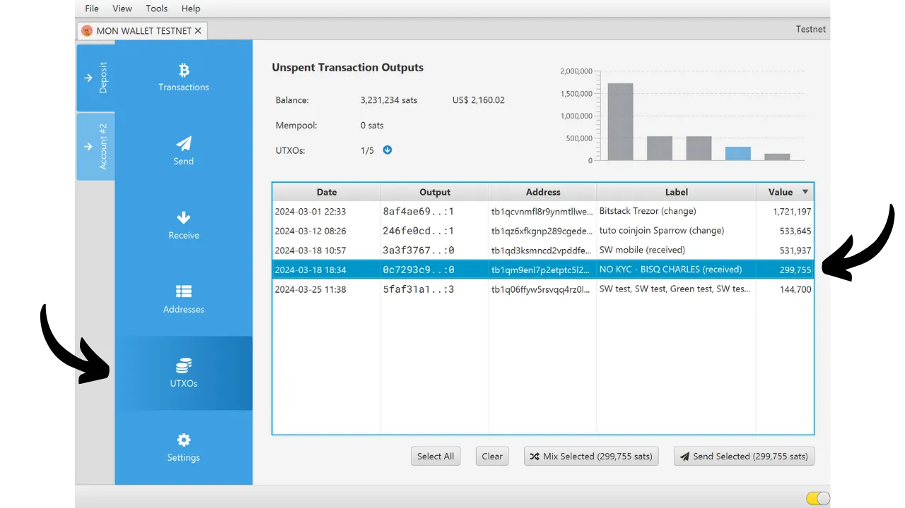

In questo tutorial scoprirai tutto ciò che devi sapere sull'etichettatura degli UTXO nel tuo portafoglio Bitcoin e sulla gestione degli stessi. Iniziamo con una parte teorica per comprendere appieno questi concetti, prima di passare a una sezione pratica in cui esploreremo come utilizzare concretamente le etichette nei principali wallet Bitcoin.

## Cos'è l'etichettatura UTXO?

"L’etichettatura" è una tecnica che permette di aggiungere un’annotazione, o etichetta, a uno specifico UTXO all’interno del proprio portafoglio Bitcoin. Queste etichette vengono salvate localmente dal software del portafoglio e non sono mai trasmesse sulla rete Bitcoin. Si tratta quindi di uno strumento privato di organizzazione personale.

Ad esempio, se ricevo un UTXO da una transazione P2P effettuata su Bisq con Charles, potrei etichettarlo come Acquisto P2P Bisq con Charles.

Attribuire etichette agli UTXO permette di ricordarne facilmente l’origine o l’uso previsto, facilitando la gestione dei fondi e migliorando la propria privacy. Questa pratica diventa ancora più efficace quando viene affiancata alla funzione di controllo degli UTXO, una peculiarità offerta da molti portafogli Bitcoin avanzati che permette all’utente di scegliere manualmente quali UTXO utilizzare come input in una transazione.

L’uso combinato di etichettatura e controllo degli UTXO consente di distinguere con precisione le varie fonti dei fondi, evitando di mescolare UTXO provenienti da contesti diversi. Questo aiuta a ridurre i rischi legati all’Euristica della Proprietà Comune degli Input (CIOH), secondo cui gli input di una transazione sono probabilmente controllati dallo stesso utente, ipotesi che può compromettere seriamente la privacy.

Riprendendo l’esempio di prima: supponiamo di aver ricevuto un UTXO no-KYC tramite Bisq. Vorrei evitare di combinarlo con un UTXO ottenuto, ad esempio, da un exchange centralizzato che richiede la verifica dell’identità (KYC). Applicando etichette distinte a ciascun UTXO, una per l’UTXO no-KYC e un’altra per quello KYC, posso identificarli facilmente e scegliere consapevolmente quale usare in una determinata spesa, grazie alla funzionalità di controllo degli UTXO.

## Come etichettare correttamente il tuo UTXO?
Non esiste un metodo universale per etichettare gli UTXO. Sta a te definire un sistema di etichettatura in modo da poterti orientare facilmente nel tuo portafoglio.
Un criterio fondamentale nell'etichettatura è la fonte dell'UTXO. Dovresti semplicemente indicare come questo UTXO è arrivato nel tuo portafoglio. Proviene da una piattaforma di scambio? Un pagamento di una fattura da parte di un cliente? Uno scambio peer-to-peer? O rappresenta il resto di un acquisto? Così, potresti specificare:
- `Prelievo Exchange.com`;
- `Pagamento Cliente David`;
- `Acquisto P2P Charles`;
- `Resto dall'acquisto del divano`.

Per gestire meglio i tuoi UTXO e organizzare in modo più efficiente i fondi nel portafoglio, puoi aggiungere alle etichette un indicatore che ne evidenzi la funzione. Se hai UTXO destinati a usi diversi e preferisci non mescolarli, puoi includere un identificatore nelle etichette per distinguerli facilmente.

Questi indicatori dipenderanno dai tuoi criteri, come la distinzione tra UTXO KYC (che conosce la tua identità) e no-KYC (anonimo), o tra fondi professionali e personali. Prendendo gli esempi di etichette precedentemente menzionati, questo potrebbe essere tradotto come:
- `KYC - Prelievo Exchange.com`;
- `KYC - Pagamento Cliente David`;
- `NO KYC - Acquisto P2P Charles`;
- `NO KYC - Resto dall'acquisto del divano`.
In ogni caso, tenete presente che un'etichettatura valida è quella che sarete in grado di comprendere quando ne avrete bisogno. Se il vostro portafoglio Bitcoin è principalmente destinato al risparmio, potrebbe essere che le etichette saranno utili solo tra diversi anni. Assicuratevi dunque che siano chiare, precise e complete.

È inoltre consigliabile mantenere l'identificatore dell'etichetta di un UTXO attraverso le transazioni. Ad esempio, durante una consolidamento UTXO no-KYC, assicuratevi di contrassegnare l'UTXO risultante non solo come `consolidamento`, ma specificamente come `consolidamento no-KYC` per mantenere una traccia chiara dell'origine della moneta.

Infine, non è necessario mettere una data su un'etichetta. La maggior parte dei software per portafogli mostra già la data della transazione, ed è sempre possibile recuperare queste informazioni con un block explorer utilizzando il suo TXID.

## Tutorial: Etichettatura su Specter Desktop

Apri il tuo portafoglio su Specter Desktop, poi seleziona la scheda Addresses.

Qui vedrai l’elenco di tutti i tuoi indirizzi, con gli eventuali bitcoin bloccati su di essi. Di default, gli indirizzi sono identificati dall’indice numerico visualizzato nella colonna Label. Per modificare un’etichetta:

Clicca sull’etichetta corrente.
Inserisci la nuova etichetta desiderata.
Conferma cliccando sull’icona blu.

L’etichetta apparirà subito nell’elenco.

Puoi anche assegnare un’etichetta in anticipo, quando condividi un indirizzo di ricezione. Per farlo, vai nella scheda Receive e inserisci l’etichetta nell’apposito campo prima di generare o condividere l’indirizzo.

## Tutorial: Etichettatura su Electrum

Su Electrum Wallet, dopo aver effettuato l’accesso al tuo portafoglio, vai nella scheda History e clicca sulla transazione a cui vuoi assegnare un’etichetta.

Si aprirà una finestra: clicca sulla casella Description e digita l’etichetta desiderata.

Una volta inserita l’etichetta, chiudi la finestra: la modifica verrà salvata automaticamente.

Troverai la tua etichetta associata alla transazione nella colonna Description della scheda History.

Nella scheda Coins, dove puoi eseguire il controllo degli UTXO, l’etichetta è visualizzata nella colonna Label.

## Tutorial: Etichettatura su Green Wallet

Nell'app Green Wallet, accedi al tuo portafoglio e seleziona la transazione che vuoi etichettare. Clicca ora sulla piccola icona della matita per annotare la tua etichetta.

Digita la tua etichetta, poi clicca sul pulsante verde `Save`.

Sarai in grado di trovare la tua etichetta sia nei dettagli della transazione che nella schermata principale del tuo portafoglio.

## Tutorial: Etichettatura su Samourai Wallet

In Samourai Wallet, esistono diversi metodi per assegnare un’etichetta a una transazione.

Per il primo metodo, apri il tuo portafoglio e seleziona la transazione a cui desideri aggiungere un’etichetta. Poi premi il pulsante `Add`, situato accanto alla casella `Notes`.

Digita la tua etichetta e conferma cliccando sul pulsante blu `Add`.

Troverai l’etichetta sia nei dettagli della transazione, sia nella pagina principale del tuo portafoglio.

Per il secondo metodo, tocca i tre puntini in alto a destra dello schermo, quindi seleziona dal menu l’opzione `Mostra Output di Transazione Non Spesi`.

Qui troverai un elenco completo di tutti gli UTXO presenti nel tuo portafoglio. L’elenco mostrato si riferisce al conto deposito, ma la stessa procedura si applica anche agli account Whirlpool, selezionandoli dal menu dedicato.

Seleziona l’UTXO che desideri etichettare, quindi premi il pulsante `Aggiungi`.

Digita la tua etichetta e conferma cliccando sul pulsante blu `Aggiungi`. Troverai quindi l’etichetta sia nei dettagli della transazione che nella pagina principale del tuo portafoglio.

## Tutorial: Etichettatura su Sparrow Wallet

Con il software **Sparrow Wallet**, è possibile assegnare etichette in diversi modi.

Il metodo più semplice è aggiungere un’etichetta in anticipo, quando si comunica un indirizzo di ricezione al mittente. Per farlo, nella scheda `Ricevi`, clicca sul campo `Etichetta` e inserisci l’etichetta desiderata. Questa verrà salvata e sarà visibile in tutto il software non appena i bitcoin verranno ricevuti su quell’indirizzo.

Se hai dimenticato di etichettare l’indirizzo al momento della ricezione, puoi aggiungerne una successivamente tramite la scheda `Transazioni`. Clicca semplicemente sulla tua transazione all’interno della colonna `Etichetta`, poi inserisci l’etichetta desiderata.

Hai anche la possibilità di aggiungere o modificare le etichette dalla scheda `Indirizzi`.

Infine, puoi visualizzare le tue etichette anche nella scheda `UTXO`. **Sparrow Wallet** aggiunge automaticamente tra parentesi, dopo la tua etichetta, la natura dell’output. Questo aiuta a distinguere gli UTXO ricevuti direttamente da quelli risultanti da transazioni interne.

