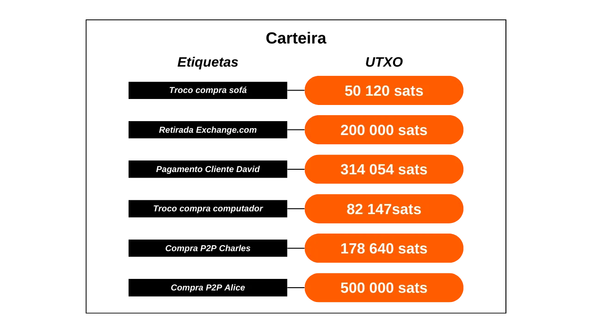
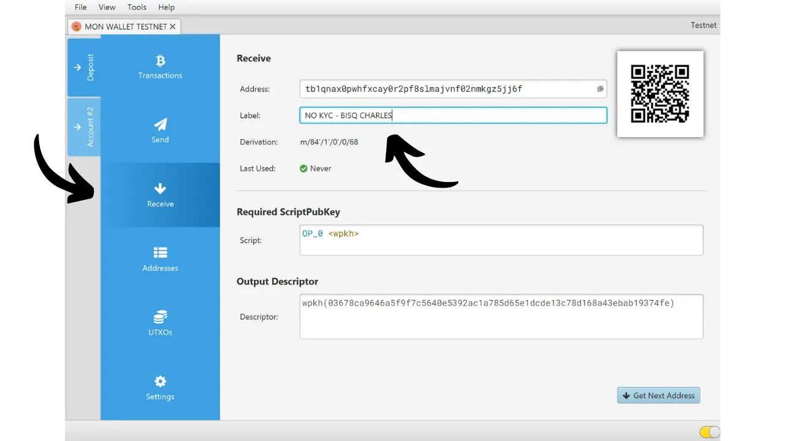

Neste tutorial, você descobrirá tudo o que precisa saber sobre a rotulagem de UTXOs na sua carteira Bitcoin e sobre o controle de moedas. Começamos com uma seção teórica para entender completamente esses conceitos, antes de passar para uma parte prática onde exploramos como usar concretamente rótulos no principal software de carteira Bitcoin.

## O que é rotulagem de UTXO?
"Rotulagem" é uma técnica que envolve associar uma anotação ou rótulo a um UTXO específico dentro de uma carteira Bitcoin. Essas anotações são armazenadas localmente pelo software da carteira e nunca são transmitidas pela rede Bitcoin. Assim, a rotulagem é uma ferramenta para gestão pessoal.

Por exemplo, se eu receber um UTXO de uma transação P2P via Bisq com Charles, eu poderia atribuir a ele o rótulo `Compra P2P Bisq Charles`.

A rotulagem permite lembrar a origem ou destino pretendido do UTXO, o que simplifica a gestão de fundos e otimiza a privacidade do usuário. A rotulagem se torna ainda mais relevante quando combinada com a funcionalidade de "controle de moedas". Controle de moedas é uma opção disponível em boas carteiras Bitcoin, que dá ao usuário a capacidade de escolher manualmente quais UTXOs específicos serão usados como entradas ao criar uma transação.

Usar uma carteira com controle de moedas, juntamente com a rotulagem de UTXO, permite aos usuários distinguir e selecionar precisamente UTXOs para suas transações, evitando assim a fusão de UTXOs de diferentes fontes. Essa prática reduz os riscos associados à Heurística de Propriedade Comum de Entrada (CIOH), que sugere a propriedade comum das entradas de uma transação, o que pode comprometer a privacidade do usuário.

Vamos voltar ao exemplo do meu UTXO sem KYC do Bisq; eu quero evitar combiná-lo com um UTXO vindo, digamos, de uma plataforma de câmbio regulamentada que conhece minha identidade. Colocando um rótulo distinto no meu UTXO sem KYC e no meu UTXO com KYC, serei capaz de identificar facilmente qual UTXO consumir como entrada para satisfazer um gasto, usando a funcionalidade de controle de moedas.

## Como rotular corretamente seu UTXO?
Não existe um método universal para rotular UTXOs que sirva para todos. Cabe a você definir um sistema de rotulagem para que possa se orientar facilmente na sua carteira.
Um critério crucial na rotulagem é a fonte do UTXO. Você deve simplesmente indicar como essa moeda chegou à sua carteira. É de uma plataforma de câmbio? Um pagamento de fatura por um cliente? Uma troca entre pares? Ou representa o troco de uma compra? Assim, você poderia especificar:
- `Saque Exchange.com`;
- `Pagamento Cliente David`;
- `Compra P2P Charles`;
- `Troco de compra de sofá`.

Para refinar sua gestão de UTXO e aderir às suas estratégias de segregação de fundos dentro da sua carteira, você poderia enriquecer seus rótulos com um indicador adicional que reflita essas separações. Se sua carteira contém duas categorias de UTXOs que você não quer misturar, você poderia integrar um marcador em seus rótulos para distinguir claramente esses grupos.

Esses marcadores de separação dependerão dos seus próprios critérios, como a distinção entre UTXO com KYC (conhecendo sua identidade) e sem KYC (anônimo), ou entre fundos profissionais e pessoais. Tomando os exemplos de rótulos mencionados anteriormente, isso poderia ser traduzido como:
- `KYC - Saque Exchange.com`;
- `KYC - Pagamento Cliente David`;
- `SEM KYC - Compra P2P Charles`;
- `SEM KYC - Troco de compra de sofá`.
De qualquer forma, tenha em mente que uma boa rotulagem é aquela que você será capaz de entender quando precisar. Se a sua carteira de Bitcoin é primariamente destinada para poupança, pode ser que as etiquetas só sejam úteis para você em várias décadas. Portanto, certifique-se de que elas sejam claras, precisas e abrangentes.

Também é aconselhável perpetuar a rotulagem de uma moeda ao longo das transações. Por exemplo, durante uma consolidação UTXO sem KYC, certifique-se de marcar o UTXO resultante não apenas como `consolidação`, mas especificamente como `consolidação sem KYC` para manter um rastro claro da origem da moeda.

Finalmente, não é obrigatório colocar uma data em uma etiqueta. A maioria dos softwares de carteira já exibe a data da transação, e sempre é possível recuperar essa informação em um explorador de blocos usando seu TXID.

## Tutorial: Rotulagem no Specter Desktop

Conecte e abra sua carteira no Specter Desktop, em seguida, selecione a aba `Addresses`.

Aqui, você verá a lista de todos os seus endereços, bem como quaisquer bitcoins que estão bloqueados neles. Por padrão, os endereços são identificados pelo seu índice sob a coluna `Label`. Para mudar uma etiqueta, basta clicar nela, inserir a etiqueta desejada e, em seguida, confirmar clicando no ícone azul.

Sua etiqueta então aparecerá na lista dos seus endereços.

Você também pode atribuir uma etiqueta antecipadamente, quando compartilhar seu endereço de recebimento com o remetente. Para fazer isso, acessando a aba `Receive`, anote sua etiqueta no campo dedicado.

## Tutorial: Rotulagem no Electrum

No Electrum Wallet, após fazer login na sua carteira, clique na transação à qual você deseja atribuir uma etiqueta a partir da aba `History`.

Uma nova janela se abre. Clique na caixa `Description` e digite sua etiqueta.

Uma vez que a etiqueta é inserida, você pode fechar esta janela.

Sua etiqueta foi salva com sucesso. Você pode encontrá-la sob a aba `Description`.

Na aba `Coins`, da qual você pode realizar o controle de moedas, sua etiqueta é encontrada na coluna `Label`.

## Tutorial: Rotulagem no Green Wallet

No aplicativo Green Wallet, acesse sua carteira e selecione a transação que você deseja rotular. Em seguida, clique no pequeno ícone de lápis para anotar sua etiqueta.

Digite sua etiqueta, em seguida clique no botão verde `Save`.

Você poderá encontrar sua etiqueta tanto nos detalhes da sua transação quanto no painel de controle da sua carteira.

## Tutorial: Rotulagem no Samourai Wallet

No Samourai Wallet, existem diferentes métodos que permitem atribuir uma etiqueta a uma transação. Para o primeiro, comece abrindo sua carteira e selecione a transação à qual você deseja adicionar uma etiqueta. Em seguida, pressione o botão `Add`, localizado ao lado da caixa `Notes`.

Digite sua etiqueta e confirme clicando no botão azul `Add`.

Você encontrará sua etiqueta nos detalhes da sua transação, mas também no painel de controle da sua carteira.

Para o segundo método, clique nos três pequenos pontos no canto superior direito da tela, em seguida, no menu `Show Unspent Transaction Outputs`.

Aqui, você encontrará uma lista completa de todos os UTXOs presentes na sua carteira. A lista exibida pertence à minha conta de depósito, no entanto, esta operação pode ser replicada para contas Whirlpool navegando pelo menu dedicado.

Em seguida, clique no UTXO que deseja etiquetar, seguido pelo botão `Add`.

Digite sua etiqueta e confirme clicando no botão azul `Add`. Você então encontrará sua etiqueta tanto nos detalhes da sua transação quanto no painel de controle da sua carteira.

## Tutorial: Etiquetagem no Sparrow Wallet

Com o software Sparrow Wallet, é possível atribuir etiquetas de várias maneiras. O método mais simples é adicionar uma etiqueta antecipadamente, ao comunicar um endereço de recebimento ao remetente. Para fazer isso, no menu `Receive`, clique no campo `Label` e insira a etiqueta de sua escolha. Isso será preservado e acessível em todo o software assim que os bitcoins forem recebidos no endereço.

Se você esqueceu de etiquetar seu endereço ao recebê-lo, ainda é possível adicionar uma etiqueta posteriormente através do menu `Transactions`. Basta clicar na sua transação dentro da coluna `Label`, e então inserir a etiqueta desejada.

Você também tem a opção de adicionar ou modificar suas etiquetas a partir do menu `Addresses`.

Finalmente, você pode visualizar suas etiquetas no menu `UTXOs`. Sparrow Wallet adiciona automaticamente entre parênteses atrás da sua etiqueta a natureza da saída, o que ajuda a distinguir UTXOs resultantes de troco daqueles recebidos diretamente.

