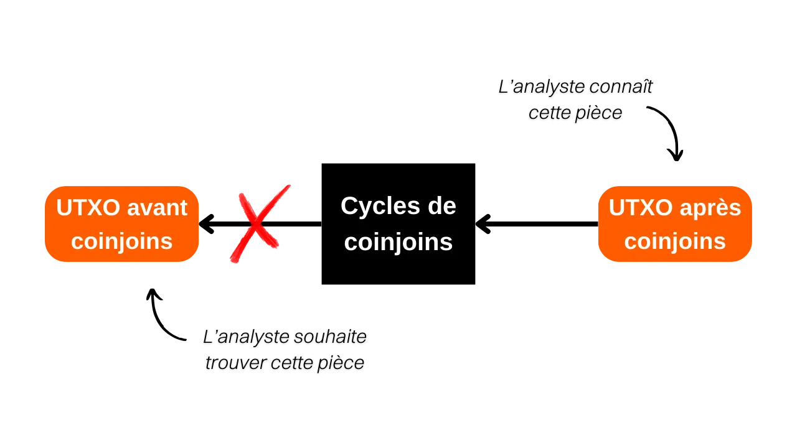
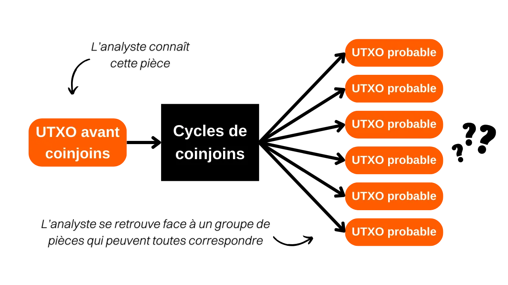
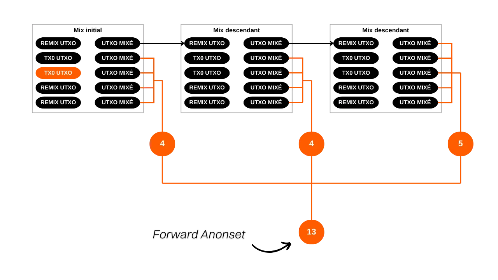
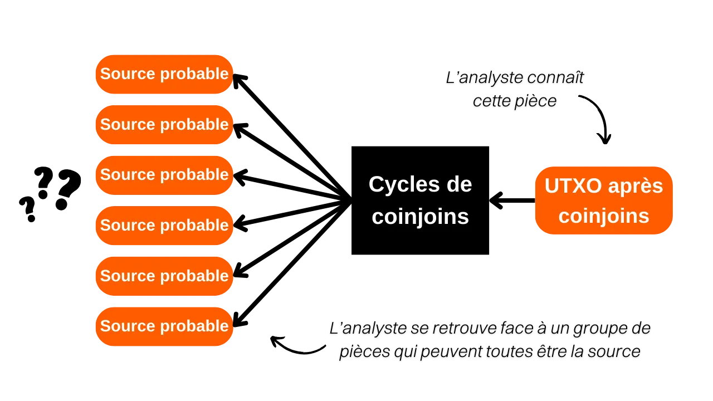
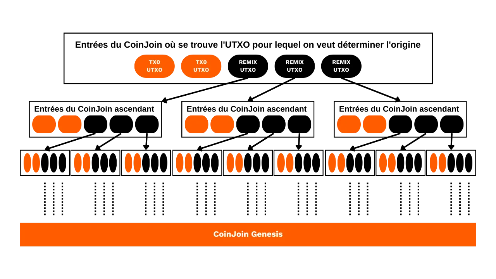

*"Break the link your coins leave behind"*

Dans ce tutoriel, nous allons étudier le concept d'anonsets, des indicateurs qui permettent d'estimer la qualité d'un processus de coinjoins sur Whirlpool. Vous allez apprendre à les calculer et à les interpréter. Après la théorie vient la pratique : nous allons voir comment déterminer les anonsets d'une pièce grâce à l'outil Python Whirlpool Stats Tools.

## Qu'est-ce qu'un coinjoin sur Bitcoin ?
**Le coinjoin est une technique qui permet de casser le traçage des bitcoins sur la blockchain**. Il repose sur une transaction collaborative à la structure spécifique de même nom : la transaction coinjoin. 

Les transactions coinjoin permettent d'améliorer la protection de la vie privée des utilisateurs de Bitcoin en rendant l'analyse des transactions plus difficile pour les observateurs extérieurs. Cette structure permet la combinaison de plusieurs pièces indépendantes, qui appartiennent à plusieurs utilisateurs, en une seule transaction, ce qui rend difficile la détermination des liens entre les adresses d'entrée et de sortie. 

Le fonctionnement général du coinjoin est le suivant : différents utilisateurs souhaitant mixer déposent un montant en input d'une transaction. Ces inputs ressortiront en différents outputs de même montant. À la sortie de la transaction, il est donc impossible de déterminer quel output appartient à quel utilisateur. Il n'y a techniquement aucun lien entre les entrées et les sorties de la transaction coinjoin. Le lien entre chaque utilisateur et chaque UTXO est cassé, de la même manière que l'historique de chaque pièce.


Exemple d'une transaction coinjoin :
[323df21f0b0756f98336437aa3d2fb87e02b59f1946b714a7b09df04d429dec2](https://mempool.space/fr/tx/323df21f0b0756f98336437aa3d2fb87e02b59f1946b714a7b09df04d429dec2)

Pour permettre le coinjoin sans qu'aucun utilisateur ne perde la main sur ses fonds à aucun moment, la transaction est d'abord construite par un coordinateur puis transmise à chaque utilisateur. Chacun d'eux signe alors la transaction de son côté en vérifiant qu'elle lui convient, puis toutes les signatures sont ajoutées à la transaction. Si un utilisateur ou le coordinateur tente de voler les fonds des autres en modifiant les outputs de la transaction coinjoin, alors les signatures seront invalides et la transaction sera refusée par les nœuds. 

Plusieurs implémentations de coinjoin existent, telles que Whirlpool, JoinMarket ou Wabisabi. Leur but est de faciliter le processus de coordination entre les participants et renforcer l'efficacité de la transaction coinjoin. 

Dans ce tutoriel, nous allons étudier mon implémentation préférée : Whirlpool. Celle-ci est disponible sur Samourai Wallet et Sparrow Wallet.

## Quelle est l'utilité du coinjoin sur Bitcoin ?
L'utilité du coinjoin réside dans sa capacité à offrir du déni plausible, en noyant votre pièce au sein d'un groupe de pièces indifférenciables. Le but recherché par cette action est de briser les liens de traçabilité, tant du passé vers le présent que du présent vers le passé. 

Autrement dit, un analyste connaissant votre transaction initiale à l'entrée des cycles de coinjoins ne devrait pas être en mesure d'identifier avec certitude votre UTXO à la sortie des cycles de remix (analyse entrée de cycles vers sortie de cycles).

Inversement, il faut qu'un analyste connaissant votre UTXO à la sortie des cycles de coinjoin se trouve dans l'incapacité de déterminer la transaction originelle à l'entrée des cycles (analyse sortie de cycles vers entrée de cycles).

Pour mesurer à quel point il est difficile pour un analyste de réaliser ces liens passé-présent et présent-passé, il faut déterminer la taille des groupes parmi lesquels votre pièce est cachée. Cela nous permettra de savoir combien d'analyses disposent de la même probabilité. Par exemple, si la bonne analyse se trouve parmi un groupe de 3 analyses avec la même probabilité, alors vous n'êtes pas bien cachés. Au contraire, si la bonne analyse se trouve parmi 20 000 analyses qui ont toutes la même probabilité, alors vous êtes bien caché.

Et justement, la taille de ces groupes, ce sont des indicateur que l'on appelle les anonsets.

## Comprendre les anonsets
Les anonsets servent d'indicateurs pour évaluer le degré de confidentialité d'un UTXO particulier. Plus spécifiquement, ils mesurent le nombre d'UTXOs indistinguables au sein de l'ensemble qui inclut la pièce étudiée. Puisqu'il faut disposer d'un groupe d'UTXOs identiques, les anonsets sont généralement calculés au sein d'un cycle de coinjoin, et de part leur homogénéité, on les utilise surtout pour les coinjoin Whirlpool. 

Les anonsets permettent, le cas échéant, de juger de la qualité des coinjoin. Un anonset de grande taille signifie un niveau d'anonymat accru, car il devient difficile de distinguer un UTXO spécifique au sein de l'ensemble. 

Deux types d'anonsets existent :
- **L'ensemble d'anonymat prospectif ;**
- **L'ensemble d'anonymat rétrospectif.** 

Le premier indique la taille du groupe parmi lequel se cache l'UTXO étudié en sortie de cycle, sachant l'UTXO en entrée, c'est-à-dire le nombre de pièces indifférenciables présentes au sein de ce groupe. Cet indicateur permet de mesurer la résistance de la confidentialité de la pièce face à une analyse passé vers présent (entrée vers sortie). En anglais, le nom de cet indicateur est « *forward anonset* », ou « *forward-looking metrics* ». 

Cette métrique permet d'estimer dans quelle mesure votre UTXO est protégé contre les tentatives de reconstitution de son historique depuis son point d'entrée jusqu'à son point de sortie dans le processus de coinjoin. 

Par exemple, si votre transaction a participé à son premier cycle de coinjoin et que deux autres cycles descendants ont été réalisés, l'anonset prospectif de votre pièce s'élèverait à `13` :

Le second indique le nombre de sources possibles pour une pièce donnée, sachant l'UTXO en sortie de cycle. Cet indicateur permet de mesurer la résistance de la confidentialité de la pièce face à une analyse présent vers passé (sortie vers entrée), c'est-à-dire à quel point il est difficile pour un analyste de remonter à l'origine de votre pièce, après qu'elle est passée dans des coinjoins. En anglais, le nom de cet indicateur est « *backward anonset* », ou « *backward-looking metrics* ».

 En connaissant votre UTXO à la sortie des cycles, l'anonset rétrospectif détermine le nombre de transactions Tx0 potentielles qui auraient pu constituer votre entrée dans les cycles de coinjoins. Sur le schéma ci-dessous, cela correspond à l'addition de toutes les bulles oranges.
 
 
## Calculer les anonsets avec Whirlpool Stats Tools (WST)
Pour calculer ces indicateurs sur vos propres pièces qui sont passées dans des cycles de coinjoin, vous pouvez utiliser un outil spécialement développé par Samourai Wallet : *Whirlpool Stats Tools*.

Si vous disposez d'un RoninDojo, WST est préinstallé sur votre nœud. Vous pouvez donc passer les étapes d'installations et suivre directement les étapes d'utilisation. Si vous ne disposez pas d'un nœud RoninDojo, nous allons voir comment installer l'outil sur un ordinateur.

Vous aurez besoin de : Tor Browser (ou Tor), Python 3.4.4 ou supérieur, git et pip3. Ouvrez un terminal. Pour vérifier si ces logiciels sont bien installés sur votre machine, et pour vérifier leur version, tapez les commandes suivantes :
```
python --version
git --version
pip --version
```

Si besoin, vous pouvez les télécharger de puis leurs sites web respectifs :
- https://www.python.org/downloads/ (pip vient normalement avec Python);
- https://www.torproject.org/fr/download/ ;
- https://git-scm.com/downloads.

Clonez le dépôt :
```
git clone https://code.samourai.io/whirlpool/whirlpool_stats.git
```

Naviguez dans le répertoire de WST :
```
cd whirlpool_stats
```

Installez les dépendances :
```
pip3 install -r ./requirements.txt
```

Vous pouvez éventuellement les installer manuellement :
```
pip install PySocks
pip install requests[socks]
pip install plotly
pip install datasketch
pip install numpy
pip install python-bitcoinrpc
```


Elle affiche ainsi un score rétrospectif de `34 593` et un score prospectif de `45 202`. Concrètement, cela veut dire deux choses :

- Si un analyste connaît ma pièce à la sortie des cycles et tente de remonter à son origine, il se heurtera à `34 593` sources potentielles, chacune ayant une probabilité égale d'être la mienne ;
- Si un analyste connaît ma pièce à l'entrée des cycles et cherche à déterminer sa correspondance à la sortie, il sera confronté à `45 202` UTXO possibles, chacun pouvant être le mien avec la même probabilité.


Toutefois, il n'est pas systématiquement nécessaire de calculer les anonsets de chacune de vos pièces en coinjoins. La conception même de Whirlpool vous apporte déjà des garanties. Comme mentionné précédemment, l'anonset rétrospectif constitue rarement un sujet de préoccupation. Dès votre mix initial, vous obtenez un score rétrospectif particulièrement élevé. Concernant l'anonset prospectif, il suffit de conserver votre pièce dans le compte post-mix pendant une durée suffisamment importante.