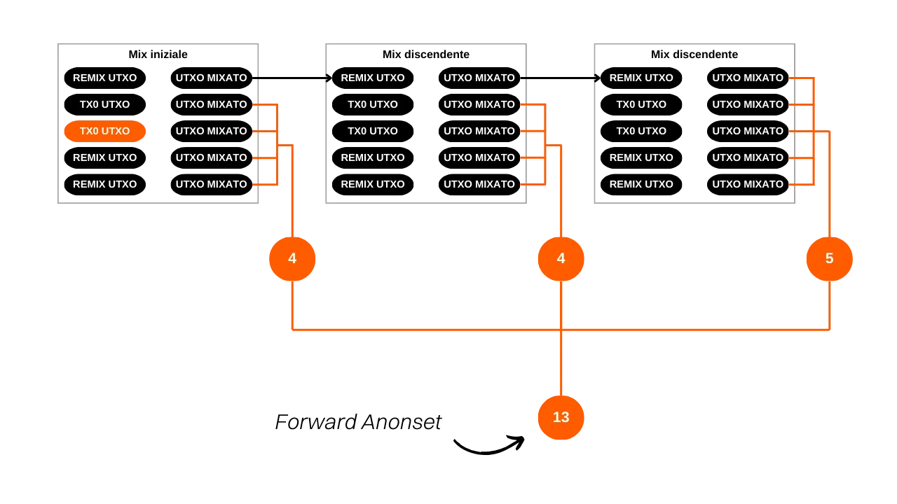
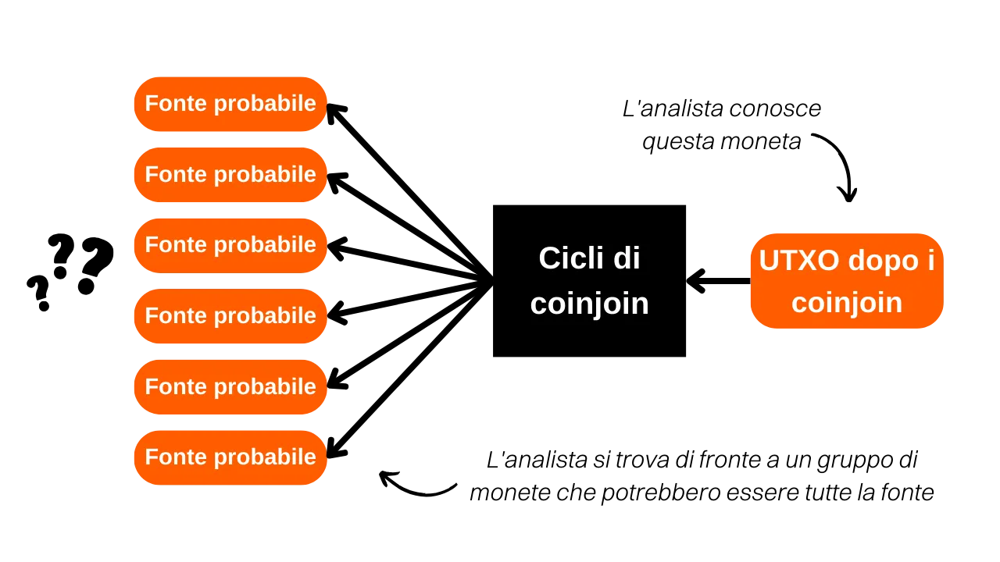
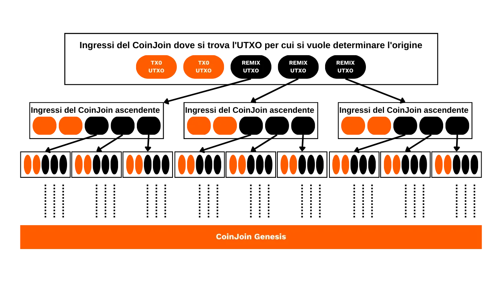
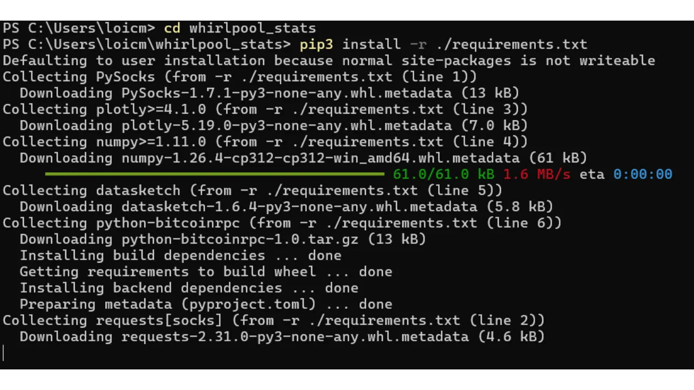
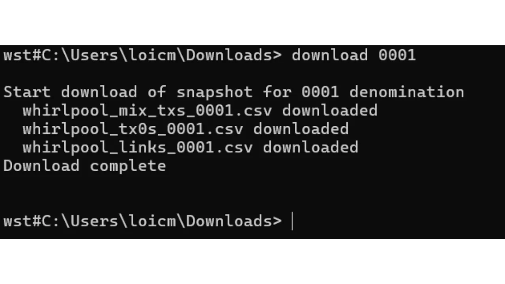
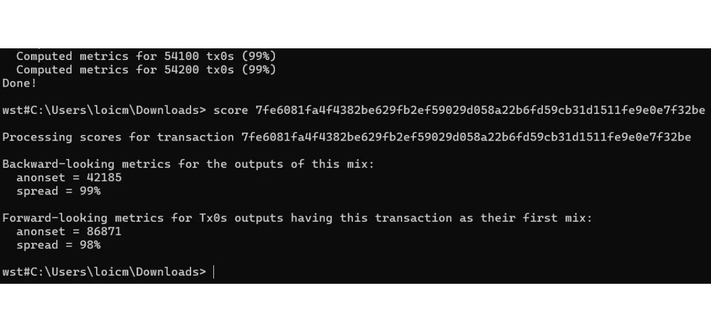

***ATTENZIONE:** In seguito all'arresto dei fondatori di Samourai Wallet e al sequestro dei loro server il 24 aprile, lo strumento Whirlpool Stats Tool non è più disponibile per il download, poiché era ospitato sul Gitlab di Samourai. Anche se avevate precedentemente scaricato questo strumento localmente sul vostro computer, o era installato sul vostro nodo RoninDojo, WST non funzionerà al momento. Dipendeva dai dati forniti da OXT.me per il suo funzionamento, e questo sito non è più accessibile. Attualmente, WST non è particolarmente utile poiché il protocollo Whirlpool è inattivo. Tuttavia, rimane possibile che questi software possano essere rimessi in servizio nelle prossime settimane. Inoltre, la parte teorica di questo articolo rimane pertinente per comprendere i principi e gli obiettivi dei coinjoins in generale (non solo Whirlpool), oltre a comprendere l'efficacia del modello Whirlpool. Potrete anche imparare a quantificare la privacy fornita dai cicli di coinjoin.*

_Stiamo seguendo da vicino l'evoluzione di questo caso così come gli sviluppi relativi agli strumenti associati. Siate certi che aggiorneremo questo tutorial non appena saranno disponibili nuove informazioni._

_Questo tutorial è fornito solo a scopo educativo e informativo. Non approviamo né incoraggiamo l'uso di questi strumenti per scopi criminali. È responsabilità di ogni utente rispettare le leggi vigenti nella propria giurisdizione._

---

*"Interrompi il collegamento lasciato dai tuo UTXO"*

In questo tutorial, studieremo il concetto di anonset, indicatore che ci permette di stimare la qualità di un processo di coinjoin su Whirlpool. Copriremo il metodo di calcolo e interpretazione di questo indicatore. Dopo la parte teorica, passeremo alla pratica imparando a calcolare l' anonset di una transazione specifica utilizzando lo strumento Python *Whirlpool Stats Tools* (WST).

## Cos'è un coinjoin su Bitcoin?
**Il coinjoin è una tecnica che interrompe la tracciabilità dei bitcoin sulla blockchain**. Si basa su una transazione collaborativa con una struttura specifica dello stesso nome: la transazione coinjoin.

Le transazioni coinjoin migliorano la privacy degli utenti Bitcoin complicando l'analisi della blockchain per gli osservatori esterni. La loro struttura consente di unire più UTXO da diversi utenti in una singola transazione, oscurando così le tracce e rendendo difficile determinare i collegamenti tra gli indirizzi di input e output.

Il principio del coinjoin si basa su un approccio collaborativo: diversi utenti che desiderano mescolare i loro bitcoin depositano importi identici come input della stessa transazione. Questi importi vengono poi redistribuiti in output di valore equivalente. Al termine della transazione, diventa impossibile associare un output specifico ad un dato utente. Non esiste un collegamento diretto tra gli input e gli output, rompendo così l'associazione tra gli utenti e i loro UTXO, così come la storia di ogni UTXO.


Esempio di una transazione coinjoin:
[323df21f0b0756f98336437aa3d2fb87e02b59f1946b714a7b09df04d429dec2](https://mempool.space/tx/323df21f0b0756f98336437aa3d2fb87e02b59f1946b714a7b09df04d429dec2)

Per effettuare un coinjoin garantendo che ogni utente mantenga il controllo sui propri fondi in ogni momento, il processo inizia con la costruzione della transazione da parte di un coordinatore, che poi la trasmette a ciascun partecipante. Ogni utente firma quindi la transazione dopo aver verificato che sia di suo gradimento. Tutte le firme raccolte vengono infine integrate nella transazione. Se un tentativo di dirottare fondi viene fatto da un utente o dal coordinatore, modificando gli output della transazione coinjoin, le firme risulteranno invalide, portando al rifiuto della transazione da parte dei nodi.

Esistono diverse implementazioni di coinjoin, come Whirlpool, JoinMarket o Wabisabi, ognuna con l'obiettivo di gestire il coordinamento tra i partecipanti ed aumentare l'efficienza delle transazioni coinjoin.
In questo tutorial, ci concentreremo sulla mia implementazione preferita: Whirlpool, disponibile su Samourai Wallet e Sparrow Wallet. A mio avviso, è l'implementazione più efficiente per i coinjoin su Bitcoin.
## Qual è l'utilità del coinjoin su Bitcoin?
L'utilità del coinjoin risiede nella sua capacità di produrre una negabilità plausibile, mischiando il tuo UTXO all'interno di un gruppo di altri UTXO. L'obiettivo di questa azione è rompere i collegamenti di tracciabilità, sia dal passato al presente che dal presente al passato.

In altre parole, un analista che conosce la tua transazione iniziale d'ingresso nei cicli di coinjoin non dovrebbe essere in grado di identificare con certezza il tuo UTXO in uscita dai cicli di remix (analisi dall'ingresso nel ciclo all'uscita dal ciclo).


Al contrario, un analista che conosce il tuo UTXO in uscita dai cicli di coinjoin non dovrebbe essere in grado di determinare la transazione originale d'ingresso nei cicli di whirpool (analisi dall'uscita all'ingresso del ciclo). 


Per valutare la difficoltà per un analista di collegare il passato al presente e viceversa, è necessario quantificare la dimensione dei gruppi all'interno dei quali il tuo UTXO è nascosto. Questa misura ci dice il numero di analisi che hanno una probabilità identica. Quindi, se l'analisi corretta condivide altre 3 analisi di uguale probabilità, il tuo livello di occultamento è molto basso. D'altra parte, se l'analisi corretta è all'interno di un insieme di 20.000 analisi tutte ugualmente probabili, il tuo UTXO è ben nascosto.

E precisamente, la dimensione di questi gruppi rappresenta l'"anonsets".

## Comprendere l'anonset
Gli anonset fungono da indicatori per valutare il grado di privacy di un particolare UTXO. Più specificamente, misurano il numero di UTXO indistinguibili all'interno dell'insieme che include quello oggetto di analisi. Il requisito di un insieme di UTXO omogeneo significa che l'anonset viene solitamente calcolato sui cicli di coinjoin. L'uso di questo indicatore è particolarmente rilevante per i coinjoin di Whirlpool a causa della loro uniformità.

L' anonsets consente, se appropriato, di giudicare la qualità dei coinjoin. Maggiore è l'anonset maggiore più alto è il livello di anonimato, poiché diventa difficile distinguere un UTXO specifico all'interno dell'insieme.

Ci sono due tipi di anonset:
- **L'insieme di anonimato prospettico;**
- **L'insieme di anonimato retrospettivo.**
Il primo indicatore mostra la dimensione del gruppo tra cui l'UTXO analizzato è nascosto alla fine del ciclo, conoscendo l'UTXO all'ingresso, cioè il numero di UTXO indistinguibili presenti all'interno di questo gruppo. Questo indicatore permette di misurare la resistenza della confidenzialità dell'UTXO contro un'analisi dal passato al presente (dall'ingresso all'uscita). In inglese, il nome di questo indicatore è "*forward anonset*", o "*forward-looking metrics*". 


Questa metrica stima il grado in cui il tuo UTXO è protetto contro i tentativi di ricostruire la sua storia dal suo punto di ingresso al suo punto di uscita nel processo di coinjoin.

Ad esempio, se la tua transazione ha partecipato al suo primo ciclo di coinjoin e sono stati completati altri due cicli discendenti, l'anonset prospettico del tuo UTXO sarebbe `13`:



Il secondo indicatore mostra il numero di possibili fonti per una dato UTXO, conoscendo l'UTXO alla fine del ciclo. Questo indicatore misura la resistenza della confidenzialità dell'UTXO contro un'analisi dal presente al passato (dall'uscita all'ingresso), cioè quanto è difficile per un analista risalire all'origine della tuo UTXO, prima dei cicli di coinjoin. In inglese, il nome di questo indicatore è "*backward anonset*", o "*backward-looking metrics*".



Conoscendo il tuo UTXO all'uscita dei cicli, l'anonset retrospettivo determina il numero di potenziali transazioni Tx0 che avrebbero potuto costituire il tuo ingresso nei cicli di coinjoin. Nel diagramma sottostante, ciò corrisponde alla somma di tutte le bolle arancioni.



## Calcolare gli anonsets con Whirlpool Stats Tools (WST)
Per calcolare questi indicatori sui tuoi UTXO che hanno attraversato cicli di coinjoin, puoi utilizzare uno strumento appositamente sviluppato da Samourai Wallet: *Whirlpool Stats Tools*.
Se possiedi un RoninDojo, WST è preinstallato sul tuo nodo. Puoi quindi saltare i passaggi di installazione e seguire direttamente quelli per l'uso. Per coloro che non dispongono di un nodo RoninDojo, vediamo come procedere con l'installazione di questo strumento su un computer.
Avrai bisogno di: Tor Browser (o Tor), Python 3.4.4 o superiore, git e pip. Apri un terminale. Per verificare la presenza e la versione di questi software sul tuo sistema, inserisci i seguenti comandi:
```plaintext
python --version
git --version
pip --version
```

Se necessario, puoi scaricarli dai rispettivi siti web:
- https://www.python.org/downloads/ (pip è incluso direttamente con Python dalla versione 3.4);
- https://www.torproject.org/download/;
- https://git-scm.com/downloads.
Una volta installati tutti questi software, da un terminale, clona il repository WST:
```plaintext
git clone https://code.samourai.io/whirlpool/whirlpool_stats.git
```


Naviga nella directory WST:
```plaintext
cd whirlpool_stats
```

Installa le dipendenze:
```plaintext
pip3 install -r ./requirements.txt
```



Puoi anche installarle manualmente (opzionale):
```plaintext
pip install PySocks
pip install requests[socks]
pip install plotly
pip install datasketch
pip install numpy
pip install python-bitcoinrpc
```

Naviga nella sottocartella `/whirlpool_stats`:
```plaintext
cd whirlpool_stats
```

Avvia WST:
```plaintext
python3 wst.py
```


Avvia Tor o Tor Browser in background.

**-> Per gli utenti RoninDojo, potete riprendere il tutorial direttamente qui.**

Imposta il proxy su Tor (RoninDojo),
```plaintext
socks5 127.0.0.1:9050
```

o su Tor Browser a seconda di cosa stai utilizzando:
```plaintext
socks5 127.0.0.1:9150
```

Questa configurazione ti permetterà di scaricare dati su OXT tramite Tor, per non divulgare informazioni sulle tue transazioni. Se sei un principiante e questo passaggio ti sembra complesso, sappi che si tratta semplicemente di indirizzare il tuo traffico internet attraverso Tor. Il metodo più semplice consiste nel lanciare Tor Browser in background sul tuo computer, poi eseguire solo il secondo comando per connettersi tramite questo browser (`socks5 127.0.0.1:9150`).


Successivamente, naviga nella directory di lavoro da cui intendi scaricare i dati WST utilizzando il comando `workdir`. Questa cartella servirà per memorizzare i dati transazionali che recupererai da OXT sotto forma di file `.csv`. Queste informazioni sono essenziali per calcolare gli indicatori che stai cercando di ottenere. Sei libero di scegliere la posizione di questa directory. Potrebbe essere saggio creare una cartella specificamente per i dati WST. Come esempio, optiamo per la cartella dei download. Se stai utilizzando RoninDojo, questo passaggio non è necessario:
```plaintext
workdir path/to/your/directory
```

Il prompt dei comandi dovrebbe poi cambiare per indicare la tua directory di lavoro.


Poi scarica i dati dal pool contenente la tua transazione. Ad esempio, se sono nel pool `100,000 sats`, il comando è:
```plaintext
download 0001
```



I codici di denominazione su WST sono i seguenti:
- Pool 0,5 bitcoin: `05`
- Pool 0,05 bitcoin: `005`
- Pool 0,01 bitcoin: `001`
- Pool 0,001 bitcoin: `0001`
Una volta scaricati i dati, caricateli. Ad esempio, se mi trovo nel pool di `100.000 sats`, il comando è:
```plaintext
load 0001
```

Questo passaggio richiede alcuni minuti a seconda del vostro computer. Ora è un buon momento per prepararsi un caffè! :)


Dopo aver caricato i dati, digitate il comando `score` seguito dal vostro TXID (identificativo della transazione) per ottenere l'anonset:
```plaintext
score TXID
```

**Attenzione**, la scelta del TXID da utilizzare varia a seconda dell'anonset che si desidera calcolare. Per valutare l'anonset prospettico di un UTXO, è necessario inserire, tramite il comando `score`, il TXID corrispondente al suo primo coinjoin, che è il mix iniziale effettuato con questo UTXO. D'altra parte, per determinare l'anonset retrospettivo, è necessario inserire il TXID dell'ultimo coinjoin effettuato. Per riassumere, l'anonset prospettico viene calcolato dal TXID del primo mix, mentre l'anonset retrospettivo viene calcolato dal TXID dell'ultimo mix.

WST mostra quindi il punteggio retrospettivo (*Metriche retrospettive*) e il punteggio prospettico (*Metriche prospettiche*). Ad esempio, ho preso il TXID di un UTXO casuale su Whirlpool che non mi appartiene.



La transazione in questione: [7fe6081fa4f4382be629fb2ef59029d058a22b6fd59cb31d1511fe9e0e7f32be](https://mempool.space/tx/7fe6081fa4f4382be629fb2ef59029d058a22b6fd59cb31d1511fe9e0e7f32be)

Se consideriamo questa transazione come il primo coinjoin effettuato per l'UTXO in questione, allora essa beneficia di un anonset prospettico di `86.871`. Ciò significa che è nascosta tra `86.871` UTXO indistinguibili. Per un osservatore esterno che conosce quest'UTXO all'inizio dei cicli di coinjoin e tenta di tracciare il suo output, si troverà di fronte a `86.871` possibili UTXO, ognuno con una probabilità identica di essere quello cercato.

Se consideriamo questa transazione come l'ultimo coinjoin dell'UTXO, esso ha quindi un anonset retrospettivo di `42.185`. Ciò significa che ci sono `42.185` fonti potenziali per questo UTXO. Se un osservatore esterno identifica quest'UTXO alla fine dei cicli e cerca di tracciarne l'origine, si troverà di fronte a `42.185` possibili fonti, tutte con una probabilità uguale di essere l'origine cercata.
Oltre ai punteggi anonset, WST fornisce anche il tasso di diffusione del tuo output all'interno del pool basato sull'anonset. Questo altro indicatore ti permette semplicemente di valutare il potenziale di miglioramento del tuo UTXO. Questo tasso è particolarmente utile per l'anonset prospettico. Infatti, se il tuo UTXO ha un tasso di diffusione del 15%, significa che può essere confuso con il 15% degli UTXO nel pool. Questo è positivo, ma hai ancora un ampio margine di miglioramento continuando a remixare. D'altra parte, se il tuo UTXO ha un tasso di diffusione del 95%, allora ti stai avvicinando ai limiti del pool. Puoi continuare a remixare, ma il tuo anonset non aumenterà di molto.

È importante notare che gli anonset calcolati da WST non sono perfettamente accurati. Dato l'enorme volume di dati da elaborare, WST utilizza l'algoritmo *HyperLogLogPlusPlus* per ridurre significativamente l'onere associato all'elaborazione dei dati locali e alla memoria necessaria. Questo è un algoritmo che permette di stimare il numero di valori distinti in set di dati molto grandi mantenendo un'elevata precisione nel risultato. Pertanto, i punteggi forniti sono sufficientemente buoni per essere utilizzati nelle tue analisi, poiché sono stime molto vicine alla realtà, ma non dovrebbero essere interpretati come valori esatti all'unità.

In conclusione, tieni presente che non è imperativo calcolare sistematicamente l'anonset per ciascuno dei tuoi UTXO nei coinjoin. Il design stesso di Whirlpool offre già delle garanzie. Infatti, l'anonset retrospettivo raramente è una preoccupazione. Dal tuo mix iniziale, ottieni un punteggio retrospettivo particolarmente alto grazie all'eredità dei mix precedenti dal coinjoin Genesi. Per quanto riguarda l'anonset prospettico, è sufficiente mantenere il tuo UTXO nel conto post-mix per un periodo sufficientemente lungo.

Questo è il motivo per cui considero l'uso di Whirlpool particolarmente rilevante in una strategia *Hodl -> Mix -> Spend -> Replace*. A mio avviso, l'approccio più logico è mantenere la maggior parte dei propri risparmi in bitcoin in un portafoglio freddo, mentre si continua a mantenere un certo numero di UTXO nei coinjoin su Samourai per coprire le spese quotidiane. Una volta spesi i bitcoin dai coinjoin, vengono sostituiti con nuovi, al fine di ritornare alla soglia definita di UTXO mixati. Questo metodo permette di liberarsi dalla preoccupazione dell'anonset degli UTXO, rendendo il tempo necessario per l'efficacia dei coinjoin molto meno vincolante.

**Risorse esterne:**

- [Podcast in francese sull'analisi della catena](https://fountain.fm/episode/6nNoQEUHBCQR8hAXAkEx)
- [Articolo di Wikipedia su HyperLogLog](https://en.wikipedia.org/wiki/HyperLogLog)
- Repository di Samourai per le statistiche di Whirlpool
- Sito web di Whirlpool di Samourai
- [Articolo su Medium in inglese sulla privacy e Bitcoin di Samourai](https://medium.com/oxt-research/understanding-bitcoin-privacy-with-oxt-part-1-4-8177a40a5923)
- [Articolo su Medium in inglese sul concetto di set di anonimato di Samourai](https://medium.com/samourai-wallet/diving-head-first-into-whirlpool-anonymity-sets-4156a54b0bc7)
