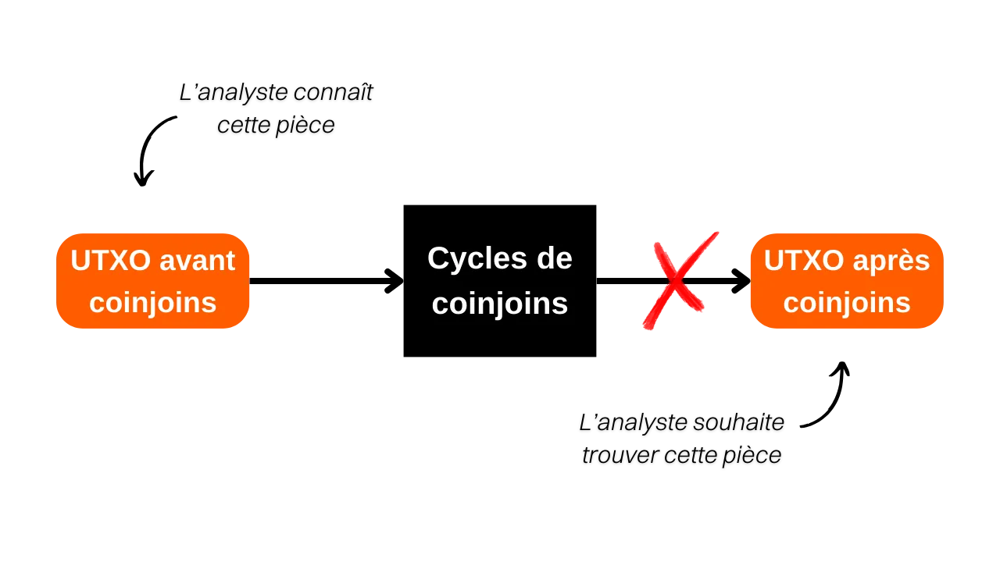
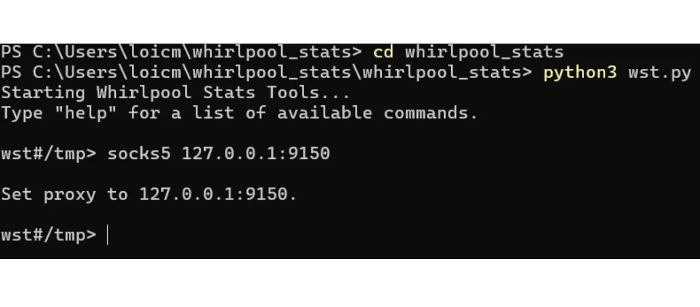
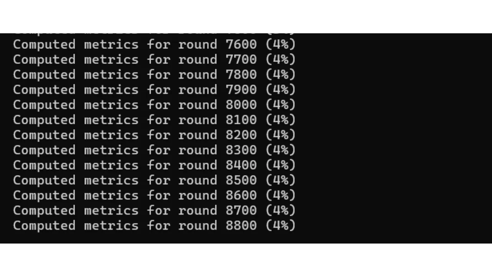

*"あなたのコインが残す痕跡を断ち切る"*

このチュートリアルでは、Whirlpool上でのcoinjoinプロセスの品質を推定するために使用される指標であるanonsetsの概念について学びます。これらの指標の計算方法と解釈について説明します。理論的な部分を終えた後、Pythonツール*Whirlpool Stats Tools*（WST）を使用して特定のトランザクションのanonsetsを計算する方法を実践で学びます。

## Bitcoin上のcoinjoinとは何か？
**Coinjoinは、ブロックチェーン上のビットコインの追跡可能性を断ち切る技術です**。これは、同名の特定の構造を持つ協力的なトランザクションに依存しています：coinjoinトランザクション。

Coinjoinトランザクションは、外部の観察者によるチェーン分析を複雑にすることで、Bitcoinユーザーのプライバシーを向上させます。その構造は、異なるユーザーからの複数のコインを単一のトランザクションに統合することを可能にし、経路を曖昧にして、入力と出力アドレス間のリンクを特定することを困難にします。

Coinjoinの原理は協力的なアプローチに基づいています：ビットコインを混ぜ合わせたい複数のユーザーが、同じトランザクションの入力として同額を預けます。これらの金額は、同等の価値の出力に再分配されます。トランザクションの終了時には、特定の出力を特定のユーザーに関連付けることが不可能になります。入力と出力の間に直接的なリンクは存在せず、それによってユーザーとそのUTXO、および各コインの履歴との関連を断ち切ります。


Coinjoinトランザクションの例：
[323df21f0b0756f98336437aa3d2fb87e02b59f1946b714a7b09df04d429dec2](https://mempool.space/tx/323df21f0b0756f98336437aa3d2fb87e02b59f1946b714a7b09df04d429dec2)

各ユーザーが常に自分の資金をコントロールできるようにしながらcoinjoinを実行するために、プロセスはコーディネーターによるトランザクションの構築から始まり、その後各参加者に伝達されます。各ユーザーは、それが自分に適していることを確認した後にトランザクションに署名します。最終的に、収集されたすべての署名がトランザクションに統合されます。ユーザーやコーディネーターによってcoinjoinトランザクションの出力を変更して資金を横領しようとする試みが行われた場合、署名は無効となり、トランザクションはノードによって拒否されます。

Coinjoinには、Whirlpool、JoinMarket、Wabisabiなど、参加者間の調整を管理し、coinjoinトランザクションの効率を高めることを目指すいくつかの実装があります。
このチュートリアルでは、私のお気に入りの実装であるWhirlpoolに焦点を当てます。これは、Samourai WalletとSparrow Walletで利用可能です。私の意見では、Bitcoin上でのcoinjoinsに最も効率的な実装です。
## Bitcoin上のcoinjoinの有用性とは何か？
Coinjoinの有用性は、あなたのコインを区別不可能なコインのグループ内に溶け込ませることによって、妥当な否認可能性を生み出す能力にあります。この行動の目的は、過去から現在へ、そして現在から過去への追跡可能性のリンクを断ち切ることです。

言い換えれば、coinjoinサイクルの入口であなたの初期トランザクションを知っているアナリストは、リミックスサイクルの出口であなたのUTXOを確実に特定することができないはずです（サイクル入口からサイクル出口への分析）。

逆に、コインジョインのサイクルの出口であなたのUTXOを知っている分析者は、サイクルの入口での元のトランザクションを特定できないはずです（サイクルの出口から入口への分析）。
過去と現在を結びつける、またその逆の分析者の困難さを評価するためには、あなたのコインが隠されているグループのサイズを定量化する必要があります。この尺度は、同一の確率を持つ分析の数を教えてくれます。したがって、正しい分析が等しい確率の他の3つの分析の中に紛れている場合、あなたの隠蔽レベルは非常に低いです。一方、正しい分析が等しく可能性のある20,000の分析のセットの中にある場合、あなたのコインは非常によく隠されています。

そして正確に、これらのグループのサイズは「anonsets」と呼ばれる指標を表しています。

## anonsetsの理解
Anonsetsは、特定のUTXOのプライバシーの程度を評価するための指標として機能します。より具体的には、研究されたコインを含むセット内の区別できないUTXOの数を測定します。均一なUTXOセットの要求は、anonsetsが通常コインジョインサイクル上で計算されることを意味します。これらの指標の使用は、その一様性のためにWhirlpoolコインジョインに特に関連しています。

Anonsetsは、適切な場合に、コインジョインの品質を判断するのに役立ちます。大きなanonsetサイズは、セット内の特定のUTXOを区別することが難しくなるため、匿名性のレベルが高まることを意味します。

anonsetsには2種類あります：
- **見込み匿名セット；**
- **振り返り匿名セット。**
最初の指標は、サイクルの終わりに、入口でのUTXOを知っている状態で、研究されたUTXOが隠されているグループのサイズを示します。つまり、このグループ内に存在する区別できないコインの数です。この指標は、過去から現在への分析（入口から出口へ）に対するコインの機密性の抵抗力を測定するのに役立ちます。英語では、この指標の名前は「*forward anonset*」または「*forward-looking metrics*」と呼ばれます。
このメトリックは、コインジョインプロセスの入口点から出口点まで、あなたのUTXOの履歴を再構築しようとする試みに対して、あなたのUTXOがどの程度保護されているかを推定します。

例えば、あなたのトランザクションが最初のコインジョインサイクルに参加し、その後2つの子孫サイクルが完了した場合、あなたのコインの見込みanonsetは`13`になります：

二番目の指標は、サイクルの終わりでのUTXOを知っている状態で、与えられたコインの可能な出所の数を示します。この指標は、コインの機密性がコインジョインサイクルの前にあなたのコインの起源を遡ることが分析者にとってどれだけ困難であるか、つまり現在から過去への分析（出口から入口へ）に対するコインの機密性の抵抗力を測定します。英語では、この指標の名前は「*backward anonset*」または「*backward-looking metrics*」と呼ばれます。

サイクルの出口であなたのUTXOを知っている場合、振り返りanonsetは、あなたがコインジョインサイクルに入るための可能なTx0トランザクションの数を決定します。下の図では、これはすべてのオレンジ色の泡の合計に相当します。


## Whirlpool Stats Tools（WST）でanonsetsを計算する
コインジョインサイクルを経た自分のコインについてこれらの指標を自分で計算するために、Samourai Walletによって特別に開発されたツールを使用できます：*Whirlpool Stats Tools*。
もしRoninDojoをお持ちであれば、WSTはあなたのノードにプリインストールされています。したがって、インストール手順をスキップして、直接使用手順に従うことができます。RoninDojoノードを持っていない方のために、このツールをコンピューターにインストールする方法を見ていきましょう。
必要なもの: Torブラウザ（またはTor）、Python 3.4.4以上、git、pip。ターミナルを開きます。これらのソフトウェアの存在とバージョンをシステム上で確認するには、以下のコマンドを入力します：
```bash
python --version
git --version
pip --version
```

必要に応じて、それぞれのウェブサイトからダウンロードできます：
- https://www.python.org/downloads/ (pipはバージョン3.4以降でPythonに直接付属しています)；
- https://www.torproject.org/download/；
- https://git-scm.com/downloads。
これらのソフトウェアがすべてインストールされたら、ターミナルからWSTリポジトリをクローンします：
```bash
git clone https://code.samourai.io/whirlpool/whirlpool_stats.git
```

WSTディレクトリに移動します：
```bash
cd whirlpool_stats
```

依存関係をインストールします：
```bash
pip3 install -r ./requirements.txt
```

また、手動でインストールすることもできます（オプション）：
```bash
pip install PySocks
pip install requests[socks]
pip install plotly
pip install datasketch
pip install numpy
pip install python-bitcoinrpc
```

`/whirlpool_stats`サブフォルダに移動します：
```bash
cd whirlpool_stats
```

WSTを起動します：
```bash
python3 wst.py
```

バックグラウンドでTorまたはTorブラウザを起動します。

**-> RoninDojoユーザーの方は、ここからチュートリアルを再開できます。**

Tor（RoninDojo）へのプロキシを設定します、
```bash
socks5 127.0.0.1:9050
```

または使用しているものに応じてTorブラウザへのプロキシを設定します：
```bash
socks5 127.0.0.1:9150
```

この操作により、トランザクションに関する情報を漏らすことなく、Tor経由でOXT上のデータをダウンロードできます。初心者でこのステップが複雑に思える場合、単にインターネットトラフィックをTorを通じて指向することを意味します。最も簡単な方法は、コンピューターのバックグラウンドでTorブラウザを起動し、このブラウザを介して接続するために2番目のコマンドのみを実行することです（`socks5 127.0.0.1:9150`）。

次に、`workdir`コマンドを使用して、WSTデータをダウンロードする予定の作業ディレクトリに移動します。このフォルダは、OXTから取得する`.csv`ファイルの形式でトランザクションデータを保存するために使用されます。この情報は、取得しようとしている指標を計算するために不可欠です。このディレクトリの場所は自由に選択できます。WSTデータ専用のフォルダを作成することをお勧めします。例として、ダウンロードフォルダを選択しましょう。RoninDojoを使用している場合、このステップは必要ありません：
```bash
workdir path/to/your/directory
```

その後、コマンドプロンプトが変更され、作業ディレクトリが表示されるはずです。

次に、トランザクションが含まれるプールからデータをダウンロードします。例えば、私が`100,000 sats`プールにいる場合、コマンドは以下の通りです：
```bash
```markdown

WSTの通貨コードは以下の通りです：
- 0.5ビットコインのプール：`05`
- 0.05ビットコインのプール：`005`
- 0.01ビットコインのプール：`001`
- 0.001ビットコインのプール：`0001`
データがダウンロードされたら、それを読み込んでください。例えば、`100,000 sats`のプールにいる場合、コマンドは以下の通りです：
```bash
load 0001
```

このステップは、コンピューターによって数分かかります。今がコーヒーを淹れる良いタイミングです！:)

データを読み込んだ後、`score`コマンドに続けてあなたのTXID（トランザクション識別子）を入力し、その匿名セットを取得します：
```bash
score TXID
```

**注意**、使用するTXIDの選択は、計算したい匿名セットによって異なります。コインの見込み匿名セットを評価するには、そのUTXOで最初に行われたコインジョインに対応するTXIDを`score`コマンドを通じて入力する必要があります。一方、過去の匿名セットを決定するには、最後に行われたコインジョインのTXIDを入力する必要があります。要約すると、見込み匿名セットは最初のミックスのTXIDから計算され、過去の匿名セットは最後のミックスのTXIDから計算されます。

WSTはその後、過去を見る指標（*Backward-looking metrics*）と将来を見る指標（*Forward-looking metrics*）を表示します。例えば、私はWhirlpoolで自分のものではないランダムなコインのTXIDを取りました。

該当するトランザクション：[7fe6081fa4f4382be629fb2ef59029d058a22b6fd59cb31d1511fe9e0e7f32be](https://mempool.space/tx/7fe6081fa4f4382be629fb2ef59029d058a22b6fd59cb31d1511fe9e0e7f32be)

このトランザクションを該当コインの最初のコインジョインとして考えると、見込み匿名セットは`86,871`となります。これは、`86,871`個の区別できないコインの中に隠されていることを意味します。コインジョインのサイクルが始まる時点でこのコインを知っている外部の観察者がその出力を追跡しようとすると、`86,871`個の可能性のあるUTXOの中から、探しているコインである可能性が同じであるUTXOを見つけることに直面します。

このトランザクションをコインの最後のコインジョインと考えると、その時点での過去の匿名セットは`42,185`となります。これは、このUTXOの可能性のある源が`42,185`個あることを意味します。サイクルの終わりにこのコインを特定し、その起源を追跡しようとする外部の観察者は、求めている起源である可能性が等しい`42,185`個の可能性のある源に直面します。
```
anonsetスコアに加えて、WSTはanonsetに基づいてプール内での出力の拡散率も提供します。この別の指標は、あなたの作品の改善可能性を評価することを単純に可能にします。この率は、特に見込みのあるanonsetにとって非常に有用です。実際、あなたの作品が拡散率15%を持っている場合、それはプール内の作品の15%と混同される可能性があることを意味します。それは良いことですが、リミックスを続けることで、まだ大きな改善の余地があります。一方、あなたの作品が拡散率95%を持っている場合、あなたはプールの限界に近づいています。リミックスを続けることはできますが、あなたのanonsetはあまり増加しません。

WSTによって計算されるanonsetが完全に正確ではないことに注意することが重要です。膨大なデータ量を処理する必要があるため、WSTは*HyperLogLogPlusPlus*アルゴリズムを使用して、ローカルデータ処理と必要なメモリに関連する負担を大幅に軽減します。これは、非常に大きなデータセット内の異なる値の数を推定しながら、結果の高い精度を維持することを可能にするアルゴリズムです。したがって、提供されるスコアは現実に非常に近い推定値であるため、分析に使用するには十分良いものですが、単位までの正確な値として解釈されるべきではありません。

結論として、coinjoinsであなたの各作品のanonsetを系統的に計算することは必須ではないことを念頭に置いてください。Whirlpoolの設計自体が保証を提供しています。実際、振り返りanonsetはめったに問題になりません。初期のミックスから、Genesis coinjoin以来の以前のミックスの遺産のおかげで、特に高い振り返りスコアを得ます。見込みのanonsetに関しては、十分な長さの期間、あなたの作品をポストミックスアカウントに保持するだけで十分です。

これが、*Hodl -> Mix -> Spend -> Replace*戦略でWhirlpoolを使用することが特に関連していると私が考える理由です。私の意見では、最も論理的なアプローチは、ビットコインの貯蓄の大部分をコールドウォレットに保持しながら、日常の支出をカバーするためにSamouraiのcoinjoinsに一定数の作品を継続的に保持することです。coinjoinsからのビットコインが使われたら、それらは新しいものに置き換えられ、混合された作品の定義された閾値に戻ります。この方法は、私たちのUTXO anonsetの懸念から自由になり、coinjoinsの効果が現れるまでの時間をはるかに制約の少ないものにすることを可能にします。

**外部リソース:**

- [チェーン分析に関するフランス語のポッドキャスト](https://fountain.fm/episode/6nNoQEUHBCQR8hAXAkEx)
- [HyperLogLogに関するWikipedia記事](https://en.wikipedia.org/wiki/HyperLogLog)
- [Whirlpool StatsのためのSamouraiのリポジトリ](https://code.samourai.io/whirlpool/whirlpool_stats)
- [SamouraiによるWhirlpoolのウェブサイト](https://samouraiwallet.com/whirlpool)
- [プライバシーとビットコインについてのSamouraiの英語のMedium記事](https://medium.com/oxt-research/understanding-bitcoin-privacy-with-oxt-part-1-4-8177a40a5923)
- [匿名セットの概念についてのSamouraiの英語のMedium記事](https://medium.com/samourai-wallet/diving-head-first-into-whirlpool-anonymity-sets-4156a54b0bc7)