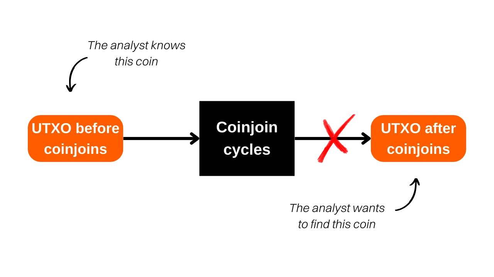
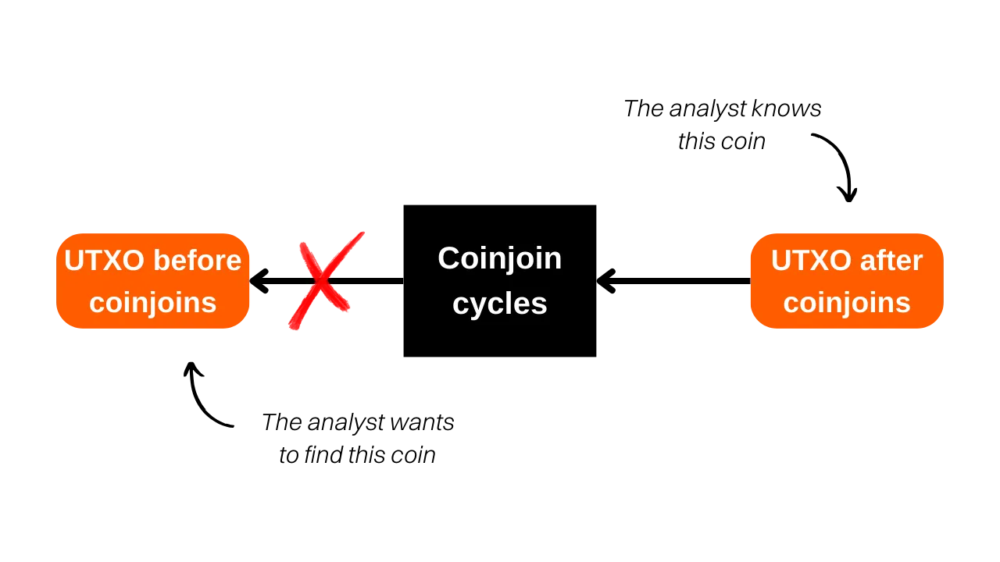
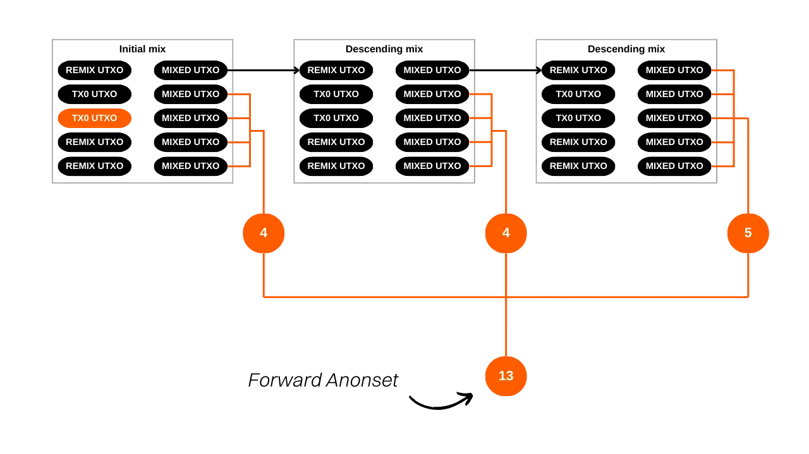
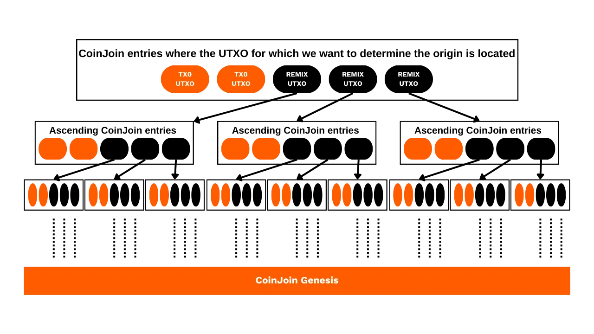

***CẢNH BÁO:** Sau vụ bắt giữ các nhà sáng lập của Samourai Wallet và việc tịch thu máy chủ của họ vào ngày 24 tháng 4, Công Cụ Thống Kê Whirlpool không còn có sẵn để tải xuống, vì nó được lưu trữ trên Gitlab của Samourai. Ngay cả khi bạn đã tải công cụ này về máy tính cá nhân trước đó, hoặc nó đã được cài đặt trên nút RoninDojo của bạn, WST sẽ không hoạt động vào thời điểm này. Nó phụ thuộc vào dữ liệu được cung cấp bởi OXT.me để hoạt động, và trang web này hiện không còn truy cập được. Hiện tại, WST không đặc biệt hữu ích vì giao thức Whirlpool đang không hoạt động. Tuy nhiên, vẫn có khả năng các phần mềm này có thể được khôi phục trong những tuần tới. Hơn nữa, phần lý thuyết của bài viết này vẫn còn liên quan để hiểu về các nguyên tắc và mục tiêu của coinjoins nói chung (không chỉ Whirlpool), cũng như hiểu về hiệu quả của mô hình Whirlpool. Bạn cũng có thể học cách định lượng sự riêng tư được cung cấp bởi các chu kỳ coinjoin.*

_Chúng tôi đang ch closely theo dõi các phát triển của vụ việc này cũng như các công cụ liên quan. Hãy yên tâm rằng chúng tôi sẽ cập nhật hướng dẫn này khi có thông tin mới._

_Hướng dẫn này được cung cấp chỉ cho mục đích giáo dục và thông tin. Chúng tôi không ủng hộ hoặc khuyến khích việc sử dụng các công cụ này cho mục đích phạm tội. Mỗi người dùng có trách nhiệm tuân thủ các luật pháp trong phạm vi quyền hạn của họ._

---

*"Xóa bỏ dấu vết mà tiền của bạn để lại"*

Trong hướng dẫn này, chúng ta sẽ nghiên cứu về khái niệm anonsets, các chỉ số cho phép chúng ta ước lượng chất lượng của quá trình coinjoin trên Whirlpool. Chúng ta sẽ bao gồm phương pháp tính toán và giải thích các chỉ số này. Sau phần lý thuyết, chúng ta sẽ chuyển sang thực hành bằng cách học cách tính anonsets của một giao dịch cụ thể sử dụng công cụ Python *Whirlpool Stats Tools* (WST).

## Coinjoin trên Bitcoin là gì?
**Coinjoin là một kỹ thuật làm gián đoạn khả năng theo dõi bitcoin trên blockchain**. Nó dựa vào một giao dịch hợp tác với cấu trúc cụ thể có tên: giao dịch coinjoin.

Giao dịch coinjoin tăng cường sự riêng tư cho người dùng Bitcoin bằng cách làm phức tạp việc phân tích chuỗi cho các quan sát viên bên ngoài. Cấu trúc của chúng cho phép kết hợp nhiều đồng tiền từ các người dùng khác nhau vào một giao dịch duy nhất, do đó làm mờ các dấu vết và khó xác định được liên kết giữa các địa chỉ đầu vào và đầu ra.

Nguyên tắc của coinjoin dựa trên một cách tiếp cận hợp tác: một số người dùng muốn trộn bitcoin của họ đặt cùng một số lượng tiền như đầu vào của cùng một giao dịch. Các số lượng này sau đó được phân phối lại trong các đầu ra có giá trị tương đương. Kết thúc giao dịch, trở nên không thể liên kết một đầu ra cụ thể với một người dùng nhất định. Không có liên kết trực tiếp nào giữa các đầu vào và đầu ra, do đó phá vỡ mối liên hệ giữa người dùng và UTXO của họ, cũng như lịch sử của mỗi đồng tiền.


Ví dụ về một giao dịch coinjoin:
[323df21f0b0756f98336437aa3d2fb87e02b59f1946b714a7b09df04d429dec2](https://mempool.space/tx/323df21f0b0756f98336437aa3d2fb87e02b59f1946b714a7b09df04d429dec2)
Để thực hiện một giao dịch coinjoin đồng thời đảm bảo rằng mỗi người dùng luôn kiểm soát được quỹ của mình, quy trình bắt đầu với việc xây dựng giao dịch bởi một điều phối viên, người sau đó truyền nó cho mỗi người tham gia. Mỗi người dùng sau đó ký vào giao dịch sau khi xác minh rằng nó phù hợp với họ. Tất cả chữ ký thu thập được cuối cùng được tích hợp vào giao dịch. Nếu một người dùng hoặc điều phối viên cố gắng chuyển hướng quỹ bằng cách sửa đổi các đầu ra của giao dịch coinjoin, các chữ ký sẽ trở nên không hợp lệ, dẫn đến việc giao dịch bị các nút từ chối.
Có một số cài đặt của coinjoin, như Whirlpool, JoinMarket, hoặc Wabisabi, mỗi cài đặt nhằm quản lý sự điều phối giữa các bên tham gia và tăng hiệu quả của giao dịch coinjoin.
Trong hướng dẫn này, chúng ta sẽ tập trung vào cài đặt yêu thích của tôi: Whirlpool, có sẵn trên Samourai Wallet và Sparrow Wallet. Theo ý kiến của tôi, đó là cài đặt hiệu quả nhất cho coinjoins trên Bitcoin.
## Tính ích lợi của coinjoin trên Bitcoin là gì?
Tính ích lợi của coinjoin nằm ở khả năng tạo ra sự phủ nhận hợp lý, bằng cách làm cho đồng tiền của bạn lẫn vào một nhóm các đồng tiền không thể phân biệt được. Mục tiêu của hành động này là để phá vỡ các liên kết theo dõi, cả từ quá khứ đến hiện tại và từ hiện tại trở về quá khứ.

Nói cách khác, một nhà phân tích biết giao dịch ban đầu của bạn tại điểm nhập của các chu kỳ coinjoin không nên có khả năng xác định chắc chắn UTXO của bạn tại điểm thoát của các chu kỳ remix (phân tích từ điểm nhập đến điểm thoát của chu kỳ).



Ngược lại, một nhà phân tích biết UTXO của bạn tại điểm thoát của các chu kỳ coinjoin không nên có khả năng xác định giao dịch gốc tại điểm nhập của các chu kỳ (phân tích từ điểm thoát đến điểm nhập của chu kỳ).



Để đánh giá độ khó cho một nhà phân tích trong việc liên kết quá khứ với hiện tại và ngược lại, cần phải định lượng kích thước của các nhóm mà trong đó đồng tiền của bạn được ẩn giấu. Thước đo này cho chúng ta biết số lượng phân tích có khả năng giống nhau. Vì vậy, nếu phân tích chính xác bị lẫn trong 3 phân tích khác có khả năng bằng nhau, mức độ ẩn giấu của bạn rất thấp. Ngược lại, nếu phân tích chính xác nằm trong một tập hợp của 20,000 phân tích tất cả đều có khả năng bằng nhau, đồng tiền của bạn được ẩn giấu rất tốt.

Và cụ thể, kích thước của những nhóm này đại diện cho các chỉ số được gọi là "anonsets".

## Hiểu về anonsets
Anonsets phục vụ như các chỉ số để đánh giá mức độ riêng tư của một UTXO cụ thể. Cụ thể hơn, chúng đo lường số lượng UTXOs không thể phân biệt được trong tập hợp bao gồm đồng tiền đang được nghiên cứu. Yêu cầu về một tập hợp UTXO đồng nhất nghĩa là anonsets thường được tính toán qua các chu kỳ coinjoin. Việc sử dụng các chỉ số này đặc biệt liên quan đến coinjoins Whirlpool do tính đồng nhất của chúng.

Anonsets cho phép, khi cần thiết, đánh giá chất lượng của các coinjoins. Một kích thước anonset lớn nghĩa là một mức độ ẩn danh tăng lên, khiến việc phân biệt một UTXO cụ thể trong tập hợp trở nên khó khăn.

Có hai loại anonsets:
- **Bộ ẩn danh tiềm năng;**
- **Bộ ẩn danh hồi cứu.**
Chỉ số đầu tiên cho thấy kích thước của nhóm mà UTXO đang được nghiên cứu ẩn giấu ở cuối chu kỳ, biết UTXO tại điểm nhập, tức là số lượng đồng tiền không thể phân biệt được hiện diện trong nhóm này. Chỉ số này cho phép đo lường khả năng bảo vệ bí mật của đồng tiền chống lại phân tích từ quá khứ đến hiện tại (từ điểm nhập đến điểm thoát). Trong tiếng Anh, tên của chỉ số này là "*forward anonset*", hoặc "*forward-looking metrics*".

Chỉ số này ước lượng mức độ bảo vệ của UTXO của bạn chống lại các nỗ lực tái tạo lịch sử của nó từ điểm nhập vào đến điểm thoát ra trong quá trình coinjoin.

Ví dụ, nếu giao dịch của bạn tham gia vào chu kỳ coinjoin đầu tiên và hai chu kỳ con cháu khác đã hoàn thành, anonset tiềm năng của đồng tiền của bạn sẽ là `13`:



Chỉ số thứ hai cho thấy số nguồn có thể có cho một đồng tiền nhất định, biết UTXO ở cuối chu kỳ. Chỉ số này đo lường khả năng chống lại việc phân tích bảo mật của đồng tiền từ hiện tại trở về quá khứ (từ điểm thoát ra đến điểm nhập vào), tức là mức độ khó khăn cho một nhà phân tích khi truy tìm nguồn gốc của đồng tiền của bạn, trước các chu kỳ coinjoin. Trong tiếng Anh, tên của chỉ số này là "*backward anonset*", hoặc "*backward-looking metrics*".


Biết UTXO của bạn ở điểm thoát của các chu kỳ, anonset hồi tưởng xác định số lượng giao dịch Tx0 tiềm năng có thể đã tạo thành điểm nhập của bạn vào các chu kỳ coinjoin. Trong sơ đồ dưới đây, điều này tương ứng với tổng số các bong bóng màu cam.



## Tính toán anonsets với Công cụ Thống kê Whirlpool (WST)
Để tính toán các chỉ số này trên những đồng tiền của bạn đã qua các chu kỳ coinjoin, bạn có thể sử dụng một công cụ được phát triển đặc biệt bởi Samourai Wallet: *Công cụ Thống kê Whirlpool*.

Nếu bạn có một RoninDojo, WST đã được cài đặt sẵn trên node của bạn. Bạn có thể bỏ qua các bước cài đặt và trực tiếp theo dõi các bước sử dụng. Đối với những người không có node RoninDojo, hãy xem cách tiến hành cài đặt công cụ này trên máy tính.

Bạn sẽ cần: Tor Browser (hoặc Tor), Python 3.4.4 hoặc cao hơn, git, và pip. Mở một terminal. Để kiểm tra sự hiện diện và phiên bản của các phần mềm này trên hệ thống của bạn, nhập các lệnh sau:
```plaintext
python --version
git --version
pip --version
```

Nếu cần, bạn có thể tải chúng từ các trang web tương ứng:
- https://www.python.org/downloads/ (pip đi kèm trực tiếp với Python từ phiên bản 3.4);
- https://www.torproject.org/download/;
- https://git-scm.com/downloads.
Sau khi tất cả các phần mềm này được cài đặt, từ một terminal, clone kho WST:
```plaintext
git clone https://code.samourai.io/whirlpool/whirlpool_stats.git
```


Di chuyển đến thư mục WST:
```plaintext
cd whirlpool_stats
```

Cài đặt các phụ thuộc:
```plaintext
pip3 install -r ./requirements.txt
```


Bạn cũng có thể cài đặt chúng thủ công (tùy chọn):
```plaintext
pip install PySocks
pip install requests[socks]
pip install plotly
pip install datasketch
pip install numpy
pip install python-bitcoinrpc
```

Di chuyển đến thư mục con `/whirlpool_stats`:
```plaintext
cd whirlpool_stats
```

Khởi động WST:
```plaintext
python3 wst.py
```


Khởi động Tor hoặc Tor Browser ở chế độ nền.

**-> Đối với người dùng RoninDojo, bạn có thể tiếp tục hướng dẫn ngay tại đây.**

Thiết lập proxy cho Tor (RoninDojo),
```plaintext
socks5 127.0.0.1:9050
```
hoặc đến Tor Browser tùy thuộc vào bạn đang sử dụng cái nào:```plaintext
socks5 127.0.0.1:9150
```

Thao tác này sẽ cho phép bạn tải dữ liệu trên OXT qua Tor, nhằm không để lộ thông tin về các giao dịch của bạn. Nếu bạn là người mới và cảm thấy bước này phức tạp, hãy biết rằng nó chỉ đơn giản là hướng dẫn lưu lượng internet của bạn qua Tor. Phương pháp đơn giản nhất bao gồm việc khởi chạy Tor Browser ở chế độ nền trên máy tính của bạn, sau đó chỉ thực hiện lệnh thứ hai để kết nối qua trình duyệt này (`socks5 127.0.0.1:9150`).


Tiếp theo, điều hướng đến thư mục làm việc từ đó bạn dự định tải dữ liệu WST sử dụng lệnh `workdir`. Thư mục này sẽ phục vụ để lưu trữ dữ liệu giao dịch mà bạn sẽ lấy từ OXT dưới dạng các tệp `.csv`. Thông tin này rất quan trọng để tính toán các chỉ số bạn đang tìm kiếm. Bạn tự do chọn vị trí của thư mục này. Có thể sẽ khôn ngoan khi tạo một thư mục cụ thể cho dữ liệu WST. Ví dụ, chúng ta hãy chọn thư mục tải xuống. Nếu bạn sử dụng RoninDojo, bước này không cần thiết:
```plaintext
workdir path/to/your/directory
```

Dấu nhắc lệnh sau đó sẽ thay đổi để chỉ ra thư mục làm việc của bạn.


Sau đó tải dữ liệu từ pool chứa giao dịch của bạn. Ví dụ, nếu tôi ở trong pool `100,000 sats`, lệnh là:
```plaintext
download 0001
```


Mã số cho các pool trên WST như sau:
- Pool 0.5 bitcoins: `05`
- Pool 0.05 bitcoins: `005`
- Pool 0.01 bitcoins: `001`
- Pool 0.001 bitcoins: `0001`
Sau khi dữ liệu được tải xuống, hãy tải nó. Ví dụ, nếu tôi ở trong pool của `100,000 sats`, lệnh là:
```plaintext
load 0001
```

Bước này mất vài phút tùy thuộc vào máy tính của bạn. Bây giờ là thời điểm tốt để pha cho mình một tách cà phê! :)


Sau khi tải dữ liệu, gõ lệnh `score` theo sau là TXID (mã định danh giao dịch) của bạn để nhận được anonsets của nó:
```plaintext
score TXID
```

**Chú ý**, sự lựa chọn của TXID để sử dụng thay đổi tùy thuộc vào anonset bạn muốn tính toán. Để đánh giá anonset tiềm năng của một đồng tiền, cần phải nhập, qua lệnh `score`, TXID tương ứng với coinjoin đầu tiên, là lần trộn đầu tiên được thực hiện với UTXO này. Mặt khác, để xác định anonset hồi tưởng, bạn phải nhập TXID của coinjoin cuối cùng được thực hiện. Tóm lại, anonset tiềm năng được tính từ TXID của lần trộn đầu tiên, trong khi anonset hồi tưởng được tính từ TXID của lần trộn cuối cùng.

WST sau đó hiển thị điểm số hồi tưởng (*Backward-looking metrics*) và điểm số tiềm năng (*Forward-looking metrics*). Ví dụ, tôi lấy TXID của một đồng tiền ngẫu nhiên trên Whirlpool không thuộc về tôi.


Giao dịch được đề cập: [7fe6081fa4f4382be629fb2ef59029d058a22b6fd59cb31d1511fe9e0e7f32be](https://mempool.space/tx/7fe6081fa4f4382be629fb2ef59029d058a22b6fd59cb31d1511fe9e0e7f32be)
Nếu chúng ta coi giao dịch này là coinjoin đầu tiên được thực hiện cho đồng tiền quan tâm, thì nó được hưởng lợi từ một anonset tiềm năng là `86,871`. Điều này có nghĩa là nó được ẩn giữa `86,871` đồng tiền không thể phân biệt được. Đối với một quan sát viên bên ngoài biết về đồng tiền này từ đầu chu kỳ coinjoin và cố gắng theo dõi đầu ra của nó, họ sẽ đối mặt với `86,871` UTXO có thể có, mỗi UTXO đều có khả năng như nhau để trở thành đồng tiền đang được tìm kiếm.

Nếu chúng ta coi giao dịch này là coinjoin cuối cùng của đồng tiền, thì nó có một anonset hồi tưởng là `42,185`. Điều này có nghĩa là có `42,185` nguồn tiềm năng cho UTXO này. Nếu một quan sát viên bên ngoài xác định đồng tiền này ở cuối chu kỳ và tìm cách theo dõi nguồn gốc của nó, họ sẽ đối mặt với `42,185` nguồn có thể có, tất cả đều có khả năng bằng nhau để trở thành nguồn gốc đang được tìm kiếm.
Ngoài các điểm số anonset, WST cũng cung cấp cho bạn tỷ lệ lan tỏa của đầu ra của bạn trong bể dựa trên anonset. Chỉ số khác này đơn giản cho phép bạn đánh giá khả năng cải thiện của mảnh của bạn. Tỷ lệ này đặc biệt hữu ích cho anonset tiềm năng. Thực sự, nếu mảnh của bạn có tỷ lệ lan tỏa là 15%, điều này có nghĩa là nó có thể bị nhầm lẫn với 15% các mảnh trong bể. Điều đó tốt, nhưng bạn vẫn có một khoảng cách rất lớn để cải thiện bằng cách tiếp tục remix. Ngược lại, nếu mảnh của bạn có tỷ lệ lan tỏa là 95%, thì bạn đang tiếp cận giới hạn của bể. Bạn có thể tiếp tục remix, nhưng anonset của bạn sẽ không tăng nhiều.

Quan trọng là phải lưu ý rằng các anonsets được tính toán bởi WST không hoàn toàn chính xác. Do khối lượng dữ liệu lớn cần được xử lý, WST sử dụng thuật toán *HyperLogLogPlusPlus* để giảm đáng kể gánh nặng liên quan đến việc xử lý dữ liệu cục bộ và bộ nhớ cần thiết. Đây là một thuật toán cho phép ước lượng số lượng giá trị riêng biệt trong các tập dữ liệu rất lớn trong khi vẫn duy trì độ chính xác cao trong kết quả. Do đó, các điểm số được cung cấp đủ tốt để sử dụng trong các phân tích của bạn, vì chúng là ước lượng rất gần với thực tế, nhưng chúng không nên được hiểu là các giá trị chính xác đến từng đơn vị.

Kết luận, hãy nhớ rằng không nhất thiết phải tính toán anonsets cho mỗi mảnh của bạn trong coinjoins. Chính thiết kế của Whirlpool đã cung cấp các bảo đảm. Thực sự, anonset hồi tưởng hiếm khi là một mối quan tâm. Từ lần trộn ban đầu của bạn, bạn nhận được một điểm số hồi tưởng đặc biệt cao nhờ di sản của các lần trộn trước kể từ coinjoin Genesis. Còn đối với anonset tiềm năng, chỉ cần giữ mảnh của bạn trong tài khoản sau trộn trong một khoảng thời gian đủ dài.
Đây là lý do tôi coi việc sử dụng Whirlpool là đặc biệt liên quan trong chiến lược *Hodl -> Mix -> Spend -> Replace*. Theo ý kiến của tôi, cách tiếp cận hợp lý nhất là giữ phần lớn tiền tiết kiệm bitcoin của mình trong một ví lạnh, trong khi liên tục duy trì một số lượng nhất định các đồng trong coinjoins trên Samourai để chi trả cho các chi phí hàng ngày. Một khi các bitcoin từ coinjoins được chi tiêu, chúng sẽ được thay thế bằng những đồng mới, nhằm quay trở lại ngưỡng định nghĩa của các đồng đã được trộn. Phương pháp này cho phép người ta tự giải thoát khỏi lo lắng về các tập anonset UTXO của chúng ta, đồng thời làm giảm thời gian cần thiết cho hiệu quả của coinjoins trở nên ít hạn chế hơn.

**Nguồn Tài Nguyên Bên Ngoài:**

- [Podcast bằng tiếng Pháp về phân tích chuỗi](https://fountain.fm/episode/6nNoQEUHBCQR8hAXAkEx)
- [Bài viết Wikipedia về HyperLogLog](https://en.wikipedia.org/wiki/HyperLogLog)
- Kho lưu trữ Whirlpool Stats của Samourai
- Trang web Whirlpool của Samourai
- [Bài viết trên Medium bằng tiếng Anh về quyền riêng tư và Bitcoin của Samourai](https://medium.com/oxt-research/understanding-bitcoin-privacy-with-oxt-part-1-4-8177a40a5923)
- [Bài viết trên Medium bằng tiếng Anh về khái niệm về tập ẩn danh của Samourai](https://medium.com/samourai-wallet/diving-head-first-into-whirlpool-anonymity-sets-4156a54b0bc7)