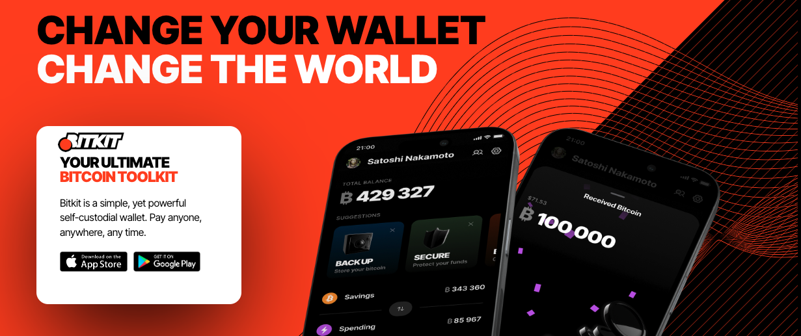

Bitkit (https://www.bitkit.to) ist eine einfache, aber leistungsstarke selbstverwahrte Wallet. Bezahlen Sie jeden, überall, jederzeit.

Bitkit ist eine selbstverwahrte mobile Wallet, die es Ihnen ermöglicht, wahres Eigentum an Ihrem Bitcoin zu übernehmen, damit Sie nach Ihren eigenen Bedingungen ausgeben können. Mit herausragenden Funktionen und einem schlanken Design ausgestattet, ermöglicht Bitkit sofortige Zahlungen an jeden, jederzeit, überall. Dabei ist sie vollständig Open-Source, sodass jeder sie prüfen kann.

## Tutorial-Video

## Anleitung

Bitkit ist wirklich sehr einfach zu benutzen.

Als vollwertige Bitcoin-Wallet umfasst Bitkit alle Funktionen, die Sie erwarten:

Sofortige Zahlungen: Kein Jonglieren mehr zwischen Wallets für On-Chain- und Lightning-Transaktionen. Bitkit vereint beides nahtlos.

Saldo-Management: Übertragen Sie mühelos Gelder zwischen Ihrem Spar- und Ausgabenkonto, um immer genügend Kapazität für sofortige Zahlungen zu haben.

Wiederherstellungsphrase: Stellen Sie Ihren Sparbetrag auf jeder Wallet wieder her, die BIP 39 unterstützt.

Automatische Backups: Nicht sensible Daten aus Ihrer Wallet werden automatisch gesichert, sodass Sie Ihren Ausgabenbetrag immer wiederherstellen können.

Detaillierte Transaktionshistorie: Weisen Sie Kontakten Transaktionen zu und taggen Sie diese, um sie organisiert zu halten.

Bitkit bietet auch einzigartige Funktionen, die es von anderen abheben:

Zahlbare Kontakte: Schluss mit dem Nachfragen nach Adressen oder Rechnungen. Fügen Sie einfach Freunde zu Ihrer Kontaktliste hinzu und bezahlen Sie sie.

Live-Widgets: Fügen Sie Ihrem Wallet-Startbildschirm mit ansprechenden Widgets einen Hauch von Spaß und Nutzen hinzu.

Soziales Profil: Nehmen Sie die Kontrolle über Ihr öffentliches Profil und Links, sodass Ihre Kontakte Sie jederzeit erreichen und bezahlen können.

Passwortlose Konten: Melden Sie sich auf Websites an, die Slashtags oder Lightning-Authentifizierung unterstützen.

Für Experten bietet Bitkit leistungsstarke Optionen:

Benutzerdefinierte Gebühr: Wählen Sie Ihre Netzwerkgebühr und beschleunigen Sie Transaktionen für eine schnellere Bestätigung.

Externe Lightning-Verbindungen: Erhalten Sie Ihre Knoten-ID, sodass Sie Verbindungen von jedem Peer bekommen können.

Coin-Kontrolle: Wählen Sie, welche Coins bei jeder Transaktion ausgegeben werden sollen.

Electrum-Server: Synchronisieren Sie mit der Blockchain über Ihren bevorzugten Server.

Adressbetrachter: Sehen Sie sich die Empfangs- und Wechseladressen an, die von Ihrem Seed abgeleitet sind.

Adresstyp: Empfangen Sie Zahlungen über Legacy-, Nested Segwit- oder Native Segwit-Adressen.

Bitcoin kaufen oder verkaufen
Bitkit unterstützt nicht den Kauf und Verkauf von Bitcoin. Zum Kaufen oder Verkaufen nutzen Sie Börsen wie Bitfinex und senden Sie dann zu oder von Bitkit.

Vollständige Anleitung folgt