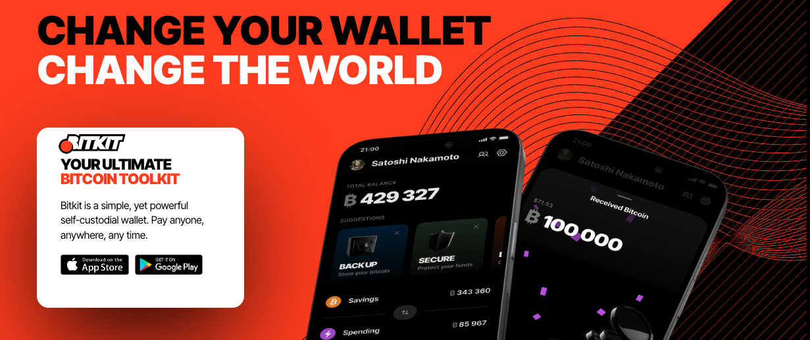
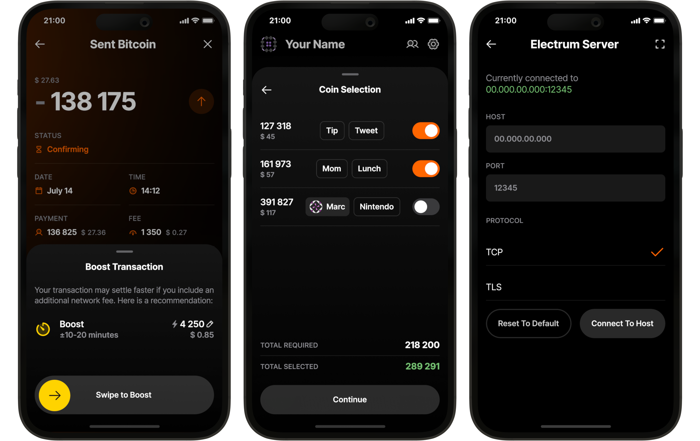

بیت‌کیت (https://www.bitkit.to) یک Wallet ساده، اما قدرتمند خودامانی است. به هر کسی، در هر کجا، در هر زمان پرداخت کنید.

بیت‌کیت یک Wallet موبایل خودامانی است که به شما امکان می‌دهد تا کنترل واقعی Ownership بر روی Bitcoin خود داشته باشید تا بتوانید بر اساس شرایط خود خرج کنید. با ویژگی‌های برجسته و طراحی شیک، بیت‌کیت پرداخت‌های فوری به هرکس، در هر زمان و هر مکان را ممکن می‌سازد. همه این‌ها در حالی است که به صورت کاملاً متن‌باز برای بررسی توسط هر کسی در دسترس است.

## ویدئوی آموزشی

## راهنما

بیت‌کیت واقعاً واقعاً آسان برای استفاده است.

به عنوان یک Bitcoin Wallet کامل، Bitkit شامل تمام قابلیت‌هایی است که انتظار دارید:

پرداخت‌های فوری: دیگر نیازی به جابجایی بین کیف‌پول‌ها برای تراکنش‌های On-Chain و Lightning نیست. Bitkit هر دو را به‌طور یکپارچه ترکیب می‌کند.

مدیریت تراز: به‌راحتی وجوه را بین حساب پس‌انداز و حساب خرج خود انتقال دهید تا همیشه ظرفیت کافی برای پرداخت‌های فوری داشته باشید.

عبارت بازیابی: موجودی پس‌انداز خود را در هر Wallet که از BIP 39 پشتیبانی می‌کند، بازیابی کنید.

پشتیبان‌گیری خودکار: داده‌های غیرحساس از Wallet شما به‌طور خودکار پشتیبان‌گیری می‌شوند تا همیشه بتوانید موجودی هزینه‌های خود را بازیابی کنید.

تاریخچه تراکنش‌های دقیق: مخاطبین را اختصاص دهید و تراکنش‌های خود را برچسب‌گذاری کنید تا سازماندهی شوند.

بیت‌کیت همچنین دارای قابلیت‌های منحصربه‌فردی است که آن را متمایز می‌کند:

مخاطبین قابل پرداخت: با درخواست آدرس یا فاکتور خداحافظی کنید. به سادگی دوستان خود را به لیست مخاطبین اضافه کنید و به آنها پرداخت کنید.

ویجت‌های زنده: با ویجت‌های جذاب، به صفحه اصلی Wallet خود کمی سرگرمی و کارایی اضافه کنید.

پروفایل اجتماعی: کنترل پروفایل عمومی و لینک‌های خود را به دست بگیرید تا مخاطبانتان بتوانند در هر زمان با شما تماس بگیرند و به شما پرداخت کنند.

حساب‌های بدون رمز عبور: به وب‌سایت‌هایی که از احراز هویت Slashtags یا Lightning پشتیبانی می‌کنند، وارد شوید.

برای کارشناسان، Bitkit گزینه‌های قدرتمندی ارائه می‌دهد:

هزینه سفارشی: هزینه شبکه خود را انتخاب کنید و تراکنش‌ها را برای تأیید سریع‌تر افزایش دهید.

اتصالات خارجی لایتنینگ: شناسه نود خود را دریافت کنید تا بتوانید از هر همتایی اتصال بگیرید.

کنترل سکه: انتخاب کنید که کدام سکه‌ها را در هر تراکنش خرج کنید.

سرور الکتروم: با استفاده از سرور مورد نظر خود با Blockchain همگام‌سازی کنید.

نمایشگر Address: مشاهده آدرس‌های دریافت و تغییر مشتق شده از seed شما.

Address نوع: دریافت پرداخت‌ها از طریق آدرس‌های Legacy، Nested SegWit، یا Native SegWit.

خرید یا فروش Bitcoin

بیت‌کیت از خرید و فروش Bitcoin پشتیبانی نمی‌کند. برای خرید یا فروش، از صرافی‌هایی مانند بیت‌فینکس استفاده کنید، سپس به بیت‌کیت ارسال کنید یا از آن دریافت کنید.

راهنمای کامل در راه است