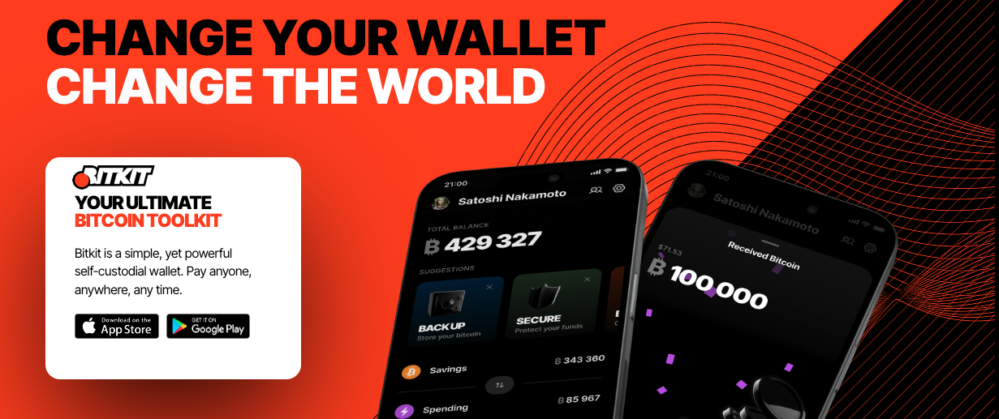
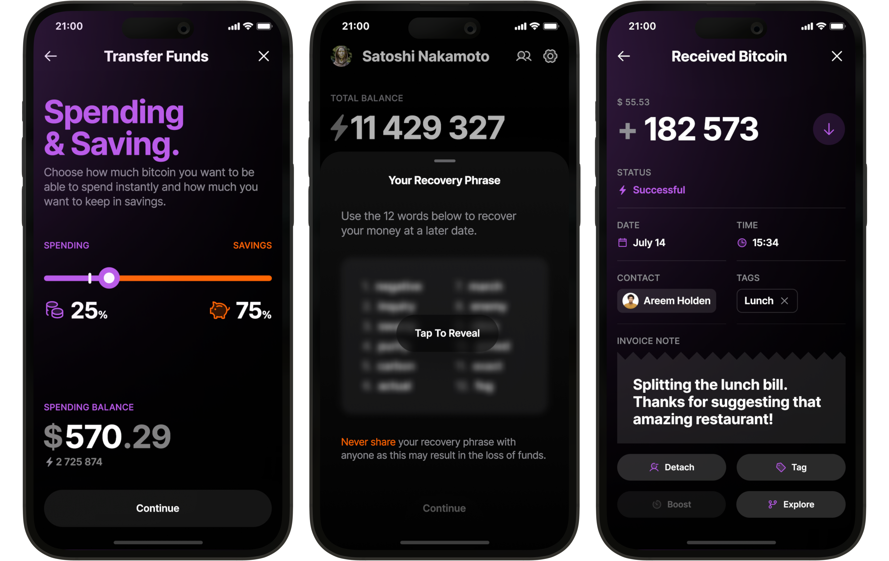
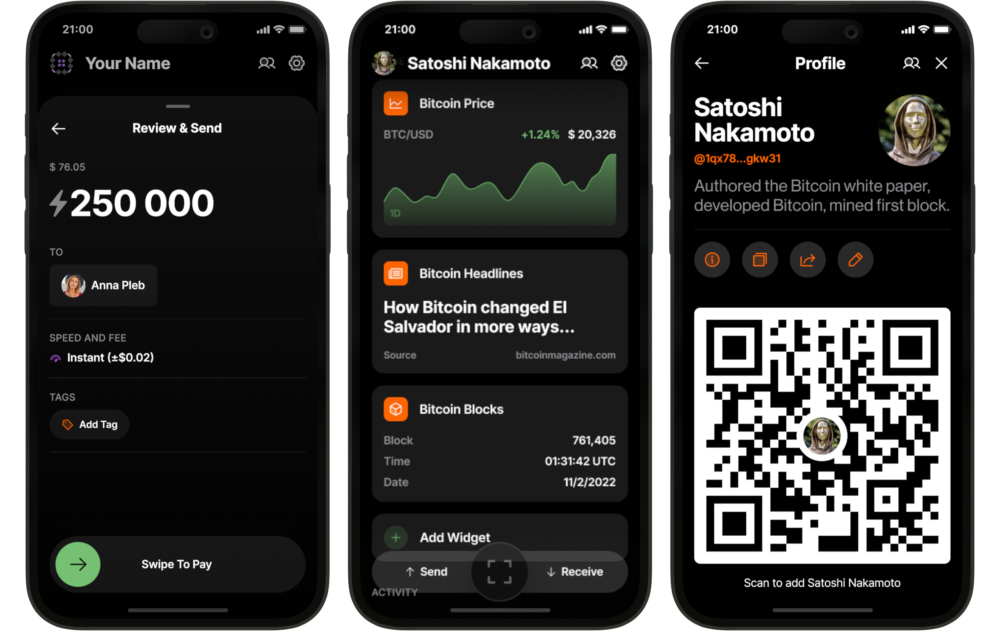
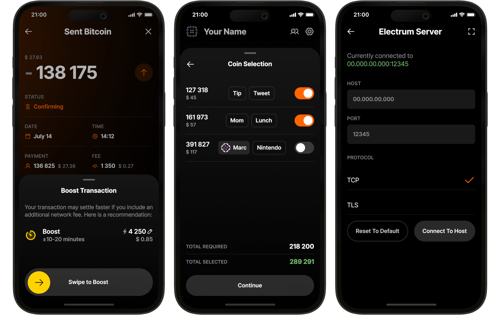

Bitkit (https://www.bitkit.to) on yksinkertainen, mutta tehokas omaisuudenhoitoon perustuva lompakko. Maksa kenelle tahansa, missä tahansa, milloin tahansa.

Bitkit on omaisuudenhoitoon perustuva mobiililompakko, joka antaa sinulle todellisen omistajuuden Bitcoinistasi, jotta voit käyttää sitä omilla ehdoillasi. Erinomaisilla ominaisuuksilla ja tyylikkäällä suunnittelulla varustettu Bitkit mahdollistaa välittömät maksut kenelle tahansa, milloin tahansa, missä tahansa. Kaikki tämä on täysin avoimen lähdekoodin ansiosta, jotta kuka tahansa voi tarkastaa sen.

## Tutoriaalivideo

## opas

Bitkitin käyttö on todella helppoa.

Täysin varusteltuna Bitcoin-lompakkona Bitkit sisältää kaikki odottamasi toiminnot:

Välittömät Maksut: Ei enää jongleerausta eri lompakoiden välillä on-chain ja Lightning-transaktioita varten. Bitkit yhdistää molemmat saumattomasti.

Saldojen Hallinta: Siirrä varoja vaivattomasti säästö- ja käyttötilisi välillä varmistaaksesi, että sinulla on aina tarpeeksi kapasiteettia välittömiin maksuihin.

Palautuslauseke: Palauta säästösaldo millä tahansa lompakolla, joka tukee BIP 39:ää.

Automaattiset Varmuuskopiot: Lompakkosi ei-arkaluontoiset tiedot varmuuskopioidaan automaattisesti, jotta voit aina palauttaa käyttötilisi saldon.

Yksityiskohtainen Tapahtumahistoria: Nimetä yhteystiedot ja merkitä tapahtumasi pitääksesi ne järjestyksessä.

Bitkit tarjoaa myös ainutlaatuisia ominaisuuksia, jotka erottavat sen muista:

Maksulliset Yhteystiedot: Unohda osoitteiden tai laskujen pyytäminen. Lisää vain ystäviä yhteystietoluetteloosi ja maksa heille.

Live Widgetit: Lisää hauskuutta ja hyödyllisyyttä lompakkosi kotinäyttöön kiinnostavien widgetien avulla.

Sosiaalinen Profiili: Hallitse julkista profiiliasi ja linkkejäsi, jotta yhteystietosi voivat ottaa sinuun yhteyttä ja maksaa sinulle milloin tahansa.

Salasanattomat Tilit: Kirjaudu sisään verkkosivustoille, jotka tukevat Slashtag- tai Lightning-autentikointia.

Asiantuntijoille Bitkit tarjoaa tehokkaita vaihtoehtoja:

Mukautettu Maksu: Valitse verkkomaksusi ja nopeuta transaktioita nopeampaa vahvistusta varten.

Ulkopuoliset Lightning-Yhteydet: Hanki solmuidentiteettisi, jotta voit saada yhteyksiä mistä tahansa vertaisesta.

Kolikoiden Hallinta: Valitse, mitä kolikoita käytät kussakin transaktiossa.

Electrum-palvelin: Synkronoi lohkoketjun kanssa valitsemasi palvelimen kautta.

Osoitteen Katselu: Katso siemenestäsi johdetut vastaanotto- ja vaihto-osoitteet.

Osoitteen Tyyppi: Vastaanota maksuja Legacy-, Nested Segwit- tai Native Segwit -osoitteiden kautta.

Bitcoinin ostaminen tai myyminen
Bitkit ei tue bitcoinin ostamista tai myymistä. Osta tai myy käyttäen pörssejä, kuten Bitfinex, ja lähetä sitten Bitkitiin tai sieltä.

Kattava opas tulossa