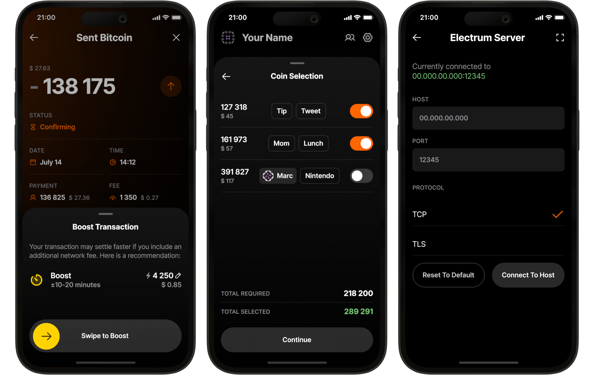

Bitkit (https://www.bitkit.to) はシンプルでありながら強力なセルフカストディアルウォレットです。いつでも、どこでも、誰にでも支払いが可能です。

Bitkitは、あなたがビットコインの真の所有者となり、自分の条件で支払いができるようにするセルフカストディアルモバイルウォレットです。際立つ機能とスリークなデザインで強化されたBitkitは、いつでも、どこでも、誰にでも即時支払いを可能にします。全てが完全にオープンソースで、誰でも監査できます。

## チュートリアル動画

## ガイド

Bitkitは非常に使いやすいです。

完全な機能を備えたビットコインウォレットとして、Bitkitには期待される全ての機能が含まれています：

即時支払い：オンチェーンとライトニングトランザクションの間でウォレットを切り替える必要はもうありません。Bitkitはそれらをシームレスに統合します。

残高管理：即時支払いのために常に十分な容量を持つように、貯蓄口座と支出口座間で資金を簡単に転送します。

リカバリーフレーズ：BIP 39をサポートする任意のウォレットで貯蓄残高を復元します。

自動バックアップ：ウォレットの非機密データは自動的にバックアップされるため、いつでも支出残高を復元できます。

詳細な取引履歴：取引を整理するために、連絡先を割り当てて取引にタグを付けます。

Bitkitは、他と一線を画すユニークな機能も誇っています：

支払い可能な連絡先：アドレスや請求書を求める必要はもうありません。単に友人を連絡先リストに追加して支払います。

ライブウィジェット：ウォレットのホーム画面に楽しさと実用性を加える魅力的なウィジェットを追加します。

ソーシャルプロファイル：公開プロファイルとリンクを管理し、いつでも連絡先があなたに連絡して支払いができるようにします。

パスワードレスアカウント：Slashtagsやライトニング認証をサポートするウェブサイトにログインします。

専門家向けに、Bitkitは強力なオプションを提供します：

カスタム手数料：ネットワーク手数料を選択し、トランザクションを加速してより早く確認を得ます。

外部ライトニング接続：任意のピアから接続を得るためにノードIDを取得します。

コインコントロール：各トランザクションで使用するコインを選択します。

エレクトラムサーバー：好みのサーバーを通じてブロックチェーンと同期します。

アドレスビューアー：シードから派生した受取りと変更のアドレスを表示します。

アドレスタイプ：レガシー、ネステッドセグウィット、またはネイティブセグウィットアドレスを通じて支払いを受け取ります。

ビットコインの購入または販売
Bitkitはビットコインの購入や販売をサポートしていません。購入や販売には、Bitfinexのような取引所を使用し、Bitkitへ送金するか、Bitkitから送金してください。

完全なガイドは近日中に公開予定