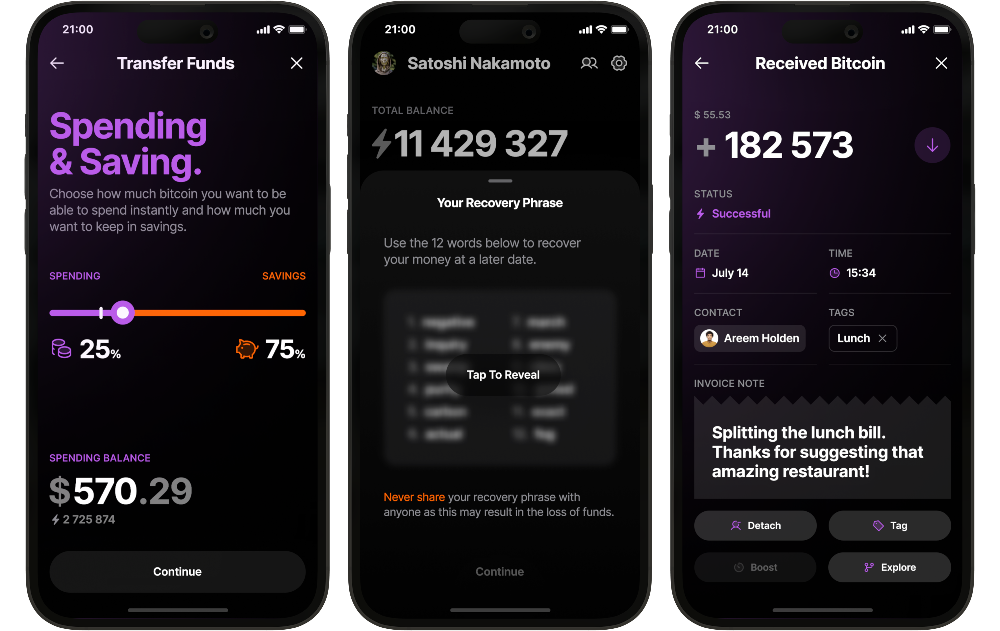

Bitkit (https://www.bitkit.to) là một ví tự quản lý đơn giản nhưng mạnh mẽ. Thanh toán cho bất kỳ ai, ở bất cứ đâu, vào bất cứ lúc nào.

Bitkit là một ví di động tự quản lý giúp bạn thực sự sở hữu Bitcoin của mình để bạn có thể chi tiêu theo điều kiện của mình. Với các tính năng nổi bật và thiết kế tinh tế, Bitkit mở khóa khả năng thanh toán tức thì cho bất kỳ ai, bất cứ lúc nào, ở bất cứ đâu. Tất cả trong khi vẫn hoàn toàn mã nguồn mở để bất kỳ ai cũng có thể kiểm tra.

## Video hướng dẫn

## Hướng dẫn

Bitkit thực sự rất dễ sử dụng.

Là một ví Bitcoin đầy đủ tính năng, Bitkit bao gồm tất cả các chức năng bạn mong đợi:

Thanh toán tức thì: Không cần phải chuyển đổi giữa các ví cho giao dịch trên chuỗi và Lightning nữa. Bitkit kết hợp cả hai một cách mượt mà.

Quản lý Số dư: Chuyển tiền một cách dễ dàng giữa tài khoản tiết kiệm và chi tiêu để đảm bảo bạn luôn có đủ khả năng thanh toán tức thì.

Cụm từ Khôi phục: Khôi phục số dư tiết kiệm trên bất kỳ ví nào hỗ trợ BIP 39.

Sao lưu Tự động: Dữ liệu không nhạy cảm từ ví của bạn được sao lưu tự động để bạn luôn có thể khôi phục số dư chi tiêu của mình.

Lịch sử Giao dịch Chi tiết: Gán liên hệ và gắn thẻ cho giao dịch của bạn để giữ chúng được tổ chức.

Bitkit còn có những khả năng độc đáo làm nó nổi bật:

Liên hệ Có thể Thanh toán: Không cần phải yêu cầu địa chỉ hoặc hóa đơn nữa. Chỉ cần thêm bạn bè vào danh sách liên hệ và thanh toán cho họ.

Widget Trực tiếp: Thêm một chút vui nhộn và tiện ích vào màn hình chính của ví với các widget hấp dẫn.

Hồ sơ Xã hội: Kiểm soát hồ sơ công khai và liên kết của bạn, để các liên hệ có thể liên hệ và thanh toán cho bạn bất cứ lúc nào.

Tài khoản Không cần Mật khẩu: Đăng nhập vào các trang web hỗ trợ Slashtags hoặc xác thực Lightning.

Đối với các chuyên gia, Bitkit cung cấp các tùy chọn mạnh mẽ:

Phí Tùy chỉnh: Chọn phí mạng của bạn và tăng tốc giao dịch để xác nhận nhanh hơn.

Kết nối Lightning Bên ngoài: Nhận ID nút của bạn để có thể kết nối từ bất kỳ đối tác nào.

Kiểm soát Coin: Chọn những đồng tiền nào để chi tiêu cho mỗi giao dịch.

Máy chủ Electrum: Đồng bộ hóa với blockchain thông qua máy chủ ưa thích của bạn.

Trình Xem Địa chỉ: Xem các địa chỉ nhận và thay đổi được tạo từ hạt giống của bạn.

Loại Địa chỉ: Nhận thanh toán qua địa chỉ Legacy, Nested Segwit, hoặc Native Segwit.

Mua hoặc bán bitcoin
Bitkit không hỗ trợ mua và bán bitcoin. Để mua hoặc bán, sử dụng các sàn giao dịch như Bitfinex, sau đó gửi vào hoặc từ Bitkit.

Hướng dẫn đầy đủ sẽ được cập nhật