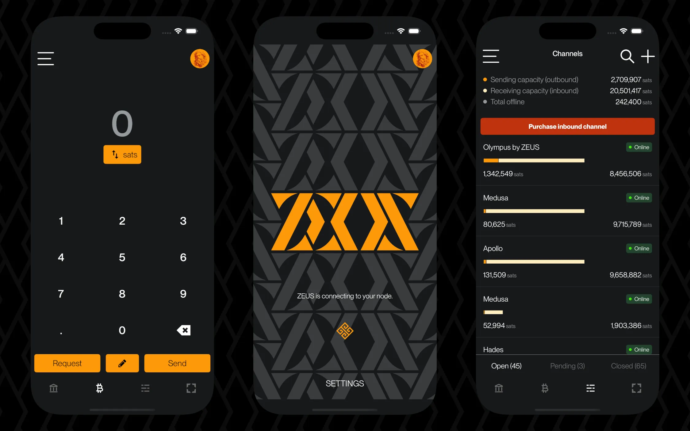
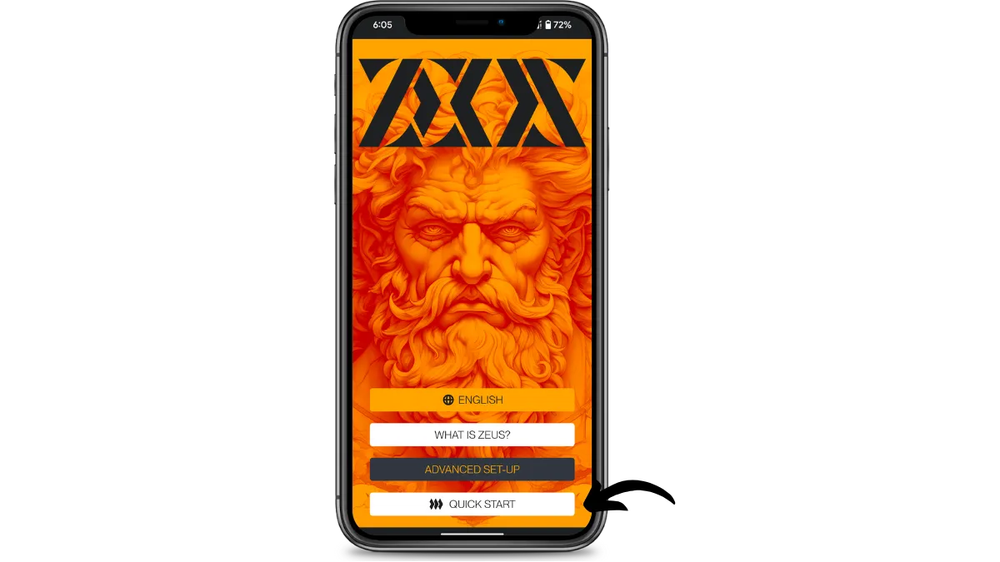
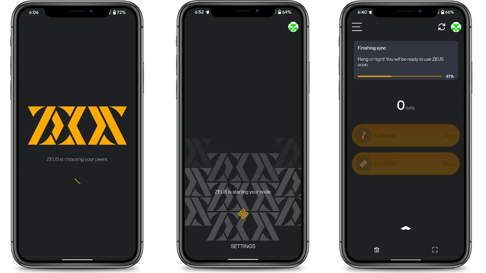
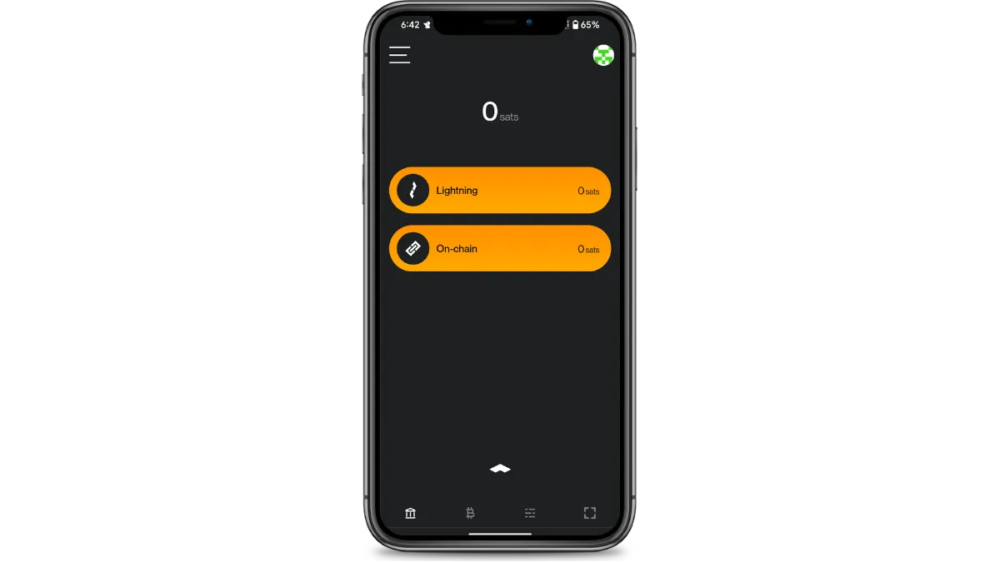
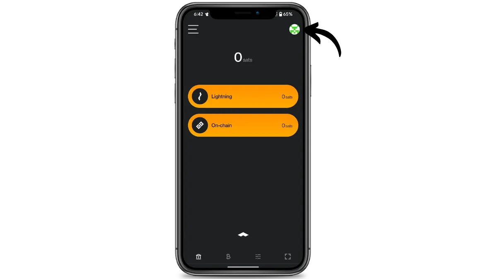
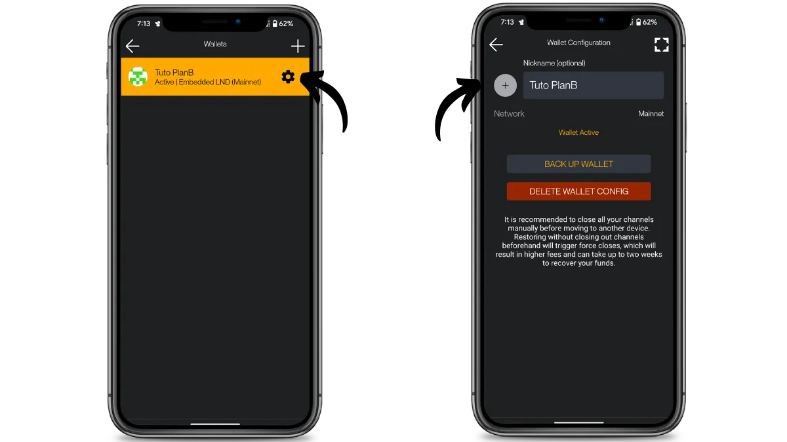
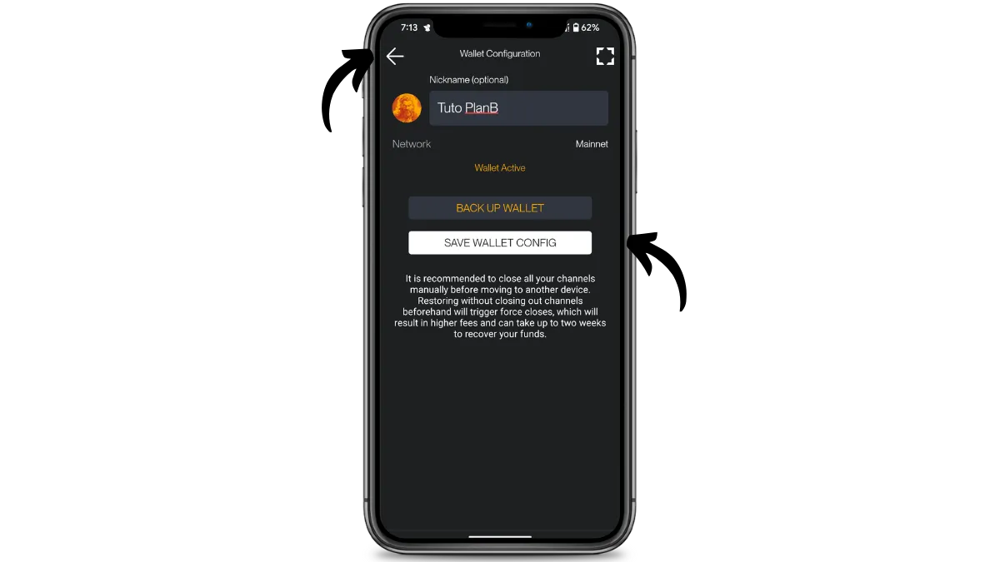
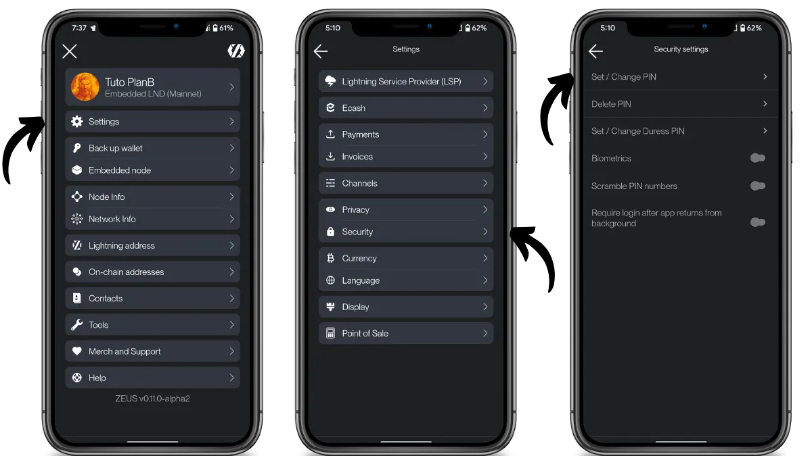
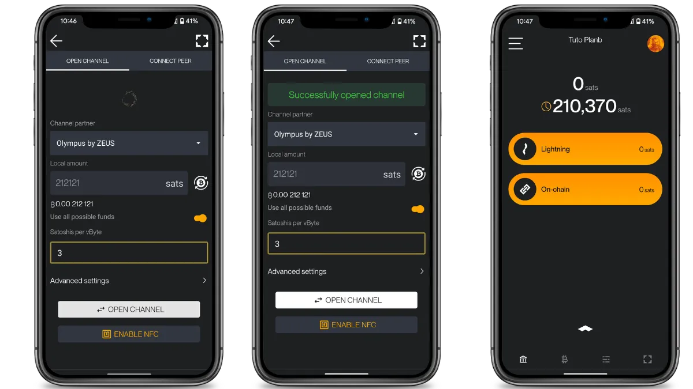
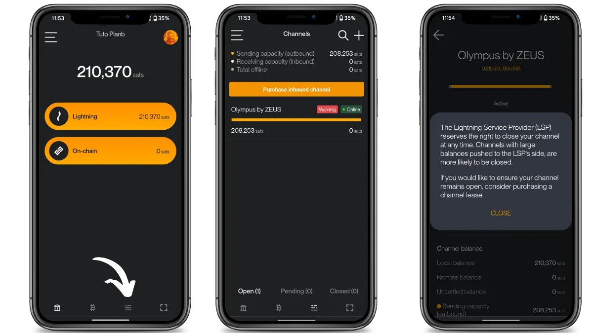

 

ZEUS est initialement une application mobile de gestion de nœud lightning à distance, qui permet de piloter son noeud installé sur un serveur distant
Mais l’application propose aussi un noeud Lightning Intégré ou “Embedded node” en anglais. 

**C’est cette facette de l’application que nous explorerons dans ce tutoriel. Cela permet à n’importe qui d’avoir son propre noeud lightning sur mobile, sans avoir besoin d’un serveur dédié, à la manière de ce que propose ACINQ avec son incroyable wallet lightning [[bitcoin-educational-content/tutorials/wallet/phoenix/fr|Phoenix]].  

*Pour rappel Lightning est un réseau qui fonctionne en parallèle de celui de Bitcoin, et qui permet de manière astucieuse de s'échanger des Bitcoins sans avoir à systématiquement réaliser des transactions on-chain. On arrive ainsi à réaliser des transactions quasi instantanées, plus besoin d'attendre 10 min qu'un block soit validé. Cela est particulièrement utile quand il s'git de payer un commerçant dans le monde physique. De plus Lightning apporte un niveau de **confidentialité** remarquable que ne possède pas le réseau Bitcoin nativement*
  
**Zeus Intégré** s’adresse ainsi aux Bitcoiners désireux de maximiser leur vie privée et leur autonomie.  
En synthèse, c’est **potentiellement** le wallet mobile rêvé des cypherpunks. Même s’il est encore jeune (version alpha) et soumis à quelques bugs, ses fonctionnalités sont légions et il ne fait pas de doute qu'il saura ravir les plus intrépides d’entre nous, qui désirent un maximum de contrôle et d’optionnalité.  

En revanche il n’est à mon sens pour le moment pas adapté aux débutants qui ne connaissent pas bien Bitcoin et souhaitent simplement un  moyen simple d’envoyer / recevoir des satoshis. Même si cela pourrait changer à l’avenir puisqu’une fonctionnalité de custody via le protocole Cashu (chaumian Ecash) est entrain d’être implémentée pour les débutants...

## Installer l'application

Rendez-vous [sur le site du projet](https://zeusln.com/) pour télécharges l’application correspondant à l’OS de votre smartphone:

## Création du portefeuille

Une fois l'application démarrée, cliquez sur le bouton "Quick Start" (Démarrage Rapide) pour lancer la création du wallet.

Différents écrans d’initialisation défilent ensuite, patientez quelques instants puis attendez quelques minutes que la synchronisation du noeud via Neutrino soit à 100%.

Cela peut prendre quelques minutes. Pour information neutrino est un moyen pour les portefeuilles mobiles d’avoir accès aux informations de la blockchain Bitcoin, sans avoir besoin de faire tourner un noeud complet

Après ces quelques instants, vous voilà prêt à en découdre.

## Paramétrage de l'application

Prêt, enfin pas tout à fait, car il va de soi qu’un utilisateur de Zeus digne de ce nom navigue à travers son wallet avec classe et style. Il va donc nous falloir changer l’avatar de celui-ci.  
  
Cliquer sur votre avatar en haut à droite de l’écran:

Cliquez sur la roue crantée, puis sur le plus “+”

Sélectionnez la plus belle photo de Zeus qui représentera ce wallet et cliquez sur "CHOOSE PICTURE" en partie basse de l'écran, puis revenez en arrière en cliquant sur la flèche en haut à droite

Enfin donnez éventuellement un surnom à votre wallet et cliquez sur "SAVE WALLET CONFIG" pour que ce changement soit pris en compte. Enfin cliquez sur la flèche de retour en haut à gauche pour revenir à l'écran d'accueil.

Cette fois c’est bon, on peut véritablement commencer

### Biométrie

Pour protéger l'accès à votre wallet il est possible d'ajouter un PIN/Mot de passe et d'acitiver la biométrie

Pour cela rendez-vous dans le menu principal du wallet en cliquant sur les tirets horizontaux en haut à gauche

Sélectionnez "Settings", puis "Security" et enfin "Set/Change PIN"

Créer votre PIN, confirmez le, et activez la biométrie en poussant le bouton correspondant "Biometrics".  Revenez au menu principal, en utilisant le flèche en haut à gauche

### Sauvegarde de la phrase mnémonique

Une fois revenu au menu principal cliquez cette fois sur "Back up wallet", puis lisez le texte d'avertissement qui vous informe que perdre les 24 mots qui vont vous être fournis revient à perdre l'accès à ses fonds, et que quiconque possède ses mots en plus de vous, peut accéder à vos fonds. Ne les jamais communiquez à personne.

Sélectionner "I UNDERSTAND" en bas de l'écran. Puis sur cliquez sur chacun des 24 mots pour les faire apparaitre et notez les soigneusement.

Vous pouvez les inscrire sur un papier, ou éventuellement, pour plus de sécurité, la graver sur un support en acier inoxydable afin de la protéger contre les risques d'incendies, d'inondations ou d'écroulements. Le choix du support pour votre phrase mnémonique dépendra de votre stratégie de sécurisation, mais si vous utilisez Phoenix comme un portefeuille de dépenses contenant des montants modérés, le support papier devrait être suffisant.

Pour plus d'informations sur la manière adéquate de sauvegarder et de gérer votre phrase mnémonique, je vous recommande vivement de suivre cet autre tutoriel, particulièrement si vous êtes débutant :

https://planb.network/tutorials/wallet/backup/backup-mnemonic-22c0ddfa-fb9f-4e3a-96f9-46e2a7954270

Une fois terminé cliquez en bas de l'écran sur "I'VE BACKUP MY 24 WORDS" et nous voilà revenu à l'écran d'accueil prêts à recevoir nos premiers bitcoins.
## Recevoir des bitcoins on-chain & ouvrir des canaux Lightning

**Zeus Embedded** est avant tout pensé pour être un noeud lightning embarqué, mais il peut parfaitement être utilisé comme un wallet on-chain également.

Pour recevoir des bitcoins on-chain, cliquez sur le bouton "On-chain" puis sur "Receive".
Enfin scannez le QR code ou copier l'adresse Bitcoin pour y déposer des fonds.

### Option 1 - Ouvrir un canal à partir de sa balance onchain

Une fois les fonds confirmés et crédités sur votre wallet, vous pouvez les utiliser pour ouvrir un **canal lightning**. Votre canal Lightning est votre porte d'entrée vers le réseau Lightning, vous permettant d'échanger des bitcoins de manière beaucoup plus confidentielle et rapide.

Pour ce faire cliquer sur  "MOVE ON-CHAIN FUNDS TO LIGHTNING"
Sur l'écran suivant, on vous propose d'ouvrir un canal en collaboration avec **"Olympus by Zeus"** qui est le LSP (Lightning Service Provider) privilégié par le wallet.

Pour ce tutoriel nous choisirons cette option pour d'avantage de simplicité, mais il est parfaitement possible d'ouvrir des canaux avec n'importe quel noeud du réseau.
Il est même possible d'ouvrir plusieurs canaux en une seule transaction en sélectionnant "OPEN ADDITIONAL CHANNEL" . *Mais nous verrons éventuellement cela dans une éventuelle version"avancée" du tutoriel **Zeus Embedded****

Sélectionnez ensuite  le montant que vous souhaitez dédier à ce canal. Dans notre cas l'ensemble de nos fonds on-chain seront utilisés, nous activons donc le bouton "Use all possible funds "

Pour finir choisissez sur le bouton en bas de l'écran "OPEN CHANNEL"
Concrètement mais sans rentrer dans les détails, vos fonds sont en fait déposés par l'intermédiaire d'une transaction on-chain classique, sur une adresse multi signature contrôlée par vous et votre partenaire: ici **Olympus by Zeus**

En quelques seconde, le canal est établi et nous voilà prêts à réaliser nos premières transaction Lightning. Sur l'écran d'accueil on peut voir une petite pendule à côté du solde de notre portefeuille. C'est parce qu'il nous faudra quand même patienter 3 confirmations on-chain avant que le canal ne soit véritablement fonctionnel.

Une fois les 3 confirmations passées, nous remarquons que notre solde est désormais crédité dans l'encart dédié à Lightning.

Petit point de détail:  en cliquant sur le menu nous permettant de consulter le détails de nos canaux lightning en bas de l'écran, nous voyons qu'une petite partie de notre solde n'est pas disponible à la dépense on ne peut dépenser que 208253 satoshis au lieu des 210370 que nous possédons réellement. C'est normal, il s'agit d'une spécificité du protocole lightning.

Enfin on peut également noter en allant dans les  détails de notre canal, que notre partenaire Olympus se réserve le droit de fermer le canal de manière discrétionnaire, si celui-ci n'est pas utilisé par exemple. Pour s'assurer que notre canal soit maintenu, il va falloir "passer à la caisse", en d'autres terme payer le LSP (Lightning Service Provider) ce que nous verrons bientot à travers la 2ème façon d'ouvrir un canal.

Avant ça essayons de payer une invoice pour confirmer que notre canal fonctionne bel et bien