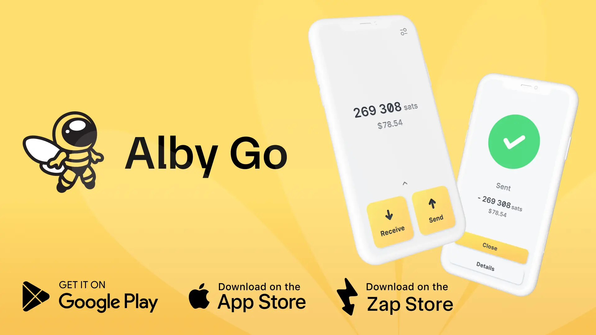

## 🚀 Selamat datang di Alby Go, wallet mobile yang paling mudah digunakan.

**Alby Go** adalah aplikasi mobile open-source yang mudah digunakan dan berfungsi sebagai Wallet Interface untuk node dan wallet Bitcoin Lightning. Di sini kamu akan mempelajari cara memulai dan memaksimalkan pengalamanmu menggunakan Alby Go.

**✅ Wallet dan Node yang Didukung serta Telah Terbukti Kompatibel:**

- [Alby Hub](https://albyhub.com/) **(direkomendasikan)**
- **Umbrel**, **Start9**, **RaspiBlitz** (via **Alby Hub**)
- **Coinos** *(belum diuji)*
- **Primal** *(belum diuji)*
- **Minibits** *(belum diuji)*

Sebagian besar layanan yang mendukung NWC seharusnya bisa digunakan. Kalau kamu sedang menguji layanan baru, bagikan hasilnya ke komunitas.

## 📲 Install Alby Go

Tersedia di platform utama:

- **iOS:** [Download from the App Store](https://apps.apple.com/us/app/alby-go/id6471335774)
- **Android:** [Download from Google Play](https://play.google.com/store/apps/details?id=com.getalby.mobile)
- **ZapStore**

## 🔌 Hubungkan Wallet

Alby Go terhubung ke node atau wallet Lightning milikmu menggunakan secret NWC (Nostr Wallet Connect). Kamu bisa menghubungkan satu atau beberapa wallet sekaligus, lalu berpindah di antaranya dengan mudah.

Steps:

1. Buka Pengaturan → Wallets → Hubungkan Wallet

2. Pindai kode QR atau tempel NWC Connection Secret (e.g. nostr+walletconnect://...)

3. Beri nama khusus untuk koneksimu

Setelah terhubung, wallet atau node kamu siap digunakan untuk mengirim dan menerima pembayaran Bitcoin Lightning melalui Alby Go.

✅ Tips: Kamu bisa menghubungkan beberapa wallet sekaligus dan berpindah di antaranya kapan saja.

## ⚡Kirim Bitcoin

Untuk mengirim sats melalui Lightning Network:

1. Ketuk **tombol SEND** berwarna kuning besar.

2. Pilih salah satu opsi berikut:

- Pindai kode QR invoice Lightning
- Tempel invoice Lightning dari clipboard
- Masukkan Lightning Address secara manual

Kamu juga bisa memilih penerima dari Address Book, tempat kamu dapat menyimpan Lightning Address agar mudah digunakan kembali.

## 💸 Terima Bitcoin

Untuk menerima sats dengan Alby Go:

1. Ketuk **tombol TERIMA** berwarna kuning besar.
2. Pilih salah satu opsi berikut:

- Bagikan Lightning Address kamu seperti yang ditampilkan
- Pilih "Amount" untuk membuat invoice Lightning dengan jumlah khusus
- Klik "Redeem" untuk memindai kode QR LNURL withdraw

Baik kode QR maupun string invoice tersedia agar pengirim dapat memilih cara yang paling nyaman.

## 🧳 Go!

Bawa Bitcoin kamu ke mana pun kamu pergi.

**Alby Go** ringan, cepat, dan mudah digunakan, cocok untuk operator node dan para Bitcoiner yang selalu mobile.

Tanpa bloat. Tanpa ribet. Super cepat.

## 🛠️ Fitur Tambahan

- 🗺️ BTC Map, daftar merchant yang menerima pembayaran Bitcoin
- 🌗 Mode gelap dan terang
- 💱 Input mata uang kustom dan kalkulator
- 🧾 Riwayat transaksi
- 👥 Address Book
- 🧷 Tambah, hapus, dan ekspor wallet

**💡 Butuh bantuan?**

Kunjungi getalby.com untuk dukungan dan pembaruan.
