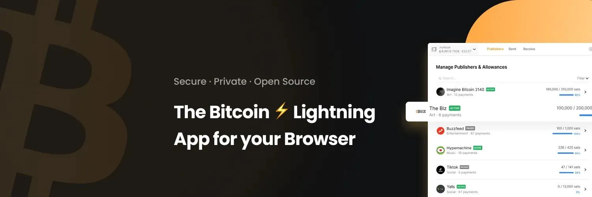

让比特币支付变得越来越容易，是该行业许多公司面临的挑战。Alby 公司凭借其 Alby wallet 浏览器扩展程序从众多公司中脱颖而出。该扩展程序旨在建立一个流畅的框架，自动检测地址，让您可以进行无摩擦的比特币支付。在本教程中，我们将了解 Alby 扩展，并测试它是如何促进浏览器支付的。

## Alby 扩展程序

Alby 扩展程序是一种工具，可使您的网络浏览器与比特币网络及其闪电网络层轻松、安全地进行交互。它有三个方面的特点：

- 闪电网络钱包：链接您的 Alby 节点或账户，通过闪电网络层快速、廉价地发送和接收比特币。
- 通过网络进行流畅支付：在支持闪电网络的网站上进行比特币支付时，无需扫描二维码或在不同应用程序之间切换。只需点击一下即可实现流畅交易，如果您已设定预算，则无需确认。
- Nostr 管理器：该扩展可管理您的 Nostr 密钥，使您可以轻松连接 Nostr 应用程序并与之互动，充当安全签名人，而无需将您的私人密钥暴露给每个平台。

https://planb.academy/tutorials/node/others/nostr-f6d21a64-9b04-4f21-ba1c-02c98cc91f98

https://planb.academy/tutorials/node/others/umbrel-nostr-7ae147e8-f5cd-46e1-861b-17c2ea1e08fd

## 与扩展程序连接

在本教程中，我们将在 Ubuntu 操作系统下的 Firefox 浏览器中使用 Alby 扩展程序。不过，它也适用于 Windows 和 Chrome 浏览器。

您可以访问 [Firefox] 扩展商店 (https://addons.mozilla.org/fr/firefox/addon/alby/) 或 [Chrome] 扩展商店 (https://chromewebstore.google.com/detail/alby-bitcoin-wallet-for-l/iokeahhehimjnekafflcihljlcjccdbe)，在浏览器中添加 Alby 扩展。

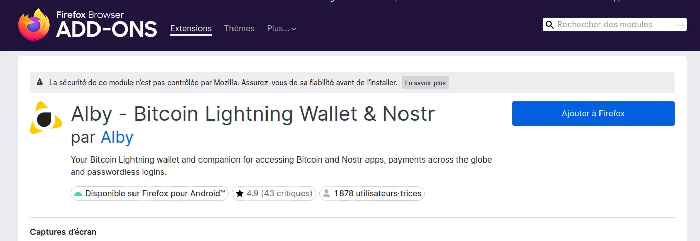

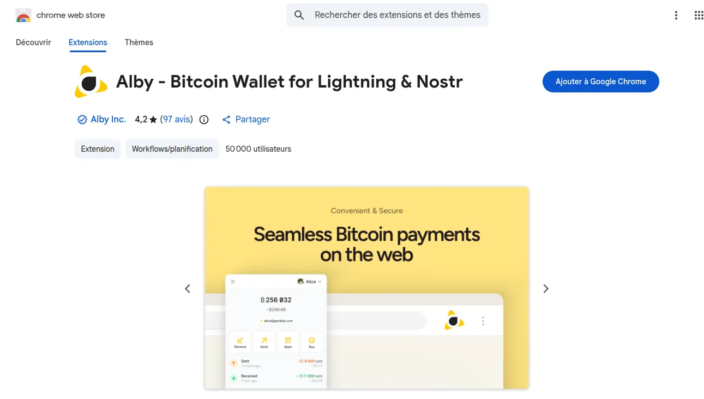

ℹ️ 重要的是要确认扩展的作者确实是 Alby 官方账户，以避免任何形式的盗版或比特币被盗。

点击右侧按钮，将扩展添加到浏览器。

授予安装和使用扩展所需的权限，然后将扩展固定在工具栏上，以便于检索。

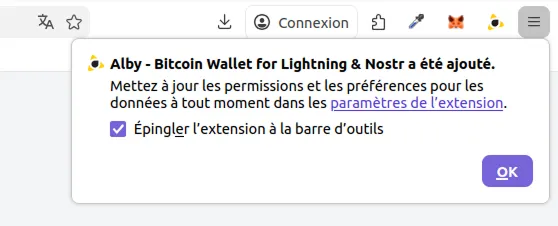

您还应定义一个解锁密码（这一操作非常重要），它能保证您能从浏览器安全打开闪电钱包。我们建议您设置一个强大的字母数字密码。

ℹ️ 请务必将密码保存在安全位置。若遗失，无法找回，只能重设。

https://planb.academy/tutorials/computer-security/authentication/seedkeeper-password-64ffaf68-53aa-43c3-bc7a-c1dc2a17fee3

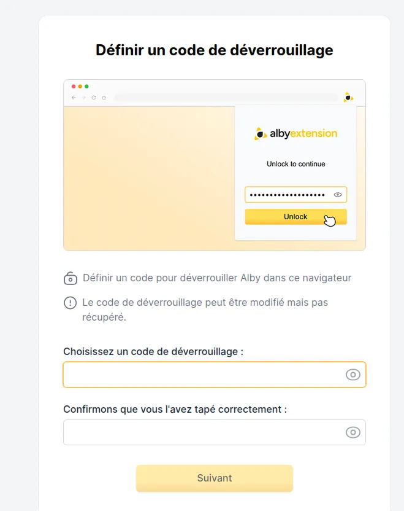

Alby 通过为您提供两种选择来展示其适应性：

- 如果您希望在保持自主管理比特币的前提下使用应用，请使用 Alby 账户登录。
- 如果您已有受扩展程序支持的钱包或闪电节点，也可直接连接使用。

https://planb.academy/tutorials/wallet/mobile/blink-7ea5f5a4-e728-4ff9-b3f9-cf20aa6fc2bd

https://planb.academy/tutorials/node/lightning-network/lightning-network-daemon-linux-59d777e9-72c8-4b32-8c50-e86cdae8f2f9

https://planb.academy/tutorials/business/point-of-sale/btcpay-server-928eb01e-824b-4b57-a3e8-8727633beddc

在本教程中，我们选择继续使用 Alby 账户，以利用 Alby 生态系统的功能。

https://planb.academy/tutorials/wallet/mobile/alby-go-40202802-b346-4a3c-9863-465c3bde9903

https://planb.academy/tutorials/node/lightning-network/alby-hub-62e6356c-6a6d-4134-8f22-c3b6afb9882a

登录您的 Alby 账户，如果还没有账户，请创建新的账户。

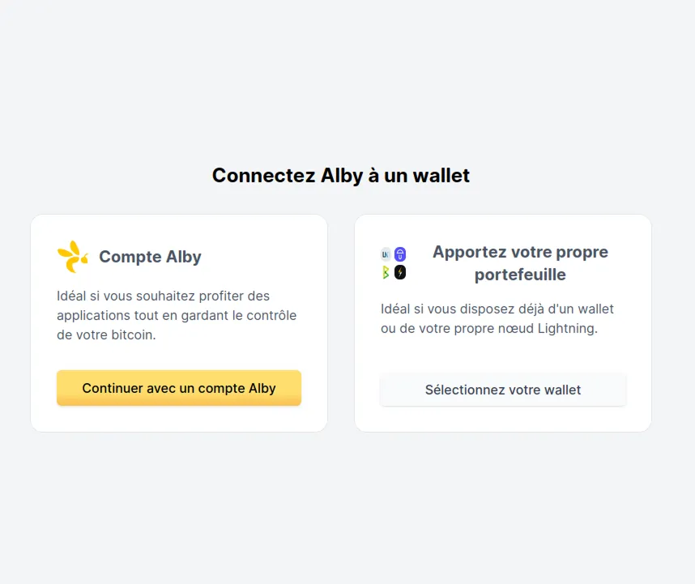

## 进行您的第一次付款

登录后，您可以点击工具栏上的 Alby 扩展来访问您的钱包。

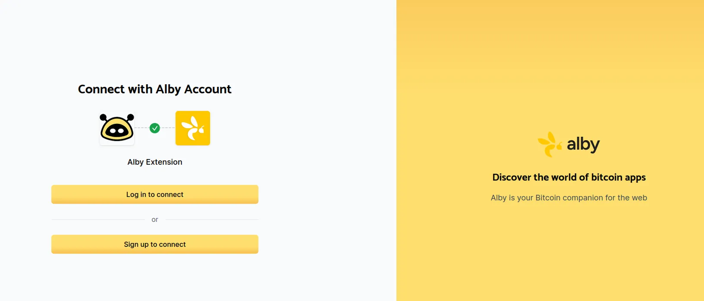

创建 Alby 账户后，您需要将其连接到一个钱包，这样您才能使用您的比特币。如果您想要将比特币钱包连接到 Alby 账户，我们建议您使用 Alby Hub 节点，您可以在电脑上设置该节点，也可以订购 Alby 提供的计划。

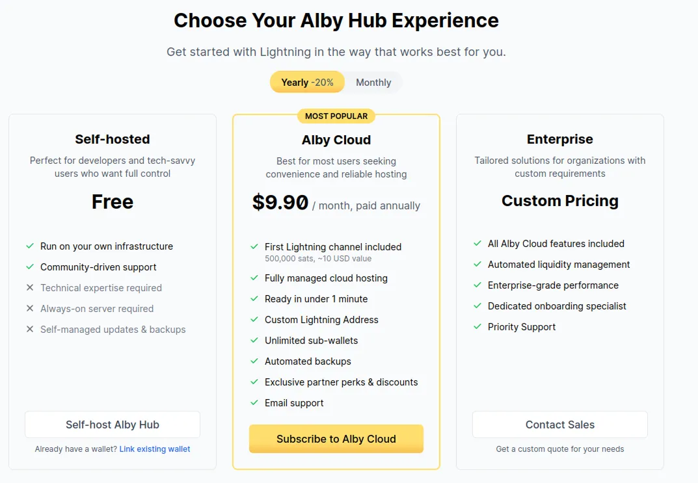

在本教程中，我们的 Alby 账户由机器上的本地安装提供支持。

如果您想要构建自己的 Alby 节点，我们推荐您参考我们的 Alby Hub 教程。

https://planb.academy/tutorials/node/lightning-network/alby-hub-62e6356c-6a6d-4134-8f22-c3b6afb9882a

通过该节点，您可以创建自我保管的闪电网络钱包，并有效地管理发送和接收比特币的闪电渠道。

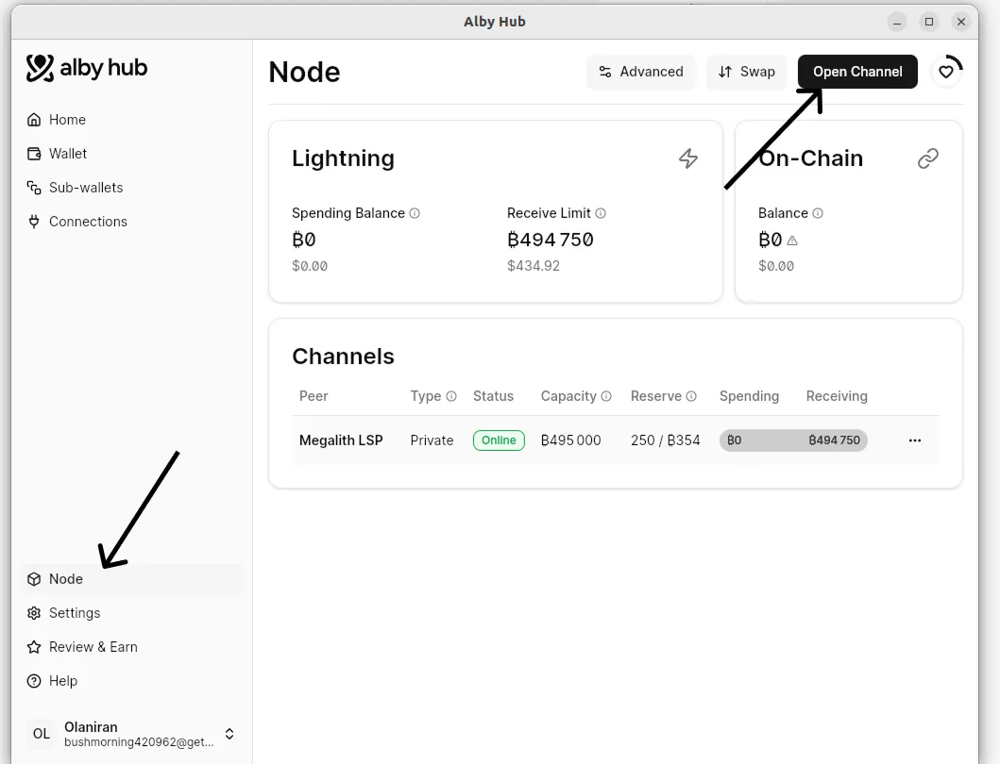

打开接收通道，然后定义您可以接收的比特币金额。

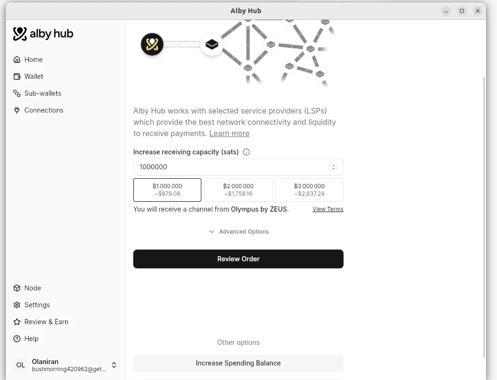

通过选择比特币链上地址上的比特币打开发送通道。您所选取的比特币定义了您可以花费的比特币总额。

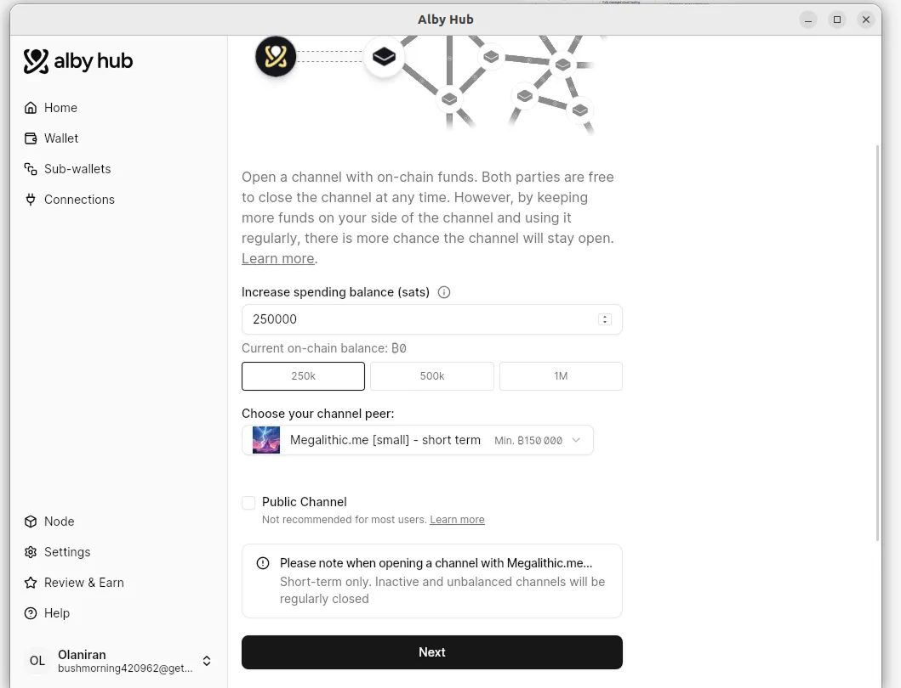

现在您可以通过 Alby 扩展程序发送和接收比特币。

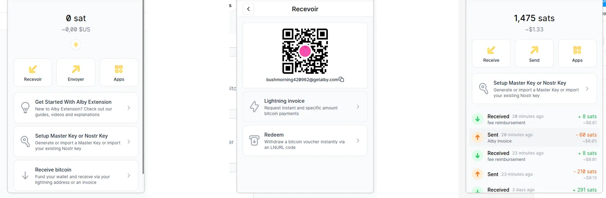

从这时起，Alby 扩展程序就能检测到您访问的网页上的闪电地址和发票，并建议您直接通过扩展程序用比特币或闪电网络支付。

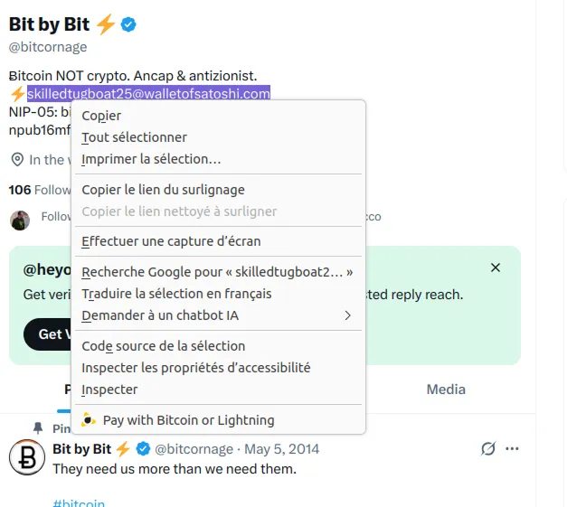

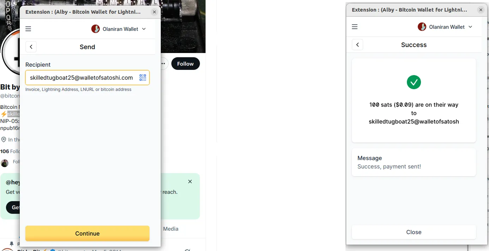

## 用主密钥保护恢复密钥

Alby 扩展程序提供的主密钥可作为一个保护层面，使您能够与主比特币网络层面（链上）和 Nostr 系统进行安全通信，并使您能够激活与 Nostr 应用程序的闪电连接。

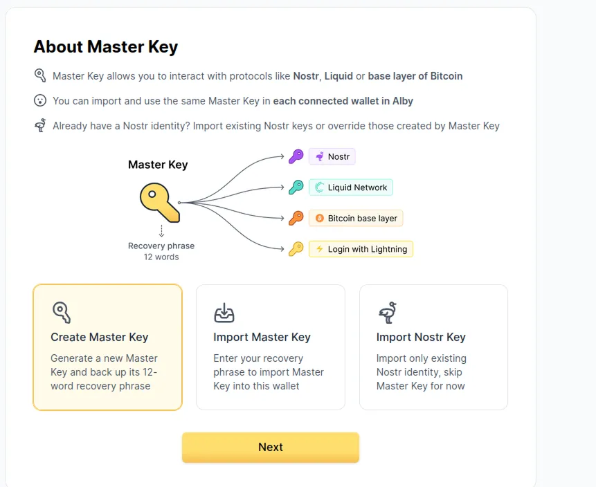

该主密钥由 12 个单词组成，与您的恢复短语相似。我们建议您以安全的方式妥善保存，以确保在需要时能够随时访问。

https://planb.academy/tutorials/wallet/backup/backup-mnemonic-22c0ddfa-fb9f-4e3a-96f9-46e2a7954270

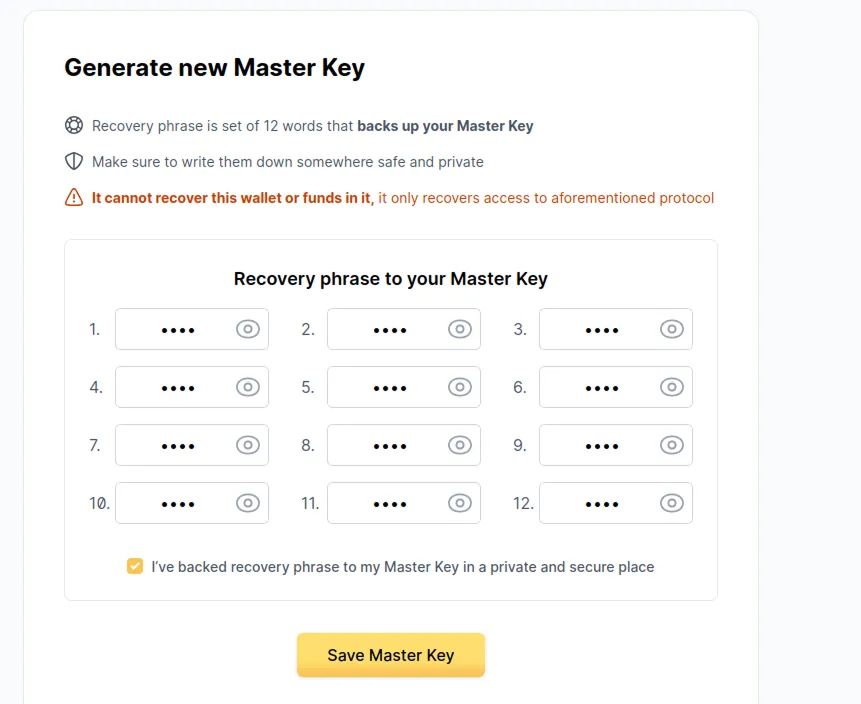

现在，您可以通过 Alby 扩展轻松体验比特币和闪电网络的顺畅支付。如果您喜欢本教程，我们推荐您查看 Alby Hub 教程，学习如何设置自己的 Alby 节点，并通过流畅而强大的界面全面管理您的 Alby 钱包。

https://planb.academy/tutorials/node/lightning-network/alby-hub-62e6356c-6a6d-4134-8f22-c3b6afb9882a
